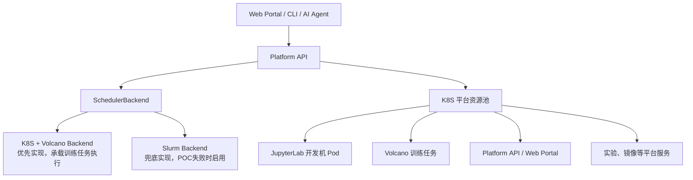
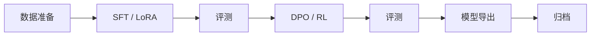
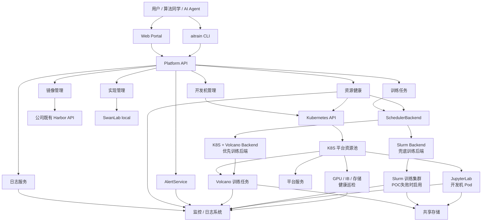

# 需求背景

1. 当前`AI-HPC`模型训练平台基于`OpenSCOW`搭建，底层资源管理和调度使用`Slurm`。该平台已长期缺少持续迭代，技术栈、用户体验、可观测性和自动化能力难以支撑后续`SLM`预训练及后训练业务的发展。

2. 随着公司`SLM`预训练项目推进，训练规模和集群规模明显扩大，现有资源包括 15 台`B300`、30\+ 台`H100`、128 台`H100`、16 台`H200`等多个集群。训练平台需要在一个`SLM`集群上先完成`MVP`替换落地，并逐步对比`AI-HPC`平台，在监控告警覆盖度、故障自愈、实验管理、研发效率和平台可扩展性方面形成优势。

3. 当前算法用户反馈的最大痛点集中在训练稳定性和可观测性。典型问题是`GPU`卡、`IB`端口等硬件异常无法在平台侧提前发现和处理，训练任务失败后，算法同学需要从复杂日志中人工定位故障，再手动下线故障机器、调整训练规模参数和`checkpoint`恢复策略后继续训练，严重影响预训练效率。因此，`MVP`阶段的首要优先级不是堆叠完整平台功能，而是先解决故障提前发现、故障资源调度剔除、资源修复后重新入池、训练过程指标实时观测和异常告警。

# 建设目标

## `MVP`目标

`MVP`阶段优先满足预训练场景，建设一个“算法研发工作台 \+ `K8S + Volcano`训练执行后端 \+ 云原生平台控制面”：

- 提供开发机页面，支持算法同学创建、启动、停止、访问`JupyterLab`开发环境。

- 每个开发机挂载统一共享存储，保证开发、调试、正式训练使用一致的数据和代码路径。

- 提供训练任务`CLI`，当前优先支持`K8S + Volcano`后端，并保留`Slurm`后端兜底扩展能力。

- 提供训练任务状态和日志页面，方便调试、排障和运行监控。

- 建设训练资源健康检测和故障隔离能力，优先覆盖故障`GPU`卡、`IB`端口异常和训练节点关键硬件异常，支持对故障`GPU`卡对应节点进行调度剔除，并在修复验收后将存量资源重新加入调度。

- 建设训练过程核心观测和告警能力，覆盖训练节点磁盘`IO`、`RDMA`网络带宽、网络存储指标、`GPU`温度、功耗、风扇转速等指标，支持训练过程中实时查看和异常告警。

- 集成`SwanLab local`模式，实现实验记录与训练任务自动关联。

- 提供镜像管理能力，方便用户选择、复用和管理开发及训练镜像。

- 优先基于成熟开源项目集成或二次开发，降低研发周期和长期维护成本。

- 对接入层、任务模型和`CLI`做抽象化设计，避免平台与`K8S`或`Slurm`任一底层实现强绑定，为后续多训练后端保留演进空间。

## 非目标

`MVP`阶段不追求一次性建设完整`AI`平台：

- 不优先建设复杂训练任务`Web`创建页面，正式训练任务创建优先通过`CLI`完成。

- 不在训练平台内建设推理服务能力，推理服务沿用既有`K8S + Volcano`平台。

- 不默认引入`Slurm`作为训练执行主链路；只有当`K8S + Volcano`训练`POC`无法满足大规模训练的性能、稳定性或交付周期要求时，才切换为`K8S + Slurm`混合架构。

- 不优先引入`Argo Workflow`，预训练任务以长生命周期分布式训练作业为主，暂不需要复杂`DAG`编排。

- 不优先引入`Ray`，`Ray`更适合数据处理、分布式推理或特定工作流，预训练`MVP`不应强依赖。

- 不优先覆盖完整后训练流水线，后训练涉及微调、`RL`、评测等更复杂工具链，作为后续阶段建设；但平台架构需要保证`K8S + Volcano`后端优先承载这些训练任务，并保留`Slurm`兜底能力。

- 不自研镜像仓库、日志系统、实验管理系统；镜像仓库直接对接公司既有`Harbor`基础设施，日志和实验管理优先集成`Loki`/`ELK`、`SwanLab`等成熟组件。

- 不在`MVP`阶段建设完整多租户、项目管理、资源配额和复杂资源账本能力。`MVP`只保留必要的用户、默认队列和资源归属元数据，保证后续版本可以扩展项目空间、多租户、配额、成本分摊和资源账本。

# 关键技术路线调研

## 大厂训练与推理平台技术栈调研

|**厂商/平台**|**训练侧**|**推理侧**|**结论判断**|**参考资料**|
|---|---|---|---|---|
|`AWS`|官方同时支持`Slurm`和`Amazon EKS`（`K8S`）两种编排选项。`Slurm`路径提供`Slurm-based job scheduling`，`EKS`路径用于容器化大模型训练。|`EKS`路径可承载推理工作负载；`SageMaker Endpoint`属于托管推理服务，底层调度不直接暴露给用户。|`AWS`不是单选`Slurm`或单选`K8S`，而是按客户基础设施形态同时提供`Slurm`和`K8S`。|[Amazon SageMaker HyperPod](https://docs.aws.amazon.com/sagemaker/latest/dg/sagemaker-hyperpod.html)、[HyperPod Slurm](https://docs.aws.amazon.com/sagemaker/latest/dg/sagemaker-hyperpod-slurm.html)、[HyperPod EKS](https://docs.aws.amazon.com/sagemaker/latest/dg/sagemaker-hyperpod-eks.html)、[HyperPod model deployment](https://docs.aws.amazon.com/sagemaker/latest/dg/sagemaker-hyperpod-model-deployment.html)|
|`NVIDIA`|`Run:ai`和开源`KAI Scheduler`明确面向`Kubernetes`上的`AI`工作负载和`GPU`调度。`DGX`/`Base Command Manager`类`HPC/AI`集群管理产品可与不同工作负载管理系统组合，公开资料不等价于“训练只用`K8S`”。|`Grove`面向`Kubernetes`上的拓扑优化推理编排，`Dynamo`、`Triton`、`TensorRT-LLM`等更偏推理运行时和服务框架。|`NVIDIA`在云原生`AI`调度和推理编排上明显走`K8S`路线，但`HPC`训练集群仍允许按部署选择`Slurm`等后端。|[NVIDIA Run:ai Documentation](https://run-ai-docs.nvidia.com/)、[KAI Scheduler](https://github.com/kai-scheduler/KAI-Scheduler)、[Grove](https://github.com/ai-dynamo/grove)、[Dynamo](https://github.com/ai-dynamo/dynamo)、[Triton Inference Server](https://docs.nvidia.com/deeplearning/triton-inference-server/user-guide/docs/)、[TensorRT\-LLM](https://nvidia.github.io/TensorRT-LLM/)|
|`OpenAI`|公开工程博客披露曾将`Kubernetes`扩展到`7500`节点，并用于包括大模型训练在内的研究工作负载。|无公开资料|训练侧公开案例是`K8S`，但这是在强自研平台能力基础上的大规模`K8S`实践，不代表所有企业都应直接照搬。|[Scaling Kubernetes to 7,500 nodes](https://openai.com/index/scaling-kubernetes-to-7500-nodes/)|
|`Anthropic`|公开信息主要披露使用`AWS Trainium`、`Google Cloud TPU`等云算力和专用加速器资源，内部训练调度器是否为`Slurm`或`K8S`未公开。|`Claude`通过自有服务、`Amazon Bedrock`、`Google Vertex AI`等托管形态对外提供，内部推理调度细节未公开。|归类为云厂商托管算力和专用加速器路线，不能作为`Slurm`或`K8S`单一选型依据。|[Amazon and Anthropic partnership](https://www.aboutamazon.com/news/company-news/amazon-anthropic-ai-investment)、[Anthropic and Google Cloud partnership](https://cloud.google.com/transform/anthropic-google-cloud-ai-partnership)、[Claude on Amazon Bedrock](https://platform.claude.com/docs/en/build-with-claude/claude-on-amazon-bedrock)、[Claude on Vertex AI](https://platform.claude.com/docs/en/build-with-claude/claude-on-vertex-ai)|
|字节/火山引擎|公开云产品和云原生生态更多体现`K8S`、批调度、弹性资源池和自研平台能力；内部大模型训练是否统一使用`Slurm`或`K8S`没有完整公开口径。|推理侧更接近在线服务和云原生资源管理形态，通常不会使用`Slurm`作为在线推理服务调度器。|可参考其云原生调度、资源池和训推资源协同思路，但不能简单推断为纯`K8S`或纯`Slurm`。|[火山引擎机器学习平台](https://www.volcengine.com/product/ml_platform)、[火山引擎容器服务 VKE](https://www.volcengine.com/product/vke)|
|阿里云/阿里|公开论文和产品资料显示`PAI`是自研`AI`平台体系，云产品侧更偏托管训练和云原生资源管理；未公开表述为统一使用`Slurm`。|`PAI-EAS`、`RTP-LLM`等属于托管推理服务和自研推理引擎方向，不是`Slurm`型批任务调度。|更接近自研平台、云原生/托管服务路线，不能作为纯`Slurm`路线依据。|[阿里云人工智能平台 PAI](https://help.aliyun.com/zh/pai/)、[DLC 分布式训练任务](https://help.aliyun.com/zh/pai/user-guide/submit-jobs-by-using-the-console)、[EAS 模型在线服务](https://help.aliyun.com/zh/pai/user-guide/model-service-deployment-by-using-the-pai-console)、[RTP\-LLM](https://github.com/alibaba/rtp-llm)|
|腾讯云/腾讯|`TI-ONE`、`Angel`等公开资料更多体现自研训练平台和机器学习框架能力，底层训练调度是否统一使用`Slurm`或`K8S`未公开。|推理侧以托管在线服务和云原生服务治理形态为主，未见公开资料表述为`Slurm`调度。|公开信息不足以判定单一调度器，但可以明确：在线推理不适合按`Slurm`批任务模式建设。|[腾讯云大模型训推平台 TI\-ONE](https://cloud.tencent.com/product/tione)、[TI\-ONE 产品简介](https://cloud.tencent.com/document/product/851/74170)、[Angel](https://github.com/Angel-ML/angel)|

从大厂实践可以得到三个明确结论：

- 训练侧不存在“所有大厂统一使用`Slurm`”或“所有大厂统一使用`K8S`”的单一答案。`AWS`同时提供`Slurm`和`EKS`，`OpenAI`公开案例是大规模`K8S`，`Anthropic`更体现云厂商专用加速器和托管算力路线，阿里、腾讯、字节公开资料更多表现为自研平台和云原生资源管理。

- 推理侧主流不是`Slurm`。在线推理需要服务发现、弹性伸缩、滚动发布、流量治理、低延迟服务治理和多模型服务框架，公开方案更多落在`K8S`、类`K8S/Borg`服务调度、自研在线服务平台或云厂商托管服务上。

- 训推融合不是只看某一个调度器的单点能力，而是统一用户、项目、镜像、观测、审计、`API`以及后续配额和资源账本。当前`MVP`优先验证训练稳定性和可观测性；如果训练和推理都能稳定运行在`K8S`资源池中，平台收益更高；如果训练侧存在短期不可接受的性能或稳定性风险，再按工作负载类型拆分为`Slurm`训练池和`K8S`开发机/推理池。

## 底层核心调度器方案选型

底层核心调度器决定训练任务如何获得`GPU`、节点、网络拓扑、存储和运行时环境。但训练平台选型不能只看调度器本身，还必须同时评估周边工具建设、运维成本、监控告警、可观测性、权限审计、资源健康、后续资源治理、镜像和日志体系、平台`API`集成、后续扩展等完整建设成本。

结合现有`SLM`集群、既有`AI-HPC`迁移路径、公司推理平台已使用`K8S + Volcano`、以及`MVP`需要优先支撑大规模预训练的约束，本方案重点比较四类方案：独立`Slurm`、纯`K8S`、`K8S + Slurm`混合架构、`Slurm on K8S`。

### 评估维度

|**评估维度**|**关注点**|**对本项目的重要性**|
|---|---|---|
|**训练调度成熟度**|是否稳定支持多节点训练、`GPU`资源、节点独占、拓扑约束、`NCCL`/`RDMA`、长周期任务、队列和公平共享。|极高。`MVP`首要目标是支撑`SLM`预训练任务稳定运行。|
|**平台集成成本**|与`Web Portal`、`Platform API`、`aitrain CLI`、任务模型、日志模型、实验管理和镜像管理的集成复杂度。|极高。平台需要提供统一入口，而不是让用户直接面对底层调度器。|
|**周边工具建设成本**|开发机、镜像、日志、实验、监控、告警、资源健康、审计、故障诊断、任务模板和后续资源账本等是否有成熟生态可复用。|高。平台短板主要在产品化和工程化能力。|
|**运维复杂度**|集群部署、升级、故障处理、节点维护、账号权限、网络存储、容器运行时和多组件协同复杂度。|高。训练平台需要长期运行，不能只看首期交付。|
|**监控告警与可观测性**|是否容易采集任务、节点、队列、`GPU`、容器、日志、事件、失败原因和资源利用率。|高。相对`AI-HPC`提升可观测性是核心目标之一。|
|**资源治理扩展性**|是否支持后续按项目、用户、队列、`GPU`、存储、开发机和训练任务扩展统一配额、审计和资源账本。|中。`MVP`不建设完整多租户和资源配额，但任务模型、队列模型和元数据需要预留扩展空间。|
|**迁移和落地风险**|是否能复用现有集群、脚本、镜像、共享存储、队列策略和运维经验。|高。`MVP`需要在一个`SLM`集群上快速试点落地。|
|**后续扩展能力**|是否能支持后训练、评测、训推资源协同、`AI Agent`自动化和多后端接入。|中高。架构必须保留演进空间。|

### 综合对比

#### 独立`Slurm`方案

|**评估维度**|**评估内容**|
|---|---|
|**核心形态**|训练集群完全由`Slurm`管理，平台通过`sbatch`、`squeue`、`sacct`、`scancel`或`slurmrestd`提交、查询和取消任务。|
|**调度与训练执行**|对大规模批训练、`MPI`/`PMI`、`GPU GRES`、节点独占、`QoS`、公平共享、作业依赖、`backfill`、高网拓扑和长期运行任务支持成熟；最贴近现有训练集群。|
|**周边工具和平台集成**|训练执行侧成熟，但平台周边能力弱。开发机、镜像管理、任务页面、实验管理、日志聚合、`API`、`CLI`、故障诊断和资源账本都需要平台层额外补齐。|
|**监控告警与可观测性**|可通过`Slurm exporter`、`sacct`、`squeue`、节点 exporter、`DCGM Exporter`等建设，但需要较多定制，把作业、日志、节点和`GPU`指标关联成用户可理解的诊断视图。|
|**运维和资源治理**|运维团队可复用既有经验，训练侧风险最低；但纯`Slurm`无法自然承载`Web Portal`、开发机、镜像、实验看板等云原生服务，周边服务还要另找承载底座。|
|**主要风险**|平台产品能力建设成本高；用户体验容易停留在`HPC`门户和命令行层面；与推理侧`K8S`平台割裂。|
|**综合判断**|适合作为训练执行后端，但不适合作为完整训练平台唯一底座。|
|**参考资料**|[Slurm Overview](https://slurm.schedmd.com/overview.html)|

#### 3\.2\.2\.2 纯`K8S`方案

|**评估维度**|**评估内容**|
|---|---|
|**核心形态**|训练、开发机、平台服务统一运行在`K8S`，训练调度使用`Volcano`等批调度组件。|
|**调度与训练执行**|使用`Volcano`等批调度组件承载训练，具备`Gang Scheduling`、基础队列、优先级、异构设备和训练框架插件能力；开发、训练、推理资源更容易统一，完整配额能力后续扩展。|
|**周边工具和平台集成**|`K8S`原生生态完善，`CRD`、`Operator`、`Service`、`Ingress`、`Secret`、`PVC`、`RBAC`、镜像、日志、监控、`GitOps`都容易集成，周边工具建设成本最低。|
|**监控告警与可观测性**|可直接复用`Prometheus`、`Grafana`、`Alertmanager`、`kube-state-metrics`、`DCGM Exporter`、`Loki`/`ELK`等成熟体系，容器、事件和日志关联更自然。|
|**运维和资源治理**|运维体系统一，但对`K8S`网络、存储、`GPU Operator`、`CNI`、`CSI`、批调度器和训练容器运行时能力要求高；训练执行风险需要通过专项`POC`验证，而不是直接假设可用。|
|**主要风险**|公司尚未在`K8S`上走通过完整训练流程；大规模预训练的`NCCL`/`RDMA`、拓扑、长周期稳定性、作业记账、故障恢复和`checkpoint`吞吐需要重新验证。|
|**综合判断**|平台长期收益最高，应作为目标优先路线。前提是在`MVP`前置阶段完成训练闭环`POC`，验证通过后进入主线实施。|
|**参考资料**|[Volcano Introduction](https://volcano.sh/docs/home/introduction/)、[Kubernetes Device Plugins](https://kubernetes.io/docs/concepts/extend-kubernetes/compute-storage-net/device-plugins/)、[NVIDIA GPU Operator](https://docs.nvidia.com/datacenter/cloud-native/gpu-operator/latest/index.html)|

#### `K8S + Slurm`混合方案

|**评估维度**|**评估内容**|
|---|---|
|**核心形态**|`Slurm`负责大规模训练执行，`K8S`负责开发机、`Web Portal`、`Platform API`、日志、实验、镜像和控制面。|
|**调度与训练执行**|保留现有`Slurm`训练稳定性和高性能网络调度能力；`K8S`不承担核心训练调度，降低大规模训练迁移风险。|
|**周边工具和平台集成**|平台能力由`K8S`承载，训练执行由`Slurm`承载，周边工具可以按成熟生态组合：`JupyterLab Pod`、`Harbor`、`SwanLab`、`Prometheus`、`Grafana`、`Loki`/`ELK`、`DCGM Exporter`、`Slurm exporter`等。平台通过`SchedulerBackend`屏蔽底层差异。|
|**监控告警与可观测性**|需要同时接入`K8S`和`Slurm`两套观测数据，但可以在平台层统一任务`ID`、用户、项目、日志目录、实验`ID`和资源指标，最终给用户统一视图。|
|**运维和资源治理**|运维复杂度中等：保留现有`Slurm`运维体系，同时新增`K8S`平台服务运维。后续资源治理需要统一用户、项目、配额、账本和审计，但可逐步建设，不要求首期重构训练资源池。|
|**主要风险**|两套资源管理面需要打通，开发机和训练任务之间必须治理镜像、路径、权限、环境变量和共享存储一致性。|
|**综合判断**|适合作为`K8S`训练`POC`失败或短期无法达标时的兜底方案。它训练侧风险更低，但平台技术栈更复杂，长期收益低于纯`K8S`。|
|**参考资料**|[Slurm Overview](https://slurm.schedmd.com/overview.html)、[Volcano Introduction](https://volcano.sh/docs/home/introduction/)|

#### `Slurm on K8S`方案

|**评估维度**|**评估内容**|
|---|---|
|**核心形态**|通过`Slinky slurm-operator`、`CoreWeave SUNK`、`Nebius Soperator`等方案，把`Slurm`控制面、登录节点、计算节点以`K8S Pod`/`CRD`/`Helm`方式部署和管理；部分方案通过`slurm-bridge`让`K8S`工作负载由`Slurm`分配资源。|
|**调度与训练执行**|理论上可同时保留`Slurm`作业语义和`K8S`资源管理能力，使训练、推理和平台服务有机会共享同一批`K8S GPU`节点。|
|**周边工具和平台集成**|平台服务、训练资源、监控、日志、存储和节点生命周期有机会纳入统一`K8S`运维面，但需要对`Slurm Operator`、登录节点、计算节点、作业目录和平台任务模型做深度适配。|
|**监控告警与可观测性**|可复用`K8S`可观测体系，同时接入`Slurm`指标和日志；但需要额外治理`Slurm Pod`、计算节点、作业日志、容器日志、`GPU`指标和底层网络存储指标之间的关联关系。|
|**运维和资源治理**|运维复杂度最高：需要同时理解和维护`K8S`、`Slurm Operator`、`Slurm`、`CNI`、`CSI`、`GPU Operator`、容器运行时、账号体系、存储体系和高性能网络。|
|**主要风险**|对已有`Slurm`集群迁移风险高；需要重新验证`NCCL`/`RDMA`、`IB/RoCE`、`GPU`拓扑、共享存储、`checkpoint`吞吐、`Slurm accounting`和安全隔离；部分能力仍有整节点分配和特定`DRA`驱动依赖等限制。|
|**综合判断**|适合作为新建`K8S`原生`GPU`资源池、云上弹性训练或训推共池的中长期专项`PoC`，不适合作为当前`MVP`默认方案。|
|**参考资料**|[Slinky Docs](https://slinky.schedmd.com/docs/)、[Slinky slurm\-operator](https://slinky.schedmd.com/slurm-operator/v1.1.0/)、[Slinky slurm\-bridge](https://slinky.schedmd.com/slurm-bridge/v1.1.0/)、[CoreWeave SUNK](https://docs.coreweave.com/products/sunk)、[Nebius Soperator](https://github.com/nebius/soperator)|

### 选型结论

从完整平台建设视角看，当前不是单纯选择“哪个调度器功能最多”，而是在以下目标之间做平衡：

- 大规模预训练执行必须稳定，`K8S + Volcano`需要先验证`NCCL`/`RDMA`性能、拓扑调度、`Gang Scheduling`、长周期稳定性和故障恢复，不能只凭生态判断直接替换。

- **平台短板**主要在开发机、门户、任务`API`、日志诊断、实验管理、镜像管理、资源健康、故障自愈和自动化入口，这些能力更适合由`K8S`和云原生生态统一承载。

- 公司推理平台已经使用`K8S + Volcano`，如果训练平台也采用同一技术底座，训练和推理在镜像、观测、权限、资源队列、运维工具和平台`API`上可以复用更多能力，整体技术栈反而更简单。

- `K8S + Slurm`混合方案训练侧风险更低，但会长期引入两套调度域、两套运维知识、两套状态和日志映射，以及后续两套资源配额治理逻辑。除非`K8S`训练`POC`无法达标，否则不应作为默认目标态。

- 多租户、项目管理和资源配额不进入`MVP`交付范围，但平台需要统一建模用户、默认队列、开发机、训练任务、`GPU`、存储和审计记录，为后续项目空间、配额、资源账本和成本分摊扩展保留接口。纯`K8S`路径优先预留到`Volcano Queue`；混合兜底路径再预留到`Slurm account/QoS/TRES`。

因此，本方案最终选择“**纯`K8S`优先，`K8S + Slurm`兜底**”的路线：

- `MVP`主线优先采用`K8S + Volcano`作为训练执行后端，同时由`K8S`承载开发机、平台控制面、日志、实验入口、镜像管理、资源健康检测、故障隔离和监控告警组件。

- 在`MVP`正式展开前设置训练闭环`POC`作为准入门槛，只有当`K8S + Volcano`通过核心训练场景验证后，才进入纯`K8S`主线实施。

- 平台层仍建设统一的`SchedulerBackend`、任务状态模型、日志模型、资源使用记录、用户项目权限和审计模型，并为后续资源账本扩展保留接口，避免上层入口绑定具体调度器。

- `Slurm Backend`作为兜底能力保留设计位置。当`K8S`训练`POC`无法满足性能、稳定性或落地周期要求时，再切换为`K8S + Slurm`混合架构，由`Slurm`承载训练执行。

该选择不是否定`Slurm`在大规模训练上的成熟能力，而是从完整平台收益出发，将“是否必须引入`Slurm`”前置为可验证问题。只有在`K8S`训练闭环验证失败时，才接受混合架构带来的长期复杂度。

## 推荐路线设计



本方案采用纯`K8S`优先路线。`K8S`负责容器化开发机、平台控制面和训练任务执行，训练调度优先使用公司已有经验的`Volcano`。`CLI`、`Web`页面、`AI Agent`等上层入口不直接绑定`kubectl`、`Volcano`或`Slurm`，而是统一调用`Platform API`。`Platform API`内部通过`SchedulerBackend`接口适配不同底层调度系统。

该设计可以最大化复用推理平台已有`K8S + Volcano`经验，让训练、推理、开发机和平台服务在镜像、日志、监控、权限、队列、资源健康和运维工具上更统一。`Slurm Backend`保留为兜底后端：如果`K8S`训练`POC`未通过，可以切换为`Slurm`承载训练执行，并继续复用同一套`CLI`、任务模型、状态模型、日志接口和权限体系。

## 为什么优先采用纯`K8S`架构

`Slurm`在`HPC`和大规模训练领域非常成熟，尤其在高性能网络、拓扑感知调度、批任务资源管理方面有明显优势。

但从整个平台能力建设看，训练平台不仅包含训练调度，还包含开发机、镜像管理、任务页面、日志聚合、实验管理、权限隔离、资源健康和监控告警等平台化能力。如果训练执行也能在`K8S + Volcano`上跑通，纯`K8S`方案可以显著降低长期技术栈复杂度，训练和推理也能在同一套云原生资源治理体系下演进。

因此，本方案将纯`K8S`作为优先目标架构，`K8S + Slurm`作为训练闭环验证失败后的兜底方案。

### 纯`K8S`优先的收益

纯`K8S`路线的主要收益不是某个单点调度能力更强，而是整体平台复杂度更低：

- 训练、推理、开发机和平台服务统一使用`K8S`资源模型、镜像体系、日志体系、监控体系和权限模型。

- 公司推理平台已使用`K8S + Volcano`，训练平台可以复用既有`Volcano Queue`、批调度、节点状态管理和运维经验。

- 平台不需要长期维护`Slurm`和`K8S`两套状态机、日志路径、资源健康状态和权限映射。

- 训练任务可以天然接入`K8S`事件、`Pod logs`、`kube-state-metrics`、`DCGM Exporter`、`Prometheus`、`Grafana`和`Loki`/`ELK`等云原生观测能力。

- 后续后训练、微调、评测、自动化任务和`AI Agent`调用可以复用同一套`Platform API`和任务编排模型。

### 必须先验证的训练能力

**当前纯`K8S`路线最大的风险，是公司还没有在`K8S`上走通过完整训练流程。因此，技术选型不能直接跳到实施阶段，必须先做训练闭环`POC`。**`POC`至少覆盖：

- 单机单卡训练跑通。

- 单机多卡训练跑通。

- 多机多卡`PyTorch DDP`训练跑通。

- 典型预训练框架或脚本跑通，例如`Megatron`/`Nemotron`类任务。

- `Volcano`队列、优先级、`Gang Scheduling`和基础调度准入验证通过。

- `NCCL`/`RDMA`性能与现有基线对比，差距在业务可接受范围内。

- 共享存储、数据读取、`checkpoint`写入和恢复训练验证通过。

- 故障`GPU`卡、异常`IB`端口、训练节点磁盘`IO`异常和网络存储异常可以被平台采集、识别并触发告警。

- 故障`GPU`卡对应节点可以被自动或半自动标记为不可调度，训练任务不会继续调度到故障节点；修复验收通过后，节点可以重新加入调度。

- 任务失败后的状态、日志、事件、退出码和诊断信息可被平台统一采集。

只有这些能力验证通过，`K8S + Volcano`才能作为`MVP`训练执行主后端。

### `K8S + Slurm`兜底触发条件

如果训练闭环`POC`出现以下情况，应切换为`K8S + Slurm`混合方案：

- 多机多卡训练无法稳定运行，且短期无法定位或修复。

- `NCCL`/`RDMA`性能明显低于现有`Slurm`基线，影响预训练效率。

- `Volcano`在队列、`Gang Scheduling`、基础调度准入、抢占或拓扑调度上无法满足当前训练诉求。

- 长周期训练、失败恢复、日志诊断或`checkpoint`吞吐无法满足`MVP`交付要求。

- 运维团队短期无法承接`K8S`训练执行面的网络、存储、`GPU Operator`、`CNI`、`CSI`和批调度复杂度。

触发兜底后，`K8S`继续承载开发机和平台控制面，`Slurm`承载训练任务执行。平台上层不变化，仍通过`SchedulerBackend`屏蔽后端差异。

### 未来后训练和微调对底层架构的影响

后训练、微调、`RL`、评测等需求不必然要求引入`Slurm`。多数后训练任务本质仍是批处理训练、批处理评测或阶段化流水线任务，可以由`K8S + Volcano`通过队列、`Gang Scheduling`、任务模板、`PVC`挂载和平台工作流编排来承载。

真正需要补齐的是平台层的任务模板、参数管理、任务依赖和工作流编排能力。例如：



该链路可以由平台工作流层编排，每个训练或评测`step`默认提交为`K8S + Volcano`任务。后续如果某些`step`更适合`Ray`、普通`K8S Job`或`Slurm`兜底后端，也可以通过`SchedulerBackend`或`TaskBackend`扩展承载，而不需要推翻整体架构。

### 未来`AI Agent`自动化调用需要稳定`API`

`CLI`化的接入层后续可以暴露给`AI Agent`等系统调用，实现自动化训练任务创建和管理。`Agent`不应直接调用`kubectl`、`sbatch`或底层调度器命令，而应调用平台提供的稳定`API`和`CLI`。

因此，`Platform API`需要提供统一的训练任务规格、状态模型、日志模型、错误码和幂等提交能力。底层`K8S + Volcano`、`Slurm`或其他后端只是执行适配器，不能泄漏为上层调用方的强依赖。

### 结论：纯`K8S`优先，`Slurm`兜底

本方案建议：

- `MVP`主线优先采用纯`K8S`架构。

- `K8S`负责开发机、平台控制面和训练任务执行。

- `Volcano`作为训练批调度组件，承载基础队列、优先级、`Gang Scheduling`、故障节点规避和训练任务调度；完整配额能力后续扩展。

- `Slurm`不作为默认主线，仅作为`K8S`训练`POC`失败后的兜底训练后端。

- 平台设计保留`SchedulerBackend`抽象，确保切换`K8S + Volcano`或`Slurm`后端时，上层`Web`、`CLI`、`AI Agent`和任务模型保持稳定。

- 近期最重要的工程任务不是直接引入`Slurm`，而是尽快完成`K8S + Volcano`完整训练流程验证。

# 技术架构

## 总体架构



## 核心原则

- **统一上层入口**：`Web`、`CLI`、`AI Agent`都调用`Platform API`。

- **调度后端可替换**：通过`SchedulerBackend`适配`Slurm`、`K8S + Volcano`等后端。

- **纯`K8S`优先**：`K8S`承载`JupyterLab`开发机、平台服务和`MVP`阶段训练执行，`Volcano`作为训练批调度组件。

- **`Slurm`兜底**：仅当`K8S + Volcano`训练`POC`无法达标时，才启用`Slurm Backend`承载训练执行。

- **稳定性优先**：`MVP`优先解决故障`GPU`、`IB`端口异常、训练节点异常和存储异常导致的训练失败问题，平台需要具备发现、告警、调度剔除和资源恢复入池能力。

- **开发训练环境一致**：开发机和训练任务使用统一镜像/容器规范、共享存储和路径约定。

- **优先集成成熟组件**：开发机、镜像仓库、调度、日志、监控、实验管理尽量复用开源能力。

- **`MVP`功能克制**：优先打通预训练核心闭环，不在第一阶段引入复杂工作流、后训练全链路、完整多租户和资源配额。

## 功能概览

## 训练流程

# 组件构成

## `Web Portal`

`Web Portal`是算法同学的主要入口，`MVP`阶段至少提供以下页面：

|**页面**|**主要内容**|**`MVP`能力**|
|---|---|---|
|**开发机列表**|`JupyterLab`开发机状态、资源规格、镜像、创建时间、访问入口。|支持查看开发机状态、启动/停止开发机、进入`JupyterLab`。|
|**开发机创建**|镜像、`CPU`、内存、`GPU`、共享存储挂载。|支持按预置规格创建开发机，并挂载统一共享存储。|
|**训练任务列表**|任务状态、提交人、镜像、资源、运行时长。|支持按用户、状态、时间和任务名称筛选任务，快速查看任务运行概况。|
|**训练任务详情**|任务规格、运行实例、事件、状态流转、失败原因。|支持查看任务配置、调度信息、执行状态和失败诊断信息。|
|**训练日志**|角色、实例、时间范围、关键字。|支持按任务、角色和实例查看日志，并支持关键字检索。|
|**资源健康**|节点、`GPU`卡、`IB`端口、存储挂载和调度状态。|支持查看故障资源、隔离状态、恢复验收状态和关联训练任务。|
|**监控告警**|训练任务关键指标、资源异常、告警历史和看板跳转。|支持查看训练期间`GPU`、磁盘`IO`、`RDMA`和网络存储异常，跳转到`Grafana`或日志系统。|
|**镜像管理**|可用镜像、标签、用途、基础环境、扫描状态。|支持镜像创建、查询、更新、删除和预置开发/训练镜像选择。|
|**实验入口**|`SwanLab`实验结果查看入口。|支持从训练任务跳转或代理访问对应`SwanLab`实验结果。|

`MVP`阶段训练任务创建可以不在`Web`上实现复杂表单，仅保留“查看”和“调试”能力。任务创建优先通过`CLI`完成。

## `Platform API`

`Platform API`是平台控制面，负责用户认证、权限校验、资源编排、任务元数据管理和后端适配。

核心业务模块包括：

|**业务模块**|**主要职责**|
|---|---|
|**多用户管理**|管理平台用户身份、登录态、用户基础信息、外部账号映射和用户启停状态；`MVP`不建设多租户或项目管理功能。|
|**权限管理**|校验用户在开发机、训练任务、镜像和实验等资源上的操作权限，`MVP`阶段按用户维度控制资源可见性和操作权限。|
|**资源治理预留**|`MVP`不实现完整多租户、项目管理和资源配额，但保留队列、资源规格、资源使用记录和审计字段，供后续扩展。|
|**开发机管理**|管理开发机创建、启动、停止、状态查询、访问入口和空闲回收。|
|**训练任务管理**|管理训练任务创建、查询、更新、删除、取消、状态聚合、任务元数据和运行记录。|
|**镜像管理**|管理镜像创建、查询、更新、删除、镜像元数据、镜像标签、适用场景和镜像可用性校验。|
|**日志管理**|提供任务日志查询、日志流式输出、关键字检索和日志定位能力。|
|**实验管理**|管理`SwanLab`日志路径、实验结果查看入口和训练任务关联关系；前期基于规范化文件路径展示，后续对接其他存储服务。|
|**资源健康管理**|汇聚`GPU`、`IB/RDMA`、磁盘`IO`、网络存储和节点健康状态，维护资源健康状态机。|
|**故障处置管理**|对故障`GPU`对应节点执行调度剔除、恢复验收和重新入池，记录处置过程和关联任务。|
|**监控告警管理**|维护关键指标、告警规则、告警历史和任务详情页看板链接。|
|**调度后端适配**|屏蔽`Slurm`、`K8S + Volcano`等底层调度差异，提供统一任务提交、查询、取消和日志接口。|

## `aitrain CLI`

`CLI`是正式训练任务创建的优先入口，也需要面向`AI Agent`自动化调用设计。

建议命令结构：

```Bash
aitrain auth login
aitrain workspace list
aitrain workspace create
aitrain workspace stop
aitrain image list
aitrain job validate -f train.yaml
aitrain job dry-run -f train.yaml --backend volcano
aitrain job submit -f train.yaml --output json
aitrain job list --project slm
aitrain job status job-xxx --output json
aitrain job logs job-xxx --role worker --replica 0 --tail 200
aitrain job cancel job-xxx
```

`CLI`设计要求：

- 支持`YAML`/`JSON`任务规格。

- 支持`--output json`，方便`AI Agent`和自动化系统解析。

- 支持`--yes`或非交互模式。

- 支持`validate`和`dry-run`，提交前进行参数校验和后端渲染预览。

- 不直接访问`K8S`或`Slurm`，统一调用`Platform API`。

- 错误码和错误结构稳定，方便自动化重试和排障。

## `SchedulerBackend`

`SchedulerBackend`不是本调研阶段需要详细设计的接口层，而是用于说明平台不应把上层入口直接绑定到某一个调度器。其核心价值是：`Web Portal`、`Platform API`和`aitrain CLI`面向统一的训练任务模型，底层优先选择`K8S + Volcano`，并保留`Slurm`等兜底或扩展后端。

|**关注点**|**调研判断**|
|---|---|
|**建设定位**|作为调度后端适配层，隔离上层平台能力和底层调度系统差异。|
|**`MVP`选择**|优先适配`K8S + Volcano`，在正式实施前通过训练闭环`POC`验证多机多卡训练、`NCCL`/`RDMA`性能、基础队列调度、故障检测、调度剔除和恢复入池能力。|
|**后续扩展**|保留`Slurm`后端兜底空间，用于`K8S`训练`POC`失败、短期性能不达标或特定训练场景必须依赖`Slurm`的情况。|
|**上层影响**|`Web`、`CLI`和`AI Agent`不直接感知底层是`Slurm`还是`K8S`，统一通过平台任务模型提交、查询、取消和查看日志。|
|**主要收益**|避免平台能力与单一调度器强绑定，降低后续技术路线调整成本。|
|**主要风险**|多后端保留会带来状态映射、日志关联、资源健康状态和故障诊断的一致性治理成本，需要在实施阶段专项设计。|

## 开发机组件

开发机用于代码开发、小样本调试、依赖验证和训练任务提交。结合已有简要版`K8S + JupyterLab Pod`开发机`MVP`，本方案建议继续采用轻量自研开发机管理能力，不在`MVP`主链路直接引入`JupyterHub`、`Kubeflow Notebooks`、`code-server`或`OpenVSCode Server`。

已有`MVP`已验证的开发机形态如下：

|**能力项**|**`MVP`实现方式**|**调研结论**|
|---|---|---|
|**实例模型**|每个用户最多一个活跃开发机实例，状态包括`creating`、`running`、`stopping`、`stopped`、`failed`。|能满足首期开发机生命周期管理，后续再扩展多实例和项目级配额。|
|**`K8S`资源**|每个实例对应`Pod`、`Service`、`Ingress`；命名约定为`jupyterlab-{username}`、`svc-jupyterlab-{username}`、`jupyter-{token}`。|资源模型清晰，适合作为`MVP`继续演进。|
|**访问方式**|通过`/jupyter/{token}/`访问`JupyterLab`，`Ingress`转发到用户对应的`Service:8888`。|已验证`JupyterLab`访问链路；产品化阶段需要叠加平台鉴权、审计和链接有效期控制。|
|**资源规格**|规格包含`CPU`、内存、`GPU`、`GPU`资源类型、`nodeSelector`和`tolerations`。|可支持`CPU`开发机和小规格`GPU`开发机。|
|**共享存储**|所有开发机挂载同一个`ReadWriteMany PVC`，用户目录和公共目录通过`subPath`隔离。|适合`MVP`，但生产阶段需要继续补齐容量配额、审计和目录治理。|
|**用户环境**|容器按`NB_USER`、`NB_UID`、`NB_GID`启动用户环境，并将`/data/home/{username}`软链到`/home/{username}`。|符合`Jupyter`官方镜像习惯，便于保留真实用户名和持久化`home`目录。|
|**空闲回收**|定时检查`JupyterLab`内核活跃状态，默认`48`小时闲置后回收实例。|可作为`MVP`资源回收策略，后续补充用户通知和保留策略配置。|
|**异常清理**|创建失败、`Pod Failed`或超时后清理已创建的`Pod`、`Service`、`Ingress`。|能降低孤儿资源风险，后续需要接入告警和运维诊断页面。|

# 组件设计

## 存储与目录设计

### 共享存储挂载

已有开发机`MVP`采用`NFS + PV + PVC`方式提供共享存储能力。`K8S`中使用一个`ReadWriteMany PVC`作为开发机共享存储入口，开发机`Pod`通过`subPath`分别挂载用户目录和公共目录。

|**存储对象**|**`MVP`约定**|**说明**|
|---|---|---|
|**`PV`**|`jupyter-pv`|指向外部`NFS`或测试环境中的`NFS Server`，回收策略为`Retain`。|
|**`PVC`**|`pvc-jupyter-shared`|位于`jupyter`命名空间，供所有开发机实例共享挂载。|
|**用户目录挂载**|`subPath: data/home`挂载到容器`/data/home`|用户个人目录为`/data/home/{username}`。|
|**公共目录挂载**|`subPath: share`挂载到容器`/share`|用于公共数据、样例数据、共享素材或跨用户协作文件。|
|**开发机访问**|`/home/{username}`软链到`/data/home/{username}`|兼容`Jupyter`镜像和用户习惯，同时保证数据落到共享存储。|

该模式已验证开发机停止、重启和重建后，用户目录数据仍可保留。后续训练任务优先以`K8S + Volcano`方式运行，训练`Pod`应挂载同一套`PVC`或同一底层共享存储，保证开发机、调试任务和正式训练任务路径一致。如果触发`Slurm`兜底，`Slurm`训练集群也需要挂载同一套底层共享存储，或通过绑定挂载/软链提供相同的逻辑路径，避免出现“开发机路径可用、训练任务路径不可用”的问题。

### 目录规范

结合已有`MVP`，建议将`/data/home/{username}`和`/share`作为训练平台的基础目录约定：

|**路径**|**用途**|**说明**|
|---|---|---|
|`/data/home/{username}`|用户个人持久化目录|开发机`home`数据实际落盘位置，按用户隔离。|
|`/home/{username}`|开发机容器内用户`home`入口|软链到`/data/home/{username}`，主要用于兼容`Jupyter`镜像习惯。|
|`/data/home/{username}/workspace`|用户工作目录|建议用于代码开发、小样本调试和任务提交配置。|
|`/data/home/{username}/outputs/{job_id}`|训练输出目录|建议用于保存训练任务输出，便于用户在开发机中直接查看。|
|`/data/home/{username}/outputs/{job_id}/logs`|训练日志目录|用于归档平台日志、`Pod`日志、调度事件和兜底`Slurm`标准输出/错误日志。|
|`/data/home/{username}/outputs/{job_id}/checkpoints`|`checkpoint`目录|用于保存模型断点和可恢复训练产物。|
|`/data/home/{username}/outputs/{job_id}/swanlog`|`SwanLab local`日志目录|用于实验记录和本地实验看板。|
|`/share`|公共共享目录|用于公共数据、样例数据和跨用户共享文件；生产阶段需要配合权限和审计策略。|

如果现有`HPC`共享存储已经使用`/data/hpc/home/{user}`等路径，建议在平台试点集群中统一提供兼容层，例如将`/data/home`绑定或软链到实际`HPC`用户目录，而不是让开发机和训练任务暴露两套路径规范。

### 权限隔离

已有`MVP`采用`UID/GID`隔离用户目录：

- 平台为用户分配容器内`UID/GID`，当前实现为`10000 + users.id`。

- `initContainer`在主容器启动前创建`/data/home/{username}`。

- 用户目录权限设置为`700`，归属到该用户的`UID/GID`。

- 主容器按`NB_USER`、`NB_UID`、`NB_GID`启动`JupyterLab`用户环境。

- 启动脚本将`/data/home/{username}`软链到`/home/{username}`。

该方式已经验证可以保留真实用户名和持久化用户目录。需要注意的是，当前开发机容器需要以`root`启动完成目录初始化和用户切换，产品化阶段应继续收敛权限边界，明确哪些逻辑放在`initContainer`中完成，哪些逻辑由非特权用户运行。

公共目录`/share`在`MVP`中用于跨用户共享文件。生产阶段建议对`/share`补充更明确的权限策略，例如按项目拆分子目录、设置`sticky bit`或使用`ACL`，避免用户误删他人共享文件。

### 与训练任务的路径一致性

已有开发机`MVP`主要验证了`K8S`开发机侧的目录和持久化能力。训练平台落地时，还需要保证`K8S + Volcano`训练任务看到相同的逻辑路径；如果启用`Slurm`兜底，也需要保证`Slurm`训练任务看到相同路径。

|**场景**|**要求**|
|---|---|
|**开发机调试**|代码、配置、小样本数据默认放在`/data/home/{username}/workspace`或用户自定义子目录。|
|**`CLI`提交**|任务规格中的工作目录和输出目录应使用平台统一路径，不依赖开发机容器临时路径。|
|**`K8S + Volcano`执行**|训练`Pod`应通过`PVC`或底层共享存储访问`/data/home/{username}`和`/share`。|
|**`Slurm`兜底执行**|训练节点应能访问`/data/home/{username}`和`/share`，或通过兼容层映射到同一底层存储。|
|**日志和实验**|任务日志、`checkpoint`和`SwanLab local`日志建议落在`/data/home/{username}/outputs/{job_id}`下，便于开发机直接查看和排障。|

### `JuiceFS`评估

`JuiceFS`可作为后续数据加速层验证项，但不建议作为`MVP`主路径强依赖。`MVP`先复用现有`NFS`/`HPC`共享存储，优先验证训练调度、开发机、镜像、日志、实验管理闭环。

后续单独评估：

- 数据集读取吞吐。

- `checkpoint`写入性能。

- 元数据性能。

- 多任务并发能力。

- 故障恢复和一致性。

## 训练任务设计

### 统一任务规格

平台需要定义与底层后端无关的`TrainingJobSpec`。

示例：

```YAML
apiVersion: ai-hpc.msxf/v1alpha1
kind: TrainingJob
metadata:
  name: slm-pretrain-demo
  owner: zhangsan
spec:
  framework: pytorch
  backend: volcano
  image: aiharbor.msxf.local/ai/pytorch:2.7.1-cuda12.8
  command:
    - bash
    - scripts/pretrain.sh
  resources:
    nodes: 4
    gpusPerNode: 8
    cpuPerNode: 64
    memoryPerNode: 512Gi
  storage:
    workspace: /data/home/zhangsan/workspace/slm
    output: /data/home/zhangsan/outputs/${JOB_ID}
  env:
    NCCL_DEBUG: INFO
    SWANLAB_MODE: local
  experiment:
    enabled: true
    provider: swanlab
    project: slm-pretrain
  scheduling:
    queue: slm-pretrain
    priority: normal
    maxTime: "72:00:00"
    topology:
      mode: soft
  healthPolicy:
    avoidUnhealthyNodes: true
    requireHealthyRDMA: true
```

关键字段说明：

|**字段**|**含义**|**说明**|
|---|---|---|
|`metadata.owner`|用户归属|用于权限、任务归属和审计；`MVP`不要求填写平台项目。|
|`spec.backend`|调度后端|`MVP`默认使用`volcano`，当`K8S`训练`POC`失败或特定场景需要兜底时可使用`slurm`。|
|`spec.resources`|资源规格|描述节点数、单节点`GPU`、`CPU`和内存。|
|`spec.storage`|存储路径|约束开发机和训练任务使用一致路径。|
|`spec.experiment`|实验配置|控制`SwanLab`等实验系统注入。|
|`spec.scheduling`|调度策略|表达队列、优先级、运行时长和拓扑约束。|
|`spec.healthPolicy`|健康约束|表达是否规避故障节点、是否要求`RDMA`健康等训练稳定性约束。|

### `K8S + Volcano`渲染

`K8S + Volcano Backend`作为优先训练后端，将`TrainingJobSpec`转换为：

- `Volcano Job`。

- `ConfigMap`：训练脚本、环境配置。

- `Secret`：镜像拉取、凭证、敏感配置。

- `PVC`挂载：共享存储。

- `Labels`/`Annotations`：任务`ID`、项目、用户、实验`ID`、日志采集标识。

- `Service`：分布式训练服务发现。

- `PodGroup`/队列配置：表达`Gang Scheduling`、队列、优先级和后续资源配额扩展。

- `NodeAffinity`/`Toleration`/调度准入配置：避开被标记为`GPU`故障、`IB/RDMA`异常、存储异常或健康状态未知的节点。

`PyTorch`分布式训练优先使用`Volcano PyTorch Plugin`：

- 自动设置`MASTER_ADDR`。

- 自动设置`MASTER_PORT`。

- 自动设置`WORLD_SIZE`。

- 自动设置`RANK`。

- 创建服务发现所需`Service`。

- 支持`worker`等待`master`。

平台需要在`K8S`对象上统一注入`job_id`、项目、用户、镜像、训练框架、输出路径和实验路径等元数据，方便后续日志、事件、指标和实验记录关联。

### `Slurm`兜底渲染

如果`K8S + Volcano`训练`POC`未通过，`Slurm Backend`将`TrainingJobSpec`转换为：

- 作业运行目录：保存平台任务规格、渲染后的脚本、环境变量、日志和运行元数据。

- `sbatch`脚本：描述作业名、队列、节点数、每节点`GPU`数、`CPU`、内存、最大运行时间、输出日志路径等。

- 运行环境脚本：设置`NCCL`、`SwanLab`、共享存储路径、`checkpoint`路径、项目目录等环境变量。

- 运行环境启动命令：`Slurm`侧采用`Apptainer`运行训练镜像，平台在`Slurm Backend`中统一封装`Apptainer`启动参数、共享存储挂载、环境变量和训练命令。

- 平台元数据：记录平台`job_id`、`Slurm job_id`、用户、项目、镜像、训练框架、输出路径和实验路径。

示例渲染结果：

```Bash
#!/bin/bash
#SBATCH --job-name=slm-pretrain-demo
#SBATCH --partition=slm-pretrain
#SBATCH --nodes=4
#SBATCH --gres=gpu:8
#SBATCH --cpus-per-task=64
#SBATCH --mem=512G
#SBATCH --time=72:00:00
#SBATCH --output=/data/home/zhangsan/outputs/${JOB_ID}/logs/slurm-%j.out
#SBATCH --error=/data/home/zhangsan/outputs/${JOB_ID}/logs/slurm-%j.err

set -euo pipefail

export JOB_ID="${PLATFORM_JOB_ID}"
export SWANLAB_MODE=local
export SWANLAB_LOGDIR="/data/home/zhangsan/outputs/${JOB_ID}/swanlog"
export NCCL_DEBUG=INFO

cd /data/home/zhangsan/workspace/slm
srun bash scripts/pretrain.sh
```

`Apptainer`（原项目名为`Singularity`）是面向`HPC`场景的非特权容器运行时，适合在多用户`Slurm`集群中运行容器化训练任务。它可以降低训练任务对宿主机`module`、`Conda`和系统库的强依赖，提升训练环境可复现性，并尽量缩小`K8S`开发机镜像与`Slurm`训练环境之间的差异。

> 本方案不建议在`Slurm`训练任务中直接使用`Docker`或`containerd`。`Docker`通常依赖常驻`daemon`，直接开放给多用户`HPC`环境会带来权限和安全风险；`containerd`是偏底层的容器运行时，更适合作为`K8S`节点运行时，而不是直接面向`Slurm job`、用户身份、作业记账、`cgroup`约束和`HPC`共享存储的训练任务入口。因此，`K8S`侧开发机和平台服务使用`containerd`等标准`K8S`运行时，`Slurm`侧训练任务使用`Apptainer`。
> 
> 

### 任务状态模型

平台统一任务状态：

|**状态**|**含义**|
|---|---|
|`Created`|任务已在平台侧创建，但尚未提交到底层调度系统。|
|`Queued`|任务已提交到底层调度系统，正在队列中等待资源。|
|`Pending`|任务正在调度、拉取镜像、准备运行环境或等待依赖条件满足。|
|`Running`|任务已经开始执行。|
|`Succeeded`|任务正常完成。|
|`Failed`|任务执行失败或底层调度系统返回失败状态。|
|`Cancelled`|任务被用户或平台主动取消。|
|`Unknown`|平台暂时无法确认任务状态，需要进一步诊断。|

`K8S + Volcano Backend`负责把`Volcano Job`、`Pod`、`Event`映射到上述状态；`Slurm Backend`在兜底路径下负责把`Slurm job`状态映射到上述状态。页面和`CLI`不直接暴露底层复杂状态，但任务详情页可以展示底层诊断信息。

### 任务日志

`MVP`阶段日志能力：

- 支持按`Job`查询聚合日志。

- 支持按角色过滤：`master`、`worker`。

- 支持按`replica`过滤。

- 支持`tail`、`follow`。

- 支持关键字搜索。

- 展示调度事件、节点信息、退出码、失败原因；`K8S + Volcano`后端展示`Pod`事件和容器状态，`Slurm`兜底后端展示`Slurm job`状态、节点和退出码。

短期实现：

- `K8S + Volcano`后端优先通过`K8S API`获取`Pod logs`，并通过`label`关联`job`、`role`、`replica`。

- 平台记录`job_id`与`Volcano Job`、`Pod`、日志目录、角色和节点信息的映射关系。

- `Slurm`兜底后端读取`#SBATCH --output`、`#SBATCH --error`指定的日志文件，并记录`job_id`与`Slurm job_id`的映射关系。

中期演进：

- 接入`Loki`或`ELK`。

- 支持长周期日志保存。

- 支持日志检索和告警规则。

## 实验管理设计

### `SwanLab`集成

`MVP`阶段的`SwanLab`能力分为两层：训练框架侧集成和平台侧实验结果查看。训练框架侧负责通过`swanlab`包生成实验记录，平台侧负责规范输出路径、记录任务与`SwanLab`日志目录的映射关系，并提供实验结果查看入口。

`MVP`优先集成`SwanLab local`模式。平台在训练任务启动时自动注入环境变量：

```Plaintext
SWANLAB_MODE=local
SWANLAB_LOGDIR=/data/home/{username}/outputs/{job_id}/swanlog
SWANLAB_PROJ_NAME={experiment_project}
SWANLAB_EXP_NAME={job_name}
SWANLAB_RUN_ID={job_id}
```

训练镜像中预置`swanlab`包，训练代码可通过`swanlab.init()`和`swanlab.log()`写入实验记录。平台将`job_id`、用户、训练任务、输出目录和`SwanLab`日志目录建立关联。

### `SwanLab`实验管理

`MVP`阶段不自研实验管理系统，实验结果查看通过`SwanLab`日志完成。平台需要做的是把日志文件路径规范化，并在任务详情页提供清晰入口。

前期可采用两种方式之一：

- 在开发机中打开`SwanLab local`日志目录查看实验。

- 平台为指定`job`的`swanlog`启动或代理`SwanLab watch`服务。

建议`MVP`先实现简单入口：

- 任务详情页展示`SwanLab`日志目录。

- 提供“打开实验看板”按钮。

- 若看板服务未启动，则由平台按需启动轻量服务或引导用户在开发机中查看。

后续可扩展：

- 对接其他存储服务，支持将`SwanLab`日志从共享文件系统同步到对象存储、实验服务或归档存储。

- 接入`SwanLab`私有化服务。

- 支持`local`日志同步。

- 支持跨任务实验对比。

- 支持实验指标与平台任务状态联动。

## 镜像管理设计

### 基础原则

镜像管理不自研仓库。公司当前已经部署`Harbor`作为基础设施能力，本方案直接对接既有`Harbor`，不将其作为新增引入组件。平台通过`Harbor API`获取项目、仓库、`tag`、扫描状态、更新时间、镜像大小等信息。

### 镜像分类

建议将镜像分为：

- 开发机镜像：`JupyterLab`、常用`Python`/`Conda`环境。

- 训练基础镜像：`PyTorch`、`CUDA`、`NCCL`、`Megatron`、`Nemotron`等。

- 任务镜像：用户自定义镜像；后续可扩展为项目定制镜像。

- 系统镜像：`init container`、日志`sidecar`、工具镜像。

### 平台能力

`MVP`支持：

- 镜像创建、查询、更新、删除。

- 镜像列表。

- 镜像标签查看。

- 镜像用途标记：开发机、训练、系统。

- 镜像详情：`CUDA`、`PyTorch`、`Python`、`NCCL`版本。

- 镜像选择：开发机创建和训练任务提交时选择镜像。

- 镜像权限：`MVP`按用户和平台预置镜像控制可见和可用范围，后续再扩展项目或租户级镜像权限。

- 预置镜像：提供开发镜像与训练镜像，预置常用框架、`CUDA`、`PyTorch`、`NCCL`、调试工具和`swanlab`包。

后续支持：

- 镜像构建流水线。

- 基础镜像模板。

- 镜像安全扫描结果展示。

- 镜像`tag retention`。

- 镜像准入策略。

## 监控告警设计

`MVP`监控对象：

- `K8S`开发机和平台服务状态。

- `Volcano Job`、队列状态、排队时长、调度事件和失败原因。

- 训练`Pod`状态、重启次数、`OOM`、退出码、节点分布和运行时长。

- `GPU`利用率、显存、温度、功耗、风扇转速、`ECC`错误、`Xid`错误、掉卡、`NVLink`状态和`DCGM`健康检查结果。

- 训练节点磁盘`IO`，包括读写吞吐、`IOPS`、`iowait`、磁盘空间、文件系统错误和本地缓存盘健康状态。

- `IB/RDMA`网络状态，包括端口状态、链路速率、带宽、错误包、丢包、重传、`symbol error`和链路 flap。

- 网络存储状态，包括挂载可用性、读写吞吐、时延、`IOPS`、错误率、容量水位和`checkpoint`写入耗时。

- 故障资源状态，包括故障`GPU`卡、故障`IB`端口、被剔除节点、恢复验收中节点和已重新入池节点。

- 开发机`Pod`状态、重启次数、`OOM`、退出码。

- 队列资源占用。

- 训练任务运行时长。

- 开发机资源使用率。

- 存储挂载状态。

- 启用`Slurm`兜底时，额外监控`Slurm`节点状态、队列状态、作业状态、作业退出码、运行时长、排队时长和失败原因。

推荐组件：

- `Prometheus`：指标采集。

- `Grafana`：看板。

- `Alertmanager`：告警。

- `DCGM Exporter`：`GPU`指标。

- `kube-state-metrics`：`K8S`资源状态。

- `node-exporter`：节点`CPU`、内存、磁盘`IO`、文件系统和网络基础指标。

- `IB/RDMA`指标采集器：采集`InfiniBand`或`RoCE`端口状态、带宽、错误计数和链路质量指标，可基于现有运维脚本、厂商工具或 exporter 二次封装。

- 网络存储 exporter：采集`NFS`、并行文件系统或公司现有网络存储的容量、吞吐、时延和错误指标，具体组件按现有存储类型选择。

- `Volcano`相关指标：采集队列、`PodGroup`、作业排队和调度状态。

- `Slurm exporter`：启用`Slurm`兜底时采集`Slurm`节点、队列、作业和资源状态。

- `Loki`或`ELK`：日志聚合，`P1`阶段引入。

`MVP`页面不需要替代`Grafana`，但需要在训练任务详情中展示关键状态、异常摘要和跳转链接。任务详情页至少需要展示任务所在节点、`GPU`健康状态、`RDMA`状态、磁盘`IO`异常、网络存储异常、调度事件和告警历史，帮助算法同学判断失败是代码问题、数据问题还是基础设施问题。

### 资源健康检测与故障隔离

`MVP`阶段需要把资源健康作为训练调度前置条件，而不是只做事后看板展示。建议资源健康状态机如下：

|**状态**|**含义**|**调度策略**|
|---|---|---|
|`Healthy`|节点、`GPU`、`IB/RDMA`和存储指标正常。|允许调度训练任务。|
|`Suspect`|出现单次异常或短时间抖动，需要继续观察。|可配置为只告警不剔除，或对大规模预训练任务临时规避。|
|`Unhealthy`|确认存在故障`GPU`、`IB`端口异常、存储不可用或关键指标持续异常。|禁止新训练任务调度到该节点；必要时对运行中任务触发告警。|
|`Draining`|节点正在下线、任务迁移或等待训练任务结束。|不再接受新任务。|
|`Recovering`|硬件修复后正在进行健康验收和稳定性观察。|暂不接受大规模训练任务。|
|`Schedulable`|恢复验收通过，资源重新加入调度。|允许调度训练任务。|

故障检测和处置流程：

- **指标采集**：通过`DCGM Exporter`、`node-exporter`、`IB/RDMA`指标采集器、网络存储 exporter、`K8S Event`和厂商诊断工具采集健康信号。

- **故障判定**：平台根据规则识别掉卡、`Xid`错误、`ECC`错误、温度/功耗/风扇异常、`IB`端口 down、`RDMA`错误包持续增长、磁盘`IO`异常和网络存储读写异常。

- **调度剔除**：`K8S`主路径优先通过节点`label`、`taint`、`cordon`、调度准入或`Volcano`调度约束剔除故障节点。若当前设备插件无法做到单卡级隔离，`MVP`优先剔除故障`GPU`卡所在节点，保证训练稳定性。

- **用户告警**：当训练任务运行节点出现硬件异常时，平台向算法用户和平台运维人员告警，并在任务详情页展示故障节点、异常指标、影响范围和建议动作。

- **资源恢复**：硬件修复后，平台或运维人员触发健康验收，完成`GPU`诊断、`RDMA`连通性、磁盘`IO`和网络存储读写验证后，移除隔离标记，将存量资源重新加入调度。

- **审计记录**：故障发现、剔除、人工确认、恢复验收和重新入池过程需要记录操作人、时间、指标证据和关联任务，便于复盘训练失败原因。

## 安全与权限设计

### 多用户管理

`MVP`阶段平台按用户组织资源，不建设多租户或项目管理功能：

- 用户只能访问自己有权限的开发机、训练任务、镜像和实验结果。

- 平台管理员可以管理用户、查看平台资源和处理故障资源。

- 后续版本再扩展项目管理员、租户管理员、项目空间和资源配额等治理能力。

### 资源隔离

`K8S`层面建议：

- `MVP`统一沿用公司推理平台已采用的`Volcano + Queue`方案作为基础调度入口，但不建设完整多租户和资源配额能力。

- 平台保留后续租户、项目、队列、资源规格和资源使用记录等元数据字段，后续版本再下发为`Volcano Queue`、`ResourceQuota`、成本账本或公平共享策略。

- 开发机、`K8S`训练任务和推理任务在提交时关联默认队列，避免绕过平台调度入口、审计和资源健康准入；后续再扩展项目队列。

- `Namespace`仅作为对象隔离、权限边界或部署组织方式，`MVP`不把它作为多租户配额管理方案。

- 使用`NetworkPolicy`限制不必要访问。

- 对故障节点使用`label`、`taint`、`cordon`或调度准入策略控制训练任务调度，避免训练任务继续落到已知故障资源上。

`Slurm`兜底层面建议：

- 后续版本可按项目、团队或业务域配置`account`、`QoS`、`TRES`和`FairShare`等资源策略，`MVP`兜底路径优先保证任务提交、日志、故障诊断和审计闭环。

- 使用`Slurm accounting`记录训练任务资源使用。

- 通过作业提交适配器统一注入用户、项目、`job_id`、实验`ID`等元数据。

- 对大规模训练任务保留节点独占、拓扑约束和最大运行时长等策略控制。

### 凭证管理

- 镜像拉取凭证使用`K8S Secret`。

- 平台敏感配置不写入任务明文。

- `CLI`使用`token`访问`Platform API`。

- `AI Agent`使用单独`service account`和最小权限`token`。

- 启用`Slurm`兜底时，`Slurm`作业提交应通过平台受控服务账号或受控网关执行，避免用户绕过平台提交入口、故障隔离和审计。

# 开源项目调研与组件选型

## 调研范围

本方案在确定“纯`K8S`优先，`K8S + Slurm`兜底”路线前，已对主流开源模型开发训练平台和相关基础组件进行调研。调研范围覆盖训练平台、`MLOps`平台、`HPC`门户、开发机、实验管理、镜像仓库、监控日志和训练调度组件，重点关注以下维度：

- 是否支持`K8S`原生部署和云原生平台能力。

- 是否支持`Volcano`或可与`K8S`批调度体系集成。

- 是否支持`Slurm`兜底或适合`HPC`型训练集群参考。

- 是否提供在线开发机、`JupyterLab`、`Web UI`、`CLI`和实验管理。

- 是否适合大模型预训练、后训练、微调和分布式训练。

- 是否便于二次开发、平台集成和长期维护。

## 候选开源项目补充调研

结合当前“纯`K8S`优先 \+ `Volcano`训练执行 \+ 平台控制面 \+ `Slurm`兜底”的业务诉求，继续调研后未发现一个可以完整替代自研控制面的开源训练平台。更可行的方式是按模块选择可复用项目或参考实现。

|**项目**|**主要定位**|**匹配点**|**不匹配或风险点**|**结论**|**参考资料**|
|---|---|---|---|---|---|
|`SkyPilot`|多基础设施`AI`任务提交和资源抽象，支持云、`K8S`、本地和`Slurm`。|可参考其统一`YAML`、`CLI`、多后端抽象和跨资源提交能力。|不提供完整企业门户、开发机管理、项目权限、镜像治理和实验看板；`Slurm`支持仍标记为活跃开发中。|可作为`aitrain CLI`和`SchedulerBackend`设计参考；不作为整体平台底座。|[SkyPilot Slurm 文档](https://docs.skypilot.co/en/latest/reference/slurm/index.html)、[SkyPilot Releases](https://github.com/skypilot-org/skypilot/releases)|
|`Determined AI`|深度学习训练平台，覆盖分布式训练、超参搜索、实验跟踪、资源池和训练任务管理。|具备训练任务生命周期管理、实验记录、`Web UI`、`CLI`和分布式训练封装能力；在训练任务管理和实验管理方面有参考价值。|截至`2026-06-17`，开源仓库最新稳定版本为`v0.38.1`，发布时间为`2025-03-19`，距离当前已超过一年；项目活跃度和长期维护确定性不足。若以其为底座二次开发，平台核心链路会绑定其`master`、`agent`、资源池、实验运行时和权限模型，后续安全更新、适配公司`K8S + Volcano`主线、接入既有`Harbor`/`SwanLab`/日志体系的成本和风险偏高。|不作为重点`PoC`对象，不作为`MVP`阶段二次开发底座；仅保留其任务模型、实验页面和训练生命周期管理思路作为历史参考。|[Determined AI Releases](https://github.com/determined-ai/determined/releases)|
|`Open OnDemand`|面向`HPC`集群的门户和交互式应用平台。|项目持续发布，`4.2`文档明确支持通过浏览器访问`HPC`资源，并可反向代理到计算节点上的`Jupyter`、`RStudio`、`VNC`等交互式应用。|架构以`Apache + Per-User NGINX + HPC Batch Connect`为核心，偏传统`HPC`门户；与本方案`K8S`容器化开发机、平台`API`和统一任务模型存在较大差异。|可作为`Slurm`门户、交互式应用代理、作业页面和用户体验参考；不建议作为训练平台主底座。|[Open OnDemand 架构文档](https://osc.github.io/ood-documentation/latest/architecture.html)、[Open OnDemand Releases](https://github.com/OSC/ondemand/releases)|
|`JupyterHub`/`Zero to JupyterHub`|多用户`Jupyter`开发环境和`K8S`部署方案。|官方`Zero to JupyterHub`文档面向`K8S`部署，覆盖认证、用户环境创建、资源配置和运维；可降低开发机生命周期、访问代理和多用户隔离的自研成本。|只解决开发机入口，不解决训练任务提交、统一任务状态、日志、实验、镜像准入和资源账本。|可作为开发机模块备选底座进行小规模`PoC`；若自研`JupyterLab Pod`生命周期成本可控，`MVP`仍保持轻量自研。|[Zero to JupyterHub 文档](https://z2jh.jupyter.org/en/latest/)|
|`Kubeflow Trainer`/`Training Operator`|`K8S`原生分布式训练`Operator`。|项目仍在发布新版本，支持`PyTorch`、`JAX`、`XGBoost`等训练运行时，可参考其训练任务`CRD`、状态模型和日志接口。|部分生态路线与`Kueue`、`MultiKueue`结合较深；公司推理平台已采用`Volcano`，训练平台当前不计划引入`Kueue`作为第二套`K8S`批调度体系。|不作为`MVP`底座；作为`K8S + Volcano Backend`任务模型和训练运行时设计参考。|[Kubeflow Trainer Releases](https://github.com/kubeflow/trainer/releases)、[Kubeflow Training Operator Releases](https://github.com/kubeflow/training-operator/releases)|
|`Cube Studio`|国内开源一站式云原生`AI`平台，覆盖开发、训练、推理、标注、大模型微调和多租户。|功能完整，国内场景友好；官方仓库`2026`仍有版本发布，包含`Notebook`、任务模板、权限、多集群、`Volcano`、国产异构算力和大模型微调等能力。|平台功能面过宽、组件依赖重，直接二开会带来较高改造和长期维护成本。|可作为产品页面、权限模型、任务模板和`K8S/Volcano`训练能力参考；不建议作为当前`MVP`主底座。|[Cube Studio Releases](https://github.com/data-infra/cube-studio/releases)|
|`ClearML`|实验管理、任务队列、远程执行和`MLOps`平台。|开源`SDK`和`Agent`仍持续发布；支持任务队列、实验记录、远程执行和`K8S`部署。|训练调度和公司`Volcano`资源治理体系的结合需要额外适配；官方文档中`Slurm Glue`标记为企业版能力，兜底路径也不能直接依赖开源版解决。|可作为实验管理和任务队列设计参考；不作为训练平台底座。|[ClearML Slurm 文档](https://clear.ml/docs/latest/docs/clearml_agent/clearml_agent_deployment_slurm/)、[ClearML Releases](https://github.com/clearml/clearml/releases)|
|`MLflow`|实验跟踪、模型注册、评测和`MLOps`组件。|项目持续活跃，`2026`版本已加强自托管`RBAC`、`Helm Chart`和观测能力。|不提供训练调度、开发机管理和资源编排。|可作为`SwanLab`之外的实验管理备选，但不作为训练平台二次开发基础。|[MLflow Releases](https://github.com/mlflow/mlflow/releases)|
|`Kubeflow`|`K8S`原生机器学习平台，覆盖`Notebooks`、`Pipelines`、`Trainer`、`Katib`、`KServe`等组件。|生态成熟，可参考训练`Operator`、流水线和模型服务设计。|整体部署复杂，且本方案开发机、训练执行和推理平台已有明确边界；引入完整`Kubeflow`会扩大运维面。|不作为`MVP`底座，仅按组件参考。|[Kubeflow 文档](https://www.kubeflow.org/docs/)|
|`ZenML`|可移植`MLOps Pipeline`框架。|适合后续工作流抽象和跨环境流水线参考。|分布式训练、开发机和资源调度能力不足。|不作为训练平台核心底座。|[ZenML 文档](https://docs.zenml.io/)|
|`Polyaxon`|基于`K8S`的实验管理、分布式训练、超参搜索和`Notebook`平台。|功能较完整，适合`K8S`训练平台参考。|社区版与企业版能力边界需要确认，与公司既有`Volcano`和平台控制面集成成本需要单独评估。|不作为当前`MVP`底座。|[Polyaxon 文档](https://polyaxon.com/docs/)|
|`MLRun`|面向`MLOps`和`GenAI`应用的`K8S Serverless`平台。|适合函数化任务、实时服务和生产`MLOps`参考。|不匹配当前以大模型预训练、开发机和`Volcano`批调度为主的`MVP`重点。|不作为当前底座。|[MLRun 文档](https://docs.mlrun.org/)|

## 推荐二次开发路线

本方案不建议把`Determined AI`或其他单一开源训练平台作为整体二次开发基础。当前业务核心诉求同时包含`K8S + Volcano`训练执行、`K8S`容器化开发机、统一`CLI`、平台门户、镜像管理、任务日志、实验管理、资源健康、故障隔离和`Slurm`兜底扩展。现有开源项目通常只在其中一两个方向成熟，强行选一个大平台二开会引入架构迁就和长期维护风险。

更合适的二次开发路线是“**薄平台控制层 \+ 模块化复用开源项目**”：

1. 训练提交和调度抽象优先自研`SchedulerBackend`与`K8S + Volcano Backend`，先完成`K8S`训练闭环`POC`；`SkyPilot`作为统一`YAML`、`CLI`和多后端抽象的设计参考，不作为主底座。

2. 开发机模块默认保持`JupyterLab Pod`轻量实现；如果后续发现认证、代理、单用户环境生命周期和空闲回收的自研成本升高，再对`JupyterHub/Z2JH`做模块替换验证。

3. `Open OnDemand`仅作为`HPC`门户和`Slurm`交互式应用代理参考，不纳入主链路二开。

4. `Cube Studio`可作为产品功能、权限模型、任务模板、`Notebook`和`K8S/Volcano`训练能力参考，但不作为底座。

5. `ClearML`和`MLflow`可作为实验管理、任务元数据和可观测性参考；`MVP`仍优先按当前方案接入`SwanLab local`，避免一次性替换实验体系。

6. `Kubeflow Trainer`/`Training Operator`作为`K8S + Volcano Backend`的任务规格和训练运行时参考，不改变`MVP`阶段`Volcano`优先路线。

## 本方案采用或优先集成的开源组件

|**组件**|**使用位置**|**选型说明**|
|---|---|---|
|`Kubernetes`|平台控制面、开发机资源池和训练执行底座|承载`Web Portal`、`Platform API`、`JupyterLab`开发机`Pod`、训练`Pod`、反向代理、日志和实验看板等平台服务。|
|`Volcano`|优先训练批调度组件|作为`K8S`训练任务队列、`Gang Scheduling`、优先级和基础调度准入能力的主路径。公司推理平台已采用`Volcano`并运行相对成熟稳定，因此本方案`K8S`训练后端只考虑`Volcano`，不引入`Kueue`；完整配额和公平共享作为后续扩展。|
|`Slurm`|兜底训练执行后端|当`K8S + Volcano`训练`POC`无法满足性能、稳定性或交付周期要求时启用，承载预训练、微调、`RL`和评测等批处理训练任务。|
|`SkyPilot`|训练任务提交层参考|参考其`Slurm`、`K8S`和多集群任务抽象、`YAML`和`CLI`设计；暂不作为整体平台底座。|
|`JupyterLab`|开发机运行环境|`MVP`阶段开发机默认直接基于`JupyterLab Pod`实现。|
|`Harbor`|镜像仓库和镜像元数据|公司已部署的基础设施能力，本方案不新增引入，只通过`Harbor API`对接镜像列表、标签、扫描状态、权限和镜像准入能力。|
|`SwanLab`|实验管理和实验看板|`MVP`优先采用`local`模式，平台注入环境变量、管理日志目录，并通过`swanlab watch`或后续私有化服务展示实验看板。|
|`Prometheus`/`Grafana`/`Alertmanager`|指标监控和告警|复用成熟监控体系，覆盖平台服务、开发机、训练任务和集群资源状态。|
|`DCGM Exporter`/`kube-state-metrics`|`GPU`和`K8S`资源指标|采集`GPU`利用率、显存、温度、功耗、风扇、错误和`K8S`对象状态。|
|`node-exporter`|训练节点基础指标|采集训练节点`CPU`、内存、磁盘`IO`、文件系统和网络基础指标。|
|`IB/RDMA`指标采集器|高性能网络健康指标|采集`IB/RDMA`端口状态、链路速率、带宽、错误包、重传和链路抖动指标。|
|网络存储 `exporter`|共享存储健康指标|按现有存储类型采集挂载状态、容量、吞吐、时延、`IOPS`和错误率。|
|`Slurm exporter`或`Slurm metrics adapter`|`Slurm`兜底资源指标|仅在启用`Slurm`兜底后接入，采集`Slurm`节点、队列、作业、资源使用和排队状态。|
|`Loki`/`ELK`|日志聚合|中期接入，支撑训练日志、平台日志和开发机日志的统一检索。|
|`Apptainer`|`Slurm`兜底训练容器运行时|仅在启用`Slurm`兜底后使用，用于在`Slurm`集群中以非特权方式运行训练镜像，提升训练环境可复现性。|
|`NFS`/`HPC`共享存储|共享目录和训练输出|`MVP`阶段复用现有共享存储，保证开发机和训练任务路径一致。|
|`JuiceFS`|后续数据加速验证|后续专项评估数据集读取、`checkpoint`写入和多任务并发性能，不作为`MVP`强依赖。|

# 训练平台功能清单

优先级说明：

- `P0`为`MVP`必须完成能力。

- `P1`为重要能力但可在资源紧张时降级。

- `P2`为增强或预留能力。

本次评审先聚焦`P0`能力，下方`MVP`功能清单按照最新评审口径重新分类。`MVP`只提供多用户管理，不提供多租户或项目管理功能；资源配额、项目空间、成本分摊等能力作为后续扩展预留。

## `MVP`功能清单

|**模块**|**功能**|**优先级**|**描述**|
|---|---|---|---|
|**开发环境管理**|`JupyterLab`集成|P0|提供基于`JupyterLab`的在线开发环境，用户可以通过浏览器访问开发机进行代码编辑、小样本调试、依赖验证和任务提交准备。|
||开发机生命周期管理|P0|支持开发机创建、启动、停止、重建、状态查看和异常清理，`MVP`阶段可按用户限制一个活跃开发机实例，降低资源占用和调度复杂度。|
||开发机资源规格|P0|支持选择预置`CPU`、内存、`GPU`规格和开发镜像，平台将规格转换为`K8S Pod`资源请求和限制。|
||开发环境持久化|P0|开发机挂载共享存储，用户代码、配置、依赖缓存、实验文件和中间数据保存在`/data/home/{username}`等持久化目录中。|
||访问入口与鉴权|P0|平台提供开发机访问入口，通过`Ingress`或反向代理进入用户对应的`JupyterLab`实例，并在产品化阶段叠加平台登录态、访问审计和链接有效期控制。|
|**训练任务管理**|任务资源规格|P0|支持为训练任务指定节点数、单节点`GPU`数、`CPU`、内存、训练镜像和共享存储路径等资源规格。|
||`aitrain CLI`|P0|提供训练任务命令行工具，支持登录、任务校验、`dry-run`、提交、查询、日志查看和取消任务；支持`--output json`，便于自动化系统和`AI Agent`调用。|
||训练任务提交|P0|`MVP`阶段优先通过`CLI`提交正式训练任务，提交内容包含训练命令、环境变量、启动参数和模型超参数等配置。|
||单机训练|P0|支持单节点单卡或单节点多卡训练任务，用于小模型、小样本调试和基础训练流程验证。|
||分布式训练|P0|支持多节点、多`GPU`协同训练，优先覆盖`PyTorch DDP`类预训练任务，并验证`NCCL`/`RDMA`通信性能。|
||训练任务列表|P0|提供训练任务列表页面，支持按用户、状态、时间、任务名称等维度筛选，展示任务状态、资源规格、运行时长、镜像和提交人。|
||训练任务详情|P0|提供任务详情页，展示任务规格、调度状态、运行实例、节点分布、事件、日志入口、失败原因、输出目录和`SwanLab`实验入口。|
||任务管理（`CRUD`）|P0|支持训练任务创建、查询、更新、删除和取消操作，平台同步维护任务状态、运行资源和日志记录。|
|**调度与资源管理**|`K8S + Volcano`训练后端|P0|以`K8S + Volcano`作为`MVP`优先训练执行后端，支持将训练任务渲染为`Volcano Job`，承载基础队列、优先级、`Gang Scheduling`和故障节点规避能力。|
||训练闭环`POC`|P0|在`MVP`正式实施前完成`K8S`训练闭环验证，重点覆盖单机多卡、多机多卡和`RDMA`通信场景。|
||基础队列与调度准入|P0|沿用公司推理平台已有`Volcano Queue`思路，训练任务和开发机提交时关联默认队列；`MVP`不建设完整多租户、项目管理和资源配额。|
||故障`GPU`自动检测|P0|自动采集并识别掉卡、`Xid`、`ECC`、温度、功耗、风扇等异常，形成故障`GPU`和节点健康状态。|
||故障节点调度剔除|P0|对故障`GPU`卡对应节点、`IB/RDMA`异常节点和存储异常节点进行调度剔除，避免新训练任务继续落到故障资源。|
||存量资源恢复入池|P0|硬件修复后执行健康验收，验收通过后移除隔离标记，将节点重新加入训练调度。|
||调度后端抽象|P0|平台通过`SchedulerBackend`屏蔽`K8S + Volcano`、`Slurm`等底层差异，上层`Web`、`CLI`、`AI Agent`使用统一任务模型和状态模型。|
|**存储与目录管理**|共享存储挂载|P0|开发机和训练任务统一挂载共享存储，保证代码、数据、日志、`checkpoint`和实验记录在开发调试和正式训练中使用一致路径。|
||用户目录规范|P0|约定`/data/home/{username}`作为用户个人持久化目录，`/data/home/{username}/workspace`作为工作目录，`/data/home/{username}/outputs/{job_id}`作为任务输出目录。|
||训练输出管理|P0|训练任务输出目录按`job_id`组织，保存日志、`checkpoint`、实验记录和导出产物，方便用户在开发机和任务详情页中追踪。|
|**镜像管理**|镜像管理（`CRUD`）|P0|对接公司既有`Harbor`，支持镜像创建、查询、更新、删除、标签管理、基础环境信息维护和可用性校验。|
||预置镜像|P0|平台提供开发镜像与训练镜像，预置常用框架、`CUDA`、`PyTorch`、`NCCL`、调试工具和`swanlab`包。|
|**日志与诊断**|训练日志查看|P0|支持按任务、角色、实例查看训练日志，提供`tail`、关键字检索和基础日志定位能力；`K8S + Volcano`后端优先读取`Pod logs`。|
||调度事件查看|P0|在任务详情页展示`Volcano Job`、`Pod`、调度事件、镜像拉取状态、节点分配、退出码和失败原因，降低用户排障成本。|
||硬件故障诊断|P0|在任务详情页展示关联节点的`GPU`、`IB/RDMA`、磁盘`IO`和网络存储异常，帮助区分代码问题和基础设施问题。|
|**实验管理**|`SwanLab`集成|P0|训练框架侧集成`swanlab`包，训练代码生成`SwanLab`实验日志，平台启动任务时注入`SwanLab local`相关环境变量。|
||`SwanLab`实验管理|P0|通过`SwanLab`日志查看实验结果；前期通过日志文件规范定义输出路径并在任务详情页展示，后续对接其他存储服务。|
|**监控告警**|平台服务监控|P0|监控`Web Portal`、`Platform API`、数据库、任务适配器等平台组件状态，保障平台控制面可用。|
||训练资源监控|P0|通过`Prometheus`、`DCGM Exporter`、`kube-state-metrics`等采集节点、`GPU`、训练`Pod`、`Volcano Job`和队列运行情况。|
||训练节点磁盘`IO`监控|P0|采集训练节点读写吞吐、`IOPS`、`iowait`、磁盘空间和文件系统异常。|
||`RDMA/IB`网络监控|P0|采集端口状态、链路速率、带宽、错误包、丢包、重传和链路抖动。|
||网络存储监控|P0|采集共享存储挂载状态、容量、吞吐、时延、`IOPS`、错误率和`checkpoint`写入耗时。|
||`GPU`环境指标监控|P0|采集`GPU`温度、功耗、风扇转速、显存、利用率、`ECC`错误和`Xid`错误。|
||异常告警通知|P0|当硬件、网络、存储或训练任务指标异常时，及时通知算法用户和平台运维人员，并在任务详情页展示告警历史。|
|**平台门户**|任务与开发机视图|P0|`Web`侧优先提供查看、诊断和跳转能力，复杂训练任务创建暂不在`MVP`阶段建设，通过`CLI`完成。|
||多用户管理|P0|`MVP`只提供平台多用户管理，包括用户登录、用户信息维护、用户启停和基础权限控制，不提供多租户或项目管理功能。|

## 开发入口与调试环境

|**模块**|**功能**|**优先级**|**描述**|
|---|---|---|---|
|**开发环境管理**|`JupyterLab`集成|P0|提供基于`JupyterLab`的在线开发环境，用户可以通过浏览器访问开发机进行代码编辑、小样本调试、依赖验证和任务提交准备。|
||开发机生命周期管理|P0|支持开发机创建、启动、停止、重建、状态查看和异常清理，`MVP`阶段可按用户限制一个活跃开发机实例，降低资源占用和调度复杂度。|
||开发机资源规格|P0|支持选择预置`CPU`、内存、`GPU`规格和开发镜像，平台将规格转换为`K8S Pod`资源请求和限制。|
||开发环境持久化|P0|开发机挂载共享存储，用户代码、配置、依赖缓存、实验文件和中间数据保存在`/data/home/{username}`等持久化目录中，开发机停止或重建后数据不丢失。|
||访问入口与鉴权|P0|平台提供开发机访问入口，通过`Ingress`或反向代理进入用户对应的`JupyterLab`实例，并在产品化阶段叠加平台登录态、访问审计和链接有效期控制。|
||自动回收|P1|支持按闲置时长自动停止或回收开发机，释放长期空闲的`CPU`、内存和`GPU`资源，降低开发资源浪费。|
||多实例管理|P2|支持用户创建、切换、停止多个开发机实例，用于不同任务并行开发；`MVP`主线可先限制单活实例，后续扩展多实例和项目维度实例管理。|
||协作共享|P2|支持开发环境、代码目录或实验产物在团队成员之间共享，方便协同调试模型；`MVP`阶段先通过共享存储预留基础能力，后续扩展项目权限。|
|**开发辅助能力**|`Web Terminal`|P1|在浏览器中提供命令行终端，方便用户执行系统命令、启动脚本、查看文件和进行环境排查。|
||`Git`版本管理|P1|支持在开发机中使用`Git`拉取、提交、切换分支和管理训练代码版本，保障代码来源可追溯。|
||数据集挂载|P1|后续支持将数据集目录以更明确的数据集管理方式挂载到开发机和训练任务中；`MVP`先通过共享存储挂载保证路径一致。|
||开发调试|P1|后续增强模型代码运行、小样本调试、日志查看和基础问题定位体验；`MVP`先由`JupyterLab`集成承载基础调试。|
||依赖管理|P1|支持用户在开发机中通过`pip`、`conda`等方式安装和验证依赖，并将依赖固化到自定义镜像或任务环境中。|

## 训练提交、配置与调度执行

|**模块**|**功能**|**优先级**|**描述**|
|---|---|---|---|
|**训练任务管理**|任务资源规格|P0|支持为训练任务指定节点数、单节点`GPU`数、`CPU`、内存、训练镜像和共享存储路径等资源规格。|
||`aitrain CLI`|P0|提供训练任务命令行工具，支持登录、任务校验、`dry-run`、提交、查询、日志查看和取消任务；支持`--output json`，便于自动化系统和`AI Agent`调用。|
||训练任务提交|P0|`MVP`阶段优先通过`CLI`提交正式训练任务，提交内容包含训练命令、环境变量、启动参数和模型超参数等配置。|
||单机训练|P0|支持单节点单卡或单节点多卡训练任务，用于小模型、小样本调试和基础训练流程验证。|
||分布式训练|P0|支持多节点、多`GPU`协同训练，优先覆盖`PyTorch DDP`类预训练任务，并验证`NCCL`/`RDMA`通信性能。|
||训练任务列表|P0|提供训练任务列表页面，支持按用户、状态、时间、任务名称等维度筛选，展示任务状态、资源规格、运行时长、镜像和提交人。|
||训练任务详情|P0|提供任务详情页，展示任务规格、调度状态、运行实例、节点分布、事件、日志入口、失败原因、输出目录和`SwanLab`实验入口。|
||任务管理（`CRUD`）|P0|支持训练任务创建、查询、更新、删除和取消操作，平台同步维护任务状态、运行资源和日志记录。|
||训练任务模板|P1|支持将常用训练配置沉淀为模板，复用镜像、资源、环境变量、命令和存储路径，减少重复任务创建成本。|
||网络配置|P1|支持表达`RDMA`、`NCCL`、节点拓扑等高性能网络相关配置，满足多机多卡训练的通信性能要求。|
|**调度与资源管理**|`K8S + Volcano`训练后端|P0|以`K8S + Volcano`作为`MVP`优先训练执行后端，支持将训练任务渲染为`Volcano Job`，承载基础队列、优先级、`Gang Scheduling`和故障节点规避能力。|
||训练闭环`POC`|P0|在`MVP`正式实施前完成`K8S`训练闭环验证，重点覆盖单机多卡、多机多卡和`RDMA`通信场景。|
||基础队列与调度准入|P0|沿用公司推理平台已有`Volcano Queue`思路，训练任务和开发机提交时关联默认队列；`MVP`不建设完整多租户、项目管理和资源配额。|
||故障`GPU`自动检测|P0|自动采集并识别掉卡、`Xid`、`ECC`、温度、功耗、风扇等异常，形成故障`GPU`和节点健康状态。|
||故障节点调度剔除|P0|对故障`GPU`卡对应节点、`IB/RDMA`异常节点和存储异常节点进行调度剔除，避免新训练任务继续落到故障资源。|
||存量资源恢复入池|P0|硬件修复后执行健康验收，验收通过后移除隔离标记，将节点重新加入训练调度。|
||调度后端抽象|P0|平台通过`SchedulerBackend`屏蔽`K8S + Volcano`、`Slurm`等底层差异，上层`Web`、`CLI`、`AI Agent`使用统一任务模型和状态模型。|
||`Slurm`兜底预留|P1|`MVP`主线不默认引入`Slurm`，但保留`Slurm Backend`设计位置；当`K8S + Volcano`训练`POC`无法满足性能、稳定性或交付周期要求时启用。|

## 镜像、存储与训练物料

|**模块**|**功能**|**优先级**|**描述**|
|---|---|---|---|
|**存储与目录管理**|共享存储挂载|P0|开发机和训练任务统一挂载共享存储，保证代码、数据、日志、`checkpoint`和实验记录在开发调试和正式训练中使用一致路径。|
||用户目录规范|P0|约定`/data/home/{username}`作为用户个人持久化目录，`/data/home/{username}/workspace`作为工作目录，`/data/home/{username}/outputs/{job_id}`作为任务输出目录。|
||训练输出管理|P0|训练任务输出目录按`job_id`组织，保存日志、`checkpoint`、实验记录和导出产物，方便用户在开发机和任务详情页中追踪。|
||权限隔离|P1|`MVP`阶段按用户`UID/GID`和目录权限隔离个人目录；公共目录先按共享目录管理，后续补充项目目录、容量配额、`ACL`和审计策略。|
|**物料管理**|代码仓库对接|P1|支持从`Git`代码仓库拉取训练代码，记录代码版本信息，为训练复现和问题追踪提供依据。|
||模型文件归档|P1|存储训练完成后的模型权重文件和导出产物，并与训练任务、实验记录和输出目录建立关联。|
||训练代码归档|P2|归档训练过程中使用的代码版本、启动脚本和关键配置，便于后续复现实验结果。|
||辅助资料管理|P2|支持保存实验报告、说明文档、评估结果等训练相关辅助资料，作为任务产物的一部分进行管理。|
|**镜像管理**|镜像管理（`CRUD`）|P0|对接公司既有`Harbor`，支持镜像创建、查询、更新、删除、标签管理、基础环境信息维护和可用性校验。|
||预置镜像|P0|平台提供开发镜像与训练镜像，预置常用框架、`CUDA`、`PyTorch`、`NCCL`、调试工具和`swanlab`包。|
||镜像元数据|P1|维护镜像用途、框架版本、`CUDA`版本、`PyTorch`版本、`NCCL`版本和适用场景，辅助用户选择合适镜像。|
||公共镜像|P1|提供所有用户可见的通用镜像，适用于通用开发、调试和训练场景。|
||私有镜像|P1|支持用户级或后续项目/租户级专属镜像，保障自定义环境、依赖和代码资产的隔离与安全。|
||镜像版本管理|P1|对镜像进行版本标记、更新时间展示和历史版本追踪，避免基础镜像更新导致环境不可复现。|
||镜像扫描|P2|对镜像漏洞、恶意程序和安全合规风险进行扫描，作为企业安全准入和后续治理能力。|
||镜像构建|P2|预留自动化构建和在线构建能力，后续支持从代码仓库或配置页面触发自定义镜像构建。|

## 日志诊断、训练可视化与实验记录

|**模块**|**功能**|**优先级**|**描述**|
|---|---|---|---|
|**日志与诊断**|训练日志查看|P0|支持按任务、角色、实例查看训练日志，提供`tail`、关键字检索和基础日志定位能力；`K8S + Volcano`后端优先读取`Pod logs`。|
||调度事件查看|P0|在任务详情页展示`Volcano Job`、`Pod`、调度事件、镜像拉取状态、节点分配、退出码和失败原因，降低用户排障成本。|
||硬件故障诊断|P0|在任务详情页展示关联节点的`GPU`、`IB/RDMA`、磁盘`IO`和网络存储异常，帮助区分代码问题和基础设施问题。|
||开发机日志与状态|P1|展示开发机`Pod`状态、重启次数、失败原因、资源使用和访问状态，辅助定位开发环境启动失败或运行异常。|
||日志聚合预留|P2|`MVP`阶段可以先通过`K8S API`和文件路径读取日志，中期接入`Loki`或`ELK`，支持长周期保存、检索和告警。|
|**训练可视化**|训练进度|P1|展示训练任务的运行进度、运行时长、`step`/`epoch`等基础进度信息，帮助用户判断任务是否正常推进。|
||训练指标|P1|展示`Loss`、`Accuracy`等关键训练指标曲线，`MVP`阶段优先通过`SwanLab local`提供。|
||告警通知|P0|当训练失败、硬件异常、网络异常、存储异常或关键指标异常时，通过平台告警或消息渠道通知算法用户和运维人员。|
|**实验管理**|`SwanLab`集成|P0|训练框架侧集成`swanlab`包，训练代码生成`SwanLab`实验日志，平台启动任务时注入`SwanLab local`相关环境变量。|
||`SwanLab`实验管理|P0|通过`SwanLab`日志查看实验结果；前期通过日志文件规范定义输出路径并在任务详情页展示，后续对接其他存储服务。|
||任务与实验关联|P1|平台记录任务、用户、输出目录和实验目录的映射关系，为后续实验对比、指标聚合和模型归档打基础。|
||实验对比|P2|支持多个实验之间的参数、指标和产物对比，帮助用户选择效果更优的训练配置。|
||实验复现|P2|基于任务规格、代码版本、镜像版本、参数和数据路径复现历史训练任务。|
||实验分组|P2|支持按项目、模型、任务类型或实验主题对实验进行分组管理。|
|**监控告警**|平台服务监控|P0|监控`Web Portal`、`Platform API`、数据库、任务适配器等平台组件状态，保障平台控制面可用。|
||训练资源监控|P0|通过`Prometheus`、`DCGM Exporter`、`kube-state-metrics`等采集节点、`GPU`、训练`Pod`、`Volcano Job`和队列运行情况。|
||训练节点磁盘`IO`监控|P0|采集训练节点读写吞吐、`IOPS`、`iowait`、磁盘空间和文件系统异常。|
||`RDMA/IB`网络监控|P0|采集端口状态、链路速率、带宽、错误包、丢包、重传和链路抖动。|
||网络存储监控|P0|采集共享存储挂载状态、容量、吞吐、时延、`IOPS`、错误率和`checkpoint`写入耗时。|
||`GPU`环境指标监控|P0|采集`GPU`温度、功耗、风扇转速、显存、利用率、`ECC`错误和`Xid`错误。|
||基础告警|P0|覆盖平台服务不可用、开发机启动失败、训练任务异常失败、`GPU`异常、`IB/RDMA`异常、磁盘`IO`异常、网络存储异常和存储挂载失败等关键场景。|

## 平台门户、用户管理与扩展集成

|**模块**|**功能**|**优先级**|**描述**|
|---|---|---|---|
|**平台门户**|任务与开发机视图|P0|`Web`侧优先提供查看、诊断和跳转能力，复杂训练任务创建暂不在`MVP`阶段建设，通过`CLI`完成。|
|**多用户管理**|用户管理|P0|`MVP`只提供平台多用户管理，包括用户登录、用户信息维护、用户启停和基础权限控制，不提供多租户或项目管理功能。|
||操作审计|P1|记录开发机创建/停止、训练任务提交/取消、镜像选择、任务状态变更等关键操作，为后续审计和问题追踪提供依据。|
||资源权限|P1|控制用户对计算、存储、网络、镜像等资源的访问和使用权限，避免用户之间越权使用；后续再扩展项目或租户级权限。|
|**资源治理**<br>|资源治理扩展预留|P2|后续保留项目、队列、资源规格、资源使用记录和审计字段，用于扩展资源配额、资源账本和成本分摊。|
||资源配额|P2|后续为项目、团队或用户设置`CPU`、内存、`GPU`、存储、开发机数量和训练任务额度上限，防止资源滥用。|
||后计费策略|P2|预留按实际资源使用量进行统计、结算和成本分摊的能力，作为后续平台运营治理方向。|
|**平台门户扩展**|首页与导航|P1|提供面向算法同学的统一入口，能快速进入开发机、训练任务、镜像、日志和实验相关页面。|
|**流水线能力**|流水线编排|P2|预留将数据预处理、训练、评估、导出等步骤编排为自动化工作流的能力；`MVP`阶段不引入复杂`DAG`主链路。|
||流水线模板|P2|支持保存标准化流程配置，便于团队复用最佳实践。|
||流水线监控与日志|P2|支持查看流水线各步骤状态和日志，作为后续后训练和评测流水线建设方向。|
|**自动化与集成**|`AI Agent`调用友好|P2|`CLI`和`Platform API`保持稳定错误码、结构化输出和幂等提交能力，便于后续由`AI Agent`自动创建、查询和管理训练任务。|

# 会议讨论

- [智能纪要：【AI\-HPC】Q3需求沟通 2026年6月23日](https://weikezhijia.feishu.cn/docx/IdY5dv1suoa1Ibx7i48cAVtGnWe?dcuId=7057358737408901124)
