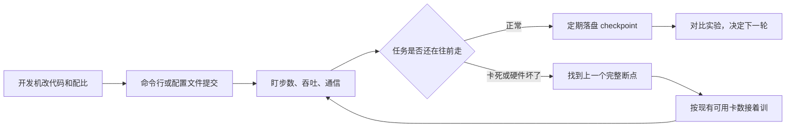

# 预训练场景算法侧能力补齐方案

|字段|内容|
|---|---|
|文档标题|预训练场景算法侧能力补齐方案|
|适用范围|`prototype.v3`交互原型，以及后续`MAIP`训练平台产品规划|
|审查视角|算法同学做大模型预训练时怎么用平台|
|关联原型|`prototype.v3/`|
|日期|2026-08-21|
|状态|Draft|
|本次修订|补齐已确认的环境约束：各机房统一挂载`/data/hpc/home`与`/share`；数据集只能由算法同学从金融云生产手动落到网络盘，平台不自动拉取|

# 能力核对表

只列需要**新增**或**改进**的模块，供对照原型或实现勾选。首期已够用的能力（配置集版本挂载、队列与多机房调度、实验页完整曲线）以及明确不做的能力（平台自动拉数、按机房分盘符、不落盘恢复）不列入。

`ID`按模块前缀编号，全文检索即可定位，例如`DEV-01`、`CKPT-02`。已发出的编号不改、不复用；同模块新增能力接该前缀的下一个序号。

|ID|模块|类型|功能|批次|章节|核对|
|---|---|---|---|---|---|---|
|DEV-01|开发机|新增|创建、启动、停止、进入`JupyterLab`；选规格和镜像；闲置一段时间自动停|第一批|6.1|⬜|
|DEV-02|开发机|新增|与训练任务同挂`/data/hpc/home`、`/share`；需要时`/home/<user>`软链到个人目录；停机重建后个人目录仍在|第一批|6.1|⬜|
|DEV-03|开发机|新增|用当前镜像和工作目录创建训练任务|第一批|6.1|⬜|
|DEV-04|开发机|新增|只使用已经落到网络盘上的数据，页面上不提供从金融云生产或公网拉取|第一批|6.1|⬜|
|CLI-01|命令行`aitrain`|新增|`auth` / `validate` / `dry-run` / `submit` / `logs` / `resume` / `cancel`|第一批|6.2|⬜|
|CLI-02|命令行`aitrain`|新增|与新建任务页共用同一份`train.yaml`，页面可导入、导出，不再各写一套字段|第一批|6.2|⬜|
|JOB-01|新建任务 / `validate`|改进|数据、工作目录、断点路径必须落在`/share`或`/data/hpc/home`；目标集群上目录存在、可读；数据目录非空；并行切分能整除总卡数|第一批|6.2、8|✅|
|JOB-02|新建任务 / `validate`|改进|路径不存在时提示「请先拷到网络盘，平台不会代为下载」，不提示成机房选错或正在同步|第一批|6.2、8|✅|
|JOB-03|新建任务|改进|提交预览展示实际会读、会写的路径；盘符写错或目录不存在则拦住|第一批|8|✅|
|JOB-04|新建任务|改进|配置示例、默认命令去掉`/data/jiangsu`、`/data/liangjiang`、`/mnt/shared`；并行、数据、加载路径不全部塞进启动命令|第一批|8|✅|
|CFG-01|配置管理|改进|示例和模板路径改为`/share/...`与`/data/hpc/home/<user>/...`|第一批|8、7.2|✅|
|DET-01|任务详情|改进|展示工作目录、断点目录，写成`/data/hpc/home/<user>/...`或`/share/...`，不再展示`/mnt/shared`|第二批|6.3、8|✅|
|DET-02|任务详情|改进|日志按进程和关键字过滤|第二批|8|✅|
|CKPT-01|断点与续训|新增|按`iter`列出断点：步数、大小、是否写齐、写入耗时、能否加载；默认目录`/data/hpc/home/<user>/outputs/<job_id>/checkpoints`|第二批|6.3|⬜|
|CKPT-02|断点与续训|改进|「重跑」和「续训」拆开；续训默认加载最新完整断点，允许改节点数并提示并行能否整除|第二批|6.3、8|⬜|
|CKPT-03|断点与续训|改进|停止确认写明最后一个完整`iter`，并说明未落盘进度会丢|第二批|6.3、8|⬜|
|SCH-01|调度事件|改进|排队中展示名次、缺的是卡还是网络、前面是谁；把资源凑齐、通信初始化、断点写入等事件画出来|第二批|7.6|⬜|
|LIST-01|任务列表|改进|运行中任务至少展示当前步数、每步大概耗时|第三批|8|⬜|
|PROG-01|训练进展|新增|任务页摘要：步数、`loss`、每秒`token`、算力利用率、距上一步/上一断点多久；与实验页用同一任务编号对齐|第三批|6.5|⬜|
|PROG-02|训练进展|新增|超过约定时间没有新的一步，任务上标「可能卡住了」|第三批|6.5|⬜|
|EXP-01|实验分析|改进|任务与实验、`TensorBoard`互相跳转；完整曲线仍在实验页，任务页只给值班摘要|第三批|6.5、8|⬜|
|NTF-01|任务通知|改进|启动、失败、卡住、断点没写成、可能被挤掉时，飞书通知任务负责人，不只打给运维|第三批|7.6|⬜|
|REC-01|故障恢复|新增|识别硬件/`NCCL`/`IB`失败后，给出缩容续训草案：用上一个完整断点、预填当前可调度节点数、可排除故障节点|第四批|6.4|⬜|
|REC-02|故障恢复|新增|任务可声明「硬件失败就恢复」，平台换节点或缩小数据并行后自动再提交|随后|6.4|⬜|
|DATA-01|数据集登记|新增|登记已经落到盘上的目录：名称、版本、路径、`token`量、格式、分词器、配比、放置人和时间；路径限`/share`或`/data/hpc/home`|第五批|7.1|⬜|
|DATA-02|数据集登记|新增|登记和提交时检查目录存在、可读、非空；未拷到盘上的数据选不了也提交不了；平台不下载、不同步|第五批|7.1|⬜|
|RCP-01|官方配方|新增|预置 7B / 13B 等能跑通的组合（镜像、命令骨架、并行、`NCCL`、断点间隔）；路径用`/share`和`/data/hpc/home`|第五批|7.2|⬜|
|RCP-02|官方配方|改进|提交前检查并行与总卡数、给出显存是否够用的提示；配置集并行文件与任务卡数互相约束|第五批|7.2|⬜|
|IMG-01|镜像目录|新增|训练中心只读目录：框架、驱动、适用机型；创建失败能看到是镜像没拉下来，不要一直停在「启动中」|第五批|7.4|⬜|
|CODE-01|代码快照|新增|提交时记下提交号，或把当时代码目录做成只读快照写入任务记录|随后|7.3|⬜|
|OUT-01|输出浏览与排障|新增|只读浏览工作目录、断点目录、`TensorBoard`目录：列出文件、大小、时间|随后|7.5|⬜|
|OUT-02|输出浏览与排障|新增|命令行或页面进入指定进程终端，仅用于排障|随后|7.5|⬜|

# 1. 背景

`prototype.v3`已经能走通这样一条路：选团队和队列、填镜像和启动命令、挂一份配置、提交`Volcano`任务，再在页面上看`Pod`日志、资源监控、告警和`TensorBoard`曲线。运维侧的节点隔离、队列额度、多机房标签也有了雏形。

但预训练不是点一次提交、等三十多个小时看结果。算法同学平时更像下面这样干活：

1. 在开发机上改代码、改数据配比、跑一小段试试。
2. 用命令行或配置文件提交 8 机、16 机、32 机的正式训练。
3. 盯这一轮还在不在往前走：步数有没有涨、吞吐掉没掉、通信卡没卡。
4. 卡坏了、网口坏了、`NCCL`超时了，找到上一个完整的`checkpoint`，改一改规模，接着训。
5. 对比不同阶段、不同配比、不同学习率，决定下一轮怎么改。

公司现在的痛点也正好卡在第 4 步：硬件出问题后，平台往往不能提前拦住。任务挂了，算法同学要自己翻日志、找坏机器、改训练规模、再手动接着跑。`prototype.v3`把「把坏节点从调度里拿掉」做进了运维中心，但算法同学日常要用的「接着训」还没做起来。

另外两件已经确认、但原型和前一版方案写错了的事，会直接影响后面怎么补能力：

1. 计算节点上的网络盘路径，不随机房变化。不是两江一套`/data/liangjiang`、疆算一套`/data/jiangsu`。
2. 常用训练平台跑在`UAT`，目标数据集只能在金融云生产环境拉取。公司网络安全不允许平台自动去数据源下载，算法同学必须自己把数据放到约定好的网络盘上。

这份方案只回答一件事：站在预训练算法同学的角度，当前平台还缺什么，这些能力建议补到什么程度，哪些可以先不做。下面先把这两条约束写死，后面的开发机、命令行校验、数据集登记都按这个来，不再沿用原型里的分机房盘符。

# 2. 已确认的环境约束

## 2.1 各机房挂同一套网络盘路径

不论哪个数据中心机房，节点上挂载的网络磁盘都是下面两条路径：

|路径|用途|谁用|
|---|---|---|
|`/data/hpc/home`|每个用户自己的目录，实际落到`/data/hpc/home/<user>`|个人代码、小样本、个人实验输出、个人`checkpoint`|
|`/share`|跨团队共享目录|切好的预训练数据、分词器、公共配方、需要多人读的产物|

开发机和正式训练任务都必须挂这两条路径，容器里看到的逻辑路径和节点上一致。调研里曾写过`/data/home/<user>`兼容层、原型里曾写过`/mnt/shared`和按机房划分的`/data/jiangsu`、`/data/liangjiang`、`/data/shuitu`。那些只是当时的假设，**产品上不要再暴露第二套盘符**。

开发机容器里如果还需要符合`Jupyter`镜像习惯，可以把`/home/<user>`软链到`/data/hpc/home/<user>`，但这是容器内兼容，不是又多一块盘。

默认落盘建议：

|内容|建议路径|说明|
|---|---|---|
|个人代码和工作区|`/data/hpc/home/<user>/workspace`|开发机改完，训练任务直接读同一份|
|个人任务输出、日志、`SwanLab`目录、个人`checkpoint`|`/data/hpc/home/<user>/outputs/<job_id>/`|停机重建后还在；详情页展示的就是这条路径|
|团队共享数据集、分词器、配比|`/share/...`由团队约定子目录|预训练主数据走这里，不要堆在个人目录里|
|需要多人接着用的断点或导出|`/share/...`由团队约定|可选，不是默认|

提交前要拦的是「路径是不是落在这两条根目录下、目标集群上这个目录在不在、能不能读」，而不是「队列机房名字和数据盘机房名字是否一致」。原型里「选了疆算队列却去读两江的盘」是按分机房`HostPath`编出来的问题，和现网不符。若底层存储日后并非全局同一套介质，也仍然以「目标集群上该路径是否存在、是否可读」为准，不要再为每个机房发明一套盘符。

## 2.2 数据集由算法同学手动落到网络盘，平台不自动拉取

常用训练平台跑在`UAT`环境。数据集只能在金融云生产平台拉取。公司网络安全不允许平台控制面直连目标数据源，自动下载会失败，也不应该做成产品能力。

真实流程是：


几条产品边界因此要写死：

1. 平台不做数据集下载、同步、入湖，也不做从`HuggingFace`、对象存储或金融云生产的一键导入。
2. 开发机也不是下载入口。开发机和训练任务一样跑在能看到网络盘的环境里，只能使用**已经落到盘上**的数据。
3. 数据集在平台上首先是「已经存在的目录 + 元数据」，不是「选一个远程地址，平台去拉，再挂到容器里」。
4. 容器内访问路径就是网络盘路径。不要再翻译成`/mnt/data`这类第三套挂载点，否则命令、`YAML`和开发机又对不上。
5. 阿里云「创建任务时选数据集、平台只读挂进去」可以借鉴**登记和引用**，不能借鉴**平台负责搬运数据**。

# 3. 结论

`prototype.v3`现在更像一个训练作业管理页面，还不是算法同学每天待着的工作环境。

已经做得比较完整的，是作业怎么提交、怎么看日志、怎么按队列和机房分资源、怎么给配置文件做版本。真正缺的是预训练主路径上的五件事：

1. 开发机。开发和正式训练要挂同一套`/data/hpc/home`、`/share`，用同一套镜像。
2. 命令行和任务配置文件。正式的大任务不应该只靠页面上的四步表单。
3. `checkpoint`管理和续训。现在只有「按原配置再开一趟」，没有「从上一次完整断点接着跑」。
4. 硬件出问题之后，任务怎么自己或半自动拉起来。运维隔离节点解决的是池子干净，解决不了这次训练丢了多少步。
5. 任务页面要能看出「训练还在往前走吗」。现在任务监控只画卡和网，`loss`和步数跑到了实验页，值班时要对着两个页面看。

运维大盘、告警中心、节点维护可以继续做，但不要再排到这五件事前面。

数据集不要做成平台去拉数。第一批命令行校验就要拦住「路径不在约定盘上、目录还不存在」；完整的数据集登记可以随后做。

# 4. 算法同学在`v3`里实际能做什么

算法工程师登录后只能看到「训练中心」。运维中心和平台中心是看不到的。

|页面|现在能做什么|预训练里好用的地方|
|---|---|---|
|任务列表 / 新建任务|选队列、填节点数和每节点卡数、选镜像、写启动命令和环境变量、挂配置集|能把任务交出去，额度不够会排队|
|任务详情|看配置、`Pod`列表和实时日志、卡和`IB`监控、关联告警、离线搜日志|排`NCCL`、看卡是否在转、下载日志|
|我的队列|看自己能用的队列、剩余卡数、本月卡时|选机房和额度时有数|
|配置管理|在线改多份`YAML`、发版本、提交时只读挂进容器|超参不用只活在开发机硬盘上|
|实验分析|按项目看`Run`、打开`TensorBoard`、对比几条曲线|看`loss`、学习率、吞吐|

这些方向是对的。问题是预训练主路径上还有几段是空的，现有页面里也有几处会让人用错。路径和数据盘的示例仍按原型写成了分机房`HostPath`和`/mnt/shared`，和现网不一致。

# 5. 用预训练的一天来对照



|算法同学实际在做什么|`v3`现在的情况|差在哪|
|---|---|---|
|在和训练同一套路径的环境里改代码、抽检数据|没有开发机菜单，只有管理员镜像表里的`Jupyter`镜像|开发和训练还是两套环境|
|用配置文件提交，提交前先检查有没有填错|只有页面四步表单|没有`aitrain`，也没有统一的任务描述文件|
|从上一次完整`checkpoint`接着训|终态任务只有「重跑」|重跑是从头再来，不是续训|
|节点被隔离后，这次任务还能接着跑|运维可以隔离节点，算法侧只能停止或重跑|缺恢复策略|
|一眼看出这轮还值不值得继续|监控页不画`loss`和学习率，实验页另开|任务页没有训练是否健康的摘要|
|确认要训的数据已经在网络盘上，路径写对|路径写死在`YAML`里，示例还是`/data/jiangsu/mix-v3`这类分机房盘符|现网只有`/data/hpc/home`和`/share`；平台既不拉数，提交时也不检查目录在不在|
|确认`checkpoint`写完了、能重新加载|实验产物里只有路径字符串|不知道文件齐不齐，也不能一键接着训|

# 6. 必须先补的能力

## 6.1 开发机

原始需求和调研文档都把开发机写成了首期就要做的事：浏览器打开`JupyterLab`，挂同一套共享盘，用和正式训练接近的镜像做小样本验证。

`v3`侧栏没有开发机。`jupyter-base`只出现在平台管理员才看得到的镜像表里。算法同学现在仍然是：线下改完，再回到平台粘贴启动命令。配置管理只解决了`YAML`，没有解决代码、分词器、数据抽检，也没有解决提交前先用单机跑通。

可以参考的做法：

- 现在的`OpenSCOW`（`ai-hpc`）本身就把交互式应用当成日常入口，`Jupyter`和远程桌面都在门户里。
- 阿里云是开发机`DSW`和训练任务`DLC`共用数据集、镜像，任务页还能开开发机进去看。
- `JupyterHub`、`Kubeflow Notebooks`也是同一思路：在`K8S`里按用户拉一个笔记本环境，挂共享存储。

建议按调研里已经定过的路来，不必再上整套`JupyterHub`。路径按现网改准，不要再跟原型走：

- 训练中心增加开发机：创建、启动、停止、进入`JupyterLab`、选规格和镜像，闲置一段时间自动停掉。
- 开发机和训练任务都挂`/data/hpc/home`和`/share`。用户个人目录就是`/data/hpc/home/<user>`；需要符合`Jupyter`习惯时，把`/home/<user>`软链过去。
- 支持从开发机「用当前镜像和工作目录创建训练任务」，避免两套环境对不上。
- 开发机只使用已经落到网络盘上的数据。不要在开发机上做「从金融云生产或公网拉取数据集」。

做到什么算够用：算法同学能在页面里打开开发机，改完代码后，用同一份`/data/hpc/home/<user>`和`/share`路径提交正式训练，停机重建后个人目录还在。

## 6.2 命令行和任务配置文件

需求和调研写得很清楚：正式预训练优先用命令行提交，页面先做好查看和排障。`v3`做成了相反的样子：页面表单很重，原型里没有命令行说明，也没有一份能提交、能检查、能对比差异的任务描述文件。

几十张到上百张卡的`Megatron`任务，不适合只靠「节点数 × 每节点卡数 + 一段启动命令」来交。并行怎么切、数据在哪、从哪个断点加载、`NCCL`环境变量写什么，都应该落在文件里，方便复现，也方便以后给自动化系统调用。

可以参考的做法：

- `SkyPilot`用一份`YAML`描述资源和命令，一条命令提交，底层可以换。
- `kubeflow/arena`专门给算法同学用，提交、看日志、列任务，不用直接碰`kubectl`。
- `NVIDIA NeMo`和`SageMaker HyperPod`的配方也是文件，加载路径和并行策略都写在里面。

建议最小命令面和调研保持一致：

```text
aitrain auth login
aitrain job validate -f train.yaml
aitrain job dry-run -f train.yaml
aitrain job submit  -f train.yaml --output json
aitrain job logs    <id> --role worker --replica 0 --tail 200
aitrain job resume  <id> --from last
aitrain job cancel  <id>
```

页面上的「新建任务」要能导入、导出同一份任务描述，不要再长出另一套字段。否则命令行和页面又会各写各的。

`validate`在第一批就要拦住和现网有关的路径错误，不必等数据集登记模块做完：

- 数据路径、工作目录、断点目录必须落在`/share`或`/data/hpc/home`下，拒绝`/data/jiangsu`、`/mnt/shared`这类历史写法。
- 提交到某个队列时，在目标集群上检查这些目录存在、可读；数据目录不要是空的。
- 并行切分要能整除总卡数。

路径不存在时，提示应该写成「请先把数据拷到`/share/...`或`/data/hpc/home/<user>/...`，平台不会代为下载」，不要提示成「机房选错了」或「正在同步数据集」。

做到什么算够用：同一份`train.yaml`既能在命令行里`validate`和`submit`，也能在页面里打开改一改再交；交之前能拦住路径不在约定盘上、目标目录还不存在、并行度除不尽这类明显错误。

## 6.3 把`checkpoint`管起来，并把「重跑」和「续训」分开

这是`v3`和预训练场景差得最远的一处。

现在的情况：

- 落盘路径按任务名约定好，创建页不让填，详情页也不展示。原型约定还写在`/mnt/shared/experiments`、`/mnt/shared/checkpoints`，和现网不符。
- 任务结束后只有「重跑」：把镜像、命令、配置再拷一份，从第 0 步重新开始。
- 实验产物里能看到`iter_0018000`这种路径，但不能检查文件齐不齐，也不能选中它接着训。

这两件事不能用同一个按钮：

| |重跑|续训|
|---|---|---|
|权重|重新初始化，或指定一个起点|用上一次完整的`checkpoint`|
|优化器、步数、已经吃过的`token`|清零|必须对得上|
|节点数|可以改|可以改，但要能重新对齐并行切分|
|失败之后|已经训过的进度作废|这才是预训练的主路径|

行业里几乎都把断点当成正式对象来管：

- `Megatron`和`NeMo`用`--save`、`--load`，也可以自动从最新完整`iter`恢复。
- `NVIDIA`的容错扩展会在故障后从最近断点拉起，并检查有没有拖后腿的节点。
- `Kubeflow Trainer`恢复时会自动找最新一份合法断点。
- 阿里云`DLC`的`EasyCKPT`专门做大模型断点续训，`AIMaster`负责容错。
- `SageMaker HyperPod`在硬件故障后，会从最后一个`checkpoint`自动把任务拉起来。

建议在任务模型里增加断点这一层：

- 默认断点目录落在`/data/hpc/home/<user>/outputs/<job_id>/checkpoints`。需要给团队接着用时，再写到`/share`下约定目录。
- 按`iter`列出：步数、大小、文件是否写齐、写入花了多久、能不能重新加载。
- 任务详情固定展示当前断点目录，以及最新一份完整`iter`。
- 操作拆开：停止、重跑、从断点续训。
- 续训默认加载最新完整断点，允许改节点数；改了要提示并行切分还能不能整除。
- 点停止时写清楚：还没落盘的进度会丢，最后一个完整`iter`是多少。

做到什么算够用：失败任务可以一键从上一个完整断点拉起；详情页能看见写到了哪一步，不用去网络盘里自己翻目录。

## 6.4 硬件出问题后，任务要能接着跑

调研里算法侧最大的痛点，就是卡坏或网口坏了之后，要自己翻日志、下线机器、改规模、找断点再提。`v3`把隔离和入池做成了运维中心的能力，算法角色进不去。任务详情里也没有「因为节点故障失败，用上一个完整断点、按现在还能调度的卡数接着跑」。

把坏节点从池子里拿掉，只说明集群变干净了。预训练要的是：这一趟训练少丢一点有效时间。

`Volcano`能把多机任务一次性调度起来，但不会帮你加载断点，也不会帮你改节点数。后面这件事要平台自己做。可以分两档，先不要上「不落盘也能恢复」那种更重的方案：

1. 先做半自动。失败原因能看出来是硬件或`NCCL`、`IB`时，详情页给出「用上一个完整断点续训」，预填当前还能调度的节点数，并允许排除故障节点。
2. 再做自动。任务上声明「硬件失败就恢复」，平台换节点或缩小数据并行后自动再提交。做法可以靠近`NeMo`容错和`HyperPod`，不要自己重做通信栈。

做到什么算够用：节点被隔离后，算法同学不用手改一长串启动命令，页面能给出一份缩容续训的草案，确认后就能交。

## 6.5 任务页要能看出训练还在不在往前走

任务监控页现在只画卡利用率、温度、`IB`带宽、节点`CPU`内存，明确不画`loss`和学习率。这些曲线在实验页。算法同学排障时要同时开两个页面，还对不上步数。

预训练判断「这轮还值不值得继续」，通常看这些：

- 步数还在不在涨，会不会已经卡死。
- 每秒吃了多少`token`，算力有没有真正用上。
- `loss`和梯度是不是爆了。
- 写`checkpoint`有没有把每步时间拖得很长。
- 是不是某一张卡、某一个进程在拖后腿。

卡利用率很高，也可能卡在集合通信里，或者已经死锁了。只看卡转不转，看不出训练健不健康。

`W&B`、`SwanLab`、`MLflow`、`TensorBoard`都是把系统指标和训练曲线放在同一次实验里。`NeMo`默认会打吞吐和算力利用率。仓库里的`wandb_pretrain_demo`也已经按步写出了`metrics.jsonl`。原始需求用的是`SwanLab`本地模式，平台至少要兼容这套目录习惯，不要逼所有人改成`TensorBoard`。本地实验目录建议落在`/data/hpc/home/<user>/outputs/<job_id>/`下，开发和训练都能直接打开。

建议：

- 任务详情增加一块训练进展：当前步数、`loss`、每秒`token`、算力利用率、距离上一步过了多久、距离上一次断点过了多久。
- 超过约定时间没有新的一步，就在任务上标「可能卡住了」，不要只丢一条运维告警。
- 实验页继续给完整曲线；任务页给值班时一眼能看懂的摘要。两边用同一个任务编号对齐。

做到什么算够用：不用进实验页，也能判断这次任务是还在训、已经卡住，还是`loss`已经跑飞。

# 7. 接下来应该补的能力

下面这些不是第一天就必须有，但缺了以后，提交和复现还是会别扭。

## 7.1 数据集要单独登记，但只登记已经落到盘上的目录

预训练真正值钱的，往往是已经切好的数据、配比和分词器。`v3`把路径写死在`YAML`里，创建任务时不能选数据集版本，也看不到这份数据有多少`token`、人有没有已经拷到`/share`。

前一版方案按原型假设「数据绑在机房上：两江`/data/liangjiang`，疆算`/data/jiangsu`」，并把「选了疆算队列却去读两江的盘」当成主风险。现网不是这样。各机房看到的都是`/data/hpc/home`和`/share`。真正会交失败的，是下面几类事：

- `YAML`还在写`/data/jiangsu/mix-v3`这种已经不存在的盘符。
- 数据还在金融云生产，人还没拷到网络盘，任务却已经交上去了。
- 目录在，但是空的、缺分片、权限不对，训练进程读不到。
- 个人目录里放了一份临时样本，正式训练却误当成团队主数据。

阿里云创建训练任务时要选数据集和版本，再只读挂到容器里。`Kubeflow Trainer`和`NVIDIA`的训练门户也把数据当成独立对象。这些产品默认平台能接触数据源。我们这边接触不到，所以只能学「登记和引用」，不能学「平台去拉」。

建议先做登记，明确不做数据湖、不做同步流水线：

- 登记名称、版本、网络盘路径、`token`量、格式、分词器、配比、是谁放到盘上的、什么时候放的。
- 路径必须落在`/share`或`/data/hpc/home`下。预训练主数据默认登记在`/share`。
- 登记时就在能看到该盘的环境里检查：目录存在、可读、不是空目录。登记的是现状，不是一份「稍后会下载」的意向。
- 提交任务时选已经登记的数据集版本，任务记录里记下当时的路径和版本；容器内仍按原路径读取，不改写成第三套挂载点。
- 提交前再检查一次路径仍在、仍可读。数据被人挪走或删掉时，直接拒绝提交，并提示去网络盘确认，而不是由平台重下。

算法同学侧的操作顺序应写成产品说明，而不是藏在运维文档里：先在金融云生产把数据拉下来，拷到`/share`约定目录，再来平台登记、提交。平台页面和`aitrain job validate`都按这个顺序给提示。

做到什么算够用：创建任务时能选到一份已经在`/share`上的数据，看得到`token`量和路径；还没拷到盘上的数据选不了，也提交不了。

## 7.2 官方配方，以及并行切分检查

新建任务只问节点数和每节点卡数。实验超参里虽然有张量并行、流水并行、数据并行，提交时并不检查它们能不能对上总卡数，也不估显存，更没有 7B、13B 的现成组合。配错的代价是排了几小时队，结果在通信初始化时就挂了。

`NeMo`、`Megatron`配方、阿里云「在`DLC`上跑`Megatron`预训练」的文档，以及不少内部平台的任务模板，都是先给人一套能跑通的组合，再允许改。

建议：

- 预置几套现成组合，例如 7B 用 8 机`H100`、13B 用 16 机`H100`，把镜像、命令骨架、并行切分、`NCCL`、断点间隔写好。
- 配方里的数据路径、输出路径用`/share`和`/data/hpc/home/<user>`，不要再带原型里的分机房盘符。
- 提交前检查：总卡数要能被并行切分整除；序列长度和`batch`按经验给一个显存是否够用的提示。
- 配置集里的并行文件，要和任务上填的卡数互相约束，不要各写各的。

## 7.3 代码也要能对上当时那一版

配置管理明确不管源码。训练进程实际跑的是镜像里或共享盘上的脚本。如果重跑或续训时，盘上的训练脚本已经被改过，这次实验就对不回去了。

不必在页面上做一套`Git`。命令行提交时记下提交号，或者把当时的代码目录做成一份只读快照，写进任务记录即可。代码目录同样应落在`/data/hpc/home/<user>`或`/share`下，不要假设还有一块开发机本地盘。

## 7.4 算法同学要能看懂镜像，不能只在下拉框里碰运气

镜像管理放在平台中心，算法角色进不去。创建任务时只有一个下拉框，看不到`CUDA`、`NCCL`、`Megatron`版本，也看不到是不是官方镜像、拉取有没有失败。预训练对这些版本组合非常敏感。

建议在训练中心给一个只读的镜像目录，写清框架、驱动、适用机型。自定义镜像继续走公司已有的`Harbor`，平台只做能不能用的检查。创建失败时要能看到是镜像没拉下来，不要一直停在「启动中」。

## 7.5 能浏览输出目录，必要时能进到某个进程里看

路径全靠约定，详情页还不展示工作目录和断点目录。`OpenSCOW`的文件管理、阿里云的结果目录，都是算法同学每天会用的东西。

`NCCL`卡住时，常常要进到某一个进程里看卡、看网卡、看调用栈。现在只能看日志。

建议：

- 配置信息里补上工作目录、断点目录、`TensorBoard`目录、关联实验，一律用`/data/hpc/home/<user>/...`或`/share/...`。
- 这几个目录支持只读浏览：列出文件、大小、时间即可，不用做成网盘，也不要做成从远程数据源下载。
- 命令行或页面提供进入指定进程的终端，只用于排障。

## 7.6 把调度过程展示出来，把通知打给任务负责人

任务数据里其实已经有「资源凑齐了、通信初始化完成了、断点写下了、队列还剩多少卡」，页面完全没画出来。排队中的任务只显示「排队中」，看不到排在第几、缺的是卡还是网络，前面是谁。

告警中心在运维分区。预训练用户要的是：任务启动了、失败了、卡住了、断点没写成、可能被更高优先级挤掉，直接发到飞书。规则可以继续由现有告警系统来配，但接收人必须是任务负责人，不能只有运维。

# 8. 现有页面里建议先改掉的地方

这些不是新模块，但会让已经做出来的能力不好用，甚至用错。

1. 「重跑」和「续训」必须拆开，文案不能混。
2. 任务详情要把约定好的工作目录和断点目录展示出来，写成`/data/hpc/home/<user>/...`或`/share/...`，不要让人去猜盘符，也不要再展示`/mnt/shared`。
3. 任务和实验要能互相跳转，详情页要能直接打开关联实验和`TensorBoard`。
4. 运行中的任务，列表里至少给一列当前步数和每步大概花了多久，避免值班时反复点进详情。
5. 日志要能按进程和关键字过滤。几十个`Pod`时，找一条`NCCL`告警会非常痛。
6. 停止确认里写明最后一个完整断点，降低误停、丢掉未落盘进度的概率。
7. 创建页不要把并行、数据、从哪加载全部塞进启动命令。这些字段要和配置集对得上。
8. 配置示例、默认命令、配方模板里，去掉`/data/jiangsu`、`/data/liangjiang`、`/mnt/shared`。数据路径改成`/share/...`，个人输出改成`/data/hpc/home/<user>/...`。
9. 提交预览要展示训练进程实际会读、会写的路径。路径不在约定根目录下，或目标目录还不存在时，直接拦住，并说明需要人工把数据拷到网络盘。

# 9. 和常见开源、云产品怎么对应

这里只看预训练算法同学会用到的能力。底座仍然建议继续用`K8S + Volcano`，不要为了功能全去二次开发整套`Determined`或整套`Kubeflow`。

|能力|`v3`现在|主要参考|建议优先级|
|---|---|---|---|
|开发机，同一套盘和镜像|没有|`OpenSCOW`、阿里云`DSW`、`JupyterHub`|先做；盘用`/data/hpc/home`和`/share`|
|命令行和任务描述文件|没有|`SkyPilot`、`Arena`、`NeMo`配方|先做；`validate`含路径前缀和目录是否存在|
|断点对象和续训|没有，只有重跑|`Megatron` / `NeMo`、`EasyCKPT`、`Kubeflow Trainer`|先做；默认落到用户目录|
|硬件失败后任务恢复|只有运维隔离节点|`HyperPod`、`NeMo`容错、阿里云`AIMaster`|先做|
|训练是否还在往前走|监控和实验拆开了|`W&B`、`SwanLab`、`NeMo`日志|先做|
|数据集登记|路径写在`YAML`里|阿里云数据集的「登记和引用」，不学它的远程拉取|随后做；数据由人从金融云生产拷到`/share`|
|现成配方和并行检查|只有配置集模板|`NeMo`配方、阿里云任务模板|随后做|
|代码快照|不管源码|`SkyPilot`挂载文件、`Determined`|随后做|
|算法同学能看的镜像目录|在管理员页|`Harbor`、`OpenSCOW`、阿里云|随后做|
|浏览输出、进入进程排障|没有|`OpenSCOW`文件管理、`Arena`|随后做|
|调度事件和排队原因|数据有，页面没有|`Slurm`、`Volcano`、`Arena`|随后做|
|实验对比|已有`TensorBoard`|`TensorBoard`、`SwanLab`、`W&B`|保持，补任务页摘要即可|
|配置文件版本和挂载|已有|`Kubernetes ConfigMap`、配置集设计|首期够用|
|队列、多机房、`IB`|已有|`Volcano`队列、阿里云资源组|首期够用；机房只约束算力调度，不再各挂一套数据盘|
|训练中途缩规模、不落盘恢复|没有|`HyperPod`、谷歌云弹性训练|先不做|
|平台自动下载或同步数据集|没有，也不做|云厂商数据源接入、公共数据集市场|明确不做|

命令行和任务描述学`SkyPilot`、`Arena`即可。恢复策略做成平台能力，不要绑死某一个训练框架的实现细节。

# 10. 建议的建设顺序

面向预训练算法同学，而不是再堆运维页面。

|批次|做什么|算法同学能直接感受到的变化|
|---|---|---|
|第一批|开发机，加上`aitrain`和任务描述文件；提交前校验路径落在`/data/hpc/home`或`/share`且目录存在|在`Jupyter`里改完，一条命令就能交；交之前能拦住盘符写错、数据还没拷到网络盘、并行切分对不上|
|第二批|断点列表、续训、详情页展示路径和调度事件|失败后能从上一个完整`iter`拉起，能看见写到了哪一步|
|第三批|任务页训练进展、卡住检测、飞书通知任务负责人|不用进实验页，也能判断还在训还是卡住了|
|第四批|接上现有的节点隔离，做半自动恢复|隔离节点后给出缩容续训草案，不必手改命令|
|第五批|数据集登记、现成配方、算法可见的镜像目录|能选到已经落到`/share`的数据版本；7B 有一套路径写对的组合。平台仍然不负责去生产环境拉数|

下面这些明确往后放：完整的多租户和成本账本、平台上的离线日志大检索、自动搜超参、训练中途弹性缩规模、不落盘恢复、模型注册和导出流水线、自己再做一套实验系统来替换`SwanLab`。实验这边先兼容现有目录习惯即可。

# 11. 不在这次范围内

1. 不改推理平台，也不在训练平台里做在线服务。
2. 不把`prototype.v3`直接改成下一版原型，本文只给出产品能力建议。
3. 不断言必须换成`Slurm`。训练执行仍以`K8S + Volcano`为主，命令行和任务模型不要绑死某一种底层。
4. 不为了功能看起来全，去二次开发`Determined`、整套`Kubeflow`或再做一套实验平台。
5. 不为每个机房单独设计一套数据盘路径，也不再把`/mnt/shared`、`/data/jiangsu`、`/data/liangjiang`当成产品约定。
6. 平台不从金融云生产、公网或其它数据源自动下载数据集，不建设跨环境数据同步或入湖流水线。开发机同样不做一键导入。

# 12. 参考资料

- [SkyPilot 训练指南](https://docs.skypilot.co/en/latest/reference/training-guide.html)
- [kubeflow/arena](https://github.com/kubeflow/arena)
- [NVIDIA NeMo 容错说明](https://docs.nvidia.com/nemo-framework/user-guide/25.02/resiliency.html)
- [NVIDIA nvidia-resiliency-ext](https://github.com/NVIDIA/nvidia-resiliency-ext)
- [Kubeflow Trainer 断点与恢复](https://developers.redhat.com/articles/2026/05/21/guide-jit-checkpointing-kubeflow-trainer-openshift-ai)
- [SageMaker HyperPod 自动恢复](https://docs.aws.amazon.com/sagemaker/latest/dg/sagemaker-hyperpod-resiliency-slurm-auto-resume.html)
- [阿里云 PAI-DLC 概述](https://help.aliyun.com/zh/pai/what-is-dlc)
- [阿里云 EasyCKPT](https://help.aliyun.com/zh/pai/easyckpt)
- [阿里云创建训练任务](https://help.aliyun.com/zh/pai/create-a-training-task)
- [在 DLC 上使用 Megatron-LM 做预训练](https://help.aliyun.com/zh/pai/use-cases/dlc-use-cases/)
- [OpenSCOW](https://github.com/PKUHPC/SCOW)
- 仓库内文档：`原始需求.md`、`AI训练平台技术方案调研.v2.md`、`训练配置文件管理功能设计.md`、`prototype.v3/`
