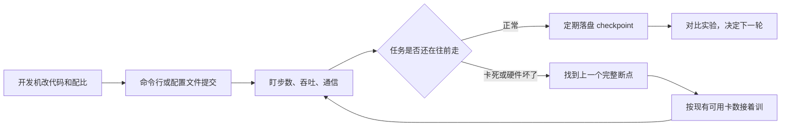
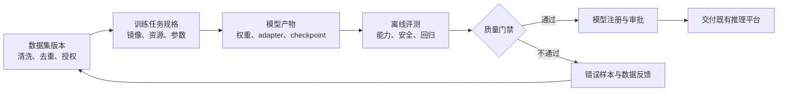
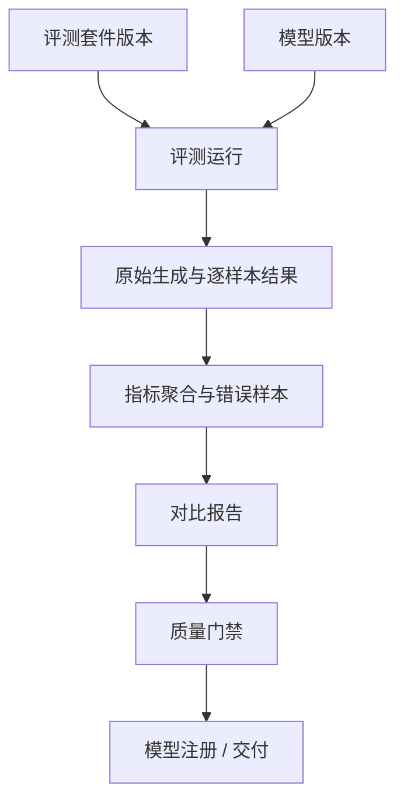
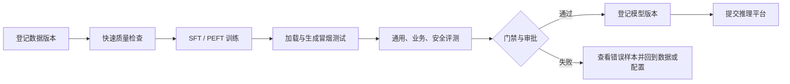

# 能力核对表

只列需要**新增**或**改进**的模块，供对照原型或实现勾选。预训练和后训练能力统一放在一张季度规划表中，按季度和优先级排序。首期已够用的能力（配置集版本挂载、队列与多机房调度、实验页完整曲线）以及明确不做的能力（平台自动拉数、按机房分盘符、不落盘恢复）不列入。

`ID`按模块前缀编号，全文检索即可定位，例如`DEV-01`、`CKPT-02`。已发出的编号不改、不复用；同模块新增能力接该前缀的下一个序号。

优先级定义：`P0`为季度内必须交付、直接影响训练闭环或安全合规的能力；`P1`为形成可复用后训练流程所需的能力；`P2`为规模化、效率和自动化增强能力。季度按依赖关系规划：`2026 Q4`完成预训练可靠性和`SFT MVP`，`2027 Q1`完成数据与模型治理，`2027 Q2`完成偏好优化、工作流和模型交付，`2027 Q3`完成`RL`、蒸馏和规模化后训练，`2027 Q4`完成效率优化和自动化增强。

本文统一将`iter`定义为全局优化器更新步数，即所有参与训练的进程完成一次梯度同步和参数更新后的计数；它不同于单个`GPU`的局部步数，`epoch`仍表示完整遍历一次训练数据。断点目录中的`iter_0018000`表示全局优化器更新步数为 18,000。

|ID|模块|类型|功能描述|解决痛点/业务场景|季度|优先级|核对|
|---|---|---|---|---|---|---|---|
|CFG-01|配置管理|改进|示例、模板和校验提示统一使用`/share/...`与`/data/hpc/home/<user>/...`，并标明输入、输出和断点目录用途|不同集群沿用旧盘符会造成路径不存在或误写入本地盘，用户复制示例提交时任务直接失败且难以判断原因|2026 Q4|P0|✅|
|CKPT-01|断点与恢复|新增|按`iter`（全局优化器更新步数）列出断点：对应`iter`值、大小、是否写齐、写入耗时、能否加载和校验时间；默认目录`/data/hpc/home/<user>/outputs/<job_id>/checkpoints`|长周期训练常遇到断点未写完整或损坏，用户靠文件名猜测可用版本会误恢复并再次消耗大量`GPU`时间|2026 Q4|P0|⬜|
|CKPT-02|断点与恢复|改进|再次提交时复用原任务配置，可复用原输出/断点目录；平台检查最新合法`checkpoint`、基础模型、数据和并行配置兼容性及目录占用，是否从头开始或加载指定断点由训练代码或可选`resume_policy`决定，并记录实际加载的断点和全局`iter`|仅凭目录地址无法确认训练代码是否会恢复，配置变化或并发写入可能导致旧断点误加载、覆盖产物或恢复后才失败|2026 Q4|P0|⬜|
|CKPT-03|断点与恢复|改进|停止确认显示最后一个完整`iter`（全局优化器更新步数）、最近一次断点写入状态和预计丢失的步数，并要求用户确认|值班人员停止异常任务时不知道哪些进度已落盘，容易误以为再次提交一定会自动恢复|2026 Q4|P0|⬜|
|CLI-01|命令行`aitrain`|新增|提供`auth`、`validate`、`dry-run`、`submit`、`rerun`、`logs`、`cancel`子命令；`rerun`复用原任务配置和目录，可通过恢复策略决定是否加载断点，统一返回任务`ID`、状态和可读错误码|大规模训练依赖脚本和批量操作，页面逐个填写无法满足自动化提交；没有统一的再次提交命令时，恢复运行和从头运行容易被脚本误处理|2026 Q4|P0|⬜|
|CLI-02|命令行`aitrain`|新增|与新建任务页共用版本化`train.yaml`，支持页面导入、导出和字段兼容校验，避免命令行与页面各维护一套配置|算法脚本、页面表单和历史命令字段不一致会产生“页面能提、脚本不能跑”的漂移，复现实验时还会漏参数|2026 Q4|P0|⬜|
|DATA-03|数据集登记|改进|数据集版本不可变，登记文件清单、数量、大小、内容哈希、分片、格式和生成时间，并在提交前复核清单|共享目录可能被覆盖或缺少分片，训练结果无法证明使用了哪一版数据，问题复盘只能靠人工猜测|2026 Q4|P0|⬜|
|DATA-04|数据质量|新增|提供格式、编码、空值、异常长度、重复样本、语言分布和`token`长度分布检查，输出阻断项、统计项和样本`ID`|脏数据会在训练数小时后才暴露为解析错误、显存溢出或指标异常，团队需要先知道问题规模再决定是否重清洗|2026 Q4|P0|⬜|
|DATA-08|数据治理|新增|登记分词器版本、预处理脚本提交号、过滤规则、随机种子和样本统计，生成可复现的数据清单及处理报告|同一目录用不同脚本或分词器会产生不同有效`token`量和训练分布，无法解释模型差异或重建数据|2026 Q4|P0|⬜|
|DATA-10|数据集预览|新增|在不复制原始数据的前提下提供受权限控制的抽样预览、字段统计、模板渲染示例和脱敏展示|用户只能看到目录名，无法确认对话角色、字段和答案是否正确；直接下载原文又会扩大敏感数据暴露面|2026 Q4|P0|⬜|
|DATA-11|数据集访问|改进|数据集按团队、项目和用途授权，训练任务只读挂载输入数据，输出目录按用户或项目策略隔离，并记录访问主体|训练脚本误写共享数据会污染后续实验，跨团队数据还可能越权读取或被输出产物带出|2026 Q4|P0|⬜|
|DET-01|任务详情|改进|展示工作目录、输入数据、输出和断点目录的实际路径，统一写成`/data/hpc/home/<user>/...`或`/share/...`，不再展示`/mnt/shared`|路径展示不一致会让用户把结果写到错误盘符，排障时也无法判断任务实际读写了什么|2026 Q4|P0|✅|
|DET-02|任务详情|改进|日志按进程、节点、时间范围和关键字过滤，并支持定位最近一次错误上下文|多机日志量大且错误常被正常输出淹没，值班人员无法快速定位具体进程和节点|2026 Q4|P0|✅|
|DEV-01|开发机|新增|支持创建、启动和停止开发机，提供不依赖`JupyterLab`的`Web Shell`和可选`JupyterLab`入口；可选`GPU`规格、镜像、队列和闲置自动停止策略，展示配额与费用预估|只提供`JupyterLab`会迫使命令行用户使用笔记本镜像并额外启动服务；没有统一开发环境时，算法同学又只能在训练任务里反复试错，忘记释放`GPU`还会长期占用队列资源|2026 Q4|P0|⬜|
|DEV-02|开发机|新增|与训练任务同挂`/data/hpc/home`、`/share`，按需将`/home/<user>`软链到个人目录；停机重建后代码、环境配置和个人目录仍可用|开发机和正式任务挂载不一致会出现“开发能跑、训练找不到文件”，临时容器销毁还会丢代码和配置|2026 Q4|P0|⬜|
|DEV-03|开发机|新增|从开发机当前镜像、工作目录、启动命令和依赖配置一键生成训练任务，在提交前显示差异，并记录实际运行的镜像摘要|从试验到正式训练靠手工复制命令容易漏掉改动，导致正式任务与已验证环境不一致|2026 Q4|P0|⬜|
|DEV-04|开发机|新增|数据选择器只展示已登记且已落到网络盘的数据，页面不提供从金融云生产或公网拉取，并提示数据责任人和授权状态|开发环境一键拉数会绕过审批和网络隔离，既可能拿不到数据，也会引入合规和供应链风险|2026 Q4|P0|⬜|
|EVAL-01|评测中心|新增|登记标准基准、内部业务集、安全集、回归集和人工评测集，记录版本、用途、负责人和数据授权，评测集版本不可变|只看训练`loss`无法判断业务效果，评测集被替换又会让不同模型的分数失去可比性|2026 Q4|P0|⬜|
|EVAL-02|评测中心|新增|内置预训练困惑度、知识、推理、代码、指令遵循、事实性、长上下文和业务指标，并允许声明指标方向和适用模型类型|不同阶段模型关注点不同，只有一个总分会掩盖代码能力下降或业务准确率未达标|2026 Q4|P0|⬜|
|EVAL-03|评测中心|新增|提供统一评测运行器，适配`EvalScope`、`lm-evaluation-harness`和内部脚本，输出包含逐样本结果、聚合指标和错误码的统一协议|评测脚本各自保存日志，模型、参数和结果字段不统一，无法横向比较或接入质量门禁|2026 Q4|P0|⬜|
|EVAL-04|评测中心|新增|固定并版本化模型采样参数、提示词模板、随机种子、最大输出长度、停止词和评测镜像，保证结果可复现|温度、模板或停止词稍有变化就可能造成分数波动，无法确认改动来自模型还是评测配置|2026 Q4|P0|⬜|
|EVAL-05|评测中心|新增|支持批量离线推理，配置并发度、超时、重试、限流和失败样本重跑；评测只访问模型文件，不要求接入在线服务|大评测集经常因单条超时或节点异常中断，重复跑完整集合成本高且会挤占在线推理资源|2026 Q4|P0|⬜|
|EVAL-06|评测中心|新增|支持精确匹配、数值误差、`F1`、代码通过率、偏好胜率、困惑度和自定义聚合指标，记录指标版本与样本过滤规则|指标口径不一致会把同一模型评成不同结果，业务方无法复核单题得分和聚合方式|2026 Q4|P0|⬜|
|EVAL-09|回归评测|新增|新模型必须与指定基线模型逐项对比，支持最低阈值、最大退化幅度、样本级差异和业务方签字记录|微调可能提升目标任务却损伤通用或安全能力，没有基线对比就会把退化模型交付上线|2026 Q4|P0|⬜|
|EVAL-12|评测产物|新增|保存原始输出、错误样本、聚合结果、评测配置、镜像和环境信息，支持按模型版本、运行批次和样本`ID`查询|只保留一个均分无法复盘具体失败案例，模型交接或投诉处理时缺少证据链|2026 Q4|P0|⬜|
|EXP-01|实验分析|改进|任务与实验、`TensorBoard`互相跳转并共享任务编号；完整曲线仍在实验页，任务页展示值班摘要和关键异常链接|任务状态、曲线和日志分散在不同入口，值班排障要反复搜索，实验对比也容易串错任务|2026 Q4|P0|⬜|
|GOV-01|平台治理|改进|统一用户、团队、项目、任务、实验、数据集、模型和资源队列的归属关系，支持按项目查询责任人和资产|资产归属靠备注维护，任务失败、预算超限或数据违规时找不到责任人，跨团队协作也无法授权|2026 Q4|P0|⬜|
|GOV-04|安全|新增|密钥、访问令牌和第三方凭据通过`Secret`或密钥服务注入，禁止写入`train.yaml`，日志、事件和评测输出自动脱敏|把凭据写进启动命令或日志会随配置导出、截图和评测产物扩散，造成数据源或模型仓库泄露|2026 Q4|P0|⬜|
|GOV-09|可靠性|改进|训练、评测和工作流任务支持超时、幂等取消、按错误类型重试上限和人工接管，所有动作保留审计事件|网络抖动和脚本异常会触发重复提交或无限重试，既浪费资源又可能覆盖产物|2026 Q4|P0|⬜|
|GOV-11|开放接口|新增|`Web`、`aitrain`和自动化系统共用版本化`API`、错误码、请求追踪号和幂等键，明确兼容周期|多入口各自实现提交逻辑会出现状态不一致，自动化重试还可能重复创建训练任务|2026 Q4|P0|⬜|
|JOB-01|新建任务 / `validate`|改进|校验数据、工作目录和断点路径必须落在`/share`或`/data/hpc/home`；目标集群目录存在、可读且非空；并行切分能整除总卡数，并在提交前返回逐项结果|路径、权限或并行参数写错时，任务排队后才失败会浪费等待窗口和已预留的`GPU`|2026 Q4|P0|✅|
|JOB-02|新建任务 / `validate`|改进|路径不存在或不可读时明确提示「请先拷到网络盘，平台不会代为下载」，区分权限、空目录和路径错误，不提示成机房选错或正在同步|用户常把“数据尚未落盘”误判为调度或机房问题，反复换队列并不能解决，责任边界也被混淆|2026 Q4|P0|✅|
|JOB-03|新建任务|改进|提交预览展示任务实际会读、会写和会生成的路径，解析配置与启动命令；盘符写错、目录不存在或输出不可写时阻断提交|用户只看启动命令无法发现隐式读写目录，正式任务可能读到旧数据或写满错误磁盘|2026 Q4|P0|✅|
|JOB-04|新建任务|改进|配置示例和默认命令移除`/data/jiangsu`、`/data/liangjiang`、`/mnt/shared`；并行、数据、加载路径使用结构化字段，启动命令只保留脚本参数|机房专用路径和超长命令不可迁移，复制任务时容易漏改并行或加载参数，导致跨集群失败|2026 Q4|P0|✅|
|LIST-01|任务列表|改进|运行中任务展示当前`iter`（全局优化器更新步数）、最近若干步耗时、吞吐、预计剩余时间和最后更新时间，支持按异常排序|列表只有“运行中”无法区分正常慢、通信卡住和指标停滞，团队会错过需要干预的任务|2026 Q4|P0|⬜|
|NTF-01|任务通知|改进|建立独立的任务运行事件通知：任务排队超时、开始运行、启动失败、疑似卡住、断点写入失败、可能被抢占、运行失败、完成及恢复结果通过飞书发送给任务负责人，可选通知协作者；支持阈值配置、订阅偏好、去重限流、失败重试和送达记录，消息包含任务`ID`、阶段、原因摘要、最近全局`iter`/断点、建议动作和鉴权链接，不附原始日志或密钥|算法同学无法持续守在页面，运行异常若只进入运维告警会错过最佳处理窗口；缺少去重和送达状态又会造成告警轰炸，或消息发送失败却无人知晓|2026 Q4|P0|⬜|
|PROG-01|训练进展|新增|任务页摘要展示当前全局`iter`（优化器更新步数）、`loss`、每秒`token`、算力利用率、距上一步和上一断点时长、有效`token`及异常计数；与实验页使用同一任务编号|只看到`GPU`利用率并不能证明训练推进，吞吐下降、梯度溢出或数据停滞需要综合指标判断|2026 Q4|P0|⬜|
|PROG-02|训练进展|新增|按任务历史全局`iter`耗时和配置阈值判断没有新的全局`iter`进展，标记「可能卡住了」，并展示触发时间、最近日志和可执行的重试/排障入口|分布式任务可能进程仍存活但通信已死锁，等到资源超时才发现会白占数小时的节点|2026 Q4|P0|⬜|
|SCH-01|调度可视化|改进|在任务列表、详情页和`aitrain`中展示提交、队列准入、整组调度等待、资源匹配、`Pod`调度、镜像拉取和容器启动阶段；排队时展示申请资源、队列配额、等待时长、标准阻塞原因码、最近调度事件和建议动作，以聚合方式展示高优先级等待压力，不承诺动态调度下的精确名次或启动时间，也不暴露其他任务和用户身份|“排队中”或“启动中”无法区分配额不足、资源碎片、机型/拓扑不匹配、整组资源未凑齐、镜像拉取失败等原因，算法同学只能反复询问运维，也无法判断应继续等待、换队列还是调整规模|2026 Q4|P0|⬜|
|SFT-01|SFT/后训练|新增|任务类型明确区分继续预训练、全参数`SFT`、`LoRA`、`QLoRA`和偏好优化，按类型显示必填参数、产物类型和评测要求|把微调当成预训练会漏掉对话模板、监督范围和`adapter`产物，实验配置难以复用且容易误用高成本资源|2026 Q4|P0|⬜|
|SFT-02|SFT/后训练|新增|只能选择已登记且有权限的基础模型版本，提交前校验架构、权重格式、分词器、上下文长度、量化状态与训练方法兼容，并显示父模型引用|基础模型与分词器或`adapter`不匹配时，任务可能训练成功却无法加载、合并或生成正确结果|2026 Q4|P0|⬜|
|SFT-03|SFT/后训练|新增|支持`OpenAI messages`、`ShareGPT`、`instruction/input/output`等格式，转换为统一的`role`、`content`、`tool_calls`消息协议并记录适配器版本|业务数据格式各异，直接由脚本解析会造成角色丢失、字段错位和同一数据在不同框架下含义不一致|2026 Q4|P0|⬜|
|SFT-04|SFT/后训练|新增|提交前校验字段必填、角色顺序、空消息、超长样本、非法字符和`chat_template`渲染，展示有效/跳过样本数、原因和抽样结果|模板或字段错误通常要等训练后才被发现，静默跳过和截断会让有效监督量不足却仍消耗完整训练资源|2026 Q4|P0|⬜|
|SFT-05|SFT/后训练|新增|按稳定哈希和固定随机种子生成训练、验证、测试划分，支持按样本`ID`及内容去重，检查跨版本与评测集泄漏并保存划分清单|同一会话或业务单据同时出现在训练和评测中会虚高分数，随机划分变化又使两次实验无法公平比较|2026 Q4|P0|⬜|
|SFT-06|SFT/后训练|新增|按消息角色和轮次配置`loss mask`，默认只对`assistant`输出计算损失，支持工具调用参数、工具结果和多轮监督范围的显式开关|把用户问题或工具上下文纳入损失会改变模型行为，工具调用任务还可能学到错误的参数格式|2026 Q4|P0|⬜|
|SFT-07|SFT/后训练|新增|支持截断策略、动态或静态`padding`、样本`packing`、最大序列长度和长度分桶，展示各长度分位数、有效`assistant token`和被截断比例|长对话被静默截断会丢掉关键答案，`padding`低效又会放大显存和训练时长，用户无法权衡质量与成本|2026 Q4|P0|⬜|
|SFT-08|SFT/后训练|新增|可配置`LoRA`目标模块、`rank`、`alpha`、`dropout`、偏置策略和模块保存列表，校验模块存在并提供常用模型模板和参数快照|目标模块写错或参数未记录会导致训练无效、显存估算失真，完成后也无法复现同一`adapter`|2026 Q4|P0|⬜|
|SFT-09|SFT/后训练|新增|校验`bf16`、`fp16`、`8bit`、`4bit`量化、`QLoRA`实现、硬件架构、优化器和梯度检查点的兼容性，并在提交前给出阻断原因|量化、精度和优化器组合高度依赖硬件与框架版本，错误组合常在分配多机资源后才报错|2026 Q4|P0|⬜|
|SFT-10|SFT/后训练|新增|提供单卡快速试验、单机多卡和多机`SFT`标准任务模板，统一配置资源规格、梯度累积、梯度检查点、`FSDP`或`DeepSpeed`策略，并记录有效全局批次|同一套参数在单卡与多机上行为不同，手工拼接资源与并行配置容易造成吞吐低、梯度不稳定或通信失败|2026 Q4|P0|⬜|
|SFT-11|SFT/后训练|新增|提交前根据有效样本数、`token`量、序列长度和策略估算显存、时长、存储及资源规格，支持小样本`dry-run`并记录实际偏差|微调试错周期短但配置组合多，盲目申请大规格会排队浪费，申请过小又会在运行中频繁`OOM`|2026 Q4|P0|⬜|
|SFT-12|SFT/后训练|改进|再次提交时复用断点对象，可从全量权重或`adapter`断点恢复运行，保存优化器、调度器、随机状态、数据游标和`chat_template`配置，并校验父模型一致|微调中断后只恢复权重会改变学习率和数据顺序，重复样本或指标跳变会让实验结果不可比较|2026 Q4|P0|⬜|
|SFT-13|SFT/后训练|新增|训练产物区分基础模型、`adapter`、合并模型、断点和评测报告，记录父模型、数据版本、镜像摘要及完整配置血缘|`adapter`与基础模型混放会导致交付时无法加载，产物缺少父子关系也无法知道哪个版本真正改善了业务指标|2026 Q4|P0|⬜|
|SFT-15|SFT/后训练|新增|训练完成后自动触发基础模型与微调模型的离线能力、安全和回归评测，失败时保留训练产物、错误样本和日志，但将模型标为不可发布|训练`loss`下降不等于回答质量提升，缺少自动评测会把能力退化或安全回归的模型直接交给业务|2026 Q4|P0|⬜|
|DATA-01|数据集登记|新增|登记已落盘目录的名称、不可变版本、路径、样本与`token`量、格式、分词器、配比、放置人和时间；路径仅允许`/share`或`/data/hpc/home`|数据散落在个人目录且缺少元数据，其他成员无法发现可复用数据，也无法估算训练规模和存储成本|2027 Q1|P1|⬜|
|DATA-02|数据集登记|新增|登记和提交时检查目录存在、可读、非空、文件清单稳定；未拷到盘上的数据不可选择和提交；平台明确不下载、不同步并返回责任边界|任务排队后才发现数据还在外部系统或目录为空，既浪费资源又容易误以为平台会负责搬运数据|2027 Q1|P1|⬜|
|DATA-05|数据质量|新增|支持按样本`ID`和内容精确去重、近似去重及相似样本聚类，记录阈值、保留规则、删除数量和可追溯报告|重复或高度相似样本会放大单一模式、造成训练集评测集泄漏并扭曲有效数据量，人工排查成本很高|2027 Q1|P1|⬜|
|DATA-06|数据质量|新增|支持敏感信息、个人信息、访问密钥和违规内容检测，记录规则版本、命中类型和样本`ID`；发现问题时隔离并禁用该数据版本|客服、金融或内部日志可能含身份证号、密钥和违规文本，直接训练会造成合规事故并污染模型行为|2027 Q1|P1|⬜|
|DATA-07|数据治理|新增|登记数据授权来源、许可证、适用范围、地域/用途限制、保留期限和责任人，训练提交时执行策略检查并保留审批证据|数据能读不代表能用于训练或交付，版权和用途限制若在上线前才发现会导致模型返工甚至下线|2027 Q1|P1|⬜|
|DATA-09|数据集配比|新增|将多份数据集组成不可变`mixture`版本，记录权重、采样策略、温度、上限、重复轮数和每轮实际采样量|只记录多个目录而不记录采样方式，训练有效分布会随脚本默认值变化，无法解释能力变化或控制通用/领域比例|2027 Q1|P1|⬜|
|DATA-12|数据血缘|新增|以图谱记录原始目录、清洗任务、过滤规则、脱敏版本、混合版本、训练任务、评测运行和模型版本之间的关系|模型出现异常或收到数据删除请求时，无法反查受影响的任务和派生模型，问题定位与合规处置都会拖延|2027 Q1|P1|⬜|
|EVAL-07|评测中心|新增|支持模型裁判，记录裁判模型与版本、提示词、温度、输出解析器、调用成本和逐样本理由，并允许人工复核及改判|开放式回答没有统一标准答案，模型裁判的偏差或版本变化会影响结论，必须保留可审计证据|2027 Q1|P1|⬜|
|EVAL-08|安全评测|新增|覆盖越权、提示注入、敏感内容、隐私泄漏、幻觉、拒答一致性、越狱和工具调用安全测试，支持按风险等级阻断|业务微调可能提高任务命中率却降低拒答和隐私保护能力，缺少攻击集就无法在交付前发现高风险行为|2027 Q1|P1|⬜|
|EVAL-10|数据泄漏|新增|登记评测集来源、发布时间和污染检查结果，按内容相似度与样本`ID`标记训练集、历史评测集和公开语料重叠风险|训练数据包含测试题或网络答案会造成虚高分，模型发布后真实业务效果明显落差却难以解释|2027 Q1|P1|⬜|
|EVAL-13|质量门禁|新增|按任务类型配置最低分、最大退化幅度、必过安全项、成本/延迟上限和人工审批条件，门禁结果可被工作流引用|评测结果靠人工看表格容易漏掉不可退化指标，低质量或高风险模型可能绕过评审进入交付|2027 Q1|P1|⬜|
|EVAL-14|评测报告|新增|自动生成基线与候选模型对比报告，包含能力、安全、成本、延迟、吞吐、样本数、置信信息和已知缺陷，并导出审阅版本|业务方需要在一次评审中同时权衡效果、风险和成本，分散日志无法形成可签字的决策材料|2027 Q1|P1|⬜|
|EVAL-15|评测安全|新增|自定义评测脚本在隔离任务中运行，限制网络、文件系统、凭据和资源访问；结果、日志和镜像摘要仍归属评测运行|第三方评测代码可能读取训练数据、外联上传结果或占满集群，既有安全风险又破坏其它任务稳定性|2027 Q1|P1|⬜|
|GOV-02|平台治理|新增|提供项目级`RBAC`，区分提交者、协作者、审批者、只读用户和平台运维，权限变更需审批和审计|多人共享项目时无法按职责分权，任何成员都能改配置或发布模型，误操作和越权访问难以追责|2027 Q1|P1|⬜|
|GOV-03|平台治理|新增|对数据、模型、日志和开发机访问分别授权，任务详情只显示脱敏元数据，禁止绕过目录权限读取原文|任务详情和开发机聚合了多类资源入口，普通协作者可能借此读取不应接触的训练数据或凭据|2027 Q1|P1|⬜|
|GOV-05|审计|新增|记录任务提交、配置和权限变更、数据登记、模型下载、审批、导出、删除及失败原因，支持按主体和资源检索|出现数据泄露、模型误发布或资源争议时，没有不可篡改的操作记录就无法还原责任和影响范围|2027 Q1|P1|⬜|
|GOV-10|通知|改进|除运行故障外，对模型评测退化、质量门禁失败、审批待处理、数据违规和预算超限通知责任人，支持去重、升级和确认|质量或预算问题常在交付前才被发现，通知只发运维会遗漏算法和业务负责人，导致流程停滞|2027 Q1|P1|⬜|
|IMG-01|镜像目录|新增|提供训练中心只读镜像目录，标注框架、版本、驱动、`CUDA`、适用机型、维护人和弃用日期；创建失败明确区分镜像拉取、启动和权限错误|镜像依赖和驱动不透明会造成环境漂移，开发机或任务长时间停在“启动中”时用户无法自助判断故障|2027 Q1|P1|⬜|
|MODEL-01|模型资产|新增|模型注册中心记录基础模型、继续预训练模型、全量微调模型、`adapter`、合并模型和量化模型，区分模型类型及父模型|权重散落在任务目录，团队不知道哪个是可交付版本，也无法区分需要配套基础模型的`adapter`和完整模型|2027 Q1|P1|⬜|
|MODEL-02|模型资产|新增|模型版本绑定训练任务、镜像摘要、训练配置、数据集和`mixture`、评测运行、输出路径及责任人|模型结果与训练过程脱节，出现质量问题时无法判断是数据、镜像还是参数导致|2027 Q1|P1|⬜|
|MODEL-03|模型资产|新增|模型产物使用不可变版本号和内容哈希，上传/下载前后执行完整性校验，支持大文件断点续传和分片失败重试|权重包大且传输易中断，部分文件被覆盖或损坏后仍被下游加载会产生隐蔽的推理错误|2027 Q1|P1|⬜|
|MODEL-04|模型资产|新增|模型卡记录用途、基础模型、训练数据摘要、许可证、风险、限制、评测结果、已知失败案例、负责人和更新时间|业务使用者只拿到一个权重目录，不知道适用范围、版权边界和已知缺陷，容易把实验模型用于不适合的场景|2027 Q1|P1|⬜|
|MODEL-05|模型资产|新增|模型状态包含草稿、评测中、待审批、可用、归档和禁用；限制非法跳转，状态变更记录操作者、原因和关联评测|模型文件存在不代表经过质量和安全审核，缺少生命周期状态会导致未经批准的版本被下载或部署|2027 Q1|P1|⬜|
|MODEL-06|模型资产|新增|按项目、环境和模型状态控制可见、下载、导出、部署和删除权限，支持临时授权自动过期|研发、测试和生产对模型的权限边界不同，长期共享下载权限会扩大泄露面并绕过审批|2027 Q1|P1|⬜|
|RCP-01|训练任务模板|新增|提供版本化的官方、团队和个人训练任务模板；官方模板预置经验证的 7B、13B 等组合，聚合节点与`GPU`规格、队列、镜像、启动命令、训练框架配置文件、并行策略、`NCCL`参数、断点间隔、存储挂载和路径占位符|新成员和跨团队任务依赖个人经验分别拼资源参数与框架配置，首次运行常在并行、通信、挂载或路径处失败，试错消耗大量排队时间|2027 Q1|P1|⬜|
|RCP-02|训练任务模板|改进|从模板创建任务时联合校验资源配置和训练框架配置：总卡数与数据/张量/流水线/上下文并行相容，全局批次可由数据并行与微批次整除，并结合模型规模、序列长度和精度提示显存风险；模板引用的配置集版本、挂载路径与任务实例保持一致|资源规格和框架配置分别填写时容易相互矛盾，任务往往在资源分配后才因并行不整除、文件未挂载或显存不足失败|2027 Q1|P1|⬜|
|REC-01|故障恢复|新增|识别硬件、`NCCL`、`IB`和节点驱逐失败后，生成再次提交的缩容恢复草案：选择上一个完整断点、预填当前可调度节点数、列出被排除节点并显示并行影响|故障恢复依赖人工翻日志、找断点和改命令，夜间处理容易选错损坏断点或把故障节点再次拉入任务|2027 Q1|P1|⬜|
|REC-02|故障恢复|新增|任务可声明「硬件失败就恢复」，平台在策略允许时换节点或缩小数据并行后自动再提交，保留原任务与恢复任务关联及重试上限|长周期预训练遇到偶发硬件故障会整体停摆，人工等待确认会让集群空转并延误里程碑|2027 Q1|P1|⬜|
|SFT-14|SFT/后训练|新增|提供`adapter`合并、全量/量化权重导出和格式校验，执行加载与单条生成`smoke test`，未通过校验的产物禁止进入模型登记|`adapter`、基础模型和分词器版本不匹配时常在交付或部署才暴露，返工成本高且容易误登记坏模型|2027 Q1|P1|⬜|
|SFT-16|SFT/后训练|新增|支持按验证集指标早停、保存最佳断点与最新可恢复断点，配置最大全局`iter`步数/`epoch`和最小改善幅度，记录停止原因|固定步数可能过拟合或训练不足，用户还可能误把最后断点当成验证集表现最好的版本|2027 Q1|P1|⬜|
|SFT-17|SFT/后训练|新增|根据任务元数据自动生成模型卡草稿，包含数据版本、基础模型、训练参数、`adapter`/合并方式、已知限制、评测结果和责任人，支持人工修订|微调模型经常只有权重和聊天记录，交付时缺少用途、限制和评测证据，业务方无法做风险判断|2027 Q1|P1|⬜|
|SFT-19|SFT/后训练|新增|支持通用指令回放集、安全集与领域数据按比例组成版本化`mixture`，展示各类有效`token`权重并在评测中比较遗忘指标|领域数据比例过高会让模型忘记通用指令或安全拒答，单看领域集分数无法发现这种退化|2027 Q1|P1|⬜|
|WF-01|工作流|新增|以数据检查、训练、评测、质量门禁、模型登记和审批组成可复用`DAG`模板，模板版本可发布和回滚|人工串联步骤容易漏跑评测、复制错数据路径或忘记审批，同类项目重复搭建还会造成流程口径不一|2027 Q1|P1|⬜|
|WF-02|工作流|新增|步骤之间只传递不可变数据集、模型和评测产物引用及校验摘要，不通过隐式共享目录传递状态，失败时显示缺失输入|依赖共享目录中的“最新文件”会被并发任务覆盖，工作流重跑后可能读取错误版本而无法追责|2027 Q1|P1|⬜|
|WF-03|工作流|新增|支持按步骤配置失败重试、超时、取消、断点恢复和人工暂停，步骤状态与训练任务状态双向对齐并记录重试原因|某一步失败后只能整条流程重跑会重复消耗资源，训练任务与工作流状态不一致又会造成重复提交|2027 Q1|P1|⬜|
|WF-06|工作流|新增|支持评测通过后进入人工审批，审批通过才可模型登记或提交既有推理平台；审批意见、证据和拒绝原因写入模型记录|自动评测无法覆盖所有业务风险，缺少明确审批节点会让实验模型绕过责任确认直接交付|2027 Q1|P1|⬜|
|WF-08|工作流|新增|所有步骤使用输入版本和幂等键生成唯一运行，重复提交复用成功产物或创建新运行，不覆盖已有模型、数据和评测版本|网络超时或用户重复点击会创建多个任务，产物相互覆盖后无法判断哪个结果经过审核|2027 Q1|P1|⬜|
|DATA-13|偏好数据|新增|统一偏好对、排序列表、拒答示例和多候选反馈格式，校验`prompt`、`chosen`/`rejected`非空且不相同，记录排序约束和标注指南版本|偏好数据字段不统一或正负答案顺序错误会让`DPO`把坏答案当目标，训练指标和实际偏好方向相反|2027 Q2|P1|⬜|
|DATA-14|标注反馈|新增|从现有标注或人工反馈系统登记任务、批次、标注者、指南版本、冲突率和质量抽检结果，支持回溯原始反馈|没有标注批次和质量记录就无法判断偏好数据是否可靠，标注规则变化也会被误认为模型能力变化|2027 Q2|P1|⬜|
|DATA-15|合成数据|新增|登记生成模型版本、提示词版本、采样参数、过滤器、去重规则、人工审核状态和合成/人工占比，合成数据必须经过质量门禁|合成数据容易自我复制、引入模型偏差或版权风险，若不记录来源和审核状态就无法控制训练污染|2027 Q2|P1|⬜|
|EVAL-11|评测统计|新增|对抽样指标提供样本量、分层统计、置信区间或重复运行区间，标记低样本和不可比较的结果，避免仅凭单次均值决策|小规模业务集上的偶然波动可能被误判为显著提升，单次均值不足以支撑模型发布或回滚|2027 Q2|P1|⬜|
|EVAL-16|评测性能|新增|支持生成结果缓存和失败样本重跑，缓存键绑定模型哈希、评测套件版本、提示词、采样参数、数据版本和评测镜像|反复调门禁或重跑少量失败样本时，完整生成会消耗大量时间和`GPU`，粗粒度缓存又可能复用错误结果|2027 Q2|P1|⬜|
|GOV-06|资源治理|改进|记录开发机、训练、评测任务的`GPU`时长、节点数、队列和存储用量，以及推理交付关联的项目、模型版本和成本估算|没有统一用量口径无法解释队列拥堵和项目成本，也无法比较全参数微调与`LoRA`的真实投入|2027 Q2|P1|⬜|
|GOV-07|资源治理|新增|支持项目预算、队列配额、并发上限、单任务资源上限和超预算提醒，提供按项目/模型/任务导出的成本分摊接口|实验批量增长会挤占生产训练和产生不可控账单，缺少预算阈值时只能事后追责|2027 Q2|P1|⬜|
|GOV-12|开放接口|新增|提供版本化`Python SDK`和机器可读输出，支持流水线及`AI Agent`安全调用，使用短期令牌、最小权限、幂等键和调用审计|自动化编排需要批量查询、提交和审批，直接复用管理员凭据会扩大权限并在重试时重复创建任务|2027 Q2|P1|⬜|
|MODEL-07|模型交付|新增|按交付目标生成完整模型包，包含模型格式、配置、分词器、权重、`adapter`/基础模型引用、量化元数据、推理参数和校验清单|下游推理平台常收到不完整权重或漏传分词器，部署人员只能临时补文件，容易造成加载失败或结果不一致|2027 Q2|P1|⬜|
|MODEL-08|模型交付|新增|导出前检查架构与权重键、分词器特殊词、上下文长度、`chat_template`、量化元数据和`adapter`基座一致性，并执行最小生成测试|训练产物能保存不代表推理可加载，键名、模板或上下文元数据不一致会在部署后才暴露|2027 Q2|P1|⬜|
|MODEL-09|模型交付|新增|将通过质量门禁和审批的模型包提交给既有推理平台，返回部署请求、目标环境、状态和模型版本关联；训练平台不承载在线服务|训练团队需要把模型交给生产推理平台，但手工上传和登记容易交错版本，且重复建设在线服务会扩大平台边界|2027 Q2|P1|⬜|
|SFT-20|SFT/后训练|新增|按数据长度、业务标签、语言、难度或能力标签分桶查看训练和评测结果，支持对比微调前后及导出错误样本|总体均分可能掩盖长上下文、少数语言或高风险业务样本退化，定位问题需要切片指标和原始样本|2027 Q2|P1|⬜|
|WF-04|工作流|新增|对数据处理和评测步骤提供结果缓存，缓存键包含输入版本、脚本/镜像摘要和参数；输入不变时复用成功产物并显示命中原因|调参时数据处理和评测往往重复执行，既浪费`GPU`和存储，又因缓存不透明而担心结果过期|2027 Q2|P1|⬜|
|WF-05|工作流|新增|支持一个模型并行运行多组超参、多种`LoRA`配置或多套评测集，设置并发上限并按实验组汇总结果和成本|超参试验靠人工复制任务容易漏改参数、串错模型或无法横向比较，串行运行又延长反馈周期|2027 Q2|P1|⬜|
|WF-09|工作流|新增|提供工作流级别的资源预算、并发上限、步骤优先级、队列选择和超限处理策略，并在运行前给出资源计划|一个工作流的并行分支可能瞬间抢占整个队列，影响其它项目且难以预估总成本和完成时间|2027 Q2|P1|⬜|
|WF-10|工作流|新增|支持从历史运行复制参数、输入引用和审批配置重新运行，生成新运行版本并明确数据、镜像和参数的变化差异|复现实验依赖手工抄配置，容易遗漏隐含默认值；没有差异清单时评审者无法判断结果变化来源|2027 Q2|P1|⬜|
|GOV-08|可靠性|新增|为训练、评测、数据登记和模型交付定义可用性、成功率、恢复时长等`SLO`及错误预算，按月输出达标、告警和改进报告|平台扩张后故障影响和恢复速度没有统一口径，团队无法判断该优先修调度、存储还是评测服务|2027 Q3|P2|⬜|
|MODEL-10|模型交付|新增|支持交付到既有推理平台后的模型灰度、按比例放量、回滚和禁用通知，保留部署前后版本、流量和评测证据|新模型可能只在部分真实请求上暴露延迟、格式或安全问题，没有灰度和回滚就只能紧急人工替换|2027 Q3|P2|⬜|
|MODEL-11|模型资产|新增|按模型类型、任务状态和保留策略清理中间权重、失败任务产物和过期评测文件，清理前检查引用关系并要求审批，保留清理记录|模型训练会产生大量断点和评测文件，长期堆积耗尽存储；直接删除又可能破坏可复现性和合规留存|2027 Q3|P2|⬜|
|RL-01|奖励模型|新增|登记奖励模型或规则奖励的版本、训练数据、评分范围、校准集、适用任务和安全限制，作为`RL`工作流的显式不可变输入|奖励函数隐藏在脚本里会导致同名实验实际优化目标不同，奖励漂移或越界时也无法追溯|2027 Q3|P2|⬜|
|RL-02|强化学习|新增|记录策略模型、参考模型、奖励模型、采样配置、`rollout`资源、经验缓存和每轮断点，支持阶段级重试及失败后人工恢复|强化学习包含多模型和多阶段资源，任一阶段失败都可能丢失整轮样本，人工拼接状态很难继续|2027 Q3|P2|⬜|
|RL-03|强化学习|新增|对奖励分布、`KL`约束、拒答率、长度偏差、策略熵和安全指标提供训练中监控、异常阈值及评测门禁|奖励投机可能让分数上升但回答变长、拒答失控或偏离基座模型，单看奖励曲线无法识别策略退化|2027 Q3|P2|⬜|
|SFT-18|SFT/后训练|新增|为图文、多模态和工具调用任务预留数据适配器、媒体路径与尺寸/格式校验、模态`token`统计和批处理接口，先以扩展点方式交付|业务逐步引入图片、音频和工具调用，若数据协议未预留扩展点，后续改造会破坏现有文本`SFT`任务|2027 Q3|P2|⬜|
|WF-07|工作流|新增|支持按镜像版本发布、数据版本发布、定时计划、评测门禁变化或手动操作触发，触发条件、操作者和去重结果可审计|依赖人工记得重新训练或评测会错过数据或运行环境更新，自动触发若无审计和去重又可能产生不可控批量任务|2027 Q3|P2|⬜|
|DATA-16|数据漂移|新增|对重复使用的数据集记录样本量、语言/标签/长度分布和质量指标变化，比较版本差异并在训练前提示分布偏移与阈值原因|业务数据持续变化会让历史训练模板的参数建议和评测结论失效，用户若看不到漂移就可能在过期数据上训练并误判效果|2027 Q4|P2|⬜|
|MODEL-12|模型资产|新增|支持按模型家族、基础模型、继续预训练版本、派生模型、`adapter`、评测和交付环境进行图谱查询，展示影响关系|模型数量增长后仅靠名称无法找到最佳版本或受某份数据影响的全部派生模型，升级和下线决策缺少全局视图|2027 Q4|P2|⬜|

# 1. 背景

`Q3`的平台能力已经能走通这样一条路：选团队和队列、填镜像和启动命令、挂一份配置、提交`Volcano`任务，再在页面上看`Pod`日志、资源监控、告警和`TensorBoard`曲线。运维侧的节点隔离、队列额度、多机房标签也有了雏形。

但预训练不是点一次提交、等三十多个小时看结果。算法同学平时更像下面这样干活：

1. 在开发机上改代码、改数据配比、跑一小段试试。
2. 用命令行或配置文件提交 `8` 机、`16` 机、`32` 机的正式训练。
3. 盯这一轮还在不在往前走：全局`iter`有没有涨、吞吐掉没掉、通信卡没卡。
4. 卡坏了、网口坏了、`NCCL`超时了，找到上一个完整的`checkpoint`，改一改规模，接着训。
5. 对比不同阶段、不同配比、不同学习率，决定下一轮怎么改。

公司现在的痛点也正好卡在第 `4` 步：硬件出问题后，平台往往不能提前拦住。任务挂了，算法同学要自己翻日志、找坏机器、改训练规模、再手动接着跑。`Q3`平台能力把「把坏节点从调度里拿掉」做进了运维中心，但算法同学日常要用的「接着训」还没做起来。

另外两件已经确认、但原型和前一版方案写错了的事，会直接影响后面怎么补能力：

1. 计算节点上的网络盘路径，不随机房变化。不是两江一套`/data/liangjiang`、疆算一套`/data/jiangsu`。
2. 常用训练平台跑在`UAT`，目标数据集只能在金融云生产环境拉取。公司网络安全不允许平台自动去数据源下载，算法同学必须自己把数据放到约定好的网络盘上。

这份方案以预训练和`SFT`算法同学的完整工作闭环为主线，梳理当前平台还缺什么、这些能力建议补到什么程度、哪些可以先不做。预训练仍是资源和可靠性建设的第一优先级，`SFT`、偏好优化、评测和模型交付作为`2026 Q4`及`2027`的演进主线。下面先把这两条约束写死，后面的开发机、命令行校验、数据集登记都按这个来，不再沿用原型里的分机房盘符。

# 2. 已确认的环境约束

## 2.1 各机房挂同一套网络盘路径

不论哪个数据中心机房，节点上挂载的网络磁盘都是下面两条路径：

|路径|用途|谁用|
|---|---|---|
|`/data/hpc/home`|每个用户自己的目录，实际落到`/data/hpc/home/<user>`|个人代码、小样本、个人实验输出、个人`checkpoint`|
|`/share`|跨团队共享目录|切好的预训练数据、分词器、公共训练任务模板引用的配置文件、需要多人读的产物|

开发机和正式训练任务都必须挂这两条路径，容器里看到的逻辑路径和节点上一致。调研里曾写过`/data/home/<user>`兼容层、原型里曾写过`/mnt/shared`和按机房划分的`/data/jiangsu`、`/data/liangjiang`、`/data/shuitu`。那些只是当时的假设，**产品上不要再暴露第二套盘符**。

开发机容器里如果还需要符合`Jupyter`镜像习惯，可以把`/home/<user>`软链到`/data/hpc/home/<user>`，但这是容器内兼容，不是又多一块盘。

默认落盘建议：

|内容|建议路径|说明|
|---|---|---|
|个人代码和工作区|`/data/hpc/home/<user>/workspace`|开发机和临时试验任务可直接读取；需要复现或交付时，由现有流程将训练代码固化到不可变镜像|
|个人任务输出、日志、`SwanLab`目录、个人`checkpoint`|`/data/hpc/home/<user>/outputs/<job_id>/`|停机重建后还在；详情页展示的就是这条路径|
|团队共享数据集、分词器、配比|`/share/...`由团队约定子目录|预训练主数据走这里，不要堆在个人目录里|
|需要多人接着用的断点或导出|`/share/...`由团队约定|可选，不是默认|

提交前要拦的是「路径是不是落在这两条根目录下、目标集群上这个目录在不在、能不能读」，而不是「队列机房名字和数据盘机房名字是否一致」。原型里「选了疆算队列却去读两江的盘」是按分机房`HostPath`编出来的问题，和现网不符。若底层存储日后并非全局同一套介质，也仍然以「目标集群上该路径是否存在、是否可读」为准，不要再为每个机房发明一套盘符。

## 2.2 数据集由算法同学手动落到网络盘，平台不自动拉取

常用训练平台跑在`UAT`环境。数据集只能在**金融云生产平台**拉取。公司网络安全不允许平台控制面直连目标数据源，自动下载会失败，也不应该做成产品能力。

真实流程是：


几条产品边界因此要写死：

1. 平台不做数据集下载、同步、入湖，也不做从`HuggingFace`、对象存储或金融云生产的一键导入。
2. 开发机也不是下载入口。开发机和训练任务一样跑在能看到网络盘的环境里，只能使用**已经落到盘上**的数据。
3. 数据集在平台上首先是「已经存在的目录 + 元数据」，不是「选一个远程地址，平台去拉，再挂到容器里」。
4. 容器内访问路径就是网络盘路径。不要再翻译成`/mnt/data`这类第三套挂载点，否则命令、`YAML`和开发机又对不上。
5. 大厂平台如阿里云「创建任务时选数据集、平台只读挂进去」可以借鉴其**登记和引用**，不能借鉴**平台负责搬运数据**。

# 3. 结论

目前`Q3`已完成的平台能力现在更像一个训练作业管理页面，还不是算法同学每天待着的工作环境。

已经做得比较完整的，是作业怎么提交、怎么看日志、怎么按队列和机房分资源、怎么给配置文件做版本。真正缺的是预训练主路径上的五件事，以及后训练主路径上的一组新对象：

1. 开发机。开发和正式训练要挂同一套`/data/hpc/home`、`/share`，用同一套镜像。
2. 命令行和任务配置文件。正式的大任务不应该只靠页面上的四步表单。
3. `checkpoint`管理和再次提交恢复。现在只能「按原配置再开一趟」，没有检查候选断点、配置兼容性并按策略决定是否从上一次完整断点恢复。
4. 硬件出问题之后，任务怎么自己或半自动拉起来。运维隔离节点解决的是池子干净，解决不了这次训练丢了多少步。
5. 任务页面要能看出「训练还在往前走吗」。现在任务监控只画卡和网，`loss`和全局`iter`跑到了实验页，值班时要对着两个页面看。
6. `SFT`不能只是复制一份预训练任务。基础模型、对话模板、`loss mask`、`LoRA/QLoRA`、数据校验、评测门禁和`adapter`产物都需要一等能力。
7. 数据集、评测集、模型和工作流需要成为有版本、有血缘、有权限的正式对象，否则微调结果无法复现，也无法安全交付。

运维大盘、告警中心、节点维护可以继续做，但不要再排到这五件事前面。

数据集不要做成平台去拉数。第一批命令行校验就要拦住「路径不在约定盘上、目录还不存在」；完整的数据集登记可以随后做。

# 4. 算法同学在`Q3`里实际能做什么

算法工程师登录后只能看到「训练中心」。运维中心和平台中心是看不到的。

|页面|现在能做什么|预训练里好用的地方|
|---|---|---|
|任务列表 / 新建任务|选队列、填节点数和每节点卡数、选镜像、写启动命令和环境变量、挂配置集|能把任务交出去，额度不够会排队|
|任务详情|看配置、`Pod`列表和实时日志、卡和`IB`监控、关联告警、离线搜日志|排`NCCL`、看卡是否在转、下载日志|
|我的队列|看自己能用的队列、剩余卡数、本月卡时|选机房和额度时有数|
|配置管理|在线改多份`YAML`、发版本、提交时只读挂进容器|超参不用只活在开发机硬盘上|
|实验分析|按项目看`Run`、打开`TensorBoard`、对比几条曲线|看`loss`、学习率、吞吐|

这些方向是对的。问题是预训练主路径上还有几段是空的，现有页面里也有几处会让人用错。路径和数据盘的示例仍按原型写成了分机房`HostPath`和`/mnt/shared`，和现网不一致。

# 5. 用预训练的一天来对照



|算法同学实际在做什么|`Q3`现在的情况|差在哪|
|---|---|---|
|在和训练同一套路径的环境里改代码、抽检数据|没有开发机菜单，只有管理员镜像表里的`Jupyter`镜像|开发和训练还是两套环境|
|用配置文件提交，提交前先检查有没有填错|只有页面四步表单|没有`aitrain`，也没有统一的任务描述文件|
|从上一次完整`checkpoint`恢复运行|终态任务只能「再次提交」|平台没有展示候选断点和恢复策略，无法确认训练代码是否会加载|
|节点被隔离后，这次任务还能再次提交|运维可以隔离节点，算法侧只能停止或再次提交|缺少目录、配置兼容性和恢复结果校验|
|一眼看出这轮还值不值得继续|监控页不画`loss`和学习率，实验页另开|任务页没有训练是否健康的摘要|
|确认要训的数据已经在网络盘上，路径写对|路径写死在`YAML`里，示例还是`/data/jiangsu/mix-v3`这类分机房盘符|现网只有`/data/hpc/home`和`/share`；平台既不拉数，提交时也不检查目录在不在|
|确认`checkpoint`写完了、能重新加载|实验产物里只有路径字符串|不知道文件齐不齐，也不能一键接着训|

# 6. 必须先补的能力

## 6.1 开发机

原始需求和调研文档都把开发机写成了首期就要做的事：通过浏览器直接进入`Web Shell`或按需打开`JupyterLab`，挂同一套共享盘，用和正式训练接近的镜像做小样本验证。

`Q3`侧栏没有开发机。`jupyter-base`只出现在平台管理员才看得到的镜像表里。算法同学现在仍然是：线下改完，再回到平台粘贴启动命令。配置管理只解决了`YAML`，没有解决代码、分词器、数据抽检，也没有解决提交前先用单机跑通。

可以参考的做法：

- 现在的`OpenSCOW`（`ai-hpc`）本身就把交互式应用当成日常入口，`Jupyter`和远程桌面都在门户里。
- 阿里云是开发机`DSW`和训练任务`DLC`共用数据集、镜像，任务页还能开开发机进去看。
- `JupyterHub`、`Kubeflow Notebooks`也是同一思路：在`K8S`里按用户拉一个笔记本环境，挂共享存储。

建议按调研里已经定过的路来，不必再上整套`JupyterHub`。开发机本身与访问方式解耦：平台维护开发机容器的生命周期，`Web Shell`通过终端网关连接容器，不依赖`JupyterLab`进程；用户需要笔记本能力时再启用`JupyterLab`。路径按现网改准，不要再跟原型走：

- 训练中心增加开发机：创建、启动、停止、进入`Web Shell`、按需启用`JupyterLab`、选择规格和镜像，闲置一段时间自动停止。
- `Web Shell`应能直接使用所选训练镜像中的命令行环境，不要求镜像预装或启动`JupyterLab`；首期不开放绕过平台认证和审计的直连`SSH`。
- 开发机和训练任务都挂`/data/hpc/home`和`/share`。用户个人目录就是`/data/hpc/home/<user>`；需要符合`Jupyter`习惯时，把`/home/<user>`软链过去。
- 支持从开发机「用当前镜像和工作目录创建训练任务」，避免两套环境对不上。
- 开发机只使用已经落到网络盘上的数据。不要在开发机上做「从金融云生产或公网拉取数据集」。

做到什么算够用：算法同学创建开发机时不必选择`JupyterLab`，可直接进入`Web Shell`使用所选镜像和同一份`/data/hpc/home/<user>`、`/share`路径发起试验；需要笔记本时可从同一开发机进入`JupyterLab`。需要复现或交付的正式任务使用现有流程生成的不可变镜像，停机重建后个人目录仍然保留。

## 6.2 命令行和任务配置文件

需求和调研写得很清楚：正式预训练优先用命令行提交，页面先做好查看和排障。`Q3`做成了相反的样子：页面表单很重，原型里没有命令行说明，也没有一份能提交、能检查、能对比差异的任务描述文件。

几十张到上百张卡的`Megatron`任务，不适合只靠「节点数 × 每节点卡数 + 一段启动命令」来交。并行怎么切、数据在哪、是否复用断点、`resume_policy`、`NCCL`环境变量写什么，都应该落在文件里，方便复现，也方便以后给自动化系统调用。

可以参考的做法：

- `SkyPilot`用一份`YAML`描述资源和命令，一条命令提交，底层可以换。
- `kubeflow/arena`专门给算法同学用，提交、看日志、列任务，不用直接碰`kubectl`。
- `NVIDIA NeMo`和`SageMaker HyperPod`的配方也是文件，加载路径和并行策略都写在里面。

建议最小命令面和调研保持一致：

```text
aitrain auth login
aitrain job validate -f train.yaml
aitrain job dry-run -f train.yaml
aitrain job submit  -f train.yaml --output json
aitrain job logs    <id> --role worker --replica 0 --tail 200
aitrain job rerun   <id> --resume-policy latest
aitrain job cancel  <id>
```

页面上的「新建任务」要能导入、导出同一份任务描述，不要再长出另一套字段。否则命令行和页面又会各写各的。

`validate`在第一批就要拦住和现网有关的路径错误，不必等数据集登记模块做完：

- 数据路径、工作目录、断点目录必须落在`/share`或`/data/hpc/home`下，拒绝`/data/jiangsu`、`/mnt/shared`这类历史写法。
- 提交到某个队列时，在目标集群上检查这些目录存在、可读；数据目录不要是空的。
- 并行切分要能整除总卡数。

路径不存在时，提示应该写成「请先把数据拷到`/share/...`或`/data/hpc/home/<user>/...`，平台不会代为下载」，不要提示成「机房选错了」或「正在同步数据集」。

做到什么算够用：同一份`train.yaml`既能在命令行里`validate`和`submit`，也能在页面里打开改一改再交；交之前能拦住路径不在约定盘上、目标目录还不存在、并行度除不尽这类明显错误。

## 6.3 把`checkpoint`管起来，由再次提交策略决定是否恢复

这是`Q3`和预训练场景差得最远的一处。

现在的情况：

- 落盘路径按任务名约定好，创建页不让填，详情页也不展示。原型约定还写在`/mnt/shared/experiments`、`/mnt/shared/checkpoints`，和现网不符。
- 任务结束后只能复制原配置再次提交：如果训练代码没有显式加载断点，就会从第 0 个全局`iter`重新开始。
- 实验产物里能看到`iter_0018000`这种路径（表示全局优化器更新步数为 18,000），但不能检查文件齐不齐，也不能选中它接着训。

产品上不需要维护两个入口。建议统一使用「再次提交」或「重新运行」，由训练代码和目录配置决定这次运行从头开始还是恢复运行。平台负责提供检查和保护，不替算法代码隐式改变训练逻辑。

可在任务配置中提供可选的`resume_policy`，但不强制替代训练代码已有约定：

|恢复策略|训练初始化|`checkpoint`使用|适用场景|
|---|---|---|---|
|`never`|重新初始化模型和优化器|不加载已有断点|验证新配置、清理旧状态、从头进行对照实验|
|`latest`|从最近一次合法断点继续|平台选择目录中最新完整断点，训练代码负责实际加载|硬件故障恢复、在同一任务目录继续训练|
|`specified`|从指定状态继续|用户选择具体的完整断点，平台校验其可加载性|对比某个历史阶段、回到指定全局`iter`复现实验|

如果任务未设置`resume_policy`，平台不覆盖训练代码的默认行为；但仍需在提交前检查断点目录、记录候选断点和配置兼容性，并在运行后记录训练代码实际加载的断点或从头初始化的结果。

行业里几乎都把断点当成正式对象来管：

- `Megatron`和`NeMo`用`--save`、`--load`，也可以自动从最新完整`iter`（全局优化器更新步数）恢复。
- `NVIDIA`的容错扩展会在故障后从最近断点拉起，并检查有没有拖后腿的节点。
- `Kubeflow Trainer`恢复时会自动找最新一份合法断点。
- 阿里云`DLC`的`EasyCKPT`专门做大模型断点恢复，`AIMaster`负责容错。
- `SageMaker HyperPod`在硬件故障后，会从最后一个`checkpoint`自动把任务拉起来。

建议在任务模型里增加断点这一层：

- 默认断点目录落在`/data/hpc/home/<user>/outputs/<job_id>/checkpoints`。需要给团队继续使用时，再写到`/share`下约定目录；再次提交复用目录前要检查是否有其它运行正在写入。
- 按`iter`（全局优化器更新步数）列出：对应更新步数、大小、文件是否写齐、写入花了多久、能不能重新加载。
- 任务详情固定展示当前断点目录，以及最新一份完整`iter`（全局优化器更新步数）。
- 再次提交预览显示候选断点、恢复策略、实际会读写的路径、基础模型/数据/并行配置差异和目录占用；修改节点数时提示并行切分还能不能整除。
- 运行记录保存本次尝试与原任务的关联、训练代码是否声明恢复、实际加载的断点和恢复后的全局`iter`。
- 点停止时写清楚：还没落盘的进度会丢，最后一个完整`iter`（全局优化器更新步数）是多少。

做到什么算够用：失败任务可以通过一次「再次提交」完成从头运行或断点恢复；详情页能看见候选和实际使用的断点，不用去网络盘里自己翻目录。

## 6.4 硬件出问题后，任务要能再次提交并按策略恢复

调研里算法侧最大的痛点，就是卡坏或网口坏了之后，要自己翻日志、下线机器、改规模、找断点再提交。`Q3`把隔离和入池做成了运维中心的能力，算法角色进不去。任务详情里也没有「因为节点故障失败，再次提交时使用上一个完整断点、按现在还能调度的卡数恢复运行」的建议。

把坏节点从池子里拿掉，只说明集群变干净了。预训练要的是：这一趟训练少丢一点有效时间。

`Volcano`能把多机任务一次性调度起来，但不会替训练代码加载断点，也不会替用户改节点数。平台要做的是生成再次提交草案、校验目录和配置，并按恢复策略传递参数。可以分两档，先不要上「不落盘也能恢复」那种更重的方案：

1. 先做半自动。失败原因能看出来是硬件或`NCCL`、`IB`时，详情页给出「再次提交并使用上一个完整断点」的草案，预填当前还能调度的节点数，并允许排除故障节点。
2. 再做自动。任务上声明「硬件失败就恢复」，平台换节点或缩小数据并行后自动再次提交，并把恢复策略和实际加载结果写入运行记录。做法可以靠近`NeMo`容错和`HyperPod`，不要自己重做通信栈。

做到什么算够用：节点被隔离后，算法同学不用手改一长串启动命令，页面能给出一份缩容再次提交草案；确认后由训练代码决定从头运行还是恢复，并能查到实际结果。

## 6.5 任务页要能看出训练还在不在往前走

任务监控页现在只画卡利用率、温度、`IB`带宽、节点`CPU`内存，明确不画`loss`和学习率。这些曲线在实验页。算法同学排障时要同时开两个页面，还对不上步数。

预训练判断「这轮还值不值得继续」，通常看这些：

- 步数还在不在涨，会不会已经卡死。
- 每秒吃了多少`token`，算力有没有真正用上。
- `loss`和梯度是不是爆了。
- 写`checkpoint`有没有把每步时间拖得很长。
- 是不是某一张卡、某一个进程在拖后腿。

卡利用率很高，也可能卡在集合通信里，或者已经死锁了。只看卡转不转，看不出训练健不健康。

`W&B`、`SwanLab`、`MLflow`、`TensorBoard`都是把系统指标和训练曲线放在同一次实验里。`NeMo`默认会打吞吐和算力利用率。原始需求用的是`SwanLab`本地模式，平台至少要兼容这套目录习惯，不要逼所有人改成`TensorBoard`。本地实验目录建议落在`/data/hpc/home/<user>/outputs/<job_id>/`下，开发和训练都能直接打开。

建议：

- 任务详情增加一块训练进展：当前全局`iter`（优化器更新步数）、`loss`、每秒`token`、算力利用率、距离上一个全局`iter`过了多久、距离上一次断点过了多久。
- 超过约定时间没有新的全局`iter`，就在任务上标「可能卡住了」，不要只丢一条运维告警。
- 实验页继续给完整曲线；任务页给值班时一眼能看懂的摘要。两边用同一个任务编号对齐。

做到什么算够用：不用进实验页，也能判断这次任务是还在训、已经卡住，还是`loss`已经跑飞。

# 7. 接下来应该补的能力

下面这些不是第一天就必须有，但缺了以后，提交和复现还是会别扭。

## 7.1 数据集要单独登记，但只登记已经落到盘上的目录

预训练真正值钱的，往往是已经切好的数据、配比和分词器。`Q3`把路径写死在`YAML`里，创建任务时不能选数据集版本，也看不到这份数据有多少`token`、人有没有已经拷到`/share`。

前一版方案按原型假设「数据绑在机房上：两江`/data/liangjiang`，疆算`/data/jiangsu`」，并把「选了疆算队列却去读两江的盘」当成主风险。现网不是这样。各机房看到的都是`/data/hpc/home`和`/share`。真正会交失败的，是下面几类事：

- `YAML`还在写`/data/jiangsu/mix-v3`这种已经不存在的盘符。
- 数据还在金融云生产，人还没拷到网络盘，任务却已经交上去了。
- 目录在，但是空的、缺分片、权限不对，训练进程读不到。
- 个人目录里放了一份临时样本，正式训练却误当成团队主数据。

阿里云创建训练任务时要选数据集和版本，再只读挂到容器里。`Kubeflow Trainer`和`NVIDIA`的训练门户也把数据当成独立对象。这些产品默认平台能接触数据源。我们这边接触不到，所以只能学「登记和引用」，不能学「平台去拉」。

建议先做登记，明确不做数据湖、不做同步流水线：

- 登记名称、版本、网络盘路径、`token`量、格式、分词器、配比、是谁放到盘上的、什么时候放的。
- 路径必须落在`/share`或`/data/hpc/home`下。预训练主数据默认登记在`/share`。
- 登记时就在能看到该盘的环境里检查：目录存在、可读、不是空目录。登记的是现状，不是一份「稍后会下载」的意向。
- 提交任务时选已经登记的数据集版本，任务记录里记下当时的路径和版本；容器内仍按原路径读取，不改写成第三套挂载点。
- 提交前再检查一次路径仍在、仍可读。数据被人挪走或删掉时，直接拒绝提交，并提示去网络盘确认，而不是由平台重下。

算法同学侧的操作顺序应写成产品说明，而不是藏在运维文档里：先在金融云生产把数据拉下来，拷到`/share`约定目录，再来平台登记、提交。平台页面和`aitrain job validate`都按这个顺序给提示。

做到什么算够用：创建任务时能选到一份已经在`/share`上的数据，看得到`token`量和路径；还没拷到盘上的数据选不了，也提交不了。

## 7.2 训练任务模板与并行配置校验

新建任务只问节点数和每节点卡数。实验超参里虽然有张量并行、流水线并行、数据并行，提交时并不检查它们能不能对上总卡数，也不估显存，更没有 7B、13B 的可直接创建任务的模板。配错的代价是排了几小时队，结果在通信初始化时就挂了。

这里的训练任务模板是用于创建训练任务的版本化配置包，不是单独一份训练框架`YAML`。它同时包含平台调度所需的资源配置，以及容器内训练代码读取的框架配置文件。`NeMo`、`Megatron`配方、阿里云「在`DLC`上跑`Megatron`预训练」的文档，以及不少内部平台的任务模板，都是先给人一套能跑通的组合，再允许修改。

训练任务模板建议包含以下内容：

|组成|主要内容|模板中的表达方式|
|---|---|---|
|资源配置|队列、集群、节点数、每节点`GPU`数、`GPU`型号、`CPU`、内存和调度优先级|提供经过验证的默认值和允许调整的范围|
|运行环境|镜像及摘要、启动命令骨架、工作目录、环境变量、网络和存储挂载|固定必需项，将可变项声明为参数|
|训练框架配置文件|`Megatron`、`NeMo`、`DeepSpeed`或`FSDP`配置文件，以及模型结构、批次、精度、优化器和并行策略|引用不可变的配置集版本，并声明容器内挂载路径|
|输入输出占位符|数据集、基础模型、输出目录和`checkpoint`目录|保存参数定义和路径约束，不打包实际数据或权重|
|校验规则|总卡数、并行切分、全局批次、序列长度、显存、框架/镜像和断点兼容性|在导入模板、修改参数和提交任务时执行|

训练框架源码由镜像及团队现有的`Git`流程管理，训练平台只记录实际运行的镜像摘要和启动入口，不托管或复制源码。密钥通过`Secret`注入；实际数据、模型权重和密钥不进入训练任务模板，模板只保存它们的引用、参数占位符和校验约束。

模板来源建议区分为官方模板、团队模板和个人模板：官方模板由平台团队验证、发布和维护；团队模板用于沉淀业务项目的稳定配置；个人模板用于算法同学保存试验配置。团队或个人模板通过验证和评审后，可以晋升为官方模板。每个模板版本都应记录创建来源、适用模型、训练类型、框架版本、验证结果、维护人和弃用状态。

训练任务模板、配置集和任务实例的关系需要明确：训练任务模板聚合资源默认值并引用一个或多个不可变配置集版本；配置集保存训练框架实际读取的`YAML`、`JSON`或脚本参数文件；用户从模板创建任务后生成独立的`train.yaml`任务实例。后续修改模板或配置集不能改变已经提交的任务，任务记录必须保存当时使用的模板版本、配置集版本和覆盖参数。

建议：

- 预置几套官方训练任务模板，例如 7B 使用 8 机`H100`、13B 使用 16 机`H100`，把资源规格、镜像、命令骨架、训练框架配置文件、并行切分、`NCCL`和断点间隔配置好。
- 模板中的数据路径、输出路径使用`/share`和`/data/hpc/home/<user>`占位符，不再包含原型里的分机房盘符。
- 从模板创建任务后，用户可以覆盖数据集、基础模型、输出目录、节点规模和明确开放的框架参数；覆盖项及其与模板默认值的差异必须可见。
- 提交前检查总卡数是否能被并行切分整除，并根据序列长度、全局/微批次、精度和模型规模提示显存是否足够。
- 配置集中的并行配置文件、容器挂载路径和任务资源规格必须联合校验，不能各自维护一套互相矛盾的值。

做到什么算够用：用户选择一个官方训练任务模板，补充数据、模型和输出目录后即可提交；修改节点数或框架参数时，平台能在排队前指出资源配置与训练框架配置不兼容的具体字段。

## 7.3 算法同学要能看懂镜像，不能只在下拉框里碰运气？

镜像管理放在平台中心，算法角色进不去。创建任务时只有一个下拉框，看不到`CUDA`、`NCCL`、`Megatron`版本，也看不到是不是官方镜像、拉取有没有失败。预训练对这些版本组合非常敏感。

建议在训练中心给一个只读的镜像目录，写清框架、驱动、适用机型。自定义镜像继续走公司已有的`Harbor`，平台只做能不能用的检查。创建失败时要能看到是镜像没拉下来，不要一直停在「启动中」。

## 7.4 把调度过程展示清楚

对应能力`SCH-01`。当前任务列表只有「排队中」「运行中」等结果状态，没有解释任务卡在哪个调度阶段。算法同学无法判断问题来自队列配额、可用资源、任务约束，还是镜像与容器启动，只能找运维查询`Volcano`、`PodGroup`和`Pod`事件。

调度状态和训练状态需要分开表达。调度过程关注任务从提交到容器就绪，数据来自平台、`Volcano`和`Kubernetes Events`；训练过程关注通信初始化、全局`iter`推进、断点写入和训练结束，由训练事件及指标提供。两类事件可以按时间统一展示，但不能把“容器已启动”显示成“训练已正常运行”。

建议覆盖以下展示层级：

|展示位置|必须展示的内容|用户用途|
|---|---|---|
|任务列表|当前调度阶段、累计等待时长、主要阻塞原因、最后更新时间|快速筛出长时间等待或启动异常的任务|
|任务详情|申请资源、队列配额及用量、整组调度条件、资源约束、当前资源缺口和建议动作|判断继续等待、切换队列还是调整节点规模|
|事件时间线|事件时间、来源、阶段、原因码和可读消息，保留状态变化历史|区分平台、调度器、节点和镜像启动问题，供复盘与审计|
|命令行|`aitrain status <job_id>`返回状态摘要，`aitrain events <job_id>`返回结构化事件|支持脚本化查询和值班排障|

阻塞原因需要标准化，不能直接把底层事件全文丢给用户：

|原因分类|典型情况|建议动作|
|---|---|---|
|队列或配额不足|队列可用`GPU`额度不足、项目并发达到上限|继续等待、申请配额或选择有权限的其他队列|
|资源数量不足或碎片化|集群总卡数看似足够，但无法在满足整组调度的节点上同时凑齐|继续等待或减小节点数；修改前重新校验并行配置|
|资源约束不匹配|指定`GPU`型号、机房、`IB`或拓扑条件后没有匹配节点|调整约束或选择符合条件的资源池|
|高优先级任务等待|同队列存在更高优先级或保留资源需求|展示聚合等待压力和抢占风险，不暴露其他任务名称、负责人或业务信息|
|启动依赖失败|镜像拉取、存储挂载、`Secret`或容器启动失败|展示失败对象和可执行的修复入口，不继续显示为普通排队|

队列名次和预计启动时间只能在调度器能够稳定提供时作为估算展示，并标明更新时间和影响因素。`Volcano`的优先级、配额、整组调度和资源碎片会持续改变顺序，因此首期不承诺精确名次或准确开跑时间，也不展示“前面是谁”。平台可以给出“同队列更高优先级等待任务数”等聚合信息，但必须遵守项目权限。

建议动作只提供解释和修改入口，不能在未确认时自动换队列、缩小资源或降低任务优先级。用户修改资源规模后必须重新执行路径、配额和并行切分校验，并生成新的调度事件。

做到什么算够用：任务处于排队或启动阶段时，算法同学能从列表、详情页或`aitrain`看到统一的阶段、首要阻塞原因、资源缺口、最后事件和建议动作；关键调度事件在`60`秒内可见，不需要再询问运维才能判断下一步。

## 7.5 把任务运行事件通知给负责人

对应能力`NTF-01`。调度过程可视化解决“打开页面后能看懂”，任务通知解决“没有守着页面也能及时处理”。现有告警中心位于运维分区，基础设施告警主要通知运维；训练任务运行事件则必须默认通知任务负责人，并允许按项目增加协作者或值班接收人。

首期使用飞书作为通知渠道，覆盖以下事件：

|级别|事件|默认策略|
|---|---|---|
|信息|任务开始运行、正常完成、恢复成功|通知任务负责人，可按个人偏好关闭非关键消息|
|警告|排队超过阈值、可能被抢占、全局`iter`长时间无进展、断点写入失败|按任务或项目阈值触发，同一原因在时间窗口内合并|
|严重|镜像或容器启动失败、训练任务失败、自动或半自动恢复失败|默认开启，不因静默时段延迟，发送失败时重试并记录结果|

每条通知至少包含任务名称和`job_id`、当前阶段、发生时间、原因摘要、受影响进度、最近完整断点、建议动作和任务详情链接。通知中不得附带完整日志、数据样本、访问令牌或密钥；接收人打开链接后仍按平台权限鉴权。再次提交、取消任务等高风险操作必须回到平台确认，不能通过消息按钮绕过审批和审计。

通知策略需要支持按事件类型订阅、排队时长和无进展时长阈值、接收人、静默时段和重复提醒间隔。平台以`job_id + 事件类型 + 原因`生成去重键，恢复事件关闭对应异常，避免同一批`Pod`错误产生多条重复消息。每次发送都记录渠道、接收人、尝试次数、送达或失败状态，失败后按上限重试，便于判断是任务没有告警还是通知链路异常。

`NTF-01`只覆盖训练任务从排队到结束及恢复的运行事件；`GOV-10`在`2027 Q1`继续扩展评测退化、质量门禁、审批、数据违规和预算超限等治理通知，避免两个需求重复建设规则和渠道。

做到什么算够用：任务负责人能在关键运行事件产生后`60`秒内收到一条可理解、可定位且不泄露敏感信息的飞书通知；相同原因不会形成消息风暴，通知发送失败可查询并按策略重试。

# 8. 现有页面里建议先改掉的地方

这些不是新模块，但会让已经做出来的能力不好用，甚至用错。

1. 统一使用「再次提交」入口，文案要明确恢复策略、候选`checkpoint`和实际是否从头开始，不能让用户仅凭按钮名称猜测训练行为。
2. 任务详情要把约定好的工作目录和断点目录展示出来，写成`/data/hpc/home/<user>/...`或`/share/...`，不要让人去猜盘符，也不要再展示`/mnt/shared`。
3. 任务和实验要能互相跳转，详情页要能直接打开关联实验和`TensorBoard`。
4. 运行中的任务，列表里至少给一列当前全局`iter`（优化器更新步数）和每个全局`iter`大概花了多久，避免值班时反复点进详情。
5. 日志要能按进程和关键字过滤。几十个`Pod`时，找一条`NCCL`告警会非常痛。
6. 停止确认里写明最后一个完整断点，降低误停、丢掉未落盘进度的概率。
7. 创建页不要把并行、数据、从哪加载全部塞进启动命令。这些字段要和配置集对得上。
8. 配置示例、默认命令和训练任务模板里，去掉`/data/jiangsu`、`/data/liangjiang`、`/mnt/shared`。数据路径改成`/share/...`，个人输出改成`/data/hpc/home/<user>/...`。
9. 提交预览要展示训练进程实际会读、会写的路径。路径不在约定根目录下，或目标目录还不存在时，直接拦住，并说明需要人工把数据拷到网络盘。

# 9. 和常见开源、云产品怎么对应

这里只看预训练算法同学会用到的能力。底座仍然建议继续用`K8S + Volcano`，不要为了功能全去二次开发整套`Determined`或整套`Kubeflow`。

|能力|`Q3`现在|主要参考|建议优先级|
|---|---|---|---|
|开发机，同一套盘和镜像|没有|`OpenSCOW`、阿里云`DSW`、`JupyterHub`|先做；提供`Web Shell`和可选`JupyterLab`，盘用`/data/hpc/home`和`/share`|
|命令行和任务描述文件|没有|`SkyPilot`、`Arena`、`NeMo`配方|先做；`validate`含路径前缀和目录是否存在|
|断点对象与再次提交恢复|没有，只有再次提交|`Megatron` / `NeMo`、`EasyCKPT`、`Kubeflow Trainer`|先做；默认落到用户目录，是否加载由训练代码或恢复策略决定|
|硬件失败后任务恢复|只有运维隔离节点|`HyperPod`、`NeMo`容错、阿里云`AIMaster`|先做|
|训练是否还在往前走|监控和实验拆开了|`W&B`、`SwanLab`、`NeMo`日志|先做|
|数据集登记|路径写在`YAML`里|阿里云数据集的「登记和引用」，不学它的远程拉取|随后做；数据由人从金融云生产拷到`/share`|
|训练任务模板和并行检查|只有配置集，尚未聚合资源规格与框架配置|`NeMo`配方、阿里云任务模板|随后做；先交付官方模板，再支持团队和个人模板|
|算法同学能看的镜像目录|在管理员页|`Harbor`、`OpenSCOW`、阿里云|随后做|
|调度过程和排队原因|只有结果状态，底层事件未转成用户可理解的阶段和原因|`Kubernetes Events`、`Volcano`、`Slurm`、`Arena`|先做；统一阶段、原因码、资源缺口和事件时间线|
|任务运行事件通知|基础设施告警只面向运维，任务负责人不能及时收到训练事件|现有告警系统、`Alertmanager`、云训练任务通知|先做；飞书通知负责人，支持订阅、去重、重试和送达记录|
|实验对比|已有`TensorBoard`|`TensorBoard`、`SwanLab`、`W&B`|保持，补任务页摘要即可|
|配置文件版本和挂载|已有|`Kubernetes ConfigMap`、配置集设计|首期够用|
|队列、多机房、`IB`|已有|`Volcano`队列、阿里云资源组|首期够用；机房只约束算力调度，不再各挂一套数据盘|
|训练中途缩规模、不落盘恢复|没有|`HyperPod`、谷歌云弹性训练|先不做|
|平台自动下载或同步数据集|没有，也不做|云厂商数据源接入、公共数据集市场|明确不做|

命令行和任务描述学`SkyPilot`、`Arena`即可。平台提供恢复策略的承载、校验和审计，不要绑死某一个训练框架的实际加载实现。

# 10. 按季度的建设顺序摘要

面向预训练算法同学，而不是再堆运维页面。

|季度|优先级|做什么|算法同学能直接感受到的变化|
|---|---|---|---|
|`2026 Q4`|`P0`|开发机、`aitrain`、统一任务规格、路径和并行校验、断点检测与再次提交恢复、训练健康摘要、调度过程可视化、任务运行事件通知；新增`SFT`任务类型、`LoRA/QLoRA`、基础评测|在`Web Shell`或`JupyterLab`里改完，一条命令就能再次提交；能看懂任务为何排队或启动失败，关键事件由飞书主动通知；预训练可按恢复策略从头运行或恢复，`SFT`可生成并验证`adapter`|
|`2027 Q1`|`P1`|半自动故障恢复、数据集登记与质量检查、训练任务模板、算法可见的镜像目录、模型注册和项目权限|能从官方训练任务模板创建任务并校验资源与框架配置，能从坏节点恢复，模型结果可以按数据、镜像、配置和任务追溯|
|`2027 Q2`|`P1`|偏好数据与`DPO`、评测门禁、工作流`DAG`、人工审批、模型导出和推理平台交接、资源预算|数据检查→训练→评测→审批→交付可以复用，失败可从中间步骤恢复|
|`2027 Q3`|`P2`|`RL`/`GRPO`、奖励模型、蒸馏、模型量化和灰度交付、多模态适配、弹性恢复增强|复杂后训练任务有明确的多模型、多阶段资源和安全监控，不影响预训练主队列|
|`2027 Q4`|`P2`|数据漂移、自动超参和训练任务模板推荐、模型家族图谱、成本分摊、`SLO`和容量规划、`AI Agent`受控调用|平台能依据历史运行数据优化资源和模板参数，自动化建议可解释、可回滚|

`Q3 MVP`和`2026 Q4`不建设完整多租户、精确成本结算、自动超参、训练中途不落盘弹性缩容、完整`RL`和多模态链路；这些能力按上表进入`2027`规划。实验分析继续兼容现有`SwanLab`目录习惯，不另起一套实验平台。

# 11. `Q3 MVP`明确不做的事情

1. 不改推理平台，也不在训练平台里做在线服务。
2. 不把`prototype.v3`直接改成下一版原型，本文只给出产品能力建议。
3. 不断言必须换成`Slurm`。训练执行仍以`K8S + Volcano`为主，命令行和任务模型不要绑死某一种底层。
4. 不为了功能看起来全，去二次开发`Determined`、整套`Kubeflow`或再做一套实验平台。
5. 不为每个机房单独设计一套数据盘路径，也不再把`/mnt/shared`、`/data/jiangsu`、`/data/liangjiang`当成产品约定。
6. 平台不从金融云生产、公网或其它数据源自动下载数据集，不建设跨环境数据同步或入湖流水线。开发机同样不做一键导入。
7. 训练平台不建设源码仓库或代码快照能力。训练代码由团队现有的`Git`和镜像流程管理，平台只记录任务实际使用的镜像摘要、启动入口和配置版本。

# 12. `2026 Q4`及`2027`规划口径

## 12.1 从「训练作业」扩展为「模型生产闭环」

当前文档前半部分解决的是预训练作业的可靠提交和故障恢复。要支撑下一年的业务，平台对象不能只停留在`Job`和`Pod`，至少要形成下面这条可追溯链路：



平台不需要在一开始替换现有实验系统，也不需要把在线推理服务搬进来；但每个箭头两端的输入、输出、版本和责任人必须可查询。这样才能回答「这个模型是由哪份数据、哪个镜像、哪次`SFT`、哪套评测得出」这类上线前后都会被问到的问题。

## 12.2 工作负载分层

|工作负载|主要目的|典型框架或工具|建议承载方式|规划批次|
|---|---|---|---|---|
|继续预训练|在领域语料上继续学习，保持语言建模目标|`Megatron`、`NeMo`、`FSDP`|复用现有预训练任务和`checkpoint`|`2026 Q4`|
|全参数`SFT`|让基础模型学习指令、对话、业务任务格式|`ms-swift`、`Transformers`、`DeepSpeed`|训练任务模板，支持多卡和断点|`2026 Q4`|
|参数高效微调|低成本快速试验和多租户适配|`PEFT`、`LoRA`、`QLoRA`|默认路径，输出独立`adapter`|`2026 Q4`|
|偏好优化|利用`chosen`/`rejected`或排序反馈改善回答质量|`TRL`、`ms-swift`|先支持`DPO`，再扩展`IPO`、`KTO`、`ORPO`|`2027 Q2`|
|奖励模型|将人工偏好或规则反馈建模为可计算奖励|`TRL`、`Transformers`|独立训练任务，登记评分范围和适用场景|`2027 Q2`|
|强化学习后训练|基于奖励模型或可验证奖励优化策略|`verl`、`TRL`|独立实验和工作流步骤，资源与评测隔离|`2027 Q3`|
|蒸馏和模型压缩|将大模型能力迁移到更小模型，降低部署成本|`Transformers`、`DeepSpeed`等|作为标准训练任务类型，绑定教师模型和生成数据|`2027 Q3`|
|离线评测|比较能力、安全、业务效果和回归风险|`EvalScope`、`lm-evaluation-harness`、内部评测器|统一评测任务和结果协议|`2026 Q4`|
|模型导出与交付|将通过门禁的模型交给既有推理平台|`vLLM`、`TensorRT-LLM`、推理平台适配器|训练平台只做导出校验和交接，不承载在线流量|`2027 Q2`|

这里的「支持」是指平台提供任务类型、参数校验、镜像和训练任务模板、产物登记、日志与评测关联，不代表平台要把每个开源框架的全部参数重新做一遍页面。框架新增能力优先通过版本化训练任务模板和`YAML`扩展，避免平台控制面与训练脚本强耦合。

`2026 Q4`的`SFT MVP`只依赖数据的最小可用登记：路径、清单、格式、分词器、质量状态和权限；完整的授权治理、数据血缘、偏好反馈和漂移分析在`2027 Q1`继续补齐。这样不会因为等待完整数据平台而阻塞第一条`SFT`闭环，也不会把临时目录当成长期数据资产。

## 12.3 需求优先级和判断标准

- `P0`：没有它，任务无法安全提交、无法复现，或失败后会重复浪费大量`GPU`时间。包括预训练可靠性、`SFT`最小闭环、数据和评测的基本版本管理。
- `P1`：有了它，团队可以把一次成功试验变成可复用流程。包括数据质量治理、偏好数据、模型注册、审批和工作流。
- `P2`：用于规模化和自动化优化。包括`RL`、多模态、自动超参、弹性资源、成本优化和模型家族分析。

需求评审时优先问三个问题：

1. 输入是否有明确版本，输出是否能定位到唯一任务、镜像摘要和配置？
2. 失败或质量退化时，用户是否能知道原因并低成本重试？
3. 这个能力是平台共性，还是某个训练框架的脚本逻辑？只有共性能力才进入平台控制面。

## 12.4 行业实践可复用的原则

|实践来源|可复用原则|落到本平台的要求|
|---|---|---|
|`Transformers` chat template、`TRL`、`PEFT`|模型输入协议、训练器和参数高效微调应解耦，模型模板不能由业务脚本隐式决定|平台统一消息协议和`chat_template`版本，`SFT`配置显式声明`loss mask`和`PEFT`参数|
|`Megatron`、`NeMo`、`DeepSpeed`、`FSDP`|长周期分布式训练必须把断点、并行策略、随机状态和故障恢复当成正式能力|断点对象包含权重、优化器、调度器、随机状态和数据游标，再次提交恢复前校验并行兼容|
|`Data-Juicer`、`NeMo Curator`|数据质量依赖可解释的过滤、去重、统计和版本，不是一次性的脚本输出|数据处理生成不可变清单、过滤原因、统计报告和可追溯血缘|
|`EvalScope`、`lm-evaluation-harness`|评测器需要统一输入输出协议，允许标准集、业务集和自定义脚本并存|评测运行记录模型、套件、提示词、采样参数、逐样本结果和聚合指标|
|`MLflow Model Registry`、`OpenLineage`|模型生命周期和数据血缘独立于训练引擎，状态变更需要审批和审计|模型注册、模型卡、父子模型关系、质量门禁和交付记录使用平台对象表达|
|`NIST AI RMF`、`OWASP LLM Top 10`|安全和风险评估应在开发、评测、审批和运行反馈中持续执行|安全评测集、敏感信息检测、提示注入测试、门禁和人工复核成为工作流步骤|
|`vLLM`、`TensorRT-LLM`及云厂商托管服务|训练与在线推理解耦，通过稳定的模型包和交接契约连接|训练平台负责导出、兼容性`smoke test`和交接状态，在线流量仍由推理平台管理|

这些项目可以作为适配器、任务模板和数据协议的参考，但不建议把任何一个项目整体作为平台底座。平台的长期资产应是统一的任务、数据集、评测、模型、工作流和审计对象。

# 13. `SFT`和后训练能力

## 13.1 `SFT`要成为一等任务类型

`SFT`和预训练都使用`GPU`、镜像、队列、日志和共享存储，但它们的用户目标不同。预训练关注吞吐、长周期稳定性和海量`token`；`SFT`关注数据格式正确、实验迭代快、显存成本可控、输出`adapter`可复用，以及微调后是否真的改善了目标任务。如果只把`SFT`做成「换一条启动命令」，以下错误会长期发生：

- 对话模板和分词器不匹配，模型学到错误的角色边界。
- 没有配置`loss mask`，模型在用户输入上计算损失，训练指标看似下降但回答质量变差。
- 样本被静默截断，关键答案或工具调用参数没有进入训练。
- `LoRA`断点、基础模型和量化配置没有绑定，训练完成后无法加载或合并。
- 只看训练`loss`，没有固定评测集，无法发现能力退化和安全回归。

因此，任务模型建议增加以下逻辑字段（字段名可在`train.yaml`中保持稳定）：

```yaml
kind: SFTJob
base_model:
  ref: model://team/base-model/1.2.0
  revision: sha256:...
data:
  train: dataset://team/support-sft/2026q4.3
  validation: dataset://team/support-eval/1.0.0
  chat_template: tokenizer-default
  max_seq_length: 8192
  packing: true
  loss_mask: assistant_only
strategy:
  method: lora
  lora:
    rank: 16
    alpha: 32
    dropout: 0.05
    target_modules: [q_proj, k_proj, v_proj, o_proj]
runtime:
  image: harbor.example/ai/sft:2026.10
  nodes: 1
  gpus_per_node: 8
  precision: bf16
output:
  adapter_dir: /data/hpc/home/<user>/outputs/<job_id>/adapter
  checkpoint_dir: /data/hpc/home/<user>/outputs/<job_id>/checkpoints
evaluation:
  suites: [business-regression, safety-basic]
```

平台校验器还要检查基础模型引用是否存在、数据集是否有权限、`chat_template`是否与分词器匹配、`target_modules`是否存在，以及输出目录是否位于约定网络盘。

## 13.2 数据协议和模板渲染

平台内部建议采用统一的消息协议，至少包含`role`、`content`和可选的`name`、`tool_calls`、`tool_call_id`。输入适配器可以接受以下常见形式：

|输入形式|典型字段|转换规则|
|---|---|---|
|对话消息|`messages: [{role, content}]`|按基础模型的`chat_template`渲染，保留角色边界|
|指令样本|`instruction`、`input`、`output`|转换为`system`、`user`、`assistant`三段消息|
|多轮问答|`conversations`|校验角色交替，支持从指定轮次开始监督|
|偏好样本|`prompt`、`chosen`、`rejected`|在偏好优化任务中生成两条候选序列，禁止混入`SFT`训练集|
|工具调用|消息中的工具定义、调用和结果|校验`JSON`可解析，按配置决定是否对调用参数计算损失|

提交前至少要提供以下可见结果：有效样本数、跳过样本数及原因、平均和分位序列长度、截断比例、各角色`token`量、空答案数量和模板渲染示例。对异常样本要能导出样本`ID`，方便回到数据集处理，而不是只显示「数据校验失败」。

划分规则必须可复现：默认按稳定哈希或数据集内置`split`划分，记录随机种子和划分脚本版本；同一用户、同一会话或同一业务单据不能跨训练和评测集合泄漏。对于极小业务集，允许人工指定测试集，但要在数据登记中记录原因。

## 13.3 全参数微调、`LoRA`和`QLoRA`

三种方式应共享一套任务生命周期，但在表单和校验上明确区分：

|方式|适用场景|平台必须控制的参数|产物|
|---|---|---|---|
|全参数微调|数据量大、目标模型专用、需要改变全部权重|优化器状态、混合精度、并行策略、显存和存储预算|完整模型权重和可恢复`checkpoint`|
|`LoRA`|快速试验、多个业务适配、保留基础模型|`rank`、`alpha`、目标模块、`dropout`、偏置策略|基础模型引用加`adapter`权重|
|`QLoRA`|显存有限或需要高并发试验|量化位数、量化类型、计算精度、分页优化器和兼容硬件|量化训练`adapter`及合并前校验结果|

平台不应把「是否使用`LoRA`」藏在启动命令里。用户需要知道最终保存的是完整模型还是`adapter`，也需要在再次提交并选择恢复时自动带上相同的基础模型、量化和`PEFT`配置。修改基础模型、分词器、上下文长度或目标模块后，不允许直接加载旧`adapter`，应明确提示重新训练。

`SFT`还要显式处理灾难性遗忘。平台应允许将通用指令回放集、领域数据和安全数据组成有版本的`mixture`，展示每类有效`token`占比，并在评测报告中按能力标签比较微调前后变化。对于长上下文、工具调用或结构化输出任务，模板、最大长度、截断策略和评测解析器都要与任务版本绑定，不能依赖镜像里的默认值。

## 13.4 `SFT`训练过程和结果

- 支持单卡快速试验、多卡单机和多机训练；正式多机任务沿用`Volcano`的`Gang Scheduling`和现有故障恢复能力。
- 训练日志除通用`loss`、学习率和吞吐外，记录有效`token`、被截断样本比例、梯度范数、溢出次数、`adapter`参数量和验证集指标。
- 支持固定全局`iter`步数、固定`epoch`和验证集早停三种结束方式；保存「最新可恢复」和「验证集最佳」两类断点，不能用一个文件名混淆。
- `SFT`默认输出目录与任务`job_id`绑定，产物目录包含训练配置快照、数据清单、基础模型引用、分词器和评测结果。
- 合并`adapter`前先执行加载`smoke test`，至少验证一条对话能够完成分词、前向和生成；失败只标记产物不可交付，不删除训练结果。
- `SFT`任务完成不等于模型可用。只有基础模型对比评测、业务回归和安全检查通过，模型才进入「待审批」状态。

## 13.5 偏好优化、`RL`和蒸馏的边界

`DPO`等偏好优化通常比在线`RL`更容易复现，建议先做离线任务：输入固定的偏好数据和参考模型，输出新模型与偏好评测结果。平台应记录参考模型、温度、`beta`、长度归一化方式和候选生成配置，避免只保存一条启动命令。

`verl`、`GRPO`或其它在线强化学习方案涉及策略模型、参考模型、奖励模型、采样服务、`rollout`、经验缓存和训练器之间的资源协同。`2027 Q3`前不要求把这些组件做成平台内置页面，但任务模型和工作流要能表达：

- 多个角色模型及其版本引用；
- 采样、奖励计算和更新步骤的资源规格；
- 每轮生成量、奖励分布、拒绝率和安全约束；
- 任一阶段失败后的断点、重试和人工接管。

蒸馏任务同样要记录教师模型版本、生成提示词、解码参数、过滤规则和学生模型配置，生成数据必须进入数据集登记和质量门禁，不能以临时目录绕过血缘。

# 14. 数据工程与数据治理

## 14.1 数据集版本不是一个目录字符串

现有「登记路径」是必要的第一步，但对`SFT`尤其不够。一个可复现的数据集版本至少要包含：

|信息|示例|用途|
|---|---|---|
|逻辑标识|`dataset://team/support-sft/2026q4.3`|任务和工作流引用，不直接依赖用户输入路径|
|物理位置|`/share/team/support-sft/2026q4.3`|提交时检查目录存在且可读|
|文件清单|文件名、大小、修改时间、内容哈希|判断版本是否被替换或缺分片|
|格式和协议|`JSONL`、`messages`、`Parquet`|选择解析器和校验规则|
|处理信息|脚本提交号、过滤规则、分词器版本|复现清洗和`token`统计|
|统计摘要|样本数、`token`量、长度分布、语言分布|估算资源和发现异常|
|权属信息|来源、许可证、使用范围、责任人|安全审计和模型卡|
|访问策略|可见团队、只读/可写、保留期限|避免越权读写|

平台仍然不负责从金融云生产或公网搬运数据。数据版本创建流程应是：算法同学或数据工程同学在有权限的环境中完成拷贝和清洗，将结果放入`/share`，再在平台登记清单和元数据。平台只在登记、提交和运行前做校验，并在任务中以只读方式挂载输入。

## 14.2 质量检查分层

数据检查不要只做「目录非空」。建议按成本和阻断程度分层：

1. **快速检查**：路径、权限、文件类型、编码、空文件、`JSON`可解析、必填字段、样本`ID`唯一性。
2. **统计检查**：样本数、`token`量、长度分位数、语言和角色分布、重复率、异常比例。
3. **语义检查**：指令与回答相关性、答案为空、拒答样本格式、工具调用参数合法性、敏感信息和违规内容。
4. **泄漏检查**：训练/验证/测试重叠、与历史评测集相似度、业务单据或会话跨集合出现。

快速检查在`aitrain validate`和提交页面同步完成；统计和语义检查可作为数据处理任务异步运行，但在质量状态为`passed`前不能用于正式`SFT`。所有被过滤样本都保留原因计数和可下载的样本`ID`清单，便于抽查和修复。

数据处理任务优先采用普通`K8S Job`或`Volcano`批任务承载，按实际吞吐再评估`Ray`、`Data-Juicer`或`NeMo Curator`的组合。`Ray`不应因为「分布式」标签被默认引入；只有当单机或多进程处理无法满足数据窗口、并发或容错要求时，才将其作为数据处理后端。

## 14.3 数据配比、采样和`token`预算

预训练和`SFT`都需要明确「训练了多少数据」，不能只填一个目录：

- 多数据集组成的`mixture`要单独版本化，记录每份数据的权重、温度、上限和采样轮数。
- 训练任务展示计划采样量与实际采样量；数据重复使用时显示有效`epoch`和总`token`。
- `SFT`按样本数和有效`assistant token`同时统计，避免大量短问题掩盖有效监督量不足。
- 变更混合权重、过滤规则、分词器或最大长度都必须生成新数据版本，不能覆盖原版本。
- 任务提交前给出粗略的`GPU`时长和存储估算；估算不准确时记录实际值，用于后续训练任务模板的资源参数校准。

## 14.4 标注、人工反馈和合成数据

平台不必自研完整标注系统，但要能接入外部标注结果。偏好优化至少需要统一以下数据关系：一条`prompt`对应一个或多个候选回答、排序或 pair 标签、标注者、标注时间、标注指南版本和质量抽检结果。`chosen`与`rejected`为空、相同或顺序非法时应在数据处理阶段拦截。

合成数据要记录生成模型版本、提示词版本、采样参数、过滤器、去重规则和人工审核状态。合成数据与人工数据在数据集统计中分开显示，不能让合成数据占比、模型自训练污染或版权风险被隐藏。

## 14.5 数据安全和生命周期

- 原始数据、清洗中间数据、训练可用数据和评测结果分级存储，默认最小权限和只读挂载。
- 对个人信息、金融敏感字段、访问令牌和内部系统标识执行脱敏或阻断；脱敏规则版本进入数据血缘。
- 页面预览默认展示脱敏样本，下载原文需要单独授权并写入审计日志。
- 数据集删除采用软删除或归档状态，任务和模型仍可引用历史版本；真正清理前检查是否存在活跃任务和合规保留要求。
- 数据集版本被发现违规时可立即禁用新提交，但不删除已有任务的运行证据。

# 15. 评测中心与质量门禁

## 15.1 评测对象和结果协议

评测中心要同时服务预训练、`SFT`、偏好优化和模型交付。建议将评测定义为独立对象，而不是某个脚本的日志：



一次评测运行必须记录模型版本、评测套件版本、镜像摘要、提示词模板、生成参数、随机种子、并发度、硬件、运行时间和成本。评测结果要有机器可读协议，至少区分逐样本结果、聚合指标和错误样本，不能只保存一张截图。

## 15.2 评测套件分层

|层级|内容|适用时机|
|---|---|---|
|冒烟集|少量格式、对话、工具调用和基础安全样本|每次开发调试和`dry-run`|
|回归集|内部高频业务问题、历史失败样本和线上脱敏案例|每次`SFT`或配置变更|
|通用能力集|知识、推理、代码、长上下文、指令遵循和事实性|候选模型对比|
|安全集|越狱、提示注入、隐私泄漏、敏感内容和拒答一致性|进入审批前必跑|
|人工评测集|业务专家评分、偏好比较和错误分类|指标接近阈值或自动评测不可靠时|

标准集和内部集均需版本化、授权和污染说明。业务方可以维护自己的评测套件，但不能在平台里直接修改已被模型引用的版本。

## 15.3 自动评测和人工判断

自动指标应按任务类型选择，不能用一个总分覆盖所有风险：

- 结构化输出使用解析成功率、字段准确率和约束满足率；
- 问答和分类使用准确率、`F1`、召回率或人工定义的业务指标；
- 生成任务可使用人工偏好、成对胜率、事实性和引用正确率；
- 代码任务使用编译、单元测试或沙箱执行结果；
- 语言建模任务使用困惑度和有效`token`损失，但不将困惑度直接当作业务质量；
- 安全任务关注攻击成功率、敏感内容触发率、拒答正确率和隐私泄漏率。

模型裁判可以作为辅助，但必须记录裁判模型和提示词版本，设置抽样人工复核比例；模型裁判不能单独决定高风险模型的放行。对于随机采样或小样本结果，报告样本量、置信区间或多次运行区间。

自定义评测脚本和第三方评测器应运行在隔离的评测任务中，默认限制网络出站、输入数据范围、`Secret`和写入目录。评测缓存不能只按模型文件路径命名，至少绑定模型版本、评测套件、提示词、解码参数和评测器版本；这样才可以安全复用成功结果，也不会把旧结果误当成新模型结果。

## 15.4 回归门禁

每个模型类型应有基线模型和不可退化指标。一个可落地的门禁配置可以表达：

```yaml
baseline: model://team/base-model/1.2.0
required:
  - suite: business-regression
    metric: exact_match
    min: 0.82
  - suite: safety-basic
    metric: jailbreak_success_rate
    max: 0.02
forbidden_regression:
  - suite: general-ability
    metric: math_accuracy
    drop: 0.03
approval:
  required_roles: [model-owner, business-reviewer]
```

门禁失败时，平台应显示具体套件、指标、阈值和错误样本，并允许重新运行评测或回到训练任务修改数据；不能只返回「模型不可用」。阈值不是平台写死的行业常数，应由团队根据基线和业务风险维护，并记录变更理由。

# 16. 模型资产、注册和推理交付

## 16.1 模型注册中心的最小闭环

训练输出目录不是模型仓库。模型注册中心至少要区分以下对象：

|对象|说明|是否允许直接交付|
|---|---|---|
|基础模型|外部或团队提供的只读模型，包含许可证和来源|需要登记后作为训练输入|
|继续预训练模型|从基础模型继续训练得到的完整权重|通过评测和审批后可交付|
|`adapter`|`LoRA`或其它`PEFT`增量权重，必须绑定基础模型|不能脱离基础模型单独部署|
|合并模型|基础模型与`adapter`合并后的完整权重|需加载`smoke test`和格式校验|
|量化模型|为特定推理引擎转换的权重|需绑定量化方法、校准集和引擎版本|
|评测产物|原始生成、指标、错误样本和报告|作为模型证据，不是模型权重|

模型版本使用不可变标识，建议同时保留人类可读版本和内容哈希。模型元数据至少包含：父模型、数据集版本、镜像摘要、训练配置、资源、断点、评测套件及结果、许可证、负责人、已知限制和安全审批状态。

## 16.2 产物完整性和模型卡

- 输出目录生成`manifest`，列出权重分片、配置、分词器、特殊词表、`generation_config`、`adapter_config`和哈希。
- 模型加载检查至少在训练镜像和目标推理镜像各运行一次；检查架构、权重键、分词器和上下文长度。
- 模型卡由平台根据血缘自动生成草稿，负责人补充适用范围、禁用场景、已知风险、评测解释和数据授权说明。
- 模型卡、评测报告和审批记录随模型版本归档，后续不能被新版本覆盖。
- 失败任务的中间产物可以保留为实验对象，但不能出现在「可交付」列表中。

## 16.3 与既有推理平台的交接

本平台不承载在线服务、流量路由和服务扩缩容，这些继续由既有推理平台负责。训练平台需要提供稳定的交接契约：

1. 用户选择通过质量门禁的模型版本，发起「提交推理平台」请求。
2. 平台验证模型导出包、许可证、推理框架兼容性、分词器和必要运行参数。
3. 平台将模型版本、存储引用、镜像建议、上下文长度、量化信息和评测摘要提交给推理平台，返回外部部署编号。
4. 推理平台部署或拒绝后，状态和原因回写训练平台，形成模型版本到部署版本的关联。
5. 回滚和禁用在推理平台执行，训练平台保留证据并通知模型负责人。

这样可以支持后续接入`vLLM`、`TensorRT-LLM`或公司自研推理引擎，而不让训练任务直接依赖某个在线服务实现。

# 17. 工作流与自动化编排

## 17.1 为什么需要工作流层

预训练可以由单个长任务完成，但`SFT`通常至少包含数据检查、训练、冒烟评测、完整评测和人工审批。偏好优化和`RL`还会增加候选生成、奖励计算和多轮更新。若每一步都手工复制路径和参数，最容易出现版本错配和漏跑安全评测。

工作流层的职责是编排步骤和传递版本化引用，不是重做训练框架。每一个训练、数据处理或评测步骤仍然提交为平台任务，由`SchedulerBackend`决定使用`K8S + Volcano`或兜底后端。

## 17.2 推荐的最小工作流



每个步骤的输入、输出和参数都要可见。步骤之间传递`dataset://`、`model://`、`evaluation://`等引用，禁止依赖「某个目录里最新的文件」这种隐式约定。工作流再次运行时，对未变化且已成功的步骤可复用缓存；输入版本、镜像或配置变化时必须产生新的运行记录。

## 17.3 重试、取消和人工接管

- 数据校验、评测和导出任务可以自动重试；训练任务要区分可恢复的节点故障和不可重试的数据或配置错误。
- 每个步骤设置超时和最大重试次数，超过后进入「需要人工接管」，不能无限重试消耗队列。
- 用户取消工作流时，平台按依赖逆序取消仍在运行的步骤，并保留已经完成的产物。
- 审批步骤可以暂停整个工作流，审批人看到模型、评测、数据授权和成本摘要后再决定是否放行。
- 同一工作流实例使用幂等键，重复提交不覆盖已有运行或模型版本。

## 17.4 `API`、`CLI`和自动化调用

页面、`aitrain`和后续`AI Agent`都调用同一套版本化`API`。建议逐步补齐：

```text
aitrain dataset validate -f dataset.yaml
aitrain sft validate -f sft.yaml
aitrain sft submit -f sft.yaml --wait=false
aitrain eval run -m model://team/model/1.0.0 -s suite://team/regression/2.1.0
aitrain workflow submit -f sft-pipeline.yaml
aitrain model promote model://team/model/1.0.0 --stage approved
```

机器可读输出要包含稳定的资源标识、状态、错误码、重试建议和下一步操作。自动化调用默认使用项目服务账号和最小权限，不允许把个人令牌写进工作流文件或日志。

# 18. 平台治理、可观测性与成本

## 18.1 项目和权限模型

即使`MVP`暂不建设完整多租户，也要在任务、数据集、评测集、模型和工作流上统一保存用户、团队和项目归属。建议至少区分：

|角色|主要权限|
|---|---|
|提交者|创建和取消自己的任务，读取项目内可见数据和模型|
|协作者|查看、复现和再次提交项目任务，不能修改已发布模型|
|模型负责人|维护模型卡、门禁阈值和交付请求|
|审批者|批准模型登记、导出和推理交付|
|数据负责人|登记数据、维护授权和质量状态|
|平台运维|查看运行诊断、隔离资源和处理故障，不默认读取业务原文|
|只读用户|查看脱敏元数据和评测摘要|

数据原文、模型权重、日志、开发机终端和导出接口分别授权。项目成员变化时，历史任务和审计记录不能丢失；权限收回后，正在运行的任务按策略完成或停止。

## 18.2 安全、合规和供应链

- 镜像进入训练队列前检查来源、漏洞扫描、签名、`CUDA`/驱动兼容和允许的项目范围。
- 训练脚本、数据处理依赖和评测代码应打包进已登记且具有不可变摘要的镜像，任务配置单独版本化；生产模型不能使用未登记的临时镜像。
- 日志、指标和错误样本自动脱敏，禁止输出访问令牌、个人信息和原始金融数据。
- 外部模型和数据登记许可证、来源、使用限制和到期时间；到期或被撤销时阻止新任务和交付。
- 开发机`Web Shell`使用短期凭据并记录登录、连接和退出事件，默认禁止访问其它用户目录或写入只读数据集。
- 模型导出包生成内容哈希和签名，交接推理平台时验证完整性，避免权重被替换。

## 18.3 统一可观测性

平台层要用同一个`job_id`关联调度事件、`Pod`、日志、训练指标、实验`run_id`、断点、评测运行和模型版本。用户看到的健康摘要至少包含：

- 任务状态、排队时间、启动时间、当前全局`iter`（优化器更新步数）和最近进度；
- 每秒`token`、有效样本数、`loss`、梯度范数、验证集指标和异常计数；
- `GPU`利用率、显存、温度、`NVLink`/`IB`吞吐、通信等待和慢进程；
- 最近一次断点开始、完成或失败的时间和耗时；
- 数据读取吞吐、共享存储延迟、输出空间和估算成本。

平台自身还需监控任务提交成功率、状态同步延迟、日志采集丢失率、评测队列等待时间、工作流卡住时长和模型交付成功率。`Prometheus`、`Grafana`、`Alertmanager`、`DCGM Exporter`和日志系统可以继续复用现有体系，但指标标签必须包含项目、用户、任务类型和资源队列，避免只能看到集群总量。

## 18.4 资源成本和效率

训练平台不一定在首期做精确财务结算，但需要从第一天记录资源事实：`GPU`型号和数量、占用时长、队列、项目、任务类型、有效`token`、评测样本量和存储用量。后续可据此比较：

- 每百万有效`token`的`GPU`时长；
- `SFT`全参数与`LoRA/QLoRA`的质量、成本和时间；
- 断点频率对吞吐、恢复损失和存储空间的影响；
- 评测并发度对等待时间和单位样本成本的影响；
- 空闲开发机自动停止带来的资源回收。

预算超限、队列长期排队、`GPU`利用率异常低或存储接近上限时，通知任务负责人和项目管理员。平台不应只以「卡用满了」作为效率判断，必须结合有效训练进度和质量结果。

# 19. `2026 Q4`及`2027`建设路线图

以下按依赖关系排序，具体月份应在现网基线和`POC`完成后校准。每一批都有可独立验收的出口，避免把所有能力捆成一次大版本。

|阶段|建设重点|必须交付|阶段出口|
|---|---|---|---|
|`2026 Q4`：可靠预训练与`SFT MVP`|开发机、`aitrain`、统一任务规格、路径和并行校验、断点检测与再次提交恢复、训练健康摘要、调度过程可视化、任务运行事件通知；新增`SFT`任务类型、消息格式校验、`LoRA/QLoRA`、基础评测|预训练再次提交时可按策略从完整断点恢复或从头运行；排队和启动阶段有可解释原因，关键运行事件通知任务负责人；`SFT`可用一份已登记数据训练并生成`adapter`；基础模型与微调模型自动跑冒烟和回归集|连续两轮真实任务完成，失败可定位且通知可送达；`SFT`产物可加载，结果可按任务和数据版本复现|
|`2027 Q1`：数据和模型治理|数据质量分层、去重、授权、分词统计、数据血缘；模型注册、模型卡、评测报告、质量门禁、项目`RBAC`|数据集、评测集和模型版本不可变；评测退化阻止交付；审计可回答数据到模型的关系|业务方可独立登记数据、提交`SFT`、查看门禁报告和审批模型，不需要手工翻目录|
|`2027 Q2`：偏好优化和工作流|`DPO`及偏好数据、工作流`DAG`、缓存和审批、模型导出及推理平台交接、资源预算|数据检查→训练→评测→审批→交付可一键运行；偏好优化有独立配置和评测|至少一条业务流程在无人工复制路径的情况下完成，失败可从中间步骤恢复|
|`2027 Q3`：规模化后训练|`verl`/`GRPO`等`RL`实验接口、蒸馏、模型量化和灰度交付、多模态数据适配、弹性故障恢复增强|多角色模型和多阶段资源可编排；量化模型可完成目标推理引擎`smoke test`|在隔离项目中完成一次可审计的`RL`或蒸馏流程，不影响`P0`训练队列稳定性|
|`2027 Q4`：效率和自动化|自动超参和训练任务模板推荐、数据漂移、模型家族图谱、成本分摊、`SLO`和容量规划、`AI Agent`受控调用|平台能依据历史运行数据优化资源和模板参数，异常和预算风险提前暴露|形成季度资源效率报告，自动化建议可解释、可回滚，关键动作仍需审批|

## 19.1 关键验收指标

指标初始值需要用`2026 Q4`前的真实任务建立基线，下面是建议的目标方向，不应在没有基线时承诺为硬性行业标准：

|指标|建议目标|
|---|---|
|任务提交校验|路径、权限、并行和基础模型兼容性错误在启动前拦截，关键规则覆盖率不低于`95%`|
|预训练恢复|检测到可恢复硬件故障后，用户确认即可生成再次提交任务；任务按恢复策略和训练代码决定从头运行或加载完整断点，恢复后未落盘进度损失不超过最近断点间隔|
|平台恢复时间|资源可用时，从确认恢复到新任务进入运行状态的`RTO`目标不超过`15`分钟，具体按集群排队情况统计|
|调度可解释性|排队和启动中的任务展示标准阶段、首要阻塞原因、资源缺口和最后事件；关键调度事件在`60`秒内可见，不暴露其他任务或用户身份|
|任务通知|任务失败、疑似卡住、断点失败和恢复结果等关键事件在产生后`60`秒内触发飞书通知；重复事件可合并，发送结果可查询并按策略重试|
|训练可观测性|运行任务的全局`iter`步数和健康摘要更新时间不超过`60`秒；日志和指标都能按`job_id`关联|
|`SFT`首轮成功率|已登记且通过质量检查的数据，官方训练任务模板首轮完成率不低于`90%`|
|`SFT`复现|训练代码已固化到不可变镜像时，相同镜像摘要、数据、训练配置、种子和资源配置可再次运行；差异必须能解释为非确定性或硬件差异|
|评测周转|冒烟集分钟级完成，标准回归集在预算的资源窗口内完成，失败样本可重跑|
|质量门禁|没有评测结果、数据授权或模型卡的模型不能进入可交付状态|
|血缘完整性|任一模型版本可反查基础模型、数据、镜像摘要、训练配置、训练任务、评测和审批记录|
|资源效率|按项目输出`GPU`时长、有效`token`、评测样本和存储的月度报告，空闲开发机可自动回收|

## 19.2 依赖和风险门禁

1. 在扩大`SFT`和工作流范围前，先完成基础模型登记、共享存储吞吐、`checkpoint`完整性和多卡通信`POC`。
2. 在启用偏好优化或`RL`前，先保证偏好数据授权、评测集污染检查、安全门禁和模型回滚路径可用。
3. 在接入多模态前，先验证对象存储或共享盘的读取吞吐、样本清单、模态缺失处理和推理平台格式。
4. 在启用自动重试、自动恢复或`AI Agent`操作前，先完成幂等键、权限最小化、审计和预算上限。
5. 任何新训练框架先以模板方式接入：先验证任务状态、日志、指标、断点和评测产物能被平台统一识别，再决定是否开发专用页面。

# 20. 本轮规划的边界调整

原文的「不在这次范围内」需要理解为`Q3 MVP`边界，而不是否定`2027`规划。调整后的边界如下：

1. `2026 Q4`优先完成预训练可靠性和`SFT MVP`，不要求同时交付完整`RL`平台、标注系统或多模态全链路。
2. `2027`规划包含偏好优化、评测、模型注册、工作流和推理交接，但在线推理服务的流量治理、弹性伸缩和发布控制仍归既有推理平台。
3. 平台不从金融云生产、公网或其它数据源自动下载数据集，不建设跨环境数据同步或入湖流水线；数据必须由有权限的人员先落到`/share`或`/data/hpc/home`。
4. 不把`Determined`、完整`Kubeflow`或其它单一开源平台作为整体二次开发底座；按需集成`ms-swift`、`TRL`、`PEFT`、`verl`、`EvalScope`等框架，并通过统一任务和产物协议屏蔽差异。
5. 不在首期建设训练中途不落盘的弹性缩容、自动超参搜索和精确财务结算；但任务模型要保留扩展字段和审计接口。
6. 不为每个机房设计不同的数据盘路径，也不再把`/mnt/shared`、`/data/jiangsu`、`/data/liangjiang`作为产品约定。

# 21. 参考资料

- [SkyPilot 训练指南](https://docs.skypilot.co/en/latest/reference/training-guide.html)
- [kubeflow/arena](https://github.com/kubeflow/arena)
- [NVIDIA NeMo 容错说明](https://docs.nvidia.com/nemo-framework/user-guide/25.02/resiliency.html)
- [NVIDIA nvidia-resiliency-ext](https://github.com/NVIDIA/nvidia-resiliency-ext)
- [Kubeflow Trainer 断点与恢复](https://developers.redhat.com/articles/2026/05/21/guide-jit-checkpointing-kubeflow-trainer-openshift-ai)
- [SageMaker HyperPod 自动恢复](https://docs.aws.amazon.com/sagemaker/latest/dg/sagemaker-hyperpod-resiliency-slurm-auto-resume.html)
- [阿里云 PAI-DLC 概述](https://help.aliyun.com/zh/pai/what-is-dlc)
- [阿里云 EasyCKPT](https://help.aliyun.com/zh/pai/easyckpt)
- [阿里云创建训练任务](https://help.aliyun.com/zh/pai/create-a-training-task)
- [在 DLC 上使用 Megatron-LM 做预训练](https://help.aliyun.com/zh/pai/use-cases/dlc-use-cases/)
- [OpenSCOW](https://github.com/PKUHPC/SCOW)
- [Hugging Face Transformers chat templates](https://huggingface.co/docs/transformers/main/en/chat_templating)
- [Hugging Face TRL](https://huggingface.co/docs/trl/index)
- [Hugging Face PEFT](https://huggingface.co/docs/peft/index)
- [ms-swift](https://swift.readthedocs.io/en/latest/)
- [DeepSpeed ZeRO](https://www.deepspeed.ai/tutorials/zero/)
- [PyTorch FSDP](https://pytorch.org/docs/stable/fsdp.html)
- [Data-Juicer](https://github.com/modelscope/data-juicer)
- [NVIDIA NeMo Curator](https://docs.nvidia.com/nemo/curator/latest/)
- [EvalScope](https://evalscope.readthedocs.io/en/latest/)
- [EleutherAI lm-evaluation-harness](https://github.com/EleutherAI/lm-evaluation-harness)
- [MLflow Model Registry](https://mlflow.org/docs/latest/ml/model-registry/)
- [OpenLineage](https://openlineage.io/docs/)
- [NIST AI Risk Management Framework](https://www.nist.gov/itl/ai-risk-management-framework)
- [OWASP Top 10 for LLM Applications](https://owasp.org/www-project-top-10-for-large-language-model-applications/)
- [vLLM](https://docs.vllm.ai/)
- [TensorRT-LLM](https://nvidia.github.io/TensorRT-LLM/)
- 仓库内文档：`原始需求.md`、`AI训练平台技术方案调研.v2.md`、`训练配置文件管理功能设计.md`、`prototype.v3/`
