# 大模型训练平台能力规划（草稿）

本文面向预训练、监督微调、偏好优化、评测和模型交付场景，说明训练平台从作业管理工具演进为模型生产平台所需的能力、建设顺序和建议技术方案。文档只规划需要新增或改进的能力；首期已经够用的配置集版本挂载、队列与多机房调度，以及明确不建设的平台自动拉数、按机房分盘符和不落盘恢复，不再作为独立功能规划。实验页已有完整曲线能力，本规划不重建曲线引擎，但仍需补齐实验项目、`Run`生命周期、关键指标快照与排序、统一入口、按需打开看板和实验对比闭环。

# 1. 规划基线

## 1.1 当前能力与核心问题

当前平台已经能够选择团队和队列、手工填写镜像地址与启动命令、挂载配置集、提交`Volcano`任务，并查看`Pod`日志、运维告警和实验页`TensorBoard`曲线。训练任务和开发机都要求用户自己填写完整镜像地址，平台尚未提供从`Harbor`按需检索、保存常用镜像、区分训练与开发用途以及发布平台预置镜像的管理能力。任务详情里的监控页尚未对接监控数据，不能查看`GPU`利用率、温度或`IB`带宽。实验页虽然可以查看完整曲线，但实验入口、项目与`Run`组织、任务关联、关键指标快照和快速排序仍需作为完整能力统一规划。主要缺口不在“能否提交任务”，而在下面这些痛点：

1. 开发与训练是两套环境。算法人员一边在自己的开发机上改代码、跑试验，一边到平台上提交训练，路径、镜像、依赖和命令要来回对齐，心智负担大，也容易出现“这边能跑、那边找不到文件”。
2. 训练任务和开发机的运行镜像都由用户手工填写，地址容易拼错，镜像标签可能漂移；常用镜像不能保存和分类，平台也无法预置经过验证的训练镜像与开发机镜像供算法人员直接使用。
3. 任务规格无法在页面、脚本和历史命令之间复用，字段容易漂移。
4. 断点不可验证，故障恢复依赖人工翻目录、改配置和重新提交。
5. 训练进度不可解释，列表里的“运行中”不能说明优化器是否仍在更新。
6. 后训练所需的数据、评测、模型和审批对象尚未形成闭环。
7. 实验曲线、任务状态和日志分散，用户需要逐个打开看板才能比较训练进展，无法先按关键指标快速筛出值得关注的实验。

目标用户的典型工作链路如下：

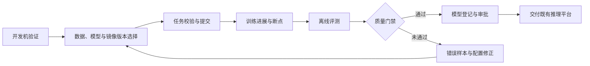

## 1.2 已确认的环境约束

1. 所有机房统一使用`/data/hpc/home`和`/share`两条网络盘路径。产品不得再暴露`/mnt/shared`、`/data/jiangsu`、`/data/liangjiang`等历史或假设路径。
2. `/data/hpc/home/<user>`用于个人代码、试验输出和个人断点，`/share`用于团队共享数据、分词器、模板和共享产物。开发机与正式训练任务必须看到一致的逻辑路径。
3. 训练平台运行在`UAT`环境，不能直连金融云生产或公网数据源。数据由有权限的人员先拷贝到网络盘，平台只负责登记、校验、授权和只读引用，不负责下载、同步或入湖。
4. 本文中的`iter`统一指全局优化器更新步数，即所有训练进程完成一次梯度同步和参数更新后的计数；`epoch`表示完整遍历一次训练数据。
5. 训练平台负责离线训练、评测、模型包校验和交付记录，不承载在线推理流量、弹性扩缩容和发布路由。

数据进入平台的边界如下：


## 1.3 规划口径

每个功能只规划在一个季度内完成，不允许同一功能跨季度交付。如果能力需要分阶段建设，必须拆成可独立验收的不同功能，并分别规划季度和优先级。

优先级只在同一季度内部比较，不在全局把早期季度一律标为`P0`、后期季度一律标为`P1`或`P2`。后一季度的`P0`表示该季度阶段出口所必需，并不比前一季度的`P1`更不重要，只是建设顺序不同。

|优先级|判断标准|
|---|---|
|`P0`|本季度阶段出口所必需，做不到则该季度目标无法验收|
|`P1`|本季度应当交付，能明显补齐主路径，但不阻塞阶段出口|
|`P2`|本季度内的增强项，资源不足时可让路给同季度`P0`和`P1`|

季度目标为：`2026 Q4`完成预训练可靠性、实验分析闭环和`SFT MVP`；`2027 Q1`完成数据、评测、模型治理和`Harbor`镜像管理；`2027 Q2`完成偏好数据、工作流和模型交付；`2027 Q3`完成强化学习、多模态扩展和规模化交付；`2027 Q4`完成漂移分析、模型图谱等效率增强。

## 1.4 总体技术架构原则

平台以数据集版本、镜像版本、开发机工作空间、任务规格、任务运行、实验项目与`Run`、断点、评测运行、模型版本和交付请求为核心对象。开发机和任务规格引用镜像管理模块提供的不可变镜像版本；工作流只编排这些对象的不可变引用，治理能力提供统一的项目、权限、审计、预算和通知约束。

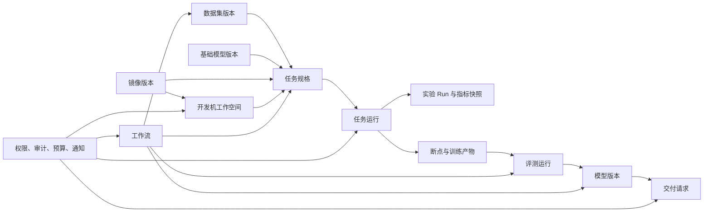

- 每个模块只维护自身对象和生命周期，跨模块通过稳定接口、不可变资源引用、批量查询契约或事件传递摘要，不直接访问其它模块的内部数据结构。
- 列表、聚合和图谱查询使用批量接口、分页、缓存或派生快照控制装配成本，禁止按列表项循环调用详情接口形成`N+1`查询。完整训练曲线保留在共享存储的`tfevents`或后续接入的指标存储中，日志保留在现有日志系统中，业务库只保存索引、最新指标快照和错误摘要。
- 状态、类型、阶段、动作、恢复策略等枚举在代码中用固定命名类型表达，前端运行时文案使用中文，不建设字典模块和`i18n`语言包；功能模块禁用后，前端入口和字段完全隐藏，后端可选依赖降级为空结果或跳过非强制步骤，历史数据继续保留并可在重新启用后恢复。
- 新增适配层只用于隔离已确认的变化点，例如不同训练框架、评测器和推理平台；稳定的项目、任务、数据和模型能力优先直接调用现有服务契约，避免重复建设窄接口。

# 2. 能力规划概览

每个功能只进入一个季度，只标一个优先级。优先级在季度内部比较：`P0`是该季度阶段出口所必需，`P1`是同季度应当交付但不阻塞出口的能力，`P2`是同季度可让路的增强。表内按季度由近到远排列，同一季度内按`P0`、`P1`、`P2`排序。

|编号|模块|功能|功能描述|解决痛点/场景|季度规划|优先级|
|---|---|---|---|---|---|---|
|`DEV-01`、`DEV-02`、`DEV-03`、`DEV-04`|开发环境与配置|开发机工作空间|提供`Web Shell`、可选`JupyterLab`、持久目录和一键转训练任务；开发机走资源队列占用额度，闲置后自动回收|算法人员要在个人开发机和平台训练之间来回切换，两套环境带来心智负担；试验配置靠手工复制，空闲`GPU`长期占用且不计入队列额度|`2026 Q4`|`P0`|
|`CFG-01`|开发环境与配置|统一路径规范|统一示例、模板和校验中的输入、输出与断点路径|历史盘符导致跨集群失败或产物写入错误位置|`2026 Q4`|`P0`|
|`CLI-01`、`CLI-02`|开发环境与配置|`aitrain`与统一任务规格|页面和命令行共用版本化`train.yaml`及一致的校验、提交、日志和取消能力|页面、脚本和历史命令字段漂移，批量训练难以自动化和复现|`2026 Q4`|`P0`|
|`JOB-01`、`JOB-02`、`JOB-03`、`JOB-04`|任务提交与观测|提交前校验与预览|校验路径、权限、目录、并行关系和结构化配置，预览实际读写范围|明显错误在排队后才暴露，用户误以为平台会搬运数据|`2026 Q4`|`P0`|
|`SCH-01`|任务提交与观测|调度过程可视化|以`Pod`为展示单元呈现队列准入、整组等待、资源匹配、调度、镜像拉取和容器启动过程|任务级“排队中”无法定位具体阻塞`Pod`和资源缺口，用户只能反复询问运维|`2026 Q4`|`P0`|
|`NTF-01`|任务提交与观测|任务运行事件通知|将排队超时、失败、疑似停滞、断点失败和恢复结果通知责任人|算法人员无法持续守在页面，关键故障容易错过处理窗口|`2026 Q4`|`P0`|
|`CKPT-01`|断点与故障恢复|断点清单与完整性|按全局`iter`登记断点大小、完整性、写入耗时和加载校验结果|用户靠文件名猜断点是否可用，错误恢复重复浪费`GPU`|`2026 Q4`|`P0`|
|`CKPT-02`|断点与故障恢复|再次提交与恢复策略|复用任务配置并校验断点、模型、数据、并行和目录占用，记录实际恢复结果|再次提交不等于恢复，配置变化可能误加载或覆盖产物|`2026 Q4`|`P0`|
|`DATA-01`、`DATA-02`、`DATA-03`|数据工程与治理|数据集登记与不可变版本|登记已落盘目录、文件清单、内容哈希、格式、分词器和规模|目录可能被覆盖、缺分片或尚未落盘，训练输入无法复现|`2026 Q4`|`P0`|
|`SFT-01`、`SFT-02`|监督微调与后训练|任务类型与基础模型约束|区分全量`SFT`、`LoRA`、`QLoRA`等任务并校验基础模型兼容性|将微调当作预训练会漏掉模板、产物和评测要求|`2026 Q4`|`P0`|
|`SFT-03`、`SFT-04`、`SFT-05`、`SFT-06`、`SFT-07`|监督微调与后训练|数据协议与监督范围|统一消息协议，校验模板、划分、泄漏、`loss mask`、截断和`packing`|数据格式和监督范围错误会静默降低有效训练质量|`2026 Q4`|`P0`|
|`SFT-08`、`SFT-09`、`SFT-10`、`SFT-11`|监督微调与后训练|微调策略与资源估算|配置`LoRA/QLoRA`、精度、分布式策略并估算显存、时长和存储|错误组合在申请资源后才失败，资源规格容易过大或不足|`2026 Q4`|`P0`|
|`SFT-12`|监督微调与后训练|微调断点恢复|恢复权重、优化器、调度器、随机状态、数据游标和模板配置|只恢复权重会改变学习率和样本顺序，结果不可比较|`2026 Q4`|`P0`|
|`SFT-13`|监督微调与后训练|微调产物分类与血缘|区分基础模型、`adapter`、合并模型、断点和评测报告|产物混放会导致加载错误和父子模型关系丢失|`2026 Q4`|`P0`|
|`SFT-15`|监督微调与后训练|训练后自动评测|自动比较基础模型与微调模型的能力、安全和回归指标|训练`loss`下降不能证明业务效果提升或安全能力未退化|`2026 Q4`|`P0`|
|`EVAL-01`、`EVAL-02`|评测与质量门禁|评测集与指标目录|版本化标准、业务、安全、回归和人工评测集及适用指标|只看训练`loss`或单一总分无法判断业务与安全效果|`2026 Q4`|`P0`|
|`EVAL-03`、`EVAL-04`、`EVAL-05`、`EVAL-06`|评测与质量门禁|统一评测运行器|适配多种评测器，固化配置并输出逐样本和聚合协议|脚本、参数和指标口径不一致，结果无法横向比较|`2026 Q4`|`P0`|
|`EVAL-09`|评测与质量门禁|基线回归对比|逐指标和逐样本比较候选与指定基线模型|目标能力提升可能掩盖通用或安全能力退化|`2026 Q4`|`P0`|
|`GOV-04`|平台治理与开放能力|凭据注入与脱敏|通过`Secret`或密钥服务注入凭据并自动脱敏输出|令牌写入配置或日志会随导出、截图和产物扩散|`2026 Q4`|`P0`|
|`GOV-09`|平台治理与开放能力|任务可靠性策略|统一超时、幂等取消、分类重试和人工接管|网络抖动和错误重试可能重复提交或无限消耗资源|`2026 Q4`|`P0`|
|`GOV-11`|平台治理与开放能力|统一开放接口|`Web`、`aitrain`和自动化系统共用版本化接口、错误码和幂等键|多入口各自实现提交逻辑会产生状态不一致|`2026 Q4`|`P0`|
|`PROG-01`、`PROG-02`|任务提交与观测|训练进展与停滞提示|记录最后全局`iter`及实际发生时间、吞吐、指标采集时间、任务阶段和最近完整断点；连续多个观察窗口没有进展时给出带依据的疑似停滞提示|通信挂起、慢`rank`或数据读取阻塞时，任务和进程可能仍显示运行中；单看任务状态或`GPU`利用率无法判断优化器是否推进，单看`iter`又可能把评测和断点保存误报为故障|`2026 Q4`|`P1`|
|`LIST-01`|任务提交与观测|任务列表进展摘要|展示当前`iter`、步耗时、吞吐、预计剩余时间、最后一步时间、指标采集时间和进展状态，支持按疑似停滞时长筛选与排序|任务列表无法区分正常推进、进展变慢、疑似停滞和指标采集失败|`2026 Q4`|`P1`|
|`DET-01`、`DET-02`|任务提交与观测|任务详情与日志定位|统一展示实际路径，并按进程、节点、时间和关键字检索日志|多机日志和实际读写位置不透明，排障耗时长|`2026 Q4`|`P1`|
|`EXP-02`|实验分析|实验项目与`Run`管理|按工作集群和项目组织实验，支持筛选、分页、移动、删除及历史任务补建|实验数量增长后只能靠任务名称查找，历史任务和未归类实验容易丢失|`2026 Q4`|`P1`|
|`EXP-01`|实验分析|实验入口与双向导航|提供训练中心侧栏入口，并支持任务详情、实验列表、实验详情之间互相跳转|状态、日志和曲线分散，用户需要反复搜索名称且容易打开错误实验|`2026 Q4`|`P1`|
|`EXP-03`|实验分析|关键指标快照与快速排序|将最新`Loss`、进度、吞吐、最后一步时间、指标采集时间和读取错误写入平台快照，支持服务端筛选、排序和分页|逐个打开完整曲线才能判断进展，团队无法快速定位异常或候选实验|`2026 Q4`|`P1`|
|`EXP-04`|实验分析|`TensorBoard`按需打开|在实验详情按需启动看板，通过平台鉴权的同源地址嵌入或新标签打开，空闲后自动回收|看板常驻浪费资源，直接暴露机房端口又绕过平台权限与审计|`2026 Q4`|`P1`|
|`EXP-05`|实验分析|实验对比|选择多条`Run`并排比较关键指标和超参差异，同机房时再打开完整曲线对比|手工切换页面难以解释实验差异，跨机房强行叠加曲线不可用|`2026 Q4`|`P1`|
|`EXP-06`|实验分析|`Run`生命周期与异常降级|提交任务时幂等创建`Run`，读盘或看板失败时保留任务状态和历史数据并给出可理解提示|实验创建失败可能影响训练主链路，空指标被误显示为`0`会造成错误判断|`2026 Q4`|`P1`|
|`CKPT-03`|断点与故障恢复|停止风险提示|停止前显示最后完整断点、写入状态和预计丢失步数|值班人员无法判断停止会丢失多少有效进度|`2026 Q4`|`P1`|
|`DATA-10`、`DATA-11`|数据工程与治理|安全预览与只读访问|提供脱敏抽样预览、字段统计和项目级只读挂载|用户无法确认数据内容，直接下载又会扩大敏感数据暴露面|`2026 Q4`|`P1`|
|`EVAL-12`|评测与质量门禁|评测产物查询|保存原始输出、错误样本、配置和环境并支持样本级查询|只保存均分无法复盘具体失败或形成证据链|`2026 Q4`|`P1`|
|`GOV-01`|平台治理与开放能力|统一项目归属|统一用户、团队、项目、任务、数据、模型和队列关系|资产靠备注维护，故障、预算和违规事件找不到责任人|`2026 Q4`|`P1`|
|`RCP-01`、`RCP-02`|开发环境与配置|训练任务模板|提供版本化模板，并联合校验资源、并行、批次、显存和挂载配置|训练配置依赖个人经验，任务在分配资源后才因参数冲突失败|`2027 Q1`|`P0`|
|`DATA-04`、`DATA-05`、`DATA-06`|数据工程与治理|数据质量、安全与去重|执行格式、长度、重复、敏感信息和违规内容检查并输出样本级原因|脏数据、泄漏和敏感信息常在训练或交付后才暴露|`2027 Q1`|`P0`|
|`DATA-07`、`DATA-08`|数据工程与治理|授权与可复现处理|记录授权来源、用途限制、脚本、规则、种子、分词器和统计报告|数据可读不等于可训练，处理参数不透明导致结果无法重建|`2027 Q1`|`P0`|
|`DATA-12`|数据工程与治理|数据血缘|关联原始目录、处理任务、数据版本、训练、评测和模型|数据问题或删除请求发生时无法确定受影响的派生模型|`2027 Q1`|`P0`|
|`EVAL-08`|评测与质量门禁|安全评测|覆盖越权、注入、泄漏、幻觉、越狱和工具调用风险|业务微调可能提升命中率却破坏隐私和拒答能力|`2027 Q1`|`P0`|
|`EVAL-13`、`EVAL-14`|评测与质量门禁|质量门禁与评测报告|配置阈值、退化幅度、风险项和审批条件并生成对比报告|人工看表容易漏掉不可退化指标，无法形成可签字材料|`2027 Q1`|`P0`|
|`MODEL-01`、`MODEL-02`|模型资产与交付|模型注册与血缘|登记各类模型并关联训练、数据、配置、镜像、评测和责任人|权重散落在目录中，无法判断来源和可交付版本|`2027 Q1`|`P0`|
|`MODEL-03`|模型资产与交付|模型完整性|以不可变版本和内容哈希管理大文件传输及校验|分片缺失或权重损坏可能产生隐蔽的推理错误|`2027 Q1`|`P0`|
|`MODEL-04`、`MODEL-05`、`MODEL-06`|模型资产与交付|模型卡、状态与权限|管理模型用途、风险、生命周期状态和下载交付权限|文件存在不代表已审核，长期共享权限扩大泄露面|`2027 Q1`|`P0`|
|`WF-06`|工作流与自动化|人工审批节点|评测通过后由责任角色审批，意见和证据写入模型记录|自动指标无法覆盖所有业务风险，实验模型可能绕过确认|`2027 Q1`|`P0`|
|`GOV-02`、`GOV-03`|平台治理与开放能力|项目角色与资源授权|区分提交、协作、审批、只读和运维角色并分别授权资源|多人项目无法按职责分权，终端与详情页可能扩大访问范围|`2027 Q1`|`P0`|
|`GOV-05`|平台治理与开放能力|统一审计|记录权限、任务、数据、模型、审批、导出和删除动作|安全或资源争议发生时无法还原责任与影响范围|`2027 Q1`|`P0`|
|`IMG-01`|镜像管理|`Harbor`检索与常用镜像管理|按需检索授权`Harbor`项目并保存常用镜像，标记训练或开发用途，支持平台预置两类公共镜像|常用镜像依赖用户记忆，平台无法沉淀和分类经过验证的运行环境|`2027 Q1`|`P1`|
|`IMG-02`|镜像管理|分类下拉选择与版本固化|训练任务和开发机分别从适用的已保存镜像和平台预置镜像中选择，提交时固化不可变摘要|手工地址容易拼错，错误用途和漂移标签会导致任务启动失败或运行环境不一致|`2027 Q1`|`P1`|
|`REC-01`、`REC-02`|断点与故障恢复|半自动与自动故障恢复|识别可恢复故障，生成缩容草案或按策略换节点后自动再次提交|硬件和通信故障依赖人工找断点、改规模和重提任务|`2027 Q1`|`P1`|
|`DATA-09`|数据工程与治理|数据混合与采样|版本化多数据集权重、温度、上限、重复轮数和实际采样量|目录相同但采样策略不同会产生不可解释的训练分布|`2027 Q1`|`P1`|
|`SFT-14`|监督微调与后训练|模型合并与导出校验|提供`adapter`合并、权重导出、格式检查和生成冒烟测试|训练产物可能直到交付时才暴露无法加载的问题|`2027 Q1`|`P1`|
|`SFT-17`|监督微调与后训练|模型卡草稿|依据任务血缘自动生成用途、限制、参数和评测证据|只有权重没有使用边界和风险信息，业务方无法评审|`2027 Q1`|`P1`|
|`EVAL-07`|评测与质量门禁|模型裁判|版本化裁判模型、提示词和解析器，并支持人工复核|开放式回答缺少标准答案，裁判偏差可能影响放行结论|`2027 Q1`|`P1`|
|`EVAL-10`|评测与质量门禁|评测污染检查|标记训练集、历史评测集和公开语料的重叠风险|测试题泄漏会造成虚高分和上线后的效果落差|`2027 Q1`|`P1`|
|`EVAL-15`|评测与质量门禁|评测执行隔离|限制自定义评测脚本的网络、文件、凭据和资源访问|第三方评测代码可能泄露数据或影响集群稳定性|`2027 Q1`|`P1`|
|`WF-01`、`WF-02`|工作流与自动化|版本化工作流模板|以数据检查、训练、评测、门禁、登记和审批组成`DAG`|人工复制路径容易漏步骤、串版本和形成流程差异|`2027 Q1`|`P1`|
|`WF-03`、`WF-08`|工作流与自动化|步骤状态、重试与幂等|按步骤管理超时、取消、恢复、人工暂停和唯一运行|单步失败导致整条流程重跑，重复提交覆盖产物|`2027 Q1`|`P1`|
|`GOV-10`|平台治理与开放能力|业务与治理通知|通知评测退化、门禁失败、待审批、数据违规和预算超限|通知只面向运维会遗漏算法和业务责任人|`2027 Q1`|`P1`|
|`SFT-16`|监督微调与后训练|早停与最佳断点|支持按验证指标早停并区分最佳断点和最新可恢复断点|固定步数可能过拟合，最后断点不一定质量最佳|`2027 Q1`|`P2`|
|`SFT-19`|监督微调与后训练|回放集与遗忘控制|版本化通用、安全和领域数据配比，并比较微调前后退化|领域能力提升可能以通用能力和安全拒答退化为代价|`2027 Q1`|`P2`|
|`EXP-07`|实验分析|`SwanLab`实验分析适配|关联平台`Run`与`SwanLab`实验，同步白名单摘要指标，并从实验详情打开经认证的`SwanLab`分析页面|团队后续需要使用`SwanLab`本地记录、协作分析和报告能力，但直接切换平台会造成实验索引、权限和指标排序割裂|`2027 Q1`|`P2`|
|`DATA-13`、`DATA-14`、`DATA-15`|数据工程与治理|偏好、标注与合成数据|统一偏好协议并登记标注批次、生成配置、抽检和人工审核|偏好方向错误、标注规则漂移和合成污染难以追溯|`2027 Q2`|`P0`|
|`MODEL-07`、`MODEL-08`|模型资产与交付|交付包与兼容性校验|生成完整模型包并校验权重、分词器、模板、量化和最小生成|下游常收到不完整或不可加载的模型产物|`2027 Q2`|`P0`|
|`MODEL-09`|模型资产与交付|推理平台交接|向既有推理平台提交已审批模型并回写部署状态|手工上传容易交错版本，训练平台又不应重复建设在线服务|`2027 Q2`|`P0`|
|`WF-04`|工作流与自动化|步骤缓存|按输入版本、镜像和参数复用数据处理或评测结果|调参时重复执行不变步骤，浪费资源和时间|`2027 Q2`|`P0`|
|`GOV-06`、`GOV-07`|平台治理与开放能力|用量、配额与预算|记录`GPU`、队列、存储和交付成本并配置预算与并发限制|无法解释队列拥堵和项目成本，超预算只能事后处理|`2027 Q2`|`P0`|
|`SFT-20`|监督微调与后训练|切片分析|按长度、语言、业务标签、难度和能力标签对比结果|总体均分会掩盖少数语言和高风险样本退化|`2027 Q2`|`P1`|
|`EVAL-11`|评测与质量门禁|评测统计可信度|展示样本量、分层统计、置信区间和可比性提示|小样本偶然波动可能被误判为显著提升|`2027 Q2`|`P1`|
|`EVAL-16`|评测与质量门禁|评测缓存与失败重跑|以模型、套件、提示词、参数、数据和镜像生成缓存键|重复完整评测成本高，粗粒度缓存又可能复用错误结果|`2027 Q2`|`P1`|
|`WF-05`|工作流与自动化|并行实验|并行多组超参、`LoRA`配置或评测套件并汇总成本|手工复制任务容易漏改参数，串行试验反馈慢|`2027 Q2`|`P1`|
|`WF-09`|工作流与自动化|工作流资源计划|配置预算、并发、优先级、队列和超限处理策略|并行分支可能瞬间占满队列且总成本不可预估|`2027 Q2`|`P1`|
|`WF-10`|工作流与自动化|历史运行复现与差异|基于历史输入和参数生成新运行并显示完整差异|手工抄配置会遗漏默认值，评审者无法解释结果变化|`2027 Q2`|`P1`|
|`GOV-12`|平台治理与开放能力|`Python SDK`与受控自动化|提供机器可读输出、短期令牌、最小权限和调用审计|自动化直接复用管理员凭据会放大权限和重复提交风险|`2027 Q2`|`P1`|
|`RL-01`|强化学习后训练|奖励资产登记|登记奖励模型或规则奖励的版本、范围、校准集和限制|奖励逻辑隐藏在脚本中，实验目标和漂移无法追溯|`2027 Q3`|`P0`|
|`RL-02`、`RL-03`|强化学习后训练|强化学习运行与安全监控|编排多角色模型和`rollout`资源，监控奖励、`KL`、拒答率和安全指标|多阶段失败难恢复，奖励投机不能仅靠总奖励发现|`2027 Q3`|`P0`|
|`SFT-18`|监督微调与后训练|多模态与工具调用扩展|预留媒体适配、格式校验、模态`token`和批处理接口|后续增加图文、音频或工具调用会破坏现有文本协议|`2027 Q3`|`P1`|
|`MODEL-10`|模型资产与交付|灰度、回滚与禁用联动|同步推理平台的灰度、回滚和禁用事件及证据|真实流量问题出现后缺少快速回退和版本关联|`2027 Q3`|`P1`|
|`WF-07`|工作流与自动化|事件与计划触发|按镜像、数据、门禁变化、定时计划或人工操作触发流程|依赖人工记忆会漏跑，自动触发缺少去重又会批量误提交|`2027 Q3`|`P1`|
|`MODEL-11`|模型资产与交付|模型产物保留与清理|按引用、状态和保留策略审批清理中间与过期产物|存储长期堆积，但直接删除会破坏复现与合规证据|`2027 Q3`|`P2`|
|`GOV-08`|平台治理与开放能力|平台`SLO`与错误预算|定义可用性、成功率和恢复时长目标并形成月度报告|平台扩张后无法用统一口径安排可靠性建设优先级|`2027 Q3`|`P2`|
|`DATA-16`|数据工程与治理|数据漂移分析|比较数据版本的数量、语言、标签、长度和质量指标变化|历史模板和评测结论可能在新数据分布上失效|`2027 Q4`|`P0`|
|`MODEL-12`|模型资产与交付|模型家族图谱|查询基础模型、派生模型、`adapter`、评测和交付环境关系|模型增长后无法判断影响范围和最佳可用版本|`2027 Q4`|`P1`|

# 3. 功能模块规划

## 3.1 开发环境与配置

### 3.1.1 开发机工作空间

**背景介绍**：算法人员需要在与正式训练一致的镜像、存储和权限环境中改代码、抽检数据和运行小样本。当前痛点如下：

1. 没有平台开发机入口，只能一边在自己的开发机上写代码，一边到平台上提交训练。两套环境来回切换，镜像、路径、依赖和启动命令都要自己对齐，心智负担大，也容易出现“开发能跑、训练找不到文件”。
2. 开发机如果绕开资源队列单独占卡，正式训练的额度就对不上账。
3. 开发机如果建起来却长期没人用，空闲`GPU`会一直压着队列，别人也排不进去。

**建设目标**：
1. 支持创建、启动、停止和闲置回收开发机，让改代码、抽检数据和提交训练发生在同一套环境里，减少环境切换。
2. 创建时必须选择项目已授权的资源队列，申请的卡数计入该队列额度，停止或回收后立即释放。
3. 默认提供不依赖`JupyterLab`进程的`Web Shell`，按需启用`JupyterLab`。开发机持久挂载`/data/hpc/home`和`/share`，展示队列额度、数据授权与资源预估，并能基于当前镜像摘要、工作目录和启动配置生成训练任务差异预览。
4. 超过空闲阈值后先通知责任人，再自动停止实例并回收额度，个人目录和未提交的本地修改继续保留，用户可重新启动同一工作空间。

开发机从创建到回收、恢复的生命周期如下：

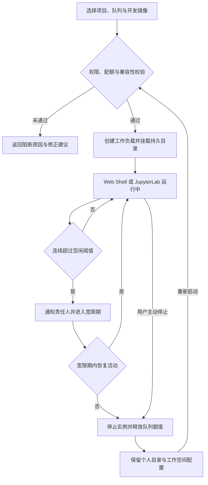

**建议方案**：复用现有任务调度、资源队列和镜像候选契约创建长生命周期工作负载，不另建开发机专用资源池。创建前按队列配额、项目权限、镜像状态和机型兼容性做准入校验，运行中把开发机作为队列占用对象计入额度快照。通过终端网关发放短期会话并记录连接审计；用户目录使用持久卷或现有网络盘，`/home/<user>`仅作为到个人目录的兼容软链。闲置判定同时看终端会话、可选`JupyterLab`内核和`GPU`利用率，连续低于阈值才进入回收；回收前发送通知并保留宽限期，回收动作幂等，失败写入审计但不重复扣额度。开发机模块通过任务规格契约输出草案，不直接创建训练模块内部对象；数据选择器只批量查询已登记且已授权的数据版本。

首期不引入完整`JupyterHub`，不开放绕过平台认证和审计的直连`SSH`，不建设源码仓库，也不在开发机提供从金融云生产或公网一键拉数。开发机只是由平台治理的交互式运行环境，正式任务仍使用不可变镜像和版本化任务规格。

### 3.1.2 统一路径规范

**背景介绍**：应当规范使用`/share/...`及`/data/hpc/home/<user>/...`作为训练任务和开发机的统一路径。

**建设目标**：所有示例、模板、校验提示和详情页统一使用`/share/...`及`/data/hpc/home/<user>/...`，并明确输入、输出、实验和断点目录的用途。历史路径只用于识别并给出迁移提示，不允许新任务继续提交。

**建议方案**：在任务规格校验器中维护统一的路径策略，由页面、`aitrain`和模板共同调用；路径检查分为语法范围、目标集群可见性、读写权限和目录用途四类错误码。不要在不同入口重复硬编码盘符。

### 3.1.3 `aitrain`与统一任务规格

**背景介绍**：大规模训练依赖脚本和批量操作，当前痛点如下：

1. 仅靠页面填写无法形成可审计、可比较和可自动化的任务规格。
2. 页面与命令行字段分叉，复现时对不上同一份配置。

**建设目标**：提供`auth`、`validate`、`dry-run`、`submit`、`rerun`、`logs`和`cancel`能力。页面可导入、编辑和导出同一份版本化`train.yaml`，命令行输出稳定的任务标识、状态、错误码、重试建议和机器可读结果。

**建议方案**：定义单一任务规格模式和兼容版本，由服务端完成默认值填充和最终校验；`Web`与`aitrain`调用同一应用服务。客户端只做即时提示，不能复制服务端规则；提交和再次提交使用幂等键，凭据保存在系统凭据存储而非配置文件。

从开发验证到正式提交使用同一份任务规格，流程如下：


建议的最小命令面如下。页面必须与这些命令共用同一份任务规格和服务端校验结果，避免页面能过、命令行不过，或两边报错不一致：

```text
aitrain auth login
aitrain job validate -f train.yaml
aitrain job dry-run -f train.yaml
aitrain job submit -f train.yaml --output json
aitrain job logs <id> --role worker --replica 0 --tail 200
aitrain job rerun <id> --resume-policy latest
aitrain job cancel <id>
```

### 3.1.4 训练任务模板

**背景介绍**：节点、卡数、并行策略、全局批次、镜像、挂载和`NCCL`参数相互依赖，依靠个人经验拼装会在资源分配后才暴露问题。

**建设目标**：提供官方、团队和个人三级版本化模板，预置经验证的模型规模、资源规格和框架配置。创建任务时联合校验总卡数与张量、流水线、上下文和数据并行关系，检查全局批次整除、显存风险、配置版本和挂载一致性。

模板实例化时需要联合处理的输入和校验如下：

|校验域|模板提供的内容|实例化时的关键校验|
|---|---|---|
|资源拓扑|节点数、单节点卡数、机型和队列建议|总卡数、队列额度、目标机型可用性和整组调度要求|
|并行与批次|张量、流水线、上下文、数据并行度及微批次|并行乘积与总卡数一致，全局批次可整除且梯度累积合法|
|模型与显存|模型规模、精度、优化器和梯度检查点|模型兼容性、显存风险及通信与计算配置冲突|
|运行环境|镜像版本、框架版本、启动入口和环境变量|镜像用途、摘要、驱动、`CUDA`及目标机型兼容性|
|数据与存储|数据、模型、输出、日志和断点挂载片段|路径范围、权限、只读输入、输出占用和跨集群可见性|

**建议方案**：模板保存任务规格片段和受控变量，不复制调度或训练实现；实例化后生成完整快照，后续模板变更不影响历史任务。框架差异通过模板适配器隔离，通用资源与路径校验直接复用任务规格服务。

## 3.2 镜像管理

### 3.2.1 `Harbor`检索与常用镜像管理

**背景介绍**：`Harbor`中可能包含大量与训练平台无关的项目、仓库和历史标签，将全部镜像同步到平台既会产生持续的扫描与存储成本，也会让镜像列表充满算法人员不会使用的内容。当前真正需要的是在用户选择镜像时提供受权限控制的`Harbor`检索能力，并把确认会重复使用的镜像保存为平台内可治理的常用镜像。保存后还要明确镜像适用于训练任务、开发机或两种场景，避免算法人员在错误入口使用只针对某一场景制作的镜像。

**建设目标**：镜像管理页面支持在已配置且获批的`Harbor`实例和项目范围内，按项目、仓库、标签或摘要分页检索镜像。检索结果只用于当前查询，不自动写入平台数据库；用户确认后才能将目标镜像保存到常用镜像列表。保存时至少记录显示名称、完整标签引用、不可变摘要、所属`Harbor`项目、推送时间、镜像大小、架构、扫描摘要、维护人、框架、`CUDA`与驱动兼容信息，并通过“可用于训练任务”和“可用于开发机”两个独立开关声明用途，至少启用一个开关，同一镜像允许同时适用于两种场景。

平台管理员通过相同的检索和保存流程，将经过验证的镜像标记为平台预置镜像，并分别开启训练任务或开发机用途。平台预置镜像在授权范围内对算法人员可见，普通用户可以直接选择，但不能修改其来源、摘要、用途和启用状态。非预置镜像按照项目权限控制查看、使用、编辑和移除。已保存标签在`Harbor`中指向新摘要时，平台保留原摘要及历史引用，只有用户显式执行“更新镜像版本”并确认差异后才生成新的镜像版本，不能静默覆盖。

常用镜像的核心治理信息与约束如下：

|治理信息|维护方式|使用约束|
|---|---|---|
|来源与版本|保存时从`Harbor`重新解析仓库、标签、摘要和推送时间|标签用于识别，摘要作为不可变运行版本，禁止静默跟随标签漂移|
|用途分类|独立维护“可用于训练任务”和“可用于开发机”开关|至少开启一个用途；训练与开发入口分别按用途过滤|
|平台预置|管理员将已验证的常用镜像发布为预置镜像|普通用户可选择但不能修改来源、摘要、用途和启用状态|
|兼容信息|维护框架、架构、`CUDA`、驱动、机型和扫描摘要|提交或创建开发机时重新校验，未知信息不得依据名称推断|
|生命周期|支持启用、停用、更新版本和移除|更新生成新版本；停用或软删除不得破坏历史引用|

**建议方案**：`Harbor`适配器只在用户主动检索、查看选中镜像详情或执行版本更新时调用`Harbor API v2`，不执行首次全量同步、定时全库对账或`Webhook`增量发现。检索采用分层且有边界的查询：先选择注册表和授权项目，再分页搜索仓库，最后按选中的仓库分页读取制品和标签，禁止遍历所有项目后逐仓库查询。检索接口使用`GET`和查询参数表达项目、关键词及分页条件，单页最多返回`50`条；保存常用镜像使用`POST`，修改名称、用途开关、预置状态和兼容信息使用`PUT`，移除使用`DELETE`并采用软删除保留历史引用。时间点字段统一返回`Unix`毫秒时间戳。

保存操作必须在同一服务端请求中重新解析标签摘要并校验项目权限，避免使用过期的前端检索结果。平台本地只持久化用户明确保存的镜像和必要治理元数据，不保存完整漏洞报告，也不复制镜像层；完整扫描报告继续留在`Harbor`。镜像记录以来源、仓库和摘要形成稳定版本标识，以“可用于训练任务”“可用于开发机”和“平台预置”布尔字段表达使用范围。单实例按最多`10,000`条已保存镜像设计，本地列表按权限、用途、预置状态、启用状态和更新时间建立匹配实际查询路径的索引，并使用不同数据规模下的`EXPLAIN ANALYZE`验证筛选、排序和分页。镜像被移除后保留软删除记录，不破坏历史任务、开发机和模型血缘。

`Harbor`访问使用具备所需最小读取权限的机器人账号，凭据只保存在`Secret`或密钥服务中，不进入接口响应、任务快照和日志。远程检索设置超时、限流和短期缓存，失败时只影响本次搜索，不清空或隐藏已经保存的常用镜像；读取扫描摘要、架构或兼容信息失败时明确显示未知，不根据镜像名称推断。

### 3.2.2 分类下拉选择与版本固化

**背景介绍**：如果训练任务和开发机仍然共用一个无分类镜像列表，用户可能把只包含训练入口的镜像用于交互式开发，或把带有开发工具但未经正式训练验证的镜像用于大规模任务。继续保留无约束文本框还会让用户绕过常用镜像和平台预置镜像，重新产生地址拼写、权限和标签漂移问题。因此两个入口需要分别消费镜像用途开关，同时保留平台推荐的预置镜像和项目常用镜像。

**建设目标**：训练任务的创建、编辑和再次提交页面只展示开启“可用于训练任务”的已保存镜像；开发机页面只展示开启“可用于开发机”的已保存镜像。两类下拉框都包含当前用户有权使用的平台预置镜像和非预置常用镜像，并明确展示平台预置标识、仓库、标签、摘要缩写、推送时间、维护人、框架、`CUDA`及兼容性提示。平台可以设置推荐顺序，但不应在用户无感知的情况下替换其已选镜像。列表没有目标镜像时，用户从表单跳转到镜像管理页面检索`Harbor`并保存，保存成功后返回原表单继续选择。

用户提交训练任务或创建开发机时，平台重新校验项目权限、用途开关、启用状态、扫描策略和目标机型兼容性，同时保存镜像版本标识、用户看到的标签引用、实际摘要和解析时间，并优先以`repository@sha256:...`形式交给运行时。再次提交、任务模板和从开发机转训练任务默认复用已固化摘要；开发机所用镜像未开启训练用途时不能直接转为训练任务，必须先选择合规的训练镜像或由有权限人员补充用途并重新校验。

**建议方案**：镜像模块拥有已保存镜像、用途开关、预置状态、权限范围和版本历史，并分别向训练任务与开发机模块提供只读候选投影契约。训练候选固定过滤“可用于训练任务”，开发机候选固定过滤“可用于开发机”，再叠加项目权限、启用状态、扫描策略、架构、`CUDA`、驱动和目标机型条件；平台预置与普通常用镜像在同一有界查询中返回，不要求前端发起两次请求或逐项补查详情。候选查询只访问平台本地数据库，不在表单打开、关键词搜索或列表装配时调用`Harbor`。

下拉查询使用`GET`并支持关键词、分页和稳定排序，单页最多返回`50`条；查询次数只随一次用户操作保持固定，不随返回行数增加。训练任务与开发机通过构造时注入的公开契约消费最小投影，不访问镜像模块内部表。镜像管理模块禁用时，前端完全隐藏镜像管理菜单、平台预置标识和分类候选字段，并回退到现有手工镜像输入能力；后端保留已保存镜像、用途、版本和历史引用，模块重新启用后恢复原有候选列表。

按需检索、保存和分类使用的链路如下：


## 3.3 任务提交与观测

### 3.3.1 提交前校验与预览

**背景介绍**：提交前如果看不清配置对不对，当前痛点如下：

1. 路径、权限和并行参数错误通常在任务排队并占到资源后才失败。
2. 平台不负责拉数的边界若提示不清，用户会反复更换队列，却解决不了数据没落盘的问题。

**建设目标**：提交前逐项检查路径范围、目标集群目录存在性、读写权限、非空状态、输出占用、镜像权限与兼容状态和并行整除关系。预览页面展示解析后的输入、输出、断点、模型、镜像摘要与配置引用，并明确提示需要先将数据拷到网络盘。

提交前的主要校验类型、结果等级和处理方式如下：

|校验类型|关键检查|结果处理|
|---|---|---|
|路径与存储|路径范围、目录存在性、输入非空、目标集群可见性|输入缺失或路径非法时阻断；探测超时显示检查失败，不视为通过|
|权限与数据|项目授权、读写权限、数据版本状态和用途限制|无权限、数据未落盘或版本被禁用时阻断|
|镜像与运行环境|镜像权限、用途开关、不可变摘要、驱动、`CUDA`和机型|不兼容或镜像不可用时阻断；兼容信息未知时给出风险警告|
|资源与并行|队列额度、总卡数、并行乘积、全局批次和显存风险|确定性冲突时阻断；估算偏高或数据不足时警告|
|输出与配置|输出目录占用、断点策略、配置引用和最终默认值|覆盖风险和非法引用时阻断；预览完整解析快照|

**建议方案**：采用服务端校验流水线返回结构化检查项，耗时的目标集群探测设置超时和短期缓存；同一校验结果供页面和命令行使用。阻断项与警告项使用稳定错误码，避免从启动命令字符串猜测结构化字段。

### 3.3.2 调度过程可视化

**背景介绍**：一个分布式训练任务通常包含多个不同角色和副本的`Pod`。同一任务中可能部分`Pod`已经完成调度，部分仍在等待资源，还有个别`Pod`卡在镜像拉取或容器启动。任务级“排队中”和“启动中”既无法区分配额不足、资源碎片、拓扑不匹配、整组资源未凑齐或镜像拉取失败，也无法定位具体受阻的`Pod`，因此调度过程必须以`Pod`为核心展示维度。

**建设目标**：

1. 在任务详情中按`Pod`列出角色、副本序号、`Pod`名称、当前阶段、所在节点、申请资源、等待时长、首要阻塞原因、最近事件时间和建议动作，支持按角色、阶段、节点和异常状态筛选，并将异常或等待时间最长的`Pod`置前。
2. 选择单个`Pod`后，展示该`Pod`从创建、资源匹配、调度、镜像拉取到容器启动的独立时间线；`Pod`被重建时按逻辑角色与副本串联多次尝试，同时保留每次尝试的`Pod UID`，不得把新旧实例事件混为一条记录。
3. 提交、队列准入和整组等待属于任务或`PodGroup`级共享阶段。页面在任务顶部展示共享事件，并在受影响`Pod`的时间线中标记为“共享事件”，不能伪装成某个`Pod`自身故障。
4. 任务列表只展示`Pod`总数、已就绪数、异常数和当前最主要阻塞阶段等聚合摘要；详细调度过程仍以`Pod`维度展开。动态调度不承诺精确名次或启动时间，也不暴露其它用户身份。

单个`Pod`的调度时间线需要将底层事件归一为用户可理解的阶段：

|单个`Pod`的展示阶段|典型等待或失败原因|页面建议动作|
|---|---|---|
|准入与整组等待（共享事件）|项目预算或队列配额不足，多节点任务尚未凑齐全部资源|查看任务或`PodGroup`共享原因，调整规模或切换已授权队列|
|资源匹配|机型、显存、拓扑、亲和性或资源碎片不满足|查看缺口，调整机型、卡数或调度约束|
|`Pod`调度|节点不可用、污点、亲和性、挂载或运行策略冲突|查看该`Pod`的候选节点与归一化事件并联系平台运维|
|镜像拉取|镜像不存在、无权限、节点网络或缓存异常|检查已固化摘要和权限，必要时更换镜像|
|容器启动|入口命令、挂载、环境变量或健康检查失败|进入对应进程日志和配置快照定位|
|已就绪|容器已经通过启动检查，等待其它`Pod`或训练进程建立通信|查看整组就绪比例；单个`Pod`无异常时无需重复处理|

`Pod`维度调度视图的数据装配关系如下：

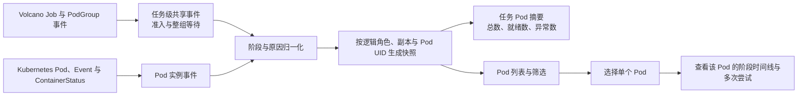

**建议方案**：采集`Volcano Job`、`PodGroup`以及`Kubernetes Pod`、`Event`、`ContainerStatus`事件，将任务级共享事件和实例级事件归一化为固定调度阶段。使用任务编号、逻辑角色、副本序号、`Pod UID`和尝试次数建立关联，异步写入每个`Pod`的最新状态快照及事件流；共享事件保留来源和影响范围，再批量关联到受影响的`Pod`。任务列表只读取预聚合摘要，任务详情分页读取`Pod`快照，用户展开某个`Pod`时再分页读取其事件，禁止页面按`Pod`逐个实时查询集群或逐项调用详情接口。模块关闭时隐藏调度详情入口但保留历史快照，采集暂时失败时展示最后更新时间和未知状态，不把缺失事件解释为调度成功。

### 3.3.3 训练进展与停滞提示

**背景介绍**：大规模分布式训练中确实存在任务和训练进程仍显示运行中，但全局训练步不再推进的场景。例如某个`rank`进入集合通信后无法返回、慢`rank`拖住其它进程，或者数据加载与共享存储读取长时间阻塞。此时只看任务状态无法发现问题，`GPU`利用率也只能说明采样周期内是否执行过内核，不能证明优化器已经完成新一轮更新。问题若在数小时后才被人工发现，会持续占用整组`GPU`并扩大断点后的进度损失。

没有新训练步也不等于任务已经卡住。首次编译、通信初始化、评测、保存或加载大断点以及超长序列批次都可能形成合理的长间隔；梯度`NaN/Inf`则可能在`iter`继续增加时发生，属于数值稳定性问题。因此首期不建设笼统的训练健康分，也不把单一指标超时直接解释为故障，而是聚焦“训练进展信号是否持续未更新”并明确展示判断依据。

典型场景、可见信号和首期解释如下：

|业务场景|可能观察到的信号|首期平台解释|
|---|---|---|
|集合通信挂起或某个`rank`失联|`Pod`和进程仍运行，全局`iter`与吞吐停止更新|满足连续观察窗口后提示疑似停滞，并引导查看`Pod`、通信与进程日志|
|数据加载或共享存储阻塞|全局`iter`停止更新，吞吐消失，`GPU`利用率可能下降|提示疑似数据或存储等待，不把低`GPU`利用率单独作为结论|
|慢`rank`或性能下降|全局`iter`仍推进，但步间隔变长或吞吐持续下降|标记进展变慢，不标记为停滞|
|编译、初始化、评测或断点读写|当前阶段已知，阶段内暂时没有新训练步|展示当前阶段并抑制停滞提示；阶段超出自身超时后再提示检查|
|梯度`NaN/Inf`或损失异常|全局`iter`可能继续推进，`Loss`出现非有限值或异常波动|作为后续数值稳定性能力独立规划，不并入首期停滞判断|

**建设目标**：

1. 在任务详情展示最后全局`iter`、计划总步数、最后一步实际发生时间、最近吞吐、指标采集时间、当前任务阶段和最近完整断点时间，并明确区分“训练信号没有更新”和“平台采集失败”。
2. 结合用户配置的最小超时、任务近期步间隔基线和当前阶段，在连续多个观察窗口没有新`iter`后标记“疑似停滞”；同时展示持续时长、阈值、最后一步、当前阶段和缺失信号，避免只给出不可解释的结论。
3. 进展状态只作为观测提示，不修改任务运行状态，不自动停止、重试或恢复任务。用户可以从提示直接进入对应`Pod`日志、实验曲线和最近断点，完成进一步确认。
4. 首期不把算力利用率、通信性能、有效`token`和梯度异常作为交付前提。这些指标在监控系统或训练框架形成稳定数据契约后，可作为诊断上下文或独立能力接入，不能缺失时按`0`处理。
5. 试点期间记录疑似停滞提示次数、用户确认结果、误报场景、平均发现时长、人工排障次数和估算浪费的`GPU`时长，用真实数据决定是否扩大范围、调整阈值或提升优先级。

首期进展快照需要统一以下数据口径：

|平台字段|数据来源|使用边界|
|---|---|---|
|`last_step`、`max_steps`、`step_source`|实验模块从受控`tfevents tag`读取，并由训练模板确认是否为全局优化器步|只有语义已确认的全局步进入停滞规则；其它标量步数只能用于实验展示|
|`last_step_at`|命中全局步标量事件的`wall_time`|表示最后一步实际发生时间；不能用平台读盘时间替代|
|`metrics_collected_at`|实验模块最近一次成功读盘时间，对应实验快照中的`metrics_at`|只表示采集链路新鲜度，不证明训练仍在推进|
|`tokens_per_sec`|明确单位为每秒`token`的训练标量|用于识别进展变慢；缺失时不阻塞停滞提示|
|`task_phase`|平台控制的任务阶段或训练框架标准事件|用于区分训练、评测、断点、恢复和未知阶段；没有可靠信号时不得推测具体阶段|
|`last_complete_checkpoint_at`|断点模块提供的最近完整断点摘要|用于展示停止或恢复风险，不作为停滞的直接证据|
|`progress_state`、`reason`|任务观测规则生成的派生快照|返回正常推进、暂时无进展、疑似停滞或未知，并保留触发依据|

进展信号的数据装配和判断关系如下：

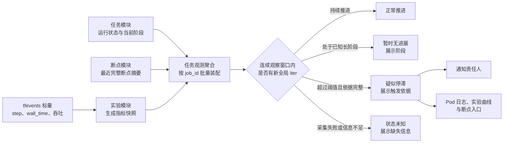

**建议方案**：实验模块继续负责解析`tfevents`，结构化结果增加命中标量事件的`wall_time`并保存为`last_step_at`，后端在成功写入快照时记录`metrics_at`作为采集时间。任务模块通过按`job_id`批量查询的只读契约消费实验快照，再批量装配自身阶段和断点模块摘要，生成轻量进展状态快照；各模块不访问其它模块的内部模型，实验或断点模块禁用时隐藏对应字段并把缺失依据标为未知，不影响训练任务运行。

规则计算至少要求连续多个观察窗口无新全局`iter`，阈值取用户配置下限与任务近期稳定步间隔基线中的较大值；编译、初始化、评测、断点写入和恢复等已知阶段使用独立超时，不套用训练步阈值。首期只发送疑似提示，由用户确认后决定是否停止或恢复。短生命周期`metrics Job`只适合作为小规模过渡方案，上线前需要按并发运行任务数验证集群控制面、共享存储和指标更新时间；规模超过验证上限后，应改用每集群受控并发采集器或训练框架心跳，避免按每个`Run`持续创建读盘任务。原始曲线仍通过实验模块按需打开`TensorBoard`，不复制到业务库。

### 3.3.4 任务运行事件通知

**背景介绍**：算法人员无法持续守在页面，排队超时、疑似停滞、断点失败和恢复结果若只进入运维告警，会错过低成本处理窗口。

**建设目标**：按用户订阅向任务负责人和可选协作者发送飞书通知，覆盖开始、排队超时、启动失败、疑似停滞、抢占、断点失败、运行失败、完成和恢复结果。消息包含任务、阶段、摘要、最近进度、触发依据、建议动作和鉴权链接，不包含原始日志或密钥。疑似停滞通知不得表述为已经确认的故障。

**建议方案**：任务事件写入通知队列，通知服务按事件键去重、限流、重试并记录送达结果；用户偏好和升级规则独立保存。飞书是首个通道，通过通道适配器隔离，任务模块不直接调用外部消息接口。

### 3.3.5 任务列表进展摘要

**背景介绍**：列表只有运行状态时，团队不能快速区分正常推进、进展变慢、进展信号停止更新或指标采集失败的任务。

**建设目标**：运行中任务展示当前全局`iter`、最近步耗时、吞吐、预计剩余时间、最后一步时间、指标采集时间和进展状态，并支持按疑似停滞时长和数据新鲜度排序与筛选。列表中的疑似停滞只表示观测规则命中，不能替代详情页诊断。

**建议方案**：由观测聚合任务周期性生成轻量摘要快照，列表一次批量读取，不逐任务查询时序库。预计时间基于稳定窗口并显示置信状态，数据不足时返回未知而非伪精确值。

### 3.3.6 任务详情与日志定位

**背景介绍**：多机训练排障时，当前痛点如下：

1. 日志量大，错误容易被正常输出淹没。
2. 实际工作目录、输入、输出和断点路径不一致，增加定位成本。

**建设目标**：详情页固定展示任务实际读写路径和配置快照；日志支持按角色、进程、节点、时间范围和关键字过滤，并能定位最近错误的上下文。

**建议方案**：任务模块保存路径引用和日志索引，不回存大体量原始日志；日志查询通过现有日志系统的受控适配器完成并强制项目权限、时间范围和分页上限。列表式`Pod`信息使用批量投影，避免逐进程远程查询。

## 3.4 实验分析

### 3.4.1 实验项目与`Run`管理

**背景介绍**：实验只依赖任务名称或输出目录时，重名、历史任务和多人协作都会降低可检索性。没有默认归属和稳定生命周期后，用户无法确认某个任务为什么没有出现在实验列表，也无法把同一业务目标下的多次尝试放在一起比较。

**建设目标**：按当前工作集群浏览实验项目和`Run`。列表支持按项目、关键词、关联任务状态和创建人筛选并分页；未指定项目的任务进入“默认项目”。用户可以移动或软删除`Run`，删除实验不得删除关联任务。一个未删除任务最多关联一条`Run`。

**建议方案**：由`exp_project`保存名称和描述，由`exp_run`保存项目、集群、机房、团队、`job_id`、`tb_logdir`、创建人及最新快照。`job_id`在未删除记录范围内保持唯一，项目和`Run`使用软删除保留历史。列表先在数据库完成可见性过滤、项目过滤和分页，再批量读取关联任务名称与状态，避免`N+1`查询。默认项目不可删除；删除其它项目时，将仍保留的`Run`迁移到默认项目。

### 3.4.2 实验入口与双向导航

**背景介绍**：只有一套曲线页面但没有统一入口时，用户仍需记忆地址或手工查找。任务详情、实验详情和对比页如果使用不同标识，值班排障和结果复盘都可能关联错任务。

**建设目标**：训练中心侧栏提供“实验分析”入口。实验列表中的名称进入实验详情；任务详情展示“关联实验”并可直接跳转；实验详情展示“查看任务”返回关联任务。详情默认进入“`TensorBoard` / 曲线”页签，同时在页头展示最新`Loss`、进度、吞吐、最后一步时间和指标采集时间。

**建议方案**：页面使用稳定路由承载实验列表、详情和对比，并以`run_id`定位实验、以`job_id`建立双向关联。前端入口与后端权限都复用训练中心的工作集群和团队可见性，不允许只隐藏菜单却保留越权接口。任务列表需要实验摘要时，通过当前页任务编号一次批量查询；实验模块禁用时，侧栏、关联入口、实验列和筛选项全部隐藏。

实验列表、详情、完整曲线和对比页面之间的导航关系如下：

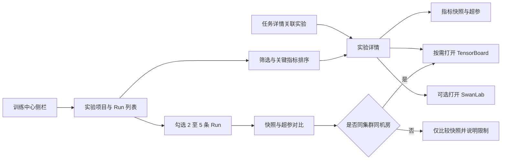

### 3.4.3 关键指标快照与快速排序

**背景介绍**：完整曲线包含的信息最多，但启动和浏览成本高，不适合从几十或几百条实验中快速定位目标。仅展示任务状态也无法判断优化器是否仍在推进，指标为空时若显示为`0`，还会把“没有数据”误判为“指标最好”。

**建设目标**：实验列表和详情直接展示最新`Loss`、`step`、`max_steps`、进度、吞吐、最后一步时间、指标采集时间及读取错误。首期至少支持最近更新、最近创建、`Loss`升序和`Loss`降序；在快照口径稳定后增加进度、吞吐、最后一步时间和指标采集时间排序。所有排序都在服务端完成，结果在翻页前保持全局一致；缺失值显示`—`并始终排在有效值之后。

关键指标口径如下：

|平台字段|建议读取来源|展示与排序规则|
|---|---|---|
|`Loss`|依次匹配`lm loss`、`lm-loss`、`loss`、`train_loss`、`Loss`|展示最新标量；支持升降序；仅作为训练趋势和异常筛选，不作为跨任务模型质量排名|
|`step`|优先读取训练模板明确映射的全局优化器步；未配置映射时可取命中`Loss`标量的最大`event.step`作为展示候选|记录命中的`tag`和语义可信度；只有模板确认的全局步可作为停滞规则输入，其它候选步数只用于实验展示|
|`max_steps`|匹配`max_steps`、`num_train_steps`、`train/total_steps`|有值时展示`step/max_steps`和百分比；未知时只展示当前`step`|
|吞吐|优先匹配`tokens_per_sec`、`tokens/sec`，其次匹配`throughput`|只有明确为每秒`token`时展示`tok/s`；通用`throughput`使用中性文案并保留来源单位|
|`last_step_at`|命中全局步标量事件的`wall_time`|展示训练进展新鲜度；无法取得时显示未知，不使用平台读盘时间替代|
|`metrics_at`|最近一次成功读取指标的时间|只表示采集链路新鲜度；支持定位采集异常，不用于判断训练是否推进|
|`metrics_error`|最近一次读盘失败、目录缺失或解析失败摘要|不参与数值排序；在详情解释为什么指标为`—`，不改变任务状态|

**建议方案**：平台向训练容器注入约定的`TENSORBOARD_LOGDIR`，不覆盖用户已显式配置的同名变量。定时对账默认每`30`秒在任务所在集群和机房创建短生命周期`metrics Job`，通过`EventAccumulator`读取每个受控`tag`的最后一个标量及其`wall_time`，将包含`stepTag`、`stepSemantics`和`lastStepAt`的一行结构化`JSON`解析后更新`exp_run`快照，并由后端以成功写入时间更新`metrics_at`；成功后删除读盘`Job`，失败时记录错误并指数退避。列表查询必须先应用集群、团队、项目和状态过滤，再使用数据库排序，最后分页并批量装配关联信息；排序使用更新时间和`Run ID`作为稳定次序，并显式采用空值置后规则。训练结束后至少尝试读取一次终态快照。

列表性能按单个工作集群最多`100,000`条未删除`Run`、单页最多`100`条设计。一次列表请求应保持为固定数量的数据库操作：一次总数统计、一次过滤排序分页、一次关联任务批量装配和一次项目批量装配，不随总记录数或页内行数增加远程调用；页面读取列表时不得访问集群。数据库至少为集群与更新时间、项目与更新时间、团队与更新时间以及集群与`Loss`排序路径建立匹配查询条件的部分索引，并使用`EXPLAIN ANALYZE`分别在`1,000`、`10,000`和`100,000`条数据规模下验证执行计划、空值排序和分页稳定性。指标对账按集群一次列出带标签的代理对象，再以受控并发处理需要刷新的`Run`，禁止逐条远程探测。

`Loss`排序只能比较训练目标和口径相近的实验。列表和对比页需要同时展示基础模型、数据版本、任务类型和命中的指标`tag`；条件明显不一致时给出“指标不可直接比较”的提示。模型质量排名应使用评测与质量门禁模块的业务、安全和回归指标，不能以训练`Loss`替代。

### 3.4.4 `TensorBoard`按需打开

**背景介绍**：为每条运行中任务常驻`TensorBoard`会消耗机房进程并增加故障面；让浏览器直接访问机房端口又会绕过平台会话、团队权限和审计。在多机房环境下，控制面也不能假设可以直接挂载所有训练目录。

**建设目标**：实验详情默认展示“`TensorBoard` / 曲线”页签，但只在用户点击打开时启动对应看板。就绪后在页面内嵌完整界面，并提供同一鉴权地址的新标签打开方式。启动超时、静态资源加载失败、集群离线或目录不可读时给出明确原因，外层指标和其它详情仍可使用；无人访问超过空闲窗口后自动回收看板。

**建议方案**：`POST /api/training/experiments/{id}/board`作为允许产生启动副作用的打开动作，先校验`Run`可见性并记录访问时间，再在任务所在集群、机房创建不申请`GPU`的`serve Pod`和内部`Service`；`GET /api/training/experiments/{id}/board/*`负责通过当前会话读取看板资源。平台经集群`API Server`的`Pod`代理提供同源地址，浏览器不接触机房内`6006`端口。页面优先用`iframe`嵌入，路径前缀或静态资源不兼容时保留“新标签打开”降级。定时对账根据最近访问时间续期或回收`serve`对象，默认空闲窗口建议为`20`分钟并允许配置。

### 3.4.5 实验对比

**背景介绍**：算法人员需要同时判断指标变化来自超参、资源、数据还是训练阶段。逐页切换只能凭记忆对照；跨机房直接叠加完整曲线则要求访问多套隔离存储和运行时，可靠性与权限边界都不清晰。

**建设目标**：用户可以选择`2`至`5`条可见`Run`进入对比页，并排展示最新指标、任务状态、基础模型、数据版本和超参差异。系统应突出不同字段，并在基础模型、数据或指标口径不一致时标记可比性风险。只有所选`Run`位于同一集群、同一机房时，才提供完整`TensorBoard`曲线对比；否则只比较快照和超参并说明限制。

实验对比需要同时覆盖结果、输入和资源差异：

|对比维度|展示内容|可比性规则|
|---|---|---|
|训练结果|最新`Loss`、进度、吞吐、进展状态、最后一步时间和指标采集时间|指标名称、单位或统计口径不同则标记不可直接比较|
|模型与数据|基础模型、数据版本、`mixture`和分词器|基础模型或数据分布不同则提示结果归因风险|
|训练配置|学习率、批次、并行、精度、模板和镜像摘要|突出结构化字段差异，不比较当前模板默认值|
|资源与成本|机型、卡数、运行时长、有效`token`和估算成本|资源口径缺失时显示未知，不使用`0`代替|
|完整曲线|同机房、同集群`Run`的`TensorBoard`曲线|跨机房只比较快照，不隐式复制`tfevents`|

**建议方案**：对比接口限制`Run ID`数量并一次批量读取`Run`、任务配置投影和必要资产名称，不循环调用单条详情。差异计算基于任务提交时的不可变配置快照，不读取当前模板默认值。完整曲线继续由按需看板提供，不把`tfevents`复制到控制面或为了跨机房对比新建长期同步链路。

### 3.4.6 `Run`生命周期与异常降级

**背景介绍**：训练任务和实验记录分属不同模块，任何跨模块调用都可能暂时失败。如果创建`Run`失败就回滚已经提交的训练，会扩大非核心能力的故障影响；如果历史任务永远不补建，又会造成实验列表不完整。指标缺失、目录损坏和看板故障同样不应被误判为训练失败。

**建设目标**：训练任务成功提交后幂等创建关联`Run`，未选择项目时进入默认项目；一个任务最多一条未删除`Run`。打开实验列表或后台对账时，为从未产生实验记录的历史任务补建`Run`。创建、读盘或看板失败只记录实验侧错误并允许后续补偿，不回滚训练任务、不改变任务状态，也不把空指标显示成`0`。

`Run`创建、补偿和异常降级关系如下：

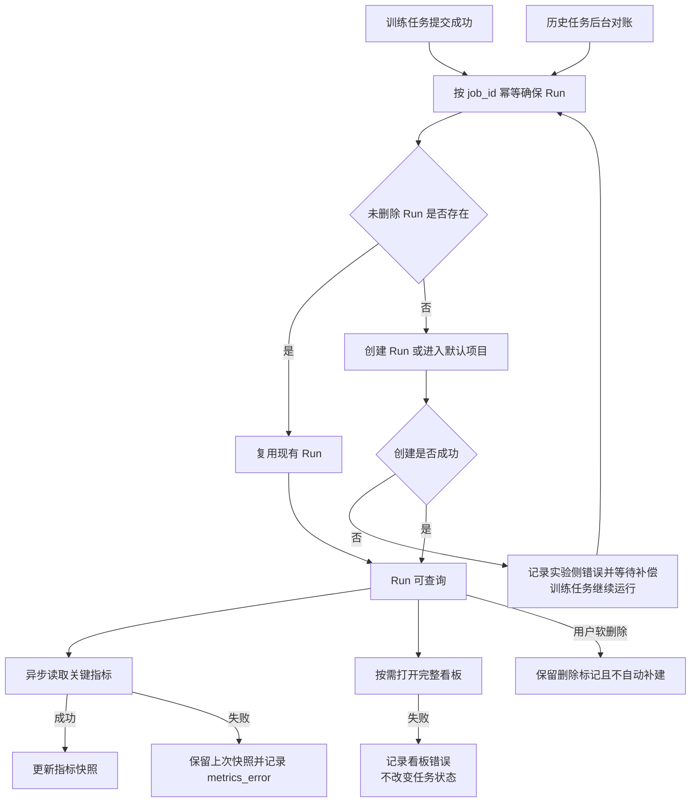

**建议方案**：任务服务通过构造函数注入的稳定实验契约调用幂等`EnsureForJob`，实验服务通过任务只读投影获取必要信息，双方不访问对方内部模型。历史补建以`job_id`唯一约束防止重复；用户已经软删除的`Run`保留删除痕迹，不再次自动补建。指标失败写入`metrics_error`并保留最后一次成功快照，看板失败写入独立错误摘要。实验模块关闭时停止对账并清理仍存活的`serve`对象，前端完全隐藏实验入口和关联字段，数据库中的项目、`Run`和历史快照继续保留，重新启用后可恢复使用。

### 3.4.7 `SwanLab`实验分析适配

**背景介绍**：`TensorBoard`能够满足完整曲线查看，但团队后续还需要兼容已有`SwanLab`本地记录习惯，并使用其协作式实验跟踪、标签、仪表盘和报告能力。如果用户绕过平台直接在`SwanLab`中创建另一套项目和实验，平台任务、实验权限、指标快照和外部报告会失去稳定关联；实验列表若为了展示每一行而实时查询`SwanLab`，还会受到外部服务延迟、限流和故障影响。训练平台运行在`UAT`环境且不能默认访问公网，因此将指标、超参、日志、样本或模型产物发送到`SwanLab Cloud`还涉及网络和数据合规风险。

**建设目标**：在核心实验分析闭环稳定后，以`2027 Q1`、`P2`提供可选`SwanLab`适配。项目或任务可以关联已有`SwanLab`实验，也可以在显式启用后由训练框架通过`SwanLab SDK`创建实验；平台`Run`继续作为任务关联、权限和列表检索的主索引。实验详情展示`SwanLab`关联状态、最近同步时间和经认证的打开入口，并把经过白名单和口径映射的摘要指标同步到平台快照，供列表筛选、排序和对比。未启用或`SwanLab`不可用时，现有`TensorBoard`、平台指标快照和训练任务不受影响。

首期适配范围如下：

|能力|首期范围|不包含|
|---|---|---|
|部署与连接|优先支持内网可达的私有化`SwanLab`实例，并兼容共享存储中的`swanlog`本地记录；配置服务地址、工作空间和项目映射|未经安全评审直接连接公网`SwanLab Cloud`|
|实验关联|保存平台`run_id`与`SwanLab`实验标识、项目、访问地址的唯一映射|把无训练任务的全部外部实验自动导入平台|
|指标同步|通过版本支持的接口或导出能力批量读取白名单摘要指标、来源名称、单位和更新时间，写入平台快照|把完整指标历史复制到`PostgreSQL`，或列表逐行实时查询`SwanLab`|
|页面入口|在实验详情通过统一身份认证或短期授权的新标签打开`SwanLab`|默认使用可能受跨域、认证和内容安全策略限制的`iframe`嵌入|
|配置与产物|同步允许展示的超参摘要、标签和产物元数据|默认上传原始日志、训练样本、`checkpoint`或模型权重|
|本地与离线记录|登记共享存储中的`swanlog`目录，并允许显式配置的同步任务将记录发送到获批实例|在没有网络和数据授权时自动外发本地记录目录|

**建议方案**：在实验模块内新增外部分析提供方适配接口，当前实现只接`SwanLab`，后续出现第二种外部系统时再复用该变化点，不把`SwanLab`对象泄漏给任务模块。平台保存独立的`Run`外部绑定，包括提供方、外部项目、外部实验标识、`swanlog`目录、访问地址、最近同步时间和同步错误；凭据由`Secret`或密钥服务按项目注入，接口和日志不得返回访问令牌。训练任务仅在用户显式启用时注入`SwanLab SDK`初始化所需的非敏感服务地址、项目和实验标识，访问令牌通过密钥挂载提供，不写入任务规格、环境快照或日志。

指标同步使用`SwanLab`官方`SDK`、私有化服务支持的接口或所选版本提供的导出能力，按项目和更新时间分页读取变化的实验摘要，再批量更新平台快照；禁止对实验列表每一行发起外部请求。只有在私有化服务暂不提供稳定读取接口时，才由受控同步任务解析已确认版本的`swanlog`结构，并通过适配器隔离格式变化。同步指标必须经过白名单、字段映射、单位和可比范围校验，缺失值仍显示`—`并置后，外部服务失败时保留最后一次成功快照并记录同步错误。打开入口默认跳转到通过统一身份认证保护的私有化`SwanLab`地址；只有经过跨域、会话和内容安全策略验证后才考虑内嵌。禁用`SwanLab`适配时，前端隐藏相关入口和字段，后台停止同步，外部绑定与历史摘要保留，重新启用后可以继续对账。

该能力是后续增强，不改变当前实验分析迭代“不接入`SwanLab`”的交付边界，也不把`SwanLab`升级为训练任务的强依赖。正式实施前必须完成私有化版本与许可评估、网络连通与出口审批、统一身份认证、凭据轮换、数据分类、指标白名单、`swanlog`格式兼容、限流退避和故障降级验证。

## 3.5 断点与故障恢复

### 3.5.1 断点清单与完整性

**背景介绍**：长周期训练可能留下未写完或损坏的断点，仅凭`iter_0018000`一类目录名不能判断能否恢复。

**建设目标**：按全局`iter`列出断点大小、文件完整性、写入耗时、校验时间和可加载状态。默认目录为`/data/hpc/home/<user>/outputs/<job_id>/checkpoints`，共享断点可显式登记到`/share`。

**建议方案**：训练侧在原子完成后写入清单和完成标记，平台异步校验分片、哈希和必要元数据；加载冒烟校验作为独立低资源任务。断点列表读取业务库索引，文件扫描异步执行并限制并发，避免详情请求遍历大目录。

### 3.5.2 再次提交与恢复策略

**背景介绍**：再次提交并不等于恢复，当前痛点如下：

1. 再次提交只代表复用配置，不代表训练代码真的加载了断点。
2. 目录并发写入，或模型、数据、并行配置发生变化，还可能造成错误恢复。

**建设目标**：再次提交支持`never`、`latest`和`specified`恢复策略，预览候选断点、配置差异、目录占用和兼容性。平台不隐式改变训练代码行为，但必须记录实际加载的断点、恢复后的全局`iter`或从头初始化结果。

|恢复策略|训练初始化|断点使用|适用场景|
|---|---|---|---|
|`never`|重新初始化模型和优化器|不加载已有断点|新配置对照、清理旧状态、明确从头训练|
|`latest`|从最近合法状态继续|平台选择最新完整断点，训练代码执行加载|硬件故障恢复、同一输出目录继续训练|
|`specified`|从指定历史状态继续|用户选择完整断点，平台校验其兼容性|回到指定全局`iter`复现实验或比较阶段结果|

**建议方案**：将恢复策略作为任务规格字段，由框架适配器翻译为训练参数；恢复校验比较基础模型、分词器、数据游标和并行元数据。新运行与原运行通过父子关系关联，输出目录采用运行级锁或租约防止并发覆盖。

### 3.5.3 停止风险提示

**背景介绍**：停止异常任务时，当前痛点如下：

1. 值班人员不知道最近进度是否已经落盘。
2. 容易误以为再次提交必然自动恢复。

**建设目标**：停止确认展示最后一个完整全局`iter`、最近断点写入状态、当前进度和预计丢失步数；用户确认后记录停止原因和风险快照。

**建议方案**：停止接口在执行取消前读取断点与进展摘要的同一时点快照，并使用幂等取消语义。摘要不可用时明确标记未知，不阻塞紧急停止，但必须写入审计记录。

### 3.5.4 半自动与自动故障恢复

**背景介绍**：硬件、`NCCL`、`IB`或节点驱逐故障后，用户需要人工翻日志、找断点、排除节点、修改规模并重新提交，夜间操作风险尤其高。

**建设目标**：第一阶段识别可恢复故障并生成缩容或换节点草案，展示断点、排除节点和并行影响；第二阶段允许任务声明自动恢复策略，在次数和预算范围内自动再次提交，并保留完整运行链路。

**建议方案**：故障分类消费调度、硬件和训练事件，输出标准故障类型与可恢复性；恢复编排仅调用任务、断点和调度模块的公开契约。自动恢复采用状态机、幂等键、最大次数和退避策略，不尝试自研训练通信栈或不落盘恢复。


首期不建设训练中途不落盘的内存级弹性恢复，不替训练代码隐式补上加载参数，也不保证调整张量并行或流水线并行后一定能够恢复。平台只对已经声明并校验的断点给出可信建议；没有证据时必须显示未知或不可恢复，不能根据目录名猜测。

## 3.6 数据工程与治理

### 3.6.1 数据集登记与不可变版本

**背景介绍**：共享目录可能被覆盖、缺少分片或尚未从生产环境拷出，仅记录路径无法证明训练实际使用了哪一版数据。

**建设目标**：登记名称、逻辑版本、网络盘路径、文件清单、数量、大小、内容哈希、格式、分词器、样本与`token`量、放置人和时间。登记与提交时检查目录存在、可读、非空且清单稳定，未落盘数据不可选择。

|信息类别|必须记录的内容|主要用途|
|---|---|---|
|逻辑标识|数据集名称、不可变版本、项目和责任人|稳定引用和责任定位|
|物理位置|`/share/...`或`/data/hpc/home/<user>/...`|运行前验证目录存在与权限|
|文件清单|文件名、大小、分片、内容哈希和生成时间|识别覆盖、缺失和损坏|
|数据协议|格式、字段、消息协议、分词器和模板|选择解析器并保证语义一致|
|处理信息|脚本提交号、过滤与脱敏规则、随机种子|重建处理过程|
|统计摘要|样本数、`token`量、长度、语言、标签和重复率|估算资源并识别异常|
|授权信息|来源、许可证、用途、地域、保留期和审批证据|提交和交付前策略判定|

**建议方案**：数据模块维护不可变`DatasetVersion`和`manifest`，物理文件继续位于现有网络盘；大目录清单由异步扫描任务生成并增量校验。任务模块只保存`dataset`引用和提交时摘要，不复制数据模块内部实体，也不提供下载或同步后端。

### 3.6.2 安全预览与只读访问

**背景介绍**：查看和使用共享数据时，当前痛点如下：

1. 只看目录名无法确认角色、字段和答案是否正确。
2. 直接下载原文会扩大敏感数据暴露面。
3. 训练脚本如果写回输入目录，还会污染共享数据。

**建设目标**：提供受权限控制的抽样预览、字段统计、模板渲染示例和默认脱敏展示；数据按团队、项目和用途授权，任务只读挂载输入，输出目录按用户或项目隔离并记录访问主体。

**建议方案**：预览由受限采样任务生成脱敏快照，接口不直接读取任意用户路径；挂载策略由任务运行适配器执行只读约束。预览与下载权限分离，原文访问写入审计日志并设置分页和数量上限。

### 3.6.3 数据质量、安全与去重

**背景介绍**：格式错误、异常长度、重复样本、密钥和敏感内容可能在训练数小时后或交付前才暴露，既浪费资源又产生合规风险。

**建设目标**：分层执行编码、格式、空值、长度、语言、`token`分布、精确与近似去重、敏感信息和违规内容检查。报告区分阻断项和统计项，保存规则版本、阈值、数量及可追溯样本`ID`；严重问题隔离并禁用数据版本。

数据检查按成本和风险分层执行：

|检查层级|范围与执行方式|结果与处理|
|---|---|---|
|快速结构检查|同步检查编码、格式、必填字段、空值和文件清单|确定性错误直接阻断登记或提交，并返回样本`ID`|
|统计质量检查|异步统计长度、语言、`token`分布、异常值和截断风险|生成版本化报告；超阈值时警告或阻断|
|重复与泄漏检查|异步执行样本`ID`、精确内容和近似相似度比对|输出命中清单摘要，支持隔离、去重和评测污染判定|
|语义与安全检查|异步识别敏感信息、违规内容和高风险样本|原文最小权限展示；严重问题禁用数据版本并通知责任人|

**建议方案**：快速规则同步运行，统计、近似去重和语义安全检查以普通批任务异步执行；只有规模和容错需要时再引入`Ray`、`Data-Juicer`或`NeMo Curator`。结果按分区写入，列表和报告读取聚合快照，不在页面请求中扫描样本。

### 3.6.4 授权与可复现处理

**背景介绍**：数据能读到，还不等于能放心训练。当前痛点如下：

1. 能够读取数据并不代表获得训练、评测或模型交付授权。
2. 同一目录使用不同脚本、分词器和随机种子，会产生不同的有效分布，结果无法重建。

**建设目标**：记录来源、许可证、用途和地域限制、保留期限、责任人、审批证据，以及预处理脚本提交号、过滤规则、分词器、随机种子和统计报告。任务提交时执行用途策略检查。

**建议方案**：授权策略由数据模块拥有并向任务和交付模块提供批量判定契约；处理运行输出新数据版本和血缘边，不覆盖原版本。策略不可用时，正式训练与交付采取拒绝策略，普通元数据浏览可降级为脱敏结果。

### 3.6.5 数据血缘

**背景介绍**：模型异常、授权撤销或数据删除请求发生时，需要反查受影响的处理任务、训练、评测和派生模型。

**建设目标**：记录原始目录、数据版本、处理任务、过滤和脱敏规则、`mixture`、训练运行、评测运行与模型版本之间的有向关系，并支持正向追踪和反向影响分析。

数据从登记到模型交付的主要血缘关系如下：

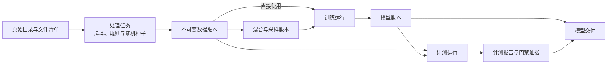

**建议方案**：优先使用关系表和有界深度查询承载当前规模，不预先引入图数据库；各模块在对象创建时发布版本引用事件，由血缘投影维护关系。图谱查询分页返回投影对象，并限制节点和深度，避免跨模块递归详情调用。

### 3.6.6 数据混合与采样

**背景介绍**：多份数据的目录相同但权重、温度、上限和重复轮数不同，会产生完全不同的训练分布，仅保存目录无法解释模型差异。

**建设目标**：将多数据集组成不可变`mixture`版本，记录每个输入版本、权重、采样策略、温度、上限、重复轮数、计划与实际采样量及有效`token`占比。

**建议方案**：`mixture`是引用数据版本的轻量对象，采样清单由数据处理任务生成；任务规格引用其版本和内容摘要。聚合统计在生成阶段一次计算，详情批量读取成员摘要，避免逐数据集查询。

### 3.6.7 偏好、标注与合成数据

**背景介绍**：偏好和合成数据如果登记不清，当前痛点如下：

1. 正负样本顺序错误会让优化方向相反。
2. 标注指南变化和合成数据污染会被误认为模型能力变化。

**建设目标**：统一偏好对、排序列表、拒答和多候选协议，校验`prompt`、`chosen`和`rejected`关系；登记标注任务、批次、标注者、指南、冲突率、抽检结果，以及生成模型、提示词、采样、过滤、去重和人工审核信息。

**建议方案**：通过数据适配器接入既有标注或反馈系统，不自研完整标注平台；导入后生成不可变数据版本和质量报告。偏好与合成来源作为样本级或分片级元数据保存，统计接口读取预聚合占比。

### 3.6.8 数据漂移分析

**背景介绍**：业务数据持续变化后，历史模板的资源估算、训练参数和评测结论可能不再适用。

**建设目标**：比较连续数据版本的样本量、语言、标签、长度、质量和重复率分布，展示变化幅度、阈值原因和受影响的模板、任务或模型。

**建议方案**：复用数据版本已有统计快照计算差异，不重复扫描原始数据；漂移规则异步执行并写入事件。影响对象通过血缘批量查询，阈值由团队维护并保留版本。

## 3.7 监督微调与后训练

### 3.7.1 任务类型与基础模型约束

**背景介绍**：全量`SFT`、`LoRA`、`QLoRA`和偏好优化的输入、资源、产物与评测要求不同，作为普通预训练命令提交会漏掉关键约束。

**建设目标**：任务类型显式区分训练方法，按类型展示必填参数和产物；基础模型只能选择已登记且有权限的版本，并校验架构、权重格式、分词器、上下文长度、量化状态和父模型关系。

**建议方案**：在统一任务规格上增加类型化扩展字段，由框架适配器处理具体参数；基础模型兼容性通过模型模块的批量投影契约校验。后训练模块禁用时隐藏专用任务类型，通用预训练不受影响。

建议的任务规格至少明确以下内容，避免关键约束只藏在启动命令中：

```yaml
kind: SFTJob
base_model:
  ref: model://team/base-model/1.2.0
data:
  train: dataset://team/support-sft/2026q4.3
  validation: dataset://team/support-eval/1.0.0
  chat_template: tokenizer-default
  max_seq_length: 8192
  packing: true
  loss_mask: assistant_only
strategy:
  method: lora
  lora:
    rank: 16
    alpha: 32
    dropout: 0.05
runtime:
  image_version: image://team/sft-runtime/2026.10
  nodes: 1
  gpus_per_node: 8
  precision: bf16
output:
  adapter_dir: /data/hpc/home/<user>/outputs/<job_id>/adapter
  checkpoint_dir: /data/hpc/home/<user>/outputs/<job_id>/checkpoints
evaluation:
  suites: [business-regression, safety-basic]
```

|训练方式|适用场景|平台重点校验|主要产物|
|---|---|---|---|
|全量`SFT`|数据量较大、模型专用、需要改变全部权重|优化器状态、精度、并行、显存和存储预算|完整权重和可恢复断点|
|`LoRA`|快速试验、多业务适配、保留基础模型|目标模块、`rank`、`alpha`、`dropout`和父模型|基础模型引用与`adapter`|
|`QLoRA`|显存受限或需要提高试验并发|量化位数、计算精度、优化器、硬件和框架兼容|量化训练`adapter`与合并前校验|

`2026 Q4`只要求文本`SFT`最小可用能力和基础评测，不同时交付完整偏好优化、强化学习或多模态全链路。训练平台不保证相同配置产生逐位一致的权重，但必须记录镜像、数据、种子、资源和全部有效参数，并解释可见差异的来源。

### 3.7.2 数据协议与监督范围

**背景介绍**：微调数据如果格式和监督范围不对，通常不会立刻报错，却会把模型教坏。当前痛点如下：

1. 对话格式、角色顺序或模板错误，角色边界被错误渲染。
2. 数据划分不稳定，训练和评测发生泄漏。
3. 损失范围或截断策略错误，关键答案没进训练，或评测虚高。

**建设目标**：支持`OpenAI messages`、`ShareGPT`和`instruction/input/output`等输入，转换为统一的`role`、`content`和工具调用协议；校验字段、角色、模板、空消息和非法字符。划分使用稳定哈希和固定种子，检查重复与泄漏，并显式配置`loss mask`、最大长度、`padding`、`packing`和长度分桶。

不同来源协议必须先转换和验证，再形成可训练版本：

|来源协议|转换重点|必须阻断的问题|
|---|---|---|
|`OpenAI messages`|保留`system`、`user`、`assistant`、工具定义和调用结果|未知角色、调用与结果不配对、消息为空或顺序非法|
|`ShareGPT`|将来源角色映射为统一`role`并规范多轮顺序|角色映射缺失、连续同角色或轮次结构损坏|
|`instruction/input/output`|组合指令与可选输入，明确监督目标|输出缺失、字段语义冲突或模板无法渲染|
|统一训练样本|应用`chat_template`、`loss mask`、截断、`padding`和`packing`|有效监督为空、关键答案被截断或训练评测泄漏|

**建议方案**：数据适配与模板渲染作为版本化离线处理器，输出样本清单、有效与跳过数量、长度分位数、截断比例和抽样结果。统一消息协议负责把`OpenAI messages`、`ShareGPT`和指令样本转换为稳定的角色与工具调用结构，训练任务只消费已验证的数据版本和模板引用，避免每个训练框架各自解释原始格式。

### 3.7.3 微调策略与资源估算

**背景介绍**：`LoRA`目标模块、量化、精度、优化器、梯度检查点和分布式策略高度依赖模型与硬件，错误组合往往在排到多机资源后才失败。

**建设目标**：配置并校验`rank`、`alpha`、`dropout`、目标模块、`bf16/fp16`、`8bit/4bit`、`FSDP`或`DeepSpeed`策略，提供单卡、单机多卡和多机模板。提交前根据样本、序列长度和策略估算显存、时长、存储和有效全局批次，并支持小样本`dry-run`。

资源估算需要组合模型、数据、策略和硬件信息：

|输入维度|参与校验或估算的内容|输出结果|
|---|---|---|
|模型与序列|参数量、层数、上下文长度和词表|权重、激活值和注意力显存估算|
|微调方式|全量、`LoRA`、`QLoRA`、目标模块和量化位数|可训练参数量、优化器显存和兼容性结论|
|批次与并行|微批次、梯度累积、张量、流水线、数据和上下文并行|有效全局批次、总卡数和通信约束|
|运行策略|精度、优化器、梯度检查点、`FSDP`或`DeepSpeed`|峰值显存、训练时长和框架配置风险|
|硬件与数据|机型、卡数、带宽、样本量和有效`token`|资源规格、预计时长、存储量及`dry-run`建议|

**建议方案**：兼容矩阵由模板版本和镜像元数据共同提供，估算模型先采用规则与历史校准数据，不承诺绝对精度；实际运行结果回写用于校准。框架适配器把任务规格转换为`ms-swift`、`Transformers`、`PEFT`、`DeepSpeed`或`FSDP`参数，专有参数保留在版本化模板和`YAML`扩展中，不在平台控制面为每个新参数建设独立页面；通用资源校验复用任务服务。

### 3.7.4 微调断点恢复

**背景介绍**：微调中断后只恢复权重会丢失优化器、学习率、随机状态和数据位置，导致重复样本、指标跳变和结果不可比较。

**建设目标**：全量权重和`adapter`断点都保存优化器、调度器、随机状态、数据游标、基础模型和`chat_template`配置；恢复前校验父模型和策略一致性。

**建议方案**：复用通用断点对象和恢复状态机，后训练适配器补充`adapter`与模板元数据校验。断点清单以框架中立字段表达，框架专有文件由适配器负责生成与加载。

### 3.7.5 微调产物分类与血缘

**背景介绍**：微调产物如果混放，当前痛点如下：

1. 下游无法判断该加载基础模型、`adapter`、合并模型还是断点。
2. 无法追踪哪个产物真正改善了业务指标。

**建设目标**：任务产物明确区分基础模型引用、`adapter`、合并模型、断点、配置快照和评测报告，并记录数据版本、镜像摘要、父模型和生成任务。

微调输入、运行产物和可交付模型之间的关系如下：

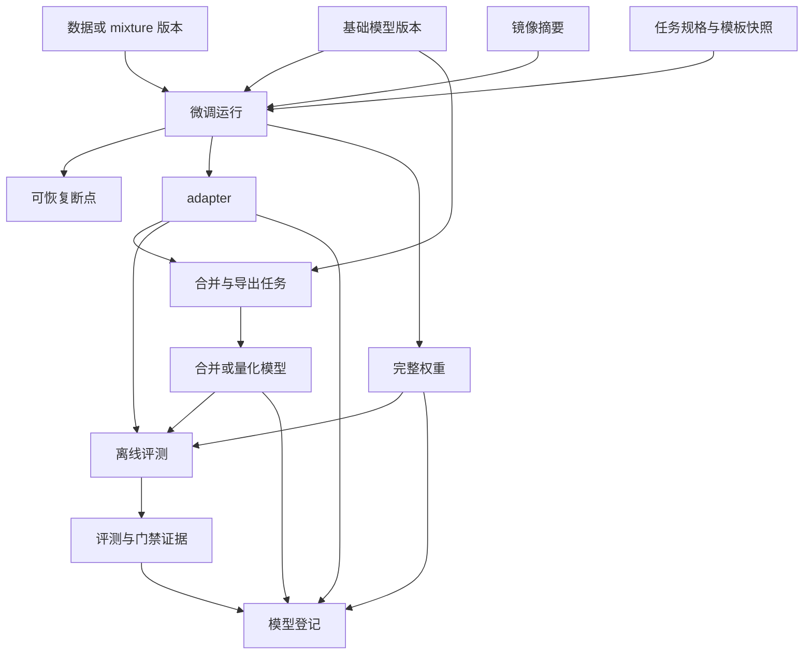

**建议方案**：训练完成后生成产物`manifest`，模型登记只消费通过完整性检查的产物引用。产物类型使用固定命名类型维护，模型模块通过稳定登记契约读取投影，不扫描训练目录猜测类型。

### 3.7.6 训练后自动评测

**背景介绍**：只看训练曲线不够判断微调是否成功，当前痛点如下：

1. 训练`loss`下降不代表回答质量提升。
2. 微调还可能造成通用能力或安全能力回归。

**建设目标**：任务完成后自动触发基础模型与微调模型的离线能力、安全和业务回归评测；失败时保留训练产物、日志和错误样本，但模型标记为不可发布。

**建议方案**：任务完成事件触发评测运行，评测模块通过模型产物引用读取权重，不访问训练模块内部对象。自动评测可配置为可选模块；当项目要求门禁但评测模块不可用时拒绝发布，而不是静默放行。

### 3.7.7 模型合并与导出校验

**背景介绍**：`adapter`、基础模型、分词器或量化配置不匹配，常到交付和部署阶段才暴露。

**建设目标**：支持`adapter`合并、全量或量化权重导出，校验格式、父模型和分词器，并执行至少一条对话的分词、加载和生成冒烟测试；失败产物可保留但不得登记为可交付模型。

**建议方案**：合并和导出运行在隔离批任务中，使用目标框架镜像并输出新不可变产物，不原地修改训练结果。校验结果作为模型登记的前置证据。

### 3.7.8 模型卡草稿

**背景介绍**：微调模型只有权重和聊天记录时，业务方无法判断适用范围、已知限制、授权和评测风险。

**建设目标**：依据基础模型、数据、参数、`adapter`或合并方式、评测结果和责任人自动生成模型卡草稿，允许负责人补充用途、限制和失败案例。

**建议方案**：模型卡模板从血缘批量投影读取摘要，人工内容与自动字段分区保存；自动字段随引用版本生成但不覆盖已审批历史版本。

### 3.7.9 早停与最佳断点

**背景介绍**：按固定步数收工并不稳妥，当前痛点如下：

1. 固定步数可能训练不足，也可能过拟合。
2. 最后保存的断点不一定是验证集表现最好的版本。

**建设目标**：支持最大全局`iter`、最大`epoch`、验证指标早停和最小改善幅度，分别标记最新可恢复断点与验证最佳断点，并记录停止原因。

**建议方案**：早停决策在训练适配器内执行，平台负责配置校验、指标展示和断点角色登记；不要让控制面按高延迟指标远程控制每一步训练。

### 3.7.10 回放集与遗忘控制

**背景介绍**：领域数据占比过高可能提高目标任务分数，却损害通用指令和安全拒答能力。

**建设目标**：允许将通用指令回放集、安全集和领域数据组成版本化`mixture`，展示各类有效`token`权重，并在评测报告中比较微调前后遗忘指标。

**建议方案**：复用数据混合对象和基线回归能力，不在后训练模块重复维护数据配比和评测逻辑；后训练任务只声明目标`mixture`和必须运行的回归套件。

### 3.7.11 切片分析

**背景介绍**：总体均分会掩盖长上下文、少数语言、特定业务标签和高风险样本的退化。

**建设目标**：按长度、业务标签、语言、难度和能力标签分桶查看训练与评测结果，支持基线对比和错误样本导出。

**建议方案**：切片标签随数据或评测样本版本保存，评测运行异步生成分桶聚合；查询按预聚合维度和分页样本读取，禁止前端拉取全量结果自行计算。

### 3.7.12 多模态与工具调用扩展

**背景介绍**：业务逐步增加图文、音频和工具调用，若文本协议没有稳定扩展点，后续改造会破坏已有任务和数据版本。

**建设目标**：预留媒体引用、尺寸与格式校验、模态`token`统计、工具定义与调用结果以及多模态批处理接口，首期以扩展点和试验模板交付。

**建议方案**：统一消息协议使用类型化内容块，媒体只保存受控引用和清单，不把大文件嵌入业务库；各模态处理器通过版本化适配器接入。模块未启用时拒绝相应任务类型并隐藏字段，文本任务保持不变。

## 3.8 评测与质量门禁

### 3.8.1 评测集与指标目录

**背景介绍**：评测集和指标如果没有版本，当前痛点如下：

1. 训练`loss`不能代表业务、安全和通用能力。
2. 评测集被替换或指标方向不清，不同模型会失去可比性。

**建设目标**：登记不可变的标准基准、业务集、安全集、回归集和人工评测集，记录版本、用途、负责人和授权；指标目录声明计算方法、版本、方向、适用模型和结果单位。

|评测层级|主要内容|适用时机|
|---|---|---|
|冒烟集|格式、对话、工具调用和基础安全样本|开发验证、导出校验和`dry-run`|
|业务回归集|高频业务问题、历史失败样本和脱敏案例|每次`SFT`或重要配置变化|
|通用能力集|知识、推理、代码、事实性、长上下文和指令遵循|候选模型比较|
|安全集|越狱、提示注入、隐私、敏感内容和拒答一致性|进入审批前必跑|
|人工评测集|专家评分、成对偏好和错误分类|自动指标接近阈值或无法可靠判断时|

**建议方案**：评测套件引用数据版本和指标定义，发布后不可修改；列表使用批量授权投影。指标类型与状态使用固定命名类型管理，自定义指标以版本化评测器接入。

### 3.8.2 统一评测运行器

**背景介绍**：评测执行如果各走各的，当前痛点如下：

1. `EvalScope`、`lm-evaluation-harness`和内部脚本各自保存日志与指标，结果无法横向比较。
2. 采样参数变化会造成结果漂移，却说不清用了哪一套配置。

**建设目标**：统一记录模型、套件、提示词、随机种子、生成参数、镜像、并发、超时和重试；支持批量离线推理、失败样本重跑以及精确匹配、`F1`、代码通过率、偏好胜率、困惑度和自定义聚合，输出逐样本、聚合和错误协议。

**建议方案**：定义框架中立的评测输入输出协议，各评测器通过适配器运行在批任务中；原始大结果写对象存储或网络盘，业务库保存索引和摘要。评测模块不要求模型已部署为在线服务。

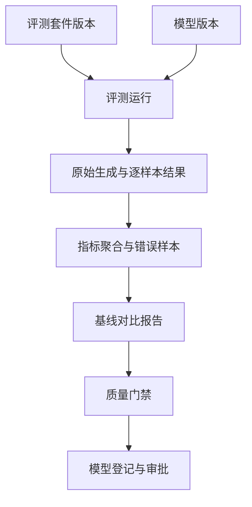

### 3.8.3 基线回归对比

**背景介绍**：没有固定基线时，当前痛点如下：

1. 微调可能提升目标任务，却损害通用或安全能力。
2. 没有逐项对比就会把退化模型交付出去。

**建设目标**：候选模型必须与指定基线逐指标、逐切片和逐样本比较，支持最低阈值、最大退化幅度、差异样本和业务确认记录。

**建议方案**：对比运行引用两组不可变评测结果，计算异步派生报告；不重复执行相同生成。门禁只消费标准对比投影，避免直接解析各评测器私有输出。

### 3.8.4 评测产物查询

**背景介绍**：评测结果如果只留下一个分数，当前痛点如下：

1. 无法复盘具体失败案例。
2. 模型交接、投诉处理和审计缺少证据。

**建设目标**：保存原始生成、逐样本得分、错误样本、聚合结果、评测配置、镜像和环境，支持按模型、运行、套件和样本`ID`查询。

**建议方案**：冷热数据分层存储，业务库保存可筛选索引，原始文本和大文件保存于受控存储；查询强制分页、字段投影和权限过滤，避免大结果一次性返回。

### 3.8.5 安全评测

**背景介绍**：业务微调后的安全能力容易被忽略。当前痛点如下：

1. 任务命中率可能上升，拒答、隐私保护和工具调用安全性却下降。
2. 没有专门的安全评测，这些问题要到上线后才被发现。

**建设目标**：覆盖越权、提示注入、敏感内容、隐私泄漏、幻觉、拒答一致性、越狱和工具调用风险，按风险等级配置阻断和人工复核要求。

**建议方案**：安全套件复用评测运行器并使用隔离队列，敏感原始结果默认脱敏和最小权限。风险类别与等级使用固定分类管理，阈值按项目版本化。

### 3.8.6 质量门禁与评测报告

**背景介绍**：评测过了不等于可以签字放行，当前痛点如下：

1. 人工浏览分散指标容易漏掉不可退化项。
2. 业务方缺少同时呈现效果、风险、成本和已知缺陷的决策材料。

**建设目标**：按任务和模型类型配置最低分、最大退化、必过安全项、成本或延迟上限和人工审批条件，自动生成基线对比报告并记录门禁版本与结论。

质量门禁应逐条展示输入证据、判定结果和后续动作：

|规则类型|输入证据|处理动作|
|---|---|---|
|最低质量要求|候选模型的业务与通用能力指标|低于阈值时阻断并展示差值和失败样本入口|
|最大退化幅度|候选与指定基线的逐指标、逐切片对比|超过允许退化时阻断，边界结果进入人工复核|
|必过安全项|安全套件结果、风险等级和样本级证据|任一必过项失败即阻断，不允许以总分抵消|
|成本与延迟上限|评测成本、推理延迟、显存和吞吐摘要|超过项目阈值时阻断或要求负责人确认|
|证据完整性|数据授权、模型卡、评测版本和产物完整性|缺少强制证据时保持待补充状态，不进入审批|
|人工审批条件|自动门禁结论、已知缺陷和业务风险|生成可签字报告，由有权限审批者最终放行或拒绝|

**建议方案**：门禁引擎读取标准评测投影并输出可解释的逐规则结果，不嵌入评测器私有逻辑；规则发布后版本化，阈值由团队基于基线、样本量和业务风险维护，不使用平台写死的行业常数。工作流通过门禁结果引用决定后续步骤，人工审批仍保留最终责任。评测模块关闭或不可用时，要求评测的交付流程必须停住，不能跳过门禁继续放行。

### 3.8.7 模型裁判

**背景介绍**：开放式回答不好打分，当前痛点如下：

1. 缺少唯一标准答案，只能靠模型裁判或人工判断。
2. 裁判模型、提示词一变，分数也会变，不能成为不可审计的黑盒。

**建设目标**：记录裁判模型、提示词、温度、输出解析器、调用成本和逐样本理由，支持抽样人工复核、改判和一致性统计。

**建议方案**：模型裁判作为一种评测器适配器，结果协议与其它评测一致；高风险门禁要求人工或确定性指标共同确认。裁判调用使用专用凭据和预算限制。

### 3.8.8 评测污染检查

**背景介绍**：训练数据包含测试题、历史答案或公开基准解答会造成虚高分，上线后表现落差又难以解释。

**建设目标**：登记评测集来源和发布时间，按样本`ID`、精确内容和近似相似度检查训练集、历史评测集与公开语料重叠，并标记风险和处理决定。

**建议方案**：复用数据质量的去重与相似检索能力，评测模块只提交版本引用和阈值；大规模比对异步执行并保存命中清单摘要，不在提交请求内同步完成。

### 3.8.9 评测执行隔离

**背景介绍**：自定义评测脚本如果不隔离，当前痛点如下：

1. 可能读取训练数据或访问凭据。
2. 可能外联上传结果。
3. 可能占满集群资源。

**建设目标**：自定义评测脚本在隔离任务中运行，限制网络、文件系统、凭据、资源和运行时长，结果、日志和镜像摘要仍归属评测运行。

**建议方案**：使用独立服务账号、只读输入、受限输出目录、网络策略、资源配额和超时；镜像进入评测队列前执行来源与安全检查。隔离策略由平台运行层统一实现，不交给评测脚本自声明。

### 3.8.10 评测统计可信度

**背景介绍**：小规模业务集的偶然波动可能被误判为显著提升，单次均值不足以支撑发布或回滚。

**建设目标**：报告样本量、分层统计、置信区间或重复运行区间，标记低样本、随机性过高和不可比较的结果。

**建议方案**：指标定义声明统计方法和最小样本要求，聚合任务输出统计摘要；前端只解释已计算结果，不自行选择统计公式。

### 3.8.11 评测缓存与失败重跑

**背景介绍**：评测重跑和缓存如果做粗了，当前痛点如下：

1. 调整门禁或修复少量失败样本时，重复完整生成成本很高。
2. 按路径命名的粗粒度缓存容易复用错误结果。

**建设目标**：缓存键绑定模型内容哈希、评测套件、提示词、采样参数、数据版本、评测器和镜像；允许只重跑失败或指定样本并重新聚合。

**建议方案**：缓存作为评测模块内部能力，对外仍返回新的运行记录和来源说明；命中校验使用结构化摘要，缓存对象不可被新运行覆盖。并发相同请求通过幂等锁合并。

## 3.9 平台治理与开放能力

### 3.9.1 凭据注入与脱敏

**背景介绍**：访问令牌写入`train.yaml`、启动命令或日志后，会随配置导出、截图和评测产物扩散。

**建设目标**：凭据通过`Secret`或密钥服务以短期、最小权限方式注入，配置只保存引用；日志、事件、预览和评测输出执行统一脱敏。

**建议方案**：运行层在授权后解析密钥引用并注入，不向任务详情返回明文；脱敏规则在日志入口和展示出口双重执行。密钥访问写入审计，失败返回标准权限错误。

### 3.9.2 任务可靠性策略

**背景介绍**：网络抖动和脚本异常时，当前痛点如下：

1. 可能触发重复提交，覆盖已有产物。
2. 错误重试没有上限，会持续消耗资源。
3. 取消状态不一致，页面以为停了，集群里还在跑。

**建设目标**：训练、评测和工作流统一支持超时、幂等取消、按错误类型设置重试上限和人工接管，所有动作保留审计事件。

**建议方案**：定义跨运行类型共用的错误分类和可靠性策略，但具体恢复由所属模块执行；状态转换使用幂等命令和乐观并发控制。不可重试的数据和配置错误直接终止并给出修正建议。

### 3.9.3 统一开放接口

**背景介绍**：多个入口如果各写一套提交逻辑，当前痛点如下：

1. `Web`、`aitrain`和自动化系统的状态、默认值和错误处理会分叉。
2. 重试可能重复创建任务。

**建设目标**：各入口共用版本化应用接口、资源标识、错误码、请求追踪号和幂等键，并明确兼容周期与弃用策略。

**建议方案**：应用接口调用模块公开服务契约，不暴露`DAO`、内部实体或运行时配置；版本差异在边界转换。高频列表和候选接口必须支持分页、批量投影和有界查询。功能模块关闭后，前端相关菜单、字段、按钮和筛选项必须一起隐藏，后端可选依赖返回空结果或跳过非强制步骤，历史数据继续保留并在重新启用后恢复；正式训练、审批或交付依赖的强制能力不可用时必须明确拒绝，不能降级放行。平台不支持`i18n`，页面、接口提示和通知使用中文。

### 3.9.4 统一项目归属

**背景介绍**：资产如果只靠备注归属，当前痛点如下：

1. 任务失败、预算超限或数据违规后找不到责任人。
2. 跨团队资源无法安全授权。

**建设目标**：统一用户、团队、项目、任务、实验、数据集、模型和资源队列的归属关系，支持按项目查询责任人、资产、运行和成本。

项目作为治理主线连接责任、资产、运行和资源，但不接管各业务模块内部生命周期：

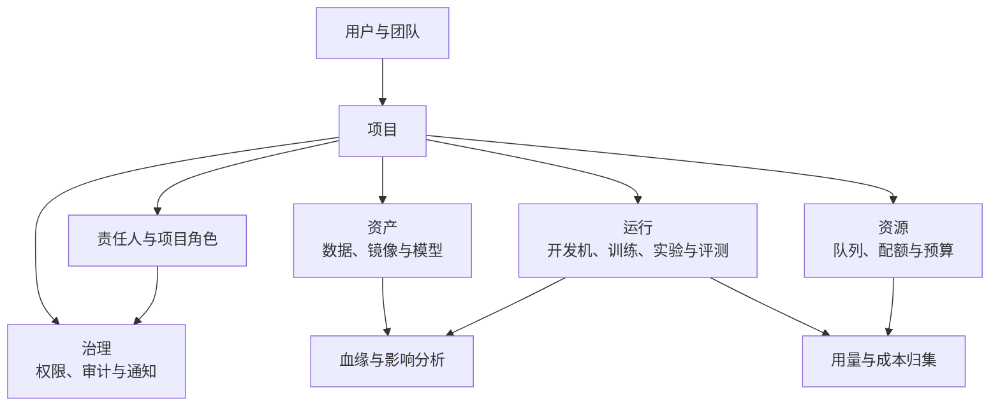

**建议方案**：项目标识成为各模块对象的稳定外键或租户字段，治理模块提供批量归属和权限投影；禁止列表逐项查询项目详情。历史对象迁移需保留原创建者和审计信息。

### 3.9.5 项目角色与资源授权

**背景介绍**：多人项目如果权限切不细，当前痛点如下：

1. 无法按提交、协作、审批和运维职责分权。
2. 任务详情与开发机聚合了数据、模型、日志和终端入口，容易扩大访问范围。

**建设目标**：提供项目级`RBAC`，区分提交者、协作者、模型负责人、数据负责人、审批者、只读用户和平台运维；数据原文、模型权重、日志、终端、导出和删除分别授权，临时权限可自动过期。

|角色|主要责任和权限边界|
|---|---|
|提交者|创建和取消自己的任务，使用项目内已授权的数据与模型|
|协作者|查看、复现和再次提交项目任务，不直接发布模型|
|数据负责人|登记数据、维护授权、质量状态和处理血缘|
|模型负责人|维护模型卡、门禁阈值和交付请求|
|审批者|批准模型状态变更、导出和推理平台交付|
|平台运维|查看运行诊断、隔离资源和处理故障，默认不读取业务原文|
|只读用户|查看脱敏元数据、运行摘要和评测报告|

**建议方案**：授权服务提供批量资源判定和最小投影，模块在入口与数据访问层同时校验；权限状态和角色使用固定命名类型。模块禁用时隐藏相关入口，但不删除历史授权与资源。

### 3.9.6 统一审计

**背景介绍**：发生数据泄露、模型误发布或资源争议时，没有不可篡改的记录就无法还原责任和影响范围。

**建设目标**：记录任务提交与取消、配置和权限变更、数据登记、模型下载、审批、导出、交付、删除及失败原因，支持按主体、项目、资源和时间检索。

**建议方案**：各模块发布结构化审计事件，审计模块异步持久化并提供只读查询；关键动作在业务事务中写出事件记录，避免成功操作无审计。高量事件按时间分区并限制查询范围。

### 3.9.7 业务与治理通知

**背景介绍**：模型退化、门禁失败、待审批、数据违规和预算超限若只通知运维，会遗漏真正需要决策的算法和业务负责人。

**建设目标**：按责任关系通知模型负责人、数据负责人、审批者和项目管理员，支持去重、升级、确认、失败重试和送达记录。

**建议方案**：复用任务通知的通道、偏好和送达基础能力，治理模块只发布标准业务事件和接收人角色；接收人解析通过项目归属批量完成。

### 3.9.8 用量、配额与预算

**背景介绍**：没有统一用量口径时，当前痛点如下：

1. 无法解释队列拥堵和项目成本。
2. 无法比较全量微调与`LoRA`的实际投入。

**建设目标**：记录开发机、训练和评测的`GPU`型号、数量、时长、队列、存储、有效`token`与项目归属；配置项目预算、队列配额、并发、单任务上限和超预算提醒，支持成本分摊导出。

不同运行对象使用统一归属口径，但保留各自有意义的计量事实：

|计量对象|核心用量事实|准入与治理动作|
|---|---|---|
|开发机|机型、卡数、启动与停止时间、空闲时长和存储|计入队列额度，空闲通知并自动回收|
|训练任务|机型、卡数、运行时长、有效`token`、断点和输出存储|校验项目预算、队列配额、并发和单任务上限|
|评测运行|机型、卡数、样本数、生成`token`和运行时长|限制评测并发与预算，支持缓存节省量统计|
|数据与模型存储|逻辑版本、物理大小、保留期限和项目归属|生成成本分摊和清理候选，不按目录名猜测归属|

**建议方案**：从调度与监控系统异步汇总用量事实，按项目、任务和日生成聚合快照；准入路径读取缓存配额与预算，最终账单异步校正。导出批量生成，避免在线请求扫描全量明细。

### 3.9.9 `Python SDK`与受控自动化

**背景介绍**：流水线和`AI Agent`接入平台时，当前痛点如下：

1. 需要批量查询、提交和审批，但缺少受控的机器身份。
2. 直接复用管理员或个人长期令牌会放大权限，并产生重复操作。

**建设目标**：提供版本化`Python SDK`和机器可读输出，使用项目服务身份、短期令牌、最小权限、幂等键和调用审计；高风险审批、交付和删除仍要求人工或显式策略授权。

**建议方案**：`SDK`由统一接口模式生成基础客户端并补充分页、重试和错误类型封装；自动化身份与个人身份分离。重试只对幂等操作和可重试错误生效，不在客户端猜测业务状态。

### 3.9.10 平台`SLO`与错误预算

**背景介绍**：平台扩张后，故障影响、成功率和恢复速度缺少统一口径，团队无法判断应优先改进调度、存储、评测还是交付。

**建设目标**：以`job_id`关联调度事件、`Pod`、日志、训练指标、实验`run_id`、断点、评测和模型版本；为训练、评测、数据登记和模型交付定义可用性、成功率、状态同步延迟与恢复时长等`SLO`，至少覆盖提交成功率、日志丢失率、评测等待时间、工作流停滞时长和模型交付成功率，并按月输出达标情况、错误预算和改进事项。

**建议方案**：`SLO`基于现有监控与审计事件计算，指标定义版本化并明确分母和排除条件；报告读取预聚合时序结果，不从业务明细临时计算。

## 3.10 模型资产与交付

### 3.10.1 模型注册与血缘

**背景介绍**：权重散落在任务目录时，当前痛点如下：

1. 团队无法区分基础模型、继续预训练模型、全量微调模型、`adapter`、合并模型和量化模型。
2. 无法解释模型来源，也就无法判断能不能交付。

**建设目标**：模型注册中心记录模型类型、父模型、训练任务、镜像摘要、配置、数据与`mixture`、评测运行、输出路径和责任人，所有版本不可变且可反向追溯。

|模型对象|定义与约束|是否可直接交付|
|---|---|---|
|基础模型|外部或团队提供的只读模型，记录来源和许可证|登记后作为训练输入，不直接视为平台产物|
|继续预训练或全量微调模型|训练得到的完整权重，绑定训练与数据血缘|通过评测和审批后可交付|
|`adapter`|`LoRA`或其它`PEFT`增量权重，必须绑定基础模型|不能脱离基础模型单独交付|
|合并模型|基础模型和`adapter`合并后的完整权重|通过加载与生成测试后可交付|
|量化模型|面向特定推理引擎转换的权重|绑定量化方法、校准集和引擎版本后交付|
|评测产物|原始生成、指标、错误样本和报告|作为模型证据，不属于模型权重|

**建议方案**：模型模块只登记已生成的产物引用和元数据，不复制训练运行内部对象；训练与评测模块通过登记契约提交投影。父子关系使用明确关系表，列表采用批量血缘摘要。

### 3.10.2 模型完整性

**背景介绍**：模型权重体积大、分片多，传输中断或部分覆盖后仍被下游加载会产生隐蔽错误。

**建设目标**：模型版本包含文件清单、内容哈希和完整性状态，上传与下载前后校验，支持大文件分片、断点续传和失败分片重试。

**建议方案**：文件服务负责分片传输与校验，模型模块保存不可变`manifest`和状态；内容寻址可用于去重，但权限和保留策略仍按模型版本执行。

### 3.10.3 模型卡、状态与权限

**背景介绍**：模型文件在，还不等于能给业务用。当前痛点如下：

1. 文件存在不代表经过评测和审批。
2. 业务用户看不到用途、许可证、风险、限制和已知失败案例。

**建设目标**：模型卡记录完整使用边界；生命周期包含草稿、评测中、待审批、可用、归档和禁用，并限制非法跳转。按项目、环境和状态控制查看、下载、导出、部署和删除，临时授权自动过期。

模型生命周期的允许流转如下，每次流转都必须记录操作者、原因和证据：

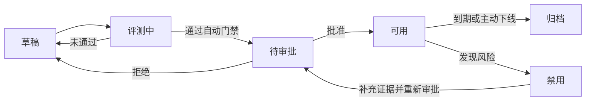

**建议方案**：生命周期使用显式状态机和固定状态集合，变更要求权限、原因、评测证据与审计事件；模型卡自动字段和人工字段分离。权限查询使用项目治理模块的批量判定契约。

### 3.10.4 交付包与兼容性校验

**背景介绍**：下游经常收到缺少分词器、模板、量化元数据或基础模型引用的产物，部署时才发现无法加载。

**建设目标**：按交付目标生成包含模型配置、权重、分词器、`adapter`或基础模型引用、量化信息、推理参数和校验清单的完整模型包；检查架构、权重键、特殊词、上下文长度、`chat_template`和最小生成。

**建议方案**：导出适配器按目标推理引擎运行隔离任务，输入是不可变模型版本，输出是新的交付包和校验报告。通用清单直接复用，只有引擎差异进入适配器。

### 3.10.5 推理平台交接

**背景介绍**：模型和推理平台交接时，当前痛点如下：

1. 手工上传容易交错版本、遗漏评测和审批证据。
2. 训练平台若直接承担在线服务，会扩大边界并重复建设。

**建设目标**：用户选择通过门禁和审批的模型包发起交付，平台提交版本、存储引用、运行参数和评测摘要给既有推理平台，并回写部署编号、目标环境、状态和拒绝原因。

推理平台交接至少包含以下流程：

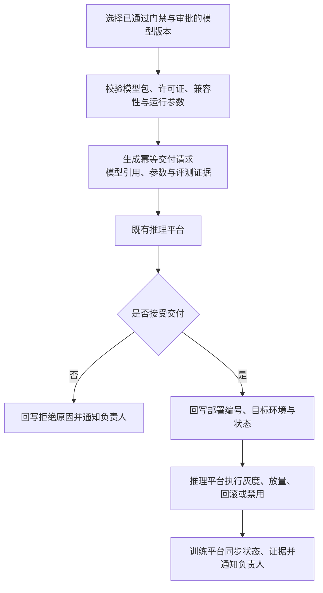

**建议方案**：定义稳定的交付请求契约，由推理平台适配器转换；采用幂等交付键和异步状态回调或轮询。训练平台不承载在线推理流量，不直接操作流量，也不把失败任务的中间产物展示为可交付模型，只保存关联和审计证据。推理适配器不可用时，状态必须显示未知或待同步，不能根据训练侧信息推断线上状态。

### 3.10.6 灰度、回滚与禁用联动

**背景介绍**：模型交到推理平台之后，当前痛点如下：

1. 部分延迟、格式和安全问题只在真实流量中暴露。
2. 缺少版本关联时，无法快速回滚并通知责任人。

**建设目标**：展示推理平台的灰度比例、放量、回滚和禁用状态，保留部署前后版本、流量阶段、原因和评测证据，并通知模型负责人。

**建议方案**：推理平台仍是发布动作的唯一执行方，训练平台消费受治理事件并更新交付投影；适配器不可用时标记状态未知，不推断线上状态。

### 3.10.7 模型产物保留与清理

**背景介绍**：模型产物越积越多时，当前痛点如下：

1. 断点、中间权重和评测文件长期堆积会耗尽存储。
2. 直接删除可能破坏复现、交付和合规留存。

**建设目标**：按模型类型、任务状态、引用关系和保留期限生成清理候选，清理前展示影响并要求审批，记录实际删除范围和失败结果。

模型产物清理采用可撤销等待期和删除前二次检查：

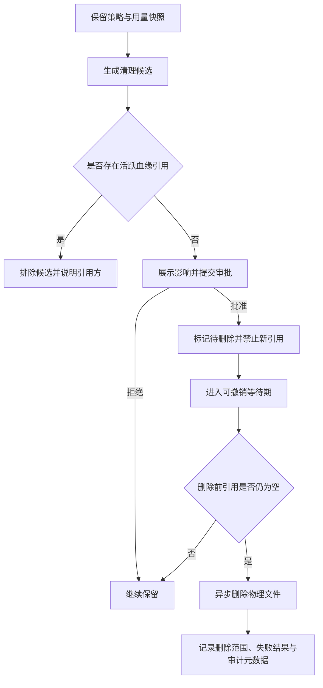

**建议方案**：采用标记、等待期和异步清理三阶段流程，先阻止新引用再删除物理文件；血缘批量检查活跃引用。删除接口幂等，审计元数据长期保留。

### 3.10.8 模型家族图谱

**背景介绍**：模型数量增长后，当前痛点如下：

1. 仅靠名称无法找到最佳可用版本。
2. 无法判断基础模型升级或下线会影响哪些派生模型和环境。

**建设目标**：按模型家族展示基础模型、继续预训练版本、派生模型、`adapter`、评测和交付环境，支持影响分析和条件筛选。

模型家族图谱的核心节点与关系示例如下：

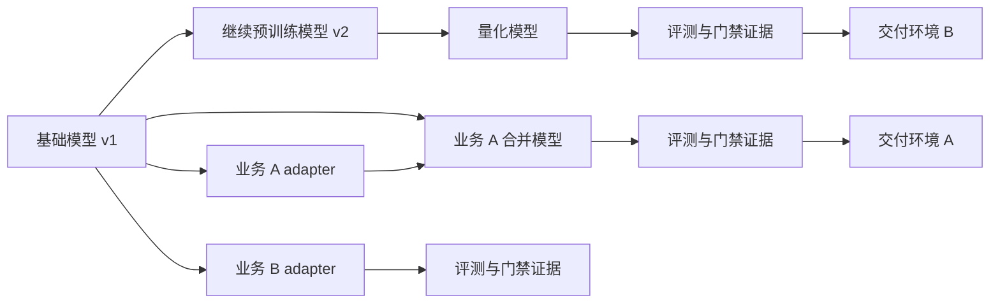

**建议方案**：复用模型父子关系和通用血缘投影，先使用关系数据库的有界查询与缓存，不单独引入图数据库；接口限制深度和节点数并返回轻量投影。

## 3.11 工作流与自动化

### 3.11.1 人工审批节点

**背景介绍**：模型要不要交付，不能只看自动分数。当前痛点如下：

1. 自动指标无法覆盖全部业务与合规风险。
2. 没有明确审批节点，实验模型可能绕过责任确认直接交付。

**建设目标**：评测通过后进入人工审批，审批人查看模型、数据授权、评测、成本和已知缺陷，意见、证据和拒绝原因写入模型记录。

**建议方案**：审批作为暂停型步骤，调用现有审批能力或稳定适配器；审批决策使用一次性任务和权限校验。审批模块不可用时，要求审批的流程保持等待或失败，不自动放行。

### 3.11.2 版本化工作流模板

**背景介绍**：数据检查、训练、评测、门禁、登记和审批靠人工串联时，当前痛点如下：

1. 容易漏步骤。
2. 容易复制错路径。
3. 容易读到共享目录中的“最新文件”，而不是指定版本。

**建设目标**：以可发布、回滚的`DAG`模板编排步骤，步骤之间只传递不可变数据集、模型和评测产物引用及校验摘要，缺失输入时给出明确原因。

**建议方案**：工作流模块只负责依赖、状态和引用传递，每个步骤仍调用现有任务、数据、评测或模型服务；步骤之间只传递`dataset://`、`model://`、`evaluation://`等不可变引用和校验摘要，不依赖共享目录中的“最新文件”。`DAG`发布后不可修改，跨模块契约返回自身投影，不暴露`DAO`、内部实体或私有状态。

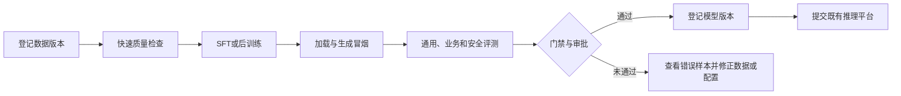

### 3.11.3 步骤状态、重试与幂等

**背景介绍**：工作流跑起来之后，当前痛点如下：

1. 单步失败后整条流程重跑，会重复消耗资源。
2. 工作流与训练任务状态不一致，可能造成重复提交和产物覆盖。

**建设目标**：按步骤配置超时、分类重试、取消、断点恢复和人工暂停，步骤状态与实际任务关联；所有运行使用输入版本和幂等键生成唯一身份，重复请求复用或显式创建新运行。

步骤运行、分类重试和人工接管的状态流转如下：

```mermaid
flowchart TB
    created["已创建"] --> running["运行中"]
    running -->|"成功"| succeeded["已完成并固化产物引用"]
    running -->|"执行失败"| classify{"错误是否可重试且未超限"}
    classify -->|"是"| retrying["等待退避并增加重试次数"]
    retrying --> running
    classify -->|"否"| manual["等待人工接管"]
    running -->|"人工暂停"| paused["已暂停"]
    paused -->|"恢复"| running
    manual -->|"修正后恢复"| running
    running -->|"取消"| canceling["按依赖逆序取消"]
    paused -->|"取消"| canceling
    manual -->|"取消"| canceling
    canceling --> canceled["已取消并保留已完成产物"]
```

**建议方案**：使用持久状态机和事件驱动状态同步，外部调用都带幂等键；取消按依赖逆序执行并保留已完成产物。数据校验、评测和导出可以按标准错误类型自动重试，训练任务则必须区分可恢复的节点故障和不可重试的数据或配置错误；重试策略受次数限制，超限后进入人工接管，禁止无限重试。

### 3.11.4 步骤缓存

**背景介绍**：调参时数据处理和评测输入常常不变。当前痛点如下：

1. 重复执行浪费资源。
2. 反馈周期被拉长。

**建设目标**：对适合复用的数据处理和评测步骤提供结果缓存，显示命中原因、来源运行和输入摘要；训练步骤默认不因路径相同自动复用。

**建议方案**：缓存键包含输入版本、脚本或镜像摘要和全部有效参数，缓存结果仍是不可变产物引用。缓存能力直接调用所属模块已有缓存契约，工作流不复制其内部索引。

### 3.11.5 并行实验

**背景介绍**：并行试验如果靠手工复制，当前痛点如下：

1. 复制多组超参、`LoRA`配置或评测套件时容易漏改参数。
2. 串行执行会延长实验周期。

**建设目标**：一个工作流可展开多组参数和评测分支，设置并发上限并按实验组汇总质量、资源和成本，支持提前停止无效分支。

参数矩阵展开后的有界并行`DAG`如下：

```mermaid
flowchart TB
    input["共享的模型、数据与镜像版本"] --> expand["展开有界参数矩阵"]
    matrix["超参、LoRA 配置与评测套件"] --> expand
    expand --> admission["预算、配额与并发准入"]
    admission --> runA["实验分支 A"]
    admission --> runB["实验分支 B"]
    admission --> runC["实验分支 C"]
    runA --> evalA["分支评测 A"]
    runB -->|"达到提前停止条件"| stopped["停止无效分支并保留摘要"]
    runC --> evalC["分支评测 C"]
    evalA --> summary["批量汇总质量、资源与成本"]
    stopped --> summary
    evalC --> summary
    summary --> candidate["选择候选配置或生成下一轮矩阵"]
```

**建议方案**：参数矩阵在提交时展开为有界`DAG`，禁止无限动态生成；分支共享不可变输入和可复用缓存。汇总从任务与评测模块批量读取投影。

### 3.11.6 工作流资源计划

**背景介绍**：工作流一旦展开并行分支，当前痛点如下：

1. 可能瞬间占满队列，影响其它项目。
2. 总成本和完成时间难以预估。

**建设目标**：配置工作流预算、并发上限、步骤优先级、队列选择和超限处理，运行前展示资源计划，运行中展示实际消耗和剩余额度。

**建议方案**：基于各步骤任务规格汇总静态计划，并从治理模块批量获取配额与用量；工作流只做软规划，实际准入仍由队列和预算策略执行。

### 3.11.7 历史运行复现与差异

**背景介绍**：复现历史运行时，当前痛点如下：

1. 手工抄写历史输入和默认参数容易遗漏隐含值。
2. 评审者无法判断结果变化来自数据、镜像还是配置。

**建设目标**：从历史运行复制参数、输入引用和审批配置生成新版本，并显示数据、模型、镜像、参数、模板和门禁差异。

**建议方案**：历史运行保存解析后的完整规格快照，复现基于快照生成新请求；差异由结构化模式比较，不通过文本`diff`猜测语义。

### 3.11.8 事件与计划触发

**背景介绍**：流程该何时再跑，当前痛点如下：

1. 依赖人工记得在数据、镜像或门禁变化后重跑，会漏掉更新。
2. 没有去重的自动触发可能批量误提交。

**建设目标**：支持镜像发布、数据版本发布、定时计划、门禁变化和人工操作触发，记录触发条件、操作者、去重结果和生成的运行。

**建议方案**：触发器只生成标准工作流提交请求，统一经过权限、预算和幂等校验；事件订阅带过滤条件和速率限制。计划与事件类型使用固定命名类型。

## 3.12 强化学习后训练

### 3.12.1 奖励资产登记

**背景介绍**：奖励函数或规则隐藏在脚本中，会使同名实验实际优化不同目标，奖励漂移和安全边界也无法追溯。

**建设目标**：登记奖励模型或规则奖励的版本、训练数据、评分范围、校准集、适用任务、负责人和安全限制，并作为强化学习运行的不可变输入。

**建议方案**：奖励资产复用模型与数据引用，仅补充奖励协议和校准元数据；规则奖励打包在不可变镜像或版本化脚本中。运行模块通过奖励计算契约调用，不直接读取登记模块内部配置。

### 3.12.2 强化学习运行与安全监控

**背景介绍**：在线强化学习跑起来之后，当前痛点如下：

1. 涉及策略、参考、奖励、采样和训练多个角色，任一阶段失败都可能丢失整轮样本。
2. 奖励上升还可能伴随长度偏差、拒答失控或安全退化。

**建设目标**：记录各角色模型、采样配置、`rollout`资源、经验缓存和轮次断点，支持阶段级重试与人工接管；监控奖励分布、`KL`约束、策略熵、拒答率、长度偏差和安全指标。

|阶段|核心输入|平台交付重点|前置依赖|
|---|---|---|---|
|偏好数据准备|`prompt`、`chosen`、`rejected`或排序列表|格式、标注批次、指南、抽检和授权|数据质量、标注反馈、评测污染检查|
|奖励资产登记|奖励模型或规则奖励、校准集和评分范围|不可变版本、适用场景、限制和负责人|模型注册、数据血缘、安全评测|
|强化学习运行|策略、参考、奖励、采样和训练角色|阶段状态、资源、断点、重试和人工接管|工作流、调度隔离、断点恢复|
|质量判断|奖励、`KL`、拒答率、长度、策略熵和安全指标|训练中监控、基线比较和质量门禁|统一评测、门禁和模型审批|

多角色运行、监控与门禁的关系如下：

```mermaid
flowchart TB
    prompt["提示数据版本"] --> rollout["rollout 采样"]
    policy["策略模型"] --> rollout
    reference["参考模型"] --> rollout
    rollout --> scoring["奖励计算"]
    reward["奖励资产版本"] --> scoring
    scoring --> experience["经验批次与轮次产物"]
    experience --> trainer["策略更新"]
    trainer --> checkpoint["轮次断点"]
    rollout --> monitor["运行与安全监控"]
    scoring --> monitor
    trainer --> monitor
    checkpoint --> gate{"奖励、KL、安全与质量门禁"}
    monitor --> gate
    gate -->|"继续训练"| nextPolicy["以轮次断点生成下一轮策略版本"]
    nextPolicy --> rollout
    gate -->|"达到停止条件"| evaluation["离线评测与模型审批"]
    gate -->|"越界或异常"| intervention["暂停并进入阶段重试或人工接管"]
```

**建议方案**：通过工作流编排`verl`、`TRL`等框架任务，不在平台控制面重写算法循环；角色和阶段使用类型化任务规格及不可变产物引用。高频指标进入时序系统，门禁消费聚合摘要，资源与预训练和正式`SFT`队列隔离。

`2027 Q3`前不要求提供完整内置强化学习页面；首期可通过模板、`YAML`和工作流表达多角色任务。平台不把某一种奖励算法定为唯一标准，也不允许只因为奖励上升就自动把模型放行。

# 4. 建设路线与验收

|阶段|建设重点|阶段出口|
|---|---|---|
|`2026 Q4`：可靠预训练、实验分析与`SFT MVP`|开发机（走资源队列占用额度并支持闲置回收）、`aitrain`、统一任务规格、路径与并行校验、数据集登记、断点检测、再次提交恢复、训练进展与停滞提示试点、实验指标快照与排序、按需看板、调度解释、任务通知、`SFT`基础能力与评测|真实预训练任务可从完整断点恢复或明确从头运行；用户可从侧栏或任务详情进入实验，按关键指标筛选`Run`并打开完整曲线；`SFT`可基于已登记数据生成可加载`adapter`并完成基础回归|
|`2027 Q1`：数据、评测、镜像与模型治理|数据质量、授权与血缘，训练模板，`Harbor`镜像按需检索、常用镜像用途分类、平台预置训练与开发机镜像、分类下拉选择，模型注册、模型卡、质量门禁、项目权限和审计；以`P2`验证私有化`SwanLab`适配|业务方可完成数据质量检查与授权、查看门禁报告并审批模型，不再手工翻目录；`SwanLab`验证不作为阶段出口|
|`2027 Q2`：偏好数据、工作流与交付|偏好与合成数据、工作流编排与缓存、切片分析、模型导出、推理平台交接和资源预算|数据检查到审批交付可通过版本化工作流完成，失败可从中间步骤恢复|
|`2027 Q3`：规模化后训练|强化学习、多模态扩展、事件触发、灰度联动、产物治理和平台`SLO`|在隔离项目中完成可审计的强化学习流程，不影响预训练和正式`SFT`队列稳定性|
|`2027 Q4`：效率增强|数据漂移和模型家族图谱|平台能够解释数据与模型变化的影响范围，并为下一轮资源与模型治理提供依据|

关键验收指标的目标值需要先由真实任务建立基线，建议至少覆盖以下方向：

|指标|建议验收口径|
|---|---|
|提交校验|路径、权限、并行和模型兼容性错误在启动前拦截，关键规则覆盖率不低于`95%`|
|预训练恢复|恢复运行明确记录实际加载断点，未落盘进度损失不超过最近断点间隔|
|调度可解释性|关键调度事件在`60`秒内可见；任务详情按`Pod`展示标准阶段、首要原因和多次调度尝试，任务列表展示`Pod`聚合摘要，且不泄露其它用户信息|
|训练可观测性|平台分别记录最后全局`iter`的实际发生时间与指标采集时间，日志、指标、断点和实验均可按`job_id`关联；疑似停滞必须经过连续多个观察窗口并展示触发依据，采集失败或处于已知长阶段时不得误报为训练故障；试点报告能够统计确认事件、误报场景、平均发现时长和估算节省的`GPU`时长|
|实验分析|实验列表展示最新`Loss`、进度、吞吐、最后一步时间和指标采集时间；服务端在过滤后、分页前完成排序，缺失指标显示`—`并置后；用户可从侧栏和任务详情进入实验，并通过鉴权地址按需打开`TensorBoard`|
|`SwanLab`适配（`P2`）|获批的私有化实例或本地`swanlog`记录可关联平台`Run`、增量同步白名单摘要指标并通过统一身份认证打开；实例不可用或未启用时不影响`TensorBoard`、平台快照和训练任务|
|镜像管理|用户可以在授权`Harbor`项目中按需分页检索并保存常用镜像，检索结果不会自动进入平台列表；每条镜像至少标记训练或开发用途，管理员可预置两类公共镜像；训练任务和开发机只展示对应类型的已保存镜像，提交后同时记录标签和不可变摘要|
|任务通知|关键事件在产生后`60`秒内触发通知，重复事件可合并且送达结果可查询|
|`SFT`可复现性|相同镜像摘要、数据、任务规格、种子和资源配置可再次运行，差异有明确记录|
|质量门禁|缺少评测、数据授权、模型卡或审批证据的模型不能进入可交付状态|
|血缘完整性|任一模型版本可反查基础模型、数据、镜像、训练、评测、审批和交付记录|
|资源治理|按项目输出`GPU`时长、有效`token`、评测样本和存储用量；开发机占用计入资源队列额度，空闲后可自动回收|

# 5. 规划边界与依赖门禁

1. `2026 Q4`不要求同时交付完整强化学习平台、标注系统、多模态全链路、不落盘弹性恢复、自动超参搜索或精确财务结算。
2. 平台不从金融云生产、公网或其它数据源自动下载数据，不建设跨环境数据同步或入湖流水线；开发机同样不是拉数入口。
3. 训练代码由团队现有`Git`和镜像构建发布流程管理，平台只检索已经推送到获批`Harbor`项目的镜像并记录实际摘要、启动入口和配置版本，不建设源码仓库、代码快照系统或镜像构建流水线。
4. 不将`Determined`、完整`Kubeflow`或其它单一开源平台作为整体二次开发底座；训练、数据和评测框架通过受控模板与适配器接入。
5. 扩大`SFT`和工作流范围前，必须完成基础模型登记、共享存储吞吐、断点完整性和多卡通信验证。
6. 启用偏好优化或强化学习前，必须具备偏好数据授权、评测污染检查、安全门禁和模型回滚路径。
7. 启用自动重试、自动恢复或`AI Agent`操作前，必须完成幂等键、最小权限、审计、预算上限和人工接管机制。
8. 新训练框架先以模板和适配器接入，验证任务状态、日志、`tfevents`或适配后的指标、断点与评测产物可以被平台统一识别后，再评估专用页面。
9. 平台不支持`i18n`，不引入多语言包；页面、接口提示、错误码说明和通知使用中文。
10. 不建设字典模块。状态、类型、阶段、动作和角色等取值在代码中用固定命名类型表达，由所属模块维护，不通过统一字典服务配置。
11. `SwanLab`优先接入内网可达的私有化实例，并兼容共享存储中的本地`swanlog`记录。连接公网`SwanLab Cloud`必须单独完成网络出口、数据分类和安全审批；任何部署形态都不得默认上传原始日志、训练样本、断点或模型权重。
12. 镜像管理不执行`Harbor`全量仓库同步、定时全库对账或`Webhook`增量发现，只在用户主动检索、保存或更新已选镜像时访问`Harbor`。平台只保存用户确认的常用镜像及治理元数据，不复制镜像层，也不替代容器运行时从`Harbor`拉取镜像；镜像扫描和完整漏洞报告继续由`Harbor`负责。
13. `Harbor`连接必须使用最小权限机器人账号，凭据由`Secret`或密钥服务托管，不得出现在任务规格、接口响应、检索错误和日志中；可检索项目范围变更必须经过授权并记录审计。
14. `Harbor`短时不可用时，已经保存的常用镜像、平台预置镜像和历史引用仍可查询，不得清空候选；新的远程检索、保存和版本更新应明确失败并允许重试。运行时如果无法从`Harbor`拉取已选摘要，任务按镜像拉取失败处理，不能把本地元数据状态误报为镜像可用。

# 6. 参考资料

- [SkyPilot训练指南](https://docs.skypilot.co/en/latest/reference/training-guide.html)
- [kubeflow/arena](https://github.com/kubeflow/arena)
- [NVIDIA NeMo容错说明](https://docs.nvidia.com/nemo-framework/user-guide/25.02/resiliency.html)
- [NVIDIA nvidia-resiliency-ext](https://github.com/NVIDIA/nvidia-resiliency-ext)
- [Kubeflow Trainer断点与恢复](https://developers.redhat.com/articles/2026/05/21/guide-jit-checkpointing-kubeflow-trainer-openshift-ai)
- [SageMaker HyperPod自动恢复](https://docs.aws.amazon.com/sagemaker/latest/dg/sagemaker-hyperpod-resiliency-slurm-auto-resume.html)
- [阿里云PAI-DLC概述](https://help.aliyun.com/zh/pai/what-is-dlc)
- [阿里云EasyCKPT](https://help.aliyun.com/zh/pai/easyckpt)
- [阿里云创建训练任务](https://help.aliyun.com/zh/pai/create-a-training-task)
- [在DLC上使用Megatron-LM做预训练](https://help.aliyun.com/zh/pai/use-cases/dlc-use-cases/)
- [OpenSCOW](https://github.com/PKUHPC/SCOW)
- [Harbor API Explorer](https://goharbor.io/docs/main/working-with-projects/using-api-explorer/)
- [Hugging Face Transformers chat templates](https://huggingface.co/docs/transformers/main/en/chat_templating)
- [Hugging Face TRL](https://huggingface.co/docs/trl/index)
- [Hugging Face PEFT](https://huggingface.co/docs/peft/index)
- [ms-swift](https://swift.readthedocs.io/en/latest/)
- [DeepSpeed ZeRO](https://www.deepspeed.ai/tutorials/zero/)
- [PyTorch FSDP](https://pytorch.org/docs/stable/fsdp.html)
- [Data-Juicer](https://github.com/modelscope/data-juicer)
- [NVIDIA NeMo Curator](https://docs.nvidia.com/nemo/curator/latest/)
- [EvalScope](https://evalscope.readthedocs.io/en/latest/)
- [EleutherAI lm-evaluation-harness](https://github.com/EleutherAI/lm-evaluation-harness)
- [MLflow Model Registry](https://mlflow.org/docs/latest/ml/model-registry/)
- [OpenLineage](https://openlineage.io/docs/)
- [NIST AI Risk Management Framework](https://www.nist.gov/itl/ai-risk-management-framework)
- [OWASP Top 10 for LLM Applications](https://owasp.org/www-project-top-10-for-large-language-model-applications/)
- [vLLM](https://docs.vllm.ai/)
- [TensorRT-LLM](https://nvidia.github.io/TensorRT-LLM/)
- 仓库内文档：`原始需求.md`、`AI训练平台技术方案调研.v2.md`、`训练配置文件管理功能设计.md`、`prototype.v3/`
