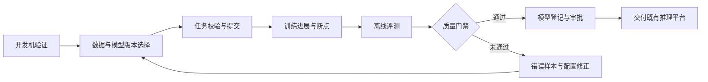
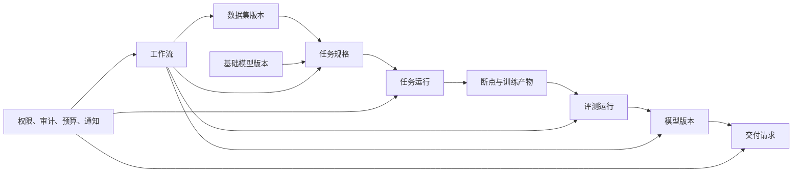

# 大模型训练平台能力规划（草稿）

本文面向预训练、监督微调、偏好优化、评测和模型交付场景，说明训练平台从作业管理工具演进为模型生产平台所需的能力、建设顺序和建议技术方案。文档只规划需要新增或改进的能力；首期已经够用的配置集版本挂载、队列与多机房调度、实验页完整曲线，以及明确不建设的平台自动拉数、按机房分盘符和不落盘恢复，不再作为独立功能规划。

# 规划基线

## 当前能力与核心问题

当前平台已经能够选择团队和队列、配置镜像与启动命令、挂载配置、提交`Volcano`任务，并查看`Pod`日志、资源监控、告警和`TensorBoard`曲线。主要缺口不在“能否提交任务”，而在开发与训练环境不一致、任务规格无法复用、断点不可验证、故障恢复依赖人工、训练进度不可解释，以及后训练所需的数据、评测、模型和审批对象尚未形成闭环。

目标用户的典型工作链路如下：

## 已确认的环境约束

1. 所有机房统一使用`/data/hpc/home`和`/share`两条网络盘路径。产品不得再暴露`/mnt/shared`、`/data/jiangsu`、`/data/liangjiang`等历史或假设路径。
2. `/data/hpc/home/<user>`用于个人代码、试验输出和个人断点，`/share`用于团队共享数据、分词器、模板和共享产物。开发机与正式训练任务必须看到一致的逻辑路径。
3. 训练平台运行在`UAT`环境，不能直连金融云生产或公网数据源。数据由有权限的人员先拷贝到网络盘，平台只负责登记、校验、授权和只读引用，不负责下载、同步或入湖。
4. 本文中的`iter`统一指全局优化器更新步数，即所有训练进程完成一次梯度同步和参数更新后的计数；`epoch`表示完整遍历一次训练数据。
5. 训练平台负责离线训练、评测、模型包校验和交付记录，不承载在线推理流量、弹性扩缩容和发布路由。

数据进入平台的边界如下：

## 规划口径

|优先级|判断标准|
|---|---|
|`P0`|季度内必须交付，直接影响训练闭环、数据安全、结果可复现或长周期任务恢复|
|`P1`|形成可复用的数据、后训练、评测、模型和工作流流程所需能力|
|`P2`|面向规模化、资源效率、自动化和高级后训练的增强能力|

季度依赖关系为：`2026 Q4`完成预训练可靠性和`SFT MVP`；`2027 Q1`完成数据、评测和模型治理；`2027 Q2`完成偏好数据、工作流和模型交付；`2027 Q3`完成强化学习、多模态扩展和规模化交付；`2027 Q4`完成漂移分析、模型图谱等效率增强。

## 总体技术架构原则

平台以数据集版本、任务规格、任务运行、断点、评测运行、模型版本和交付请求为核心对象。工作流只编排这些对象的不可变引用，治理能力提供统一的项目、权限、审计、预算和通知约束。

- 每个模块只维护自身对象和生命周期，跨模块通过稳定接口、不可变资源引用、批量查询契约或事件传递摘要，不直接访问其它模块的内部数据结构。
- 列表、聚合和图谱查询使用批量接口、分页、缓存或派生快照控制装配成本，禁止按列表项循环调用详情接口形成`N+1`查询。训练指标和日志保留在现有时序与日志系统中，业务库只保存索引和摘要。
- 状态、类型、阶段、动作、恢复策略等枚举通过字典能力治理，前端显示文案支持`i18n`；功能模块禁用后，前端入口和字段完全隐藏，后端可选依赖降级为空结果或跳过非强制步骤，历史数据继续保留并可在重新启用后恢复。
- 新增适配层只用于隔离已确认的变化点，例如不同训练框架、评测器和推理平台；稳定的项目、任务、数据和模型能力优先直接调用现有服务契约，避免重复建设窄接口。

# 能力规划概览

|编号|模块|功能|功能描述|解决痛点/场景|季度规划|优先级|状态|
|---|---|---|---|---|---|---|---|
|`DEV-01`、`DEV-02`、`DEV-03`、`DEV-04`|开发环境与配置|开发机工作空间|提供`Web Shell`、可选`JupyterLab`、持久目录和一键转训练任务|开发与正式训练环境不一致，试验配置靠手工复制，空闲`GPU`长期占用|`2026 Q4`|`P0`|未完成|
|`CFG-01`|开发环境与配置|统一路径规范|统一示例、模板和校验中的输入、输出与断点路径|历史盘符导致跨集群失败或产物写入错误位置|`2026 Q4`|`P0`|已完成|
|`CLI-01`、`CLI-02`|开发环境与配置|`aitrain`与统一任务规格|页面和命令行共用版本化`train.yaml`及一致的校验、提交、日志和取消能力|页面、脚本和历史命令字段漂移，批量训练难以自动化和复现|`2026 Q4`|`P0`|未完成|
|`IMG-01`|开发环境与配置|镜像目录|展示镜像框架、驱动、`CUDA`、适用机型、维护人和弃用信息|用户无法判断镜像兼容性，也无法区分拉取、启动和权限故障|`2027 Q1`|`P1`|未完成|
|`RCP-01`、`RCP-02`|开发环境与配置|训练任务模板|提供版本化模板，并联合校验资源、并行、批次、显存和挂载配置|训练配置依赖个人经验，任务在分配资源后才因参数冲突失败|`2027 Q1`|`P1`|未完成|
|`JOB-01`、`JOB-02`、`JOB-03`、`JOB-04`|任务提交与观测|提交前校验与预览|校验路径、权限、目录、并行关系和结构化配置，预览实际读写范围|明显错误在排队后才暴露，用户误以为平台会搬运数据|`2026 Q4`|`P0`|已完成|
|`SCH-01`|任务提交与观测|调度过程可视化|展示队列准入、整组等待、资源匹配、`Pod`调度、镜像拉取和启动阶段|“排队中”无法解释资源缺口，用户只能反复询问运维|`2026 Q4`|`P0`|未完成|
|`LIST-01`|任务提交与观测|任务列表进展摘要|展示当前`iter`、步耗时、吞吐、预计剩余时间和异常排序|任务列表无法区分正常运行、性能下降和训练停滞|`2026 Q4`|`P0`|未完成|
|`DET-01`、`DET-02`|任务提交与观测|任务详情与日志定位|统一展示实际路径，并按进程、节点、时间和关键字检索日志|多机日志和实际读写位置不透明，排障耗时长|`2026 Q4`|`P0`|已完成|
|`PROG-01`、`PROG-02`|任务提交与观测|训练健康摘要|聚合训练进度、吞吐、算力、断点和异常计数并识别疑似卡住|仅看`GPU`利用率不能判断训练是否真正推进|`2026 Q4`|`P0`|未完成|
|`EXP-01`|任务提交与观测|任务与实验关联|任务、实验和`TensorBoard`共享任务编号并支持互相跳转|状态、日志和曲线分散，实验对比容易关联错误任务|`2026 Q4`|`P0`|未完成|
|`NTF-01`|任务提交与观测|任务运行事件通知|将排队超时、失败、卡住、断点失败和恢复结果通知责任人|算法人员无法持续守在页面，关键故障容易错过处理窗口|`2026 Q4`|`P0`|未完成|
|`CKPT-01`|断点与故障恢复|断点清单与完整性|按全局`iter`登记断点大小、完整性、写入耗时和加载校验结果|用户靠文件名猜断点是否可用，错误恢复重复浪费`GPU`|`2026 Q4`|`P0`|未完成|
|`CKPT-02`|断点与故障恢复|再次提交与恢复策略|复用任务配置并校验断点、模型、数据、并行和目录占用，记录实际恢复结果|再次提交不等于恢复，配置变化可能误加载或覆盖产物|`2026 Q4`|`P0`|未完成|
|`CKPT-03`|断点与故障恢复|停止风险提示|停止前显示最后完整断点、写入状态和预计丢失步数|值班人员无法判断停止会丢失多少有效进度|`2026 Q4`|`P0`|未完成|
|`REC-01`、`REC-02`|断点与故障恢复|半自动与自动故障恢复|识别可恢复故障，生成缩容草案或按策略换节点后自动再次提交|硬件和通信故障依赖人工找断点、改规模和重提任务|`2027 Q1`|`P1`|未完成|
|`DATA-01`、`DATA-02`、`DATA-03`|数据工程与治理|数据集登记与不可变版本|登记已落盘目录、文件清单、内容哈希、格式、分词器和规模|目录可能被覆盖、缺分片或尚未落盘，训练输入无法复现|`2026 Q4`：`DATA-03`；`2027 Q1`：`DATA-01`、`DATA-02`|`P0`、`P1`|未完成|
|`DATA-04`、`DATA-05`、`DATA-06`|数据工程与治理|数据质量、安全与去重|执行格式、长度、重复、敏感信息和违规内容检查并输出样本级原因|脏数据、泄漏和敏感信息常在训练或交付后才暴露|`2026 Q4`：`DATA-04`；`2027 Q1`：`DATA-05`、`DATA-06`|`P0`、`P1`|未完成|
|`DATA-07`、`DATA-08`|数据工程与治理|授权与可复现处理|记录授权来源、用途限制、脚本、规则、种子、分词器和统计报告|数据可读不等于可训练，处理参数不透明导致结果无法重建|`2026 Q4`：`DATA-08`；`2027 Q1`：`DATA-07`|`P0`、`P1`|未完成|
|`DATA-09`|数据工程与治理|数据混合与采样|版本化多数据集权重、温度、上限、重复轮数和实际采样量|目录相同但采样策略不同会产生不可解释的训练分布|`2027 Q1`|`P1`|未完成|
|`DATA-10`、`DATA-11`|数据工程与治理|安全预览与只读访问|提供脱敏抽样预览、字段统计和项目级只读挂载|用户无法确认数据内容，直接下载又会扩大敏感数据暴露面|`2026 Q4`|`P0`|未完成|
|`DATA-12`|数据工程与治理|数据血缘|关联原始目录、处理任务、数据版本、训练、评测和模型|数据问题或删除请求发生时无法确定受影响的派生模型|`2027 Q1`|`P1`|未完成|
|`DATA-13`、`DATA-14`、`DATA-15`|数据工程与治理|偏好、标注与合成数据|统一偏好协议并登记标注批次、生成配置、抽检和人工审核|偏好方向错误、标注规则漂移和合成污染难以追溯|`2027 Q2`|`P1`|未完成|
|`DATA-16`|数据工程与治理|数据漂移分析|比较数据版本的数量、语言、标签、长度和质量指标变化|历史模板和评测结论可能在新数据分布上失效|`2027 Q4`|`P2`|未完成|
|`SFT-01`、`SFT-02`|监督微调与后训练|任务类型与基础模型约束|区分全量`SFT`、`LoRA`、`QLoRA`等任务并校验基础模型兼容性|将微调当作预训练会漏掉模板、产物和评测要求|`2026 Q4`|`P0`|未完成|
|`SFT-03`、`SFT-04`、`SFT-05`、`SFT-06`、`SFT-07`|监督微调与后训练|数据协议与监督范围|统一消息协议，校验模板、划分、泄漏、`loss mask`、截断和`packing`|数据格式和监督范围错误会静默降低有效训练质量|`2026 Q4`|`P0`|未完成|
|`SFT-08`、`SFT-09`、`SFT-10`、`SFT-11`|监督微调与后训练|微调策略与资源估算|配置`LoRA/QLoRA`、精度、分布式策略并估算显存、时长和存储|错误组合在申请资源后才失败，资源规格容易过大或不足|`2026 Q4`|`P0`|未完成|
|`SFT-12`|监督微调与后训练|微调断点恢复|恢复权重、优化器、调度器、随机状态、数据游标和模板配置|只恢复权重会改变学习率和样本顺序，结果不可比较|`2026 Q4`|`P0`|未完成|
|`SFT-13`|监督微调与后训练|微调产物分类与血缘|区分基础模型、`adapter`、合并模型、断点和评测报告|产物混放会导致加载错误和父子模型关系丢失|`2026 Q4`|`P0`|未完成|
|`SFT-15`|监督微调与后训练|训练后自动评测|自动比较基础模型与微调模型的能力、安全和回归指标|训练`loss`下降不能证明业务效果提升或安全能力未退化|`2026 Q4`|`P0`|未完成|
|`SFT-14`|监督微调与后训练|模型合并与导出校验|提供`adapter`合并、权重导出、格式检查和生成冒烟测试|训练产物可能直到交付时才暴露无法加载的问题|`2027 Q1`|`P1`|未完成|
|`SFT-16`|监督微调与后训练|早停与最佳断点|支持按验证指标早停并区分最佳断点和最新可恢复断点|固定步数可能过拟合，最后断点不一定质量最佳|`2027 Q1`|`P1`|未完成|
|`SFT-17`|监督微调与后训练|模型卡草稿|依据任务血缘自动生成用途、限制、参数和评测证据|只有权重没有使用边界和风险信息，业务方无法评审|`2027 Q1`|`P1`|未完成|
|`SFT-19`|监督微调与后训练|回放集与遗忘控制|版本化通用、安全和领域数据配比，并比较微调前后退化|领域能力提升可能以通用能力和安全拒答退化为代价|`2027 Q1`|`P1`|未完成|
|`SFT-20`|监督微调与后训练|切片分析|按长度、语言、业务标签、难度和能力标签对比结果|总体均分会掩盖少数语言和高风险样本退化|`2027 Q2`|`P1`|未完成|
|`SFT-18`|监督微调与后训练|多模态与工具调用扩展|预留媒体适配、格式校验、模态`token`和批处理接口|后续增加图文、音频或工具调用会破坏现有文本协议|`2027 Q3`|`P2`|未完成|
|`RL-01`|强化学习后训练|奖励资产登记|登记奖励模型或规则奖励的版本、范围、校准集和限制|奖励逻辑隐藏在脚本中，实验目标和漂移无法追溯|`2027 Q3`|`P2`|未完成|
|`RL-02`、`RL-03`|强化学习后训练|强化学习运行与安全监控|编排多角色模型和`rollout`资源，监控奖励、`KL`、拒答率和安全指标|多阶段失败难恢复，奖励投机不能仅靠总奖励发现|`2027 Q3`|`P2`|未完成|
|`EVAL-01`、`EVAL-02`|评测与质量门禁|评测集与指标目录|版本化标准、业务、安全、回归和人工评测集及适用指标|只看训练`loss`或单一总分无法判断业务与安全效果|`2026 Q4`|`P0`|未完成|
|`EVAL-03`、`EVAL-04`、`EVAL-05`、`EVAL-06`|评测与质量门禁|统一评测运行器|适配多种评测器，固化配置并输出逐样本和聚合协议|脚本、参数和指标口径不一致，结果无法横向比较|`2026 Q4`|`P0`|未完成|
|`EVAL-07`|评测与质量门禁|模型裁判|版本化裁判模型、提示词和解析器，并支持人工复核|开放式回答缺少标准答案，裁判偏差可能影响放行结论|`2027 Q1`|`P1`|未完成|
|`EVAL-08`|评测与质量门禁|安全评测|覆盖越权、注入、泄漏、幻觉、越狱和工具调用风险|业务微调可能提升命中率却破坏隐私和拒答能力|`2027 Q1`|`P1`|未完成|
|`EVAL-09`|评测与质量门禁|基线回归对比|逐指标和逐样本比较候选与指定基线模型|目标能力提升可能掩盖通用或安全能力退化|`2026 Q4`|`P0`|未完成|
|`EVAL-10`|评测与质量门禁|评测污染检查|标记训练集、历史评测集和公开语料的重叠风险|测试题泄漏会造成虚高分和上线后的效果落差|`2027 Q1`|`P1`|未完成|
|`EVAL-11`|评测与质量门禁|评测统计可信度|展示样本量、分层统计、置信区间和可比性提示|小样本偶然波动可能被误判为显著提升|`2027 Q2`|`P1`|未完成|
|`EVAL-12`|评测与质量门禁|评测产物查询|保存原始输出、错误样本、配置和环境并支持样本级查询|只保存均分无法复盘具体失败或形成证据链|`2026 Q4`|`P0`|未完成|
|`EVAL-13`、`EVAL-14`|评测与质量门禁|质量门禁与评测报告|配置阈值、退化幅度、风险项和审批条件并生成对比报告|人工看表容易漏掉不可退化指标，无法形成可签字材料|`2027 Q1`|`P1`|未完成|
|`EVAL-15`|评测与质量门禁|评测执行隔离|限制自定义评测脚本的网络、文件、凭据和资源访问|第三方评测代码可能泄露数据或影响集群稳定性|`2027 Q1`|`P1`|未完成|
|`EVAL-16`|评测与质量门禁|评测缓存与失败重跑|以模型、套件、提示词、参数、数据和镜像生成缓存键|重复完整评测成本高，粗粒度缓存又可能复用错误结果|`2027 Q2`|`P1`|未完成|
|`MODEL-01`、`MODEL-02`|模型资产与交付|模型注册与血缘|登记各类模型并关联训练、数据、配置、镜像、评测和责任人|权重散落在目录中，无法判断来源和可交付版本|`2027 Q1`|`P1`|未完成|
|`MODEL-03`|模型资产与交付|模型完整性|以不可变版本和内容哈希管理大文件传输及校验|分片缺失或权重损坏可能产生隐蔽的推理错误|`2027 Q1`|`P1`|未完成|
|`MODEL-04`、`MODEL-05`、`MODEL-06`|模型资产与交付|模型卡、状态与权限|管理模型用途、风险、生命周期状态和下载交付权限|文件存在不代表已审核，长期共享权限扩大泄露面|`2027 Q1`|`P1`|未完成|
|`MODEL-07`、`MODEL-08`|模型资产与交付|交付包与兼容性校验|生成完整模型包并校验权重、分词器、模板、量化和最小生成|下游常收到不完整或不可加载的模型产物|`2027 Q2`|`P1`|未完成|
|`MODEL-09`|模型资产与交付|推理平台交接|向既有推理平台提交已审批模型并回写部署状态|手工上传容易交错版本，训练平台又不应重复建设在线服务|`2027 Q2`|`P1`|未完成|
|`MODEL-10`|模型资产与交付|灰度、回滚与禁用联动|同步推理平台的灰度、回滚和禁用事件及证据|真实流量问题出现后缺少快速回退和版本关联|`2027 Q3`|`P2`|未完成|
|`MODEL-11`|模型资产与交付|模型产物保留与清理|按引用、状态和保留策略审批清理中间与过期产物|存储长期堆积，但直接删除会破坏复现与合规证据|`2027 Q3`|`P2`|未完成|
|`MODEL-12`|模型资产与交付|模型家族图谱|查询基础模型、派生模型、`adapter`、评测和交付环境关系|模型增长后无法判断影响范围和最佳可用版本|`2027 Q4`|`P2`|未完成|
|`WF-01`、`WF-02`|工作流与自动化|版本化工作流模板|以数据检查、训练、评测、门禁、登记和审批组成`DAG`|人工复制路径容易漏步骤、串版本和形成流程差异|`2027 Q1`|`P1`|未完成|
|`WF-03`、`WF-08`|工作流与自动化|步骤状态、重试与幂等|按步骤管理超时、取消、恢复、人工暂停和唯一运行|单步失败导致整条流程重跑，重复提交覆盖产物|`2027 Q1`|`P1`|未完成|
|`WF-04`|工作流与自动化|步骤缓存|按输入版本、镜像和参数复用数据处理或评测结果|调参时重复执行不变步骤，浪费资源和时间|`2027 Q2`|`P1`|未完成|
|`WF-05`|工作流与自动化|并行实验|并行多组超参、`LoRA`配置或评测套件并汇总成本|手工复制任务容易漏改参数，串行试验反馈慢|`2027 Q2`|`P1`|未完成|
|`WF-06`|工作流与自动化|人工审批节点|评测通过后由责任角色审批，意见和证据写入模型记录|自动指标无法覆盖所有业务风险，实验模型可能绕过确认|`2027 Q1`|`P1`|未完成|
|`WF-07`|工作流与自动化|事件与计划触发|按镜像、数据、门禁变化、定时计划或人工操作触发流程|依赖人工记忆会漏跑，自动触发缺少去重又会批量误提交|`2027 Q3`|`P2`|未完成|
|`WF-09`|工作流与自动化|工作流资源计划|配置预算、并发、优先级、队列和超限处理策略|并行分支可能瞬间占满队列且总成本不可预估|`2027 Q2`|`P1`|未完成|
|`WF-10`|工作流与自动化|历史运行复现与差异|基于历史输入和参数生成新运行并显示完整差异|手工抄配置会遗漏默认值，评审者无法解释结果变化|`2027 Q2`|`P1`|未完成|
|`GOV-01`|平台治理与开放能力|统一项目归属|统一用户、团队、项目、任务、数据、模型和队列关系|资产靠备注维护，故障、预算和违规事件找不到责任人|`2026 Q4`|`P0`|未完成|
|`GOV-02`、`GOV-03`|平台治理与开放能力|项目角色与资源授权|区分提交、协作、审批、只读和运维角色并分别授权资源|多人项目无法按职责分权，终端与详情页可能扩大访问范围|`2027 Q1`|`P1`|未完成|
|`GOV-04`|平台治理与开放能力|凭据注入与脱敏|通过`Secret`或密钥服务注入凭据并自动脱敏输出|令牌写入配置或日志会随导出、截图和产物扩散|`2026 Q4`|`P0`|未完成|
|`GOV-05`|平台治理与开放能力|统一审计|记录权限、任务、数据、模型、审批、导出和删除动作|安全或资源争议发生时无法还原责任与影响范围|`2027 Q1`|`P1`|未完成|
|`GOV-06`、`GOV-07`|平台治理与开放能力|用量、配额与预算|记录`GPU`、队列、存储和交付成本并配置预算与并发限制|无法解释队列拥堵和项目成本，超预算只能事后处理|`2027 Q2`|`P1`|未完成|
|`GOV-09`|平台治理与开放能力|任务可靠性策略|统一超时、幂等取消、分类重试和人工接管|网络抖动和错误重试可能重复提交或无限消耗资源|`2026 Q4`|`P0`|未完成|
|`GOV-08`|平台治理与开放能力|平台`SLO`与错误预算|定义可用性、成功率和恢复时长目标并形成月度报告|平台扩张后无法用统一口径安排可靠性建设优先级|`2027 Q3`|`P2`|未完成|
|`GOV-10`|平台治理与开放能力|业务与治理通知|通知评测退化、门禁失败、待审批、数据违规和预算超限|通知只面向运维会遗漏算法和业务责任人|`2027 Q1`|`P1`|未完成|
|`GOV-11`|平台治理与开放能力|统一开放接口|`Web`、`aitrain`和自动化系统共用版本化接口、错误码和幂等键|多入口各自实现提交逻辑会产生状态不一致|`2026 Q4`|`P0`|未完成|
|`GOV-12`|平台治理与开放能力|`Python SDK`与受控自动化|提供机器可读输出、短期令牌、最小权限和调用审计|自动化直接复用管理员凭据会放大权限和重复提交风险|`2027 Q2`|`P1`|未完成|

# 功能模块规划

## 开发环境与配置

### 开发机工作空间（`DEV-01`、`DEV-02`、`DEV-03`、`DEV-04`）

**背景需求**：算法人员需要在与正式训练一致的镜像、存储和权限环境中改代码、抽检数据和运行小样本。当前缺少统一开发入口，容易出现“开发能跑、训练找不到文件”，也无法治理空闲开发机占用的`GPU`资源。

**详细描述**：支持创建、启动、停止和自动回收开发机，默认提供不依赖`JupyterLab`进程的`Web Shell`，按需启用`JupyterLab`。开发机持久挂载`/data/hpc/home`和`/share`，展示数据授权与资源预估，并能基于当前镜像摘要、工作目录和启动配置生成训练任务差异预览。

**建议技术方案**：复用现有任务调度和镜像能力创建长生命周期工作负载，通过终端网关发放短期会话并记录连接审计；用户目录使用持久卷或现有网络盘，`/home/<user>`仅作为到个人目录的兼容软链。开发机模块通过任务规格契约输出草案，不直接创建训练模块内部对象；数据选择器只批量查询已登记且已授权的数据版本。

### 统一路径规范（`CFG-01`）

**背景需求**：旧原型中的分机房盘符与现网不符，复制示例会造成目录不存在、数据误读或产物落到临时磁盘。

**详细描述**：所有示例、模板、校验提示和详情页统一使用`/share/...`及`/data/hpc/home/<user>/...`，并明确输入、输出、实验和断点目录的用途。历史路径只用于识别并给出迁移提示，不允许新任务继续提交。

**建议技术方案**：在任务规格校验器中维护统一的路径策略，由页面、`aitrain`和模板共同调用；路径检查分为语法范围、目标集群可见性、读写权限和目录用途四类错误码。不要在不同入口重复硬编码盘符。

### `aitrain`与统一任务规格（`CLI-01`、`CLI-02`）

**背景需求**：大规模训练依赖脚本和批量操作，仅靠页面填写无法形成可审计、可比较和可自动化的任务规格；页面与命令行字段分叉还会导致复现失败。

**详细描述**：提供`auth`、`validate`、`dry-run`、`submit`、`rerun`、`logs`和`cancel`能力。页面可导入、编辑和导出同一份版本化`train.yaml`，命令行输出稳定的任务标识、状态、错误码、重试建议和机器可读结果。

**建议技术方案**：定义单一任务规格模式和兼容版本，由服务端完成默认值填充和最终校验；`Web`与`aitrain`调用同一应用服务。客户端只做即时提示，不能复制服务端规则；提交和再次提交使用幂等键，凭据保存在系统凭据存储而非配置文件。

### 镜像目录（`IMG-01`）

**背景需求**：镜像名称不能说明框架、驱动和硬件兼容性，用户遇到长时间启动时也无法判断是镜像拉取、容器启动还是权限问题。

**详细描述**：训练中心提供只读镜像目录，展示框架版本、`CUDA`、驱动要求、适用机型、维护人、扫描状态和弃用日期。任务创建时只展示当前项目可用且与目标资源兼容的镜像。

**建议技术方案**：镜像模块维护元数据与不可变摘要，通过批量候选接口向任务模块提供投影结果；运行状态由调度事件映射为标准阶段和错误码。镜像模块禁用时隐藏目录和增强筛选，任务仍可使用已有基础镜像引用。

### 训练任务模板（`RCP-01`、`RCP-02`）

**背景需求**：节点、卡数、并行策略、全局批次、镜像、挂载和`NCCL`参数相互依赖，依靠个人经验拼装会在资源分配后才暴露问题。

**详细描述**：提供官方、团队和个人三级版本化模板，预置经验证的模型规模、资源规格和框架配置。创建任务时联合校验总卡数与张量、流水线、上下文和数据并行关系，检查全局批次整除、显存风险、配置版本和挂载一致性。

**建议技术方案**：模板保存任务规格片段和受控变量，不复制调度或训练实现；实例化后生成完整快照，后续模板变更不影响历史任务。框架差异通过模板适配器隔离，通用资源与路径校验直接复用任务规格服务。

## 任务提交与观测

### 提交前校验与预览（`JOB-01`、`JOB-02`、`JOB-03`、`JOB-04`）

**背景需求**：路径、权限和并行参数错误通常在任务排队并占到资源后才失败；平台不负责拉数的边界若提示不清，用户会反复更换队列而不能解决问题。

**详细描述**：提交前逐项检查路径范围、目标集群目录存在性、读写权限、非空状态、输出占用和并行整除关系。预览页面展示解析后的输入、输出、断点、模型与配置引用，并明确提示需要先将数据拷到网络盘。

**建议技术方案**：采用服务端校验流水线返回结构化检查项，耗时的目标集群探测设置超时和短期缓存；同一校验结果供页面和命令行使用。阻断项与警告项使用字典化错误码，避免从启动命令字符串猜测结构化字段。

### 调度过程可视化（`SCH-01`）

**背景需求**：“排队中”和“启动中”无法区分配额不足、资源碎片、拓扑不匹配、整组资源未凑齐或镜像拉取失败。

**详细描述**：按提交、队列准入、整组等待、资源匹配、`Pod`调度、镜像拉取和容器启动展示时间线，提供申请资源、队列配额、等待时长、首要阻塞原因、最近事件和建议动作。动态调度不承诺精确名次或启动时间，也不暴露其它用户身份。

**建议技术方案**：将`Volcano`、`K8S`和镜像事件归一化为平台调度阶段，异步写入任务事件流和最新状态快照。列表读取快照、详情分页读取事件，避免每次页面请求实时扇出查询集群组件。

### 任务列表进展摘要（`LIST-01`）

**背景需求**：列表只有运行状态时，团队不能快速识别正常慢、吞吐下降、通信卡住或指标停止更新的任务。

**详细描述**：运行中任务展示当前全局`iter`、最近步耗时、吞吐、预计剩余时间、最后更新时间和健康级别，并支持按异常程度排序和筛选。

**建议技术方案**：由观测聚合任务周期性生成轻量摘要快照，列表一次批量读取，不逐任务查询时序库。预计时间基于稳定窗口并显示置信状态，数据不足时返回未知而非伪精确值。

### 任务详情与日志定位（`DET-01`、`DET-02`）

**背景需求**：多机训练日志量大，错误容易被正常输出淹没；实际工作目录、输入、输出和断点路径不一致也会增加排障难度。

**详细描述**：详情页固定展示任务实际读写路径和配置快照；日志支持按角色、进程、节点、时间范围和关键字过滤，并能定位最近错误的上下文。

**建议技术方案**：任务模块保存路径引用和日志索引，不回存大体量原始日志；日志查询通过现有日志系统的受控适配器完成并强制项目权限、时间范围和分页上限。列表式`Pod`信息使用批量投影，避免逐进程远程查询。

### 训练健康摘要（`PROG-01`、`PROG-02`）

**背景需求**：`GPU`利用率高不代表优化器仍在更新，分布式通信死锁、数据读取停滞和梯度异常都可能表现为进程仍存活。

**详细描述**：任务页聚合全局`iter`、`loss`、每秒`token`、算力利用率、有效`token`、距上一步和上一断点时长及异常计数。超过任务历史步耗时或配置阈值没有进展时标记“可能卡住”，并展示触发依据和排障入口。

**建议技术方案**：训练框架通过统一指标协议上报最小指标集，平台从现有时序系统生成健康快照；异常规则结合静态阈值和任务自身历史基线。原始曲线仍由实验系统持有，任务模块只消费摘要契约。

### 任务与实验关联（`EXP-01`）

**背景需求**：任务状态、系统指标和训练曲线分散在不同入口，手工匹配名称容易串错实验。

**详细描述**：任务、实验运行和`TensorBoard`共享`job_id`及明确的`run_id`关联，任务页展示值班摘要和异常链接，实验页继续承载完整曲线与多实验对比。

**建议技术方案**：训练任务创建时发放关联标识并通过环境变量或配置注入，实验模块提供按任务批量查询的只读契约。实验模块关闭时隐藏跳转和曲线摘要，不影响任务运行与历史指标存储。

### 任务运行事件通知（`NTF-01`）

**背景需求**：算法人员无法持续守在页面，排队超时、疑似卡住、断点失败和恢复结果若只进入运维告警，会错过低成本处理窗口。

**详细描述**：按用户订阅向任务负责人和可选协作者发送飞书通知，覆盖开始、排队超时、启动失败、卡住、抢占、断点失败、运行失败、完成和恢复结果。消息包含任务、阶段、摘要、最近进度、建议动作和鉴权链接，不包含原始日志或密钥。

**建议技术方案**：任务事件写入通知队列，通知服务按事件键去重、限流、重试并记录送达结果；用户偏好和升级规则独立保存。飞书是首个通道，通过通道适配器隔离，任务模块不直接调用外部消息接口。

## 断点与故障恢复

### 断点清单与完整性（`CKPT-01`）

**背景需求**：长周期训练可能留下未写完或损坏的断点，仅凭`iter_0018000`一类目录名不能判断能否恢复。

**详细描述**：按全局`iter`列出断点大小、文件完整性、写入耗时、校验时间和可加载状态。默认目录为`/data/hpc/home/<user>/outputs/<job_id>/checkpoints`，共享断点可显式登记到`/share`。

**建议技术方案**：训练侧在原子完成后写入清单和完成标记，平台异步校验分片、哈希和必要元数据；加载冒烟校验作为独立低资源任务。断点列表读取业务库索引，文件扫描异步执行并限制并发，避免详情请求遍历大目录。

### 再次提交与恢复策略（`CKPT-02`）

**背景需求**：再次提交只代表复用配置，不代表训练代码真的加载断点；目录并发写入或模型、数据、并行配置变化还可能造成错误恢复。

**详细描述**：再次提交支持`never`、`latest`和`specified`恢复策略，预览候选断点、配置差异、目录占用和兼容性。平台不隐式改变训练代码行为，但必须记录实际加载的断点、恢复后的全局`iter`或从头初始化结果。

**建议技术方案**：将恢复策略作为任务规格字段，由框架适配器翻译为训练参数；恢复校验比较基础模型、分词器、数据游标和并行元数据。新运行与原运行通过父子关系关联，输出目录采用运行级锁或租约防止并发覆盖。

### 停止风险提示（`CKPT-03`）

**背景需求**：停止异常任务时，值班人员不知道最近进度是否已落盘，也容易误以为再次提交必然自动恢复。

**详细描述**：停止确认展示最后一个完整全局`iter`、最近断点写入状态、当前进度和预计丢失步数；用户确认后记录停止原因和风险快照。

**建议技术方案**：停止接口在执行取消前读取断点与进展摘要的同一时点快照，并使用幂等取消语义。摘要不可用时明确标记未知，不阻塞紧急停止，但必须写入审计记录。

### 半自动与自动故障恢复（`REC-01`、`REC-02`）

**背景需求**：硬件、`NCCL`、`IB`或节点驱逐故障后，用户需要人工翻日志、找断点、排除节点、修改规模并重新提交，夜间操作风险尤其高。

**详细描述**：第一阶段识别可恢复故障并生成缩容或换节点草案，展示断点、排除节点和并行影响；第二阶段允许任务声明自动恢复策略，在次数和预算范围内自动再次提交，并保留完整运行链路。

**建议技术方案**：故障分类消费调度、硬件和训练事件，输出标准故障类型与可恢复性；恢复编排仅调用任务、断点和调度模块的公开契约。自动恢复采用状态机、幂等键、最大次数和退避策略，不尝试自研训练通信栈或不落盘恢复。

## 数据工程与治理

### 数据集登记与不可变版本（`DATA-01`、`DATA-02`、`DATA-03`）

**背景需求**：共享目录可能被覆盖、缺少分片或尚未从生产环境拷出，仅记录路径无法证明训练实际使用了哪一版数据。

**详细描述**：登记名称、逻辑版本、网络盘路径、文件清单、数量、大小、内容哈希、格式、分词器、样本与`token`量、放置人和时间。登记与提交时检查目录存在、可读、非空且清单稳定，未落盘数据不可选择。

**建议技术方案**：数据模块维护不可变`DatasetVersion`和`manifest`，物理文件继续位于现有网络盘；大目录清单由异步扫描任务生成并增量校验。任务模块只保存`dataset`引用和提交时摘要，不复制数据模块内部实体，也不提供下载或同步后端。

### 数据质量、安全与去重（`DATA-04`、`DATA-05`、`DATA-06`）

**背景需求**：格式错误、异常长度、重复样本、密钥和敏感内容可能在训练数小时后或交付前才暴露，既浪费资源又产生合规风险。

**详细描述**：分层执行编码、格式、空值、长度、语言、`token`分布、精确与近似去重、敏感信息和违规内容检查。报告区分阻断项和统计项，保存规则版本、阈值、数量及可追溯样本`ID`；严重问题隔离并禁用数据版本。

**建议技术方案**：快速规则同步运行，统计、近似去重和语义安全检查以普通批任务异步执行；只有规模和容错需要时再引入`Ray`、`Data-Juicer`或`NeMo Curator`。结果按分区写入，列表和报告读取聚合快照，不在页面请求中扫描样本。

### 授权与可复现处理（`DATA-07`、`DATA-08`）

**背景需求**：能够读取数据并不代表获得训练、评测或模型交付授权；同一目录使用不同脚本、分词器和随机种子也会产生不同有效分布。

**详细描述**：记录来源、许可证、用途和地域限制、保留期限、责任人、审批证据，以及预处理脚本提交号、过滤规则、分词器、随机种子和统计报告。任务提交时执行用途策略检查。

**建议技术方案**：授权策略由数据模块拥有并向任务和交付模块提供批量判定契约；处理运行输出新数据版本和血缘边，不覆盖原版本。策略不可用时，正式训练与交付采取拒绝策略，普通元数据浏览可降级为脱敏结果。

### 数据混合与采样（`DATA-09`）

**背景需求**：多份数据的目录相同但权重、温度、上限和重复轮数不同，会产生完全不同的训练分布，仅保存目录无法解释模型差异。

**详细描述**：将多数据集组成不可变`mixture`版本，记录每个输入版本、权重、采样策略、温度、上限、重复轮数、计划与实际采样量及有效`token`占比。

**建议技术方案**：`mixture`是引用数据版本的轻量对象，采样清单由数据处理任务生成；任务规格引用其版本和内容摘要。聚合统计在生成阶段一次计算，详情批量读取成员摘要，避免逐数据集查询。

### 安全预览与只读访问（`DATA-10`、`DATA-11`）

**背景需求**：只看目录名无法确认角色、字段和答案是否正确，直接下载原文又会扩大敏感数据暴露面，训练脚本写回输入目录还会污染共享数据。

**详细描述**：提供受权限控制的抽样预览、字段统计、模板渲染示例和默认脱敏展示；数据按团队、项目和用途授权，任务只读挂载输入，输出目录按用户或项目隔离并记录访问主体。

**建议技术方案**：预览由受限采样任务生成脱敏快照，接口不直接读取任意用户路径；挂载策略由任务运行适配器执行只读约束。预览与下载权限分离，原文访问写入审计日志并设置分页和数量上限。

### 数据血缘（`DATA-12`）

**背景需求**：模型异常、授权撤销或数据删除请求发生时，需要反查受影响的处理任务、训练、评测和派生模型。

**详细描述**：记录原始目录、数据版本、处理任务、过滤和脱敏规则、`mixture`、训练运行、评测运行与模型版本之间的有向关系，并支持正向追踪和反向影响分析。

**建议技术方案**：优先使用关系表和有界深度查询承载当前规模，不预先引入图数据库；各模块在对象创建时发布版本引用事件，由血缘投影维护关系。图谱查询分页返回投影对象，并限制节点和深度，避免跨模块递归详情调用。

### 偏好、标注与合成数据（`DATA-13`、`DATA-14`、`DATA-15`）

**背景需求**：偏好正负样本顺序错误会让优化方向相反，标注指南变化和合成数据污染也会被误认为模型能力变化。

**详细描述**：统一偏好对、排序列表、拒答和多候选协议，校验`prompt`、`chosen`和`rejected`关系；登记标注任务、批次、标注者、指南、冲突率、抽检结果，以及生成模型、提示词、采样、过滤、去重和人工审核信息。

**建议技术方案**：通过数据适配器接入既有标注或反馈系统，不自研完整标注平台；导入后生成不可变数据版本和质量报告。偏好与合成来源作为样本级或分片级元数据保存，统计接口读取预聚合占比。

### 数据漂移分析（`DATA-16`）

**背景需求**：业务数据持续变化后，历史模板的资源估算、训练参数和评测结论可能不再适用。

**详细描述**：比较连续数据版本的样本量、语言、标签、长度、质量和重复率分布，展示变化幅度、阈值原因和受影响的模板、任务或模型。

**建议技术方案**：复用数据版本已有统计快照计算差异，不重复扫描原始数据；漂移规则异步执行并写入事件。影响对象通过血缘批量查询，阈值由团队维护并保留版本。

## 监督微调与后训练

### 任务类型与基础模型约束（`SFT-01`、`SFT-02`）

**背景需求**：全量`SFT`、`LoRA`、`QLoRA`和偏好优化的输入、资源、产物与评测要求不同，作为普通预训练命令提交会漏掉关键约束。

**详细描述**：任务类型显式区分训练方法，按类型展示必填参数和产物；基础模型只能选择已登记且有权限的版本，并校验架构、权重格式、分词器、上下文长度、量化状态和父模型关系。

**建议技术方案**：在统一任务规格上增加类型化扩展字段，由框架适配器处理具体参数；基础模型兼容性通过模型模块的批量投影契约校验。后训练模块禁用时隐藏专用任务类型，通用预训练不受影响。

### 数据协议与监督范围（`SFT-03`、`SFT-04`、`SFT-05`、`SFT-06`、`SFT-07`）

**背景需求**：对话格式、角色顺序、模板、数据划分、损失范围和截断策略错误通常不会立刻报错，却会让模型学习错误边界或产生虚高评测。

**详细描述**：支持`OpenAI messages`、`ShareGPT`和`instruction/input/output`等输入，转换为统一的`role`、`content`和工具调用协议；校验字段、角色、模板、空消息和非法字符。划分使用稳定哈希和固定种子，检查重复与泄漏，并显式配置`loss mask`、最大长度、`padding`、`packing`和长度分桶。

**建议技术方案**：数据适配与模板渲染作为版本化离线处理器，输出样本清单、有效与跳过数量、长度分位数、截断比例和抽样结果。训练任务只消费已验证的数据版本和模板引用，避免每个训练框架各自解释原始格式。

### 微调策略与资源估算（`SFT-08`、`SFT-09`、`SFT-10`、`SFT-11`）

**背景需求**：`LoRA`目标模块、量化、精度、优化器、梯度检查点和分布式策略高度依赖模型与硬件，错误组合往往在排到多机资源后才失败。

**详细描述**：配置并校验`rank`、`alpha`、`dropout`、目标模块、`bf16/fp16`、`8bit/4bit`、`FSDP`或`DeepSpeed`策略，提供单卡、单机多卡和多机模板。提交前根据样本、序列长度和策略估算显存、时长、存储和有效全局批次，并支持小样本`dry-run`。

**建议技术方案**：兼容矩阵由模板版本和镜像元数据共同提供，估算模型先采用规则与历史校准数据，不承诺绝对精度；实际运行结果回写用于校准。框架专有参数保留在适配器扩展中，通用资源校验复用任务服务。

### 微调断点恢复（`SFT-12`）

**背景需求**：微调中断后只恢复权重会丢失优化器、学习率、随机状态和数据位置，导致重复样本、指标跳变和结果不可比较。

**详细描述**：全量权重和`adapter`断点都保存优化器、调度器、随机状态、数据游标、基础模型和`chat_template`配置；恢复前校验父模型和策略一致性。

**建议技术方案**：复用通用断点对象和恢复状态机，后训练适配器补充`adapter`与模板元数据校验。断点清单以框架中立字段表达，框架专有文件由适配器负责生成与加载。

### 微调产物分类与血缘（`SFT-13`）

**背景需求**：基础模型、`adapter`、合并模型和断点混放时，下游无法判断加载方式，也无法追踪哪个产物改善了业务指标。

**详细描述**：任务产物明确区分基础模型引用、`adapter`、合并模型、断点、配置快照和评测报告，并记录数据版本、镜像摘要、父模型和生成任务。

**建议技术方案**：训练完成后生成产物`manifest`，模型登记只消费通过完整性检查的产物引用。产物类型使用平台字典维护，模型模块通过稳定登记契约读取投影，不扫描训练目录猜测类型。

### 训练后自动评测（`SFT-15`）

**背景需求**：训练`loss`下降不代表回答质量提升，微调还可能造成通用能力或安全能力回归。

**详细描述**：任务完成后自动触发基础模型与微调模型的离线能力、安全和业务回归评测；失败时保留训练产物、日志和错误样本，但模型标记为不可发布。

**建议技术方案**：任务完成事件触发评测运行，评测模块通过模型产物引用读取权重，不访问训练模块内部对象。自动评测可配置为可选模块；当项目要求门禁但评测模块不可用时拒绝发布，而不是静默放行。

### 模型合并与导出校验（`SFT-14`）

**背景需求**：`adapter`、基础模型、分词器或量化配置不匹配，常到交付和部署阶段才暴露。

**详细描述**：支持`adapter`合并、全量或量化权重导出，校验格式、父模型和分词器，并执行至少一条对话的分词、加载和生成冒烟测试；失败产物可保留但不得登记为可交付模型。

**建议技术方案**：合并和导出运行在隔离批任务中，使用目标框架镜像并输出新不可变产物，不原地修改训练结果。校验结果作为模型登记的前置证据。

### 早停与最佳断点（`SFT-16`）

**背景需求**：固定步数可能训练不足或过拟合，最后保存的断点也不一定是验证集表现最好的版本。

**详细描述**：支持最大全局`iter`、最大`epoch`、验证指标早停和最小改善幅度，分别标记最新可恢复断点与验证最佳断点，并记录停止原因。

**建议技术方案**：早停决策在训练适配器内执行，平台负责配置校验、指标展示和断点角色登记；不要让控制面按高延迟指标远程控制每一步训练。

### 模型卡草稿（`SFT-17`）

**背景需求**：微调模型只有权重和聊天记录时，业务方无法判断适用范围、已知限制、授权和评测风险。

**详细描述**：依据基础模型、数据、参数、`adapter`或合并方式、评测结果和责任人自动生成模型卡草稿，允许负责人补充用途、限制和失败案例。

**建议技术方案**：模型卡模板从血缘批量投影读取摘要，人工内容与自动字段分区保存；自动字段随引用版本生成但不覆盖已审批历史版本。

### 回放集与遗忘控制（`SFT-19`）

**背景需求**：领域数据占比过高可能提高目标任务分数，却损害通用指令和安全拒答能力。

**详细描述**：允许将通用指令回放集、安全集和领域数据组成版本化`mixture`，展示各类有效`token`权重，并在评测报告中比较微调前后遗忘指标。

**建议技术方案**：复用数据混合对象和基线回归能力，不在后训练模块重复维护数据配比和评测逻辑；后训练任务只声明目标`mixture`和必须运行的回归套件。

### 切片分析（`SFT-20`）

**背景需求**：总体均分会掩盖长上下文、少数语言、特定业务标签和高风险样本的退化。

**详细描述**：按长度、业务标签、语言、难度和能力标签分桶查看训练与评测结果，支持基线对比和错误样本导出。

**建议技术方案**：切片标签随数据或评测样本版本保存，评测运行异步生成分桶聚合；查询按预聚合维度和分页样本读取，禁止前端拉取全量结果自行计算。

### 多模态与工具调用扩展（`SFT-18`）

**背景需求**：业务逐步增加图文、音频和工具调用，若文本协议没有稳定扩展点，后续改造会破坏已有任务和数据版本。

**详细描述**：预留媒体引用、尺寸与格式校验、模态`token`统计、工具定义与调用结果以及多模态批处理接口，首期以扩展点和试验模板交付。

**建议技术方案**：统一消息协议使用类型化内容块，媒体只保存受控引用和清单，不把大文件嵌入业务库；各模态处理器通过版本化适配器接入。模块未启用时拒绝相应任务类型并隐藏字段，文本任务保持不变。

## 强化学习后训练

### 奖励资产登记（`RL-01`）

**背景需求**：奖励函数或规则隐藏在脚本中，会使同名实验实际优化不同目标，奖励漂移和安全边界也无法追溯。

**详细描述**：登记奖励模型或规则奖励的版本、训练数据、评分范围、校准集、适用任务、负责人和安全限制，并作为强化学习运行的不可变输入。

**建议技术方案**：奖励资产复用模型与数据引用，仅补充奖励协议和校准元数据；规则奖励打包在不可变镜像或版本化脚本中。运行模块通过奖励计算契约调用，不直接读取登记模块内部配置。

### 强化学习运行与安全监控（`RL-02`、`RL-03`）

**背景需求**：强化学习涉及策略、参考、奖励、采样和训练多个角色，任一阶段失败都可能丢失整轮样本；奖励上升还可能伴随长度偏差、拒答失控或安全退化。

**详细描述**：记录各角色模型、采样配置、`rollout`资源、经验缓存和轮次断点，支持阶段级重试与人工接管；监控奖励分布、`KL`约束、策略熵、拒答率、长度偏差和安全指标。

**建议技术方案**：通过工作流编排`verl`、`TRL`等框架任务，不在平台控制面重写算法循环；角色和阶段使用类型化任务规格及不可变产物引用。高频指标进入时序系统，门禁消费聚合摘要，资源与常规`P0`训练队列隔离。

## 评测与质量门禁

### 评测集与指标目录（`EVAL-01`、`EVAL-02`）

**背景需求**：训练`loss`不能代表业务、安全和通用能力，评测集被替换或指标方向不清还会使不同模型失去可比性。

**详细描述**：登记不可变的标准基准、业务集、安全集、回归集和人工评测集，记录版本、用途、负责人和授权；指标目录声明计算方法、版本、方向、适用模型和结果单位。

**建议技术方案**：评测套件引用数据版本和指标定义，发布后不可修改；列表使用批量授权投影。指标类型与状态通过字典管理，自定义指标以版本化评测器接入。

### 统一评测运行器（`EVAL-03`、`EVAL-04`、`EVAL-05`、`EVAL-06`）

**背景需求**：`EvalScope`、`lm-evaluation-harness`和内部脚本各自保存日志与指标，采样参数变化也会造成结果漂移。

**详细描述**：统一记录模型、套件、提示词、随机种子、生成参数、镜像、并发、超时和重试；支持批量离线推理、失败样本重跑以及精确匹配、`F1`、代码通过率、偏好胜率、困惑度和自定义聚合，输出逐样本、聚合和错误协议。

**建议技术方案**：定义框架中立的评测输入输出协议，各评测器通过适配器运行在批任务中；原始大结果写对象存储或网络盘，业务库保存索引和摘要。评测模块不要求模型已部署为在线服务。

### 模型裁判（`EVAL-07`）

**背景需求**：开放式回答缺少唯一标准答案，但模型裁判自身存在版本、提示词和偏差风险，不能成为不可审计的黑盒。

**详细描述**：记录裁判模型、提示词、温度、输出解析器、调用成本和逐样本理由，支持抽样人工复核、改判和一致性统计。

**建议技术方案**：模型裁判作为一种评测器适配器，结果协议与其它评测一致；高风险门禁要求人工或确定性指标共同确认。裁判调用使用专用凭据和预算限制。

### 安全评测（`EVAL-08`）

**背景需求**：业务微调可能提升任务命中率，却降低拒答、隐私保护和工具调用安全性。

**详细描述**：覆盖越权、提示注入、敏感内容、隐私泄漏、幻觉、拒答一致性、越狱和工具调用风险，按风险等级配置阻断和人工复核要求。

**建议技术方案**：安全套件复用评测运行器并使用隔离队列，敏感原始结果默认脱敏和最小权限。风险类别与等级通过字典管理，阈值按项目版本化。

### 基线回归对比（`EVAL-09`）

**背景需求**：微调可能提升目标任务却损害通用或安全能力，没有固定基线和逐项对比就会交付退化模型。

**详细描述**：候选模型必须与指定基线逐指标、逐切片和逐样本比较，支持最低阈值、最大退化幅度、差异样本和业务确认记录。

**建议技术方案**：对比运行引用两组不可变评测结果，计算异步派生报告；不重复执行相同生成。门禁只消费标准对比投影，避免直接解析各评测器私有输出。

### 评测污染检查（`EVAL-10`）

**背景需求**：训练数据包含测试题、历史答案或公开基准解答会造成虚高分，上线后表现落差又难以解释。

**详细描述**：登记评测集来源和发布时间，按样本`ID`、精确内容和近似相似度检查训练集、历史评测集与公开语料重叠，并标记风险和处理决定。

**建议技术方案**：复用数据质量的去重与相似检索能力，评测模块只提交版本引用和阈值；大规模比对异步执行并保存命中清单摘要，不在提交请求内同步完成。

### 评测统计可信度（`EVAL-11`）

**背景需求**：小规模业务集的偶然波动可能被误判为显著提升，单次均值不足以支撑发布或回滚。

**详细描述**：报告样本量、分层统计、置信区间或重复运行区间，标记低样本、随机性过高和不可比较的结果。

**建议技术方案**：指标定义声明统计方法和最小样本要求，聚合任务输出统计摘要；前端只解释已计算结果，不自行选择统计公式。

### 评测产物查询（`EVAL-12`）

**背景需求**：只保留均分无法复盘具体失败案例，也不能支持模型交接、投诉处理和审计。

**详细描述**：保存原始生成、逐样本得分、错误样本、聚合结果、评测配置、镜像和环境，支持按模型、运行、套件和样本`ID`查询。

**建议技术方案**：冷热数据分层存储，业务库保存可筛选索引，原始文本和大文件保存于受控存储；查询强制分页、字段投影和权限过滤，避免大结果一次性返回。

### 质量门禁与评测报告（`EVAL-13`、`EVAL-14`）

**背景需求**：人工浏览分散指标容易漏掉不可退化项，业务方也缺少同时呈现效果、风险、成本和已知缺陷的决策材料。

**详细描述**：按任务和模型类型配置最低分、最大退化、必过安全项、成本或延迟上限和人工审批条件，自动生成基线对比报告并记录门禁版本与结论。

**建议技术方案**：门禁引擎读取标准评测投影并输出可解释的逐规则结果，不嵌入评测器私有逻辑；规则发布后版本化。工作流通过门禁结果引用决定后续步骤，人工审批仍保留最终责任。

### 评测执行隔离（`EVAL-15`）

**背景需求**：第三方或自定义评测代码可能读取训练数据、外联上传结果、访问凭据或占满集群。

**详细描述**：自定义评测脚本在隔离任务中运行，限制网络、文件系统、凭据、资源和运行时长，结果、日志和镜像摘要仍归属评测运行。

**建议技术方案**：使用独立服务账号、只读输入、受限输出目录、网络策略、资源配额和超时；镜像进入评测队列前执行来源与安全检查。隔离策略由平台运行层统一实现，不交给评测脚本自声明。

### 评测缓存与失败重跑（`EVAL-16`）

**背景需求**：调整门禁或修复少量失败样本时重复完整生成成本很高，按路径命名的粗粒度缓存又容易复用错误结果。

**详细描述**：缓存键绑定模型内容哈希、评测套件、提示词、采样参数、数据版本、评测器和镜像；允许只重跑失败或指定样本并重新聚合。

**建议技术方案**：缓存作为评测模块内部能力，对外仍返回新的运行记录和来源说明；命中校验使用结构化摘要，缓存对象不可被新运行覆盖。并发相同请求通过幂等锁合并。

## 模型资产与交付

### 模型注册与血缘（`MODEL-01`、`MODEL-02`）

**背景需求**：权重散落在任务目录时，团队无法区分基础模型、继续预训练模型、全量微调模型、`adapter`、合并模型和量化模型，也无法解释模型来源。

**详细描述**：模型注册中心记录模型类型、父模型、训练任务、镜像摘要、配置、数据与`mixture`、评测运行、输出路径和责任人，所有版本不可变且可反向追溯。

**建议技术方案**：模型模块只登记已生成的产物引用和元数据，不复制训练运行内部对象；训练与评测模块通过登记契约提交投影。父子关系使用明确关系表，列表采用批量血缘摘要。

### 模型完整性（`MODEL-03`）

**背景需求**：模型权重体积大、分片多，传输中断或部分覆盖后仍被下游加载会产生隐蔽错误。

**详细描述**：模型版本包含文件清单、内容哈希和完整性状态，上传与下载前后校验，支持大文件分片、断点续传和失败分片重试。

**建议技术方案**：文件服务负责分片传输与校验，模型模块保存不可变`manifest`和状态；内容寻址可用于去重，但权限和保留策略仍按模型版本执行。

### 模型卡、状态与权限（`MODEL-04`、`MODEL-05`、`MODEL-06`）

**背景需求**：模型文件存在不代表经过评测和审批，业务用户也需要了解用途、许可证、风险、限制和已知失败案例。

**详细描述**：模型卡记录完整使用边界；生命周期包含草稿、评测中、待审批、可用、归档和禁用，并限制非法跳转。按项目、环境和状态控制查看、下载、导出、部署和删除，临时授权自动过期。

**建议技术方案**：生命周期使用显式状态机和字典值，变更要求权限、原因、评测证据与审计事件；模型卡自动字段和人工字段分离。权限查询使用项目治理模块的批量判定契约。

### 交付包与兼容性校验（`MODEL-07`、`MODEL-08`）

**背景需求**：下游经常收到缺少分词器、模板、量化元数据或基础模型引用的产物，部署时才发现无法加载。

**详细描述**：按交付目标生成包含模型配置、权重、分词器、`adapter`或基础模型引用、量化信息、推理参数和校验清单的完整模型包；检查架构、权重键、特殊词、上下文长度、`chat_template`和最小生成。

**建议技术方案**：导出适配器按目标推理引擎运行隔离任务，输入是不可变模型版本，输出是新的交付包和校验报告。通用清单直接复用，只有引擎差异进入适配器。

### 推理平台交接（`MODEL-09`）

**背景需求**：手工上传模型容易交错版本和遗漏证据，训练平台若直接承担在线服务又会扩大边界并重复建设。

**详细描述**：用户选择通过门禁和审批的模型包发起交付，平台提交版本、存储引用、运行参数和评测摘要给既有推理平台，并回写部署编号、目标环境、状态和拒绝原因。

**建议技术方案**：定义稳定的交付请求契约，由推理平台适配器转换；采用幂等交付键和异步状态回调或轮询。训练平台不直接操作流量，只保存关联和审计证据。

### 灰度、回滚与禁用联动（`MODEL-10`）

**背景需求**：部分延迟、格式和安全问题只在真实流量中暴露，缺少版本关联时无法快速回滚并通知责任人。

**详细描述**：展示推理平台的灰度比例、放量、回滚和禁用状态，保留部署前后版本、流量阶段、原因和评测证据，并通知模型负责人。

**建议技术方案**：推理平台仍是发布动作的唯一执行方，训练平台消费受治理事件并更新交付投影；适配器不可用时标记状态未知，不推断线上状态。

### 模型产物保留与清理（`MODEL-11`）

**背景需求**：断点、中间权重和评测文件长期堆积会耗尽存储，但直接删除可能破坏复现、交付和合规留存。

**详细描述**：按模型类型、任务状态、引用关系和保留期限生成清理候选，清理前展示影响并要求审批，记录实际删除范围和失败结果。

**建议技术方案**：采用标记、等待期和异步清理三阶段流程，先阻止新引用再删除物理文件；血缘批量检查活跃引用。删除接口幂等，审计元数据长期保留。

### 模型家族图谱（`MODEL-12`）

**背景需求**：模型数量增长后，仅靠名称无法找到最佳版本，也无法判断基础模型升级或下线影响哪些派生模型和环境。

**详细描述**：按模型家族展示基础模型、继续预训练版本、派生模型、`adapter`、评测和交付环境，支持影响分析和条件筛选。

**建议技术方案**：复用模型父子关系和通用血缘投影，先使用关系数据库的有界查询与缓存，不单独引入图数据库；接口限制深度和节点数并返回轻量投影。

## 工作流与自动化

### 版本化工作流模板（`WF-01`、`WF-02`）

**背景需求**：数据检查、训练、评测、门禁、登记和审批靠人工串联时，容易漏步骤、复制错路径或读取共享目录中的“最新文件”。

**详细描述**：以可发布、回滚的`DAG`模板编排步骤，步骤之间只传递不可变数据集、模型和评测产物引用及校验摘要，缺失输入时给出明确原因。

**建议技术方案**：工作流模块只负责依赖、状态和引用传递，每个步骤仍调用现有任务、数据、评测或模型服务；`DAG`发布后不可修改。跨模块契约返回自身投影，不暴露实现实体。

### 步骤状态、重试与幂等（`WF-03`、`WF-08`）

**背景需求**：单步失败后整条流程重跑会重复消耗资源，工作流与训练任务状态不一致还可能造成重复提交和产物覆盖。

**详细描述**：按步骤配置超时、分类重试、取消、断点恢复和人工暂停，步骤状态与实际任务关联；所有运行使用输入版本和幂等键生成唯一身份，重复请求复用或显式创建新运行。

**建议技术方案**：使用持久状态机和事件驱动状态同步，外部调用都带幂等键；取消按依赖逆序执行并保留已完成产物。重试策略只对标准错误类型生效并受次数限制。

### 步骤缓存（`WF-04`）

**背景需求**：调参时数据处理和评测输入常常不变，重复执行既浪费资源，也延长反馈周期。

**详细描述**：对适合复用的数据处理和评测步骤提供结果缓存，显示命中原因、来源运行和输入摘要；训练步骤默认不因路径相同自动复用。

**建议技术方案**：缓存键包含输入版本、脚本或镜像摘要和全部有效参数，缓存结果仍是不可变产物引用。缓存能力直接调用所属模块已有缓存契约，工作流不复制其内部索引。

### 并行实验（`WF-05`）

**背景需求**：人工复制多组超参、`LoRA`配置或评测套件容易漏改参数，串行执行又会延长实验周期。

**详细描述**：一个工作流可展开多组参数和评测分支，设置并发上限并按实验组汇总质量、资源和成本，支持提前停止无效分支。

**建议技术方案**：参数矩阵在提交时展开为有界`DAG`，禁止无限动态生成；分支共享不可变输入和可复用缓存。汇总从任务与评测模块批量读取投影。

### 人工审批节点（`WF-06`）

**背景需求**：自动指标无法覆盖全部业务与合规风险，没有明确审批节点会让实验模型绕过责任确认直接交付。

**详细描述**：评测通过后进入人工审批，审批人查看模型、数据授权、评测、成本和已知缺陷，意见、证据和拒绝原因写入模型记录。

**建议技术方案**：审批作为暂停型步骤，调用现有审批能力或稳定适配器；审批决策使用一次性任务和权限校验。审批模块不可用时，要求审批的流程保持等待或失败，不自动放行。

### 事件与计划触发（`WF-07`）

**背景需求**：依赖人工记得在数据、镜像或门禁变化后重跑流程会遗漏更新，而无去重的自动触发可能批量误提交。

**详细描述**：支持镜像发布、数据版本发布、定时计划、门禁变化和人工操作触发，记录触发条件、操作者、去重结果和生成的运行。

**建议技术方案**：触发器只生成标准工作流提交请求，统一经过权限、预算和幂等校验；事件订阅带过滤条件和速率限制。计划与事件类型使用字典治理。

### 工作流资源计划（`WF-09`）

**背景需求**：并行分支可能瞬间占满队列，影响其它项目，工作流总成本和完成时间也难以预估。

**详细描述**：配置工作流预算、并发上限、步骤优先级、队列选择和超限处理，运行前展示资源计划，运行中展示实际消耗和剩余额度。

**建议技术方案**：基于各步骤任务规格汇总静态计划，并从治理模块批量获取配额与用量；工作流只做软规划，实际准入仍由队列和预算策略执行。

### 历史运行复现与差异（`WF-10`）

**背景需求**：手工抄写历史输入和默认参数容易遗漏隐含值，评审者也无法判断结果变化来自数据、镜像还是配置。

**详细描述**：从历史运行复制参数、输入引用和审批配置生成新版本，并显示数据、模型、镜像、参数、模板和门禁差异。

**建议技术方案**：历史运行保存解析后的完整规格快照，复现基于快照生成新请求；差异由结构化模式比较，不通过文本`diff`猜测语义。

## 平台治理与开放能力

### 统一项目归属（`GOV-01`）

**背景需求**：资产归属依赖备注时，任务失败、预算超限或数据违规后找不到责任人，跨团队资源也无法安全授权。

**详细描述**：统一用户、团队、项目、任务、实验、数据集、模型和资源队列的归属关系，支持按项目查询责任人、资产、运行和成本。

**建议技术方案**：项目标识成为各模块对象的稳定外键或租户字段，治理模块提供批量归属和权限投影；禁止列表逐项查询项目详情。历史对象迁移需保留原创建者和审计信息。

### 项目角色与资源授权（`GOV-02`、`GOV-03`）

**背景需求**：多人项目无法按提交、协作、审批和运维职责分权，任务详情与开发机又聚合了数据、模型、日志和终端入口。

**详细描述**：提供项目级`RBAC`，区分提交者、协作者、模型负责人、数据负责人、审批者、只读用户和平台运维；数据原文、模型权重、日志、终端、导出和删除分别授权，临时权限可自动过期。

**建议技术方案**：授权服务提供批量资源判定和最小投影，模块在入口与数据访问层同时校验；权限状态和角色使用字典治理。模块禁用时隐藏相关入口，但不删除历史授权与资源。

### 凭据注入与脱敏（`GOV-04`）

**背景需求**：访问令牌写入`train.yaml`、启动命令或日志后，会随配置导出、截图和评测产物扩散。

**详细描述**：凭据通过`Secret`或密钥服务以短期、最小权限方式注入，配置只保存引用；日志、事件、预览和评测输出执行统一脱敏。

**建议技术方案**：运行层在授权后解析密钥引用并注入，不向任务详情返回明文；脱敏规则在日志入口和展示出口双重执行。密钥访问写入审计，失败返回标准权限错误。

### 统一审计（`GOV-05`）

**背景需求**：发生数据泄露、模型误发布或资源争议时，没有不可篡改的记录就无法还原责任和影响范围。

**详细描述**：记录任务提交与取消、配置和权限变更、数据登记、模型下载、审批、导出、交付、删除及失败原因，支持按主体、项目、资源和时间检索。

**建议技术方案**：各模块发布结构化审计事件，审计模块异步持久化并提供只读查询；关键动作在业务事务中写出事件记录，避免成功操作无审计。高量事件按时间分区并限制查询范围。

### 用量、配额与预算（`GOV-06`、`GOV-07`）

**背景需求**：没有统一用量口径就无法解释队列拥堵和项目成本，也无法比较全量微调与`LoRA`的实际投入。

**详细描述**：记录开发机、训练和评测的`GPU`型号、数量、时长、队列、存储、有效`token`与项目归属；配置项目预算、队列配额、并发、单任务上限和超预算提醒，支持成本分摊导出。

**建议技术方案**：从调度与监控系统异步汇总用量事实，按项目、任务和日生成聚合快照；准入路径读取缓存配额与预算，最终账单异步校正。导出批量生成，避免在线请求扫描全量明细。

### 任务可靠性策略（`GOV-09`）

**背景需求**：网络抖动和脚本异常可能触发重复提交、无限重试或取消状态不一致，造成资源浪费和产物覆盖。

**详细描述**：训练、评测和工作流统一支持超时、幂等取消、按错误类型设置重试上限和人工接管，所有动作保留审计事件。

**建议技术方案**：定义跨运行类型共用的错误分类和可靠性策略，但具体恢复由所属模块执行；状态转换使用幂等命令和乐观并发控制。不可重试的数据和配置错误直接终止并给出修正建议。

### 平台`SLO`与错误预算（`GOV-08`）

**背景需求**：平台扩张后，故障影响、成功率和恢复速度缺少统一口径，团队无法判断应优先改进调度、存储、评测还是交付。

**详细描述**：为训练、评测、数据登记和模型交付定义可用性、成功率、状态同步延迟与恢复时长等`SLO`，按月输出达标情况、错误预算和改进事项。

**建议技术方案**：`SLO`基于现有监控与审计事件计算，指标定义版本化并明确分母和排除条件；报告读取预聚合时序结果，不从业务明细临时计算。

### 业务与治理通知（`GOV-10`）

**背景需求**：模型退化、门禁失败、待审批、数据违规和预算超限若只通知运维，会遗漏真正需要决策的算法和业务负责人。

**详细描述**：按责任关系通知模型负责人、数据负责人、审批者和项目管理员，支持去重、升级、确认、失败重试和送达记录。

**建议技术方案**：复用任务通知的通道、偏好和送达基础能力，治理模块只发布标准业务事件和接收人角色；接收人解析通过项目归属批量完成。

### 统一开放接口（`GOV-11`）

**背景需求**：`Web`、`aitrain`和自动化系统各自实现提交逻辑会产生状态、默认值和错误处理不一致，重试还可能重复创建任务。

**详细描述**：各入口共用版本化应用接口、资源标识、错误码、请求追踪号和幂等键，并明确兼容周期与弃用策略。

**建议技术方案**：应用接口调用模块公开服务契约，不暴露`DAO`、内部实体或运行时配置；版本差异在边界转换。高频列表和候选接口必须支持分页、批量投影和有界查询。

### `Python SDK`与受控自动化（`GOV-12`）

**背景需求**：流水线和`AI Agent`需要批量查询、提交和审批，直接复用管理员或个人长期令牌会放大权限并产生重复操作。

**详细描述**：提供版本化`Python SDK`和机器可读输出，使用项目服务身份、短期令牌、最小权限、幂等键和调用审计；高风险审批、交付和删除仍要求人工或显式策略授权。

**建议技术方案**：`SDK`由统一接口模式生成基础客户端并补充分页、重试和错误类型封装；自动化身份与个人身份分离。重试只对幂等操作和可重试错误生效，不在客户端猜测业务状态。

# 建设路线与验收

|阶段|建设重点|阶段出口|
|---|---|---|
|`2026 Q4`：可靠预训练与`SFT MVP`|开发机、`aitrain`、统一任务规格、路径与并行校验、断点检测、再次提交恢复、训练健康摘要、调度解释、任务通知、`SFT`基础数据与评测|真实预训练任务可从完整断点恢复或明确从头运行；`SFT`可基于已登记数据生成可加载`adapter`并完成基础回归|
|`2027 Q1`：数据、评测与模型治理|数据质量、授权与血缘，训练模板，半自动恢复，模型注册、模型卡、质量门禁、项目权限和审计|业务方可独立登记数据、提交`SFT`、查看门禁报告并审批模型，不再手工翻目录|
|`2027 Q2`：偏好数据、工作流与交付|偏好与合成数据、工作流编排与缓存、切片分析、模型导出、推理平台交接和资源预算|数据检查到审批交付可通过版本化工作流完成，失败可从中间步骤恢复|
|`2027 Q3`：规模化后训练|强化学习、多模态扩展、事件触发、灰度联动、产物治理和平台`SLO`|在隔离项目中完成可审计的强化学习流程，不影响`P0`训练队列稳定性|
|`2027 Q4`：效率增强|数据漂移和模型家族图谱|平台能够解释数据与模型变化的影响范围，并为下一轮资源与模型治理提供依据|

关键验收指标的目标值需要先由真实任务建立基线，建议至少覆盖以下方向：

|指标|建议验收口径|
|---|---|
|提交校验|路径、权限、并行和模型兼容性错误在启动前拦截，关键规则覆盖率不低于`95%`|
|预训练恢复|恢复运行明确记录实际加载断点，未落盘进度损失不超过最近断点间隔|
|调度可解释性|关键调度事件在`60`秒内可见，展示标准阶段与首要原因且不泄露其它用户信息|
|训练可观测性|全局`iter`和健康摘要更新延迟不超过`60`秒，日志、指标和实验均可按`job_id`关联|
|任务通知|关键事件在产生后`60`秒内触发通知，重复事件可合并且送达结果可查询|
|`SFT`可复现性|相同镜像摘要、数据、任务规格、种子和资源配置可再次运行，差异有明确记录|
|质量门禁|缺少评测、数据授权、模型卡或审批证据的模型不能进入可交付状态|
|血缘完整性|任一模型版本可反查基础模型、数据、镜像、训练、评测、审批和交付记录|
|资源治理|按项目输出`GPU`时长、有效`token`、评测样本和存储用量，空闲开发机可自动回收|

# 规划边界与依赖门禁

1. `2026 Q4`不要求同时交付完整强化学习平台、标注系统、多模态全链路、不落盘弹性恢复、自动超参搜索或精确财务结算。
2. 平台不从金融云生产、公网或其它数据源自动下载数据，不建设跨环境数据同步或入湖流水线；开发机同样不是拉数入口。
3. 训练代码由团队现有`Git`和镜像流程管理，平台记录实际镜像摘要、启动入口和配置版本，不建设源码仓库或代码快照系统。
4. 不将`Determined`、完整`Kubeflow`或其它单一开源平台作为整体二次开发底座；训练、数据和评测框架通过受控模板与适配器接入。
5. 扩大`SFT`和工作流范围前，必须完成基础模型登记、共享存储吞吐、断点完整性和多卡通信验证。
6. 启用偏好优化或强化学习前，必须具备偏好数据授权、评测污染检查、安全门禁和模型回滚路径。
7. 启用自动重试、自动恢复或`AI Agent`操作前，必须完成幂等键、最小权限、审计、预算上限和人工接管机制。
8. 新训练框架先以模板和适配器接入，验证任务状态、日志、指标、断点与评测产物可以被统一协议识别后，再评估专用页面。

# 参考资料

- [SkyPilot训练指南](https://docs.skypilot.co/en/latest/reference/training-guide.html)
- [kubeflow/arena](https://github.com/kubeflow/arena)
- [NVIDIA NeMo容错说明](https://docs.nvidia.com/nemo-framework/user-guide/25.02/resiliency.html)
- [NVIDIA nvidia-resiliency-ext](https://github.com/NVIDIA/nvidia-resiliency-ext)
- [Kubeflow Trainer断点与恢复](https://developers.redhat.com/articles/2026/05/21/guide-jit-checkpointing-kubeflow-trainer-openshift-ai)
- [SageMaker HyperPod自动恢复](https://docs.aws.amazon.com/sagemaker/latest/dg/sagemaker-hyperpod-resiliency-slurm-auto-resume.html)
- [阿里云PAI-DLC概述](https://help.aliyun.com/zh/pai/what-is-dlc)
- [阿里云EasyCKPT](https://help.aliyun.com/zh/pai/easyckpt)
- [阿里云创建训练任务](https://help.aliyun.com/zh/pai/create-a-training-task)
- [在DLC上使用Megatron-LM做预训练](https://help.aliyun.com/zh/pai/use-cases/dlc-use-cases/)
- [OpenSCOW](https://github.com/PKUHPC/SCOW)
- [Hugging Face Transformers chat templates](https://huggingface.co/docs/transformers/main/en/chat_templating)
- [Hugging Face TRL](https://huggingface.co/docs/trl/index)
- [Hugging Face PEFT](https://huggingface.co/docs/peft/index)
- [ms-swift](https://swift.readthedocs.io/en/latest/)
- [DeepSpeed ZeRO](https://www.deepspeed.ai/tutorials/zero/)
- [PyTorch FSDP](https://pytorch.org/docs/stable/fsdp.html)
- [Data-Juicer](https://github.com/modelscope/data-juicer)
- [NVIDIA NeMo Curator](https://docs.nvidia.com/nemo/curator/latest/)
- [EvalScope](https://evalscope.readthedocs.io/en/latest/)
- [EleutherAI lm-evaluation-harness](https://github.com/EleutherAI/lm-evaluation-harness)
- [MLflow Model Registry](https://mlflow.org/docs/latest/ml/model-registry/)
- [OpenLineage](https://openlineage.io/docs/)
- [NIST AI Risk Management Framework](https://www.nist.gov/itl/ai-risk-management-framework)
- [OWASP Top 10 for LLM Applications](https://owasp.org/www-project-top-10-for-large-language-model-applications/)
- [vLLM](https://docs.vllm.ai/)
- [TensorRT-LLM](https://nvidia.github.io/TensorRT-LLM/)
- 仓库内文档：`原始需求.md`、`AI训练平台技术方案调研.v2.md`、`训练配置文件管理功能设计.md`、`prototype.v3/`
