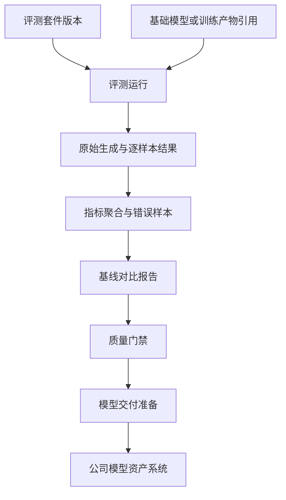

# 3.10 评测与质量门禁

训练`loss`下降只能说明优化目标发生变化，不能证明业务能力、安全性和通用能力达到交付要求。缺少统一评测和质量门禁时，不同团队容易使用不同数据、脚本和指标口径，候选模型也可能在缺少回归、安全或授权证据的情况下流入交付环节。完善本模块可以建立可比较、可追溯的质量证据，并把模型是否允许交付从主观判断转化为自动检查与人工决策相结合的受控流程。

训练平台负责离线评测作业编排、资源隔离、版本记录、结果追溯和交付前门禁，不负责替业务团队决定评测内容、指标阈值或最终质量结论；模型资产系统只消费训练平台提交的质量证据，并继续负责正式资产登记和生命周期。该边界既避免训练平台越权承担模型资产管理，也避免评测执行脱离训练产物和运行环境而失去可复现性。

## 3.10.1 评测集与指标目录

### 背景介绍

评测集和指标如果没有版本，当前痛点如下：

1. 训练`loss`不能代表业务、安全和通用能力。
2. 评测集被替换或指标方向不清，不同模型会失去可比性。

### 建设目标

登记不可变的标准基准、业务集、安全集、回归集和人工评测集，记录版本、用途、负责人和授权；指标目录声明计算方法、版本、方向、适用模型和结果单位。

|评测层级|主要内容|适用时机|
|---|---|---|
|冒烟集|格式、对话、工具调用和基础安全样本|开发验证、导出校验和`dry-run`|
|业务回归集|高频业务问题、历史失败样本和脱敏案例|每次`SFT`或重要配置变化|
|通用能力集|知识、推理、代码、事实性、长上下文和指令遵循|候选模型比较|
|安全集|越狱、提示注入、隐私、敏感内容和拒答一致性|进入审批前必跑|
|人工评测集|专家评分、成对偏好和错误分类|自动指标接近阈值或无法可靠判断时|

### 建议方案

评测套件引用数据版本和指标定义，发布后不可修改；列表使用批量授权投影。指标类型与状态使用固定命名类型管理，自定义指标以版本化评测器接入。

## 3.10.2 统一评测运行器

### 背景介绍

评测执行如果各走各的，当前痛点如下：

1. `EvalScope`、`lm-evaluation-harness`和内部脚本各自保存日志与指标，结果无法横向比较。
2. 采样参数变化会造成结果漂移，却说不清用了哪一套配置。

### 建设目标

统一记录模型、套件、提示词、随机种子、生成参数、镜像、并发、超时和重试；支持批量离线推理、失败样本重跑以及精确匹配、`F1`、代码通过率、偏好胜率、困惑度和自定义聚合，输出逐样本、聚合和错误协议。

### 建议方案

定义框架中立的评测输入输出协议，各评测器通过适配器运行在批任务中；原始大结果写对象存储或网络盘，业务库保存索引和摘要。评测模块不要求模型已部署为在线服务。

## 3.10.3 基线回归对比

### 背景介绍

没有固定基线时，当前痛点如下：

1. 微调可能提升目标任务，却损害通用或安全能力。
2. 没有逐项对比就会把退化模型交付出去。

### 建设目标

候选模型必须与指定基线逐指标、逐切片和逐样本比较，支持最低阈值、最大退化幅度、差异样本和业务确认记录。

### 建议方案

对比运行引用两组不可变评测结果，计算异步派生报告；不重复执行相同生成。门禁只消费标准对比投影，避免直接解析各评测器私有输出。

## 3.10.4 评测产物查询

### 背景介绍

评测结果如果只留下一个分数，当前痛点如下：

1. 无法复盘具体失败案例。
2. 模型交接、投诉处理和审计缺少证据。

### 建设目标

保存原始生成、逐样本得分、错误样本、聚合结果、评测配置、镜像和环境，支持按模型、运行、套件和样本`ID`查询。

### 建议方案

冷热数据分层存储，业务库保存可筛选索引，原始文本和大文件保存于受控存储；查询强制分页、字段投影和权限过滤，避免大结果一次性返回。

## 3.10.5 安全评测

### 背景介绍

业务微调后的安全能力容易被忽略。当前痛点如下：

1. 任务命中率可能上升，拒答、隐私保护和工具调用安全性却下降。
2. 没有专门的安全评测，这些问题要到上线后才被发现。

### 建设目标

覆盖越权、提示注入、敏感内容、隐私泄漏、幻觉、拒答一致性、越狱和工具调用风险，按风险等级配置阻断和人工复核要求。

### 建议方案

安全套件复用评测运行器并使用隔离队列，敏感原始结果默认脱敏和最小权限。风险类别与等级使用固定分类管理，阈值按项目版本化。

## 3.10.6 质量门禁与评测报告

### 背景介绍

评测过了不等于可以签字放行，当前痛点如下：

1. 人工浏览分散指标容易漏掉不可退化项。
2. 业务方缺少同时呈现效果、风险、成本和已知缺陷的决策材料。

### 建设目标

按任务和模型类型配置最低分、最大退化、必过安全项、成本或延迟上限和人工审批条件，自动生成基线对比报告并记录门禁版本与结论。

质量门禁应逐条展示输入证据、判定结果和后续动作：

|规则类型|输入证据|处理动作|
|---|---|---|
|最低质量要求|候选模型的业务与通用能力指标|低于阈值时阻断并展示差值和失败样本入口|
|最大退化幅度|候选与指定基线的逐指标、逐切片对比|超过允许退化时阻断，边界结果进入人工复核|
|必过安全项|安全套件结果、风险等级和样本级证据|任一必过项失败即阻断，不允许以总分抵消|
|成本与延迟上限|评测成本、推理延迟、显存和吞吐摘要|超过项目阈值时阻断或要求负责人确认|
|证据完整性|数据授权、交付说明、模型卡草稿、评测版本和产物完整性|缺少强制证据时保持待补充状态，不进入交付审批|
|人工审批条件|自动门禁结论、已知缺陷和业务风险|生成可签字报告，由有权限审批者放行或拒绝向模型资产系统提交|

### 建议方案

门禁引擎读取标准评测投影并输出可解释的逐规则结果，不嵌入评测器私有逻辑；规则发布后版本化，阈值由团队基于基线、样本量和业务风险维护，不使用平台写死的行业常数。工作流通过门禁结果引用决定后续步骤，人工审批仍保留最终责任。统一评测未启用时，交付流程可以登记项目指定的外部离线报告或人工质量结论，并明确标记证据来源；项目切换到平台门禁后，评测模块关闭或不可用时流程必须停住，不能跳过门禁继续放行。

## 3.10.7 模型裁判

### 背景介绍

开放式回答不好打分，当前痛点如下：

1. 缺少唯一标准答案，只能靠模型裁判或人工判断。
2. 裁判模型、提示词一变，分数也会变，不能成为不可审计的黑盒。

### 建设目标

记录裁判模型、提示词、温度、输出解析器、调用成本和逐样本理由，支持抽样人工复核、改判和一致性统计。

### 建议方案

模型裁判作为一种评测器适配器，结果协议与其它评测一致；高风险门禁要求人工或确定性指标共同确认。裁判调用使用专用凭据和预算限制。

## 3.10.8 评测污染检查

### 背景介绍

训练数据包含测试题、历史答案或公开基准解答会造成虚高分，上线后表现落差又难以解释。

### 建设目标

登记评测集来源和发布时间，按样本`ID`、精确内容和近似相似度检查训练集、历史评测集与公开语料重叠，并标记风险和处理决定。

### 建议方案

复用数据质量的去重与相似检索能力，评测模块只提交版本引用和阈值；大规模比对异步执行并保存命中清单摘要，不在提交请求内同步完成。

## 3.10.9 评测执行隔离

### 背景介绍

自定义评测脚本如果不隔离，当前痛点如下：

1. 可能读取训练数据或访问凭据。
2. 可能外联上传结果。
3. 可能占满集群资源。

### 建设目标

自定义评测脚本在隔离任务中运行，限制网络、文件系统、凭据、资源和运行时长，结果、日志和镜像摘要仍归属评测运行。

### 建议方案

使用独立服务账号、只读输入、受限输出目录、网络策略、资源配额和超时；镜像进入评测队列前执行来源与安全检查。隔离策略由平台运行层统一实现，不交给评测脚本自声明。

## 3.10.10 评测统计可信度

### 背景介绍

小规模业务集的偶然波动可能被误判为显著提升，单次均值不足以支撑发布或回滚。

### 建设目标

报告样本量、分层统计、置信区间或重复运行区间，标记低样本、随机性过高和不可比较的结果。

### 建议方案

指标定义声明统计方法和最小样本要求，聚合任务输出统计摘要；前端只解释已计算结果，不自行选择统计公式。

## 3.10.11 评测缓存与失败重跑

### 背景介绍

评测重跑和缓存如果做粗了，当前痛点如下：

1. 调整门禁或修复少量失败样本时，重复完整生成成本很高。
2. 按路径命名的粗粒度缓存容易复用错误结果。

### 建设目标

缓存键绑定模型内容哈希、评测套件、提示词、采样参数、数据版本、评测器和镜像；允许只重跑失败或指定样本并重新聚合。

### 建议方案

缓存作为评测模块内部能力，对外仍返回新的运行记录和来源说明；命中校验使用结构化摘要，缓存对象不可被新运行覆盖。并发相同请求通过幂等锁合并。
