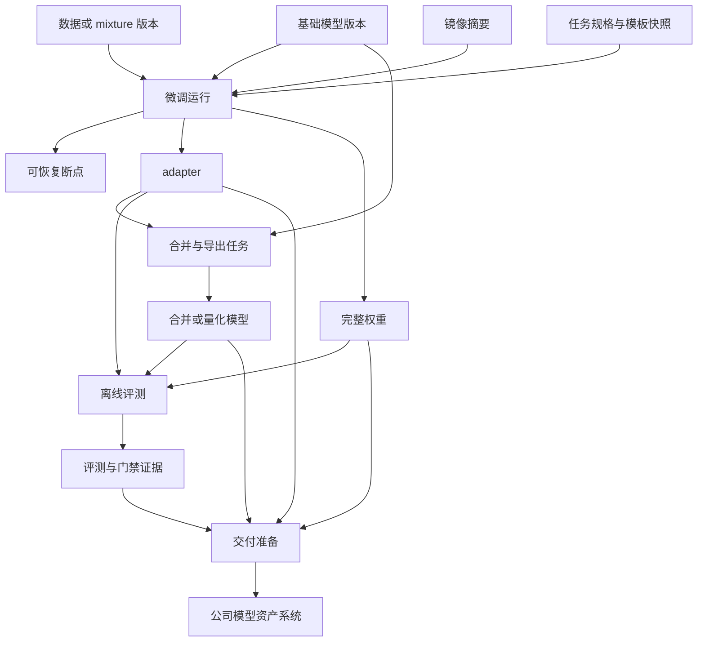

# 3.11 监督微调与后训练

本模块描述监督微调及其它后训练能力启用时所需的任务、数据、产物和评测约束；模块未启用时不影响预训练与模型交付链路。

当业务需要让预训练模型遵循业务指令、适配特定任务并形成可交付行为时，直接把全量`SFT`、`LoRA`或`QLoRA`当作普通预训练任务提交，会遗漏消息模板、监督范围、基础模型兼容性、差异化产物和训练后评测等关键约束。平台需要提供类型化、可复现的监督微调任务，并为偏好优化、多模态和工具调用等后训练方向保留受控扩展点。

## 3.11.1 任务类型与基础模型约束

### 背景介绍

全量`SFT`、`LoRA`、`QLoRA`和偏好优化的输入、资源、产物与评测要求不同，作为普通预训练命令提交会漏掉关键约束。

### 建设目标

任务类型显式区分训练方法，按类型展示必填参数和产物；基础模型只能选择已登记且有权限的版本，并校验架构、权重格式、分词器、上下文长度、量化状态和父模型关系。

### 建议方案

在统一任务规格上增加类型化扩展字段，由框架适配器处理具体参数；基础模型兼容性通过模型模块的批量投影契约校验。后训练模块禁用时隐藏专用任务类型，通用预训练不受影响。

建议的任务规格至少明确以下内容，避免关键约束只藏在启动命令中：

```yaml
kind: SFTJob
base_model:
  ref: model://team/base-model/1.2.0
data:
  train: dataset://team/support-sft/1.0.0
  validation: dataset://team/support-eval/1.0.0
  chat_template: tokenizer-default
  max_seq_length: 8192
  packing: true
  loss_mask: assistant_only
strategy:
  method: lora
  lora:
    rank: 16
    alpha: 32
    dropout: 0.05
runtime:
  image_version: image://team/sft-runtime/1.0.0
  nodes: 1
  gpus_per_node: 8
  precision: bf16
output:
  adapter_dir: /data/hpc/home/<user>/outputs/<job_id>/adapter
  checkpoint_dir: /data/hpc/home/<user>/outputs/<job_id>/checkpoints
evaluation:
  suites: [business-regression, safety-basic]
```

|训练方式|适用场景|平台重点校验|主要产物|
|---|---|---|---|
|全量`SFT`|数据量较大、模型专用、需要改变全部权重|优化器状态、精度、并行、显存和存储预算|完整权重和可恢复断点|
|`LoRA`|快速试验、多业务适配、保留基础模型|目标模块、`rank`、`alpha`、`dropout`和父模型|基础模型引用与`adapter`|
|`QLoRA`|显存受限或需要提高试验并发|量化位数、计算精度、优化器、硬件和框架兼容|量化训练`adapter`与合并前校验|

启用本模块前，需要明确业务场景、训练方法、数据来源、资源预算和质量责任。平台不保证相同配置产生逐位一致的权重，但必须记录镜像、数据、种子、资源和全部有效参数，并解释可见差异的来源。

## 3.11.2 数据协议与监督范围

### 背景介绍

微调数据如果格式和监督范围不对，通常不会立刻报错，却会把模型教坏。当前痛点如下：

1. 对话格式、角色顺序或模板错误，角色边界被错误渲染。
2. 数据划分不稳定，训练和评测发生泄漏。
3. 损失范围或截断策略错误，关键答案没进训练，或评测虚高。

### 建设目标

支持`OpenAI messages`、`ShareGPT`和`instruction/input/output`等输入，转换为统一的`role`、`content`和工具调用协议；校验字段、角色、模板、空消息和非法字符。划分使用稳定哈希和固定种子，检查重复与泄漏，并显式配置`loss mask`、最大长度、`padding`、`packing`和长度分桶。

不同来源协议必须先转换和验证，再形成可训练版本：

|来源协议|转换重点|必须阻断的问题|
|---|---|---|
|`OpenAI messages`|保留`system`、`user`、`assistant`、工具定义和调用结果|未知角色、调用与结果不配对、消息为空或顺序非法|
|`ShareGPT`|将来源角色映射为统一`role`并规范多轮顺序|角色映射缺失、连续同角色或轮次结构损坏|
|`instruction/input/output`|组合指令与可选输入，明确监督目标|输出缺失、字段语义冲突或模板无法渲染|
|统一训练样本|应用`chat_template`、`loss mask`、截断、`padding`和`packing`|有效监督为空、关键答案被截断或训练评测泄漏|

### 建议方案

数据适配与模板渲染作为版本化离线处理器，输出样本清单、有效与跳过数量、长度分位数、截断比例和抽样结果。统一消息协议负责把`OpenAI messages`、`ShareGPT`和指令样本转换为稳定的角色与工具调用结构，训练任务只消费已验证的数据版本和模板引用，避免每个训练框架各自解释原始格式。

## 3.11.3 微调策略与资源估算

### 背景介绍

`LoRA`目标模块、量化、精度、优化器、梯度检查点和分布式策略高度依赖模型与硬件，错误组合往往在排到多机资源后才失败。

### 建设目标

配置并校验`rank`、`alpha`、`dropout`、目标模块、`bf16/fp16`、`8bit/4bit`、`FSDP`或`DeepSpeed`策略，提供单卡、单机多卡和多机模板。提交前根据样本、序列长度和策略估算显存、时长、存储和有效全局批次，并支持小样本`dry-run`。

资源估算需要组合模型、数据、策略和硬件信息：

|输入维度|参与校验或估算的内容|输出结果|
|---|---|---|
|模型与序列|参数量、层数、上下文长度和词表|权重、激活值和注意力显存估算|
|微调方式|全量、`LoRA`、`QLoRA`、目标模块和量化位数|可训练参数量、优化器显存和兼容性结论|
|批次与并行|微批次、梯度累积、张量、流水线、数据和上下文并行|有效全局批次、总卡数和通信约束|
|运行策略|精度、优化器、梯度检查点、`FSDP`或`DeepSpeed`|峰值显存、训练时长和框架配置风险|
|硬件与数据|机型、卡数、带宽、样本量和有效`token`|资源规格、预计时长、存储量及`dry-run`建议|

### 建议方案

兼容矩阵由模板版本和镜像元数据共同提供，估算模型先采用规则与历史校准数据，不承诺绝对精度；实际运行结果回写用于校准。框架适配器把任务规格转换为`ms-swift`、`Transformers`、`PEFT`、`DeepSpeed`或`FSDP`参数，专有参数保留在版本化模板和`YAML`扩展中，不在平台控制面为每个新参数建设独立页面；通用资源校验复用任务服务。

## 3.11.4 微调断点恢复

### 背景介绍

微调中断后只恢复权重会丢失优化器、学习率、随机状态和数据位置，导致重复样本、指标跳变和结果不可比较。

### 建设目标

全量权重和`adapter`断点都保存优化器、调度器、随机状态、数据游标、基础模型和`chat_template`配置；恢复前校验父模型和策略一致性。

### 建议方案

复用通用断点对象和恢复状态机，后训练适配器补充`adapter`与模板元数据校验。断点清单以框架中立字段表达，框架专有文件由适配器负责生成与加载。

## 3.11.5 微调产物分类与血缘

### 背景介绍

微调产物如果混放，当前痛点如下：

1. 下游无法判断该加载基础模型、`adapter`、合并模型还是断点。
2. 无法追踪哪个产物真正改善了业务指标。

### 建设目标

任务产物明确区分基础模型引用、`adapter`、合并模型、断点、配置快照和评测报告，并记录数据版本、镜像摘要、父模型和生成任务。

微调输入、运行产物和模型资产系统交付之间的关系如下：



### 建议方案

训练完成后生成产物`manifest`，模型交付模块只消费通过完整性检查的产物引用。产物类型使用固定命名类型维护，交付模块通过稳定契约读取投影，不扫描训练目录猜测类型；公司模型资产系统接收后再完成正式资产登记。

## 3.11.6 训练后自动评测

### 背景介绍

只看训练曲线不够判断微调是否成功，当前痛点如下：

1. 训练`loss`下降不代表回答质量提升。
2. 微调还可能造成通用能力或安全能力回归。

### 建设目标

任务完成后自动触发基础模型与微调模型的离线能力、安全和业务回归评测；失败时保留训练产物、日志和错误样本，但不得进入模型资产系统交付流程。

### 建议方案

任务完成事件触发评测运行，评测模块通过模型产物引用读取权重，不访问训练模块内部对象。自动评测可配置为可选模块；当项目要求门禁但评测模块不可用时拒绝发布，而不是静默放行。

## 3.11.7 模型合并与导出校验

### 背景介绍

`adapter`、基础模型、分词器或量化配置不匹配，常到交付和部署阶段才暴露。

### 建设目标

支持`adapter`合并、全量或量化权重导出，校验格式、父模型和分词器，并执行至少一条对话的分词、加载和生成冒烟测试；失败产物可保留但不得进入标准交付目录。

### 建议方案

合并和导出运行在隔离批任务中，使用目标框架镜像并输出新不可变产物，不原地修改训练结果。校验结果作为模型交付的前置证据。

## 3.11.8 模型卡草稿

### 背景介绍

微调模型只有权重和聊天记录时，业务方无法判断适用范围、已知限制、授权和评测风险。

### 建设目标

依据基础模型、数据、参数、`adapter`或合并方式、评测结果和责任人自动生成模型卡草稿，允许负责人补充用途、限制和失败案例，并作为交付元数据提交给公司模型资产系统。

### 建议方案

模型卡草稿从训练侧血缘批量投影读取摘要，人工内容与自动字段分区保存；正式模型卡的定稿、版本和生命周期由公司模型资产系统维护，训练平台不保留另一套资产主数据。

## 3.11.9 早停与最佳断点

### 背景介绍

按固定步数收工并不稳妥，当前痛点如下：

1. 固定步数可能训练不足，也可能过拟合。
2. 最后保存的断点不一定是验证集表现最好的版本。

### 建设目标

支持最大全局`iter`、最大`epoch`、验证指标早停和最小改善幅度，分别标记最新可恢复断点与验证最佳断点，并记录停止原因。

### 建议方案

早停决策在训练适配器内执行，平台负责配置校验、指标展示和断点角色登记；不要让控制面按高延迟指标远程控制每一步训练。

## 3.11.10 回放集与遗忘控制

### 背景介绍

领域数据占比过高可能提高目标任务分数，却损害通用指令和安全拒答能力。

### 建设目标

允许将通用指令回放集、安全集和领域数据组成版本化`mixture`，展示各类有效`token`权重，并在评测报告中比较微调前后遗忘指标。

### 建议方案

复用数据混合对象和基线回归能力，不在后训练模块重复维护数据配比和评测逻辑；后训练任务只声明目标`mixture`和必须运行的回归套件。

## 3.11.11 切片分析

### 背景介绍

总体均分会掩盖长上下文、少数语言、特定业务标签和高风险样本的退化。

### 建设目标

按长度、业务标签、语言、难度和能力标签分桶查看训练与评测结果，支持基线对比和错误样本导出。

### 建议方案

切片标签随数据或评测样本版本保存，评测运行异步生成分桶聚合；查询按预聚合维度和分页样本读取，禁止前端拉取全量结果自行计算。

## 3.11.12 多模态与工具调用扩展

### 背景介绍

业务逐步增加图文、音频和工具调用，若文本协议没有稳定扩展点，后续改造会破坏已有任务和数据版本。

### 建设目标

预留媒体引用、尺寸与格式校验、模态`token`统计、工具定义与调用结果以及多模态批处理接口；如后续启动建设，先以扩展点和试验模板交付。

### 建议方案

统一消息协议使用类型化内容块，媒体只保存受控引用和清单，不把大文件嵌入业务库；各模态处理器通过版本化适配器接入。模块未启用时拒绝相应任务类型并隐藏字段，文本任务保持不变。
