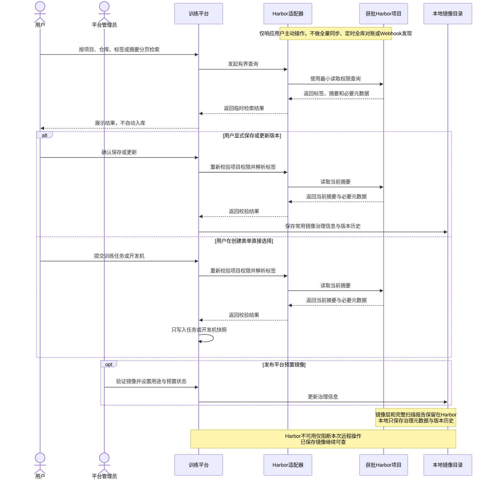
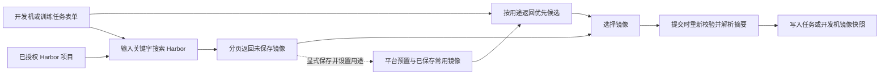

# 3.2 镜像管理

镜像决定训练框架、系统依赖、`CUDA`环境和启动入口，是训练可运行、可复现和供应链安全的基础。依赖用户手工填写地址或直接使用可漂移标签，会造成版本难追溯、软硬件兼容性不明确和重复排查。完善镜像管理后，平台才能向训练任务和开发机提供经过验证、按用途分类且固化摘要的运行环境，并在保留用户选择灵活性的同时建立统一的版本与权限边界。

训练代码继续由团队现有`Git`和镜像构建发布流程管理。训练平台只检索已经推送到获批`Harbor`项目的镜像并记录实际摘要、启动入口和配置版本，不建设源码仓库、代码快照系统或镜像构建流水线。

## 3.2.1 `Harbor`检索与常用镜像管理

### 背景介绍

当前平台尚未对接任何`Harbor`仓库，也没有镜像管理页面。用户需要手工输入完整镜像地址，容易出现地址拼写错误、标签漂移和重复查找。平台无法统一维护镜像的来源、版本、兼容信息、适用场景和责任人，用户也不能沉淀常用镜像。管理员同样缺少发布经过验证的平台预置镜像的入口，无法为算法人员提供开箱可用的训练和开发环境。

### 建设目标

镜像管理页面、训练任务和开发机的镜像选择器，都支持在已配置且获批的`Harbor`实例和项目范围内，按项目、仓库、标签或摘要分页检索镜像。检索结果只用于当前查询，不自动写入平台镜像列表；用户可以在开发机或训练任务表单中直接选择未保存的远程镜像，也可以显式保存为常用镜像。保存时至少记录显示名称、完整标签引用、不可变摘要、所属`Harbor`项目、推送时间、镜像大小、架构、扫描摘要、维护人、框架、`CUDA`与驱动兼容信息，并通过“可用于训练任务”和“可用于开发机”两个独立开关声明用途，至少启用一个开关，同一镜像允许同时适用于两种场景。

平台管理员通过相同的检索和保存流程，将经过验证的镜像标记为平台预置镜像，并分别开启训练任务或开发机用途。平台预置镜像在授权范围内对算法人员可见，普通用户可以直接选择，但不能修改其来源、摘要、用途和启用状态。非预置镜像按照项目权限控制查看、使用、编辑和移除。已保存标签在`Harbor`中指向新摘要时，平台保留原摘要及历史引用，只有用户显式执行“更新镜像版本”并确认差异后才生成新的镜像版本，不能静默覆盖。

常用镜像的核心治理信息与约束如下：

|治理信息|维护方式|使用约束|
|---|---|---|
|来源与版本|保存或提交未保存镜像时，从`Harbor`重新解析仓库、标签、摘要和推送时间|标签用于识别，摘要作为不可变运行版本；未保存镜像只写入任务或工作空间快照，禁止静默跟随标签漂移|
|用途分类|独立维护“可用于训练任务”和“可用于开发机”开关|至少开启一个用途；训练与开发入口分别按用途过滤|
|平台预置|管理员将已验证的常用镜像发布为预置镜像|普通用户可选择但不能修改来源、摘要、用途和启用状态|
|兼容信息|维护框架、架构、`CUDA`、驱动、机型和扫描摘要|提交或创建开发机时重新校验，未知信息不得依据名称推断|
|生命周期|支持启用、停用、更新版本和移除|更新生成新版本；停用或软删除不得破坏历史引用|

### 建议方案

`Harbor`适配器只在用户主动检索、查看选中镜像详情、保存或更新版本，以及提交未保存镜像时调用`Harbor API v2`，不执行首次全量同步、定时全库对账或`Webhook`增量发现。检索采用分层且有边界的查询：先选择注册表和授权项目，再分页搜索仓库，最后按选中的仓库分页读取制品和标签，禁止遍历所有项目后逐仓库查询。检索接口使用`GET`和查询参数表达用途、项目、关键词及分页条件，单页最多返回`50`条；直接选择远程镜像不产生写操作，后续由开发机或训练任务的`POST`创建请求固化镜像引用。保存常用镜像使用`POST`，修改名称、用途开关、预置状态和兼容信息使用`PUT`，移除使用`DELETE`并采用软删除保留历史引用。时间点字段统一返回`Unix`毫秒时间戳。

保存操作和使用未保存镜像的创建请求，都必须在同一服务端请求中重新解析标签摘要并校验项目权限，避免使用过期的前端检索结果。镜像目录只持久化用户明确保存的镜像和必要治理元数据；未保存镜像只在任务或开发机快照中保存来源、用户看到的标签、实际摘要和解析时间，不自动生成常用镜像记录。平台不保存完整漏洞报告，也不复制镜像层；完整扫描报告继续留在`Harbor`。镜像记录以来源、仓库和摘要形成稳定版本标识，以“可用于训练任务”“可用于开发机”和“平台预置”布尔字段表达使用范围。单实例按最多`10,000`条已保存镜像设计，本地列表按权限、用途、预置状态、启用状态和更新时间建立匹配实际查询路径的索引，并使用不同数据规模下的`EXPLAIN ANALYZE`验证筛选、排序和分页。镜像被移除后保留软删除记录，不破坏历史任务、开发机和模型血缘。

`Harbor`访问使用具备所需最小读取权限的机器人账号，凭据只保存在`Secret`或密钥服务中，不进入接口响应、任务快照和日志。远程检索设置超时、限流和短期缓存，失败时只影响本次搜索，不清空或隐藏已经保存的常用镜像；读取扫描摘要、架构或兼容信息失败时明确显示未知，不根据镜像名称推断。

`Harbor`按需检索与平台本地治理的边界如下：

## 3.2.2 分类检索选择与版本固化

### 背景介绍

当前训练任务使用无约束的镜像地址输入框，没有已保存的镜像列表，也无法按训练与开发用途分类；规划中的开发机如果沿用同样方式，也会复制这些问题。用户只能从历史任务、文档或他人配置中复制地址，既可能把只包含训练入口的镜像用于交互式开发，也可能把带有开发工具但未经正式训练验证的镜像用于大规模任务。因此，建设镜像管理后，两个入口需要分别消费镜像用途开关，并同时提供平台预置镜像和项目常用镜像。

### 建设目标

训练任务的创建、编辑和再次提交页面，以及开发机页面，都使用分组镜像选择器。默认优先展示当前用户有权使用的平台预置镜像和已保存常用镜像，并按入口过滤“可用于训练任务”或“可用于开发机”用途。选择器同时提供“在`Harbor`中搜索”入口；用户输入关键字后，可在已授权的`Harbor`项目范围内分页检索并直接选择未保存镜像，无需离开当前表单或先保存到镜像列表。本地候选和远程检索结果均明确展示来源、仓库、标签、摘要缩写、推送时间、框架、`CUDA`及兼容性提示；本地候选额外展示平台预置或常用标识和维护人，未保存的远程镜像则明确标记“未纳管、用途未验证”，不得与平台预置或常用镜像混淆。平台可以设置推荐顺序，但不应在用户无感知的情况下替换其已选镜像。

用户提交训练任务或创建开发机时，已保存镜像根据平台本地治理信息重新校验项目权限、用途开关、启用状态、扫描策略和目标机型兼容性，并复用已固化摘要；该路径不依赖同步访问`Harbor`。对直接从`Harbor`选择的未保存镜像，创建请求必须实时重新校验`Harbor`项目权限、解析标签当前摘要，并检查扫描策略和目标机型兼容性。平台根据当前入口将本次使用记录为训练或开发场景，但不自动创建常用镜像或永久用途标记。两种来源都在创建请求中保存用户看到的标签引用、实际摘要和解析时间，并优先以`repository@sha256:...`形式交给运行时。再次提交、任务模板和从开发机转训练任务默认复用已固化摘要；开发机使用的已保存镜像未开启训练用途时，不能直接转为训练任务，必须先选择合规的训练镜像或由有权限人员补充用途并重新校验。

### 建议方案

镜像模块拥有已保存镜像、用途开关、预置状态、权限范围和版本历史，并向训练任务与开发机模块提供“本地优先候选”和“远程`Harbor`检索”两条明确的只读投影契约。本地训练候选固定过滤“可用于训练任务”，本地开发机候选固定过滤“可用于开发机”，再叠加项目权限、启用状态、扫描策略、架构、`CUDA`、驱动和目标机型条件；平台预置与普通常用镜像在同一有界查询中返回，不要求前端发起两次请求或逐项补查详情。远程契约复用同一`Harbor`适配器和最小候选投影，不将`Harbor`内部结构泄漏给训练或开发机模块。

两类查询都使用`GET`并支持关键词、分页和稳定排序，单页最多返回`50`条。打开表单时只查询一次本地优先候选，不自动访问`Harbor`；用户显式输入关键字并发起远程搜索时，每页只触发一次平台检索请求，后端访问次数有界且不随返回行数增加。同一来源、仓库和摘要同时出现在本地与远程结果时，合并为本地优先项，不展示重复记录。训练任务与开发机通过构造时注入的公开契约消费最小投影，不访问镜像模块内部表。`Harbor`短时不可用时，已加载的平台预置和常用镜像仍可选，只禁用远程搜索和未保存镜像的新建提交；镜像管理模块禁用时，前端完全隐藏镜像管理菜单、平台预置标识和分组选择器，并回退到现有手工镜像输入能力。后端保留已保存镜像、用途、版本和历史引用，模块重新启用后恢复原有候选列表。

按需检索、保存和分类使用的链路如下：

