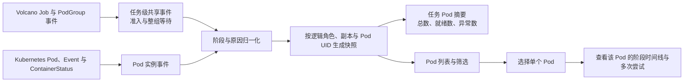
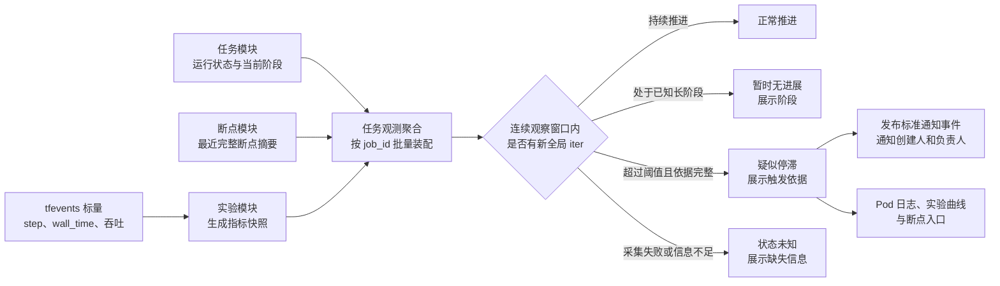

# 3.3 任务提交与观测

训练任务通常排队时间长、资源成本高，配置错误如果在占用`GPU`后才暴露，会产生明显浪费；任务启动后仅显示“排队中”或“运行中”，也无法判断具体调度阻塞、训练是否推进以及故障发生位置。完善提交与观测能力，可以把错误尽量拦截在资源分配前，并将调度、进展、事件和日志串成可解释的运行链路，从而降低无效提交、等待沟通和故障恢复时间。

## 3.3.1 提交前校验与预览

### 背景介绍

训练任务提交前需要同时填写数据路径、输出目录、断点、镜像、并行方式和资源等多项配置。这些配置彼此关联，仅凭表单内容很难判断任务最终会在哪个集群读取什么数据、以什么权限运行，以及是否会覆盖已有结果。当前平台缺少统一、可解释的提交前检查和最终配置预览，主要痛点如下：

1. 路径、目录权限、镜像兼容性或并行参数填错时，问题通常要等任务进入队列并占用`GPU`资源后才暴露。用户只能再查看日志、修改配置并重新提交，既浪费排查时间，也挤占其他任务的资源。
2. 训练数据必须由有权限的人员预先拷贝到网络盘，平台只负责登记、校验和引用，不负责从外部数据源下载或跨集群搬运。如果这个边界提示不清，用户容易误以为换一个队列就能解决“数据不存在”，从而反复尝试仍然无法启动。
3. 页面没有清楚展示默认值和解析后的实际配置，用户难以确认输入、输出、断点、模型和镜像摘要等最终引用的内容；即使提交成功，也不容易复核任务是否按预期运行，后续复现和定位问题更加困难。
4. 现在的反馈偏向“提交失败”，没有区分必须修正的阻断问题和用户知情后可以继续的风险警告，也没有针对具体原因给出解决建议。用户知道任务不能提交，却仍要自己翻文档、查日志或咨询运维才能找到处理办法。

因此，需要在真正排队和分配资源前完成关键配置校验，并提供一份用户看得懂的最终配置预览：不仅明确哪些问题会阻止提交、哪些问题只是风险提示，还要解释问题原因并给出具体、可执行的解决建议，同时把数据需要先落盘的前置条件说清楚，减少无效提交、资源浪费和反复试错。

### 建设目标

提交前逐项检查路径范围、目标集群目录存在性、读写权限、非空状态、输出占用、镜像权限与兼容状态和并行整除关系。每个未通过或存在风险的检查项都要展示问题原因、影响范围和解决建议；能够直接处理时，提供返回对应字段、重新探测、选择可用资源或查看申请指引等操作入口。预览页面展示解析后的输入、输出、断点、模型、镜像摘要与配置引用，并明确提示需要先将数据拷到网络盘。平台不得在用户无感知的情况下自动修改任务配置，建议值必须由用户确认后才能应用。

提交前的主要校验类型、结果等级、处理方式和解决建议如下：

|校验类型|关键检查|结果处理|解决建议|
|:---:|---|---|---|
|**路径与存储**|路径范围、目录存在性、输入非空、目标集群可见性|输入缺失或路径非法时阻断；探测超时显示检查失败，不视为通过|指出失败路径和目标集群，提示改用已登记路径或先将数据拷贝到网络盘；探测超时时提供重新探测入口|
|**权限与数据**|项目授权、读写权限、数据版本状态和用途限制|无权限、数据未落盘或版本被禁用时阻断|说明缺少的权限或数据状态，提供权限申请指引，并建议选择已授权、已落盘且可用的数据版本|
|**镜像与运行环境**|镜像权限、用途开关、不可变摘要、驱动、`CUDA`和机型|不兼容或镜像不可用时阻断；兼容信息未知时给出风险警告|说明具体不兼容项，推荐当前项目有权使用且与目标机型兼容的镜像，或提示联系镜像维护人补充兼容信息|
|**资源与并行**|队列额度、总卡数、并行乘积、全局批次和显存风险|确定性冲突时阻断；估算偏高或数据不足时警告|给出可满足整除关系的卡数、并行度或批次调整示例；额度不足时提示缩小规模或选择其他已授权队列|
|**输出与配置**|输出目录占用、断点策略、配置引用和最终默认值|覆盖风险和非法引用时阻断；预览完整解析快照|指出冲突目录或失效引用，建议更换运行级输出目录、重新选择有效配置，或确认符合条件的断点与覆盖策略|

### 建议方案

采用服务端校验流水线返回结构化检查项，每项至少包含结果等级、问题原因、影响字段、解决建议和可选操作；建议内容应结合实际失败路径、权限、镜像、队列和参数生成，不能只显示“请检查配置”等笼统提示。耗时的目标集群探测设置超时和短期缓存；同一校验结果及解决建议供页面和命令行使用。阻断项与警告项使用稳定错误码，页面可据此定位到对应字段，并提供重新探测、选择候选资源或打开申请指引等操作，避免从启动命令字符串猜测结构化字段。

## 3.3.2 调度过程可视化

### 背景介绍

一个分布式训练任务通常包含多个不同角色和副本的`Pod`。同一任务中可能部分`Pod`已经完成调度，部分仍在等待资源，还有个别`Pod`卡在镜像拉取或容器启动。任务级“排队中”和“启动中”既无法区分配额不足、资源碎片、拓扑不匹配、整组资源未凑齐或镜像拉取失败，也无法定位具体受阻的`Pod`，因此调度过程必须以`Pod`为核心展示维度。

### 建设目标

1. 在任务详情中按`Pod`列出角色、副本序号、`Pod`名称、当前阶段、所在节点、申请资源、等待时长、首要阻塞原因、最近事件时间和建议动作，支持按角色、阶段、节点和异常状态筛选，并将异常或等待时间最长的`Pod`置前。
2. 选择单个`Pod`后，展示该`Pod`从创建、资源匹配、调度、镜像拉取到容器启动的独立时间线；`Pod`被重建时按逻辑角色与副本串联多次尝试，同时保留每次尝试的`Pod UID`，不得把新旧实例事件混为一条记录。
3. 提交、队列准入和整组等待属于任务或`PodGroup`级共享阶段。页面在任务顶部展示共享事件，并在受影响`Pod`的时间线中标记为“共享事件”，不能伪装成某个`Pod`自身故障。
4. 任务列表只展示`Pod`总数、已就绪数、异常数和当前最主要阻塞阶段等聚合摘要；详细调度过程仍以`Pod`维度展开。动态调度不承诺精确名次或启动时间，也不暴露其它用户身份。

单个`Pod`的调度时间线需要将底层事件归一为用户可理解的阶段：

|单个`Pod`的展示阶段|典型等待或失败原因|页面建议动作|
|:---:|---|---|
|**准入与整组等待（共享事件）**|项目预算或队列配额不足，多节点任务尚未凑齐全部资源|查看任务或`PodGroup`共享原因，调整规模或切换已授权队列|
|**资源匹配**|机型、显存、拓扑、亲和性或资源碎片不满足|查看缺口，调整机型、卡数或调度约束|
|**`Pod`调度**|节点不可用、污点、亲和性、挂载或运行策略冲突|查看该`Pod`的候选节点与归一化事件并联系平台运维|
|**镜像拉取**|镜像不存在、无权限、节点网络或缓存异常|检查已固化摘要和权限，必要时更换镜像|
|**容器启动**|入口命令、挂载、环境变量或健康检查失败|进入对应进程日志和配置快照定位|
|**已就绪**|容器已经通过启动检查，等待其它`Pod`或训练进程建立通信|查看整组就绪比例；单个`Pod`无异常时无需重复处理|

`Pod`维度调度视图的数据装配关系如下：

### 建议方案

采集`Volcano Job`、`PodGroup`以及`Kubernetes Pod`、`Event`、`ContainerStatus`事件，将任务级共享事件和实例级事件归一化为固定调度阶段。使用平台任务标识（`job_id`）、逻辑角色、副本序号、`Pod UID`和尝试次数建立关联，异步写入每个`Pod`的最新状态快照及事件流；共享事件保留来源和影响范围，再批量关联到受影响的`Pod`。任务列表只读取预聚合摘要，任务详情分页读取`Pod`快照，用户展开某个`Pod`时再分页读取其事件，禁止页面按`Pod`逐个实时查询集群或逐项调用详情接口。模块关闭时隐藏调度详情入口但保留历史快照，采集暂时失败时展示最后更新时间和未知状态，不把缺失事件解释为调度成功。

## 3.3.3 训练进展与停滞提示

### 背景介绍

大规模分布式训练中确实存在任务和训练进程仍显示运行中，但全局训练步不再推进的场景。例如某个`rank`进入集合通信后无法返回、慢`rank`拖住其它进程，或者数据加载与共享存储读取长时间阻塞。此时只看任务状态无法发现问题，`GPU`利用率也只能说明采样周期内是否执行过内核，不能证明优化器已经完成新一轮更新。问题若在数小时后才被人工发现，会持续占用整组`GPU`并扩大断点后的进度损失。

没有新训练步也不等于任务已经卡住。首次编译、通信初始化、评测、保存或加载大断点以及超长序列批次都可能形成合理的长间隔；梯度`NaN/Inf`则可能在`iter`继续增加时发生，属于数值稳定性问题。因此本能力不建设笼统的训练健康分，也不把单一指标超时直接解释为故障，而是聚焦“训练进展信号是否持续未更新”并明确展示判断依据。

典型场景、可见信号和基础解释如下：

|业务场景|可能观察到的信号|平台解释|
|:---:|---|---|
|**集合通信挂起或某个`rank`失联**|`Pod`和进程仍运行，全局`iter`与吞吐停止更新|满足连续观察窗口后提示疑似停滞，并引导查看`Pod`、通信与进程日志|
|**数据加载或共享存储阻塞**|全局`iter`停止更新，吞吐消失，`GPU`利用率可能下降|提示疑似数据或存储等待，不把低`GPU`利用率单独作为结论|
|**慢`rank`或性能下降**|全局`iter`仍推进，但步间隔变长或吞吐持续下降|标记进展变慢，不标记为停滞|
|**编译、初始化、评测或断点读写**|当前阶段已知，阶段内暂时没有新训练步|展示当前阶段并抑制停滞提示；阶段超出自身超时后再提示检查|
|**梯度`NaN/Inf`或损失异常**|全局`iter`可能继续推进，`Loss`出现非有限值或异常波动|作为独立的数值稳定性能力，不并入停滞判断|

### 建设目标

1. 在任务详情展示最后全局`iter`、计划总步数、最后一步实际发生时间、最近吞吐、指标采集时间、当前任务阶段和最近完整断点时间，并明确区分“训练信号没有更新”和“平台采集失败”。
2. 结合用户配置的最小超时、任务近期步间隔基线和当前阶段，在连续多个观察窗口没有新`iter`后标记“疑似停滞”；同时展示持续时长、阈值、最后一步、当前阶段和缺失信号，避免只给出不可解释的结论。
3. 进展状态只作为观测提示，不修改任务运行状态，不自动停止、重试或恢复任务。用户可以从提示直接进入对应`Pod`日志、实验曲线和最近断点，完成进一步确认；达到“疑似停滞”条件时，任务观测能力向通知服务发布标准任务事件，由通知服务按照任务运行事件通知中定义的接收人和通道规则发送消息，不直接调用外部消息接口。
4. 停滞判断不把算力利用率、通信性能、有效`token`和梯度异常作为交付前提。这些指标在监控系统或训练框架形成稳定数据契约后，可作为诊断上下文或独立能力接入，不能缺失时按`0`处理。
5. 试点期间记录疑似停滞提示次数、用户确认结果、误报场景、平均发现时长、人工排障次数和估算浪费的`GPU`时长，用真实数据决定是否扩大范围或调整阈值。

### 前置依赖与建设顺序

当前平台尚未建设实验分析模块，也没有可直接复用的`Run`、指标快照或平台`TensorBoard`入口，因此训练进展与停滞提示不能在没有数据基础的情况下单独开工。它仍然不需要等待整个实验分析模块完成，但必须先从零交付与任务关联和指标快照直接相关的最小后端能力；实验项目的完整管理功能和页面、导航、完整曲线按需打开、实验对比和`SwanLab Local`适配可以并行建设或后置交付。

|相关能力|最小交付范围|对训练进展与停滞提示的影响|
|---|---|---|
|最小任务与`Run`关联|任务提交后按`job_id`幂等建立`Run`，记录工作集群、`tfevents`目录和必要的可见性信息；数据模型要求项目归属时先关联系统默认项目|必须前置；没有稳定关联就无法确认应读取哪个任务的训练信号|
|最小指标快照|后台解析受控`tfevents tag`，保存全局步、最后一步实际发生时间、指标采集时间、吞吐和采集错误，并提供按`job_id`批量读取的只读契约|必须前置；完成该切片即可支持进展展示和停滞规则，不必等待实验列表排序页面|
|训练模板与任务阶段|模板明确全局优化器步对应的`tag`，任务模块提供训练、评测、断点、恢复和未知等可靠阶段|必须前置；语义未确认或阶段依据不足时只能显示未知，不能生成疑似停滞结论|
|最近完整断点摘要|断点模块按任务返回最近完整断点时间和状态|不是停滞判断的阻断依赖；暂不可用时隐藏断点字段并继续判断其它信号|
|实验项目管理、导航、看板、对比和`SwanLab Local`|完整的实验项目管理、双向导航、按需看板、实验对比和`SwanLab Local`适配页面，不包括最小`Run`关联所需的系统默认项目记录|不作为前置条件；缺失时只影响实验管理和进一步分析入口|
|任务运行事件通知|提供标准事件接收、接收人解析和通道发送能力|不阻塞页面内进展判断；完成后再接入疑似停滞事件的主动通知|

按以下技术依赖顺序形成可独立验收的增量：

1. 先新建实验分析模块的后端基础，完成最小任务与`Run`关联，并验证`job_id`和`tfevents`目录能够稳定定位。
2. 再完成最小指标采集与快照，通过训练模板确认全局步语义，并提供按`job_id`批量读取的契约。
3. 在任务详情交付进展快照，再启用连续观察窗口、阶段抑制和“疑似停滞”判断。
4. 将疑似停滞作为标准事件接入任务运行事件通知能力，发送给任务创建人和负责人。
5. 实验列表、快速排序、完整曲线、实验对比等用户界面能力可以与训练进展判断和主动通知并行建设，不阻塞停滞提示试点。

进展快照需要统一以下数据口径：

|平台字段|数据来源|使用边界|
|---|---|---|
|`last_step`、`max_steps`、`step_source`|实验模块从受控`tfevents tag`读取，并由训练模板确认是否为全局优化器步|只有语义已确认的全局步进入停滞规则；其它标量步数只能用于实验展示|
|`last_step_at`|命中全局步标量事件的`wall_time`|表示最后一步实际发生时间；不能用平台读盘时间替代|
|`metrics_collected_at`|实验模块最近一次成功读盘时间，对应实验快照中的`metrics_at`|只表示采集链路新鲜度，不证明训练仍在推进|
|`tokens_per_sec`|明确单位为每秒`token`的训练标量|用于识别进展变慢；缺失时不阻塞停滞提示|
|`task_phase`|平台控制的任务阶段或训练框架标准事件|用于区分训练、评测、断点、恢复和未知阶段；没有可靠信号时不得推测具体阶段|
|`last_complete_checkpoint_at`|断点模块提供的最近完整断点摘要|用于展示停止或恢复风险，不作为停滞的直接证据|
|`progress_state`、`reason`|任务观测规则生成的派生快照|返回正常推进、暂时无进展、疑似停滞或未知，并保留触发依据|

进展信号的数据装配和判断关系如下：

### 建议方案

新建的实验分析模块负责解析`tfevents`，将命中标量事件的`wall_time`保存为`last_step_at`，并在成功写入快照时记录`metrics_at`作为采集时间。任务模块通过按`job_id`批量查询的只读契约消费实验快照，再批量装配自身阶段和断点模块摘要，生成轻量进展状态快照；各模块不访问其它模块的内部模型，实验或断点模块尚未启用时隐藏对应字段并把缺失依据标为未知，不影响训练任务运行。

规则计算至少要求连续多个观察窗口无新全局`iter`，阈值取用户配置下限与任务近期稳定步间隔基线中的较大值；编译、初始化、评测、断点写入和恢复等已知阶段使用独立超时，不套用训练步阈值。停滞判断只发布“疑似停滞”事件，由通知服务发送带判断依据和建议动作的提示，用户确认后再决定是否停止或恢复。短生命周期`metrics Job`只适合作为小规模过渡方案，启用前需要按并发运行任务数验证集群控制面、共享存储和指标更新时间；规模超过验证上限后，应改用每集群受控并发采集器或训练框架心跳，避免按每个`Run`持续创建读盘任务。完整曲线查看能力具备后，通过实验模块按需打开`TensorBoard`，不复制到业务库；该能力不具备时，停滞提示只提供任务详情、`Pod`日志和已有诊断入口。

## 3.3.4 任务运行事件通知

### 背景介绍

算法人员无法持续守在页面，排队超时、疑似停滞、断点失败和恢复结果若只显示在任务详情或进入面向运维的告警中心，真正需要处理任务的创建人可能无法及时看到，会错过低成本处理窗口。即使平台识别出了问题，如果没有明确默认接收人、发送通道、失败重试和送达记录，也可能出现“平台已经提示，但消息没有送到人”的情况。

当前平台已有的`FastX Webhook`用于接收企业`FastX`告警并写入运维告警中心，链路方向是“`FastX`到训练平台”，不能直接视为任务消息外发能力。本规划需要新增“训练平台到通知通道”的发送链路：优先评估复用企业`FastX`的统一告警分发能力，将任务事件路由到飞书或邮件；若`FastX`不提供满足要求的外发接口，则通过独立通道适配器直接发送，不能因为外部通知服务能力不明确而遗漏任务通知。

### 建设目标

1. **任务创建人**是任务通知的默认首要接收人；任务负责人不是创建人时一并通知负责人，并按用户身份去重。协作者可以主动订阅，停止、恢复等人工操作的发起人默认接收对应操作结果。
2. 创建任务时生成默认订阅。排队超时、启动失败、疑似停滞、抢占、断点失败、运行失败和恢复失败等需要人工关注的事件默认开启；开始、完成和恢复成功通知允许用户按个人偏好关闭。项目管理员可以将高风险事件设置为项目内强制通知，但不能替用户开启无关项目的消息。
3. 默认通过飞书完成通知闭环，邮件作为用户可选通道和主通道失败时的备用通道。企业`FastX`具备告警创建、接收人路由、飞书或邮件分发、幂等和送达状态查询能力时，优先通过`FastX`统一分发；能力不满足或服务不可用时，按配置切换到飞书或邮件直连适配器。
4. 消息包含任务名称、平台任务标识（`job_id`）、事件类型、当前阶段、发生时间、原因摘要、最近进度、触发依据、建议动作和鉴权链接，不包含原始日志、训练数据、密钥或长期有效的访问地址。疑似停滞通知必须表述为待确认的风险，不能描述为已经确认的故障。
5. 通知服务记录每次发送的接收人、通道、外部消息标识、尝试次数、发送时间、结果和失败原因，支持去重、限流、失败重试、备用通道降级和送达结果查询。通知发送失败不得改变训练任务状态或阻塞任务运行。

基础事件覆盖开始、排队超时、启动失败、抢占、断点失败、运行失败、完成和恢复结果等可直接从任务生命周期获得的事件，不依赖实验分析模块。疑似停滞通知只有在最小任务与`Run`关联、最小指标快照、进展展示与停滞判断都可用并产生可靠判断后才接入；这项依赖不阻塞其它任务事件通知。

接收人与默认订阅规则如下：

|接收人|默认规则|可调整范围|
|:---:|---|---|
|**任务创建人**|所有任务事件的首要接收人，需要人工关注的事件默认开启|可关闭普通进展消息；项目强制事件不可关闭|
|**任务负责人**|与创建人不同时自动加入，并按用户身份去重|遵循个人偏好和项目强制规则|
|**可选协作者**|由本人或有权限的任务负责人添加订阅|只接收明确订阅的任务和事件|
|**人工操作发起人**|默认接收本人发起的停止、恢复等操作结果|操作失败结果不可关闭|

通知通道的定位和降级关系如下：

|通道|通道定位|启用条件与降级|
|:---:|---|---|
|**`FastX`**|企业统一告警分发路由，可继续投递到飞书或邮件|上线前必须验证外发接口、接收人映射、幂等、送达状态和服务等级；不可用时切换到直连通道|
|**飞书**|默认即时通知通道|`FastX`未启用或发送失败时由飞书适配器直连发送|
|**邮件**|用户可选通道，也是即时通道失败时的备用通道|仅发送到平台身份中已验证的工作邮箱；没有有效邮箱时明确记录无法降级|

任务事件到最终送达的统一链路如下：

### 建议方案

任务、观测、断点、评测和治理模块只通过通知服务拥有的稳定契约发布标准事件，不直接调用`FastX`、飞书或邮件接口。通知服务拥有事件语义、接收人解析、订阅偏好、通道路由和送达记录；接收人从任务创建人、任务负责人、操作发起人和显式订阅者中批量解析，不向业务模块暴露通知服务的内部记录或外部通道配置。

业务事件先以事件唯一标识、事件类型、资源唯一标识和发生批次形成幂等键并写入持久通知队列，再执行去重、合并、限流和发送。通道适配器使用同一最小发送契约，并将外部消息标识和发送结果归一后写回通知服务。接入`FastX`前必须以真实环境验证任务事件外发、用户身份映射、飞书和邮件路由、失败回执或状态查询；验证未通过时保留现有入站`Webhook`能力，但外发链路使用飞书和邮件直连适配器，不反向调用入站接口，也不得把平台发送的事件重新接收为运维告警造成通知循环。

通知偏好和发送记录由通知服务独立保存，任务详情只通过批量投影展示最近通知状态，不逐条同步查询外部通道。通知模块或外部通道暂时不可用时，任务正常运行，待发送事件在有效期内重试；超过有效期或全部通道失败后标记为发送失败并允许人工重发。模块禁用时隐藏通知偏好和发送记录入口但保留历史数据，重新启用后恢复查询，并按有效期处理尚未完成的通知。

## 3.3.5 任务列表进展摘要

### 背景介绍

列表只有运行状态时，团队不能快速区分正常推进、进展变慢、进展信号停止更新或指标采集失败的任务。

### 建设目标

运行中任务展示当前全局`iter`、最近步耗时、吞吐、预计剩余时间、最后一步时间、指标采集时间和进展状态，并支持按疑似停滞时长和数据新鲜度排序与筛选。列表中的疑似停滞只表示观测规则命中，不能替代详情页诊断。

### 建议方案

由观测聚合任务周期性生成轻量摘要快照，列表一次批量读取，不逐任务查询时序库。预计时间基于稳定窗口并显示置信状态，数据不足时返回未知而非伪精确值。

## 3.3.6 任务详情与日志定位

### 背景介绍

分布式训练发生故障时，用户不能只看任务顶部的“运行中”或“失败”就判断原因。一个任务可能同时运行在多台节点、多个`Pod`和多个进程中，每个实例还可能因重试或重建产生多次运行记录。真正的故障信号可能只出现在一个`rank`、某台节点或某次实例中，但任务状态仍然显示为运行中。

当前虽然可以查看`Pod`日志和运维告警，但原始信息分散在不同实例、节点和日志流中，任务详情没有把“任务配置、实际路径、实例状态、日志证据和断点信息”串成一条排障链。日志量大时，错误可能被正常输出淹没；`Pod`重建后，新旧实例的日志又容易被混在一起。用户如果只能逐个选择`Pod`或进程查看，就很难快速回答“哪个实例先出问题、错误是什么、影响了多少进程、是否已经恢复”这些基本问题。

实际工作目录、输入、输出、日志和断点路径还可能来自不同的挂载和配置层，用户看到的逻辑路径不一定是实际读写路径。没有任务提交时的配置快照和实际路径对照，用户可能修改错文件、删错目录或重复提交同一配置，却不知道这些变更是否真正影响了当前运行。这会让一次故障排查变成反复重提任务的试错，既浪费算法人员和运维人员时间，也会让问题任务持续占用贵重的`GPU`资源，并且不利于后续复现和审计。

因此，该模块的必要性不是“再提供一个日志页面”，而是要把任务的配置、实际运行对象和排障证据放在同一个可检索、可追溯、有权限边界的详情视图中，帮助用户从“发现异常”快速进入“定位原因、采取动作、验证恢复”。

### 建设目标

1. 详情页固定展示任务名称、平台任务标识（`job_id`）、当前状态、创建人、创建时间、镜像摘要、任务配置快照和实际读写路径，让用户先确认“当前看的是哪个任务以及它实际使用了什么”。
2. 以任务为中心列出其包含的`Pod`、逻辑角色、副本序号、节点、进程和尝试次数，并显示每个实例的状态、最近事件时间、日志新鲜度和首要异常。任务状态与实例状态不一致时，要明确展示不一致原因或待查证状态。
3. 日志支持按角色、进程、节点、尝试次数、时间范围和关键字过滤，并能定位最近错误及其前后上下文；同一任务的多个`Pod`和多次尝试应可以明确分开，不把旧实例日志误当成当前运行日志。
4. 为最近错误、启动失败、资源等待、训练停滞和断点失败等情况提供可追踪的证据入口，用户可从详情页跳转到对应的`Pod`事件、日志上下文、最近完整断点和通知记录，但不把证据链接等同于已经认定故障。
5. 所有详情、日志和配置快照都遵循项目与任务权限，通过分页、时间范围和结果数上限控制查询成本；没有可用日志或日志系统暂时不可用时，展示最后更新时间和未知状态，不把缺失日志当成无错误。

### 建议方案

任务模块在任务提交时保存不可变的任务配置快照、镜像摘要、路径引用和实际运行参数，并以平台任务标识（`job_id`）将任务、调度快照、`Pod`尝试、断点与日志索引关联。路径记录同时保留用户配置值、平台解析后的实际挂载值以及输入、输出、日志或断点等用途，避免用一个“逻辑路径”覆盖真实运行信息。

日志查询通过现有日志系统的受控适配器完成，按任务、进程、节点和尝试次数生成可索引的过滤条件，支持最近错误摘要、前后上下文和结构化错误字段。不回存大体量原始日志，也不在页面上逐`Pod`或逐进程调用远程日志接口；列表信息使用批量投影，日志详情按用户选择后再分页读取。

所有路径、配置、日志与事件只返回项目可见范围内的投影，适配器对日志中的密钥、令牌、环境变量值和启动命令敏感片段执行脱敏；日志系统或调度数据暂时不可用时，详情仍保留任务配置和已知状态，并显示最后更新时间和“证据不可用”，不将缺失证据推断为运行正常。
