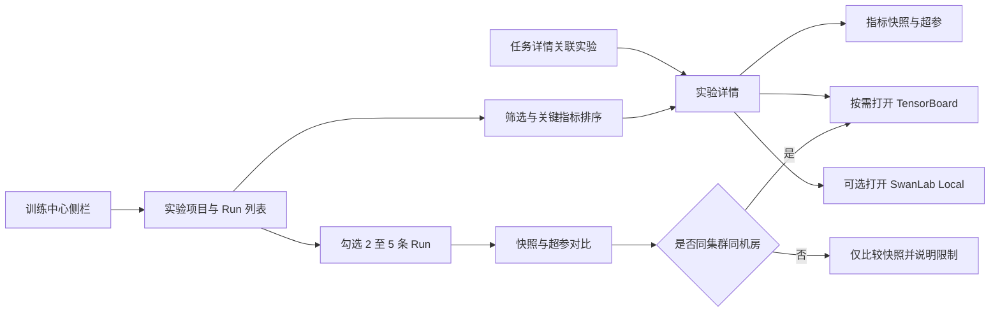
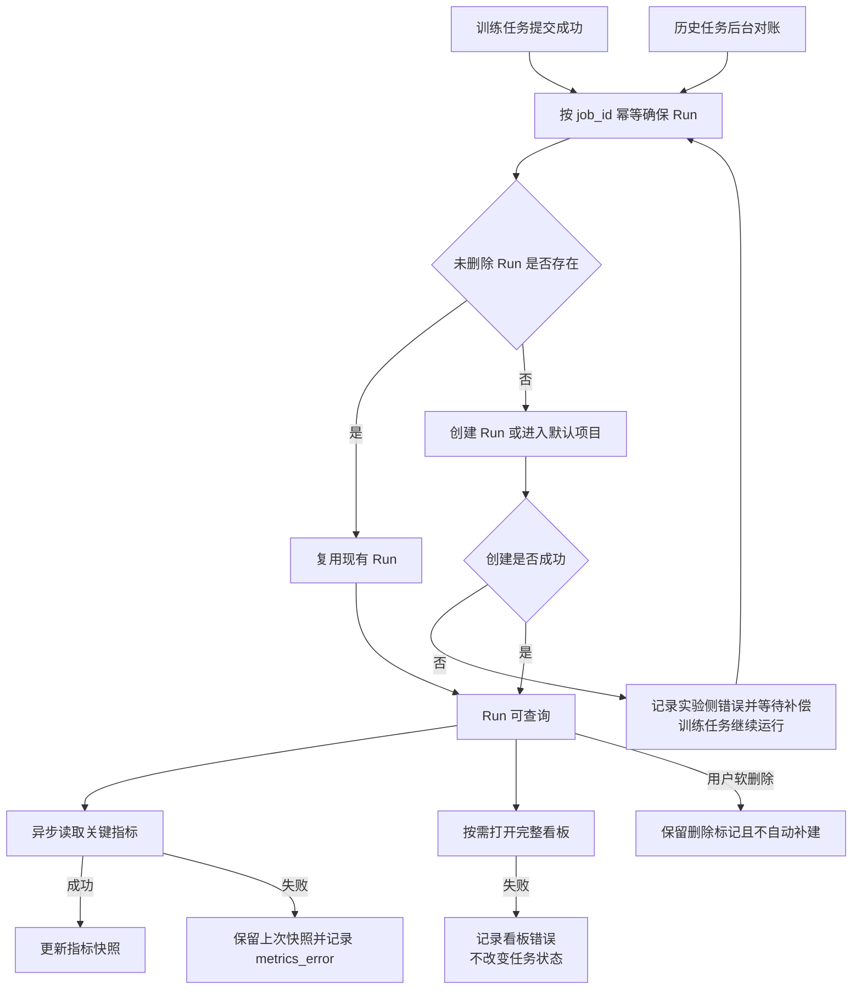

# 3.4 实验分析

模型效果来自围绕数据、超参数、资源和训练策略的持续迭代，而不是单次任务是否运行成功。缺少稳定的实验项目、`Run`和指标关联时，团队无法可靠比较多次尝试、解释效果变化或快速筛选候选模型，训练进展判断也只能依赖日志和任务状态。

当前平台尚未建设实验分析模块，本章所有能力均为新增规划，不把`Run`、指标快照、实验页面或`TensorBoard`入口视为现成功能。为支持训练进展展示与停滞判断，实施时先交付最小任务关联和指标快照，再在同一模块内补齐项目管理、导航、看板和对比，避免任务观测模块临时复制一套指标采集逻辑。

## 3.4.1 实验项目与`Run`管理

### 背景介绍

当前平台尚未建设实验分析模块。用户提交训练任务后，平台主要保存任务状态、日志和产物路径等运行信息，没有“实验项目”和`Run`这两个可管理的实验对象。但是，一个实验通常不是一次训练就结束：算法人员会围绕同一个基础模型、数据版本和目标反复提交多次任务，只修改学习率、批次、并行方式、数据配比或断点。

如果实验记录只依赖任务名称、文件夹或输出目录，就会出现以下问题：

1. 任务名称可能重复或随意变更，输出目录也可能由用户手工编写，用户无法凭名称准确找到某一次实验，更无法知道它是否对应了正在运行的任务。
2. 同一业务目标下的多次尝试没有统一归属，数据、镜像、资源、配置和指标之间也没有稳定关联，很难回答“这次结果为什么比上一次好或坏”。
3. 历史任务、未分类任务和多人共同试验只能靠个人备注或文档维护，既难以检索，也难以明确责任人、可见范围和后续分析权限。
4. 如果清理实验只能直接删除任务目录，就可能误删仍需要复现、排障或审计的日志、指标和断点；如果永远不清理，又会造成无人管理的历史数据堆积。

`Run`不是任务名称的另一种写法，而是“一次实验运行”的稳定管理对象：它需要关联平台任务、提交时配置快照、基础模型、数据版本、镜像、责任人、工作集群和指标快照。实验项目则用来组织同一目标下的多个`Run`。没有这两层管理对象，后续的指标快照、训练进展判断、任务与实验双向导航和实验对比都会各自维护一套关联逻辑，很容易出现任务、指标和权限对不上的问题。因此，建设实验项目与`Run`管理的必要性不是增加一张分类列表，而是为实验检索、协作、复现和后续分析提供统一的管理基础。

### 建设目标

1. 按工作集群浏览实验项目和`Run`，列表支持按项目、关键词、关联任务状态、创建人和创建时间筛选并分页，同时显示关联任务、最新指标快照、最后一步时间和数据采集状态。
2. 任务提交成功后幂等建立关联`Run`；未指定项目时进入“默认项目”，同一个未删除任务最多关联一条`Run`，历史任务可通过后台对账补建，但不改变原任务状态。
3. 用户可以在不移动原始训练产物的前提下移动或软删除`Run`；删除实验只移除实验索引和关联关系，不删除原任务、日志、`tfevents`或断点。
4. 项目、`Run`和关联任务均遵循工作集群、团队和项目可见性，让多人可以共享同一实验记录，同时避免看到未授权的任务和指标。

### 建议方案

建立两层对象：`exp_project`保存项目名称、描述和可见性，`exp_run`保存项目、集群、机房、团队、`job_id`、`tb_logdir`、创建人、配置快照引用及最新指标快照。`Run`是实验分析的索引和生命周期载体，不直接复制任务和日志原文。`job_id`在未删除记录范围内保持唯一，项目和`Run`使用软删除保留历史。列表先在数据库完成可见性过滤、项目过滤、状态过滤和分页，再批量读取关联任务名称与状态，避免`N+1`查询。默认项目不可删除；删除其它项目时，将仍保留的`Run`迁移到默认项目。

## 3.4.2 实验入口与双向导航

### 背景介绍

当前平台没有实验分析模块和统一曲线入口。用户提交训练任务后，只能在任务页面查看状态和日志；想要查看实验指标、曲线或多次试验时，只能靠任务名称、输出路径或个人记忆反复搜索。即使已经有了实验项目和`Run`记录，如果没有统一入口和稳定的页面关联，这些记录仍然很难被找到和使用。

此外，实验分析不是一个孤立的页面：用户通常从任务详情进入实验，在实验列表中筛选和比较，再回到任务查看日志、断点和运行状态。如果只能单向跳转或手工复制标识，用户就容易打开名称相似但实际不同的实验，或者在排障和复盘时丢失当前上下文。不同页面如果各自处理权限和集群范围，还可能出现实验列表可见、但关联任务不可见，或者通过直接地址绕过平台权限的问题。

因此，建设实验入口与双向导航的必要性，不是简单增加一个侧边栏菜单，而是将任务、实验列表、实验详情、指标快照、曲线和对比页面连成可追踪的工作流，让用户始终知道自己在看哪个任务、哪个`Run`以及这些页面之间的关系。

与实验项目与`Run`管理的职责边界如下：

| 功能模块 | 要解决的问题 | 主要职责 | 不负责的内容 |
|---|---|---|---|
| 实验项目与`Run`管理 | 实验对象怎么建立、归属和保留 | 创建和关联`Run`，组织项目与`Run`，维护责任人、可见性、生命周期和任务关系 | 不负责页面之间的跳转、路由和入口布局 |
| 实验入口与双向导航 | 用户怎么找到实验并在任务与实验之间切换 | 提供侧边栏入口、稳定路由、任务详情与实验详情互跳、权限校验和上下文传递 | 不负责创建`Run`、解析指标、渲染完整曲线或修改任务运行状态 |

### 建设目标

当实验模块已启用，但任务提交成功后`Run`还在建立、实验不可见、曲线读取失败或权限变更时，入口应展示明确的“待建立”、“暂时不可见”或“无权访问”状态，不能用空白页面或误导性的“实验不存在”代替。实验模块未启用时，侧栏菜单、任务关联入口和实验相关字段全部隐藏。

1. 训练中心侧栏提供“实验分析”入口，用户可以按工作集群、项目和权限范围进入实验列表。
2. 实验列表中的`Run`可跳转到实验详情；任务详情展示“关联实验”并可直接跳转；实验详情展示“查看任务”返回关联任务。跳转后保留当前工作集群、项目、`Run`和当前筛选条件，避免用户返回后重新搜索。
3. 详情页默认展示最新`Loss`、进度、吞吐、最后一步时间和指标采集时间，并以“`TensorBoard` / 曲线”标签或统一鉴权地址进入完整曲线。
4. 任务、`Run`、指标和外部看板的跳转都使用稳定标识和当前会话权限校验，不允许使用任意路径拼接或不经鉴权的外部地址跳转。
5. 实验模块未启用时隐藏侧栏菜单、任务关联入口和实验相关字段；模块已启用但`Run`尚未建立、指标暂时不可读或用户无权限时，入口展示明确的状态和下一步操作，不显示空白页面，也不把暂时不可用误导为实验不存在。

### 建议方案

页面使用稳定路由承载实验列表、详情和对比，并以实验运行标识（`run_id`）定位实验、以平台任务标识（`job_id`）建立双向关联。前端入口与后端权限都复用训练中心的工作集群和团队可见性，不允许只隐藏菜单却保留越权接口。任务列表需要实验摘要时，使用当前页的`job_id`一次批量查询；实验模块禁用时，侧栏、关联入口、实验列和筛选项全部隐藏。

实验列表、详情、完整曲线和对比页面之间的导航关系如下：

## 3.4.3 关键指标快照与快速排序

### 背景介绍

完整曲线包含的信息最多，但启动和浏览成本高，不适合从几十或几百条实验中快速定位目标。仅展示任务状态也无法判断优化器是否仍在推进，指标为空时若显示为`0`，还会把“没有数据”误判为“指标最好”。

### 建设目标

实验列表和详情直接展示最新`Loss`、`step`、`max_steps`、进度、吞吐、最后一步时间、指标采集时间及读取错误。基础排序至少支持最近更新、最近创建、`Loss`升序和`Loss`降序；在快照口径稳定后增加进度、吞吐、最后一步时间和指标采集时间排序。所有排序都在服务端完成，结果在翻页前保持全局一致；缺失值显示`—`并始终排在有效值之后。

本能力分为“最小指标快照”和“实验查询增强”两个可独立验收的内部建设步骤。最小指标快照先提供后台采集、结构化存储、错误状态和按`job_id`批量读取契约，作为训练进展展示与停滞判断的前置能力；实验列表展示、筛选、全局排序和分页随后接入同一快照，不要求后者完成后才开始训练进展与停滞提示。

关键指标口径如下：

|平台字段|建议读取来源|展示与排序规则|
|---|---|---|
|`Loss`|依次匹配`lm loss`、`lm-loss`、`loss`、`train_loss`、`Loss`|展示最新标量；支持升降序；仅作为训练趋势和异常筛选，不作为跨任务模型质量排名|
|`step`|优先读取训练模板明确映射的全局优化器步；未配置映射时可取命中`Loss`标量的最大`event.step`作为展示候选|记录命中的`tag`和语义可信度；只有模板确认的全局步可作为停滞规则输入，其它候选步数只用于实验展示|
|`max_steps`|匹配`max_steps`、`num_train_steps`、`train/total_steps`|有值时展示`step/max_steps`和百分比；未知时只展示当前`step`|
|吞吐|优先匹配`tokens_per_sec`、`tokens/sec`，其次匹配`throughput`|只有明确为每秒`token`时展示`tok/s`；通用`throughput`使用中性文案并保留来源单位|
|`last_step_at`|命中全局步标量事件的`wall_time`|展示训练进展新鲜度；无法取得时显示未知，不使用平台读盘时间替代|
|`metrics_at`|最近一次成功读取指标的时间|只表示采集链路新鲜度；支持定位采集异常，不用于判断训练是否推进|
|`metrics_error`|最近一次读盘失败、目录缺失或解析失败摘要|不参与数值排序；在详情解释为什么指标为`—`，不改变任务状态|

### 建议方案

平台向训练容器注入约定的`TENSORBOARD_LOGDIR`，不覆盖用户已显式配置的同名变量。定时对账默认每`30`秒在任务所在集群和机房创建短生命周期`metrics Job`，通过`EventAccumulator`读取每个受控`tag`的最后一个标量及其`wall_time`，将包含`stepTag`、`stepSemantics`和`lastStepAt`的一行结构化`JSON`解析后更新`exp_run`快照，并由后端以成功写入时间更新`metrics_at`；成功后删除读盘`Job`，失败时记录错误并指数退避。列表查询必须先应用集群、团队、项目和状态过滤，再使用数据库排序，最后分页并批量装配关联信息；排序使用更新时间和`Run ID`作为稳定次序，并显式采用空值置后规则。训练结束后至少尝试读取一次终态快照。

最小指标快照的完成门禁是：能够对指定`job_id`定位受控`tfevents`目录，按稳定周期更新全局步、`last_step_at`、`metrics_at`、吞吐和`metrics_error`，并通过一次批量契约返回当前页任务所需的最小投影。该门禁不要求实验项目列表、排序页面、完整曲线或对比页面已经交付。

列表性能按单个工作集群最多`100,000`条未删除`Run`、单页最多`100`条设计。一次列表请求应保持为固定数量的数据库操作：一次总数统计、一次过滤排序分页、一次关联任务批量装配和一次项目批量装配，不随总记录数或页内行数增加远程调用；页面读取列表时不得访问集群。数据库至少为集群与更新时间、项目与更新时间、团队与更新时间以及集群与`Loss`排序路径建立匹配查询条件的部分索引，并使用`EXPLAIN ANALYZE`分别在`1,000`、`10,000`和`100,000`条数据规模下验证执行计划、空值排序和分页稳定性。指标对账按集群一次列出带标签的代理对象，再以受控并发处理需要刷新的`Run`，禁止逐条远程探测。

`Loss`排序只能比较训练目标和口径相近的实验。列表和对比页需要同时展示基础模型、数据版本、任务类型和命中的指标`tag`；条件明显不一致时给出“指标不可直接比较”的提示。模型质量排名应使用评测与质量门禁模块的业务、安全和回归指标，不能以训练`Loss`替代。

## 3.4.4 `TensorBoard`按需打开

### 背景介绍

为每条运行中任务常驻`TensorBoard`会消耗机房进程并增加故障面；让浏览器直接访问机房端口又会绕过平台会话、团队权限和审计。在多机房环境下，控制面也不能假设可以直接挂载所有训练目录。

### 建设目标

实验详情默认展示“`TensorBoard` / 曲线”页签，但只在用户点击打开时启动对应看板。就绪后在页面内嵌完整界面，并提供同一鉴权地址的新标签打开方式。启动超时、静态资源加载失败、集群离线或目录不可读时给出明确原因，外层指标和其它详情仍可使用；无人访问超过空闲窗口后自动回收看板。

### 建议方案

`POST /api/training/experiments/{id}/board`作为允许产生启动副作用的打开动作，先校验`Run`可见性并记录访问时间，再在任务所在集群、机房创建不申请`GPU`的`serve Pod`和内部`Service`；`GET /api/training/experiments/{id}/board/*`负责通过当前会话读取看板资源。平台经集群`API Server`的`Pod`代理提供同源地址，浏览器不接触机房内`6006`端口。页面优先用`iframe`嵌入，路径前缀或静态资源不兼容时保留“新标签打开”降级。定时对账根据最近访问时间续期或回收`serve`对象，默认空闲窗口建议为`20`分钟并允许配置。

## 3.4.5 实验对比

### 背景介绍

算法人员需要同时判断指标变化来自超参、资源、数据还是训练阶段。逐页切换只能凭记忆对照；跨机房直接叠加完整曲线则要求访问多套隔离存储和运行时，可靠性与权限边界都不清晰。

### 建设目标

用户可以选择`2`至`5`条可见`Run`进入对比页，并排展示最新指标、任务状态、基础模型、数据版本和超参差异。系统应突出不同字段，并在基础模型、数据或指标口径不一致时标记可比性风险。只有所选`Run`位于同一集群、同一机房时，才提供完整`TensorBoard`曲线对比；否则只比较快照和超参并说明限制。

实验对比需要同时覆盖结果、输入和资源差异：

|对比维度|展示内容|可比性规则|
|---|---|---|
|训练结果|最新`Loss`、进度、吞吐、进展状态、最后一步时间和指标采集时间|指标名称、单位或统计口径不同则标记不可直接比较|
|模型与数据|基础模型、数据版本、`mixture`和分词器|基础模型或数据分布不同则提示结果归因风险|
|训练配置|学习率、批次、并行、精度、模板和镜像摘要|突出结构化字段差异，不比较当前模板默认值|
|资源与成本|机型、卡数、运行时长、有效`token`和估算成本|资源口径缺失时显示未知，不使用`0`代替|
|完整曲线|同机房、同集群`Run`的`TensorBoard`曲线|跨机房只比较快照，不隐式复制`tfevents`|

### 建议方案

对比接口限制`Run ID`数量并一次批量读取`Run`、任务配置投影和必要资产名称，不循环调用单条详情。差异计算基于任务提交时的不可变配置快照，不读取当前模板默认值。完整曲线继续由按需看板提供，不把`tfevents`复制到控制面或为了跨机房对比新建长期同步链路。

## 3.4.6 `Run`生命周期与异常降级

### 背景介绍

训练任务和实验记录分属不同模块，任何跨模块调用都可能暂时失败。如果创建`Run`失败就回滚已经提交的训练，会扩大非核心能力的故障影响；如果历史任务永远不补建，又会造成实验列表不完整。指标缺失、目录损坏和看板故障同样不应被误判为训练失败。

### 建设目标

训练任务成功提交后幂等创建关联`Run`，未选择项目时进入默认项目；一个任务最多一条未删除`Run`。打开实验列表或后台对账时，为从未产生实验记录的历史任务补建`Run`。创建、读盘或看板失败只记录实验侧错误并允许后续补偿，不回滚训练任务、不改变任务状态，也不把空指标显示成`0`。

其中，`job_id`、`Run`、工作集群和`tfevents`目录的幂等关联，是训练进展与停滞判断、关键指标快照共同依赖的最小前置能力，应先于实验项目整理、历史任务补建页面和看板生命周期独立完成并通过验证。最小关联创建失败时，训练任务仍正常运行，但进展状态只能显示为未知，不能绕过关联直接扫描目录或生成停滞结论。

`Run`创建、补偿和异常降级关系如下：

### 建议方案

任务服务通过构造函数注入的稳定实验契约调用幂等`EnsureForJob`，实验服务通过任务只读投影获取必要信息，双方不访问对方内部模型。历史补建以`job_id`唯一约束防止重复；用户已经软删除的`Run`保留删除痕迹，不再次自动补建。指标失败写入`metrics_error`并保留最后一次成功快照，看板失败写入独立错误摘要。实验模块关闭时停止对账并清理仍存活的`serve`对象，前端完全隐藏实验入口和关联字段，数据库中的项目、`Run`和历史快照继续保留，重新启用后可恢复使用。

## 3.4.7 `SwanLab Local`实验分析适配

### 背景介绍

规划中的`TensorBoard`入口用于满足完整曲线查看，但团队后续还需要兼容已有内网`SwanLab Local`记录习惯，并使用其协作式实验跟踪、标签、仪表盘和报告能力。如果用户绕过平台直接在`SwanLab Local`中创建另一套项目和实验，平台任务、实验权限、指标快照和分析报告会失去稳定关联；实验列表若为了展示每一行而实时查询`SwanLab Local`，还会受到服务延迟、限流和故障影响。训练平台运行在`UAT`环境且不能访问公网，因此所有相关规划都限定为平台可达、经过批准的内网`SwanLab Local`实例；指标、超参和允许的产物元数据通过内网同步，原始日志、训练样本、断点和模型权重不得外发。

### 建设目标

实验项目与`Run`管理、双向导航、指标快照、按需看板、实验对比和异常降级形成核心闭环后，可以接入`SwanLab Local`。项目或任务可以关联已有内网`SwanLab Local`实验，也可以在显式启用后由训练框架通过`SwanLab SDK`向指定内网实例创建实验；平台`Run`继续作为任务关联、权限和列表检索的主索引。实验详情展示`SwanLab Local`关联状态、最近同步时间和经认证的内网打开入口，并把经过白名单和口径映射的摘要指标同步到平台快照，供列表筛选、排序和对比。未启用或`SwanLab Local`不可用时，已经建成的`TensorBoard`入口、平台指标快照和训练任务不受影响。

适配范围如下：

|能力|支持范围|不包含|
|---|---|---|
|部署与连接|仅支持平台内网可达的获批`SwanLab Local`实例，并兼容共享存储中的`swanlog`本地记录；配置内网服务地址、工作空间和项目映射|连接公网服务、配置外网出口或向云端托管实例发送实验数据|
|实验关联|保存平台`run_id`与`SwanLab Local`实验标识、项目、内网访问地址的唯一映射|把无训练任务的全部实验自动导入平台|
|指标同步|通过`SwanLab Local`版本支持的接口或导出能力批量读取白名单摘要指标、来源名称、单位和更新时间，写入平台快照|把完整指标历史复制到`PostgreSQL`，或列表逐行实时查询`SwanLab Local`|
|页面入口|在实验详情通过统一身份认证或短期授权的新标签打开内网`SwanLab Local`地址|默认使用可能受认证、同源和内容安全策略限制的`iframe`嵌入|
|配置与产物|同步允许展示的超参摘要、标签和产物元数据|默认上传原始日志、训练样本、`checkpoint`或模型权重|
|本地与离线记录|登记共享存储中的`swanlog`目录，并允许显式配置的同步任务将记录发送到获批的内网`SwanLab Local`实例|在没有内网连通和数据授权时自动外发本地记录目录|

### 建议方案

在实验模块内新增分析提供方适配接口，当前实现只接内网`SwanLab Local`，不允许配置公网或云端服务地址，不把`SwanLab Local`对象泄漏给任务模块。平台保存独立的`Run`绑定，包括固定提供方、内网项目、实验标识、`swanlog`目录、内网访问地址、最近同步时间和同步错误；凭据由`Secret`或密钥服务按项目注入，接口和日志不得返回访问令牌。训练任务仅在用户显式启用时注入`SwanLab SDK`初始化所需的内网服务地址、项目和实验标识，访问令牌通过密钥挂载提供，不写入任务规格、环境快照或日志。

指标同步使用`SwanLab Local`支持的`SDK`、内网接口或所选版本提供的导出能力，按项目和更新时间分页读取变化的实验摘要，再批量更新平台快照；禁止对实验列表每一行发起内网请求。只有在`SwanLab Local`暂不提供稳定读取接口时，才由受控同步任务解析已确认版本的`swanlog`结构，并通过适配器隔离格式变化。同步指标必须经过白名单、字段映射、单位和可比范围校验，缺失值仍显示`—`并置后，`SwanLab Local`不可用时保留最后一次成功快照并记录同步错误。打开入口默认跳转到通过统一身份认证保护的内网`SwanLab Local`地址；只有经过认证、同源和内容安全策略验证后才考虑内嵌。禁用`SwanLab Local`适配时，前端隐藏相关入口和字段，后台停止同步，绑定与历史摘要保留，重新启用后可以继续对账。

该能力依赖核心实验分析闭环，但不把`SwanLab Local`升级为训练任务的强依赖。正式实施前必须完成`SwanLab Local`版本与许可评估、内网连通、统一身份认证、凭据轮换、数据分类、指标白名单、`swanlog`格式兼容、限流退避和故障降级验证，并明确禁止配置公网出口。
