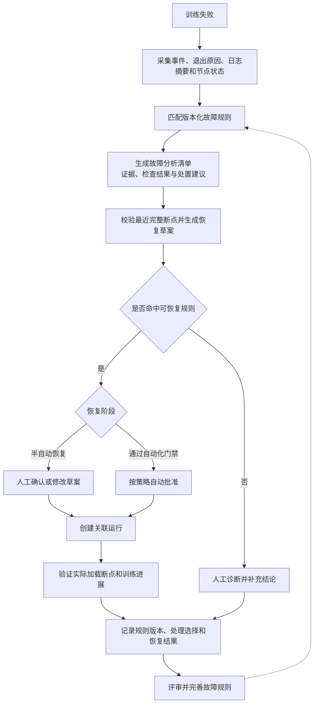

# 3.5 断点与故障恢复

长周期、多节点训练难以完全避免硬件、网络、存储或人工操作导致的中断，已经消耗的算力能否保留下来取决于断点是否完整、恢复配置是否兼容以及停止过程是否安全。完善断点与故障恢复能力，可以把不可验证的目录文件转化为可选择、可校验的恢复对象，并用有证据的分析和分阶段处置减少盲目重跑、重复失败及产物损坏。

## 3.5.1 断点清单与完整性

### 背景介绍

长周期、多卡训练通常会运行数小时甚至数天，进程可能在断点写入过程中因为节点故障、通信异常、存储抖动或人工停止而中断。此时断点目录可能只写入了部分文件、缺少优化器状态，或者文件已经存在但内容校验不完整。当前如果只根据`iter_0018000`这类目录名选择断点，用户无法知道它是否已经写完、能否被训练代码加载，也无法判断恢复后会从哪个全局`iter`继续。误选损坏断点会导致恢复任务再次失败，甚至覆盖仍可用的历史状态，进一步浪费已经消耗的算力和排障时间。因此，平台需要把断点从“目录里可能存在的文件”变成有完整性、可加载性和时间信息的可选择恢复对象。

### 建设目标

按全局`iter`列出断点大小、文件完整性、写入耗时、校验时间和可加载状态。默认目录为`/data/hpc/home/<user>/outputs/<job_id>/checkpoints`，共享断点可显式登记到`/share`。

### 建议方案

训练侧在原子完成后写入清单和完成标记，平台异步校验分片、哈希和必要元数据；加载冒烟校验作为独立低资源任务。断点列表读取业务库索引，文件扫描异步执行并限制并发，避免详情请求遍历大目录。

## 3.5.2 再次提交与恢复策略

### 背景介绍

训练失败后，用户通常会直接点击“再次提交”，但再次提交本质上只是创建一次新的运行，并不代表训练代码一定加载了断点。如果平台没有明确记录恢复策略和实际加载结果，新运行可能悄悄从头初始化，用户却误以为已经接着原进度训练。即使确实找到了断点，基础模型、分词器、数据游标、并行配置或输出目录发生变化，也可能导致断点与当前任务不兼容；原任务尚未完全退出时再次提交，还可能并发写入同一目录并破坏可恢复状态。恢复失败后用户很难区分是断点损坏、配置变化还是根本没有执行加载，因此需要在提交前展示恢复依据和差异，在运行后记录可核实的实际加载结果。

### 建设目标

再次提交支持`never`、`latest`和`specified`恢复策略，预览候选断点、配置差异、目录占用和兼容性。平台不隐式改变训练代码行为，但必须记录实际加载的断点、恢复后的全局`iter`或从头初始化结果。

|恢复策略|训练初始化|断点使用|适用场景|
|---|---|---|---|
|`never`|重新初始化模型和优化器|不加载已有断点|新配置对照、清理旧状态、明确从头训练|
|`latest`|从最近合法状态继续|平台选择最新完整断点，训练代码执行加载|硬件故障恢复、同一输出目录继续训练|
|`specified`|从指定历史状态继续|用户选择完整断点，平台校验其兼容性|回到指定全局`iter`复现实验或比较阶段结果|

### 建议方案

将恢复策略作为任务规格字段，由框架适配器翻译为训练参数；恢复校验比较基础模型、分词器、数据游标和并行元数据。新运行与原运行通过父子关系关联，输出目录采用运行级锁或租约防止并发覆盖。

## 3.5.3 停止信号与风险提示

### 背景介绍

训练任务可能因为预算、资源抢占、数据问题或发现配置错误而需要人工停止，但停止动作本身也可能发生在断点写入或指标更新之间。当前的停止确认通常只说明“任务将被取消”，没有告诉用户最近一个完整断点在哪里、当前全局`iter`是多少、仍有多少进度没有落盘，也没有说明之后再次提交是否具备恢复条件。值班人员只能凭经验决定是否继续等待、立即停止或先保存状态，容易误删仍可用的进度；停止后又可能把“没有确认断点”误认为“可以自动恢复”。此外，如果容器入口没有把终止信号传递给真正的训练进程，或者训练代码收到信号后没有主动保存并退出，云原生运行环境会在宽限期结束后强制终止进程，最后一段训练进度和正在写入的断点都可能丢失。因此，平台需要同时明确停止前风险和统一的信号处理规范，让训练框架、容器启动器与平台对“何时落盘、等待多久、何时强制停止”形成一致约定。

### 建设目标

1. 停止确认展示最后一个完整全局`iter`、最近断点写入状态、当前进度、预计丢失步数和实际停止宽限期；用户确认后记录停止原因和风险快照。
2. 用户主动停止、平台策略停止和半自动恢复前的旧任务清理，都统一走云原生容器终止流程。平台向任务的全部训练`Pod`发起停止，容器主进程收到`SIGTERM`后必须将信号传递给训练启动器和训练进程组。
3. 训练进程收到`SIGTERM`后，应停止开始新的全局`iter`，在框架允许的安全点协调各`rank`保存权重、优化器、调度器、随机状态和数据游标，写入断点完成标记，刷新日志与指标，然后主动退出。无法在宽限期内完成时，不得把未写完目录标记为完整断点。
4. `Kubernetes`工作负载的`terminationGracePeriodSeconds`默认设置为`30`。从发送`SIGTERM`开始计时，全部训练进程在`30`秒内退出则记录为优雅停止；到期仍未退出时由运行环境发送`SIGKILL`并记录为强制停止。经验证确实需要更长落盘时间的官方训练模板可以显式声明受治理的宽限期，并在提交预览和停止确认中展示实际值，不能无限等待。

停止过程统一按以下结果判定：

|停止场景|信号与时限|训练进程责任|平台记录|
|---|---|---|---|
|用户或平台正常停止|向全部训练`Pod`发送`SIGTERM`，默认等待`30`秒|在安全点停止新步骤，协调落盘、写完成标记并主动退出|优雅停止时间、退出状态、最后完整断点和预计损失|
|宽限期超时|运行环境发送`SIGKILL`并强制结束容器|进程不再有落盘机会，未完成目录不得作为恢复候选|强制停止时间、未退出实例、最后已确认完整断点和可能损失|
|节点失联或进程崩溃|可能无法送达`SIGTERM`|不能依赖临终落盘|异常终止证据，并只使用故障前已经完成校验的断点|

### 建议方案

停止控制器在执行取消前读取断点与进展摘要的同一时点快照，并使用幂等取消语义；重复停止请求不得重复发送信号或覆盖第一次停止原因。任务工作负载写入默认`30`秒的`terminationGracePeriodSeconds`，容器入口通过`exec`启动或显式信号转发，确保`SIGTERM`可以从容器`PID 1`到达训练进程组。框架适配器负责把信号处理翻译为各训练框架的安全点保存和分布式`rank`协调逻辑，所有断点分片完成后才写入统一完成标记。

平台记录停止请求、`SIGTERM`发出、主动落盘开始与完成、进程退出、`SIGKILL`强制终止等事件，并区分“优雅停止”“强制停止”和“信号无法送达”。摘要不可用时明确标记未知，不阻塞紧急停止，但必须写入审计记录；强制停止后立即触发断点完整性复核，不能因为目录存在就提示可以恢复。

## 3.5.4 故障分析清单与分阶段恢复

### 背景介绍

硬件故障、`NCCL`或`IB`通信异常、节点驱逐等问题，有些只是临时故障，有些则意味着当前断点、节点或任务配置已经不可继续使用。现在用户需要先翻查多处日志判断原因，再手工寻找可用断点、排除故障节点、修改资源规模并重新提交，整个过程耗时且依赖个人经验；夜间或无人值守时，任务可能长时间停在那里，持续占用资源。相同故障由不同人员处理时，检查顺序和处置方式也可能不同，人工排查得到的经验没有沉淀为程序可重复执行的规则，平台既不能稳定给出建议，也没有足够数据判断某种处置是否适合自动执行。另一方面，如果平台对所有失败都盲目自动重试，可能反复提交同一个不可恢复的配置、覆盖输出目录，或在没有预算控制的情况下不断消耗`GPU`。因此，必须先建设故障分析清单和半自动恢复，把常见故障的证据、检查步骤、处理建议和实际结果持续沉淀下来；全自动恢复必须以经过验证的规则和数据为前提。

### 建设目标

1. 建立版本化故障规则目录，将常见故障的识别证据、检查步骤、可恢复条件、处置建议和禁止动作落实为可测试的程序规则。每次失败都生成结构化故障分析清单，展示命中的规则、原始证据、检查结果、最近完整断点和仍需人工确认的未知项。
2. 基础恢复采用半自动方式：平台完成故障检查、断点校验并生成换节点、排除节点、缩容或调整配置的再次提交草案，必须由有权限的用户确认或修改后才创建关联运行。未知故障、证据冲突或断点不可确认时只给出排查清单，不自动推断恢复方案。
3. 每次处理都记录规则版本、用户接受或修改的建议、实际加载断点、恢复后是否继续推进、再次失败类型和人工补充结论。经过评审后将新发现的稳定检查和处理方式补充到规则目录，使相同故障能够逐步由程序完成更多检查。
4. 全自动恢复按故障类型逐项开放，不提供不区分原因的全局自动重试开关。只有规则证据充分、半自动处理样本和成功率达到验收要求、恢复动作可幂等执行，并具备次数、退避、预算和人工接管限制时，才允许任务声明对应的自动恢复策略。

故障分析清单至少覆盖以下常见类型：

|常见故障|程序检查证据|半自动处理建议|自动化边界|
|---|---|---|---|
|节点驱逐或暂时失联|调度事件、节点状态、`Pod`退出原因和发生时间|校验断点后换节点再次提交|只有原因明确且替代资源可用时才可进入自动化候选|
|`GPU`硬件或驱动故障|设备健康事件、`Xid`摘要、节点告警和受影响`rank`|排除故障节点并使用最近完整断点|必须确认故障节点已经隔离，不能原节点原配置反复重试|
|`NCCL`或`IB`通信故障|通信超时、错误日志、网络设备状态和相关节点范围|定位疑似节点，生成换节点或经校验的缩容草案|无法定位范围或并行配置不兼容时必须人工处理|
|显存不足|`OOMKilled`、退出码、显存摘要和最后一条分配失败日志|建议降低批次、启用检查点技术或调整并行配置|禁止使用同一配置自动重复提交|
|存储或断点异常|读写错误、挂载状态、分片清单、哈希和完成标记|恢复存储后选择最近完整断点|断点不完整或存储状态未知时禁止恢复|
|数据、配置或代码错误|稳定复现的退出原因、参数校验和日志特征|定位字段、文件或代码后由用户修正|确定性错误不自动重试|
|未知或证据冲突|没有命中规则，或多条证据给出不同结论|展示已完成检查和待排查项，由人工补充结论|不得自动恢复|

### 建议方案

故障分析能力批量消费调度事件、硬件告警、容器退出原因和训练日志摘要，按规则优先级输出标准故障类型、命中证据、可恢复性和建议动作；规则以版本、适用框架、必要证据、排除条件和处置模板管理，修改后只影响新分析，不覆盖历史结论。故障分析模块通过只读投影获取任务、节点和断点摘要，恢复编排仅调用任务、断点和调度模块的公开契约，不访问其它模块的内部状态。

半自动恢复使用状态机和幂等键生成恢复草案，人工确认后才执行；反馈记录将分析规则、人工选择与恢复运行结果关联起来，用于统计命中率、建议采纳率、恢复成功率和同类故障复发率。全自动恢复复用同一规则和执行链路，只是把经过验证的人工确认步骤改为受策略约束的自动批准，并继续受最大次数、退避、预算和人工接管限制。

未通过自动化门禁时不执行无人确认的全自动故障恢复。本模块不建设训练中途不落盘的内存级弹性恢复，不替训练代码隐式补上加载参数，也不保证调整张量并行或流水线并行后一定能够恢复。平台只对程序规则明确命中且已经校验的断点给出可信建议；没有证据时必须显示未知或不可恢复，不能根据目录名或单条日志猜测。恢复模块禁用时，任务停止和失败状态仍正常记录，前端隐藏恢复草案和自动化策略入口，历史故障清单与处理结果继续保留，重新启用后可以继续分析。
