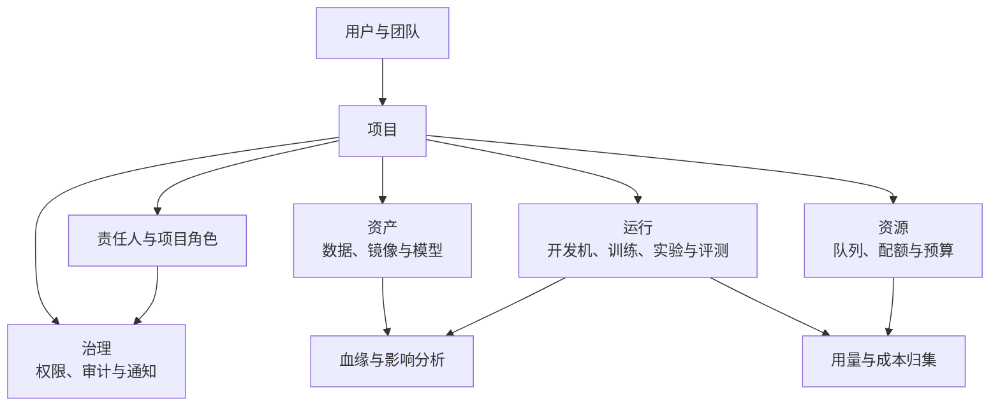

# 3.7 平台治理与开放能力

随着用户、项目、任务入口和自动化调用增加，凭据、权限、审计、配额、成本和可靠性如果分别散落在各业务模块中，会形成口径不一致和控制盲区。建设统一的平台治理与开放能力，可以让页面、命令行和外部系统遵循相同的安全与可靠性约束，同时为资源使用、异常处置和服务质量提供可度量的管理依据，使平台能够在扩大使用规模时保持受控开放。

## 3.7.1 凭据注入与脱敏

### 背景介绍

访问令牌写入`train.yaml`、启动命令或日志后，会随配置导出、截图和评测产物扩散。

### 建设目标

凭据通过`Secret`或密钥服务以短期、最小权限方式注入，配置只保存引用；日志、事件、预览和评测输出执行统一脱敏。

### 建议方案

运行层在授权后解析密钥引用并注入，不向任务详情返回明文；脱敏规则在日志入口和展示出口双重执行。密钥访问写入审计，失败返回标准权限错误。

## 3.7.2 任务可靠性策略

### 背景介绍

网络抖动和脚本异常时，当前痛点如下：

1. 可能触发重复提交，覆盖已有产物。
2. 错误重试没有上限，会持续消耗资源。
3. 取消状态不一致，页面以为停了，集群里还在跑。

### 建设目标

训练、评测和工作流统一支持超时、幂等取消、按错误类型设置重试上限和人工接管，所有动作保留审计事件。

### 建议方案

定义跨运行类型共用的错误分类和可靠性策略，但具体恢复由所属模块执行；状态转换使用幂等命令和乐观并发控制。不可重试的数据和配置错误直接终止并给出修正建议。

## 3.7.3 统一开放接口

### 背景介绍

多个入口如果各写一套提交逻辑，当前痛点如下：

1. `Web`、命令行和自动化系统的状态、默认值和错误处理会分叉；命令行入口例如可采用`aitrain`作为命令名称。
2. 重试可能重复创建任务。

### 建设目标

各入口共用版本化应用接口、资源标识、错误码、请求追踪号和幂等键，并明确兼容周期与弃用策略。

### 建议方案

应用接口调用模块公开服务契约，不暴露`DAO`、内部实体或运行时配置；版本差异在边界转换。高频列表和候选接口必须支持分页、批量投影和有界查询。功能模块关闭后，前端相关菜单、字段、按钮和筛选项必须一起隐藏，后端可选依赖返回空结果或跳过非强制步骤，历史数据继续保留并在重新启用后恢复；正式训练、审批或交付依赖的强制能力不可用时必须明确拒绝，不能降级放行。平台不支持`i18n`，页面、接口提示和通知使用中文。

## 3.7.4 统一项目归属

### 背景介绍

资产如果只靠备注归属，当前痛点如下：

1. 任务失败、预算超限或数据违规后找不到责任人。
2. 跨团队资源无法安全授权。

### 建设目标

统一用户、团队、项目、任务、实验、数据集、模型和资源队列的归属关系，支持按项目查询责任人、资产、运行和成本。

项目作为治理主线连接责任、资产、运行和资源，但不接管各业务模块内部生命周期：

### 建议方案

项目标识成为各模块对象的稳定外键或租户字段，治理模块提供批量归属和权限投影；禁止列表逐项查询项目详情。历史对象迁移需保留原创建者和审计信息。

## 3.7.5 项目角色与资源授权

### 背景介绍

多人项目如果权限切不细，当前痛点如下：

1. 无法按提交、协作、审批和运维职责分权。
2. 任务详情与开发机聚合了数据、模型、日志和终端入口，容易扩大访问范围。

### 建设目标

提供项目级`RBAC`，区分提交者、协作者、交付负责人、数据负责人、审批者、只读用户和平台运维；数据原文、训练产物、日志、终端、导出和交付分别授权，临时权限可自动过期。模型资产系统内部权限仍由该系统负责。

|角色|主要责任和权限边界|
|---|---|
|提交者|创建和取消自己的任务，使用项目内已授权的数据与外部基础模型资产引用|
|协作者|查看、复现和再次提交项目任务，不直接发起模型交付|
|数据负责人|登记数据、维护授权、质量状态和处理血缘|
|交付负责人|维护交付说明、门禁阈值和模型资产系统交付请求|
|审批者|批准训练产物导出和向模型资产系统提交|
|平台运维|查看运行诊断、隔离资源和处理故障，默认不读取业务原文|
|只读用户|查看脱敏元数据、运行摘要和评测报告|

### 建议方案

授权服务提供批量资源判定和最小投影，模块在入口与数据访问层同时校验；权限状态和角色使用固定命名类型。模块禁用时隐藏相关入口，但不删除历史授权与资源。

## 3.7.6 统一审计

### 背景介绍

发生数据泄露、训练产物误交付或资源争议时，没有不可篡改的记录就无法还原责任和影响范围。

### 建设目标

记录任务提交与取消、配置和权限变更、数据登记、训练产物访问、审批、导出、交付和清理及失败原因，支持按主体、项目、资源和时间检索。

### 建议方案

各模块发布结构化审计事件，审计模块异步持久化并提供只读查询；关键动作在业务事务中写出事件记录，避免成功操作无审计。高量事件按时间分区并限制查询范围。

## 3.7.7 业务与治理通知

### 背景介绍

模型退化、门禁失败、待审批、数据违规和预算超限若只通知运维，会遗漏真正需要决策的算法和业务负责人。

### 建设目标

按责任关系通知交付负责人、数据负责人、审批者和项目管理员，并复用任务通知支持的`FastX`、飞书和邮件通道，提供去重、升级、确认、失败重试、备用通道降级和送达记录。

### 建议方案

复用任务通知的通道、偏好和送达基础能力，治理模块只发布标准业务事件和接收人角色，不直接调用`FastX`、飞书或邮件接口；接收人解析通过项目归属批量完成。同一业务事件已经通知任务创建人或负责人时，按事件和用户身份合并，避免任务通知与治理通知重复发送。

## 3.7.8 用量、配额与预算

### 背景介绍

没有统一用量口径时，当前痛点如下：

1. 无法解释队列拥堵和项目成本。
2. 无法比较全量微调与`LoRA`的实际投入。

### 建设目标

记录开发机、训练和评测的`GPU`型号、数量、时长、队列、存储、有效`token`与项目归属；配置项目预算、队列配额、并发、单任务上限和超预算提醒，支持成本分摊导出。

不同运行对象使用统一归属口径，但保留各自有意义的计量事实：

|计量对象|核心用量事实|准入与治理动作|
|---|---|---|
|开发机|机型、卡数、启动与停止时间、空闲时长和存储|计入队列额度，空闲通知并自动回收|
|训练任务|机型、卡数、运行时长、有效`token`、断点和输出存储|校验项目预算、队列配额、并发和单任务上限|
|评测运行|机型、卡数、样本数、生成`token`和运行时长|限制评测并发与预算，支持缓存节省量统计|
|数据与模型存储|逻辑版本、物理大小、保留期限和项目归属|生成成本分摊和清理候选，不按目录名猜测归属|

### 建议方案

从调度与监控系统异步汇总用量事实，按项目、任务和日生成聚合快照；准入路径读取缓存配额与预算，最终账单异步校正。导出批量生成，避免在线请求扫描全量明细。

## 3.7.9 `Python SDK`与受控自动化

### 背景介绍

流水线和`AI Agent`接入平台时，当前痛点如下：

1. 需要批量查询、提交和审批，但缺少受控的机器身份。
2. 直接复用管理员或个人长期令牌会放大权限，并产生重复操作。

### 建设目标

提供版本化`Python SDK`和机器可读输出，使用项目服务身份、短期令牌、最小权限、幂等键和调用审计；高风险审批、交付和删除仍要求人工或显式策略授权。

### 建议方案

`SDK`由统一接口模式生成基础客户端并补充分页、重试和错误类型封装；自动化身份与个人身份分离。重试只对幂等操作和可重试错误生效，不在客户端猜测业务状态。

## 3.7.10 平台`SLO`与错误预算

### 背景介绍

平台扩张后，故障影响、成功率和恢复速度缺少统一口径，团队无法判断应优先改进调度、存储、评测还是交付。

### 建设目标

以`job_id`关联调度事件、`Pod`、日志、训练指标、实验`run_id`、断点、评测、交付记录和外部资产标识；为训练、评测、数据登记和模型交付定义可用性、成功率、状态同步延迟与恢复时长等`SLO`，至少覆盖提交成功率、日志丢失率、评测等待时间、工作流停滞时长和模型交付成功率，并按月输出达标情况、错误预算和改进事项。

### 建议方案

`SLO`基于现有监控与审计事件计算，指标定义版本化并明确分母和排除条件；报告读取预聚合时序结果，不从业务明细临时计算。

## 3.7.11 训练平台服务合并与功能回归

### 背景介绍

当前训练平台由`mlp-train-web`、`mlp-train-api`和`acs-server`三个服务组成。多服务部署、进程间通信、配置同步和版本协同增加了故障排查与日常维护成本，也使多人共同使用`AI`维护同一项目时需要理解多个运行单元，统一迭代和测试的效率较低。

### 建设目标

将三个服务合并为一个可独立启动、部署和观测的服务，保留现有外部接口、权限语义和核心用户流程；统一启动装配、配置、路由、鉴权、日志、监控、健康检查和发布流程。合并完成后，必须通过覆盖现有功能的回归测试，作为多人共同使用`AI`维护同一项目、共同迭代与测试的前置条件。

### 建议方案

合并只调整部署与进程边界，不重新划分业务模块职责。原有`Web`、`API`和`ACS`能力在单一服务内通过现有服务契约和显式依赖装配连接，禁止跨模块直接访问`DAO`、内部实体或私有运行时结构；发现循环依赖时优先提取稳定的模块接口或适配器，并说明新增抽象的变化点。统一服务入口负责配置加载、路由注册、鉴权中间件、日志与指标初始化以及健康检查，业务模块继续独立维护自身对象和生命周期。

回归验证至少覆盖：

1. 单服务启动、停止、健康检查、配置加载和发布回滚。
2. 原有`Web`页面与`API`路由、鉴权、权限拒绝和错误响应保持兼容。
3. 项目与用户管理、训练任务提交、取消、日志观测、实验入口及现有`ACS`相关核心流程端到端可用。
4. 日志、监控指标、请求追踪和审计事件在合并后仍能关联到同一任务和项目。
5. 多人并发访问同一项目时，角色边界、协作修改、测试执行和结果查看符合既有权限约束。

回归失败时保留失败证据并阻断协作阶段启用；发布采用可回滚方式，确保问题能够恢复到合并前的稳定版本。
