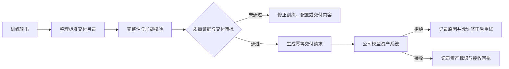

# 3.8 模型产物交付

公司已经有独立的模型资产系统，模型注册、模型卡、资产权限、生命周期、模型家族图谱以及面向推理平台的发布管理均由该团队和系统负责。训练平台不重复建设模型资产管理能力，而是负责把训练产生的权重、分词器、配置和质量证据整理成符合约定的交付内容，并可靠提交到模型资产系统。

本模块的建设重点是明确训练输出与正式交付物的边界，统一交付存储路径、目录结构、文件清单、完整性校验、来源摘要和交接状态。这样既能避免通过个人目录和人工消息传递模型，也能让模型资产系统稳定接收训练结果并继续完成资产登记、审批和下游分发。

统一评测模块可与交付规范独立建设。统一评测未启用时，质量证据可以来自项目指定的外部离线评测报告或人工结论，训练平台只校验证据是否齐备并记录来源、版本、责任人与审批结果；统一评测启用后，再接入平台生成的评测运行和门禁结论。两种证据必须明确区分，不得把外部报告标记为平台评测结果。

## 3.8.1 交付目录与产物规范

### 背景介绍

训练权重、断点、日志和临时文件通常共同写入任务输出目录。如果直接把整个目录交给模型资产团队，下游难以区分哪些文件需要长期保存、哪些文件可以加载、哪些文件只用于恢复训练。个人目录还可能被重命名、覆盖或清理，不能作为稳定的系统交接地址。

### 建设目标

训练过程继续使用`/data/hpc/home/<user>/outputs/<job_id>/...`保存个人输出和可恢复断点；准备正式交付时，由平台把通过校验的内容整理到`/share/model-deliveries/<project>/<delivery_id>/`。交付目录使用平台生成的`delivery_id`隔离，不按机房变化路径，不允许用户直接覆盖；进入“交付就绪”状态后目录内容保持不可变，后续修正必须生成新的交付记录和目录。

标准交付目录至少包含以下内容：

|目录或文件|内容|约束|
|---|---|---|
|`manifest.json`|文件清单、大小、哈希、格式和来源摘要|必须存在，随交付目录一起固化|
|`weights/`|完整权重、量化权重或增量权重|不得混入断点和临时分片|
|`tokenizer/`|分词器文件和特殊词配置|必须与权重及基础模型兼容|
|`config/`|模型配置、生成参数和`chat_template`|记录实际生效版本|
|`adapter/`|`LoRA`等`PEFT`增量产物|仅增量交付时存在，并引用基础模型资产标识|
|`reports/`|加载校验、最小生成、外部或平台评测及门禁摘要|敏感逐样本结果只保存受控引用|

### 建议方案

由隔离的交付准备任务从训练输出中选择并复制或整理文件，禁止用户手工把个人目录直接标记为已交付。交付根目录作为平台配置统一管理，但逻辑结构和字段契约保持稳定。断点、日志和中间权重仍按训练产物保留策略管理，不自动进入交付目录。

## 3.8.2 交付清单与完整性校验

### 背景介绍

模型权重通常体积大、分片多，复制中断、分片缺失、权重与分词器不匹配或`adapter`缺少基础模型引用，都可能让模型资产系统接收到无法加载的内容。只发送一个目录路径，无法证明交付前后文件一致。

### 建设目标

为每次交付生成不可变`manifest`，记录相对路径、文件大小、内容哈希、产物类型、权重格式、分片关系、基础模型资产标识和校验结果。提交前检查文件是否完整、目录中是否存在未完成写入，并执行分词、加载和最小生成测试；传输或接收后再次核对清单，任何关键文件缺失或哈希不一致都不得标记为交付成功。

### 建议方案

完整性计算和加载验证由异步任务执行，大文件支持分片校验和失败分片重试。模型资产系统能够直接访问共享存储时优先传递不可变目录引用和清单；需要复制文件时，使用受控传输通道并在接收端按相同清单复核，不通过业务接口同步传输大文件。

## 3.8.3 交付元数据与血缘摘要

### 背景介绍

模型资产系统如果只收到权重文件，无法判断它来自哪次训练、使用了哪些数据和镜像、是否经过评测以及由谁负责。训练平台掌握这些运行事实，应在交付时提供必要摘要，但不应在本地复制一套模型资产主数据和生命周期。

### 建设目标

交付请求至少携带以下信息：

|信息分类|交付内容|
|---|---|
|交付身份|`delivery_id`、项目、产物类型、建议名称和创建时间|
|训练来源|`job_id`、实验`run_id`、任务规格、镜像摘要和代码或配置版本|
|模型来源|模型资产系统提供的基础模型资产标识、版本及派生方式|
|数据来源|数据集版本、`mixture`、授权判定和处理血缘摘要|
|质量证据|证据来源与版本、外部报告或平台评测运行、门禁或人工结论、加载与最小生成校验、已知限制和模型卡草稿|
|责任信息|训练产物负责人、交付审批人和审计记录|

模型资产系统接收后生成正式模型资产标识，并负责模型卡定稿、资产血缘汇总、权限和生命周期。训练平台只保存本次交付使用的不可变输入摘要、外部资产标识和接收回执，用于从训练任务追踪交付结果。

### 建议方案

训练、数据和治理模块通过批量投影向交付模块提供摘要，交付模块不直接读取其它模块内部数据；统一评测未启用时，外部质量证据通过受控上传或引用登记进入交付记录，启用后由评测模块通过标准投影提供结果。交付请求结构遵循模型资产系统维护的接入契约；新增适配器只负责字段转换、鉴权、幂等和错误映射，不复制资产系统的业务规则。

## 3.8.4 模型资产系统交接

### 背景介绍

通过聊天消息发送目录、人工填写表单或线下拷贝文件，容易交错版本、遗漏证据，也无法确认模型资产系统是否已经接收。训练完成和资产登记之间需要一条状态明确、能够重试和审计的系统交接链路。

### 建设目标

用户从已通过交付前校验和审批的训练产物发起交付，训练平台提交交付目录引用、`manifest`、来源摘要和质量证据。模型资产系统返回接收结果、正式资产标识和拒绝原因；训练平台记录回执并提供从任务、实验和交付记录跳转到外部模型资产的入口，不直接向推理平台发布模型。

交接流程如下：

### 建议方案

模型资产系统是接入契约和正式资产标识的所有者，训练平台是调用方。双方优先使用版本化接口和异步回执；暂不具备接口时，可以使用约定的共享存储目录和结构化交付单作为过渡，但仍必须生成`delivery_id`、清单和接收确认。资产系统不可用时不得影响已完成的训练任务，交付记录保持待提交或失败状态并允许重试，不能将“请求已发出”视为“资产已接收”。

## 3.8.5 交付状态、重试与清理

### 背景介绍

模型交付可能因资产系统不可用、权限不足、契约版本不匹配或文件校验失败而中断。如果没有幂等标识和状态记录，人工重试可能重复创建资产；如果接收后立即清理文件，又可能在资产系统尚未完成校验时丢失交付内容。

### 建设目标

交付记录区分准备中、校验失败、待审批、待提交、提交中、已接收、已拒绝和提交失败等状态，记录每次请求、回执、错误类型和操作者。相同`delivery_id`重试必须保持幂等；内容发生变化时生成新的交付记录。只有模型资产系统明确接收且达到双方约定的保留期后，才允许清理交付暂存目录，训练源产物和断点继续遵循各自的保留策略。

### 建议方案

可重试错误采用有限次数和退避策略，不可重试错误要求用户修正后重新提交。清理任务在删除前再次检查资产接收回执、保留期限和活跃交付引用，并记录实际删除范围；模型资产系统内部的归档、禁用、删除、灰度和回滚均不由训练平台执行。
