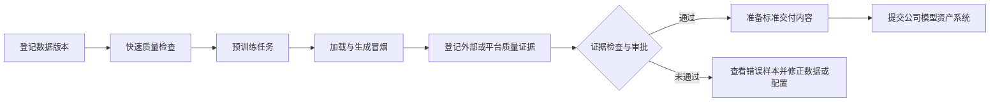
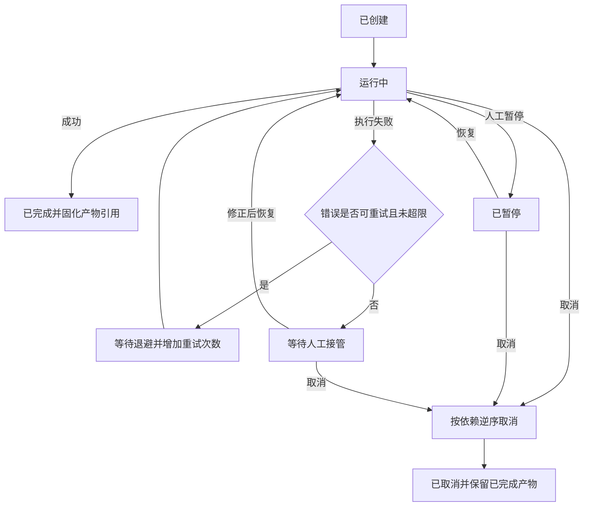
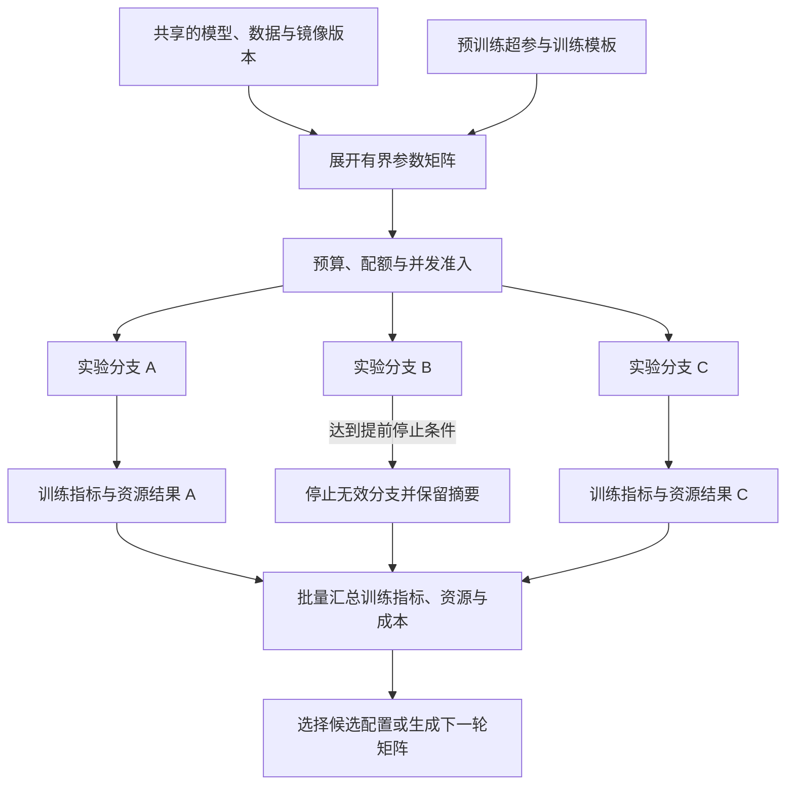

# 3.9 工作流与自动化

完整的模型生产过程会跨越数据检查、训练、质量证据收集、交付准备、审批和模型资产系统交接等多个长耗时步骤，依赖人工按顺序执行容易漏项，失败后从头重跑也会重复消耗资源。工作流与自动化模块需要用版本化引用和明确状态串联现有平台对象，统一处理重试、幂等、缓存、资源计划和人工审批，使复杂流程能够复现、从中间恢复并接受审计，同时保留关键风险节点的人工决策权。

工作流默认服务预训练与模型交付链路：统一评测未启用时，将项目指定的外部离线评测报告或人工结论作为受控证据输入；统一评测启用后，增加评测运行和质量门禁步骤。监督微调及其它后训练模块未启用时，相关模板、参数和触发器全部隐藏，不影响预训练工作流运行。

## 3.9.1 人工审批节点

### 背景介绍

模型要不要交付，不能只看自动分数。当前痛点如下：

1. 自动指标无法覆盖全部业务与合规风险。
2. 没有明确审批节点，实验模型可能绕过责任确认直接交付。

### 建设目标

外部质量证据或平台门禁结论齐备后进入交付前人工审批，审批人查看训练产物、数据授权、质量证据、成本和已知缺陷，意见、证据和拒绝原因写入交付记录，并随交付请求提交给模型资产系统。

### 建议方案

审批作为暂停型步骤，调用现有审批能力或稳定适配器；审批决策使用一次性任务和权限校验。审批模块不可用时，要求审批的流程保持等待或失败，不自动放行。

## 3.9.2 版本化工作流模板

### 背景介绍

数据检查、训练、质量证据、交付准备和审批靠人工串联时，当前痛点如下：

1. 容易漏步骤。
2. 容易复制错路径。
3. 容易读到共享目录中的“最新文件”，而不是指定版本。

### 建设目标

以可发布、回滚的`DAG`模板编排步骤，步骤之间只传递不可变数据集、基础模型资产、训练产物、质量证据和交付记录引用及校验摘要，缺失输入时给出明确原因。

### 建议方案

工作流模块只负责依赖、状态和引用传递，每个步骤仍调用现有任务、数据、证据登记、评测或交付服务；步骤之间只传递`dataset://`、模型资产系统提供的基础模型标识、`artifact://`、`evidence://`、`evaluation://`和`delivery://`等不可变引用及校验摘要，不依赖共享目录中的“最新文件”。`DAG`发布后不可修改，跨模块契约返回自身投影，不暴露`DAO`、内部实体或私有状态。

## 3.9.3 步骤状态、重试与幂等

### 背景介绍

工作流跑起来之后，当前痛点如下：

1. 单步失败后整条流程重跑，会重复消耗资源。
2. 工作流与训练任务状态不一致，可能造成重复提交和产物覆盖。

### 建设目标

按步骤配置超时、分类重试、取消、断点恢复和人工暂停，步骤状态与实际任务关联；所有运行使用输入版本和幂等键生成唯一身份，重复请求复用或显式创建新运行。

步骤运行、分类重试和人工接管的状态流转如下：

### 建议方案

使用持久状态机和事件驱动状态同步，外部调用都带幂等键；取消按依赖逆序执行并保留已完成产物。数据校验、证据登记、评测和导出可以按标准错误类型自动重试，训练任务则必须区分可恢复的节点故障和不可重试的数据或配置错误；重试策略受次数限制，超限后进入人工接管，禁止无限重试。

## 3.9.4 步骤缓存

### 背景介绍

调参时数据处理等步骤的输入常常不变；统一评测启用后，评测输入也会出现相同情况。当前痛点如下：

1. 重复执行浪费资源。
2. 反馈周期被拉长。

### 建设目标

对适合复用的数据处理步骤提供结果缓存，统一评测启用后按相同契约接入评测缓存；显示命中原因、来源运行和输入摘要，训练步骤默认不因路径相同自动复用。

### 建议方案

缓存键包含输入版本、脚本或镜像摘要和全部有效参数，缓存结果仍是不可变产物引用。缓存能力直接调用所属模块已有缓存契约，工作流不复制其内部索引。

## 3.9.5 并行实验

### 背景介绍

并行试验如果靠手工复制，当前痛点如下：

1. 复制多组预训练超参或训练模板时容易漏改参数，接入后训练和统一评测时也会出现相同问题。
2. 串行执行会延长实验周期。

### 建设目标

一个工作流可展开多组训练参数，设置并发上限并按实验组汇总训练指标、资源和成本，支持提前停止无效分支；统一评测启用后接入评测分支和质量汇总。

参数矩阵展开后的有界并行`DAG`如下：

### 建议方案

参数矩阵在提交时展开为有界`DAG`，禁止无限动态生成；分支共享不可变输入和可复用缓存。训练结果汇总从任务与实验模块批量读取投影；统一评测启用后，再通过评测模块的批量契约补充质量结果。

## 3.9.6 工作流资源计划

### 背景介绍

工作流一旦展开并行分支，当前痛点如下：

1. 可能瞬间占满队列，影响其它项目。
2. 总成本和完成时间难以预估。

### 建设目标

配置工作流预算、并发上限、步骤优先级、队列选择和超限处理，运行前展示资源计划，运行中展示实际消耗和剩余额度。

### 建议方案

基于各步骤任务规格汇总静态计划，并从治理模块批量获取配额与用量；工作流只做软规划，实际准入仍由队列和预算策略执行。

## 3.9.7 历史运行复现与差异

### 背景介绍

复现历史运行时，当前痛点如下：

1. 手工抄写历史输入和默认参数容易遗漏隐含值。
2. 评审者无法判断结果变化来自数据、镜像还是配置。

### 建设目标

从历史运行复制参数、输入引用和审批配置生成新版本，并显示数据、模型、镜像、参数、模板和质量证据规则差异；统一评测启用后补充门禁差异。

### 建议方案

历史运行保存解析后的完整规格快照，复现基于快照生成新请求；差异由结构化模式比较，不通过文本`diff`猜测语义。

## 3.9.8 事件与计划触发

### 背景介绍

流程该何时再跑，当前痛点如下：

1. 依赖人工记得在数据、镜像或交付证据变化后重跑，会漏掉更新。
2. 没有去重的自动触发可能批量误提交。

### 建设目标

支持镜像发布、数据版本发布、交付证据变化、定时计划和人工操作触发，记录触发条件、操作者、去重结果和生成的运行；统一评测启用后补充门禁变化事件。

### 建议方案

触发器只生成标准工作流提交请求，统一经过权限、预算和幂等校验；事件订阅带过滤条件和速率限制。计划与事件类型使用固定命名类型。
