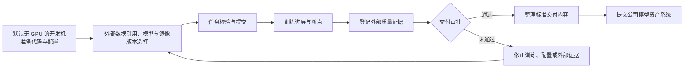
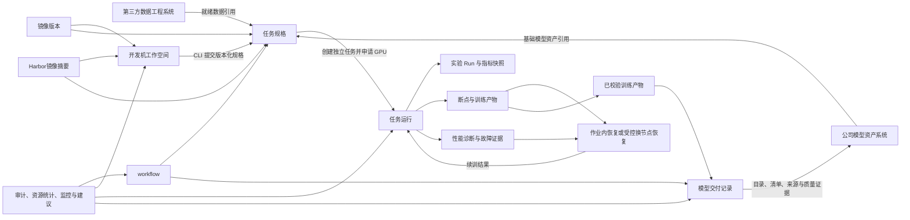

# 大模型训练平台能力规划

本文面向预训练、监督微调、偏好优化和模型交付场景，说明训练平台从作业管理工具演进为模型生产平台所需的能力、建设顺序和建议技术方案。文档只规划需要新增或改进的能力；首期已经够用的配置集版本挂载、队列与多机房调度，以及明确不建设的平台自动拉数、按机房分盘符和节点硬故障后依赖未持久化内存状态的跨节点恢复，不再作为独立功能规划。当前平台尚未建设实验分析模块，不具备实验项目、`Run`生命周期、指标快照、统一入口、`TensorBoard`看板和实验对比能力；本规划需要从最小任务关联和指标采集开始建设完整闭环，但完整曲线优先复用`TensorBoard`，不自行重建曲线引擎。

# 1. 规划基线

## 1.1 当前能力与核心问题

当前平台已经具备基础训练任务能力，支持选择团队和队列、填写镜像地址与启动命令、挂载配置集、提交`Volcano`任务，以及查看`Pod`日志和运维告警。统一可观测数据中心也已完成一期建设，可按训练任务关联部分指标、日志、事件和`FastX`告警，并支撑故障节点隔离、修复和重新入池。这些能力解决了任务提交、运行和初步排障问题，但平台整体仍以任务执行为主，尚未形成覆盖开发准备、实验分析、长周期稳定训练和模型交付的完整服务闭环。当前需要解决的核心问题如下：

1. **开发与训练环境割裂。** 算法人员需要在个人开发机和平台训练之间切换，路径、依赖、镜像与启动命令反复对齐，容易出现开发环境可运行、集群环境却失败的问题。
2. **镜像缺少统一管理。** 运行镜像依赖用户手工填写完整地址，缺少授权仓库检索、常用镜像、用途分类、平台预置镜像和不可变版本固化能力，容易产生地址错误、标签漂移与环境不可复现问题。
3. **任务规格难以复用。** 页面配置、脚本和历史命令没有共用同一份版本化规格，字段与默认值容易漂移，批量提交和历史复现成本较高。
4. **实验分析缺少统一闭环。** 任务尚未稳定关联实验项目、`Run`、指标和曲线入口，实验筛选、对比、复盘与结果复现依赖人工整理。
5. **训练进展缺少可信解释。** 列表中的“运行中”无法说明全局`iter`是否继续推进，也难以区分正常长阶段、训练停滞和指标采集异常。
6. **断点保存成本高且可恢复性不透明。** 同步断点写盘会阻塞训练进程并集中占用共享存储，已有目录文件又缺少完整性、可加载性、新鲜度和保留策略管理。
7. **局部故障恢复慢，性能劣化难发现。** 训练进程挂起或局部异常可能导致整作业释放资源并重新排队，个别慢`rank`又会持续拖低整作业吞吐，但现有平均指标难以定位疑似节点。
8. **故障证据分散，归因和处置困难。** `GPU`、`NVLink`、`NIC/IB`网络、通信框架和用户代码异常可能表现相似，现有证据不足以稳定支撑原地恢复、换节点恢复或节点隔离决策。
9. **训练输入与模型交付尚未闭环。** 第三方就绪数据引用、训练产物、外部质量证据、审批记录和模型资产交接之间缺少可追溯关联，交付仍依赖人工整理与确认。

目标用户的典型工作链路如下：

## 1.2 已确认的环境约束

1. 所有机房统一使用`/data/hpc/home`和`/share`两条网络盘路径。产品不得再暴露`/mnt/shared`、`/data/jiangsu`、`/data/liangjiang`等历史或假设路径。
2. `/data/hpc/home/<user>`用于个人代码、试验输出和个人断点，`/share`用于团队共享数据、分词器、模板和共享产物。开发机与正式训练任务必须看到一致的逻辑路径。
3. 训练平台运行在`UAT`环境，不能直连金融云生产或公网数据源。专门的第三方数据工程系统负责数据获取、清洗、脱敏、质量、授权、版本和血缘，并提供已经准备完成的稳定数据引用；训练平台只保存任务使用的引用快照，不读取或处理数据正文。
4. 本文中的`iter`统一指全局优化器更新步数，即所有训练进程完成一次梯度同步和参数更新后的计数；`epoch`表示完整遍历一次训练数据。
5. 训练平台负责离线训练、模型包校验和交付记录，不承载在线推理流量、弹性扩缩容和发布路由，也不建设离线评测作业和质量门禁。
6. 公司已有独立的模型资产团队和模型资产系统。模型注册、模型卡定稿、资产权限、生命周期、模型家族图谱及下游分发由模型资产系统负责；训练平台只负责规范训练产物并将交付目录、清单、来源摘要和质量证据提交给该系统。

数据进入平台的边界如下：

## 1.3 规划口径

每个已排期功能只规划在一个季度内完成，不允许同一功能跨季度交付。如果能力需要分阶段建设，必须拆成可独立验收的不同功能，并分别规划季度和优先级。明确标记为“可选”的方向不进入季度建设承诺，只有公司确认建设计划后再补充季度和优先级。

优先级只在同一季度内部比较，不在全局把早期季度一律标为`P0`、后期季度一律标为`P1`或`P2`。后一季度的`P0`表示该季度阶段出口所必需，并不比前一季度的`P1`更不重要，只是建设顺序不同。

|优先级|判断标准|
|---|---|
|`P0`|本季度阶段出口所必需，做不到则该季度目标无法验收|
|`P1`|本季度应当交付，能明显补齐主路径，但不阻塞阶段出口|
|`P2`|本季度内的增强项，资源不足时可让路给同季度`P0`和`P1`|
|可选|保留方向设计，但当前不排期、不作为阶段出口或资源承诺|

## 1.4 总体技术架构原则

平台以外部数据引用、镜像版本、开发机工作空间、任务规格、任务运行、实验项目与`Run`、断点、训练产物和模型交付记录为核心对象。数据获取、处理、脱敏、质量、授权、版本和血缘由第三方数据工程系统负责，训练平台只保存任务实际使用的引用快照；基础模型通过公司模型资产系统提供的不可变资产标识引用。开发机和任务规格优先引用镜像管理模块提供的不可变镜像版本，也允许引用用户从获批`Harbor`项目直接选择并在提交时固化的镜像摘要。开发机默认只申请`CPU`和内存，训练命令行（`CLI`）提交版本化任务规格后，由训练任务独立申请`GPU`；两类工作负载分别管理生命周期和资源计量。工作流只编排平台内部对象和外部稳定引用，治理能力只提供基础审计、资源容量与使用统计、使用监控和优化建议。

- 每个模块只维护自身对象和生命周期，跨模块通过稳定接口、不可变资源引用、批量查询契约或事件传递摘要，不直接访问其它模块的内部数据结构。
- 列表、聚合和图谱查询使用批量接口、分页、缓存或派生快照控制装配成本，禁止按列表项循环调用详情接口形成`N+1`查询。完整训练曲线保留在共享存储的`tfevents`或后续接入的指标存储中，日志保留在现有日志系统中，业务库只保存索引、最新指标快照和错误摘要。
- 状态、类型、阶段、动作、恢复策略等枚举在代码中用固定命名类型表达，前端运行时文案使用中文，不建设字典模块和`i18n`语言包；功能模块禁用后，前端入口和字段完全隐藏，后端可选依赖降级为空结果或跳过非强制步骤，历史数据继续保留并可在重新启用后恢复。
- 新增适配层只用于隔离已确认的变化点，例如不同训练框架、第三方数据引用和模型资产系统接入协议；稳定的项目、任务和交付能力优先直接调用现有服务契约，避免重复建设窄接口。
- 平台沿用算法工程师、`SRE`工程师和平台管理员三类内置角色及现有数据可见范围，不建设项目级角色、对象级资源授权或临时权限模型。
- 平台不将`Determined`、完整`Kubeflow`或其它单一开源平台作为整体二次开发底座；训练框架通过受控模板与适配器接入，数据工程能力留在第三方数据工程系统，离线评测不在训练平台内建设。

# 2. 能力规划概览

本章先说明十个大模块的建设必要性和长期发展方向，再给出可独立验收的具体功能、季度和优先级。各模块不是并列菜单，而是按“统一开发与运行入口、建立可复现训练链路、形成可治理的模型产出、支持平台内部工作流和后训练”的主线逐步演进。

### 2.1 模块划分与发展方向

| 模块 | 建设必要性 | 发展方向 |
|---|---|---|
| [开发环境与配置](./3.1-开发环境与配置.md) | 开发验证和集群训练现在是两套环境，镜像、路径和配置对不上，问题往往要占用`GPU`后才暴露；开发机如果长期占用`GPU`，代码编辑和配置准备阶段还会造成资源空转。统一开发环境与任务规格，是降低环境切换成本、提前暴露配置问题并保障训练可复现的必要基础。 | 先建默认无`GPU`的受控开发机并统一路径，再让页面与`CLI`共用任务规格；需要`GPU`时由独立训练任务申请。不建设直连`SSH`、动态挂卡、一键拉数、源码托管或镜像构建。 |
| [镜像管理](./3.2-镜像管理.md) | 镜像决定训练框架、`CUDA`环境、系统依赖和启动入口。仅靠用户手工填写地址或使用可漂移标签，无法稳定追溯任务的实际环境，也会放大兼容性、权限和供应链风险。 | 先把获批`Harbor`范围内的镜像变为可检索、可分类和可复用的候选项，再以不可变摘要、兼容信息和扫描摘要固化运行环境，为任务校验、安全策略和历史复现提供依据；不在训练平台内重建源码仓库和镜像构建流水线。 |
| [训练任务管理](./3.3-训练任务管理.md) | 平台已经能提交任务，但错误配置要等占用`GPU`后才失败，“运行中”无法说明调度是否阻塞、训练是否还在推进，创建人也不能及时获知关键事件。补齐任务校验和运行过程可见性，才能减少无效占卡、缩短故障发现与定位时间，并为训练任务可靠运行提供基础。 | 先固化第三方就绪数据引用，并在占卡前完成校验；再补齐`Pod`调度解释、进展提示、事件通知和日志定位。进展判断依赖实验分析的最小指标快照，并复用现有监控告警底座，不读取或清洗训练数据内容。 |
| [实验分析](./3.4-实验分析.md) | 模型能力来自多次数据、超参和策略试验的比较，任务执行成功并不等于实验结果有价值。没有稳定的实验项目、`Run`与指标关联，团队无法快速筛选候选实验、解释变化原因或支持停滞判断。 | 先建立`job_id`、`Run`和指标存储之间的最小关联，以关键指标快照支持进展判断和快速排序；再补齐实验组织、`TensorBoard`按需看板和多`Run`对比；后续通过`SwanLab Local`等受控适配扩展协作分析。 |
| [断点与故障恢复](./3.5-断点与故障恢复.md) | 长周期、多节点训练中，同步断点会阻塞所有训练进程，局部进程异常可能导致整作业重排队，单个慢`rank`会拖低全局吞吐，硬件、网络和软件故障又难以快速区分。缺少标准化容错能力时，各算法团队还需重复实现检测、断点和重启逻辑。 | 先建设异步与本地分层`Checkpoint`、作业内快速恢复和统一容错接入，再建设慢`rank`检测、硬件健康诊断、分布式日志证据聚合与故障规则治理；对节点硬故障继续使用受白名单、重试、预算和熔断约束的`guarded`换节点恢复。证据契约稳定后可选试点`AI Native`故障辅助，不让大模型替代确定性恢复门禁。 |
| [平台治理](./3.6-平台治理.md) | 三个服务分开部署会持续增加发布、版本协同和故障排查成本，也阻碍多人用`AI`协作；关键操作缺少审计，资源容量和实际使用情况无法量化，扩容缺乏依据。建设统一的基础治理能力，是降低平台维护成本、追溯关键操作并支撑资源决策的必要条件。 | 先合并为单服务并完成功能回归，再建设基础审计；使用规模起来后补容量统计、监控和带证据的优化建议，且不自动改任务或配额，也不扩展为计费、新权限或开放平台。 |
| [模型产物交付](./3.7-模型产物交付.md) | 不同训练任务的输出目录、文件组织和交付口径不一致时，模型交接需要人工整理和反复确认，模型资产系统也难以稳定接收。建立标准化、规范化的交付逻辑并对接模型资产系统，是让训练产物可靠进入后续资产管理流程的必要条件。 | 先统一交付目录、命名、文件清单和完整性校验，再按模型资产系统的接口规范完成提交、接收回执、失败重试和状态同步；训练平台不重复建设模型资产管理能力。 |
| [工作流与自动化](./3.8-工作流与自动化.md) | 任务创建、参数调整、批量执行、状态检查、失败重试和结果整理等重复操作如果依赖人工逐项处理，效率低且容易漏项、错配或重复执行。将这类稳定、重复且易错的操作沉淀为可复用的自动化流程，是提升执行效率和减少人为错误的必要手段。 | 先从高频重复操作中提炼版本化流程模板，再补齐步骤状态、失败重试、结果复用、有界并行和内部触发，使自动化过程可观察、可暂停并允许人工干预；不对外提供通用工作流接口。 |
| [监督微调与后训练](./3.10-监督微调与后训练.md) | 当业务需要让基础模型遵循指令、适配特定任务或产生结构化行为时，监督微调是重要的能力扩展方向。如果把全量`SFT`、`LoRA`或`QLoRA`当作普通预训练任务，会遗漏消息模板、监督范围、基础模型兼容性、差异化产物和质量证据等约束。 | 当前保留设计而不排期。待业务目标、第三方就绪数据、外部质量标准、资源预算和责任人明确后，从类型化任务、基础模型约束和外部数据协议摘要起步，再补齐资源估算、断点恢复、产物来源和外部质量证据，最后扩展早停、遗忘控制、切片分析、多模态和工具调用。 |
| [强化学习后训练](./3.11-强化学习后训练.md) | 当业务需要优化偏好对齐、复杂推理、工具使用或可验证目标时，强化学习能够引入奖励信号。这类训练涉及多种模型角色、样本生成和参数更新，如果没有额外治理，容易出现奖励投机、训练不稳定、安全退化和资源失控。 | 当前仅作为可选方向。启动前必须具备可用的监督微调基线、外部质量证据、明确的奖励目标和独立资源预算；建设时先登记奖励资产，再小规模验证多角色运行、阶段产物和恢复能力，最后在奖励、`KL`和安全指标受控的前提下扩大规模；平台只适配训练方法，不重复实现算法。 |

### 2.2 功能排期与优先级

|模块|功能|功能描述|解决痛点/场景|计划周期|优先级|
|---|---|---|---|---|---|
|平台治理|训练平台服务合并与功能回归|将`mlp-train-web`、`mlp-train-api`和`acs-server`合并为一个服务，统一启动、配置、路由、鉴权、日志、监控和发布；覆盖现有核心功能完成端到端回归，确认合并前后的接口和用户行为一致|多服务部署、通信、版本协同和故障排查增加架构与维护成本，阻碍多人共同使用`AI`维护同一项目、共同迭代与测试|`2026Q4`|`P0`|
|实验分析|实验项目与`Run`管理|提供训练中心统一入口，按工作集群和项目组织实验，支持筛选、分页、移动、删除、历史任务补建及任务与实验互访|实验数量增长后只能靠任务名称查找，任务与实验需要反复搜索且容易关联错误，历史任务和未归类实验容易丢失|`2026Q4`|`P0`|
|实验分析|关键指标快照与快速排序|先交付可按`job_id`批量读取的最小指标快照，作为训练进展判断的前置能力；再将最新`Loss`、进度、吞吐、最后一步时间、指标采集时间和读取错误用于服务端筛选、排序和分页|逐个打开完整曲线才能判断进展，团队无法快速定位异常或候选实验|`2026Q4`|`P0`|
|实验分析|`TensorBoard`按需打开|在实验详情按需启动看板，通过平台鉴权的同源地址嵌入或新标签打开，空闲后自动回收|看板常驻浪费资源，直接暴露机房端口又绕过平台权限与审计|`2026Q4`|`P0`|
|实验分析|实验对比|选择多条`Run`并排比较关键指标和超参差异，同机房时再打开完整曲线对比|手工切换页面难以解释实验差异，跨机房强行叠加曲线不可用|`2026Q4`|`P0`|
|实验分析|`Run`生命周期与异常降级|先交付`job_id`、`Run`和`tfevents`目录的最小关联，作为指标采集和训练进展判断的前置能力；读盘或看板失败时保留任务状态和历史数据并给出可理解提示|实验创建失败可能影响训练主链路，空指标被误显示为`0`会造成错误判断|`2026Q4`|`P0`|
|断点与故障恢复|`Checkpoint`管理与高效保存|按任务管理断点频率、回退量、版本、完整性和保留策略；官方模板支持异步写入和本地分层保存，明确区分本地可用与共享存储已持久化|同步断点让所有训练进程等待并集中占用共享存储；断点只是目录文件时又无法判断是否真正可恢复|`2026Q4`|`P0`|
|断点与故障恢复|作业内快速恢复|对节点仍健康的可恢复挂起或进程异常，保留当前作业资源并重建进程组；对已验证异常试点进程内恢复，并以断点加载和新全局`iter`推进验证成功|局部进程异常导致整作业释放资源、重新排队和重建环境，数小时算力与训练进度可能因此损失|`2026Q4`|`P0`|
|断点与故障恢复|慢`rank`与性能劣化检测|比较各`rank`的步耗时、吞吐、`GPU`和`CPU`时间，生成带异常时段、疑似`rank`、节点和基线差异的报告|单个慢节点会拖低全部训练吞吐，只看作业平均值很难定位责任节点|`2026Q4`|`P0`|
|断点与故障恢复|故障归因与健康诊断|聚合`NVML`硬件健康、`NVLink`、`NIC/IB`、`NCCL`错误、多`rank`日志、调度事件和训练进展，输出已确认、疑似、未知或证据冲突的可追溯报告|`GPU`、网络、分布式通信和用户代码故障表现相似，证据分散会导致无效重试和错误隔离|`2026Q4`|`P0`|
|断点与故障恢复|再次提交与恢复策略|复用任务配置并校验断点、模型、外部数据引用、并行和目录占用，记录实际恢复结果|再次提交不等于恢复，配置变化可能误加载或覆盖产物|`2026Q4`|`P1`|
|断点与故障恢复|故障规则治理与复盘|复用现有故障样本和可观测证据，管理规则责任人、版本、阈值和优先级，通过离线回放、影子验证、评审、灰度和回滚持续校准|现有规则随故障类型和环境变化容易产生误报、漏报，未经验证的规则也不能安全驱动恢复|`2026Q4`|`P1`|
|断点与故障恢复|容错组件标准化接入|提供模块化容错`API`、统一容错启动器和框架适配层，在官方训练模板中对`DDP`、`PyTorch Lightning`等训练代码提供统一配置和故障上报|各算法团队自行实现挂起检测、快速重启和高效断点工作量大，多套实现难以统一治理|`2026Q4`|`P1`|
|开发环境与配置|开发机工作空间|提供默认`GPU`请求为`0`的`Web Shell`、可选`JupyterLab`和持久目录；复用现有团队、资源队列和网络盘，接入同期建设的镜像选择能力，并在连续空闲`60`分钟后回收通用计算资源|算法人员要在个人开发机和平台训练之间来回切换，两套环境带来心智负担；开发机若随交互会话长期申请`GPU`，编辑和配置准备阶段会持续空转占卡|`2027Q1`|`P0`|
|开发环境与配置|统一路径规范|统一示例、模板和校验中的输入、输出与断点路径|历史盘符导致跨集群失败或产物写入错误位置|`2027Q1`|`P0`|
|镜像管理|`Harbor`检索与常用镜像管理|按需检索授权`Harbor`项目，支持直接选择或保存为常用镜像，标记训练或开发用途，支持平台预置两类公共镜像|常用镜像依赖用户记忆，平台无法沉淀和分类经过验证的运行环境|`2027Q1`|`P0`|
|镜像管理|分类检索选择与版本固化|训练任务和开发机优先展示适用的已保存镜像和平台预置镜像，同时允许按关键字直接检索并选择`Harbor`镜像，提交时固化不可变摘要|手工地址容易拼错，强制先保存又会打断创建流程；错误用途和漂移标签会导致任务启动失败或运行环境不一致|`2027Q1`|`P0`|
|训练任务管理|提交前校验与预览|校验第三方数据引用、挂载位置、并行关系和结构化配置，预览实际读写范围|明显错误在排队后才暴露，用户误以为平台会搬运或处理数据|`2027Q1`|`P0`|
|训练任务管理|调度过程可视化|以`Pod`为展示单元呈现队列准入、整组等待、资源匹配、调度、镜像拉取和容器启动过程|任务级“排队中”无法定位具体阻塞`Pod`和资源缺口，用户只能反复询问运维|`2027Q1`|`P0`|
|训练任务管理|任务运行事件通知|统一接收任务事件，默认通知任务创建人和负责人；先覆盖不依赖实验指标的任务原生事件，疑似停滞通知在训练进展与停滞提示完成后接入；首期完成飞书送达，按企业能力接入`FastX`统一路由，并支持邮件备用|算法人员无法持续守在页面，关键故障容易错过处理窗口；通知渠道和接收规则不清又会导致消息漏发或发送失败后无人知晓|`2027Q1`|`P0`|
|开发环境与配置|训练任务模板|提供版本化模板，并联合校验资源、并行、批次、显存和挂载配置|训练配置依赖个人经验，任务在分配资源后才因参数冲突失败|`2027Q1`|`P0`|
|开发环境与配置|训练命令行（`CLI`）与统一任务规格|页面和命令行共用版本化`train.yaml`及一致的校验、提交、日志和取消能力；从开发机提交时创建独立训练任务，并按任务规格重新申请`GPU`|页面、脚本和历史命令字段漂移，批量训练难以自动化和复现；直接在开发机进程中运行训练又会耦合交互会话与`GPU`生命周期|`2027Q1`|`P1`|
|训练任务管理|训练进展与停滞提示|复用实验分析先行交付的最小指标快照与任务关联能力，记录最后全局`iter`及实际发生时间、吞吐、指标采集时间、任务阶段和最近完整断点；连续多个观察窗口没有进展时给出带依据的疑似停滞提示|通信挂起、慢`rank`或数据读取阻塞时，任务和进程可能仍显示运行中；单看任务状态或`GPU`利用率无法判断优化器是否推进，单看`iter`又可能把评测和断点保存误报为故障|`2027Q1`|`P1`|
|训练任务管理|任务列表进展摘要|展示当前`iter`、步耗时、吞吐、预计剩余时间、最后一步时间、指标采集时间和进展状态，支持按疑似停滞时长筛选与排序|任务列表无法区分正常推进、进展变慢、疑似停滞和指标采集失败|`2027Q1`|`P1`|
|训练任务管理|任务详情与日志定位|统一展示实际路径，并按进程、节点、时间和关键字检索日志|多机日志和实际读写位置不透明，排障耗时长|`2027Q1`|`P1`|
|断点与故障恢复|停止信号与风险提示|停止前显示最后完整断点和预计丢失步数；正常停止先发送`SIGTERM`，默认等待`30`秒由训练进程主动落盘退出，超时再强制终止|值班人员无法判断停止会丢失多少进度，训练进程也缺少统一的优雅退出和强制停止规范|`2027Q1`|`P1`|
|训练任务管理|任务输入与引用快照|选择第三方数据工程系统提供的数据标识、不可变版本和可挂载位置，并在提交时保存引用快照|只记录可变路径会导致历史任务无法确认实际输入，平台自行扫描内容又会越过数据工程边界|`2027Q1`|`P1`|
|平台治理|基础审计日志|记录操作者、现有角色、时间、来源、动作、对象、请求追踪标识和结果摘要，并支持基础条件检索|关键操作只保留最终状态时，无法还原谁在何时对什么对象执行了什么操作|`2027Q1`|`P1`|
|断点与故障恢复|无人值守故障恢复|消费已经发布且通过验证的故障规则，提供`manual`与`guarded`模式；对白名单故障自动选择最近合法断点、换节点创建子运行并验证全局`iter`继续推进，超过次数、回退量或预算上限时自动熔断|故障恢复依赖人工翻日志、找断点和重新提交，夜间的可恢复任务长时间停顿；盲目自动重试又会反复失败并浪费资源|`2027Q1`|`P1`|
|实验分析|`SwanLab Local`实验分析适配|关联平台`Run`与内网`SwanLab Local`实验，同步白名单摘要指标，并从实验详情打开经认证的内网分析页面|团队后续需要继续使用内网`SwanLab Local`的记录、协作分析和报告能力，但直接切换平台会造成实验索引、权限和指标排序割裂|`2027Q1`|`P2`|
|模型产物交付|交付目录与产物规范|区分训练输出与正式交付内容，并统一`/share/model-deliveries/<project>/<delivery_id>/`目录结构|个人目录可能被覆盖或清理，下游难以区分权重、断点和临时文件|`2027Q2`|`P0`|
|模型产物交付|交付清单与完整性校验|生成不可变`manifest`并校验文件、分片、哈希、格式、分词器和最小生成|只交付目录路径无法证明内容完整且可加载|`2027Q2`|`P0`|
|模型产物交付|交付元数据与来源摘要|汇总训练使用的外部数据引用、镜像、交付校验、审批、外部质量证据和基础模型资产标识|模型资产系统只收到权重时无法建立可靠来源与质量证据|`2027Q2`|`P0`|
|工作流与自动化|人工审批节点|外部或人工质量证据齐备后由现有授权用户执行交付前审批|自动指标无法覆盖所有业务风险，实验产物可能绕过确认|`2027Q2`|`P0`|
|工作流与自动化|版本化工作流模板|以外部数据引用、训练、外部质量证据、交付准备和审批组成平台内部`DAG`|人工复制路径容易漏步骤、串版本和形成流程差异|`2027Q3`|`P0`|
|工作流与自动化|步骤状态、重试与幂等|按步骤管理超时、取消、恢复、人工暂停和唯一运行|单步失败导致整条流程重跑，重复提交覆盖产物|`2027Q3`|`P0`|
|模型产物交付|模型资产系统交接|向公司模型资产系统提交交付目录、清单、来源摘要和质量证据，并记录资产标识与接收回执|人工发送目录容易交错版本、遗漏证据且无法确认是否接收|`2027Q3`|`P0`|
|工作流与自动化|步骤缓存|按输入引用、镜像和参数复用交付准备等可重入步骤，训练步骤默认不缓存|调参时重复执行不变步骤，浪费资源和时间|`2027Q3`|`P0`|
|平台治理|资源容量与使用统计|按任务、团队和项目汇总资源容量、申请量、分配量、运行时长、利用率、排队和空闲趋势|调度与监控事实分散，用户无法解释容量压力和资源使用效率|`2027Q3`|`P0`|
|工作流与自动化|并行实验|并行多组预训练超参或训练模板并汇总训练指标和资源使用；后训练上线后再接入对应参数矩阵|手工复制任务容易漏改参数，串行试验反馈慢|`2027Q3`|`P1`|
|工作流与自动化|工作流资源计划|配置并发、优先级、队列、单次运行资源上限和超限处理策略|并行分支可能瞬间占满队列且资源需求不可预估|`2027Q3`|`P1`|
|工作流与自动化|历史运行复现与差异|基于历史输入和参数生成新运行并显示完整差异|手工抄配置会遗漏默认值，评审者无法解释结果变化|`2027Q3`|`P1`|
|平台治理|资源使用监控|按明确窗口和阈值识别长时间空闲、持续低利用率、申请与使用偏差、异常排队和容量逼近上限|只有事后统计时，运维人员难以及时定位需要关注的任务、团队和项目|`2027Q3`|`P1`|
|模型产物交付|交付状态、重试与清理|以`delivery_id`幂等重试，记录拒绝或接收回执，并在确认接收和保留期结束后清理暂存目录|外部系统故障可能造成重复资产，过早清理又会丢失交付内容|`2027Q3`|`P1`|
|工作流与自动化|事件与计划触发|按平台内镜像、训练产物、交付证据变化、定时计划或人工操作触发流程|依赖人工记忆会漏跑，自动触发缺少去重又会批量误提交|`2027Q3`|`P1`|
|平台治理|资源优化建议|基于确定性规则提供任务、团队和项目的优化建议、证据、统计窗口和预期影响，不自动修改资源|仅提示利用率异常无法帮助用户判断应采取的措施，自动调优又可能影响训练稳定性|`2027Q3`|`P2`|
|监督微调与后训练|任务类型与基础模型约束|区分全量`SFT`、`LoRA`、`QLoRA`等任务并校验基础模型兼容性|将微调当作预训练会漏掉模板、产物和质量证据要求|未排期|可选|
|监督微调与后训练|就绪数据协议引用与训练参数|保存第三方数据标识、版本、消息协议和监督摘要，校验训练模板与协议兼容性，不读取样本执行数据工程|外部数据引用缺少协议摘要或与训练模板不兼容时，任务可能在启动后失败|未排期|可选|
|监督微调与后训练|微调策略与资源估算|配置`LoRA/QLoRA`、精度、分布式策略并估算显存、时长和存储|错误组合在申请资源后才失败，资源规格容易过大或不足|未排期|可选|
|监督微调与后训练|微调断点恢复|恢复权重、优化器、调度器、随机状态、数据游标和模板配置|只恢复权重会改变学习率和样本顺序，结果不可比较|未排期|可选|
|监督微调与后训练|微调产物分类与来源|区分基础模型、`adapter`、合并模型、断点和外部质量证据，并记录外部数据引用|产物混放会导致加载错误和父子模型关系丢失|未排期|可选|
|监督微调与后训练|模型合并与导出校验|提供`adapter`合并、权重导出、格式检查和生成冒烟测试|训练产物可能直到交付时才暴露无法加载的问题|未排期|可选|
|监督微调与后训练|模型卡草稿|依据任务运行、外部数据引用和外部质量证据生成用途、限制、参数和质量证据摘要|只有权重没有使用边界和风险信息，业务方无法评审|未排期|可选|
|监督微调与后训练|早停与最佳断点|支持按验证指标早停并区分最佳断点和最新可恢复断点|固定步数可能过拟合，最后断点不一定质量最佳|未排期|可选|
|监督微调与后训练|回放集与遗忘控制|引用第三方数据工程系统提供的通用、安全和领域数据混合版本，并比较微调前后退化|领域能力提升可能以通用能力和安全拒答退化为代价|未排期|可选|
|监督微调与后训练|切片分析|按长度、语言、业务标签、难度和能力标签对比结果|总体均分会掩盖少数语言和高风险样本退化|未排期|可选|
|监督微调与后训练|多模态与工具调用扩展|消费第三方数据工程系统提供的媒体引用、协议和模态`token`摘要，并校验训练运行时兼容性|后续增加图文、音频或工具调用会破坏现有文本协议|未排期|可选|
|强化学习后训练|奖励资产登记|登记奖励模型或规则奖励的版本、范围、第三方校准数据引用和限制|奖励逻辑隐藏在脚本中，实验目标和变化无法追溯|未排期|可选|
|强化学习后训练|强化学习运行与安全监控|编排多角色模型和`rollout`资源，监控奖励、`KL`、拒答率和安全指标|多阶段失败难恢复，奖励投机不能仅靠总奖励发现|未排期|可选|
|断点与故障恢复|`AI Native`智能故障辅助|只读聚合故障证据、历史规则和复盘知识，生成带引用的诊断摘要与处置建议；高风险动作继续由确定性规则、人工确认和审计约束|告警、指标、日志和事件分散，人工关联证据和复用排障经验耗时；让智能建议直接执行恢复又会放大误判风险|未排期|可选|

# 3. 参考资料

## 3.1 开源项目

|参考项目|重点借鉴的功能设计|本规划中的对应能力|
|---|---|---|
|[Cube Studio](https://github.com/data-infra/cube-studio)|在线`Notebook`、镜像与任务模板、`K8S/Volcano`训练、多租户权限、`Pipeline`、资源计量和`TensorBoard`入口|默认无`GPU`的开发机工作空间、镜像管理、训练任务模板、独立训练任务提交、调度过程可视化、平台内部工作流、资源容量与使用统计、资源使用监控、实验分析；不借鉴其多租户角色体系|
|[Kubeflow](https://www.kubeflow.org/docs/)|`Notebook`、分布式训练对象与状态、组件化训练运行时和`Pipeline DAG`|开发机工作空间、训练命令行（`CLI`）与统一任务规格、训练任务管理、版本化工作流模板；不引入完整`Kubeflow`平台|
|[SkyPilot](https://docs.skypilot.co/en/latest/reference/training-guide.html)|版本化`YAML`、`CLI`与不同执行环境一致的提交体验|训练平台内部使用的训练命令行（`CLI`）与统一任务规格、历史运行复现与差异；不建设对外接口，当前执行后端继续使用既有`Volcano`能力|
|[JupyterHub](https://jupyterhub.readthedocs.io/)、[Open OnDemand](https://osc.github.io/ood-documentation/latest/)|多用户交互式环境、按用户启动运行环境和受认证的反向代理入口|默认无`GPU`的开发机工作空间中的`Web Shell`、可选`JupyterLab`、持久目录、平台鉴权和通用计算资源空闲回收|
|[Harbor](https://goharbor.io/docs/main/)|按项目授权访问仓库、检索镜像、管理标签并使用不可变摘要|`Harbor`检索与常用镜像管理、分类检索选择与版本固化|
|[MLflow](https://mlflow.org/docs/latest/ml/)、[ClearML](https://clear.ml/docs/latest/docs/)、[SwanLab](https://docs.swanlab.cn/)、[TensorBoard](https://www.tensorflow.org/tensorboard)|实验、`Run`、参数与指标记录、实验筛选对比和完整曲线看板|实验项目与`Run`管理、关键指标快照、实验对比、`TensorBoard`按需打开和`SwanLab Local`适配|
|[Data-Juicer](https://github.com/modelscope/data-juicer)、[NeMo Curator](https://docs.nvidia.com/nemo/curator/latest/)、[OpenLineage](https://openlineage.io/docs/)|数据清洗、质量与去重、数据版本处理记录和跨任务血缘|由第三方数据工程系统选型和承接；训练平台只消费该系统输出的就绪数据引用|
|[EvalScope](https://evalscope.readthedocs.io/en/latest/)、[lm-evaluation-harness](https://github.com/EleutherAI/lm-evaluation-harness)|统一评测入口、评测任务配置、指标聚合和样本级结果|明确不建设。质量证据由项目指定的外部离线评测报告或人工结论进入交付与审批，训练平台只校验证据是否齐备|
|[NeMo容错能力](https://docs.nvidia.com/nemo-framework/user-guide/25.02/resiliency.html)|训练故障检测、断点保存、作业重启和恢复证据|高效`Checkpoint`、慢`rank`检测、故障归因与健康诊断、作业内快速恢复、故障规则治理与复盘、再次提交与恢复策略、容错组件标准化接入和无人值守故障恢复|
|[Transformers](https://huggingface.co/docs/transformers/main/en/index)、[PEFT](https://huggingface.co/docs/peft/index)、[TRL](https://huggingface.co/docs/trl/index)、[ms-swift](https://swift.readthedocs.io/en/latest/)|聊天模板、`LoRA/QLoRA`、监督微调、偏好优化和强化学习训练协议|监督微调与后训练、强化学习后训练两个可选模块；在公司确认业务目标和资源预算前不进入季度承诺|

## 3.2 商业平台

|参考产品|重点借鉴的功能设计|本规划中的对应能力|
|---|---|---|
|[阿里云人工智能平台PAI](https://help.aliyun.com/zh/pai/)|交互式开发环境、`DLC`分布式训练任务、任务配置与观测，以及`EasyCKPT`断点能力|默认无`GPU`的开发机工作空间、通过`CLI`创建的独立训练任务、训练任务模板、提交前校验、任务详情与日志定位、断点与故障恢复|
|[Amazon SageMaker AI](https://docs.aws.amazon.com/sagemaker/latest/dg/whatis.html)、[SageMaker HyperPod](https://docs.aws.amazon.com/sagemaker/latest/dg/sagemaker-hyperpod.html)|开发环境、训练任务、实验、流水线、模型注册协作，以及集群健康检查和自动恢复|开发环境与配置、训练任务管理、实验分析、工作流与自动化、任务可靠性策略、故障规则治理与复盘、`Checkpoint`管理与完整性、无人值守故障恢复；模型注册由模型产物交付模块对接公司模型资产系统|
|[NVIDIA Run:ai](https://run-ai-docs.nvidia.com/)|项目与部门资源治理、交互式工作空间、训练工作负载、`GPU`配额和利用率管理|开发机与独立训练任务的资源分离、任务、团队和项目的资源容量与使用统计、资源使用监控、资源优化建议及调度过程可视化；不增加项目角色或资源授权模型|
|[Azure Machine Learning](https://learn.microsoft.com/en-us/azure/machine-learning/overview-what-is-azure-machine-learning)|工作空间、计算资源、训练任务、`MLflow`实验、流水线和模型注册协作|开发环境与配置、实验分析、平台内部工作流和平台治理；模型注册仍按公司模型资产系统边界交接|
