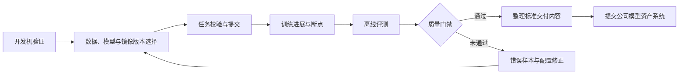
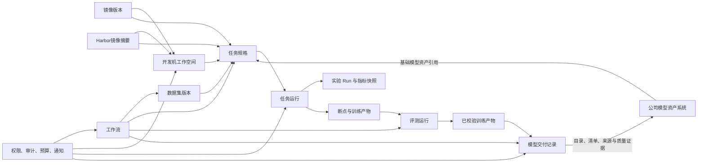

# 大模型训练平台能力规划

本文面向预训练、监督微调、偏好优化、评测和模型交付场景，说明训练平台从作业管理工具演进为模型生产平台所需的能力、建设顺序和建议技术方案。文档只规划需要新增或改进的能力；首期已经够用的配置集版本挂载、队列与多机房调度，以及明确不建设的平台自动拉数、按机房分盘符和不落盘恢复，不再作为独立功能规划。当前平台尚未建设实验分析模块，不具备实验项目、`Run`生命周期、指标快照、统一入口、`TensorBoard`看板和实验对比能力；本规划需要从最小任务关联和指标采集开始建设完整闭环，但完整曲线优先复用`TensorBoard`，不自行重建曲线引擎。

# 1. 规划基线

## 1.1 当前能力与核心问题

当前平台已经能够选择团队和队列、手工填写镜像地址与启动命令、挂载配置集、提交`Volcano`任务，并查看`Pod`日志和运维告警。训练任务要求用户自己填写完整镜像地址，规划中的开发机如果沿用同样方式，也会复制这一问题。平台尚未对接任何`Harbor`仓库，也未提供保存常用镜像、区分训练与开发用途以及发布平台预置镜像的管理能力。任务详情里的监控页尚未对接监控数据，不能查看`GPU`利用率、温度或`IB`带宽。当前也没有实验分析模块，任务不会自动建立`Run`，平台不能采集关键指标快照、打开受平台鉴权保护的`TensorBoard`看板或进行实验筛选和对比。主要缺口不在“能否提交任务”，而在下面这些痛点：

1. 开发与训练是两套环境。算法人员一边在自己的开发机上改代码、跑试验，一边到平台上提交训练，路径、镜像、依赖和命令要来回对齐，心智负担大，也容易出现“这边能跑、那边找不到文件”。
2. 训练任务的运行镜像由用户手工填写，规划中的开发机也缺少可直接复用的镜像管理能力；镜像地址容易拼错，标签可能漂移，常用镜像不能保存和分类，平台也无法预置经过验证的训练镜像与开发机镜像供算法人员直接使用。
3. 任务规格无法在页面、脚本和历史命令之间复用，字段容易漂移。
4. 断点不可验证，故障恢复依赖人工翻目录、改配置和重新提交。
5. 训练进度不可解释，列表里的“运行中”不能说明优化器是否仍在更新。
6. 后训练所需的数据、评测、训练产物交付和审批对象尚未形成闭环。
7. 平台没有实验项目、`Run`和曲线入口，用户只能从任务状态和日志间接判断训练情况，既无法集中查看完整曲线，也无法按关键指标快速筛出值得关注的实验。

目标用户的典型工作链路如下：

## 1.2 已确认的环境约束

1. 所有机房统一使用`/data/hpc/home`和`/share`两条网络盘路径。产品不得再暴露`/mnt/shared`、`/data/jiangsu`、`/data/liangjiang`等历史或假设路径。
2. `/data/hpc/home/<user>`用于个人代码、试验输出和个人断点，`/share`用于团队共享数据、分词器、模板和共享产物。开发机与正式训练任务必须看到一致的逻辑路径。
3. 训练平台运行在`UAT`环境，不能直连金融云生产或公网数据源。数据由有权限的人员先拷贝到网络盘，平台只负责登记、校验、授权和只读引用，不负责下载、同步或入湖。
4. 本文中的`iter`统一指全局优化器更新步数，即所有训练进程完成一次梯度同步和参数更新后的计数；`epoch`表示完整遍历一次训练数据。
5. 训练平台负责离线训练、评测、模型包校验和交付记录，不承载在线推理流量、弹性扩缩容和发布路由。
6. 公司已有独立的模型资产团队和模型资产系统。模型注册、模型卡定稿、资产权限、生命周期、模型家族图谱及下游分发由模型资产系统负责；训练平台只负责规范训练产物并将交付目录、清单、来源摘要和质量证据提交给该系统。

数据进入平台的边界如下：

## 1.3 规划口径

每个已排期功能只规划在一个季度内完成，不允许同一功能跨季度交付。如果能力需要分阶段建设，必须拆成可独立验收的不同功能，并分别规划季度和优先级。明确标记为“可选”的方向不进入季度建设承诺，只有公司确认建设计划后再补充季度和优先级。

优先级只在同一季度内部比较，不在全局把早期季度一律标为`P0`、后期季度一律标为`P1`或`P2`。后一季度的`P0`表示该季度阶段出口所必需，并不比前一季度的`P1`更不重要，只是建设顺序不同。

|优先级|判断标准|
|---|---|
|`P0`|本季度阶段出口所必需，做不到则该季度目标无法验收|
|`P1`|本季度应当交付，能明显补齐主路径，但不阻塞阶段出口|
|`P2`|本季度内的增强项，资源不足时可让路给同季度`P0`和`P1`|
|可选|保留方向设计，但当前不排期、不作为阶段出口或资源承诺|

季度目标为：`2026 Q4`优先完成训练平台服务合并与功能回归，再建设开发机、镜像管理与实验分析相关能力；`2027 Q1`完成训练可靠性和基础治理；`2027 Q2`完成数据治理和模型交付规范；`2027 Q3`完成工作流、模型资产系统交付、资源治理和受控自动化；`2027 Q4`完成离线评测和数据漂移分析。监督微调、强化学习及其它后训练能力当前均不纳入季度规划，仅作为可选方向保留。

## 1.4 总体技术架构原则

平台以数据集版本、镜像版本、开发机工作空间、任务规格、任务运行、实验项目与`Run`、断点、评测运行、训练产物和模型交付记录为核心对象。基础模型通过公司模型资产系统提供的不可变资产标识引用；开发机和任务规格优先引用镜像管理模块提供的不可变镜像版本，也允许引用用户从获批`Harbor`项目直接选择并在提交时固化的镜像摘要。工作流只编排这些对象的不可变引用，治理能力提供统一的项目、权限、审计、预算和通知约束。

- 每个模块只维护自身对象和生命周期，跨模块通过稳定接口、不可变资源引用、批量查询契约或事件传递摘要，不直接访问其它模块的内部数据结构。
- 列表、聚合和图谱查询使用批量接口、分页、缓存或派生快照控制装配成本，禁止按列表项循环调用详情接口形成`N+1`查询。完整训练曲线保留在共享存储的`tfevents`或后续接入的指标存储中，日志保留在现有日志系统中，业务库只保存索引、最新指标快照和错误摘要。
- 状态、类型、阶段、动作、恢复策略等枚举在代码中用固定命名类型表达，前端运行时文案使用中文，不建设字典模块和`i18n`语言包；功能模块禁用后，前端入口和字段完全隐藏，后端可选依赖降级为空结果或跳过非强制步骤，历史数据继续保留并可在重新启用后恢复。
- 新增适配层只用于隔离已确认的变化点，例如不同训练框架、评测器和模型资产系统接入协议；稳定的项目、任务、数据和交付能力优先直接调用现有服务契约，避免重复建设窄接口。
- 平台不将`Determined`、完整`Kubeflow`或其它单一开源平台作为整体二次开发底座；训练、数据和评测框架通过受控模板与适配器接入。

# 2. 能力规划概览

本索引文档是所有功能模块优先级和排期的唯一维护入口，模块子文档只描述建设必要性、能力范围、技术方案、依赖条件和降级边界，不重复记录季度、优先级或阶段承诺。

每个已排期功能只进入一个季度，只标一个优先级。优先级在季度内部比较：`P0`是该季度阶段出口所必需，`P1`是同季度应当交付但不阻塞出口的能力，`P2`是同季度可让路的增强。表内已排期功能按季度由近到远排列，同一季度内按`P0`、`P1`、`P2`排序；同一优先级按表中顺序执行；未排期的可选方向统一放在表尾。本季度首项服务合并任务为最高优先级前置任务，必须先完成并通过回归验收，后续多人共同使用`AI`维护同一项目、共同迭代与测试才能启用。

|模块|功能|功能描述|解决痛点/场景|季度规划|优先级|
|---|---|---|---|---|---|
|平台治理与开放能力|训练平台服务合并与功能回归|将`mlp-train-web`、`mlp-train-api`和`acs-server`合并为一个服务，统一启动、配置、路由、鉴权、日志、监控和发布；覆盖现有核心功能完成端到端回归，确认合并前后的接口和用户行为一致|多服务部署、通信、版本协同和故障排查增加架构与维护成本，阻碍多人共同使用`AI`维护同一项目、共同迭代与测试|`2026 Q4`|`P0`|
|开发环境与配置|开发机工作空间|提供`Web Shell`、可选`JupyterLab`、持久目录和一键转训练任务；复用现有团队、资源队列和网络盘，并接入同期建设的镜像选择能力，默认连续空闲`60`分钟后进入回收流程|算法人员要在个人开发机和平台训练之间来回切换，两套环境带来心智负担；试验配置靠手工复制，空闲`GPU`长期占用且不计入队列额度|`2026 Q4`|`P0`|
|开发环境与配置|统一路径规范|统一示例、模板和校验中的输入、输出与断点路径|历史盘符导致跨集群失败或产物写入错误位置|`2026 Q4`|`P0`|
|镜像管理|`Harbor`检索与常用镜像管理|按需检索授权`Harbor`项目，支持直接选择或保存为常用镜像，标记训练或开发用途，支持平台预置两类公共镜像|常用镜像依赖用户记忆，平台无法沉淀和分类经过验证的运行环境|`2026 Q4`|`P0`|
|镜像管理|分类检索选择与版本固化|训练任务和开发机优先展示适用的已保存镜像和平台预置镜像，同时允许按关键字直接检索并选择`Harbor`镜像，提交时固化不可变摘要|手工地址容易拼错，强制先保存又会打断创建流程；错误用途和漂移标签会导致任务启动失败或运行环境不一致|`2026 Q4`|`P0`|
|开发环境与配置|训练命令行（`CLI`）与统一任务规格|页面和命令行共用版本化`train.yaml`及一致的校验、提交、日志和取消能力|页面、脚本和历史命令字段漂移，批量训练难以自动化和复现|`2026 Q4`|`P1`|
|实验分析|实验项目与`Run`管理|提供训练中心统一入口，按工作集群和项目组织实验，支持筛选、分页、移动、删除、历史任务补建及任务与实验互访|实验数量增长后只能靠任务名称查找，任务与实验需要反复搜索且容易关联错误，历史任务和未归类实验容易丢失|`2026 Q4`|`P1`|
|实验分析|关键指标快照与快速排序|先交付可按`job_id`批量读取的最小指标快照，作为训练进展判断的前置能力；再将最新`Loss`、进度、吞吐、最后一步时间、指标采集时间和读取错误用于服务端筛选、排序和分页|逐个打开完整曲线才能判断进展，团队无法快速定位异常或候选实验|`2026 Q4`|`P1`|
|实验分析|`TensorBoard`按需打开|在实验详情按需启动看板，通过平台鉴权的同源地址嵌入或新标签打开，空闲后自动回收|看板常驻浪费资源，直接暴露机房端口又绕过平台权限与审计|`2026 Q4`|`P1`|
|实验分析|实验对比|选择多条`Run`并排比较关键指标和超参差异，同机房时再打开完整曲线对比|手工切换页面难以解释实验差异，跨机房强行叠加曲线不可用|`2026 Q4`|`P1`|
|实验分析|`Run`生命周期与异常降级|先交付`job_id`、`Run`和`tfevents`目录的最小关联，作为指标采集和训练进展判断的前置能力；读盘或看板失败时保留任务状态和历史数据并给出可理解提示|实验创建失败可能影响训练主链路，空指标被误显示为`0`会造成错误判断|`2026 Q4`|`P1`|
|任务提交与观测|提交前校验与预览|校验路径、权限、目录、并行关系和结构化配置，预览实际读写范围|明显错误在排队后才暴露，用户误以为平台会搬运数据|`2027 Q1`|`P0`|
|任务提交与观测|调度过程可视化|以`Pod`为展示单元呈现队列准入、整组等待、资源匹配、调度、镜像拉取和容器启动过程|任务级“排队中”无法定位具体阻塞`Pod`和资源缺口，用户只能反复询问运维|`2027 Q1`|`P0`|
|任务提交与观测|任务运行事件通知|统一接收任务事件，默认通知任务创建人和负责人；先覆盖不依赖实验指标的任务原生事件，疑似停滞通知在训练进展与停滞提示完成后接入；首期完成飞书送达，按企业能力接入`FastX`统一路由，并支持邮件备用|算法人员无法持续守在页面，关键故障容易错过处理窗口；通知渠道和接收规则不清又会导致消息漏发或发送失败后无人知晓|`2027 Q1`|`P0`|
|数据工程与治理|数据集登记与不可变版本|登记已落盘目录、文件清单、内容哈希、格式、分词器和规模|目录可能被覆盖、缺分片或尚未落盘，训练输入无法复现|`2027 Q1`|`P0`|
|平台治理与开放能力|凭据注入与脱敏|通过`Secret`或密钥服务注入凭据并自动脱敏输出|令牌写入配置或日志会随导出、截图和产物扩散|`2027 Q1`|`P0`|
|平台治理与开放能力|任务可靠性策略|统一超时、幂等取消、分类重试和人工接管|网络抖动和错误重试可能重复提交或无限消耗资源|`2027 Q1`|`P0`|
|平台治理与开放能力|统一开放接口|`Web`、`CLI`和自动化系统共用版本化接口、错误码和幂等键|多入口各自实现提交逻辑会产生状态不一致|`2027 Q1`|`P0`|
|开发环境与配置|训练任务模板|提供版本化模板，并联合校验资源、并行、批次、显存和挂载配置|训练配置依赖个人经验，任务在分配资源后才因参数冲突失败|`2027 Q1`|`P0`|
|平台治理与开放能力|项目角色与资源授权|区分提交、协作、审批、只读和运维角色并分别授权资源|多人项目无法按职责分权，终端与详情页可能扩大访问范围|`2027 Q1`|`P0`|
|平台治理与开放能力|统一审计|记录权限、任务、数据、训练产物、审批、交付和清理动作|安全或资源争议发生时无法还原责任与影响范围|`2027 Q1`|`P0`|
|断点与故障恢复|断点清单与完整性|按全局`iter`登记断点大小、完整性、写入耗时和加载校验结果|用户靠文件名猜断点是否可用，错误恢复重复浪费`GPU`|`2027 Q1`|`P1`|
|断点与故障恢复|再次提交与恢复策略|复用任务配置并校验断点、模型、数据、并行和目录占用，记录实际恢复结果|再次提交不等于恢复，配置变化可能误加载或覆盖产物|`2027 Q1`|`P1`|
|任务提交与观测|训练进展与停滞提示|复用实验分析先行交付的最小指标快照与任务关联能力，记录最后全局`iter`及实际发生时间、吞吐、指标采集时间、任务阶段和最近完整断点；连续多个观察窗口没有进展时给出带依据的疑似停滞提示|通信挂起、慢`rank`或数据读取阻塞时，任务和进程可能仍显示运行中；单看任务状态或`GPU`利用率无法判断优化器是否推进，单看`iter`又可能把评测和断点保存误报为故障|`2027 Q1`|`P1`|
|任务提交与观测|任务列表进展摘要|展示当前`iter`、步耗时、吞吐、预计剩余时间、最后一步时间、指标采集时间和进展状态，支持按疑似停滞时长筛选与排序|任务列表无法区分正常推进、进展变慢、疑似停滞和指标采集失败|`2027 Q1`|`P1`|
|任务提交与观测|任务详情与日志定位|统一展示实际路径，并按进程、节点、时间和关键字检索日志|多机日志和实际读写位置不透明，排障耗时长|`2027 Q1`|`P1`|
|断点与故障恢复|停止信号与风险提示|停止前显示最后完整断点和预计丢失步数；正常停止先发送`SIGTERM`，默认等待`30`秒由训练进程主动落盘退出，超时再强制终止|值班人员无法判断停止会丢失多少进度，训练进程也缺少统一的优雅退出和强制停止规范|`2027 Q1`|`P1`|
|数据工程与治理|安全预览与只读访问|提供脱敏抽样预览、字段统计和项目级只读挂载|用户无法确认数据内容，直接下载又会扩大敏感数据暴露面|`2027 Q1`|`P1`|
|平台治理与开放能力|统一项目归属|统一用户、团队、项目、任务、数据、训练产物、外部模型资产引用和队列关系|资源靠备注维护，故障、预算和违规事件找不到责任人|`2027 Q1`|`P1`|
|断点与故障恢复|故障分析清单与分阶段恢复|把常见故障的识别证据、检查步骤和处置建议沉淀为版本化程序规则；首期生成恢复草案并由人工确认，持续记录处理结果，为后续限定场景的自动恢复提供依据|硬件和通信故障依赖个人经验排查，相同问题反复人工处理，又缺少足够可靠的规则和历史结果支撑自动恢复|`2027 Q1`|`P1`|
|实验分析|`SwanLab Local`实验分析适配|关联平台`Run`与内网`SwanLab Local`实验，同步白名单摘要指标，并从实验详情打开经认证的内网分析页面|团队后续需要继续使用内网`SwanLab Local`的记录、协作分析和报告能力，但直接切换平台会造成实验索引、权限和指标排序割裂|`2027 Q1`|`P2`|
|数据工程与治理|数据质量、安全与去重|执行格式、长度、重复、敏感信息和违规内容检查并输出样本级原因|脏数据、泄漏和敏感信息常在训练或交付后才暴露|`2027 Q2`|`P0`|
|数据工程与治理|授权与可复现处理|记录授权来源、用途限制、脚本、规则、种子、分词器和统计报告|数据可读不等于可训练，处理参数不透明导致结果无法重建|`2027 Q2`|`P0`|
|数据工程与治理|数据血缘|关联原始目录、处理任务、数据版本、训练、评测、交付记录和外部模型资产标识|数据问题或删除请求发生时无法确定受影响的训练产物和已交付资产|`2027 Q2`|`P0`|
|模型产物交付|交付目录与产物规范|区分训练输出与正式交付内容，并统一`/share/model-deliveries/<project>/<delivery_id>/`目录结构|个人目录可能被覆盖或清理，下游难以区分权重、断点和临时文件|`2027 Q2`|`P0`|
|模型产物交付|交付清单与完整性校验|生成不可变`manifest`并校验文件、分片、哈希、格式、分词器和最小生成|只交付目录路径无法证明内容完整且可加载|`2027 Q2`|`P0`|
|模型产物交付|交付元数据与血缘摘要|汇总训练、数据、镜像、交付校验、审批、外部质量证据和基础模型资产标识；统一评测上线后补充平台评测结论|模型资产系统只收到权重时无法建立可靠来源与质量证据|`2027 Q2`|`P0`|
|工作流与自动化|人工审批节点|外部或人工质量证据齐备后由责任角色执行交付前审批；统一评测上线后改为消费平台门禁结论|自动指标无法覆盖所有业务风险，实验产物可能绕过确认|`2027 Q2`|`P0`|
|数据工程与治理|数据混合与采样|版本化多数据集权重、温度、上限、重复轮数和实际采样量|目录相同但采样策略不同会产生不可解释的训练分布|`2027 Q2`|`P1`|
|平台治理与开放能力|业务与治理通知|通知交付证据待补充、待审批、数据违规和预算超限；统一评测上线后补充评测退化与门禁失败通知|通知只面向运维会遗漏算法和业务责任人|`2027 Q2`|`P1`|
|工作流与自动化|版本化工作流模板|先以数据检查、训练、外部质量证据、交付准备和审批组成`DAG`，统一评测上线后再接入评测与门禁步骤|人工复制路径容易漏步骤、串版本和形成流程差异|`2027 Q3`|`P0`|
|工作流与自动化|步骤状态、重试与幂等|按步骤管理超时、取消、恢复、人工暂停和唯一运行|单步失败导致整条流程重跑，重复提交覆盖产物|`2027 Q3`|`P0`|
|模型产物交付|模型资产系统交接|向公司模型资产系统提交交付目录、清单、来源摘要和质量证据，并记录资产标识与接收回执|人工发送目录容易交错版本、遗漏证据且无法确认是否接收|`2027 Q3`|`P0`|
|工作流与自动化|步骤缓存|按输入版本、镜像和参数复用数据处理等可重入步骤；统一评测上线后复用相同机制缓存评测结果|调参时重复执行不变步骤，浪费资源和时间|`2027 Q3`|`P0`|
|平台治理与开放能力|用量、配额与预算|记录`GPU`、队列、存储和交付成本并配置预算与并发限制|无法解释队列拥堵和项目成本，超预算只能事后处理|`2027 Q3`|`P0`|
|工作流与自动化|并行实验|并行多组预训练超参或训练模板并汇总资源和成本；后训练与统一评测上线后再接入对应参数矩阵|手工复制任务容易漏改参数，串行试验反馈慢|`2027 Q3`|`P1`|
|工作流与自动化|工作流资源计划|配置预算、并发、优先级、队列和超限处理策略|并行分支可能瞬间占满队列且总成本不可预估|`2027 Q3`|`P1`|
|工作流与自动化|历史运行复现与差异|基于历史输入和参数生成新运行并显示完整差异|手工抄配置会遗漏默认值，评审者无法解释结果变化|`2027 Q3`|`P1`|
|平台治理与开放能力|`Python SDK`与受控自动化|提供机器可读输出、短期令牌、最小权限和调用审计|自动化直接复用管理员凭据会放大权限和重复提交风险|`2027 Q3`|`P1`|
|模型产物交付|交付状态、重试与清理|以`delivery_id`幂等重试，记录拒绝或接收回执，并在确认接收和保留期结束后清理暂存目录|外部系统故障可能造成重复资产，过早清理又会丢失交付内容|`2027 Q3`|`P1`|
|工作流与自动化|事件与计划触发|按镜像、数据、交付证据变化、定时计划或人工操作触发流程；统一评测上线后补充门禁事件|依赖人工记忆会漏跑，自动触发缺少去重又会批量误提交|`2027 Q3`|`P1`|
|平台治理与开放能力|平台`SLO`与错误预算|定义可用性、成功率和恢复时长目标并形成月度报告|平台扩张后无法用统一口径安排可靠性建设优先级|`2027 Q3`|`P2`|
|数据工程与治理|数据漂移分析|比较数据版本的数量、语言、标签、长度和质量指标变化|历史模板和评测结论可能在新数据分布上失效|`2027 Q4`|`P0`|
|评测与质量门禁|评测集与指标目录|版本化标准、业务、安全、回归和人工评测集及适用指标|只看训练`loss`或单一总分无法判断业务与安全效果|`2027 Q4`|`P0`|
|评测与质量门禁|统一评测运行器|适配多种评测器，固化配置并输出逐样本和聚合协议|脚本、参数和指标口径不一致，结果无法横向比较|`2027 Q4`|`P0`|
|评测与质量门禁|基线回归对比|逐指标和逐样本比较候选与指定基线模型|目标能力提升可能掩盖通用或安全能力退化|`2027 Q4`|`P0`|
|评测与质量门禁|安全评测|覆盖越权、注入、泄漏、幻觉、越狱和工具调用风险|业务微调可能提升命中率却破坏隐私和拒答能力|`2027 Q4`|`P0`|
|评测与质量门禁|质量门禁与评测报告|配置阈值、退化幅度、风险项和审批条件并生成对比报告|人工看表容易漏掉不可退化指标，无法形成可签字材料|`2027 Q4`|`P0`|
|评测与质量门禁|评测产物查询|保存原始输出、错误样本、配置和环境并支持样本级查询|只保存均分无法复盘具体失败或形成证据链|`2027 Q4`|`P1`|
|评测与质量门禁|模型裁判|版本化裁判模型、提示词和解析器，并支持人工复核|开放式回答缺少标准答案，裁判偏差可能影响放行结论|`2027 Q4`|`P1`|
|评测与质量门禁|评测污染检查|标记训练集、历史评测集和公开语料的重叠风险|测试题泄漏会造成虚高分和上线后的效果落差|`2027 Q4`|`P1`|
|评测与质量门禁|评测执行隔离|限制自定义评测脚本的网络、文件、凭据和资源访问|第三方评测代码可能泄露数据或影响集群稳定性|`2027 Q4`|`P1`|
|评测与质量门禁|评测统计可信度|展示样本量、分层统计、置信区间和可比性提示|小样本偶然波动可能被误判为显著提升|`2027 Q4`|`P1`|
|评测与质量门禁|评测缓存与失败重跑|以模型、套件、提示词、参数、数据和镜像生成缓存键|重复完整评测成本高，粗粒度缓存又可能复用错误结果|`2027 Q4`|`P1`|
|数据工程与治理|偏好、标注与合成数据|统一偏好协议并登记标注批次、生成配置、抽检和人工审核|偏好方向错误、标注规则漂移和合成污染难以追溯|未排期|可选|
|监督微调与后训练|任务类型与基础模型约束|区分全量`SFT`、`LoRA`、`QLoRA`等任务并校验基础模型兼容性|将微调当作预训练会漏掉模板、产物和评测要求|未排期|可选|
|监督微调与后训练|数据协议与监督范围|统一消息协议，校验模板、划分、泄漏、`loss mask`、截断和`packing`|数据格式和监督范围错误会静默降低有效训练质量|未排期|可选|
|监督微调与后训练|微调策略与资源估算|配置`LoRA/QLoRA`、精度、分布式策略并估算显存、时长和存储|错误组合在申请资源后才失败，资源规格容易过大或不足|未排期|可选|
|监督微调与后训练|微调断点恢复|恢复权重、优化器、调度器、随机状态、数据游标和模板配置|只恢复权重会改变学习率和样本顺序，结果不可比较|未排期|可选|
|监督微调与后训练|微调产物分类与血缘|区分基础模型、`adapter`、合并模型、断点和评测报告|产物混放会导致加载错误和父子模型关系丢失|未排期|可选|
|监督微调与后训练|训练后自动评测|自动比较基础模型与微调模型的能力、安全和回归指标|训练`loss`下降不能证明业务效果提升或安全能力未退化|未排期|可选|
|监督微调与后训练|模型合并与导出校验|提供`adapter`合并、权重导出、格式检查和生成冒烟测试|训练产物可能直到交付时才暴露无法加载的问题|未排期|可选|
|监督微调与后训练|模型卡草稿|依据任务血缘自动生成用途、限制、参数和评测证据|只有权重没有使用边界和风险信息，业务方无法评审|未排期|可选|
|监督微调与后训练|早停与最佳断点|支持按验证指标早停并区分最佳断点和最新可恢复断点|固定步数可能过拟合，最后断点不一定质量最佳|未排期|可选|
|监督微调与后训练|回放集与遗忘控制|版本化通用、安全和领域数据配比，并比较微调前后退化|领域能力提升可能以通用能力和安全拒答退化为代价|未排期|可选|
|监督微调与后训练|切片分析|按长度、语言、业务标签、难度和能力标签对比结果|总体均分会掩盖少数语言和高风险样本退化|未排期|可选|
|监督微调与后训练|多模态与工具调用扩展|预留媒体适配、格式校验、模态`token`和批处理接口|后续增加图文、音频或工具调用会破坏现有文本协议|未排期|可选|
|强化学习后训练|奖励资产登记|登记奖励模型或规则奖励的版本、范围、校准集和限制|奖励逻辑隐藏在脚本中，实验目标和漂移无法追溯|未排期|可选|
|强化学习后训练|强化学习运行与安全监控|编排多角色模型和`rollout`资源，监控奖励、`KL`、拒答率和安全指标|多阶段失败难恢复，奖励投机不能仅靠总奖励发现|未排期|可选|

# 3. 功能模块规划

## 3.1 开发环境与配置

本模块规划开发机工作空间、统一路径、训练命令行与统一任务规格，以及训练任务模板，使开发验证与正式训练共享一致、可复用且可校验的环境与配置。详见[开发环境与配置](./3.1-开发环境与配置.md)。

## 3.2 镜像管理

本模块规划对获批`Harbor`项目进行按需检索，管理按训练与开发用途分类的常用镜像和平台预置镜像，并在任务或开发机创建时固化不可变镜像摘要。详见[镜像管理](./3.2-镜像管理.md)。

## 3.3 任务提交与观测

本模块规划提交前校验、按`Pod`展示调度过程、训练进展与停滞判断、运行事件通知，以及任务列表摘要、详情和日志定位能力，使训练任务从提交到排障均可解释。详见[任务提交与观测](./3.3-任务提交与观测.md)。

## 3.4 实验分析

本模块从零建设实验项目与`Run`管理，在该能力中提供统一入口以及任务与实验的关联访问；先建立最小任务关联和关键指标快照，再补齐`TensorBoard`按需看板、实验对比、异常降级和`SwanLab Local`适配。详见[实验分析](./3.4-实验分析.md)。

## 3.5 断点与故障恢复

本模块规划断点完整性登记、再次提交与恢复校验、停止信号和主动落盘，以及基于证据的故障分析与分阶段恢复，降低错误恢复和重复训练成本。详见[断点与故障恢复](./3.5-断点与故障恢复.md)。

## 3.6 数据工程与治理

本模块将网络盘中的数据转化为可登记、验证、授权、复现和追溯的不可变版本，覆盖安全预览、质量检查、血缘、混合采样和漂移分析，但不负责跨环境下载或搬运数据；偏好、标注与合成数据只作为后训练启用后的可选能力保留。详见[数据工程与治理](./3.6-数据工程与治理.md)。

## 3.7 平台治理与开放能力

本模块为跨业务能力提供统一治理，覆盖凭据安全、任务可靠性、开放接口、项目与角色授权、审计和通知、用量配额与预算、`Python SDK`及平台`SLO`。详见[平台治理与开放能力](./3.7-平台治理与开放能力.md)。

## 3.8 模型产物交付

本模块不建设模型资产管理能力，重点规范训练产物的交付目录、清单、完整性和来源摘要，并将完成校验与审批的内容可靠提交给公司模型资产系统。详见[模型产物交付](./3.8-模型产物交付.md)。

## 3.9 工作流与自动化

本模块以版本化工作流串联人工审批和平台核心对象，统一步骤状态、重试、幂等、缓存、并行实验、资源计划、历史复现与差异，以及事件和计划触发。详见[工作流与自动化](./3.9-工作流与自动化.md)。

## 3.10 评测与质量门禁

离线评测执行依赖训练资源、训练产物和任务状态，因此评测作业编排、版本记录、结果追溯和交付前质量门禁属于训练平台职责；业务团队负责评测内容和阈值，模型资产系统消费质量证据并继续完成资产管理。本模块作为后期能力，规划评测集与指标目录、统一运行器、基线与安全评测、产物查询、门禁、污染检查、执行隔离、统计可信度及失败重跑。详见[评测与质量门禁](./3.10-评测与质量门禁.md)。

## 3.11 监督微调与后训练

公司当前不规划监督微调及其它后训练能力，本模块仅保留任务类型、数据协议、微调策略、断点恢复、产物血缘、自动评测和扩展方向的设计参考，不纳入季度交付承诺。详见[监督微调与后训练](./3.11-监督微调与后训练.md)。

## 3.12 强化学习后训练

公司当前没有强化学习后训练建设计划，本模块只作为可选方向保留，不纳入季度交付承诺；后续确认启动时，再规划奖励资产、多角色编排、安全监控、阶段恢复和资源隔离。详见[强化学习后训练](./3.12-强化学习后训练.md)。

# 4. 建设路线与验收

## 4.1 建设路线

路线严格跟随能力规划概览：每个季度只验收当季已排期能力，`P0`决定阶段出口，`P1`应在当季完成但不阻塞阶段出口，`P2`资源不足时可以顺延。后续季度不得作为前一季度的隐含验收条件。

|阶段|建设重点|阶段出口|
|---|---|---|
|`2026 Q4`：服务合并、开发机、镜像与实验分析|优先完成`mlp-train-web`、`mlp-train-api`和`acs-server`合并为单一服务及全量功能回归；验收通过后建设开发机工作空间、统一路径、训练命令行（`CLI`）与统一任务规格，`Harbor`按需检索、常用与预置镜像、用途分类和版本固化，以及实验项目、`Run`、任务与实验关联访问、关键指标快照、快速排序、`TensorBoard`按需看板、实验对比和异常降级|合并后的单一服务需保持现有接口、权限和核心用户流程可用，并降低部署、通信和维护复杂度；回归通过后，才能支持多人共同使用`AI`维护同一项目、共同迭代与测试；开发机能够复用平台路径和已固化的镜像版本，并受队列额度和闲置回收约束；用户能够检索授权`Harbor`项目、维护常用与预置镜像，并在训练任务和开发机创建时固化镜像摘要；用户可从侧栏或任务详情进入实验，按关键指标筛选`Run`并打开完整曲线；本季度不新增这三个模块之外的功能任务|
|`2027 Q1`：训练可靠性与基础治理|提交校验、调度解释、任务通知、断点检测与恢复、停止信号、训练进展与停滞提示、数据集登记、安全预览、训练模板、项目权限、审计、统一接口和故障分析；以`P2`验证`SwanLab Local`适配|真实预训练任务可在提交前完成校验，调度过程与原生运行事件可观测、可通知，超时、取消、分类重试和人工接管受统一策略约束，数据、凭据、接口、权限和审计达到基础治理要求；断点检测与恢复按`P1`交付，不阻塞阶段出口；`SwanLab Local`验证不作为阶段性交付|
|`2027 Q2`：数据与交付规范|数据质量、授权、血缘与混合采样，以及模型交付目录、清单、来源摘要、外部质量证据接入和交付审批|业务方可完成数据质量检查与授权；训练产物能够按统一目录和清单形成待交付内容，并附带来源明确的外部质量证据进入人工审批|
|`2027 Q3`：工作流、模型资产系统交付与资源治理|工作流模板、状态、重试、缓存、并行实验、资源计划、模型资产系统交接、交付状态管理、用量预算、受控自动化、事件触发，以及可顺延的`P2`平台`SLO`|数据检查、预训练、外部质量证据、交付准备和审批可通过版本化工作流串联，模型资产系统能够接收标准交付内容并返回资产标识，失败可从中间步骤恢复；受控自动触发不影响预训练队列稳定性|
|`2027 Q4`：离线评测与数据分析|统一评测运行器、评测集与指标目录、基线和安全评测、质量门禁、结果追溯、统计可信度、评测缓存及数据漂移分析|训练产物能够在平台内生成可比较、可追溯的离线评测证据并进入质量门禁；平台能够解释数据变化对训练与评测的影响范围|

在`2027 Q4`统一评测上线前，模型交付和工作流允许接入项目指定的外部离线评测报告或人工质量结论，但必须记录证据来源、版本、生成方式、责任人和审批结果，不得把外部证据标记为平台评测结果。统一评测上线后，需要平台门禁的项目应改为消费版本化评测结论；评测服务不可用时保持待处理状态，不得绕过门禁放行。

当前三个训练平台服务仍分散部署，因此`2026 Q4`首先完成`mlp-train-web`、`mlp-train-api`和`acs-server`合并为单一服务，并完成现有核心功能回归；只有该前置任务通过验收后，才进入多人共同使用`AI`维护同一项目、共同迭代与测试的协作阶段。随后一方面完成`Harbor`按需检索、常用与预置镜像管理、用途分类和版本固化，并接入开发机与现有训练任务；另一方面从零建立实验项目、`Run`生命周期、任务关联和指标快照，再完成实验页面、筛选排序、按需看板与对比。训练进展、停滞判断和任务通知属于任务提交与观测模块，统一顺延到`2027 Q1`；届时直接复用前一季度形成的`job_id`、`Run`和指标快照契约，不在`2026 Q4`提前安排开发环境与配置、镜像管理和实验分析之外的模块任务。

## 4.2 可选能力处理

监督微调、偏好优化、强化学习及其它后训练能力均不属于当前建设路线和验收范围，偏好、标注与合成数据也不形成当前交付承诺。只有公司确认业务目标、算法方案、数据来源、资源预算和安全责任后，才能补充季度、优先级和验收指标；在此之前，不得将这些能力作为任何已排期阶段的前置条件或出口要求。

# 5. 参考资料

- [SkyPilot训练指南](https://docs.skypilot.co/en/latest/reference/training-guide.html)
- [kubeflow/arena](https://github.com/kubeflow/arena)
- [NVIDIA NeMo容错说明](https://docs.nvidia.com/nemo-framework/user-guide/25.02/resiliency.html)
- [FastX告警Webhook对接说明](../ops/fastx-alert-webhook.md)
- [NVIDIA nvidia-resiliency-ext](https://github.com/NVIDIA/nvidia-resiliency-ext)
- [Kubernetes Pod终止流程](https://kubernetes.io/docs/concepts/workloads/pods/pod-lifecycle/#pod-termination-flow)
- [Kubeflow Trainer断点与恢复](https://developers.redhat.com/articles/2026/05/21/guide-jit-checkpointing-kubeflow-trainer-openshift-ai)
- [SageMaker HyperPod自动恢复](https://docs.aws.amazon.com/sagemaker/latest/dg/sagemaker-hyperpod-resiliency-slurm-auto-resume.html)
- [阿里云PAI-DLC概述](https://help.aliyun.com/zh/pai/what-is-dlc)
- [阿里云EasyCKPT](https://help.aliyun.com/zh/pai/easyckpt)
- [阿里云创建训练任务](https://help.aliyun.com/zh/pai/create-a-training-task)
- [在DLC上使用Megatron-LM做预训练](https://help.aliyun.com/zh/pai/use-cases/dlc-use-cases/)
- [OpenSCOW](https://github.com/PKUHPC/SCOW)
- [Harbor API Explorer](https://goharbor.io/docs/main/working-with-projects/using-api-explorer/)
- [Hugging Face Transformers chat templates](https://huggingface.co/docs/transformers/main/en/chat_templating)
- [Hugging Face TRL](https://huggingface.co/docs/trl/index)
- [Hugging Face PEFT](https://huggingface.co/docs/peft/index)
- [ms-swift](https://swift.readthedocs.io/en/latest/)
- [DeepSpeed ZeRO](https://www.deepspeed.ai/tutorials/zero/)
- [PyTorch FSDP](https://pytorch.org/docs/stable/fsdp.html)
- [Data-Juicer](https://github.com/modelscope/data-juicer)
- [NVIDIA NeMo Curator](https://docs.nvidia.com/nemo/curator/latest/)
- [EvalScope](https://evalscope.readthedocs.io/en/latest/)
- [EleutherAI lm-evaluation-harness](https://github.com/EleutherAI/lm-evaluation-harness)
- [OpenLineage](https://openlineage.io/docs/)
- [NIST AI Risk Management Framework](https://www.nist.gov/itl/ai-risk-management-framework)
- [OWASP Top 10 for LLM Applications](https://owasp.org/www-project-top-10-for-large-language-model-applications/)
- [vLLM](https://docs.vllm.ai/)
- [TensorRT-LLM](https://nvidia.github.io/TensorRT-LLM/)
- 仓库内文档：`原始需求.md`、`AI训练平台技术方案调研.v2.md`、`训练配置文件管理功能设计.md`、`prototype.v3/`
