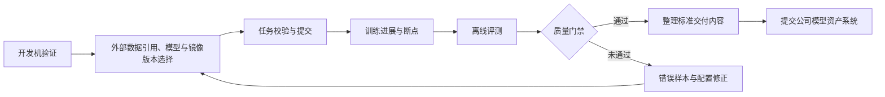
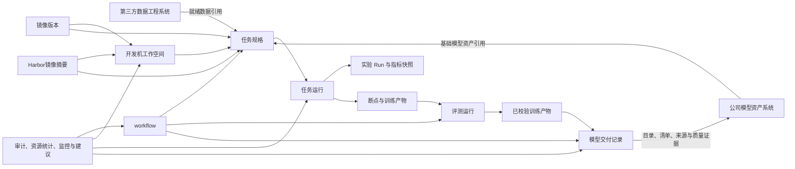

# 大模型训练平台能力规划

本文面向预训练、监督微调、偏好优化、评测和模型交付场景，说明训练平台从作业管理工具演进为模型生产平台所需的能力、建设顺序和建议技术方案。文档只规划需要新增或改进的能力；首期已经够用的配置集版本挂载、队列与多机房调度，以及明确不建设的平台自动拉数、按机房分盘符和不落盘恢复，不再作为独立功能规划。当前平台尚未建设实验分析模块，不具备实验项目、`Run`生命周期、指标快照、统一入口、`TensorBoard`看板和实验对比能力；本规划需要从最小任务关联和指标采集开始建设完整闭环，但完整曲线优先复用`TensorBoard`，不自行重建曲线引擎。

# 1. 规划基线

## 1.1 当前能力与核心问题

当前平台已经能够选择团队和队列、手工填写镜像地址与启动命令、挂载配置集、提交`Volcano`任务，并查看`Pod`日志和运维告警。统一可观测数据中心已经完成一期建设，能够按训练任务关联部分指标、日志、事件和`FastX`告警，并支撑故障节点隔离、修复和重新入池；任务监控、日志检索、训练进展和跨来源证据装配等面向用户的产品闭环仍需完善。训练任务要求用户自己填写完整镜像地址，规划中的开发机如果沿用同样方式，也会复制这一问题。平台尚未对接任何`Harbor`仓库，也未提供保存常用镜像、区分训练与开发用途以及发布平台预置镜像的管理能力。当前也没有实验分析模块，任务不会自动建立可投产的`Run`，平台不能在真实训练环境稳定采集关键指标快照、打开受平台鉴权保护的`TensorBoard`看板或进行实验筛选和对比。主要缺口不在“能否提交任务”，而在下面这些痛点：

现状统一按以下口径描述，避免把底层数据接入或开发验证误写为已交付能力：

|状态口径|判定标准|规划处理|
|---|---|---|
|已具备|已在真实环境运行并通过用户可观察的核心流程验收|不重复规划，只记录依赖、边界和需要持续治理的部分|
|已具备底座、待产品化|底层数据或基础服务已运行，但尚未形成稳定产品入口、契约或验收闭环|优先复用现有底座，只建设缺失的产品和契约层|
|未建设|没有可复用的生产能力|按功能排期建设|
|持续优化|已有生产能力，但规则、阈值或覆盖范围需要根据真实样本长期校准|保留版本、复盘、灰度、回滚和效果度量机制|

1. 开发与训练是两套环境。算法人员一边在自己的开发机上改代码、跑试验，一边到平台上提交训练，路径、镜像、依赖和命令要来回对齐，心智负担大，也容易出现“这边能跑、那边找不到文件”。
2. 训练任务的运行镜像由用户手工填写，规划中的开发机也缺少可直接复用的镜像管理能力；镜像地址容易拼错，标签可能漂移，常用镜像不能保存和分类，平台也无法预置经过验证的训练镜像与开发机镜像供算法人员直接使用。
3. 任务规格无法在页面、脚本和历史命令之间复用，字段容易漂移。
4. 断点不可验证，也缺少保存、保留、新鲜度和清理策略；故障恢复依赖人工翻目录、改配置和重新提交，夜间可恢复任务也会长时间停顿。
5. 训练进度不可解释，列表里的“运行中”不能说明优化器是否仍在更新。
6. 后训练所需的第三方就绪数据引用、评测、训练产物交付和审批对象尚未形成闭环。
7. 平台没有实验项目、`Run`和曲线入口，用户只能从任务状态和日志间接判断训练情况，既无法集中查看完整曲线，也无法按关键指标快速筛出值得关注的实验。

目标用户的典型工作链路如下：

## 1.2 已确认的环境约束

1. 所有机房统一使用`/data/hpc/home`和`/share`两条网络盘路径。产品不得再暴露`/mnt/shared`、`/data/jiangsu`、`/data/liangjiang`等历史或假设路径。
2. `/data/hpc/home/<user>`用于个人代码、试验输出和个人断点，`/share`用于团队共享数据、分词器、模板和共享产物。开发机与正式训练任务必须看到一致的逻辑路径。
3. 训练平台运行在`UAT`环境，不能直连金融云生产或公网数据源。专门的第三方数据工程系统负责数据获取、清洗、脱敏、质量、授权、版本和血缘，并提供已经准备完成的稳定数据引用；训练平台只保存任务使用的引用快照，不读取或处理数据正文。
4. 本文中的`iter`统一指全局优化器更新步数，即所有训练进程完成一次梯度同步和参数更新后的计数；`epoch`表示完整遍历一次训练数据。
5. 训练平台负责离线训练、评测、模型包校验和交付记录，不承载在线推理流量、弹性扩缩容和发布路由。
6. 公司已有独立的模型资产团队和模型资产系统。模型注册、模型卡定稿、资产权限、生命周期、模型家族图谱及下游分发由模型资产系统负责；训练平台只负责规范训练产物并将交付目录、清单、来源摘要和质量证据提交给该系统。

数据进入平台的边界如下：

## 1.3 规划口径

每个已排期功能只规划在一个季度内完成，不允许同一功能跨季度交付。如果能力需要分阶段建设，必须拆成可独立验收的不同功能，并分别规划季度和优先级。明确标记为“可选”的方向不进入季度建设承诺，只有公司确认建设计划后再补充季度和优先级。

优先级只在同一季度内部比较，不在全局把早期季度一律标为`P0`、后期季度一律标为`P1`或`P2`。后一季度的`P0`表示该季度阶段出口所必需，并不比前一季度的`P1`更不重要，只是建设顺序不同。

|优先级|判断标准|
|---|---|
|`P0`|本季度阶段出口所必需，做不到则该季度目标无法验收|
|`P1`|本季度应当交付，能明显补齐主路径，但不阻塞阶段出口|
|`P2`|本季度内的增强项，资源不足时可让路给同季度`P0`和`P1`|
|可选|保留方向设计，但当前不排期、不作为阶段出口或资源承诺|

季度目标为：`2026 Q4`优先完成训练平台服务合并与功能回归，再建设开发机、镜像管理与实验分析相关能力；`2027 Q1`完成训练可靠性、第三方数据引用和基础审计；`2027 Q2`完成模型交付规范；`2027 Q3`完成平台内部工作流、模型资产系统交付和资源治理；`2027 Q4`完成离线评测。监督微调、强化学习及其它后训练能力当前均不纳入季度规划，仅作为可选方向保留。

路线容量按后续保持`3`名研发的基线评估。每季度开始前必须为`P0`和`P1`功能补充责任人、依赖、工作量区间和真实环境验收资源；如果评估结果超过当季容量，必须在开工前调整季度或缩小可独立验收范围，不能以多人并行或跨季度隐性拖延替代排期调整。`P2`只在`P0`和`P1`风险受控后启动，高风险恢复能力必须按规则回放、影子验证和白名单试点逐步放量。

## 1.4 总体技术架构原则

平台以外部数据引用、镜像版本、开发机工作空间、任务规格、任务运行、实验项目与`Run`、断点、评测运行、训练产物和模型交付记录为核心对象。数据获取、处理、脱敏、质量、授权、版本和血缘由第三方数据工程系统负责，训练平台只保存任务实际使用的引用快照；基础模型通过公司模型资产系统提供的不可变资产标识引用。开发机和任务规格优先引用镜像管理模块提供的不可变镜像版本，也允许引用用户从获批`Harbor`项目直接选择并在提交时固化的镜像摘要。工作流只编排平台内部对象和外部稳定引用，治理能力只提供基础审计、资源容量与使用统计、使用监控和优化建议。

- 每个模块只维护自身对象和生命周期，跨模块通过稳定接口、不可变资源引用、批量查询契约或事件传递摘要，不直接访问其它模块的内部数据结构。
- 列表、聚合和图谱查询使用批量接口、分页、缓存或派生快照控制装配成本，禁止按列表项循环调用详情接口形成`N+1`查询。完整训练曲线保留在共享存储的`tfevents`或后续接入的指标存储中，日志保留在现有日志系统中，业务库只保存索引、最新指标快照和错误摘要。
- 状态、类型、阶段、动作、恢复策略等枚举在代码中用固定命名类型表达，前端运行时文案使用中文，不建设字典模块和`i18n`语言包；功能模块禁用后，前端入口和字段完全隐藏，后端可选依赖降级为空结果或跳过非强制步骤，历史数据继续保留并可在重新启用后恢复。
- 新增适配层只用于隔离已确认的变化点，例如不同训练框架、评测器、第三方数据引用和模型资产系统接入协议；稳定的项目、任务和交付能力优先直接调用现有服务契约，避免重复建设窄接口。
- 平台沿用算法工程师、`SRE`工程师和平台管理员三类内置角色及现有数据可见范围，不建设项目级角色、对象级资源授权或临时权限模型。
- 平台不将`Determined`、完整`Kubeflow`或其它单一开源平台作为整体二次开发底座；训练和评测框架通过受控模板与适配器接入，数据工程能力留在第三方数据工程系统。

# 2. 能力规划概览

本章先说明十一个大模块的建设必要性和长期发展方向，再给出可独立验收的具体功能、季度和优先级。各模块不是并列菜单，而是按“统一开发与运行入口、建立可复现训练链路、形成可治理的模型产出、支持平台内部工作流和后训练”的主线逐步演进。

### 2.1 模块建设必要性与发展方向

| 模块 | 建设必要性 | 发展方向 |
|---|---|---|
| [开发环境与配置](./3.1-开发环境与配置.md) | 开发验证与集群训练使用不同环境时，镜像、路径、依赖和启动参数需要人工对齐，小规模试验成功也无法保证正式训练可运行。该模块是消除环境漂移、统一资源计量和实现任务复现的起点。 | 先将受控开发机、统一路径和镜像选择接入平台，再让页面与`CLI`共用版本化任务规格和校验规则，最终通过可复用模板将个人试验稳定转换为可审查、可编排的训练任务。 |
| [镜像管理](./3.2-镜像管理.md) | 镜像决定训练框架、`CUDA`环境、系统依赖和启动入口。仅靠用户手工填写地址或使用可漂移标签，无法稳定追溯任务的实际环境，也会放大兼容性、权限和供应链风险。 | 先把获批`Harbor`范围内的镜像变为可检索、可分类和可复用的候选项，再以不可变摘要、兼容信息和扫描摘要固化运行环境，为任务校验、安全策略和历史复现提供依据；不在训练平台内重建源码仓库和镜像构建流水线。 |
| [训练任务管理](./3.3-训练任务管理.md) | 训练任务需要稳定记录外部输入、最终配置和运行过程；配置错误如果在占用`GPU`后才暴露会直接浪费算力，单一的“排队中”或“运行中”也不能说明调度阻塞、优化器进展或故障位置。 | 先选择第三方数据工程系统提供的就绪数据引用并固化任务快照，再从提交前校验逐步覆盖队列准入、`Pod`调度、训练进展、事件通知和日志定位，向故障恢复和自动化输出稳定事件。 |
| [实验分析](./3.4-实验分析.md) | 模型能力来自多次数据、超参和策略试验的比较，任务执行成功并不等于实验结果有价值。没有稳定的实验项目、`Run`与指标关联，团队无法快速筛选候选实验、解释变化原因或支持停滞判断。 | 先建立`job_id`、`Run`和指标存储之间的最小关联，以关键指标快照支持进展判断和快速排序；再补齐实验组织、`TensorBoard`按需看板和多`Run`对比；后续通过`SwanLab Local`等受控适配扩展协作分析。 |
| [断点与故障恢复](./3.5-断点与故障恢复.md) | 长周期、多节点训练难以完全避免硬件、网络和存储中断。如果`Checkpoint`不受管、故障恢复又必须等待人工检查，夜间的可恢复任务会长时间停顿，错误恢复还可能覆盖产物或浪费已投入算力。 | 先复用统一可观测数据中心和节点健康闭环，建立故障规则回放、评审、灰度和回滚机制，同时完善`Checkpoint`保存、校验、新鲜度、保留和清理；再交付受重试、退避、回退量、预算和熔断约束的`guarded`无人值守恢复；证据契约稳定后，以只读建议方式试点`AI Native`故障辅助，不让大模型替代确定性恢复门禁。 |
| [平台治理](./3.6-平台治理.md) | 随任务、团队和项目增多，平台需要回答关键操作由谁执行、资源容量如何分配、实际使用是否合理。现有三类角色已能覆盖平台访问，无需通过开放接口或复杂权限模型扩大治理范围。 | 首先完成训练平台服务合并和功能回归，再建设基础审计日志；随使用规模扩大，补齐任务、团队和项目的资源容量与使用统计、使用监控和可解释优化建议。 |
| [模型产物交付](./3.7-模型产物交付.md) | 训练输出中通常同时包含权重、断点、日志和临时文件，个人目录或人工消息不能作为稳定的系统交接方式。模型资产系统如果只收到一个路径，无法确认文件完整性、训练来源和质量证据。 | 先分离训练输出与正式交付内容，建立标准目录、不可变清单、哈希和最小加载校验；再汇总外部数据引用、镜像、训练、评测与审批证据；最终通过幂等交接、接收回执、失败重试和保留期清理对接公司模型资产系统，不向模型资产管理扩张。 |
| [工作流与自动化](./3.8-工作流与自动化.md) | 训练、质量证据收集、交付准备、审批和模型资产系统交接都是长耗时且可能失败的步骤。依赖人工传递路径和顺序既容易漏项、串版本，也会在单步失败时重复执行已成功步骤。 | 工作流仅编排训练平台内部能力和外部稳定引用；先用版本化`DAG`和人工审批固定主链路，再完善步骤状态、重试与幂等，进而支持受并发约束的并行实验、历史复现和内部事件触发，高风险节点仍保留人工决策权。 |
| [评测与质量门禁](./3.9-评测与质量门禁.md) | 训练`loss`下降只能说明优化目标发生变化，不能证明业务能力、通用能力和安全性达到交付标准。各团队如果使用不同的外部评测数据引用、脚本、指标和阈值，评测结果就无法横向比较，退化或安全风险也可能进入交付环节。 | 先将第三方评测数据引用、指标和运行配置组合为版本化评测套件，以统一运行器生成逐样本与聚合结果；再建立候选模型与基线的能力、安全和回归对比，形成质量门禁；后续通过外部污染证据、执行隔离、统计可信度、缓存和失败重跑提升证据质量与效率。 |
| [监督微调与后训练](./3.10-监督微调与后训练.md) | 当业务需要让基础模型遵循指令、适配特定任务或产生结构化行为时，监督微调是重要的能力扩展方向。如果把全量`SFT`、`LoRA`或`QLoRA`当作普通预训练任务，会遗漏消息模板、监督范围、基础模型兼容性、差异化产物和训练后评测等约束。 | 当前保留设计而不排期。待业务目标、第三方就绪数据、评测标准、资源预算和责任人明确后，从类型化任务、基础模型约束和外部数据协议摘要起步，再补齐资源估算、断点恢复、产物来源和自动评测，最后扩展早停、遗忘控制、切片分析、多模态和工具调用。 |
| [强化学习后训练](./3.11-强化学习后训练.md) | 当业务需要优化偏好对齐、复杂推理、工具使用或可验证目标时，强化学习能够引入奖励信号。这类训练涉及多种模型角色、样本生成和参数更新，如果没有额外治理，容易出现奖励投机、训练不稳定、安全退化和资源失控。 | 当前仅作为可选方向。启动前必须具备可用的监督微调基线、评测与安全门禁、明确的奖励目标和独立资源预算；建设时先登记奖励资产，再小规模验证多角色运行、阶段产物和恢复能力，最后在奖励、`KL`和安全指标受控的前提下扩大规模；平台只适配训练方法，不重复实现算法。 |

### 2.2 功能排期与优先级

本索引文档是所有功能模块优先级和排期的唯一维护入口，模块子文档只描述建设必要性、能力范围、技术方案、依赖条件和降级边界，不重复记录季度、优先级或阶段承诺。

每个已排期功能只进入一个季度，只标一个优先级。优先级在季度内部比较：`P0`是该季度阶段出口所必需，`P1`是同季度应当交付但不阻塞出口的能力，`P2`是同季度可让路的增强。表内已排期功能按季度由近到远排列，同一季度内按`P0`、`P1`、`P2`排序；同一优先级按表中顺序执行；未排期的可选方向统一放在表尾。本季度首项服务合并任务为最高优先级前置任务，必须先完成并通过回归验收，后续多人共同使用`AI`维护同一项目、共同迭代与测试才能启用。

|模块|功能|功能描述|解决痛点/场景|季度规划|优先级|
|---|---|---|---|---|---|
|平台治理|训练平台服务合并与功能回归|将`mlp-train-web`、`mlp-train-api`和`acs-server`合并为一个服务，统一启动、配置、路由、鉴权、日志、监控和发布；覆盖现有核心功能完成端到端回归，确认合并前后的接口和用户行为一致|多服务部署、通信、版本协同和故障排查增加架构与维护成本，阻碍多人共同使用`AI`维护同一项目、共同迭代与测试|`2026 Q4`|`P0`|
|开发环境与配置|开发机工作空间|提供`Web Shell`、可选`JupyterLab`、持久目录和一键转训练任务；复用现有团队、资源队列和网络盘，并接入同期建设的镜像选择能力，默认连续空闲`60`分钟后进入回收流程|算法人员要在个人开发机和平台训练之间来回切换，两套环境带来心智负担；试验配置靠手工复制，空闲`GPU`长期占用且不计入队列额度|`2026 Q4`|`P0`|
|开发环境与配置|统一路径规范|统一示例、模板和校验中的输入、输出与断点路径|历史盘符导致跨集群失败或产物写入错误位置|`2026 Q4`|`P0`|
|镜像管理|`Harbor`检索与常用镜像管理|按需检索授权`Harbor`项目，支持直接选择或保存为常用镜像，标记训练或开发用途，支持平台预置两类公共镜像|常用镜像依赖用户记忆，平台无法沉淀和分类经过验证的运行环境|`2026 Q4`|`P0`|
|镜像管理|分类检索选择与版本固化|训练任务和开发机优先展示适用的已保存镜像和平台预置镜像，同时允许按关键字直接检索并选择`Harbor`镜像，提交时固化不可变摘要|手工地址容易拼错，强制先保存又会打断创建流程；错误用途和漂移标签会导致任务启动失败或运行环境不一致|`2026 Q4`|`P0`|
|开发环境与配置|训练命令行（`CLI`）与统一任务规格|页面和命令行共用版本化`train.yaml`及一致的校验、提交、日志和取消能力|页面、脚本和历史命令字段漂移，批量训练难以自动化和复现|`2026 Q4`|`P1`|
|实验分析|实验项目与`Run`管理|提供训练中心统一入口，按工作集群和项目组织实验，支持筛选、分页、移动、删除、历史任务补建及任务与实验互访|实验数量增长后只能靠任务名称查找，任务与实验需要反复搜索且容易关联错误，历史任务和未归类实验容易丢失|`2026 Q4`|`P1`|
|实验分析|关键指标快照与快速排序|先交付可按`job_id`批量读取的最小指标快照，作为训练进展判断的前置能力；再将最新`Loss`、进度、吞吐、最后一步时间、指标采集时间和读取错误用于服务端筛选、排序和分页|逐个打开完整曲线才能判断进展，团队无法快速定位异常或候选实验|`2026 Q4`|`P1`|
|实验分析|`TensorBoard`按需打开|在实验详情按需启动看板，通过平台鉴权的同源地址嵌入或新标签打开，空闲后自动回收|看板常驻浪费资源，直接暴露机房端口又绕过平台权限与审计|`2026 Q4`|`P1`|
|实验分析|实验对比|选择多条`Run`并排比较关键指标和超参差异，同机房时再打开完整曲线对比|手工切换页面难以解释实验差异，跨机房强行叠加曲线不可用|`2026 Q4`|`P1`|
|实验分析|`Run`生命周期与异常降级|先交付`job_id`、`Run`和`tfevents`目录的最小关联，作为指标采集和训练进展判断的前置能力；读盘或看板失败时保留任务状态和历史数据并给出可理解提示|实验创建失败可能影响训练主链路，空指标被误显示为`0`会造成错误判断|`2026 Q4`|`P1`|
|训练任务管理|提交前校验与预览|校验第三方数据引用、挂载位置、并行关系和结构化配置，预览实际读写范围|明显错误在排队后才暴露，用户误以为平台会搬运或处理数据|`2027 Q1`|`P0`|
|训练任务管理|调度过程可视化|以`Pod`为展示单元呈现队列准入、整组等待、资源匹配、调度、镜像拉取和容器启动过程|任务级“排队中”无法定位具体阻塞`Pod`和资源缺口，用户只能反复询问运维|`2027 Q1`|`P0`|
|训练任务管理|任务运行事件通知|统一接收任务事件，默认通知任务创建人和负责人；先覆盖不依赖实验指标的任务原生事件，疑似停滞通知在训练进展与停滞提示完成后接入；首期完成飞书送达，按企业能力接入`FastX`统一路由，并支持邮件备用|算法人员无法持续守在页面，关键故障容易错过处理窗口；通知渠道和接收规则不清又会导致消息漏发或发送失败后无人知晓|`2027 Q1`|`P0`|
|开发环境与配置|训练任务模板|提供版本化模板，并联合校验资源、并行、批次、显存和挂载配置|训练配置依赖个人经验，任务在分配资源后才因参数冲突失败|`2027 Q1`|`P0`|
|断点与故障恢复|故障规则治理与复盘|复用现有故障样本和可观测证据，管理规则责任人、版本、阈值和优先级，通过离线回放、影子验证、评审、灰度和回滚持续校准|现有规则随故障类型和环境变化容易产生误报、漏报，未经验证的规则也不能安全驱动无人值守恢复|`2027 Q1`|`P0`|
|断点与故障恢复|`Checkpoint`管理与完整性|按任务管理断点保存频率、最大回退量、版本状态、分片清单、哈希、加载校验、保留与清理策略|断点只是目录文件，用户需靠文件名猜测是否可用；最近断点过旧或被清理时，自动恢复无法控制进度损失|`2027 Q1`|`P1`|
|断点与故障恢复|再次提交与恢复策略|复用任务配置并校验断点、模型、外部数据引用、并行和目录占用，记录实际恢复结果|再次提交不等于恢复，配置变化可能误加载或覆盖产物|`2027 Q1`|`P1`|
|训练任务管理|训练进展与停滞提示|复用实验分析先行交付的最小指标快照与任务关联能力，记录最后全局`iter`及实际发生时间、吞吐、指标采集时间、任务阶段和最近完整断点；连续多个观察窗口没有进展时给出带依据的疑似停滞提示|通信挂起、慢`rank`或数据读取阻塞时，任务和进程可能仍显示运行中；单看任务状态或`GPU`利用率无法判断优化器是否推进，单看`iter`又可能把评测和断点保存误报为故障|`2027 Q1`|`P1`|
|训练任务管理|任务列表进展摘要|展示当前`iter`、步耗时、吞吐、预计剩余时间、最后一步时间、指标采集时间和进展状态，支持按疑似停滞时长筛选与排序|任务列表无法区分正常推进、进展变慢、疑似停滞和指标采集失败|`2027 Q1`|`P1`|
|训练任务管理|任务详情与日志定位|统一展示实际路径，并按进程、节点、时间和关键字检索日志|多机日志和实际读写位置不透明，排障耗时长|`2027 Q1`|`P1`|
|断点与故障恢复|停止信号与风险提示|停止前显示最后完整断点和预计丢失步数；正常停止先发送`SIGTERM`，默认等待`30`秒由训练进程主动落盘退出，超时再强制终止|值班人员无法判断停止会丢失多少进度，训练进程也缺少统一的优雅退出和强制停止规范|`2027 Q1`|`P1`|
|训练任务管理|任务输入与引用快照|选择第三方数据工程系统提供的数据标识、不可变版本和可挂载位置，并在提交时保存引用快照|只记录可变路径会导致历史任务无法确认实际输入，平台自行扫描内容又会越过数据工程边界|`2027 Q1`|`P1`|
|平台治理|基础审计日志|记录操作者、现有角色、时间、来源、动作、对象、请求追踪标识和结果摘要，并支持基础条件检索|关键操作只保留最终状态时，无法还原谁在何时对什么对象执行了什么操作|`2027 Q1`|`P1`|
|断点与故障恢复|无人值守故障恢复|消费已经发布且通过验证的故障规则，提供`manual`与`guarded`模式；对白名单故障自动选择最近合法断点、换节点创建子运行并验证全局`iter`继续推进，超过次数、回退量或预算上限时自动熔断|故障恢复依赖人工翻日志、找断点和重新提交，夜间的可恢复任务长时间停顿；盲目自动重试又会反复失败并浪费资源|`2027 Q1`|`P1`|
|断点与故障恢复|`AI Native`智能故障辅助试点|通过只读契约在现有数据可见范围内聚合告警、指标、日志、事件和已评审知识，生成区分事实、推断和未知项且带证据引用的排查建议；高风险动作仍由人工确认并审计|多来源证据仍依赖人工关联，未知故障的初步分析耗时长；大模型结论若缺少证据和权限边界又可能误导处置|`2027 Q1`|`P2`|
|实验分析|`SwanLab Local`实验分析适配|关联平台`Run`与内网`SwanLab Local`实验，同步白名单摘要指标，并从实验详情打开经认证的内网分析页面|团队后续需要继续使用内网`SwanLab Local`的记录、协作分析和报告能力，但直接切换平台会造成实验索引、权限和指标排序割裂|`2027 Q1`|`P2`|
|模型产物交付|交付目录与产物规范|区分训练输出与正式交付内容，并统一`/share/model-deliveries/<project>/<delivery_id>/`目录结构|个人目录可能被覆盖或清理，下游难以区分权重、断点和临时文件|`2027 Q2`|`P0`|
|模型产物交付|交付清单与完整性校验|生成不可变`manifest`并校验文件、分片、哈希、格式、分词器和最小生成|只交付目录路径无法证明内容完整且可加载|`2027 Q2`|`P0`|
|模型产物交付|交付元数据与来源摘要|汇总训练使用的外部数据引用、镜像、交付校验、审批、外部质量证据和基础模型资产标识；统一评测上线后补充平台评测结论|模型资产系统只收到权重时无法建立可靠来源与质量证据|`2027 Q2`|`P0`|
|工作流与自动化|人工审批节点|外部或人工质量证据齐备后由现有授权用户执行交付前审批；统一评测上线后改为消费平台门禁结论|自动指标无法覆盖所有业务风险，实验产物可能绕过确认|`2027 Q2`|`P0`|
|工作流与自动化|版本化工作流模板|以外部数据引用、训练、外部质量证据、交付准备和审批组成平台内部`DAG`，统一评测上线后再接入评测与门禁步骤|人工复制路径容易漏步骤、串版本和形成流程差异|`2027 Q3`|`P0`|
|工作流与自动化|步骤状态、重试与幂等|按步骤管理超时、取消、恢复、人工暂停和唯一运行|单步失败导致整条流程重跑，重复提交覆盖产物|`2027 Q3`|`P0`|
|模型产物交付|模型资产系统交接|向公司模型资产系统提交交付目录、清单、来源摘要和质量证据，并记录资产标识与接收回执|人工发送目录容易交错版本、遗漏证据且无法确认是否接收|`2027 Q3`|`P0`|
|工作流与自动化|步骤缓存|按输入引用、镜像和参数复用交付准备等可重入步骤；统一评测上线后复用相同机制缓存评测结果，训练步骤默认不缓存|调参时重复执行不变步骤，浪费资源和时间|`2027 Q3`|`P0`|
|平台治理|资源容量与使用统计|按任务、团队和项目汇总资源容量、申请量、分配量、运行时长、利用率、排队和空闲趋势|调度与监控事实分散，用户无法解释容量压力和资源使用效率|`2027 Q3`|`P0`|
|工作流与自动化|并行实验|并行多组预训练超参或训练模板并汇总训练指标和资源使用；后训练与统一评测上线后再接入对应参数矩阵|手工复制任务容易漏改参数，串行试验反馈慢|`2027 Q3`|`P1`|
|工作流与自动化|工作流资源计划|配置并发、优先级、队列、单次运行资源上限和超限处理策略|并行分支可能瞬间占满队列且资源需求不可预估|`2027 Q3`|`P1`|
|工作流与自动化|历史运行复现与差异|基于历史输入和参数生成新运行并显示完整差异|手工抄配置会遗漏默认值，评审者无法解释结果变化|`2027 Q3`|`P1`|
|平台治理|资源使用监控|按明确窗口和阈值识别长时间空闲、持续低利用率、申请与使用偏差、异常排队和容量逼近上限|只有事后统计时，运维人员难以及时定位需要关注的任务、团队和项目|`2027 Q3`|`P1`|
|模型产物交付|交付状态、重试与清理|以`delivery_id`幂等重试，记录拒绝或接收回执，并在确认接收和保留期结束后清理暂存目录|外部系统故障可能造成重复资产，过早清理又会丢失交付内容|`2027 Q3`|`P1`|
|工作流与自动化|事件与计划触发|按平台内镜像、训练产物、交付证据变化、定时计划或人工操作触发流程；统一评测上线后补充门禁事件|依赖人工记忆会漏跑，自动触发缺少去重又会批量误提交|`2027 Q3`|`P1`|
|平台治理|资源优化建议|基于确定性规则提供任务、团队和项目的优化建议、证据、统计窗口和预期影响，不自动修改资源|仅提示利用率异常无法帮助用户判断应采取的措施，自动调优又可能影响训练稳定性|`2027 Q3`|`P2`|
|评测与质量门禁|评测套件与指标目录|将第三方评测数据标识与不可变版本、适用指标和运行配置组合为版本化套件|只看训练`loss`或单一总分无法判断业务与安全效果，外部数据引用变化也会破坏结果可比性|`2027 Q4`|`P0`|
|评测与质量门禁|统一评测运行器|适配多种评测器，固化配置并输出逐样本和聚合协议|脚本、参数和指标口径不一致，结果无法横向比较|`2027 Q4`|`P0`|
|评测与质量门禁|基线回归对比|逐指标和逐样本比较候选与指定基线模型|目标能力提升可能掩盖通用或安全能力退化|`2027 Q4`|`P0`|
|评测与质量门禁|安全评测|覆盖越权、注入、泄漏、幻觉、越狱和工具调用风险|业务微调可能提升命中率却破坏隐私和拒答能力|`2027 Q4`|`P0`|
|评测与质量门禁|质量门禁与评测报告|配置阈值、退化幅度、风险项和审批条件并生成对比报告|人工看表容易漏掉不可退化指标，无法形成可签字材料|`2027 Q4`|`P0`|
|评测与质量门禁|评测产物查询|保存原始输出、错误样本、配置和环境并支持样本级查询|只保存均分无法复盘具体失败或形成证据链|`2027 Q4`|`P1`|
|评测与质量门禁|模型裁判|版本化裁判模型、提示词和解析器，并支持人工复核|开放式回答缺少标准答案，裁判偏差可能影响放行结论|`2027 Q4`|`P1`|
|评测与质量门禁|评测污染证据|消费第三方数据工程系统生成的版本化污染检查报告，不在训练平台内读取样本重新比对|测试题泄漏会造成虚高分和上线后的效果落差，缺失外部证据也不能视为没有污染|`2027 Q4`|`P1`|
|评测与质量门禁|评测执行隔离|限制自定义评测脚本的网络、文件、凭据和资源访问|第三方评测代码可能泄露数据或影响集群稳定性|`2027 Q4`|`P1`|
|评测与质量门禁|评测统计可信度|展示样本量、分层统计、置信区间和可比性提示|小样本偶然波动可能被误判为显著提升|`2027 Q4`|`P1`|
|评测与质量门禁|评测缓存与失败重跑|以模型、套件、提示词、参数、第三方数据标识与版本和镜像生成缓存键|重复完整评测成本高，粗粒度缓存又可能复用错误结果|`2027 Q4`|`P1`|
|监督微调与后训练|任务类型与基础模型约束|区分全量`SFT`、`LoRA`、`QLoRA`等任务并校验基础模型兼容性|将微调当作预训练会漏掉模板、产物和评测要求|未排期|可选|
|监督微调与后训练|就绪数据协议引用与训练参数|保存第三方数据标识、版本、消息协议和监督摘要，校验训练模板与协议兼容性，不读取样本执行数据工程|外部数据引用缺少协议摘要或与训练模板不兼容时，任务可能在启动后失败|未排期|可选|
|监督微调与后训练|微调策略与资源估算|配置`LoRA/QLoRA`、精度、分布式策略并估算显存、时长和存储|错误组合在申请资源后才失败，资源规格容易过大或不足|未排期|可选|
|监督微调与后训练|微调断点恢复|恢复权重、优化器、调度器、随机状态、数据游标和模板配置|只恢复权重会改变学习率和样本顺序，结果不可比较|未排期|可选|
|监督微调与后训练|微调产物分类与来源|区分基础模型、`adapter`、合并模型、断点和评测报告，并记录外部数据引用|产物混放会导致加载错误和父子模型关系丢失|未排期|可选|
|监督微调与后训练|训练后自动评测|自动比较基础模型与微调模型的能力、安全和回归指标|训练`loss`下降不能证明业务效果提升或安全能力未退化|未排期|可选|
|监督微调与后训练|模型合并与导出校验|提供`adapter`合并、权重导出、格式检查和生成冒烟测试|训练产物可能直到交付时才暴露无法加载的问题|未排期|可选|
|监督微调与后训练|模型卡草稿|依据任务运行、外部数据引用和评测结果生成用途、限制、参数和质量证据摘要|只有权重没有使用边界和风险信息，业务方无法评审|未排期|可选|
|监督微调与后训练|早停与最佳断点|支持按验证指标早停并区分最佳断点和最新可恢复断点|固定步数可能过拟合，最后断点不一定质量最佳|未排期|可选|
|监督微调与后训练|回放集与遗忘控制|引用第三方数据工程系统提供的通用、安全和领域数据混合版本，并比较微调前后退化|领域能力提升可能以通用能力和安全拒答退化为代价|未排期|可选|
|监督微调与后训练|切片分析|按长度、语言、业务标签、难度和能力标签对比结果|总体均分会掩盖少数语言和高风险样本退化|未排期|可选|
|监督微调与后训练|多模态与工具调用扩展|消费第三方数据工程系统提供的媒体引用、协议和模态`token`摘要，并校验训练运行时兼容性|后续增加图文、音频或工具调用会破坏现有文本协议|未排期|可选|
|强化学习后训练|奖励资产登记|登记奖励模型或规则奖励的版本、范围、第三方校准数据引用和限制|奖励逻辑隐藏在脚本中，实验目标和变化无法追溯|未排期|可选|
|强化学习后训练|强化学习运行与安全监控|编排多角色模型和`rollout`资源，监控奖励、`KL`、拒答率和安全指标|多阶段失败难恢复，奖励投机不能仅靠总奖励发现|未排期|可选|

# 3. 功能模块规划

各模块的建设必要性、发展方向和子文档入口统一维护在第2.1节。子文档继续详细说明具体任务的背景、建设目标、建议方案、依赖条件和降级边界；季度、优先级和阶段承诺仍只在第2.2节维护。

# 4. 建设路线与验收

## 4.1 建设路线

路线严格跟随能力规划概览：每个季度只验收当季已排期能力，`P0`决定阶段出口，`P1`应在当季完成但不阻塞阶段出口，`P2`资源不足时可以顺延。后续季度不得作为前一季度的隐含验收条件。

|阶段|建设重点|阶段出口|
|---|---|---|
|`2026 Q4`：服务合并、开发机、镜像与实验分析|优先完成`mlp-train-web`、`mlp-train-api`和`acs-server`合并为单一服务及全量功能回归；验收通过后建设开发机工作空间、统一路径、训练命令行（`CLI`）与统一任务规格，`Harbor`按需检索、常用与预置镜像、用途分类和版本固化，以及实验项目、`Run`、任务与实验关联访问、关键指标快照、快速排序、`TensorBoard`按需看板、实验对比和异常降级|合并后的单一服务需保持现有接口、权限和核心用户流程可用，并降低部署、通信和维护复杂度；回归通过后，才能支持多人共同使用`AI`维护同一项目、共同迭代与测试；开发机能够复用平台路径和已固化的镜像版本，并受队列额度和闲置回收约束；用户能够检索授权`Harbor`项目、维护常用与预置镜像，并在训练任务和开发机创建时固化镜像摘要；用户可从侧栏或任务详情进入实验，按关键指标筛选`Run`并打开完整曲线；本季度不新增这三个模块之外的功能任务|
|`2027 Q1`：训练可靠性与基础治理|提交校验、调度解释、任务通知、故障规则治理、`Checkpoint`管理、恢复策略、停止信号、训练进展与停滞提示、无人值守故障恢复、第三方就绪数据引用、训练模板和基础审计；以`P2`试点`AI Native`智能故障辅助并验证`SwanLab Local`适配|真实预训练任务可在提交前完成校验，调度过程与原生运行事件可观测、可通知，故障规则能够基于真实样本回放、评审、灰度和回滚；训练任务能够保存第三方就绪数据的引用快照，平台关键操作具备基础追溯记录；`Checkpoint`与恢复能力按`P1`交付，节点驱逐等白名单故障能在无人值守时自动换节点续训，并以断点可加载率、规则误报与漏报、`RPO/RTO`、自动恢复成功率和人工介入率验证效果；`AI Native`与`SwanLab Local`试点不作为阶段性交付|
|`2027 Q2`：模型交付规范|模型交付目录、清单、来源摘要、外部质量证据接入和交付审批|训练产物能够按统一目录和清单形成待交付内容，并附带第三方数据引用、来源明确的外部质量证据进入人工审批|
|`2027 Q3`：平台内部工作流、模型资产系统交付与资源治理|工作流模板、状态、重试、缓存、并行实验、资源计划、模型资产系统交接、交付状态管理、平台内部事件触发、资源容量与使用统计、使用监控和优化建议|外部数据引用、预训练、外部质量证据、交付准备和审批可通过平台内部版本化工作流串联，模型资产系统能够接收标准交付内容并返回资产标识，失败可从中间步骤恢复；任务、团队和项目的资源容量与使用情况可分析、可监控，并能获得带依据且不自动执行的优化建议|
|`2027 Q4`：离线评测|统一评测运行器、评测套件与指标目录、基线和安全评测、质量门禁、结果追溯、统计可信度及评测缓存|训练产物能够在平台内生成可比较、可追溯的离线评测证据并进入质量门禁|

在`2027 Q4`统一评测上线前，模型交付和工作流允许接入项目指定的外部离线评测报告或人工质量结论，但必须记录证据来源、版本、生成方式、责任人和审批结果，不得把外部证据标记为平台评测结果。统一评测上线后，需要平台门禁的项目应改为消费版本化评测结论；评测服务不可用时保持待处理状态，不得绕过门禁放行。

当前三个训练平台服务仍分散部署，因此`2026 Q4`首先完成`mlp-train-web`、`mlp-train-api`和`acs-server`合并为单一服务，并完成现有核心功能回归；只有该前置任务通过验收后，才进入多人共同使用`AI`维护同一项目、共同迭代与测试的协作阶段。随后一方面完成`Harbor`按需检索、常用与预置镜像管理、用途分类和版本固化，并接入开发机与现有训练任务；另一方面从零建立实验项目、`Run`生命周期、任务关联和指标快照，再完成实验页面、筛选排序、按需看板与对比。训练进展、停滞判断和任务通知属于训练任务管理模块，统一顺延到`2027 Q1`；届时直接复用前一季度形成的`job_id`、`Run`和指标快照契约，不在`2026 Q4`提前安排开发环境与配置、镜像管理和实验分析之外的模块任务。

`2027 Q1`训练可靠性主线在季度内按以下顺序推进，不同时启动全部功能：

|内部里程碑|建设范围|进入下一阶段的门禁|
|---|---|---|
|规则与证据基线|复用统一可观测数据中心，明确任务、节点、断点和告警契约；建立故障样本集、规则回放和可靠性基线|关键证据具备来源与新鲜度，规则能够统计误报、漏报和未知比例，并支持回滚|
|受控恢复验证|完成`Checkpoint`管理、加载校验、恢复兼容性、`manual`链路和`guarded`影子验证|断点可加载、原任务终止、节点隔离、资源预算和续训验证均可程序化判定|
|白名单试点|仅对通过评审的节点驱逐等故障启用`guarded`恢复，同时开展只读`AI Native`故障辅助试点|自动恢复达到项目设定的`RPO/RTO`和成功率目标，异常能够熔断；智能建议不直接执行高风险动作|

## 4.2 可选能力处理

监督微调、偏好优化、强化学习及其它后训练能力均不属于当前建设路线和验收范围。相关数据获取、清洗、脱敏、质量、标注、合成、授权、版本和血缘始终由第三方数据工程系统负责；未来即使启用后训练模块，训练平台也只消费就绪数据引用。只有公司确认业务目标、算法方案、数据来源、资源预算和安全责任后，才能补充训练能力的季度、优先级和验收指标；在此之前，不得将这些能力作为任何已排期阶段的前置条件或出口要求。

# 5. 参考资料

- [SkyPilot训练指南](https://docs.skypilot.co/en/latest/reference/training-guide.html)
- [Cube Studio](https://github.com/data-infra/cube-studio)
- [Kubeflow文档](https://www.kubeflow.org/docs/)
- [kubeflow/arena](https://github.com/kubeflow/arena)
- [MLflow文档](https://mlflow.org/docs/latest/ml/)
- [NVIDIA Run:ai文档](https://run-ai-docs.nvidia.com/)
- [NVIDIA NeMo容错说明](https://docs.nvidia.com/nemo-framework/user-guide/25.02/resiliency.html)
- [FastX告警Webhook对接说明](../ops/fastx-alert-webhook.md)
- [NVIDIA nvidia-resiliency-ext](https://github.com/NVIDIA/nvidia-resiliency-ext)
- [Kubernetes Pod终止流程](https://kubernetes.io/docs/concepts/workloads/pods/pod-lifecycle/#pod-termination-flow)
- [Kubeflow Trainer断点与恢复](https://developers.redhat.com/articles/2026/05/21/guide-jit-checkpointing-kubeflow-trainer-openshift-ai)
- [SageMaker HyperPod自动恢复](https://docs.aws.amazon.com/sagemaker/latest/dg/sagemaker-hyperpod-resiliency-slurm-auto-resume.html)
- [阿里云PAI-DLC概述](https://help.aliyun.com/zh/pai/what-is-dlc)
- [阿里云EasyCKPT](https://help.aliyun.com/zh/pai/easyckpt)
- [阿里云创建训练任务](https://help.aliyun.com/zh/pai/create-a-training-task)
- [在DLC上使用Megatron-LM做预训练](https://help.aliyun.com/zh/pai/use-cases/dlc-use-cases/)
- [OpenSCOW](https://github.com/PKUHPC/SCOW)
- [Harbor API Explorer](https://goharbor.io/docs/main/working-with-projects/using-api-explorer/)
- [Hugging Face Transformers chat templates](https://huggingface.co/docs/transformers/main/en/chat_templating)
- [Hugging Face TRL](https://huggingface.co/docs/trl/index)
- [Hugging Face PEFT](https://huggingface.co/docs/peft/index)
- [ms-swift](https://swift.readthedocs.io/en/latest/)
- [DeepSpeed ZeRO](https://www.deepspeed.ai/tutorials/zero/)
- [PyTorch FSDP](https://pytorch.org/docs/stable/fsdp.html)
- [Data-Juicer](https://github.com/modelscope/data-juicer)
- [NVIDIA NeMo Curator](https://docs.nvidia.com/nemo/curator/latest/)
- [EvalScope](https://evalscope.readthedocs.io/en/latest/)
- [EleutherAI lm-evaluation-harness](https://github.com/EleutherAI/lm-evaluation-harness)
- [OpenLineage](https://openlineage.io/docs/)
- [NIST AI Risk Management Framework](https://www.nist.gov/itl/ai-risk-management-framework)
- [OWASP Top 10 for LLM Applications](https://owasp.org/www-project-top-10-for-large-language-model-applications/)
- [vLLM](https://docs.vllm.ai/)
- [TensorRT-LLM](https://nvidia.github.io/TensorRT-LLM/)
- 商业平台资料：[阿里云人工智能平台PAI](https://help.aliyun.com/zh/pai/)、[Amazon SageMaker AI](https://docs.aws.amazon.com/sagemaker/latest/dg/whatis.html)、[Azure Machine Learning](https://learn.microsoft.com/en-us/azure/machine-learning/overview-what-is-azure-machine-learning)、[NVIDIA Run:ai](https://run-ai-docs.nvidia.com/)
- 仓库内资料：[原始需求](../需求收集/0-2026Q3大模型训练平台原始需求.md)、[技术方案调研](../调研资料/2-大模型训练平台技术方案调研.v2.md)、[交互原型](../prototype.v3/)

# 6. 行业最佳实践与规划完整性

本规划不是只根据当前页面缺口向后追加功能，而是参考开源训练平台、实验与数据工具，以及主流云厂商的模型开发平台，对离线训练生产链路进行能力校准。下表记录截至`2026-09-09`可以从官方文档或官方仓库确认的相关能力。参考对象用于验证能力面是否完整，不代表采购结论、技术选型或整体二次开发方案；平台仍按现有`K8S + Volcano`基础、内网部署条件和公司系统边界选择实现方式。

## 6.1 对照口径

1. 下文列出的每项参考能力都必须落入当前已具备能力、能力规划概览中的已排期功能、未排期可选功能或明确的外部系统边界，不允许只引用行业项目名称而没有规划落点。
2. 行业产品的功能顺序不直接决定本平台优先级。季度和`P0/P1/P2`仍根据公司现状、前置依赖、资源预算和风险确定，因此相同能力可以调整建设顺序，但不能在映射中凭空缺失。
3. 对大型平台只参考与离线训练生产链路有关的功能，不宣称覆盖其全部产品能力。在线推理、流量治理、自动拉数和模型资产全生命周期等超出当前平台职责的能力，必须按第6.4节说明的边界处理。
4. 完整性由“已有基线、已排期、可选保留、外部系统承接、明确不建设”五种状态共同构成，不以复制某一个项目的全部菜单作为判断标准。

## 6.2 开源项目与规划映射

|参考项目|重点借鉴的功能设计|本规划中的对应能力|
|---|---|---|
|[Cube Studio](https://github.com/data-infra/cube-studio)|在线`Notebook`、镜像与任务模板、`K8S/Volcano`训练、多租户权限、`Pipeline`、资源计量和`TensorBoard`入口|开发机工作空间、镜像管理、训练任务模板、调度过程可视化、平台内部工作流、资源容量与使用统计、资源使用监控、实验分析；不借鉴其多租户角色体系|
|[Kubeflow](https://www.kubeflow.org/docs/)|`Notebook`、分布式训练对象与状态、组件化训练运行时和`Pipeline DAG`|开发机工作空间、训练命令行（`CLI`）与统一任务规格、训练任务管理、版本化工作流模板；不引入完整`Kubeflow`平台|
|[SkyPilot](https://docs.skypilot.co/en/latest/reference/training-guide.html)|版本化`YAML`、`CLI`与不同执行环境一致的提交体验|训练平台内部使用的训练命令行（`CLI`）与统一任务规格、历史运行复现与差异；不建设对外接口，当前执行后端继续使用既有`Volcano`能力|
|[JupyterHub](https://jupyterhub.readthedocs.io/)、[Open OnDemand](https://osc.github.io/ood-documentation/latest/)|多用户交互式环境、按用户启动运行环境和受认证的反向代理入口|开发机工作空间中的`Web Shell`、可选`JupyterLab`、持久目录、平台鉴权和空闲回收|
|[Harbor](https://goharbor.io/docs/main/)|按项目授权访问仓库、检索镜像、管理标签并使用不可变摘要|`Harbor`检索与常用镜像管理、分类检索选择与版本固化|
|[MLflow](https://mlflow.org/docs/latest/ml/)、[ClearML](https://clear.ml/docs/latest/docs/)、[SwanLab](https://docs.swanlab.cn/)、[TensorBoard](https://www.tensorflow.org/tensorboard)|实验、`Run`、参数与指标记录、实验筛选对比和完整曲线看板|实验项目与`Run`管理、关键指标快照、实验对比、`TensorBoard`按需打开和`SwanLab Local`适配|
|[Data-Juicer](https://github.com/modelscope/data-juicer)、[NeMo Curator](https://docs.nvidia.com/nemo/curator/latest/)、[OpenLineage](https://openlineage.io/docs/)|数据清洗、质量与去重、数据版本处理记录和跨任务血缘|由第三方数据工程系统选型和承接；训练平台只消费该系统输出的就绪数据引用|
|[EvalScope](https://evalscope.readthedocs.io/en/latest/)、[lm-evaluation-harness](https://github.com/EleutherAI/lm-evaluation-harness)|统一评测入口、评测任务配置、指标聚合和样本级结果|评测套件与指标目录、统一评测运行器、基线回归对比、安全评测、评测产物查询、质量门禁与评测报告、评测缓存与失败重跑|
|[NeMo容错能力](https://docs.nvidia.com/nemo-framework/user-guide/25.02/resiliency.html)、[nvidia-resiliency-ext](https://github.com/NVIDIA/nvidia-resiliency-ext)|训练故障检测、断点保存、作业重启和恢复证据|任务可靠性策略、训练进展与停滞提示、故障规则治理与复盘、`Checkpoint`管理与完整性、再次提交与恢复策略、无人值守故障恢复|
|[Transformers](https://huggingface.co/docs/transformers/main/en/index)、[PEFT](https://huggingface.co/docs/peft/index)、[TRL](https://huggingface.co/docs/trl/index)、[ms-swift](https://swift.readthedocs.io/en/latest/)|聊天模板、`LoRA/QLoRA`、监督微调、偏好优化和强化学习训练协议|监督微调与后训练、强化学习后训练两个可选模块；在公司确认业务目标和资源预算前不进入季度承诺|

## 6.3 商业平台与规划映射

|参考产品|重点借鉴的功能设计|本规划中的对应能力|
|---|---|---|
|[阿里云人工智能平台PAI](https://help.aliyun.com/zh/pai/)|交互式开发环境、`DLC`分布式训练任务、任务配置与观测，以及`EasyCKPT`断点能力|开发机工作空间、训练任务模板、提交前校验、任务详情与日志定位、断点与故障恢复|
|[Amazon SageMaker AI](https://docs.aws.amazon.com/sagemaker/latest/dg/whatis.html)、[SageMaker HyperPod](https://docs.aws.amazon.com/sagemaker/latest/dg/sagemaker-hyperpod.html)|开发环境、训练任务、实验、流水线、模型注册协作，以及集群健康检查和自动恢复|开发环境与配置、训练任务管理、实验分析、工作流与自动化、任务可靠性策略、故障规则治理与复盘、`Checkpoint`管理与完整性、无人值守故障恢复；模型注册由模型产物交付模块对接公司模型资产系统|
|[NVIDIA Run:ai](https://run-ai-docs.nvidia.com/)|项目与部门资源治理、交互式工作空间、训练工作负载、`GPU`配额和利用率管理|开发机工作空间、任务、团队和项目的资源容量与使用统计、资源使用监控、资源优化建议及调度过程可视化；不增加项目角色或资源授权模型|
|[Azure Machine Learning](https://learn.microsoft.com/en-us/azure/machine-learning/overview-what-is-azure-machine-learning)|工作空间、计算资源、训练任务、`MLflow`实验、流水线和模型注册协作|开发环境与配置、实验分析、平台内部工作流和平台治理；模型注册仍按公司模型资产系统边界交接|

## 6.4 行业常见能力的边界处理

|行业常见能力|本规划的处理方式|
|---|---|
|在线推理、弹性扩缩容、发布路由和流量治理|由独立推理平台承担，本训练平台明确不承载在线流量，因此不计入规划缺口|
|模型注册、模型卡定稿、模型家族、资产权限和下游分发|由公司模型资产系统承担；本平台通过模型产物交付模块提供标准目录、清单、外部数据引用、训练来源摘要、质量证据和接收回执|
|数据获取、清洗、去重、脱敏、质量、授权、标注、合成、版本、血缘、混合采样和漂移分析|统一由专门的第三方数据工程系统承担；训练平台只保存就绪数据引用及任务提交时的引用快照，不读取或处理数据正文|
|监督微调、偏好优化和强化学习|训练能力仅作为未排期的可选方向保留；如未来启用，所需数据仍由第三方数据工程系统准备，训练平台只消费稳定引用|
|公开应用接口、机器身份、服务账号和`Python SDK`|明确不建设；页面、训练命令行和平台内部工作流均服务训练平台自身闭环，不对第三方系统开放训练能力|
|项目级角色、对象级资源授权和临时权限|明确不建设；沿用算法工程师、`SRE`工程师和平台管理员三类内置角色、团队成员关系与现有数据可见范围|
|多机房、队列与基础分布式调度|属于当前已经够用的基线能力，不重复作为独立规划项；后续规划重点是调度解释、资源容量与使用统计、使用监控、优化建议、可靠性和工作流资源计划|
|完整`AutoML`、特征平台、模型市场和通用在线应用开发|不属于本轮借鉴范围，也不据此宣称能力对齐；如未来进入公司职责范围，必须单独调研并新增规划项|

通过以上对照，开发环境、镜像、训练任务管理、实验、断点、治理、模型交付、工作流、评测、监督微调和强化学习十一个规划模块均有明确的行业参考来源或公司边界说明。训练数据工程作为外部系统边界，已经纳入训练任务输入引用和行业能力边界说明；训练平台服务合并与功能回归属于本仓库现状驱动的内部治理任务，不以外部产品是否提供同名功能作为建设依据。
