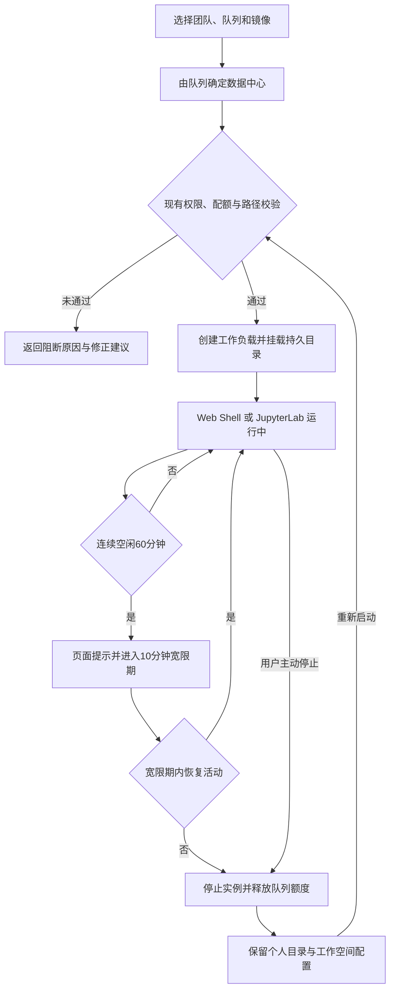

# 3.1 开发环境与配置

模型训练高度依赖运行环境、存储路径和任务配置的一致性。如果开发验证与集群训练使用不同的镜像、挂载和启动方式，小规模试验即使成功，正式训练仍可能因环境漂移而失败。完善开发环境与配置能力，可以让算法人员在受控环境中完成开发验证并直接复用任务规格，同时统一资源计量和路径约束，为后续训练复现、故障定位和自动化编排提供稳定基础。

开发机复用平台已有的团队、资源队列、任务提交和网络盘能力，并通过稳定的候选契约接入镜像管理能力。训练数据由第三方数据工程系统准备，开发机只按外部数据引用挂载就绪数据，不提供数据抽样、预览、处理、脱敏或授权入口。

## 3.1.1 开发机工作空间

### 背景介绍

算法人员需要在与正式训练一致的镜像、存储和权限环境中改代码、验证就绪数据引用并运行小样本。当前痛点如下：

1. 没有平台开发机入口，只能一边在自己的开发机上写代码，一边到平台上提交训练。两套环境来回切换，镜像、路径、依赖和启动命令都要自己对齐，心智负担大，也容易出现“开发能跑、训练找不到文件”。
2. 开发机如果绕开资源队列单独占卡，正式训练的额度就对不上账。
3. 资源队列已绑定数据中心，如果开发机另行选择或隐式推断运行位置，计算落点就可能与数据集的实际存储位置不一致。
4. 开发机如果建起来却长期没人用，空闲`GPU`会一直压着队列，别人也排不进去。

### 建设目标

1. 支持创建、启动、停止和闲置回收开发机，让改代码、验证外部数据引用和提交训练发生在同一套环境里，减少环境切换。
2. 创建时选择现有团队及其已授权的资源队列，申请的卡数计入该队列额度，停止或回收后立即释放。队列所属数据中心同时是开发机的唯一调度位置，页面只读展示该数据中心，不再提供独立的数据中心选择项；如关联现有实验项目，仅用于实验组织和资源统计，不引入项目角色或资源授权。
3. 默认提供不依赖`JupyterLab`进程的`Web Shell`，按需启用`JupyterLab`。开发机持久挂载`/data/hpc/home`和`/share`，通过镜像选择器使用平台预置镜像、常用镜像或授权`Harbor`项目中的远程镜像，并在创建时固化不可变摘要。数据由第三方数据工程系统提供稳定标识和可挂载位置，开发机只按引用挂载，不自动跨数据中心复制数据，也不读取、抽样或处理数据正文。
4. 默认空闲阈值为连续`60`分钟，达到阈值后在开发机页面显示回收提示并进入`10`分钟宽限期；宽限期内仍无活动时，自动停止实例并回收额度。个人目录和未提交的本地修改继续保留，用户可重新启动同一工作空间。阈值允许平台管理员按队列在`15`至`180`分钟内调整，用户可在不超过队列上限的前提下选择更短时间；任务通知模块启用后增加外部通道提醒。

开发机从创建到回收、恢复的生命周期如下：



**空闲回收参考值**：不同公有云对通用交互式开发环境采用了不同的成本与体验平衡：

|参考案例|公开配置|对本平台的启示|
|---|---|---|
|`Azure Machine Learning`[官方文档](https://learn.microsoft.com/azure/machine-learning/how-to-create-compute-instance?view=azureml-api-2#configure-idle-shutdown)|允许空闲`15`分钟至`3`天，命令行示例使用`30`分钟|`30`分钟可作为明确偏向节省成本的起点|
|`Google Cloud Workbench`[官方文档](https://cloud.google.com/vertex-ai/docs/workbench/instances/idle-shutdown)|默认`180`分钟，控制台允许`10`至`1440`分钟|通用笔记本环境可保留更宽松的上限|
|`Amazon SageMaker Studio`[官方文档](https://docs.aws.amazon.com/sagemaker/latest/dg/studio-updated-idle-shutdown-setup.html)|最小值为`60`分钟，命令行示例使用`120`分钟，并演示允许用户在`120`至`300`分钟内调整|阈值应有平台默认值和受治理的可配范围|

综合上述案例，本平台的开发机会直接占用资源队列中稀缺且成本较高的`GPU`，因此采用`60`分钟默认值，在成本回收与交互式开发体验之间取平衡，并通过`10`分钟宽限期降低误回收影响。只有终端和`JupyterLab`均无交互心跳、没有运行中的内核或平台登记任务，且`GPU`平均利用率低于`5%`时，才累计空闲时长；任一信号恢复活动即清零计时。

### 建议方案

开发机复用现有任务调度和资源队列创建长生命周期工作负载，不另建开发机专用资源池。资源队列通过已有查询能力提供唯一调度位置，资源队列或其数据中心不可用时阻止创建并返回明确原因；镜像管理模块提供本地优先候选和远程`Harbor`检索，创建时重新校验权限、用途和兼容性并固化摘要。外部数据引用只保存第三方系统提供的标识、版本和挂载位置，平台不建立数据候选目录或读取数据内容；引用无法解析或挂载时返回明确原因。

平台按现有团队权限、队列额度、路径范围和运行时兼容性做准入校验，运行中把开发机作为队列占用对象计入额度快照。通过终端网关发放短期会话并记录连接日志；用户目录使用持久卷或现有网络盘，`/home/<user>`仅作为到个人目录的兼容软链。闲置判定按上述多信号规则累计；回收前在页面提示并保留宽限期，回收动作幂等且不重复扣额度。开发机模块通过任务规格契约输出草案，不直接创建训练模块内部对象；基础审计启用后补充开发机关键操作记录，不为此增加项目角色或授权模型。

本模块不引入完整`JupyterHub`，不开放绕过平台认证和审计的直连`SSH`，不建设源码仓库，也不在开发机提供从金融云生产或公网一键拉数。开发机只是由平台治理的交互式运行环境，正式任务仍使用不可变镜像和版本化任务规格。

## 3.1.2 统一路径规范

### 背景介绍

应当规范使用`/share/...`及`/data/hpc/home/<user>/...`作为训练任务和开发机的统一路径。

### 建设目标

所有示例、模板、校验提示和详情页统一使用`/share/...`及`/data/hpc/home/<user>/...`，并明确输入、输出、实验和断点目录的用途。历史路径只用于识别并给出迁移提示，不允许新任务继续提交。

### 建议方案

在任务规格校验器中维护统一的路径策略，由页面、命令行和模板共同调用；路径检查分为语法范围、目标集群可见性、读写权限和目录用途四类错误码。不要在不同入口重复硬编码盘符。

## 3.1.3 训练命令行（`CLI`）与统一任务规格

### 背景介绍

大规模训练依赖脚本和批量操作，当前痛点如下：

1. 仅靠页面填写无法形成可审计、可比较和可自动化的任务规格。
2. 页面与命令行字段分叉，复现时对不上同一份配置。

### 建设目标

提供`auth`、`validate`、`dry-run`、`submit`、`rerun`、`logs`和`cancel`能力。页面可导入、编辑和导出同一份版本化`train.yaml`，命令行输出稳定的任务标识、状态、错误码、重试建议和机器可读结果。

### 建议方案

定义单一任务规格模式和兼容版本，由服务端完成默认值填充和最终校验；`Web`与命令行调用同一应用服务。客户端只做即时提示，不能复制服务端规则；提交和再次提交使用幂等键，凭据保存在系统凭据存储而非配置文件。以下使用`aitrain`作为命令名称示例，不将该名称作为平台能力边界。

从开发验证到正式提交使用同一份任务规格，流程如下：


建议的最小命令面如下。页面必须与这些命令共用同一份任务规格和服务端校验结果，避免页面能过、命令行不过，或两边报错不一致：

```text
aitrain auth login
aitrain job validate -f train.yaml
aitrain job dry-run -f train.yaml
aitrain job submit -f train.yaml --output json
aitrain job logs <id> --role worker --replica 0 --tail 200
aitrain job rerun <id> --resume-policy latest
aitrain job cancel <id>
```

## 3.1.4 训练任务模板

### 背景介绍

节点、卡数、并行策略、全局批次、镜像、挂载和`NCCL`参数相互依赖，依靠个人经验拼装会在资源分配后才暴露问题。

### 建设目标

提供官方、团队和个人三级版本化模板，预置经验证的模型规模、资源规格和框架配置。创建任务时联合校验总卡数与张量、流水线、上下文和数据并行关系，检查全局批次整除、显存风险、配置版本和挂载一致性。

模板实例化时需要联合处理的输入和校验如下：

|校验域|模板提供的内容|实例化时的关键校验|
|---|---|---|
|资源拓扑|节点数、单节点卡数、机型和队列建议|总卡数、队列额度、目标机型可用性和整组调度要求|
|并行与批次|张量、流水线、上下文、数据并行度及微批次|并行乘积与总卡数一致，全局批次可整除且梯度累积合法|
|模型与显存|模型规模、精度、优化器和梯度检查点|模型兼容性、显存风险及通信与计算配置冲突|
|运行环境|镜像版本、框架版本、启动入口和环境变量|镜像用途、摘要、驱动、`CUDA`及目标机型兼容性|
|数据与存储|数据、模型、输出、日志和断点挂载片段|路径范围、权限、只读输入、输出占用和跨集群可见性|

### 建议方案

模板保存任务规格片段和受控变量，不复制调度或训练实现；实例化后生成完整快照，后续模板变更不影响历史任务。框架差异通过模板适配器隔离，通用资源与路径校验直接复用任务规格服务。
