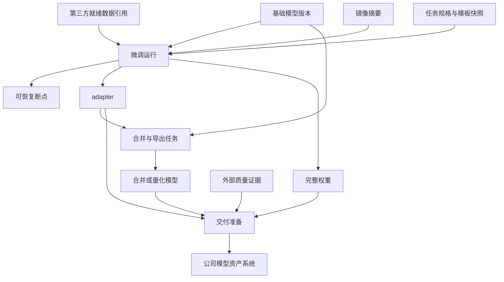

# 3.10 监督微调与后训练

本模块描述监督微调及其它后训练能力启用时所需的任务、外部数据引用、产物和质量证据约束；模块未启用时不影响预训练与模型交付链路。后训练数据仍由第三方数据工程系统完成格式转换、清洗、脱敏、质量、授权、划分、混合和版本管理，训练平台只消费已经准备完成的数据引用。质量证据登记外部离线评测报告或人工结论，不在训练平台内执行评测作业。

当业务需要让预训练模型遵循业务指令、适配特定任务并形成可交付行为时，直接把全量`SFT`、`LoRA`或`QLoRA`当作普通预训练任务提交，会遗漏消息模板、监督范围、基础模型兼容性、差异化产物和质量证据等关键约束。平台需要提供类型化、可复现的监督微调任务，并为偏好优化、多模态和工具调用等后训练方向保留受控扩展点。

## 3.10.1 任务类型与基础模型约束

### 背景介绍

全量`SFT`、`LoRA`、`QLoRA`和偏好优化的输入、资源、产物与质量证据要求不同，作为普通预训练命令提交会漏掉关键约束。

### 建设目标

任务类型显式区分训练方法，按类型展示必填参数和产物；基础模型只能选择已登记且有权限的版本，并校验架构、权重格式、分词器、上下文长度、量化状态和父模型关系。

### 建议方案

在统一任务规格上增加类型化扩展字段，由框架适配器处理具体参数；基础模型兼容性通过模型模块的批量投影契约校验。后训练模块禁用时隐藏专用任务类型，通用预训练不受影响。

建议的任务规格至少明确以下内容，避免关键约束只藏在启动命令中：

```yaml
kind: SFTJob
base_model:
  ref: model://team/base-model/1.2.0
data:
  train: external-data://support-sft/1.0.0
  validation: external-data://support-eval/1.0.0
  chat_template: tokenizer-default
  max_seq_length: 8192
  packing: true
  loss_mask: assistant_only
strategy:
  method: lora
  lora:
    rank: 16
    alpha: 32
    dropout: 0.05
runtime:
  image_version: image://team/sft-runtime/1.0.0
  nodes: 1
  gpus_per_node: 8
  precision: bf16
output:
  adapter_dir: /data/hpc/home/<user>/outputs/<job_id>/adapter
  checkpoint_dir: /data/hpc/home/<user>/outputs/<job_id>/checkpoints
evaluation:
  suites: [business-regression, safety-basic]
```

|训练方式|适用场景|平台重点校验|主要产物|
|---|---|---|---|
|全量`SFT`|数据量较大、模型专用、需要改变全部权重|优化器状态、精度、并行、显存和存储预算|完整权重和可恢复断点|
|`LoRA`|快速试验、多业务适配、保留基础模型|目标模块、`rank`、`alpha`、`dropout`和父模型|基础模型引用与`adapter`|
|`QLoRA`|显存受限或需要提高试验并发|量化位数、计算精度、优化器、硬件和框架兼容|量化训练`adapter`与合并前校验|

启用本模块前，需要明确业务场景、训练方法、第三方就绪数据引用、资源预算和质量责任。平台不保证相同配置产生逐位一致的权重，但必须记录镜像、外部数据标识与版本、种子、资源和全部有效参数，并解释可见差异的来源。

## 3.10.2 就绪数据协议引用与训练参数

### 背景介绍

第三方数据工程系统提供的微调数据引用需要携带明确的协议和监督范围摘要，否则训练平台无法选择兼容的训练模板。当前痛点如下：

1. 外部数据引用没有声明消息协议和模板版本，训练运行时无法确定解析方式。
2. 训练、验证和评测引用没有明确的不可变版本，历史运行难以复现。
3. `loss mask`、最大长度、`padding`和`packing`等训练参数与外部数据协议不兼容时，任务可能在启动后失败。

### 建设目标

训练平台保存第三方数据工程系统提供的数据标识、不可变版本、消息协议、模板版本、训练与验证用途、规模摘要和可挂载位置，并显式配置`loss mask`、最大长度、`padding`和`packing`等训练参数。平台只校验训练模板是否声明支持该协议，不读取样本执行格式转换、字段校验、数据划分、重复检查或泄漏检查。

第三方数据工程系统提供的就绪数据引用至少包含：

|引用信息|第三方系统责任|训练平台用途|
|---|---|---|
|数据标识与版本|提供不可变、可追溯的训练或验证数据版本|写入任务规格和运行快照|
|消息协议与模板|完成格式转换、字段校验和模板验证|选择兼容的训练模板与框架适配器|
|监督与划分摘要|完成监督范围、训练验证划分、重复与泄漏检查|展示外部结论并辅助用户确认引用|
|规模与长度摘要|统计样本量、有效`token`和长度分布|估算资源并校验最大长度等训练参数|
|可挂载位置|保证就绪版本能够被目标训练环境读取|生成运行时挂载配置|

### 建议方案

训练任务只消费第三方数据工程系统已经验证的数据版本和协议摘要，框架适配器根据任务规格传递数据引用与训练参数，不转换或重写样本。引用摘要缺失或训练模板不支持声明的协议时阻止提交，并提示用户回到第三方系统补齐数据或选择其它就绪版本。

## 3.10.3 微调策略与资源估算

### 背景介绍

`LoRA`目标模块、量化、精度、优化器、梯度检查点和分布式策略高度依赖模型与硬件，错误组合往往在排到多机资源后才失败。

### 建设目标

配置并校验`rank`、`alpha`、`dropout`、目标模块、`bf16/fp16`、`8bit/4bit`、`FSDP`或`DeepSpeed`策略，提供单卡、单机多卡和多机模板。提交前根据样本、序列长度和策略估算显存、时长、存储和有效全局批次，并支持小样本`dry-run`。

资源估算需要组合模型、数据、策略和硬件信息：

|输入维度|参与校验或估算的内容|输出结果|
|---|---|---|
|模型与序列|参数量、层数、上下文长度和词表|权重、激活值和注意力显存估算|
|微调方式|全量、`LoRA`、`QLoRA`、目标模块和量化位数|可训练参数量、优化器显存和兼容性结论|
|批次与并行|微批次、梯度累积、张量、流水线、数据和上下文并行|有效全局批次、总卡数和通信约束|
|运行策略|精度、优化器、梯度检查点、`FSDP`或`DeepSpeed`|峰值显存、训练时长和框架配置风险|
|硬件与数据|机型、卡数、带宽、样本量和有效`token`|资源规格、预计时长、存储量及`dry-run`建议|

### 建议方案

兼容矩阵由模板版本和镜像元数据共同提供，估算模型先采用规则与历史校准数据，不承诺绝对精度；实际运行结果回写用于校准。框架适配器把任务规格转换为`ms-swift`、`Transformers`、`PEFT`、`DeepSpeed`或`FSDP`参数，专有参数保留在版本化模板和`YAML`扩展中，不在平台控制面为每个新参数建设独立页面；通用资源校验复用任务服务。

## 3.10.4 微调断点恢复

### 背景介绍

微调中断后只恢复权重会丢失优化器、学习率、随机状态和数据位置，导致重复样本、指标跳变和结果不可比较。

### 建设目标

全量权重和`adapter`断点都保存优化器、调度器、随机状态、数据游标、基础模型和`chat_template`配置；恢复前校验父模型和策略一致性。

### 建议方案

复用通用断点对象和恢复状态机，后训练适配器补充`adapter`与模板元数据校验。断点清单以框架中立字段表达，框架专有文件由适配器负责生成与加载。

## 3.10.5 微调产物分类与来源

### 背景介绍

微调产物如果混放，当前痛点如下：

1. 下游无法判断该加载基础模型、`adapter`、合并模型还是断点。
2. 无法追踪哪个产物真正改善了业务指标。

### 建设目标

任务产物明确区分基础模型引用、`adapter`、合并模型、断点、配置快照和外部质量证据，并记录第三方数据标识与版本、镜像摘要、父模型和生成任务。

微调输入、运行产物和模型资产系统交付之间的关系如下：



### 建议方案

训练完成后生成产物`manifest`，模型交付模块只消费通过完整性检查的产物引用。产物类型使用固定命名类型维护，交付模块通过稳定契约读取投影，不扫描训练目录猜测类型；公司模型资产系统接收后再完成正式资产登记。

## 3.10.6 训练后质量证据

### 背景介绍

只看训练曲线不够判断微调是否成功，当前痛点如下：

1. 训练`loss`下降不代表回答质量提升。
2. 微调还可能造成通用能力或安全能力回归。

### 建设目标

训练平台不执行离线评测作业。微调完成后，通过模型产物交付模块登记项目指定的外部离线评测报告或人工结论；缺少强制证据时不得进入模型资产系统交接。

### 建议方案

质量证据复用交付模块的引用登记、来源记录和审批校验，后训练模块不另建评测运行器或门禁引擎。证据缺失时保持待补充，不静默放行。

## 3.10.7 模型合并与导出校验

### 背景介绍

`adapter`、基础模型、分词器或量化配置不匹配，常到交付和部署阶段才暴露。

### 建设目标

支持`adapter`合并、全量或量化权重导出，校验格式、父模型和分词器，并执行至少一条对话的分词、加载和生成冒烟测试；失败产物可保留但不得进入标准交付目录。

### 建议方案

合并和导出运行在隔离批任务中，使用目标框架镜像并输出新不可变产物，不原地修改训练结果。校验结果作为模型交付的前置证据。

## 3.10.8 模型卡草稿

### 背景介绍

微调模型只有权重和聊天记录时，业务方无法判断适用范围、已知限制、授权和质量风险。

### 建设目标

依据基础模型、第三方数据引用摘要、参数、`adapter`或合并方式、外部质量证据和责任人自动生成模型卡草稿，允许负责人补充用途、限制和失败案例，并作为交付元数据提交给公司模型资产系统。

### 建议方案

模型卡草稿从任务运行、外部数据引用快照和外部质量证据批量读取摘要，人工内容与自动字段分区保存；正式模型卡的定稿、版本和生命周期由公司模型资产系统维护，训练平台不保留另一套资产主数据或数据血缘。

## 3.10.9 早停与最佳断点

### 背景介绍

按固定步数收工并不稳妥，当前痛点如下：

1. 固定步数可能训练不足，也可能过拟合。
2. 最后保存的断点不一定是验证集表现最好的版本。

### 建设目标

支持最大全局`iter`、最大`epoch`、验证指标早停和最小改善幅度，分别标记最新可恢复断点与验证最佳断点，并记录停止原因。

### 建议方案

早停决策在训练适配器内执行，平台负责配置校验、指标展示和断点角色登记；不要让控制面按高延迟指标远程控制每一步训练。

## 3.10.10 回放集与遗忘控制

### 背景介绍

领域数据占比过高可能提高目标任务分数，却损害通用指令和安全拒答能力。

### 建设目标

允许训练任务引用第三方数据工程系统生成的通用指令、安全和领域数据混合版本，展示外部系统提供的有效`token`权重摘要，并在交付时登记的外部质量证据中比较微调前后遗忘指标。

### 建议方案

数据配比、采样和混合版本由第三方数据工程系统维护；后训练任务只保存目标混合版本引用，遗忘对比以交付时登记的外部质量证据为准。

## 3.10.11 切片分析

### 背景介绍

总体均分会掩盖长上下文、少数语言、特定业务标签和高风险样本的退化。

### 建设目标

按长度、业务标签、语言、难度和能力标签分桶查看训练结果，支持与外部质量证据中的对应切片对照。

### 建议方案

切片标签由第三方数据工程系统随数据版本提供；平台按训练指标做分桶聚合，质量对比读取已登记的外部报告摘要，禁止前端拉取全量结果自行计算。

## 3.10.12 多模态与工具调用扩展

### 背景介绍

业务逐步增加图文、音频和工具调用，若文本协议没有稳定扩展点，后续改造会破坏已有任务和数据版本。

### 建设目标

预留媒体引用、尺寸与格式校验、模态`token`统计、工具定义与调用结果以及多模态批处理接口；如后续启动建设，先以扩展点和试验模板交付。

### 建议方案

第三方数据工程系统负责多模态内容处理并提供类型化内容块、媒体引用和清单，训练平台不读取媒体正文或执行模态转换；训练适配器只消费就绪引用。模块未启用时拒绝相应任务类型并隐藏字段，文本任务保持不变。
