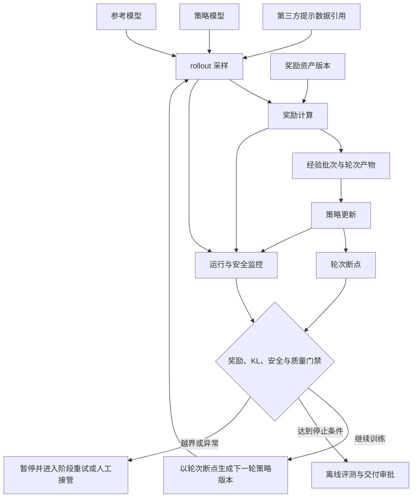

# 3.11 强化学习后训练

本模块描述强化学习后训练能力启用时所需的奖励资产、多角色运行、安全监控和恢复约束；模块未启用时不影响其它训练与模型交付链路。偏好、提示、校准等数据仍由第三方数据工程系统处理并提供就绪引用，训练平台不承担数据工程。

当业务需要在偏好对齐、复杂推理、工具使用或可验证目标优化等场景中引入奖励信号时，强化学习训练会同时涉及策略模型、参考模型、奖励计算、样本生成和参数更新，资源成本高且容易出现奖励投机、训练不稳定或安全指标退化。平台应登记可追溯的奖励资产，编排多角色运行并设置安全监控、阶段恢复和资源隔离，使团队能够受控引入`PPO`、`GRPO`等训练方法，而不在平台控制面重复实现具体算法。

## 3.11.1 奖励资产登记

### 背景介绍

奖励函数或规则隐藏在脚本中，会使同名实验实际优化不同目标，奖励漂移和安全边界也无法追溯。

### 建设目标

登记奖励模型或规则奖励的版本、第三方训练与校准数据引用、评分范围、适用任务、负责人和安全限制，并作为强化学习运行的不可变输入。

### 建议方案

奖励资产复用模型资产标识与第三方数据引用，仅补充奖励协议和校准元数据；规则奖励打包在不可变镜像或版本化脚本中。运行模块通过奖励计算契约调用，不直接读取登记模块内部配置或数据正文。

## 3.11.2 强化学习运行与安全监控

### 背景介绍

在线强化学习跑起来之后，当前痛点如下：

1. 涉及策略、参考、奖励、采样和训练多个角色，任一阶段失败都可能丢失整轮样本。
2. 奖励上升还可能伴随长度偏差、拒答失控或安全退化。

### 建设目标

记录各角色模型、采样配置、`rollout`资源、经验缓存和轮次断点，支持阶段级重试与人工接管；监控奖励分布、`KL`约束、策略熵、拒答率、长度偏差和安全指标。

|阶段|核心输入|平台交付重点|前置依赖|
|---|---|---|---|
|偏好数据准备|第三方数据工程系统提供的偏好数据引用|保存数据标识、不可变版本和协议摘要|第三方数据就绪、授权与污染检查证据|
|奖励资产登记|奖励模型或规则奖励、外部校准数据引用和评分范围|不可变版本、适用场景、限制和负责人|模型资产系统标识、第三方数据引用、安全评测|
|强化学习运行|策略、参考、奖励、采样和训练角色|阶段状态、资源、断点、重试和人工接管|工作流、调度隔离、断点恢复|
|质量判断|奖励、`KL`、拒答率、长度、策略熵和安全指标|训练中监控、基线比较和质量门禁|统一评测、门禁和交付审批|

多角色运行、监控与门禁的关系如下：

### 建议方案

通过工作流编排`verl`、`TRL`等框架任务，不在平台控制面重写算法循环；角色和阶段使用类型化任务规格及不可变产物引用。高频指标进入时序系统，门禁消费聚合摘要，资源与预训练和正式`SFT`队列隔离。

启用本模块前，需要基于业务场景、数据来源、算法框架、资源预算和安全责任评审实施方案；本模块不把某一种奖励算法定为唯一标准，更不允许只因为奖励上升就自动把模型提交给模型资产系统。
