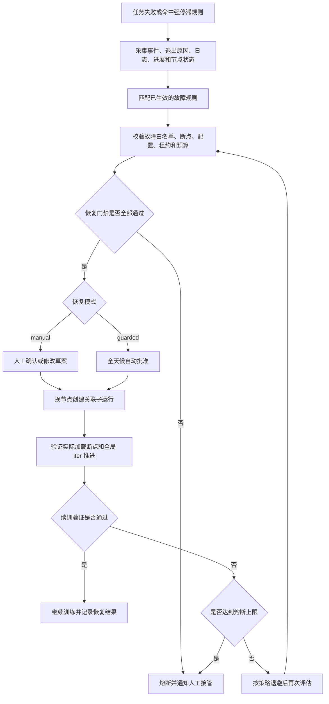

# 3.5 断点与故障恢复

长周期、多节点训练难以完全避免硬件、网络、存储或人工操作导致的中断，训练进程挂起、局部节点性能劣化和多来源故障证据不一致也会持续消耗整作业算力。已经消耗的算力能否保留下来，取决于`Checkpoint`（下文简称断点）是否高效、及时、完整且可加载，故障能否快速检测和正确归因，以及恢复策略是否适合当前故障。完善本能力不仅要把目录文件转化为受管恢复对象，还要建立性能劣化检测、硬件健康诊断、作业内快速重启和受控换节点恢复能力，使长周期训练在故障后尽快继续产生有效进展。

高阶故障恢复不等于不区分原因的无限重启，而是以断点、故障证据、恢复策略和续训验证构成可审计闭环：

|能力层级|核心能力|目标效果|
|---|---|---|
|`L1`：高效受管断点|异步写入、本地分层保存、完整性校验、可加载验证、保留与清理|减少同步写盘阻塞和共享存储峰值压力，并明确识别最近可恢复点|
|`L2`：作业内快速恢复|对节点仍健康的可恢复故障保留当前作业资源，重启训练进程并从断点续训|避免整作业重新排队和重建全部运行环境，缩短可恢复异常的`RTO`|
|`L3`：性能与健康诊断|检测慢`rank`，聚合`GPU`、`NVLink`、`NIC`、进程日志和训练进展证据|尽早识别拖慢整作业的节点，并区分硬件、网络和软件故障|
|`L4`：受控换节点恢复|对白名单故障自动选择最近合法断点、排除故障节点、创建关联运行并验证续训|将夜间中断从“等人处理”缩短为受白名单、预算和熔断约束的自动恢复窗口|

本模块使用训练场景的`RPO`和`RTO`衡量恢复效果。`RPO`表示故障恢复时最多允许回退的全局`iter`或时间，由断点保存频率、校验延迟和新鲜度共同决定；`RTO`表示从故障发生到原作业或关联子运行完成断点加载并再次产生新全局`iter`的时间。只重启进程或重建`Pod`但未成功续训，不能计入`RTO`达成。

统一可观测数据中心、训练故障归因和节点隔离、修复、重新入池已经具备一期基础，本模块复用这些能力，不重复建设通用指标、日志、事件、告警和节点运维系统。一期能力尚未形成按`rank`定位的性能劣化检测、覆盖`GPU`、`NVLink`、`NIC`和软件异常的完整诊断报告，也缺少高效受管断点、作业内快速恢复、可持续校准的故障规则治理和可验证的无人值守恢复。每项能力必须在真实训练环境单独验收，设计、开发环境演示或单次技术验证不计入已建设能力。

可靠性建设先测量基线再确定项目目标，不在规划阶段伪造统一数值。至少持续统计以下指标：

|指标|统计口径|用途|
|---|---|---|
|平均发现时长（`MTTD`）|从故障证据首次发生到平台形成可见故障结论的时间|衡量观测和规则发现速度|
|规则准确性与覆盖率|按故障类型统计准确命中、误报、漏报、未知和证据冲突数量|决定规则是否可以进入影子验证或自动恢复白名单|
|断点前台阻塞时长|同步准备断点和等待写入完成导致训练主循环停顿的时间|衡量异步写入和本地分层保存是否真正减少算力等待|
|断点可恢复率|完整性校验和加载冒烟校验均通过的断点数占已完成写入断点数的比例|衡量保存策略和断点质量|
|慢`rank`定位准确性|已确认性能劣化样本中，平台是否定位到正确`rank`、节点和异常时段|决定性能检测是否可从报告进入主动告警|
|故障归因完整率|故障报告中具备可追溯硬件、网络、软件和训练进展证据的样本占比|衡量证据聚合是否足以支撑故障分类和节点隔离决策|
|作业内恢复成功率|保留原作业资源并完成断点加载和新全局`iter`验证的次数占作业内恢复尝试数的比例|衡量快速恢复是否减少重排队和环境重建|
|`RPO/RTO`达标率|恢复运行满足项目最大回退量和最长恢复时间的比例|衡量恢复是否真正保留进度并及时续训|
|自动恢复成功率|无需人工修改且完成断点加载和新全局`iter`验证的恢复次数占自动尝试次数的比例|决定白名单是否扩大或收缩|
|人工介入率|故障运行中需要人工判断、修改或接管的比例|衡量无人值守能力的实际覆盖范围|
|有效训练时长占比|产生有效训练进展的时间占任务总墙钟时间的比例|衡量故障、等待和重复训练对长周期任务的综合影响|

## 3.5.1 `Checkpoint`管理与完整性

### 背景介绍

长周期、多卡训练通常会运行数小时甚至数天，进程可能在断点写入过程中因为节点故障、通信异常、存储抖动或人工停止而中断。此时断点目录可能只写入了部分文件、缺少优化器状态，或者文件已经存在但内容校验不完整。如果只根据`iter_0018000`这类目录名选择断点，用户无法知道它是否已经写完、能否被训练代码加载，也无法判断恢复后会从哪个全局`iter`继续。

仅有断点清单仍不足以支撑无人值守恢复。平台还需要管理保存频率、最大可接受回退量、保留数量、保护标记、存储配额和引用关系。如果最近断点过旧、被提前清理或仍在写入，即使故障原因明确，自动恢复也可能丢失过多进度或再次失败。因此，断点必须作为具有策略、状态、血缘和生命周期的一等资源管理。

传统同步断点在写盘期间需要所有训练进程等待，断点体量增大后可能让多机多卡作业停顿数分钟，一方面造成`GPU`空转，另一方面对共享存储形成集中写入压力。因此断点管理必须同时治理“能否恢复”和“保存本身浪费多少训练时间”。

### 建设目标

平台按任务管理断点策略和断点版本，默认目录为`/data/hpc/home/<user>/outputs/<job_id>/checkpoints`，共享断点可显式登记到`/share`。

|管理维度|建设目标|
|---|---|
|保存策略|官方训练模板支持按全局`iter`间隔或时间间隔保存，任务提交时展示预计写入频率、存储开销和最大进度回退量；平台不在框架不支持时强行截取进程内存|
|写入方式|官方训练模板支持异步写入和本地分层保存；异步能力不可用时明确回退到同步保存，不将尚未持久化的本地副本宣称为可跨节点恢复断点|
|状态与完整性|按全局`iter`记录写入中、待校验、可恢复、不可用和已清理等状态，展示大小、文件清单、哈希、写入耗时、校验时间和可加载结果|
|恢复点新鲜度|记录最近可恢复断点的年龄和距当前全局`iter`的差值，按任务策略判断是否超过最大可接受回退量；长时间没有新的可恢复断点时主动告警|
|保留与保护|支持保留最近若干个可恢复断点、里程碑断点和人工保护断点；正被运行、恢复链或交付证据引用的断点不得清理|
|存储治理|按项目和任务展示断点占用、增长速率和预计剩余时间，在配额耗尽前告警；只有满足保留策略且无有效引用时才能幂等清理|

### 建议方案

训练框架适配器将断点策略翻译为对应框架参数。异步保存先在安全点生成一致的状态快照并完成必要的内存暂存，再由受控后台进程执行写入，训练主循环继续执行。上一个写入尚未结束时必须进行背压或跳过新的保存请求，不能无界堆积快照占用内存。本地分层断点先落到任务节点的受控目录，再异步升级到共享存储；平台分别标记“本地可用”和“共享存储已持久化”，节点丢失时不把仅存本地的副本作为跨节点恢复候选。

训练侧只有在所有`rank`完成写入后才生成清单和完成标记。平台异步校验分片、哈希和必要元数据，并将加载冒烟校验作为独立校验任务，按权重格式和并行策略申请完成加载所需的最小可行资源。断点列表和最近可恢复断点摘要只读取业务库索引，文件扫描、校验和保留策略调和异步执行并限制并发，避免列表或详情请求遍历大目录。

断点模块负责断点元数据、完整性和保留策略，任务模块只通过批量摘要契约查询最近可恢复点；恢复编排通过稳定契约引用断点标识，不直接读取目录或内部索引结构。

## 3.5.2 作业内快速恢复与标准化接入

### 背景介绍

大规模训练中，某个`rank`挂起、通信超时或局部训练进程异常，可能使整个分布式作业退出。如果不区分节点硬故障与可原地恢复的进程故障，所有失败都需释放资源、重新排队、重建容器和`Python`进程，会在断点回退之外增加数十分钟甚至数小时的恢复等待。

作业内快速恢复的目标是在节点、存储和作业资源仍健康时尽量保留当前分配，而不是对所有异常强行原地重启。对`GPU`硬件、节点失联或持续性网络故障，必须转入节点隔离和换节点恢复，不能为了缩短`RTO`继续使用疑似故障资源。

### 建设目标

1. 对节点仍健康的挂起或进程异常，在不销毁当前作业资源的前提下重建训练进程组，并从最近合法断点续训。
2. 对经过验证的可恢复异常支持进程内恢复，减少容器和`Python`进程重建开销；恢复前必须清理旧的分布式进程组、通信资源和异步断点任务，不支持未验证的任意异常继续执行。
3. 恢复成功必须以断点实际加载、原全局`iter`恢复且新全局`iter`继续推进为准；只重启进程或显示运行不视为恢复成功。
4. 每次作业内恢复记录故障指纹、健康检查结果、断点标识、恢复层级、进程退出与重启时间、续训验证和最终结果，达到次数或时间上限时熔断并转人工或换节点恢复。
5. 将通过故障注入和真实任务验证的共性逻辑沉淀为统一容错启动器和模块化容错`API`，统一处理`rank`心跳、挂起超时、恢复次数、退避、断点选择和续训结果上报，避免各算法团队重复实现。

故障处理路径按资源健康和可恢复性选择：

|故障场景|首选恢复路径|禁止或降级边界|
|---|---|---|
|`rank`挂起或局部进程异常，节点健康|保留作业资源，重建进程组并从断点续训|超过重试上限或同一指纹重复发生时熔断|
|已验证的可恢复软件异常|在同一`Python`进程内清理训练运行时并重建训练链路|清理不完整、未能加载断点或续训验证失败时降级为进程组重建|
|`GPU`硬件、节点失联或持续网络故障|隔离疑似节点，通过`guarded`恢复在替代节点创建关联运行|禁止在原节点重复原地重启|
|数据、配置、代码或确定性显存不足|保留证据并转人工修正|禁止使用原配置自动循环重试|

### 建议方案

容错启动器作为训练工作负载的组成部分，只管理该作业的进程、心跳和快速重启，不直接修改节点健康状态或资源队列。框架适配层仅隔离`DDP`、`PyTorch Lightning`等训练框架的心跳、断点加载和运行时清理差异，任务、断点和故障模块继续通过稳定契约交换恢复请求与结果。

平台先在小规模真实任务中分别注入可恢复进程退出、`rank`挂起和不可恢复节点故障，验证路由、资源保留、断点加载、`RTO`和熔断行为，再逐项扩大支持的框架和故障白名单。禁用快速恢复组件时，标准任务提交、失败记录和人工再次提交仍正常工作，前端隐藏作业内恢复配置和结果入口。

## 3.5.3 慢节点与性能劣化检测

### 背景介绍

同步分布式训练的每个全局`iter`都受最慢`rank`限制。个别`GPU`、`CPU`、数据读取或通信链路逐步变慢时，任务仍会继续运行，但整组设备的有效吞吐被单个慢`rank`拖低。仅观察任务平均吞吐或节点平均`GPU`利用率，无法稳定回答哪个`rank`、哪台节点和哪个时段首先出现劣化。

### 建设目标

1. 按`rank`采集和比较步耗时、吞吐、`GPU`计算时间、`CPU`处理时间和可用的通信等待摘要，保留`rank`、节点、任务阶段、时间窗口和数据新鲜度。
2. 使用同一作业的横向差异和该`rank`的近期稳定基线识别持续性劣化，分开报告绝对性能偏低和相对其它`rank`的异常偏慢，不使用一个固定阈值覆盖所有模型与规模。
3. 识别并抑制首次编译、评测、断点写入、超长序列批次和指标采集失败引起的误报；证据不足时输出未知，不根据单次抖动隔离节点。
4. 为每次异常生成慢`rank`报告，列出首次异常时间、持续时长、影响的全局`iter`、与组内中位数的差异、疑似`rank`和节点，并保留可追溯证据。
5. 任务详情通过批量只读投影展示性能劣化摘要并进入报告；任务模块只负责展示和导航，不重复计算`rank`性能基线。

### 建议方案

性能检测使用训练框架输出的受控分段耗时和统一可观测数据中心已有的设备摘要，在异步分析链路按任务和时间窗口生成派生报告。原始高频指标仍由可观测系统持有，业务库只保存报告索引、摘要和证据引用，不复制高基数时序数据。检测开销、报告延迟和误报结果需在不同训练规模下压测；超过预算时降低采样率或暂停分析，不得阻塞训练主循环。

## 3.5.4 故障归因与健康诊断

### 背景介绍

大规模训练崩溃后，`GPU`硬件、`NVLink`、`NIC`或`IB`网络、分布式通信以及训练代码异常可能表现为相似的超时或进程退出。如果硬件健康数据、多`rank`日志、调度事件和训练进展分散在不同系统，值班人员很难判断应该原地恢复、换节点恢复还是修正代码，误判会导致无效重试或故障资源再次进入训练。

### 建设目标

1. 以任务、故障时间窗口和受影响`rank`为索引，聚合`NVML`设备健康数据、`Xid`与`ECC`事件、`NVLink`状态、`NIC/IB`网络摘要、`NCCL`错误、调度事件、多`rank`日志和训练进展，保留证据来源、原始发生时间、采集时间和新鲜度。
2. 故障报告按硬件、网络、训练框架、用户代码、存储、数据与配置等类型输出已确认、疑似、未知或证据冲突结论，每个结论必须引用支撑证据，不强行为证据不足的故障归类。
3. 报告展示首个异常`rank`、疑似节点、故障指纹、受影响范围、处置建议、禁止动作和待补充证据，并可从任务详情进入对应日志上下文、节点健康记录和恢复链。
4. 系统健康检查只输出证据和诊断结果，故障规则治理决定证据满足什么条件时允许什么动作，节点健康能力仍是隔离、修复验证和重新入池的唯一责任方。

故障证据的主要来源和边界如下：

|证据来源|重点信号|使用边界|
|---|---|---|
|`NVML`与节点健康能力|`GPU`设备状态、`Xid`、`ECC`、驱动和可用的`NVLink`摘要|设备状态缺失或过期时不得判定硬件健康|
|网络与分布式通信|`NIC/IB`链路、错误计数、超时、`NCCL`错误和受影响节点范围|通信超时不等同于网络硬故障，必须结合节点和进程证据|
|分布式日志|`rank`、进程、尝试次数、首个异常和前后上下文|日志文本只是证据，不把单条错误文本直接当作最终归因|
|任务进展与调度事件|全局`iter`、吞吐、任务阶段、`Pod`状态、调度和容器退出原因|用于确认时间线和影响范围，不用单一低利用率或进展超时猜测根因|

### 建议方案

诊断服务通过只读契约批量消费统一可观测数据中心和节点健康能力已有证据，按任务和时间窗口生成不可变证据快照与故障报告。不重复采集原始高频指标或大体量日志，不直接访问其它模块的内部存储结构。数据源不可用、过期或证据冲突时，报告降级为展示已收集证据和未知结论，不影响任务运行与人工排障。

## 3.5.5 再次提交与恢复策略

### 背景介绍

训练失败后，用户通常会直接点击“再次提交”，但再次提交本质上只是创建一次新的运行，并不代表训练代码一定加载了断点。如果平台没有明确记录恢复策略和实际加载结果，新运行可能悄悄从头初始化，用户却误以为已经接着原进度训练。即使确实找到了断点，基础模型、分词器、数据游标、并行配置或输出目录发生变化，也可能导致断点与当前任务不兼容；原任务尚未完全退出时再次提交，还可能并发写入同一目录并破坏可恢复状态。恢复失败后用户很难区分是断点损坏、配置变化还是根本没有执行加载，因此需要在提交前展示恢复依据和差异，在运行后记录可核实的实际加载结果。

### 建设目标

再次提交支持`never`、`latest`和`specified`恢复策略，预览候选断点、配置差异、目录占用和兼容性。平台不隐式改变训练代码行为，但必须记录实际加载的断点、恢复后的全局`iter`或从头初始化结果。无人值守自动恢复只能使用`latest`策略选择满足完整性、兼容性、新鲜度和最大回退量约束的最新断点；`specified`仅用于人工选择历史状态。

|恢复策略|训练初始化|断点使用|适用场景|
|---|---|---|---|
|`never`|重新初始化模型和优化器|不加载已有断点|新配置对照、清理旧状态、明确从头训练|
|`latest`|从最近合法状态继续|平台选择最新完整断点，训练代码执行加载|硬件故障恢复、同一输出目录继续训练|
|`specified`|从指定历史状态继续|用户选择完整断点，平台校验其兼容性|回到指定全局`iter`复现实验或比较阶段结果|

### 建议方案

将恢复策略作为任务规格字段，由框架适配器翻译为训练参数；恢复校验比较基础模型、分词器、数据游标和并行元数据。新运行与原运行通过父子关系关联，输出目录采用运行级锁或租约防止并发覆盖。

## 3.5.6 停止信号与风险提示

### 背景介绍

训练任务可能因为预算、资源抢占、数据问题或发现配置错误而需要人工停止，但停止动作本身也可能发生在断点写入或指标更新之间。当前的停止确认通常只说明“任务将被取消”，没有告诉用户最近一个完整断点在哪里、当前全局`iter`是多少、仍有多少进度没有落盘，也没有说明之后再次提交是否具备恢复条件。值班人员只能凭经验决定是否继续等待、立即停止或先保存状态，容易误删仍可用的进度；停止后又可能把“没有确认断点”误认为“可以自动恢复”。此外，如果容器入口没有把终止信号传递给真正的训练进程，或者训练代码收到信号后没有主动保存并退出，云原生运行环境会在宽限期结束后强制终止进程，最后一段训练进度和正在写入的断点都可能丢失。因此，平台需要同时明确停止前风险和统一的信号处理规范，让训练框架、容器启动器与平台对“何时落盘、等待多久、何时强制停止”形成一致约定。

### 建设目标

1. 停止确认展示最后一个完整全局`iter`、最近断点写入状态、当前进度、预计丢失步数和实际停止宽限期；用户确认后记录停止原因和风险快照。
2. 用户主动停止、平台策略停止和人工或无人值守恢复前的旧任务清理，都统一走云原生容器终止流程。平台向任务的全部训练`Pod`发起停止，容器主进程收到`SIGTERM`后必须将信号传递给训练启动器和训练进程组。
3. 训练进程收到`SIGTERM`后，应停止开始新的全局`iter`，在框架允许的安全点协调各`rank`保存权重、优化器、调度器、随机状态和数据游标，写入断点完成标记，刷新日志与指标，然后主动退出。无法在宽限期内完成时，不得把未写完目录标记为完整断点。
4. `Kubernetes`工作负载的`terminationGracePeriodSeconds`默认设置为`30`。从发送`SIGTERM`开始计时，全部训练进程在`30`秒内退出则记录为优雅停止；到期仍未退出时由运行环境发送`SIGKILL`并记录为强制停止。经验证确实需要更长落盘时间的官方训练模板可以显式声明受治理的宽限期，并在提交预览和停止确认中展示实际值，不能无限等待。

停止过程统一按以下结果判定：

|停止场景|信号与时限|训练进程责任|平台记录|
|---|---|---|---|
|用户或平台正常停止|向全部训练`Pod`发送`SIGTERM`，默认等待`30`秒|在安全点停止新步骤，协调落盘、写完成标记并主动退出|优雅停止时间、退出状态、最后完整断点和预计损失|
|宽限期超时|运行环境发送`SIGKILL`并强制结束容器|进程不再有落盘机会，未完成目录不得作为恢复候选|强制停止时间、未退出实例、最后已确认完整断点和可能损失|
|节点失联或进程崩溃|可能无法送达`SIGTERM`|不能依赖临终落盘|异常终止证据，并只使用故障前已经完成校验的断点|

### 建议方案

停止控制器在执行取消前读取断点与进展摘要的同一时点快照，并使用幂等取消语义；重复停止请求不得重复发送信号或覆盖第一次停止原因。任务工作负载写入默认`30`秒的`terminationGracePeriodSeconds`，容器入口通过`exec`启动或显式信号转发，确保`SIGTERM`可以从容器`PID 1`到达训练进程组。框架适配器负责把信号处理翻译为各训练框架的安全点保存和分布式`rank`协调逻辑，所有断点分片完成后才写入统一完成标记。

平台记录停止请求、`SIGTERM`发出、主动落盘开始与完成、进程退出、`SIGKILL`强制终止等事件，并区分“优雅停止”“强制停止”和“信号无法送达”。摘要不可用时明确标记未知，不阻塞紧急停止，但必须写入审计记录；强制停止后立即触发断点完整性复核，不能因为目录存在就提示可以恢复。

## 3.5.7 故障规则治理与复盘

### 背景介绍

平台已经具备一期训练故障归因能力，但故障类型、驱动版本、网络环境和训练规模会持续变化，现有检测规则需要结合真实样本长期校准。规则如果只有配置文件版本而没有责任人、回放数据、误报与漏报结论、发布审批和回滚能力，就无法说明某次修改是否比旧版本更可靠，也不适合作为无人值守恢复的决策依据。

### 建设目标

1. 将故障规则作为受治理对象，记录规则标识、责任人、版本、适用框架与环境、必要证据、排除条件、阈值、优先级、处置建议、禁止动作、生效范围和变更原因。
2. 每次故障处置后形成可在现有数据可见范围内复用的样本，保存原始证据引用、人工确认类型、真实影响、最终处置和恢复结果；证据不足时标记未知，不为了提高命中率强行归类。
3. 使用历史样本执行离线回放，按故障类型统计准确命中、误报、漏报、未知、证据冲突和平均发现时长。样本量不足时只报告数量与不确定性，不输出失真的百分比结论。
4. 规则依次经过草案、离线回放、影子验证、人工评审、灰度生效和正式生效；影子阶段只记录如果启用会产生的判断和动作，不影响运行任务。发现回归时能够立即回滚到上一稳定版本。
5. 只有正式生效且达到项目验收要求的确定性规则才能进入`guarded`恢复白名单。规则调整后重新执行回放和影子验证，不能沿用旧版本的自动恢复资格。
6. 节点故障规则复用现有节点健康状态和隔离、修复、验证、重新入池结果。故障规则只能建议或请求隔离，不直接修改节点内部状态；节点重新入池必须由节点健康能力完成验证并发布新的可调度状态。

规则从样本进入生产判断的阶段如下：

|规则阶段|主要动作|进入下一阶段的门禁|
|---|---|---|
|草案|基于复盘结论定义证据、排除条件、阈值和动作|责任人、适用范围和禁止动作完整|
|离线回放|在历史已标注样本上与当前稳定版本对比|误报、漏报、未知和发现时长达到项目要求|
|影子验证|消费真实事件但只记录判断，不执行处置|没有出现不可接受的误判或权限越界|
|灰度生效|仅对指定项目、框架、集群或故障类型启用|实际结果可审计，异常可立即回滚|
|正式生效|在批准范围内提供诊断或进入恢复白名单|持续监控效果，环境变化或指标退化时重新评审|

### 建议方案

规则引擎消费统一可观测数据中心提供的结构化证据投影，不从页面文本或单条原始日志猜测故障类型。规则版本、样本标签、回放结果、发布审批和回滚记录分别保存，历史故障结论继续引用当时实际生效的规则版本，不随新规则覆盖。回放和影子结果使用同一规则执行器，避免离线验证与生产判断出现两套语义。

规则治理负责“证据满足什么条件时可以做什么”，无人值守恢复负责幂等执行已经批准的动作。`AI Native`故障辅助可以读取规则和复盘知识并提出建议，但不能直接修改规则、标注真实故障类型或授予自动恢复资格。

## 3.5.8 无人值守故障恢复

### 背景介绍

硬件故障、`NCCL`或`IB`通信异常、节点驱逐等问题，有些只是临时故障，有些则意味着当前断点、节点或任务配置已经不可继续使用。现在用户需要先翻查多处日志判断原因，再手工寻找可用断点、排除故障节点、修改资源规模并重新提交。夜间或无人值守时，可恢复的任务也可能因为等待人工检查而停顿数小时，既延迟训练，也可能持续占用残留资源。

高阶恢复能力需要将已证明可安全处置的故障从“建议人工重试”提升为“平台自动完成恢复并验证续训”。同时，平台不能对所有失败盲目自动重试：不可恢复配置、损坏断点或未隔离故障节点会导致重复失败，无限重试还会放大`GPU`和存储消耗。因此，本模块将无人值守恢复作为明确建设目标，但只在故障白名单、断点校验、重试上限、退避、预算和熔断约束下自动执行。

### 建设目标

1. 只消费已经通过回放、影子验证和评审并正式生效的故障规则。每次失败都生成结构化故障分析清单，记录规则版本、命中证据、检查结果和禁止动作，不依赖值班人员临时拼接证据。
2. 任务支持`manual`和`guarded`两种恢复模式。`manual`模式由平台生成恢复草案并等待有权限的用户确认；`guarded`模式在命中白名单故障且通过全部恢复门禁时，不经人工确认直接创建关联运行，日间和夜间使用同一套可审计规则。
3. 首期`guarded`模式至少覆盖原任务已终止、故障原因明确、替代资源可用且最近断点通过校验的节点驱逐或短时失联。其它故障类型只有在故障节点已隔离、恢复动作可幂等且续训验证可量化时才能逐项加入白名单，不提供不区分原因的全局自动重试开关。
4. 自动恢复必须完成原任务终止确认、输出目录租约回收、故障节点排除、最近合法断点选择、配置兼容性校验、幂等创建子运行，以及恢复后实际加载断点和全局`iter`继续推进验证。只创建新`Pod`不视为恢复成功。
5. 同一故障指纹重复发生、断点加载失败、续训未在验证窗口内推进，或达到次数、时间、回退量、预算任一上限时，自动恢复立即熔断并转为人工接管，不再继续消耗资源。
6. 每次恢复都记录规则版本、故障证据、自动决策、断点标识、回退步数、排除节点、子运行、续训验证和熔断原因。夜间恢复在当时发送事件通知，并在次日生成恢复摘要，便于责任人快速确认最终状态和进度损失。

自动恢复策略至少包含以下约束，具体默认值需在真实训练任务中压测后确定，不在规划阶段伪造统一数值：

|策略项|用途|
|---|---|
|`recovery_mode`|选择等待人工确认的`manual`模式，或允许白名单故障无人值守恢复的`guarded`模式|
|故障白名单|限定允许自动处置的故障类型、适用框架、必要证据和排除条件|
|`max_attempts`与退避|限制滚动时间窗口内的自动恢复次数，并在连续失败时延长再次尝试间隔|
|`RPO`：断点新鲜度与最大回退量|禁止使用过旧断点或回退超过项目可接受范围的恢复方案|
|`RTO`：恢复与进展验证超时|限制从故障发生到子运行启动、断点加载和新的全局`iter`产生所允许的最长时间|
|自动恢复预算|限制恢复期间可额外消耗的`GPU`时长、存储和子运行数，不因无人值守而绕过项目配额|
|通知与接管|配置自动恢复开始、成功、重试、熔断和需要人工介入时的接收人与通知通道|

故障分析清单至少覆盖以下常见类型：

|常见故障|程序检查证据|恢复动作|无人值守边界|
|---|---|---|---|
|节点驱逐或短时失联|调度事件、节点状态、`Pod`退出原因和发生时间|校验断点、排除原节点并换节点创建子运行|首期白名单场景；原任务已终止、原因明确且替代资源可用时可自动恢复|
|`GPU`硬件或驱动故障|设备健康事件、`Xid`摘要、节点告警和受影响`rank`|隔离故障节点，使用最近合法断点换节点恢复|只有节点健康系统已确认隔离故障资源时才可自动恢复，禁止原节点原配置重试|
|`NCCL`或`IB`通信故障|通信超时、错误日志、网络设备状态和相关节点范围|定位疑似节点，通过改变调度落点重建原并行规模|故障范围明确且新运行不使用疑似资源时，可受限尝试一次；不自动改变并行配置|
|疑似训练停滞|全局`iter`、当前阶段、`rank`状态、通信或看门狗证据|先确认非编译、评测或断点写入阶段，再停止原任务并恢复|不得仅凭进展超时自动恢复；只有命中额外的框架看门狗或通信失败规则时才可进入白名单|
|显存不足|`OOMKilled`、退出码、显存摘要和最后一条分配失败日志|建议降低批次、启用激活检查点或调整并行配置|确定性资源配置错误，禁止使用同一配置自动重复提交|
|存储或断点异常|读写错误、挂载状态、分片清单、哈希和完成标记|恢复存储后选择最近合法断点|存储健康未确认或没有满足回退约束的可恢复断点时禁止恢复|
|数据、配置或代码错误|稳定复现的退出原因、参数校验和日志特征|定位字段、文件或代码后由用户修正|确定性错误不自动重试|
|用户主动停止|停止请求、操作人、停止原因和审计时间|保留最后完整断点，等待用户决定是否再次提交|人工意图优先，任何模式都不得自动恢复|
|未知或证据冲突|没有命中规则，或多条证据给出不同结论|展示已完成检查和待排查项，由人工补充结论|不得自动恢复|

### 建议方案

故障分析能力批量消费统一可观测数据中心提供的调度事件、硬件告警、容器退出原因、训练日志摘要和进展信号，按当前生效规则输出标准故障类型、故障指纹、命中证据、可恢复性和处置动作。历史分析保留当时规则版本和证据快照，不因规则更新而覆盖；新规则必须经过第3.5.7节的治理流程后才能影响自动恢复。

恢复编排器使用持久化状态机、运行级租约和幂等键保证同一故障不会被多个实例重复恢复。故障分类、断点校验、资源重新调度、子运行创建和续训验证是可能跨越数分钟且需要在控制器重启后继续的跨模块过程，局部同步回调无法安全承载，因此需要独立的持久化恢复编排状态。幂等键由根运行标识、故障指纹、断点标识和尝试次数共同确定；每次恢复都创建独立子运行，保留完整恢复链，不覆盖原运行记录。`manual`和`guarded`模式复用同一分析、校验和执行链路，区别仅在于是否需要人工批准。

故障分析模块通过只读投影批量获取任务、节点、进展和断点摘要，恢复编排仅调用任务、断点、调度、配额和通知模块的公开契约，不访问其它模块的内部状态。断点、任务、调度或配额能力临时不可用时，当次自动恢复转为待人工接管，不将依赖不可用视为恢复条件已满足。通知失败不阻断已经通过门禁的恢复执行，但必须记录送达状态并按通知策略重试。

|契约所有者|调用方与契约形态|权限与错误语义|
|---|---|---|
|统一可观测数据中心|故障规则引擎按任务和时间窗口批量读取带来源、原始发生时间、采集时间和新鲜度的指标、日志摘要、事件及`FastX`告警投影|按现有角色、团队和任务数据可见范围返回证据；证据缺失、过期或来源冲突时不得通过`guarded`恢复门禁|
|节点健康能力|规则引擎读取节点健康投影，恢复编排器请求隔离疑似节点并批量查询可调度替代节点|隔离、修复验证和重新入池由节点健康能力负责；状态未知、隔离未完成或替代节点不健康时不得自动恢复|
|任务模块|恢复编排器按根运行标识读取运行状态，并以幂等键创建关联子运行|沿用原任务的现有角色与团队数据范围；原运行未终止或幂等键冲突时拒绝创建|
|断点模块|任务观测批量读取最近可恢复点摘要；恢复编排器按断点标识执行兼容性和可加载校验|只返回调用方有权访问的契约投影；无合法断点、校验失败或超出`RPO`时视为恢复门禁不通过|
|调度与配额模块|恢复编排器申请替代资源并预占自动恢复预算|资源不可用时保持待恢复并受`RTO`约束；权限、配额或预算不足时熔断，不绕过治理策略|
|通知模块|恢复编排器发布开始、成功、重试和熔断事件|沿用现有任务通知接收人规则；发送失败记录并重试，不回滚已经通过门禁的恢复动作|

`guarded`模式在通过恢复门禁后会在任何时段自动执行，不以等待人工确认作为正常流程。人工介入只用于用户主动停止、确定性错误、未知或冲突证据、依赖不可用，以及命中熔断上限的场景。

本模块不建设节点硬故障后依赖未持久化内存状态的跨节点恢复。进程内恢复只对已通过故障注入和续训验证的异常开放，不绕过断点、健康检查和熔断门禁；平台不替训练代码隐式补上加载参数，也不保证调整张量并行或流水线并行后一定能够恢复。平台不能根据目录名、单条日志或单一进展超时猜测可恢复性。恢复模块禁用时，任务停止和失败状态仍正常记录，前端隐藏恢复草案和自动恢复策略入口，历史故障清单、恢复链和处理结果继续保留，重新启用后可以继续分析。

## 3.5.9 `AI Native`智能故障辅助与知识闭环

### 背景介绍

确定性规则适合识别证据稳定、处置边界清晰的已知故障，但未知故障和跨来源异常仍需要运维人员关联告警、指标、日志、事件、节点状态和历史处置记录。信息已经进入统一可观测数据中心并不代表形成了可直接行动的证据链；人工逐处查找和解释仍然耗时，复盘经验也容易停留在个人记录中。

`AI Agent`可以辅助整理证据和检索已评审知识，但日志和告警属于不可信输入，可能包含错误结论或提示注入文本。大模型输出也具有不确定性。因此，首期能力定位为训练平台内部、带证据引用的只读故障辅助，由平台按当前用户的数据可见范围构建证据包；模型不持有独立身份或集群操作凭据，也不能直接隔离节点、停止任务、修改规则或批准`guarded`恢复。

### 建设目标

|能力维度|建设目标|
|---|---|
|证据包|按当前用户的数据可见范围和故障时间窗口聚合告警、指标摘要、日志片段、事件、节点状态、断点及恢复记录；保留来源、时间和新鲜度，不向模型发送无边界原始日志|
|知识检索|只检索已评审的故障规则、运行手册和复盘结论，返回知识版本和引用位置；草案、过期或无权限知识不得进入生产回答|
|建议结构|明确区分已确认事实、模型推断、未知项、建议检查步骤、候选处置和禁止动作，每条关键结论必须指向证据或知识引用|
|安全边界|将日志和告警作为不可信输入处理，执行内容分隔和输出结构校验；`AI Agent`仅处理平台构建的证据包，不使用独立服务身份，也不持有集群、节点或恢复执行权限|
|人工确认|高风险处置始终由现有角色中具备操作权限的人员确认并写入基础审计日志；用户采纳、修改或拒绝建议时记录原因，但不自动把用户操作转成新规则|
|评测与发布|版本化模型、提示词、工具契约和知识快照，使用历史故障集评测证据引用完整性、故障类型准确性、危险建议率和未知问题拒答能力，再经过影子和灰度试点发布|
|降级策略|模型、知识检索或证据源不可用时返回结构化证据和确定性规则结论，不阻塞告警、人工排障或已经通过门禁的无人值守恢复|

### 建议方案

由平台按当前用户的现有角色、团队和任务数据范围构建结构化故障证据包，再通过内部只读契约提供给`AI Agent`。模型只负责总结、关联和建议，不直接访问日志存储、集群凭据或模块内部数据结构。提示词、模型、知识和工具版本与每次回答一起记录，输出经过字段校验和证据引用检查后再展示。

试点先覆盖历史样本回放和线上影子建议，统计建议类型准确性、关键证据引用完整性、危险建议率、人工采纳率和平均初步分析时间。没有引用、证据冲突或超出知识范围时必须明确回答未知并转人工处理。该能力与确定性规则引擎、恢复状态机相互独立，停用后隐藏智能建议入口并保留历史审计记录，不影响任务观测、规则判断和`guarded`恢复。
