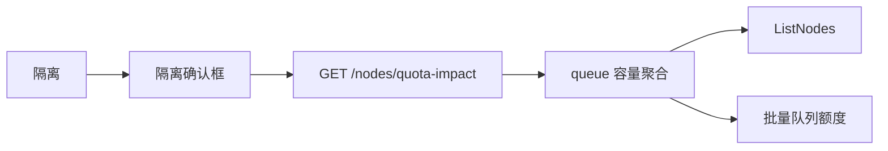

## Context

队列额度预览按数据中心聚合工作节点的`allocatable`，再减去同数据中心其他队列已声明额度。当前实现不看`spec.unschedulable`，也不看故障隔离污点，已`cordon`或已隔离节点仍计入总量。

节点维护入口是「隔离」：`cordon`并写入`maip.io/fault=true:NoSchedule`。确认框只说明不再承接新任务，不提示对已划分额度的影响。产品里没有单独的「禁用节点」按钮；「禁用」对应隔离，「禁止调度」对应`cordon`（隔离会同时设置）。`kubectl cordon`造成的不可调度状态也必须从额度中排除。

## Goals / Non-Goals

**Goals:**

- 额度预览、创建/更新超额校验使用同一口径：只统计已分配数据中心、可调度且未隔离的节点。
- 打开隔离确认框时，服务端一次算出额度是否下降、是否会低于已划分额度，并在确认框中明显展示。
- 用户看清影响后仍可确认隔离；服务端不因超额拦截隔离。

**Non-Goals:**

- 不把`NotReady`单独排除；未禁止调度且未隔离的未就绪节点仍计入额度。
- 不把自定义`NoSchedule`污点（非故障隔离）视为禁用。
- 不在标签/污点编辑、入池、清除数据中心时做额度确认。
- 不自动下调已有队列额度，不改`Volcano Queue`的`capability`。
- 不新增独立的`cordon`按钮。

## Decisions

1. **计入额度的节点：可调度且未隔离**
   - 排除`Schedulable=false`（`cordon`/禁止调度）。
   - 排除故障隔离：存在`maip.io/fault`污点，或标签`maip.io/fault=true`。
   - 未分配数据中心的节点本来就不计入，逻辑不变。
   - 备选是同时排除`NotReady`。拒绝：未就绪不是运维「禁用/禁止调度」动作，kubelet 抖动会让额度预览抖动。

2. **隔离影响用只读`GET /nodes/quota-impact`**
   - 查询参数：`clusterId`、`names[]`（最多 100，与隔离接口一致）。
   - 权限：`ops:node:query`。节点页已有该权限，不必再要`ops:queue:query`。
   - 一次`ListNodes`，再按涉及数据中心`WhereIn`批量查队列额度，禁止按节点或按数据中心循环访问集群/数据库。
   - 备选是前端用现有列表和额度预览自己算。拒绝：节点列表分页，队列列表也分页，算不全。

3. **额度计算仍归`queue.Service`，节点模块注入调用**
   - `CapacityPreview`与超额校验直接排除不可调度/已隔离节点。
   - 新增`PreviewUnschedulableQuotaImpact`：把指定节点视为不可调度后，按数据中心比较`GPU`（分卡型号）、`CPU`、内存的当前总量、隔离后总量、已划分额度。
   - `node.Service`构造函数增加可选的`queue.Service`；未装配时影响预览返回空（额度未变）。禁止在请求路径里临时`New()`。
   - 备选是在`node`包复制一份容量聚合。拒绝：口径必须与队列额度预览完全一致。

4. **确认框提示，不拦截**
   - 打开隔离弹窗即请求影响预览。
   - 有变化：在现有隔离说明之外增加额度提示条，列出数据中心、卡型号、变化前后总量和已划分额度。
   - 隔离后某项总量低于已划分额度：提示条用危险样式，写明将超额。
   - 无变化或节点本就不计入额度：不出现额度条。
   - 预览失败：提示无法预估，仍允许确认隔离，避免挡住故障处置。
   - 备选是超额时拒绝隔离。拒绝：维护窗口需要把故障节点立即隔离；额度由运维事后调整。

5. **「额度变化」指可调度总量下降**
   - 只要这些节点当前计入额度，隔离后`GPU`/`CPU`/内存总量变小即提示，即使剩余仍大于已划分额度。
   - 已隔离或已`cordon`的节点再点隔离，总量不变，不提示。

## 复杂度与性能

- 不新增抽象层：复用`queue.Service`与现有节点确认框。
- `quota-impact`：1 次列出节点 + 1 次按数据中心批量查队列，成本不随节点数变成`N+1`。
- 额度预览与创建校验共用同一排除函数，避免两套口径。

## Risks / Trade-offs

- [已划满额度的数据中心隔离后立刻超额] → 确认框用危险样式写明超额量；不自动改队列，避免静默改`capability`。
- [预览失败时运维看不到影响] → 弹窗写「无法预估额度影响」，隔离按钮仍可用。
- [与`kubectl cordon`并存] → 额度预览按实时`unschedulable`排除，不依赖平台维护记录。
- [队列模块未装配] → `queue.Service`为空时影响预览为空，隔离流程不中断。

## Migration Plan

只发 API 与前端。旧客户端忽略新接口，额度预览总量可能变小，超额校验更严。回滚后恢复把不可调度节点计入总量，隔离确认框去掉额度条。

## Open Questions

无。
