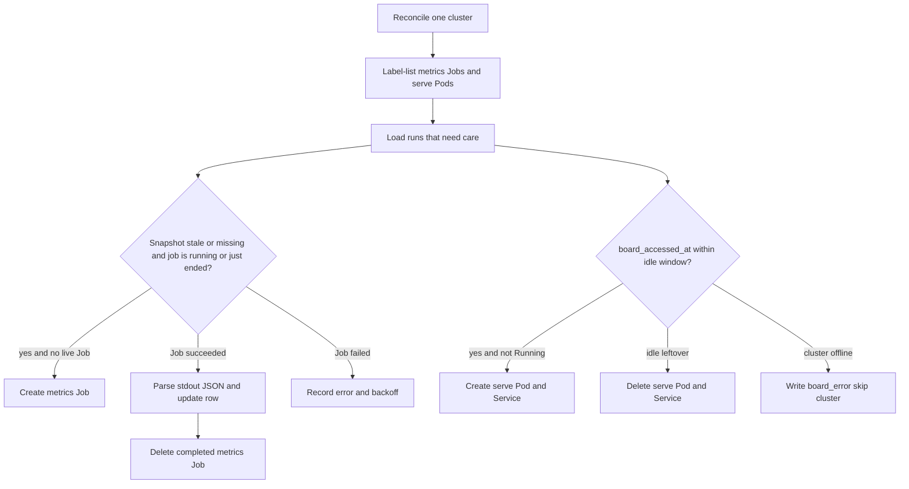

## Context

训练中心已落地任务列表、提交、详情、我的队列与配置管理。`training-center`明确不实现实验分析与`TensorBoard`。`prototype.v4`已有项目侧栏、`Run`列表、详情页签（`TensorBoard`/曲线、超参、产物、系统指标、概览）和对比页。

控制面管理多集群、多机房，各机房`NFS`不是同一套服务，不能挂`/data/hpc/home`。探索结论：不把`tfevents`拷进对象存储或拆成时序表；外层只要最新`Loss`、`step`、吞吐；完整曲线在任务所在机房按需打开`TensorBoard`；读盘与看板由平台自动维护，训练脚本不增加上报`SDK`。

约束与既有迭代相同：`GoFrame v2`分层、构造函数显式注入、`PostgreSQL`幂等 SQL、禁止`N+1`、前端视觉以原型为准。`.agents/rules/frontend-ui.md`、`.agents/rules/i18n.md`、`.agents/rules/data-permission.md`仍缺失。`kube.ClusterClient`目前只有`Volcano Job`、`ConfigMap`、训练`Pod`日志，没有普通`Job`/`Pod`/`Service`与`Pod`代理。仓库尚无`service/cron`。

## Goals / Non-Goals

**Goals:**

- 拥有训练菜单的会话可使用实验分析：管理项目、按项目浏览`Run`、打开详情与对比。
- 提交训练任务时注入约定`TENSORBOARD_LOGDIR`，并自动创建一条关联`Run`。
- 任务与实验可互跳；列表与详情外层展示最新标量快照，未读到则为`—`。
- 平台在任务所在集群、所在机房自动创建并维护读盘`Job`与看板`Pod`；用户打开页签时反代`TensorBoard`。
- 读文件格式统一用`EventAccumulator`；任务之间只换`logdir`与可选 tag 别名。

**Non-Goals:**

- 不把`tfevents`、`swanlog`、`checkpoint`或整棵`outputs/`同步到`COS`/`MinIO`或`PostgreSQL`时序表。
- 不在训练脚本中插入指标上报`SDK`。
- 不接入`SwanLab`/`W&B`，不支持无训练任务的离线`Run`。
- 不跨机房用一个`TensorBoard`叠完整曲线。
- 不实现产物目录浏览、续训、任务页值班卡住检测、开发机。
- 不把实验代理做成`Volcano Job`，不申请`GPU`。
- 不引入字典模块、独立行级权限表、多租户或`KMS`。
- 不实现集群概览。

## Decisions

### 1. 两张业务表：项目与`Run`，外层只存最新快照

`exp_project`保存名称、描述。未删除项目名称唯一，创建后仍可改名；Seed 标识`default`不可改名。Seed 一条标识为`default`、显示名「默认项目」的行，未指定项目的任务自动挂到这里。项目删除为软删除，不是归档标记；`default`不可删除，其它项目删除时其下`Run`改挂到`default`。侧栏只用于选择项目：展示名称与实验数量，不展示描述；描述只出现在右侧选中区域。编辑与删除也放在选中后的右侧区域。侧栏对已加载的项目列表分页（默认每页 10 条），「全部项目」置顶且不计入分页；创建或更新后翻到该项目所在页。任务创建下拉与移动实验弹层仍使用完整列表，因此项目列表接口保持一次返回未删除项目，不在本次拆分页契约。

`exp_run`保存名称、项目、集群、团队、可选`job_id`、`tb_logdir`、机房、创建人，以及外层快照：`last_loss`、`last_step`、`max_steps`、`last_tokens_per_sec`、`metrics_at`、`metrics_error`。看板访问记`board_accessed_at`、`board_error`。`job_id`在未删除范围内唯一（一个任务至多一条`Run`）。

两表均含`created_at`、`updated_at`、`deleted_at`，走`GoFrame`自动时间与软删除，禁止手写这些字段。项目管理用删除，不再提供归档/恢复。`archived`列保留兼容，写入时保持`false`，已归档非默认行在迁移中转为软删除。

不建指标时序表。进度百分比由`last_step / max_steps`在展示层计算；`max_steps`本迭代允许为空（只展示当前`step`）。`Run`状态不单独维护状态机，列表展示关联任务的平台状态；无任务时（本迭代不会出现）再显示`Run`自有占位。

备选是只在`train_job`上加快照列。拒绝：实验页按项目过滤、删除项目、无任务扩展、模块关掉后任务表不应死绑实验字段。任务列表需要快照时，对当前页`job_id`一次`IN`查询`exp_run`装配，禁止按行查。

### 2. 提交任务时注入路径并创建`Run`

约定路径：

`/data/hpc/home/<owner_username>/outputs/<任务名>/tensorboard`

平台向训练容器注入`TENSORBOARD_LOGDIR`。用户环境变量已有同名键时不覆盖。配置挂载仍走`/data/hpc/home/<user>/experiments/<任务名>/configs`，与跟踪目录分成两棵树。

`trainjob.Create`在业务行与`Volcano Job`成功后调用`exprun.EnsureForJob`。`exprun`通过构造函数注入`trainjob`，`trainjob`只依赖`exprun`上的窄接口（例如`EnsureForJob`），避免循环实现依赖：由`cmd`装配时注入。`EnsureForJob`失败只记日志并写`Run`错误，不回滚已提交的训练任务。

创建任务表单可选择实验项目；省略则挂到`default`。打开实验列表时，为当前集群尚无实验行（含已软删除）的历史任务补建`Run`。用户可把`Run`移动到其它项目或软删除；已删除的`job_id`不再补建。

### 3. 同一实验代理镜像，两种命令；对账由实验模块执行

镜像`experiment-agent`（`kind`由`hack/deploy/experiment-agent`构建并加载）提供：

| 命令 | 形态 | 作用 |
| --- | --- | --- |
| `metrics` | `batch/v1 Job`，`restartPolicy=Never` | 读`$TENSORBOARD_LOGDIR`，向标准输出打印一行`JSON`后退出 |
| `serve` | 长`Pod` + `ClusterIP Service` | 启动`tensorboard --bind_all --port 6006`，带与反代一致的`path_prefix` |

二者共用`logdir`、机房`nodeSelector`（`maip.io/datacenter`）、`/data/hpc/home`与`/share`挂载（`kind`无盘时允许挂载失败或使用`emptyDir`，读盘失败视为未上报）。不申请`nvidia.com/gpu`，不进`Volcano Queue`。对象落在命名空间`maip`，用标签识别：

- `maip.io/agent=experiment`
- `maip.io/role=metrics`或`serve`
- `maip.io/run-id=<数字ID>`

对象名稳定，例如`exp-<runId>-metrics`、`exp-<runId>-tb`。`ownerReference`不得指向训练`Volcano Job`，以免任务删除后历史看板与末次读数被级联销毁。

`metrics`标准输出信封（标量，不是文件）：

```json
{"ok":true,"step":21000,"loss":1.822,"tokensPerSec":null,"tags":["lm loss"]}
```

解析只用`tensorboard`的`EventAccumulator`，只取 scalar 每个 tag 的最后一点。默认别名：

| 外层字段 | 按序命中的 tag |
| --- | --- |
| `loss` | `lm loss`、`lm-loss`、`loss`、`train_loss`、`Loss` |
| 吞吐 | `tokens_per_sec`、`tokens/sec`、`throughput` |
| `step` | 命中`loss`那条标量的最大`event.step`；否则任意 scalar 的最大`step` |

对不上的字段输出`null`，页面显示`—`。根目录无 scalar 时再尝试子目录`train`。正在写入导致最后一条 record 损坏时跳过坏尾。不把`throughput`（可能是`TFLOP/s`）在无`tokens*` tag 时标成`tok/s`；命中`throughput`时仍写入`last_tokens_per_sec`但详情用中性文案「吞吐」，避免谎称单位。

读盘`Job`成功后，对账从`GetPodLogs`解析该行`JSON`并`UPDATE`快照，然后删除已完成的`metrics Job`以免堆积。不让机房`Pod`回调控制面`HTTP`：训练网段未必能打到管控面，且与现有`GetPodLogs`同路。

### 4. 期望态对账，而不是页面里随手创建

`exprun.Reconcile`是唯一创建/检测/回收入口。由新建的`internal/service/cron`注册，间隔 30 秒；`cmd`在 HTTP 启动时调用`cron.Start`。打开看板的接口在返回前对**这一条**`Run`再对账一次`serve`，避免干等到下一轮定时。

每个已接入且健康的集群：**一次**按标签列出`metrics Job`与`serve Pod/Service`，再与该集群需要维护的`Run`集合对齐。禁止按`Run`循环`GetPod`。

期望规则：



需要维护的`Run`：关联任务为运行中/启动中，或结束时间在最近一次对账窗口内且尚未成功读过终态快照，或`board_accessed_at`仍在空闲窗口（默认 20 分钟）内。历史且无人看的`Run`不对账集群。

空闲窗口从最近一次成功打开看板或反代流量刷新的`board_accessed_at`起算。模块随训练中心启用；若后续关闭实验能力，对账停止并删除仍活着的`serve`对象，库中`Run`保留。

备选是每个 running 任务常驻`TensorBoard`兼做采集。拒绝：没人看时也占用机房进程；列表采集用短`Job`即可。

### 5. 看板反代走 Kubernetes API，不把 6006 暴露到公网

`POST /api/training/experiments/{id}/board`（动作，允许副作用）：校验可见性，写入`board_accessed_at`，对账`serve`直至`Ready`或超时（约 45 秒），返回同源反代前缀。

`GET /api/training/experiments/{id}/board/*`：会话鉴权后，用集群客户端把请求转到该`Pod`的 6006（`Pod`代理或等价 SPDY）。控制面只需能访问各集群`API Server`，不必直连`Pod IP`。

`serve`启动参数带与此前缀一致的`--path_prefix`。前端详情默认页签「`TensorBoard` / 曲线」用`iframe`加载该前缀；若静态资源因前缀失败，同一页签提供「新标签打开」并记录为已知限制，不因此阻塞外层快照。

跨机房对比：对比页展示各`Run`外层快照与超参 Diff（超参取关联任务的配置快照：镜像、环境变量、节点/卡数；本迭代不做完整`YAML`超参树）。仅当所选`Run`的`cluster_id`与`datacenter_code`全部相同，才提供「打开`TensorBoard`对比」（同一`serve`使用`--logdir_spec`或父目录）。否则说明完整曲线不能跨机房叠加。

### 6. 页面、接口与权限

前端对齐`prototype.v4`：`/training/experiments`列表（项目侧栏、筛选、分页、勾选对比）、`/training/experiments/:id`详情、`/training/experiments/compare`。任务详情增加关联实验横幅；任务列表增加`Loss`与进度列（未上报`—`）。实验分析使用与任务列表相同的工作集群选择。

接口挂在`api/training/v1/`，按用途拆文件，`permission`为`training:experiment:query`或`training:experiment:update`。时间点响应字段为 Unix 毫秒。列表筛选、排序、分页在数据库完成后再批量装配任务名与快照，禁止为每一行再打详情。

可见性与任务相同：非管理员仅所属团队；管理员可见当前工作集群。项目本身不按团队切分（Seed 的默认项目全局），`Run`按团队过滤。本迭代创建项目不绑定团队，避免把实验「项目」做成第二套团队模型。

### 7. 复杂度判断

- 扩展已有`kube.ClusterClient`，不为实验再包一层集群客户端。新增窄方法：创建/列出/删除`batch/v1 Job`、`Pod`、`Service`，以及`Pod`端口代理。返回投影结构，不泄漏`corev1.Pod`。
- 服务拆`expproject`与`exprun`。代理对账是`Run`的运行时，放在`exprun`，不第三套 CRUD。
- 定时任务必须进`service/cron`：本迭代新增该组件，只注册`exprun.Reconcile`，业务逻辑不写在`cron`包内。
- 不为快照建流水表；不为每个框架写读盘脚本。
- `kind`无真实`NFS`：代理仍可调度，读盘失败写`metrics_error`，页面`—`，E2E 用接口替身或空目录验收外层与菜单，不把真实曲线当作`kind`门禁。

## Risks / Trade-offs

- [各机房节点未挂`/data/hpc/home`] → 读盘`Job`失败，外层`—`，看板为空；详情展示`metrics_error`中文说明，不把训练任务标失败。
- [训练未写`tfevents`或 tag 对不上] → 按别名表空字段，不猜测。后续只加别名。
- [`TensorBoard --path_prefix`导致`iframe`静态资源 404] → 页签保留新标签打开同源反代；外层快照不受影响。
- [对账创建过多短`Job`] → 仅对运行中或刚结束且快照过期的`Run`创建；成功即删；失败指数退避。
- [控制面到`API Server`代理大流量看板] → 只服务已授权的单个`Run`；不把 6006 打到公网；可接受相对直连`Pod`的额外一跳。
- [EnsureForJob 失败] → 训练已提交成功，后台对账或用户打开实验页可补建`Run`（按`job_id`幂等）。
- [规则文件缺失] → 视觉对齐原型；文案中文；团队过滤代替行级权限模块。
- [字典模块未落地] → 代理角色、`Run`展示态用`Go`命名类型。

## Migration Plan

1. `make db.init`执行`006-experiment-analysis.sql`（含默认项目 Seed）。
2. `make dao` / `make ctrl`。
3. 构建并`kind load`实验代理镜像；已有`kind`集群无需为训练`Job`重建。
4. 已有历史任务：对账或打开实验页时按任务补建`Run`（幂等`job_id`）。

回滚：停对账、删除带`maip.io/agent=experiment`的对象、丢弃两张新表。不修改`Volcano Job`规格以外的已有训练字段；仅多注入的环境变量可忽略。

## Open Questions

无阻塞问题。生产环境是否给实验代理`Pod`挂真实`NFS`由部署清单后续补，不挡本迭代接口与页面。
