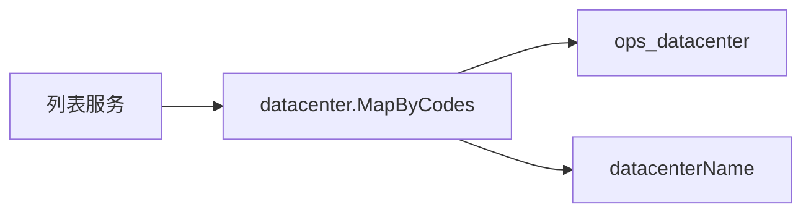

## Context

`DcBadge`文案是`shortName || name || code`。队列、节点、团队页会再请求数据中心列表做`dcMap`；任务列表与我的队列只传`datacenterCode`，算法工程师又没有`ops:datacenter:query`，所以只能看到标识。

## Goals / Non-Goals

**Goals:**

- 所有列表数据中心列主文案为显示名称
- 列表接口一次批量装配名称，无`N+1`
- 未登记的标识回退显示标识本身

**Non-Goals:**

- 不改数据中心管理页（该页已同时展示名称与标识）
- 不把筛选下拉的选项值从标识改成名称（值仍是`code`，可见文案已是名称）
- 不把历史任务快照里的标识改写成名称

## Decisions

1. **列表接口投影名称，不让训练页去调数据中心列表**
   - 算法工程师看不到运维数据中心 API。
   - 契约已要求关联名称由列表接口提供。

2. **`datacenter.MapByCodes`一次`IN`查询**
   - 返回`NameRef`（`code`/`name`/`shortName`/`color`），不做用量统计。
   - 空切片不访问数据库；缺失键不出现在 map 中。

3. **队列投影在`projectItems`里装配，任务在`List`/`Get`装配**
   - 我的队列、团队关联队列都走队列投影，可复用。
   - 任务行上的`datacenter_code`是快照，按当前登记表解析名称。

4. **徽章主文案为`shortName || name || code`**
   - 列表角标用简称；无简称回退全称，未登记回退标识。
   - `title`带全称与标识，方便对照`maip.io/datacenter`。

## 复杂度与性能

- 不新增中间层。每页最多 100 行、去重后一次`IN`查询。
- 节点列表只给当前页装配，不给未展示节点查名称。

## Risks / Trade-offs

- [数据中心已删但任务仍有旧标识] → 回退显示标识，`title`仍是该标识
- [简称更短但用户要名称] → 列表变稍宽；徽章已`nowrap`，可接受

## Migration Plan

前后端同发。旧前端忽略新字段仍显示标识；新前端在无名称时回退标识。

## Open Questions

无
