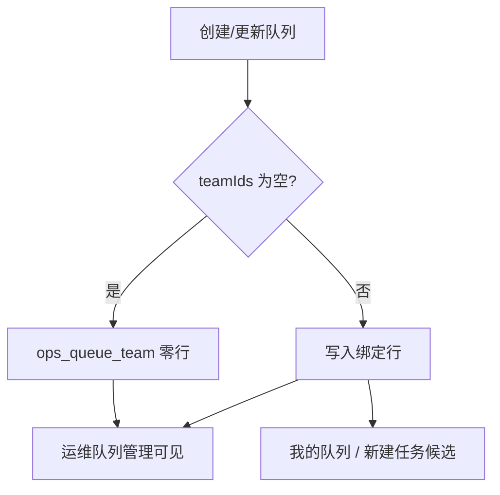

## Context

队列与团队是多对多，写在`ops_queue_team`。绑定只在队列管理维护，团队详情只读展示；无队列时显示空态。

队列创建/更新却把`teamIds`做成必填：API 有`required|min-length:1`，服务层`normalizeTeamIDs`在空列表时报「请至少关联一个团队」，前端 Zod `min(1)`并打必填星标。因此不能先建队列再绑团队，也不能解绑到零。

训练侧本来就按绑定过滤：非管理员只看所属团队的队列；提交任务要求「所选队列已关联该团队」。管理员`ListInCluster(allTeams=true)`目前返回集群内全部队列，在「队列必有团队」时与「全部已关联队列」等价。放开空绑定后，若不收紧，管理员会在「我的队列」和新建任务里看到无法提交的队列。

## Goals / Non-Goals

**Goals:**

- 创建、更新队列时`teamIds`可空；空表示不绑定或解除全部绑定。
- 队列表单与团队页一致：关联为选填，无绑定时列表显示「—」。
- 训练中心候选与「我的队列」仍只含至少绑定一个团队的队列。
- 所选团队必须存在，单次最多 100 个。

**Non-Goals:**

- 不在团队页增加队列写入入口。
- 不改额度、Volcano 同步、启停或删除。
- 不让未绑定团队的队列可提交任务。
- 不改数据库表结构。

## Decisions

1. **空`teamIds`表示「无绑定」，更新时全量替换**
   - 省略、`null`、`[]`语义相同。
   - `replaceTeams`先删后插，空列表即解绑全部。
   - 备选是更新时省略字段表示不改绑定。拒绝：当前 PUT 已全量传`teamIds`，改成补丁语义会让前端漏传时误删或误留绑定。

2. **校验下沉到服务层，API 只限制上限**
   - 去掉`required|min-length:1`，保留`max-length:100`。
   - `normalizeTeamIDs`：去重、丢弃`id<=0`；空则返回空切片；非空时查团队是否都存在。
   - 备选是只改前端。拒绝：直调 API 仍会被拦。

3. **`ListInCluster`即使`allTeams`也只返回已绑定团队的队列**
   - 运维`List`继续返回全部队列，无团队显示空数组。
   - 训练入口共用`ListInCluster`，与「管理员看到全部已关联队列」一致。
   - 提交任务已有「所选队列未关联该团队」，保持不变。
   - 备选是管理员也能看到未绑定队列。拒绝：选中后无法提交，和「已关联队列」语义冲突。

## 复杂度与性能

- 不新增抽象：改现有校验与`ListInCluster`过滤。
- `ListInCluster(allTeams)`在投影后丢掉`Teams`为空的项，不增加按队列循环查询。
- 空绑定不改列表批量投影路径。

## 规则影响

- 命中`api-contract.md`、`architecture.md`、`backend-go.md`、`testing.md`、`openspec.md`、`documentation.md`。
- 无 SQL 变更，`database.md`无影响。
- 无 i18n 语言包；校验与空态文案写中文（`.agents/rules/i18n.md`缺失）。
- `.agents/rules/frontend-ui.md`缺失，表单沿用现有`user-picker`与必填星标。

## Risks / Trade-offs

- [管理员在「我的队列」看不到刚建好、尚未绑团队的队列] → 按现有「已关联队列」语义处理；运维列表仍可见，绑团队后即出现。
- [旧客户端仍把空`teamIds`当错误] → 服务端放行后，旧前端自己拦；回滚 API 校验即可恢复必填。
- [误传不存在的团队 ID] → 仍返回「所选团队不存在」，不部分写入。

## Migration Plan

只发 API 与前端。已有带团队的队列不受影响。回滚即恢复`required|min-length:1`与前端`min(1)`。无需数据迁移。

## Open Questions

无。
