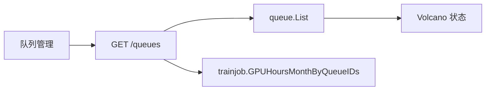

## Context

队列管理列表已支持关键词、数据中心、卡型号筛选，状态只展示为启用/禁用徽章。启用态来自`Volcano Queue`实时状态（`Open`为启用，`Closed`/`Closing`与同步失败为禁用），`ops_queue`没有`enabled`列。「我的队列」已按`GPU`数 × 运行时长核算本月卡时；运维列表没有该字段。`trainjob`已依赖`queue.Service`，队列服务不能反向依赖训练服务。

## Goals / Non-Goals

**Goals:**

- 运维可按启用/禁用筛选当前工作集群的队列，筛选结果与状态列一致。
- 运维列表每行展示本月卡时，算法与「我的队列」相同。
- 卡时按当前页队列 ID 一次批量装配。

**Non-Goals:**

- 不建卡时流水表，不改`ops_queue`表结构。
- 不筛选同步异常为独立状态（同步失败仍显示为禁用，计入禁用筛选）。
- 不改「我的队列」页面，不增加按卡时排序。

## Decisions

1. **状态筛选走`enabled *bool`，与用户列表相同**
   - 省略为全部，`true`启用，`false`禁用。前端下拉值为`all`/`enabled`/`disabled`。
   - 这是布尔投影，不是新业务枚举，不新增字典类型。页面文案沿用现有「启用」「禁用」。

2. **启用筛选在刷新`Volcano`之后、分页之前完成**
   - 启用态不在库中，无法在`SQL`侧过滤。
   - 未传`enabled`时仍先数据库过滤排序分页，再装配当前页。
   - 传入`enabled`时：先按集群/关键词/数据中心/卡型号查出最多`200`条（与`ListInCluster`上限一致），刷新`Volcano`后按启用态过滤，再内存分页。
   - 备选是落库`enabled`。拒绝：会与实时`Open`/`Closed`、同步异常漂移，筛选与徽章不一致。

3. **卡时由`trainjob.Service`批量投影，队列控制器装配**
   - 新增`GPUHoursMonthByQueueIDs`，复用现有自然月交集算法。
   - 队列控制器注入`trainjob.Service`（允许`nil`）。避免`queue`→`trainjob`循环依赖，也不另造窄接口。
   - 训练模块未装配时字段为`0`。装配查询失败则列表失败，避免把`0`展示成「本月无用量」。

4. **列标题为「本月卡时」**
   - 与「我的队列」同一口径，避免被理解成累计历史或当前占用。

5. **禁用确认框区分运行中与排队任务**
   - `CloseQueue`不中止已运行任务；排队任务不再被调度，需运维到任务列表手动终止。
   - 确认框必须写明该差异，不得再写「运行 / 排队均不受影响」。

## 复杂度与性能

- 不新增抽象层：沿用`queue.Service`与`trainjob.Service`。
- 单集群队列规模按`200`有界；状态筛选多一次全量刷新，与现有逐队列`GetQueue`成本同阶。
- 卡时查询次数不随页大小线性增加：一次`WhereIn queue_id`，上限`1000`条任务，再内存按队列求和。

## Risks / Trade-offs

- [传入`enabled`时无法数据库分页] → 上限`200`；超出时截断并保持与`ListInCluster`同一边界。
- [历史任务很多时卡时被`1000`条上限截断] → 与「我的队列」相同；本迭代不改流水方案。
- [训练中心关闭后列仍在、值为`0`] → 当前控制台已启用训练中心；模块启停隐藏策略待壳层有模块开关后再做。

## Migration Plan

只发 API 与前端。旧客户端忽略新字段即可。回滚时去掉筛选参数与列，行为回到原列表。

## Open Questions

无。
