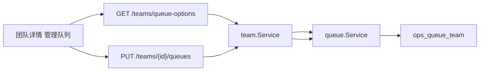

## Context

`ops_queue_team`是队列与团队的多对多。队列创建/更新已能改`teamIds`。团队详情只展示投影，文案要求去「队列管理」维护。原型在「关联队列」旁有「管理队列」，弹窗勾选后保存。

跨模块：关联表归队列模块。团队服务不得直写`dao.OpsQueueTeam`，通过已注入的`QueueSource`委托。

## Goals / Non-Goals

**Goals:**

- 管理员可在团队详情绑定或解绑队列。
- 保存为该团队的全量替换；空表示解绑全部。
- 候选项一次分页查出，禁止按队列循环请求。

**Non-Goals:**

- 不在团队页创建队列。
- 不改队列管理里的团队多选。
- 不按工作集群过滤候选项（平台中心无工作集群）。

## Decisions

1. **`PUT /teams/{id}/queues`全量替换**
   - `queueIds`最多 100，可空。
   - 权限`platform:team:update`。
   - 只删该`team_id`的关联行，再插入选中队列。其他团队绑定不变。
   - 备选是逐条`POST`/`DELETE`。拒绝：原型是一次勾选保存。

2. **`GET /teams/queue-options`给弹窗**
   - 权限`platform:team:query`。关键词可选，分页最多 100。
   - 不复用`GET /queues`：后者要求`clusterId`且权限是`ops:queue:query`。
   - 无队列模块时返回空列表。

3. **契约放在`team.QueueSource`**
   - 增加`ListBindOptions`与`ReplaceQueuesForTeam`。
   - `queue.Service`实现；团队构造仍只注入`QueueSource`。
   - 不在团队包访问队列`DAO`。

## 复杂度与性能

- 候选项：1 次分页查队列 + 现有批量投影，无`N+1`。
- 替换：1 次按团队删除 + 批量插入，条数 ≤ 100。

## 规则影响

- 命中`api-contract.md`、`architecture.md`、`backend-go.md`、`testing.md`、`openspec.md`、`documentation.md`。
- 无 SQL 变更，`database.md`无影响。
- `.agents/rules/frontend-ui.md`与`.agents/rules/i18n.md`缺失。

## Risks / Trade-offs

- [团队侧解绑后训练不可见该队列] → 与队列页清空`teamIds`相同。
- [候选项跨集群] → 平台中心无工作集群，选项带数据中心以便区分。

## Migration Plan

只发 API 与前端。旧客户端仍只读。回滚即去掉按钮与新接口。

## Open Questions

无。
