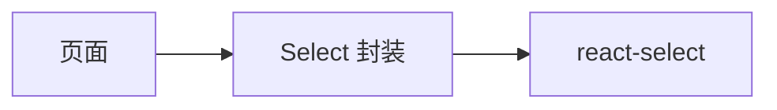

## Context

前端没有下拉组件，各页直接写原生`select`。工具栏用`.filter-select`，表单用`.form-group > select`，顶栏工作集群与分页每页条数另有样式。已引入`@radix-ui/react-dialog`，没有 Ant Design / MUI。弹窗内的原生下拉会被裁切；团队、队列、卡型号、集群选项会随数据变长，原生控件不能输入过滤。`react-hook-form`目前用`register`绑原生`select`。

## Goals / Non-Goals

**Goals:**

- 所有选择类下拉打开后可输入关键字，按选项可见文案过滤。
- 页面只依赖共享`Select`，不直接引用第三方选择器。
- 外观与现有高度、圆角、边框、主题变量一致。
- 弹窗内菜单不被裁切；键盘方向键、回车、`Esc`可用。

**Non-Goals:**

- 不做多选（队列关联团队仍用现有 picker）。
- 不做远程异步搜索，选项仍由调用方一次传入。
- 不改列表接口或下拉数据源。
- 不把复选框、单选组改成下拉。

## Decisions

1. **用`react-select`，不用 Radix Select / cmdk**
   - `react-select`是专用可搜索下拉，默认带过滤、键盘、禁用、无匹配文案，社区使用面大。
   - `@radix-ui/react-select`只有首字母跳转，没有输入框，不满足关键字搜索。
   - `cmdk`加 Popover 是命令面板拼装，要自己补选择器语义，和「用成熟组件管理下拉」不符。
   - 不引入 Ant Design / MUI，避免和第二套视觉体系冲突。

2. **页面只走`components/Select`**
   - 封装`value`/`options`/`onChange`（值为字符串），内部映射`react-select`的 option 对象。
   - `isSearchable`恒为真；`noOptionsMessage`固定「无匹配选项」。
   - `menuPortalTarget`为`document.body`，`z-index`高于`Modal`。
   - 过滤用默认`filterOption`（匹配`label`），不必自写。
   - 变体用`className`区分工具栏、表单、紧凑（集群/分页），CSS 变量跟浅色/深色。

3. **覆盖范围包含分页与禁用态**
   - 「所有下拉」包括每页条数和工作集群；选项少时不输入也能点选。
   - 只读展示（新建任务里由队列决定的卡型号）同样用`Select`并`disabled`，避免混用原生控件。

4. **表单用`Controller`，不再`register`原生`select`**
   - `react-select`不是原生控件。`JobCreatePage`、`QueuePage`等改为`Controller`或`setValue`。
   - `id`通过`inputId`接到`label htmlFor`，校验`aria-invalid`仍落在可聚焦输入上。

5. **E2E 不再对原生`select`调`selectOption`**
   - 增加助手：按`aria-label`或关联`label`打开，必要时输入关键字，再点`role=option`。
   - `react-select`的 combobox 不是 HTML`select`，旧写法会失败。

## 复杂度与性能

- 不新增抽象层：一个封装组件 + 换调用点。
- 选项规模与现有下拉相同（团队列表上限`100`），客户端过滤成本可忽略。

## Risks / Trade-offs

- [`react-select`带`emotion`运行时] → 只在`Select`内使用，页面不写`css` prop；可接受的依赖成本。
- [样式和原型原生`select`有像素差] → 用现有`40px`高度、`8px`圆角、`--control-*`变量约束。
- [E2E 大面积改选择方式] → 集中助手，按页替换`selectOption`。
- [长团队名把工具栏挤窄] → 沿用`.filter-select`的`min-width`，选中项省略号截断。

## Migration Plan

只发前端。回滚时去掉`Select`与`react-select`依赖，恢复原生`select`。

## Open Questions

无。
