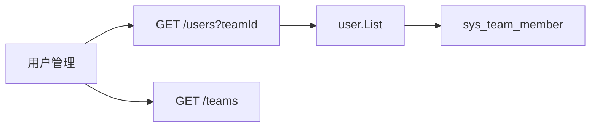

## Context

用户管理工具栏已有关键词、角色、启用状态下拉；列表「所属团队」列由`user.List`在分页后批量投影`sys_team_member`。`GET /users`尚无团队条件，筛选发生在`sys_user`单表。训练任务列表、配置列表已用可选`teamId`（`0`或省略为全部）。管理员同时拥有`platform:user:query`与`platform:team:query`，可复用`GET /teams`填下拉。`sys_team_member`已有`(team_id, user_id)`唯一索引。

## Goals / Non-Goals

**Goals:**

- 管理员可按单个团队收窄用户列表，结果与「所属团队」列一致。
- 筛选在数据库侧完成后再分页、再装配当前页角色与团队。
- 下拉交互对齐任务列表：`全部团队`加现有团队名称，变更回到第`1`页。

**Non-Goals:**

- 不增加「未加入团队」筛选项。
- 不支持多团队同时筛选。
- 不新增团队下拉专用接口，不改`GET /teams`契约。
- 不改团队成员维护、用户启停/授权/移除。
- 不为`teamId`建字典类型；它是外键，不是枚举。

## Decisions

1. **`teamId`语义与训练列表对齐**
   - `GET /users`增加可选`teamId`（`int64`）。省略或`0`为全部；大于`0`只返回该团队成员。
   - 一人可属多团队：只要成员关系包含所选`teamId`即命中。
   - 不存在的`teamId`返回空列表，不报错。
   - 备选是字符串哨兵或`unassigned`布尔。拒绝：与`GET /training/jobs`、`GET /training/configs`不一致，且本迭代不做无团队筛选。

2. **过滤走成员表子查询，不注入`team.Service`**
   - `user.listModel`在已有关键词/角色/状态条件上增加：`sys_user.id IN (SELECT user_id FROM sys_team_member WHERE team_id = ?)`。
   - `user`列表已经直接读`sys_team_member`做投影，过滤不新增跨模块契约，也不把`DAO`泄漏给控制器。
   - 备选是注入`team.Service`查成员 ID 再`WhereIn`。拒绝：多一次服务跳转，成员很多时 ID 列表无界，且会把列表过滤绑到团队写模型。

3. **下拉复用`GET /teams`，`pageSize=100`**
   - 用户管理与团队管理同属平台中心，管理员本就可以列团队。
   - 不走`GET /training/teams`：那是训练可见团队，权限与投影不同。
   - 团队数量按平台现有列表上限`100`视为有界；超出时下拉截断，与`GET /teams`上限一致。本迭代不另做无分页候选接口。

4. **前端状态放在`UserPage`本地，不写入 URL**
   - 现有角色、状态筛选也不进 query。团队筛选与它们同一套：`useState` + `queryKey`含`teamId`。
   - 备选是`?teamId=`深链。拒绝：用户管理没有从其他页跳入并预选团队的入口。

## 复杂度与性能

- 不新增抽象层：只扩展`ListReq`/`ListInput`和`listModel`条件。
- 过滤在`Count`与`Page`之前，当前页团队投影路径不变，禁止按行补查。
- 成员表按`team_id`走已有唯一索引；子查询结果随该团队人数有界。

## Risks / Trade-offs

- [团队超过`100`个时下拉不完整] → 与现有团队列表上限相同；超出后再做候选接口。
- [软删团队仍可能残留成员行] → 下拉只含未删除团队，用户不会选到已删 ID；投影本就会丢掉已删团队名称。
- [与角色/状态组合后某页变空] → 与现有筛选相同，展示「暂无平台用户」空态。

## Migration Plan

只发 API 与前端。旧客户端不传`teamId`，行为与现在一致。回滚时去掉参数与下拉即可。

## Open Questions

无。
